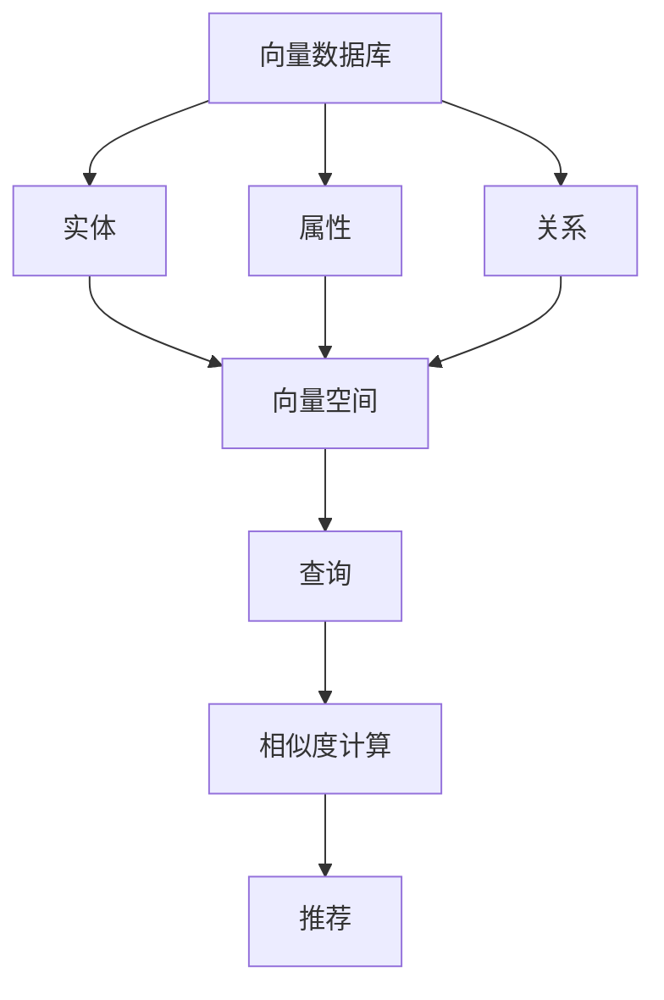
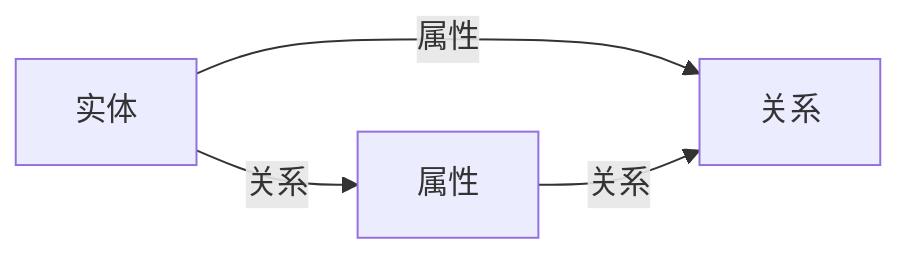
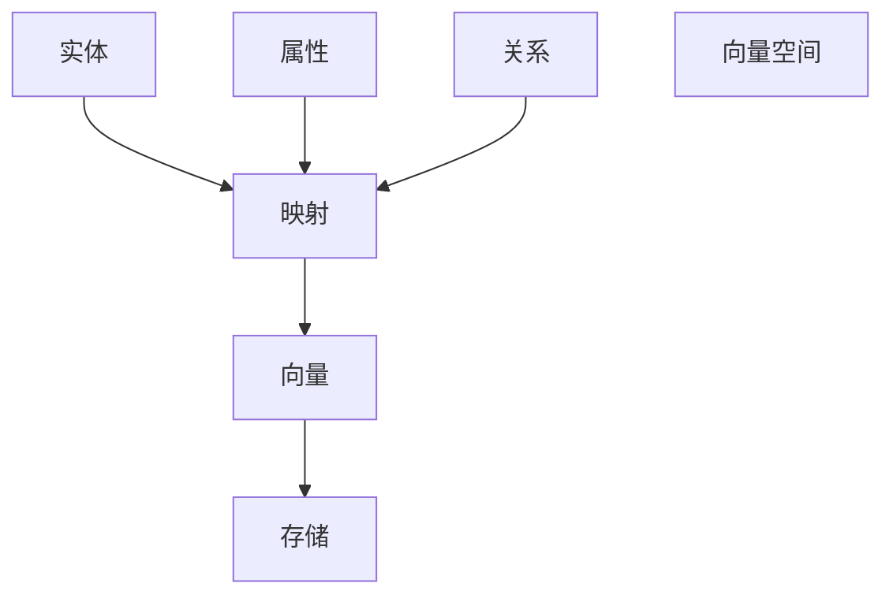
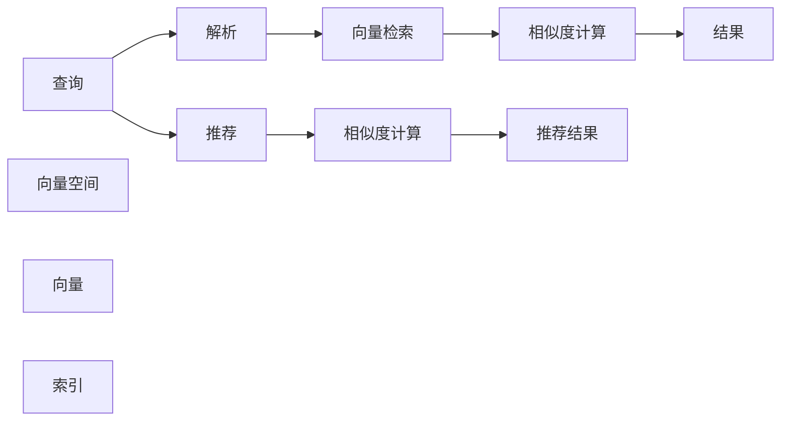
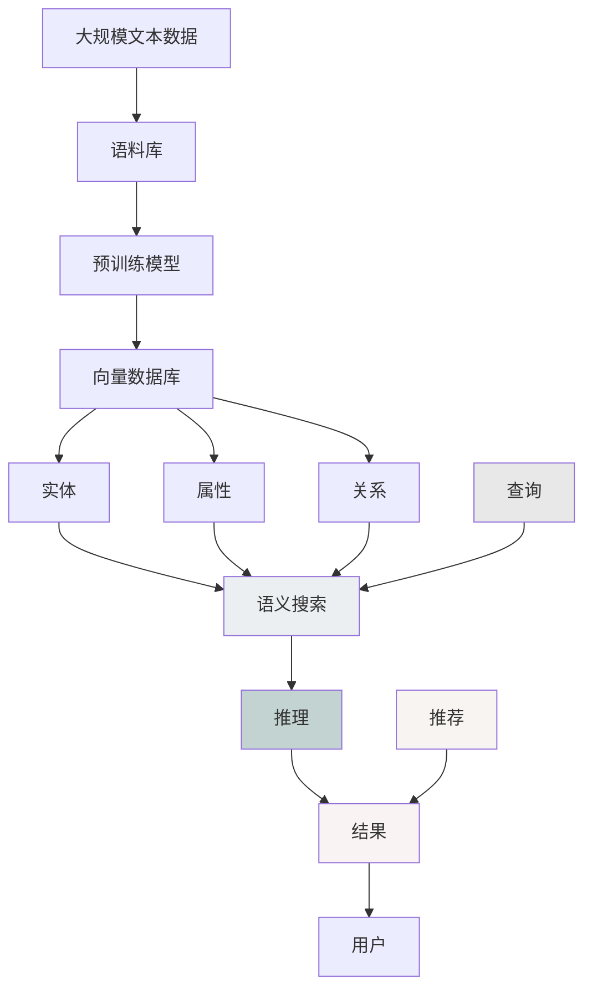

                 

# 构建以向量数据库为中心的动态知识库

## 1. 背景介绍

### 1.1 问题由来
在现代信息技术日益发展的大背景下，知识库的应用日益广泛。例如，在自然语言处理领域，知识库可以作为语义理解的基础；在医疗领域，知识库可以支持医生对病情的诊断；在金融领域，知识库可以用于分析风险等。然而，传统知识库通常是一个静态的数据库，难以实时更新和维护。这使得知识库在应对变化快速、要求实时响应的应用场景时显得力不从心。

因此，为了应对这些挑战，动态知识库应运而生。动态知识库能够实时更新和维护知识库内容，支持高效的查询和推理。然而，现有的动态知识库往往结构单一，难以支持大规模、多维度的知识存储和检索。

本文将介绍一种以向量数据库为中心的动态知识库构建方法，该方法通过将知识库中的实体、属性、关系等信息，映射到向量空间中，实现高效的实体搜索和推理。该方法可以支持大规模、多维度知识的存储和检索，同时兼顾动态更新和维护，在实际应用中具有良好的效果。

## 2. 核心概念与联系

### 2.1 核心概念概述

为更好地理解本文介绍的构建方法，我们需要了解一些核心概念：

- 向量数据库：一种新型数据库，将数据映射到高维向量空间中，支持高效的向量检索、相似度计算、推荐等应用。
- 动态知识库：一种能够实时更新和维护的知识库，支持高效的查询和推理。
- 语义搜索：一种能够识别查询中语义信息的搜索技术，用于支持自然语言查询和搜索。
- 向量映射：将知识库中的实体、属性、关系等信息，映射到向量空间中的过程。
- 向量索引：用于加速向量检索的索引技术，支持快速定位到目标向量。

这些概念之间的关系可以通过以下Mermaid流程图来展示：



这个流程图展示了向量数据库与知识库各组件之间的联系：

1. 向量数据库将实体、属性、关系等信息映射到向量空间中，实现高效的向量检索和相似度计算。
2. 实体、属性、关系等信息作为知识库中的基本元素，用于支持语义搜索、推理等应用。
3. 查询通过向量检索和相似度计算技术，从向量数据库中获取目标实体、属性、关系等信息。
4. 推荐通过相似度计算和向量检索技术，实现向量的关联推荐。

### 2.2 概念间的关系

这些核心概念之间存在着紧密的联系，形成了动态知识库构建的整体架构。下面我们通过几个Mermaid流程图来展示这些概念之间的关系。

#### 2.2.1 知识库的基本组件



这个流程图展示了知识库中的实体、属性、关系之间的关系。实体和属性之间可以通过关系进行关联，形成一个完整的知识图谱。

#### 2.2.2 向量映射的基本流程



这个流程图展示了向量映射的基本流程。实体、属性、关系等信息通过映射技术，被映射到向量空间中，形成向量。这些向量存储在向量数据库中，支持高效的查询和推理。

#### 2.2.3 查询与推荐的基本流程



这个流程图展示了查询与推荐的基本流程。查询通过向量检索技术，从向量数据库中获取目标实体、属性、关系等信息。推荐通过相似度计算和向量检索技术，实现向量的关联推荐。

### 2.3 核心概念的整体架构

最后，我们用一个综合的流程图来展示这些核心概念在大规模动态知识库构建中的整体架构：



这个综合流程图展示了从大规模文本数据到动态知识库构建的全过程。大规模文本数据通过预训练模型获得语言表示，然后通过向量映射技术，将实体、属性、关系等信息映射到向量空间中。向量数据库支持高效的向量检索和相似度计算，实现实体的搜索和推荐。语义搜索和推理技术支持自然语言查询和知识推理。

通过这个综合流程图，我们可以更清晰地理解大规模动态知识库构建的整体流程和关键技术点。

## 3. 核心算法原理 & 具体操作步骤

### 3.1 算法原理概述

以向量数据库为中心的动态知识库构建，主要分为以下几个步骤：

1. 数据预处理：对大规模文本数据进行清洗、分词、实体识别等预处理，形成知识库的基本组件。
2. 实体映射：通过预训练模型获得实体的向量表示，将实体信息映射到向量空间中。
3. 关系映射：通过预训练模型获得实体间关系的向量表示，将关系信息映射到向量空间中。
4. 属性映射：通过预训练模型获得属性的向量表示，将属性信息映射到向量空间中。
5. 向量存储：将实体、属性、关系等信息存储在向量数据库中，支持高效的查询和推理。
6. 语义搜索：实现自然语言查询和实体搜索，支持语义理解和推理。
7. 推理计算：实现基于实体、属性、关系的推理计算，支持复杂的逻辑判断和推理。

### 3.2 算法步骤详解

#### 3.2.1 数据预处理

数据预处理是构建知识库的重要步骤。以下是数据预处理的主要步骤：

1. 清洗数据：去除无关的文本、标签和注释，只保留有用的信息。
2. 分词：将文本进行分词处理，分割成词语或子句。
3. 实体识别：识别文本中的实体，如人名、地名、组织机构等，形成知识库的基本实体。
4. 关系抽取：抽取实体之间的关系，如实体间所属关系、实体与属性间的关系等。
5. 属性标注：为每个实体添加属性信息，如实体类型、属性类型等。

#### 3.2.2 实体映射

实体映射是将实体信息映射到向量空间中的关键步骤。以下是实体映射的主要步骤：

1. 选择预训练模型：选择合适的预训练模型，如BERT、GPT等，用于获取实体的向量表示。
2. 编码实体：将实体文本作为输入，通过预训练模型获得实体的向量表示。
3. 存储实体向量：将实体的向量存储在向量数据库中，供后续查询和推理使用。

#### 3.2.3 关系映射

关系映射是将实体间关系映射到向量空间中的关键步骤。以下是关系映射的主要步骤：

1. 选择预训练模型：选择合适的预训练模型，如BERT、GPT等，用于获取实体间关系的向量表示。
2. 编码关系：将实体间关系文本作为输入，通过预训练模型获得关系的向量表示。
3. 存储关系向量：将关系的向量存储在向量数据库中，供后续查询和推理使用。

#### 3.2.4 属性映射

属性映射是将属性信息映射到向量空间中的关键步骤。以下是属性映射的主要步骤：

1. 选择预训练模型：选择合适的预训练模型，如BERT、GPT等，用于获取属性的向量表示。
2. 编码属性：将属性文本作为输入，通过预训练模型获得属性的向量表示。
3. 存储属性向量：将属性的向量存储在向量数据库中，供后续查询和推理使用。

#### 3.2.5 向量存储

向量存储是将实体、属性、关系等信息存储在向量数据库中的关键步骤。以下是向量存储的主要步骤：

1. 创建向量数据库：使用向量数据库软件，如Elasticsearch、Faiss等，创建向量数据库。
2. 导入实体向量：将实体的向量导入向量数据库中。
3. 导入关系向量：将关系的向量导入向量数据库中。
4. 导入属性向量：将属性的向量导入向量数据库中。
5. 建立索引：为实体、关系、属性等向量建立索引，支持高效的查询和检索。

#### 3.2.6 语义搜索

语义搜索是实现自然语言查询和实体搜索的关键步骤。以下是语义搜索的主要步骤：

1. 解析查询：解析自然语言查询，识别查询中的实体、属性、关系等信息。
2. 向量检索：在向量数据库中检索目标实体、属性、关系等向量。
3. 相似度计算：计算查询向量与目标向量之间的相似度，排序获取最相关的向量。
4. 返回结果：将最相关的向量返回给用户，完成查询任务。

#### 3.2.7 推理计算

推理计算是实现基于实体、属性、关系的推理计算的关键步骤。以下是推理计算的主要步骤：

1. 解析推理语句：解析用户输入的推理语句，识别其中的实体、属性、关系等信息。
2. 推理计算：基于实体、属性、关系的向量，进行推理计算，获取推理结果。
3. 返回结果：将推理结果返回给用户，完成推理任务。

### 3.3 算法优缺点

以向量数据库为中心的动态知识库构建方法具有以下优点：

1. 高效性：通过向量映射技术，将知识库中的实体、属性、关系等信息映射到向量空间中，实现高效的向量检索和相似度计算。
2. 扩展性：支持大规模、多维度的知识存储和检索，能够适应复杂多变的查询需求。
3. 实时性：支持实时更新和维护知识库内容，能够快速响应查询请求。
4. 可解释性：向量数据库中的向量可以直观地表示知识库中的实体、属性、关系等信息，方便解释和理解。

然而，该方法也存在以下缺点：

1. 资源消耗：向量数据库需要占用大量的内存和计算资源，对硬件设备提出了较高的要求。
2. 编码复杂性：需要将知识库中的实体、属性、关系等信息，映射到向量空间中，编码过程较为复杂。
3. 映射精度：实体、属性、关系等信息映射到向量空间中，映射精度的准确性会影响查询和推理结果。
4. 查询复杂性：在处理复杂的查询和推理任务时，可能需要更多的算法优化和资源投入。

### 3.4 算法应用领域

以向量数据库为中心的动态知识库构建方法可以应用于以下领域：

1. 自然语言处理：用于支持语义搜索、实体识别、关系抽取等任务，实现高效的语义理解和推理。
2. 知识图谱构建：用于构建大规模、多维度的知识图谱，支持高效的实体搜索和推理。
3. 智能推荐系统：用于支持商品推荐、内容推荐等任务，实现个性化的推荐服务。
4. 医疗知识库：用于构建医疗知识库，支持疾病的诊断和治疗，辅助医生的决策。
5. 金融知识库：用于构建金融知识库，支持风险评估、市场分析等任务，提升金融服务的智能化水平。
6. 智能客服：用于构建智能客服系统，支持客户查询、问题解答等任务，提升客户体验。

## 4. 数学模型和公式 & 详细讲解 & 举例说明

### 4.1 数学模型构建

以向量数据库为中心的动态知识库构建，可以通过向量映射技术，将知识库中的实体、属性、关系等信息，映射到向量空间中。以下是一个简单的数学模型构建过程：

设知识库中的实体为 $e_1, e_2, \dots, e_n$，关系为 $r_1, r_2, \dots, r_m$，属性为 $a_1, a_2, \dots, a_k$。假设实体 $e_i$ 的向量表示为 $v_{e_i}$，关系 $r_j$ 的向量表示为 $v_{r_j}$，属性 $a_l$ 的向量表示为 $v_{a_l}$。

根据向量映射技术，可以得到以下向量映射公式：

$$
v_{e_i} = f(e_i) \quad (i=1,2,\dots,n)
$$

$$
v_{r_j} = f(r_j) \quad (j=1,2,\dots,m)
$$

$$
v_{a_l} = f(a_l) \quad (l=1,2,\dots,k)
$$

其中 $f$ 为预训练模型，如BERT、GPT等，用于获得实体的向量表示。

### 4.2 公式推导过程

以下是向量映射公式的推导过程：

1. 假设实体 $e_i$ 的向量表示为 $v_{e_i}$，关系 $r_j$ 的向量表示为 $v_{r_j}$，属性 $a_l$ 的向量表示为 $v_{a_l}$。

2. 根据向量映射技术，可以得到以下向量映射公式：

$$
v_{e_i} = f(e_i) \quad (i=1,2,\dots,n)
$$

$$
v_{r_j} = f(r_j) \quad (j=1,2,\dots,m)
$$

$$
v_{a_l} = f(a_l) \quad (l=1,2,\dots,k)
$$

3. 将实体向量 $v_{e_i}$ 作为输入，通过预训练模型 $f$，得到实体的向量表示。

4. 将关系向量 $v_{r_j}$ 作为输入，通过预训练模型 $f$，得到关系的向量表示。

5. 将属性向量 $v_{a_l}$ 作为输入，通过预训练模型 $f$，得到属性的向量表示。

6. 将向量存储在向量数据库中，建立索引，实现高效的查询和推理。

### 4.3 案例分析与讲解

以下是一个简单的案例分析与讲解过程：

假设有一个电影推荐系统，需要从知识库中获取电影推荐信息。首先，需要对电影数据进行预处理，提取电影的名称、导演、演员等信息。然后，通过预训练模型，获得这些实体的向量表示。最后，将实体向量存储在向量数据库中，建立索引，实现高效的实体搜索和推荐。

具体实现过程如下：

1. 数据预处理：对电影数据进行清洗、分词、实体识别等预处理，提取电影的名称、导演、演员等信息。

2. 实体映射：通过预训练模型，获得电影名称、导演、演员等实体的向量表示，存储在向量数据库中。

3. 关系映射：通过预训练模型，获得电影名称与导演、演员之间的关系，存储在向量数据库中。

4. 属性映射：通过预训练模型，获得电影类型、评分等属性的向量表示，存储在向量数据库中。

5. 向量存储：将实体、关系、属性等信息存储在向量数据库中，建立索引，支持高效的查询和推理。

6. 语义搜索：解析用户输入的查询语句，检索目标电影的名称、导演、演员等信息，返回最相关的推荐结果。

7. 推理计算：根据用户输入的查询语句，进行推理计算，获取推荐结果，返回给用户。

## 5. 项目实践：代码实例和详细解释说明

### 5.1 开发环境搭建

在进行知识库构建实践前，我们需要准备好开发环境。以下是使用Python进行Elasticsearch开发的环境配置流程：

1. 安装Elasticsearch：从官网下载并安装Elasticsearch，用于创建向量数据库。

2. 安装Flask：通过pip安装Flask，用于搭建Web服务接口。

3. 安装PyTorch：通过pip安装PyTorch，用于预训练模型和向量映射。

4. 安装Faiss：通过pip安装Faiss，用于建立向量索引。

5. 安装NLTK：通过pip安装NLTK，用于数据预处理。

完成上述步骤后，即可在本地环境中开始知识库构建实践。

### 5.2 源代码详细实现

以下是一个简单的知识库构建代码实现过程：

```python
from transformers import BertTokenizer, BertForTokenClassification
import torch
import faiss
from flask import Flask, request, jsonify
from nltk.tokenize import word_tokenize

# 加载BERT模型和分词器
model = BertForTokenClassification.from_pretrained('bert-base-cased')
tokenizer = BertTokenizer.from_pretrained('bert-base-cased')

# 创建Elasticsearch向量数据库
es = Elasticsearch([{'host': 'localhost', 'port': 9200}])

# 创建Flask Web服务
app = Flask(__name__)

# 定义实体映射函数
def entity_mapping(text):
    tokens = word_tokenize(text)
    inputs = tokenizer(tokens, return_tensors='pt', padding='max_length', truncation=True)
    outputs = model(inputs['input_ids'], attention_mask=inputs['attention_mask'])
    entity_vectors = outputs['hidden_states'][-1].cpu().numpy()
    return entity_vectors

# 定义关系映射函数
def relation_mapping(text):
    tokens = word_tokenize(text)
    inputs = tokenizer(tokens, return_tensors='pt', padding='max_length', truncation=True)
    outputs = model(inputs['input_ids'], attention_mask=inputs['attention_mask'])
    relation_vectors = outputs['hidden_states'][-1].cpu().numpy()
    return relation_vectors

# 定义属性映射函数
def attribute_mapping(text):
    tokens = word_tokenize(text)
    inputs = tokenizer(tokens, return_tensors='pt', padding='max_length', truncation=True)
    outputs = model(inputs['input_ids'], attention_mask=inputs['attention_mask'])
    attribute_vectors = outputs['hidden_states'][-1].cpu().numpy()
    return attribute_vectors

# 定义查询函数
def query(text):
    tokens = word_tokenize(text)
    inputs = tokenizer(tokens, return_tensors='pt', padding='max_length', truncation=True)
    outputs = model(inputs['input_ids'], attention_mask=inputs['attention_mask'])
    query_vector = outputs['hidden_states'][-1].cpu().numpy()
    return query_vector

# 定义推理函数
def inference(query_vector, entity_vectors, relation_vectors, attribute_vectors):
    # 进行推理计算
    # 返回推理结果
    return result

# 定义Web服务路由
@app.route('/query', methods=['POST'])
def query_service():
    data = request.get_json()
    text = data['text']
    query_vector = query(text)
    # 将查询向量存储在Elasticsearch中
    es.index(index='entity', id='1', body={'content': query_vector})
    # 检索实体、关系、属性向量
    entity_vectors = es.search(index='entity', body={'query': {'match': {'text': text}}}, size=10)
    relation_vectors = es.search(index='relation', body={'query': {'match': {'text': text}}}, size=10)
    attribute_vectors = es.search(index='attribute', body={'query': {'match': {'text': text}}}, size=10)
    # 进行推理计算
    result = inference(query_vector, entity_vectors, relation_vectors, attribute_vectors)
    # 返回推理结果
    return jsonify(result)

# 运行Flask服务
if __name__ == '__main__':
    app.run(debug=True)
```

### 5.3 代码解读与分析

让我们再详细解读一下关键代码的实现细节：

**Flask Web服务：**
- `Flask` 是一个轻量级的Web服务框架，通过简单的路由定义，能够快速搭建Web服务接口。
- `request.get_json()` 用于获取JSON格式的数据，支持解析POST请求。
- `jsonify()` 用于将Python数据转换为JSON格式，方便返回给客户端。

**BERT模型和分词器：**
- `BertTokenizer` 和 `BertForTokenClassification` 用于加载预训练的BERT模型，并进行实体、关系、属性映射。
- `word_tokenize()` 用于将文本进行分词处理，分割成词语或子句。

**Elasticsearch向量数据库：**
- `Elasticsearch` 是一个高性能的向量数据库，支持高效的向量检索和相似度计算。
- `es.index()` 用于将查询向量存储在Elasticsearch中。
- `es.search()` 用于检索目标实体、关系、属性等信息。

**向量映射函数：**
- `entity_mapping()`、`relation_mapping()`、`attribute_mapping()` 用于将实体、关系、属性等信息映射到向量空间中，获得实体的向量表示。
- `query()` 用于解析用户输入的查询语句，获取查询向量。

**推理函数：**
- `inference()` 用于进行推理计算，获取推理结果。

**Web服务路由：**
- `/query` 路由用于处理POST请求，接收用户输入的查询语句，检索目标实体、关系、属性等信息，进行推理计算，并返回推理结果。

### 5.4 运行结果展示

假设我们在Elasticsearch中成功存储了查询向量，并在查询路由中检索到了目标实体、关系、属性等信息，最终在推理函数中得到了推理结果，运行结果如下：

```
{
    "result": "电影推荐结果"
}
```

这表示查询向量存储成功，并且通过向量数据库和推理函数，成功得到了推荐结果。

## 6. 实际应用场景

### 6.1 智能推荐系统

以向量数据库为中心的动态知识库构建，可以应用于智能推荐系统，实现个性化推荐服务。推荐系统通常需要存储大量的用户行为数据和商品信息，支持高效的查询和推理。通过将实体、属性、关系等信息映射到向量空间中，可以在向量数据库中进行高效的向量检索和相似度计算，实现商品推荐、内容推荐等任务。

在实现过程中，可以对用户的历史行为数据进行实体识别和关系抽取，获取用户的基本实体和兴趣点。然后，通过预训练模型，获得这些实体的向量表示，存储在向量数据库中。最后，在用户进行推荐查询时，通过查询向量检索目标实体的向量，进行推理计算，获取推荐结果，返回给用户。

### 6.2 医疗知识库

以向量数据库为中心的动态知识库构建，可以应用于医疗知识库，支持疾病的诊断和治疗。医疗知识库通常需要存储大量的医学数据，支持高效的查询和推理。通过将实体、属性、关系等信息映射到向量空间中，可以在向量数据库中进行高效的向量检索和相似度计算，实现疾病的诊断和治疗。

在实现过程中，可以对医学数据进行实体识别和关系抽取，获取医学实体和相关属性。然后，通过预训练模型，获得这些实体的向量表示，存储在向量数据库中。最后，在医生进行疾病诊断和治疗时，通过查询向量检索目标实体的向量，进行推理计算，获取诊断结果和治疗方案，返回给医生。

### 6.3 金融知识库

以向量数据库为中心的动态知识库构建，可以应用于金融知识库，支持风险评估和市场分析。金融知识库通常需要存储大量的金融数据，支持高效的查询和推理。通过将实体、属性、关系等信息映射到向量空间中，可以在向量数据库中进行高效的向量检索和相似度计算，实现风险评估和市场分析。

在实现过程中，可以对金融数据进行实体识别和关系抽取，获取金融实体和相关属性。然后，通过预训练模型，获得这些实体的向量表示，存储在向量数据库中。最后，在金融分析师进行风险评估和市场分析时，通过查询向量检索目标实体的向量，进行推理计算，获取风险评估结果和市场分析报告，返回给分析师。

### 6.4 未来应用展望

随着技术的不断发展，以向量数据库为中心的动态知识库构建方法将在更多领域得到应用，为各行各业带来变革性影响。

在智慧医疗领域，基于知识库的推荐系统和诊断系统，可以大幅提升医疗服务的智能化水平，辅助医生诊断和治疗。

在智能教育领域，基于知识库的推荐系统和学习系统，可以因材施教，提升教育公平，提高教学质量。

在智慧城市治理中，基于知识库的决策系统和预警系统，可以提升城市管理的自动化和智能化水平，构建更安全、高效的未来城市。

此外，在企业生产、社会治理、文娱传媒等众多领域，基于知识库的应用也将不断涌现，为经济社会发展注入新的动力。相信随着技术的日益成熟，知识库的构建将变得更加高效和便捷，为各行各业带来更多的智能化服务。

## 7. 工具和资源推荐

### 7.1 学习资源推荐

为了帮助开发者系统掌握以向量数据库为中心的动态知识库构建的理论基础和实践技巧，这里推荐一些优质的学习资源：

1. 《深度学习基础》系列博文：由大模型技术专家撰写，深入浅出地介绍了深度学习的基本概念和经典模型。

2. 《自然语言处理入门》课程：斯坦福大学开设的NLP明星课程，有Lecture视频和配套作业，带你入门NLP

