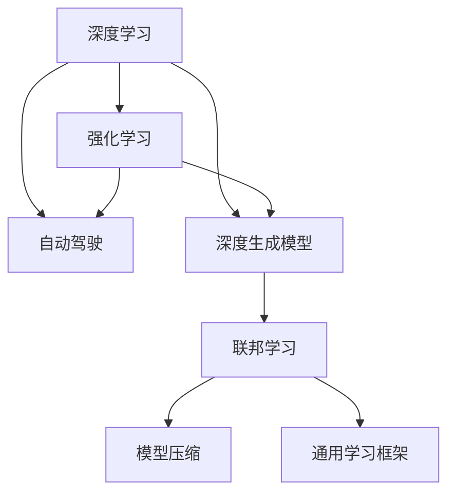
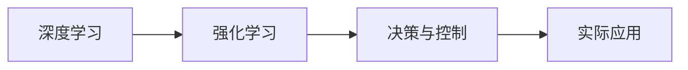
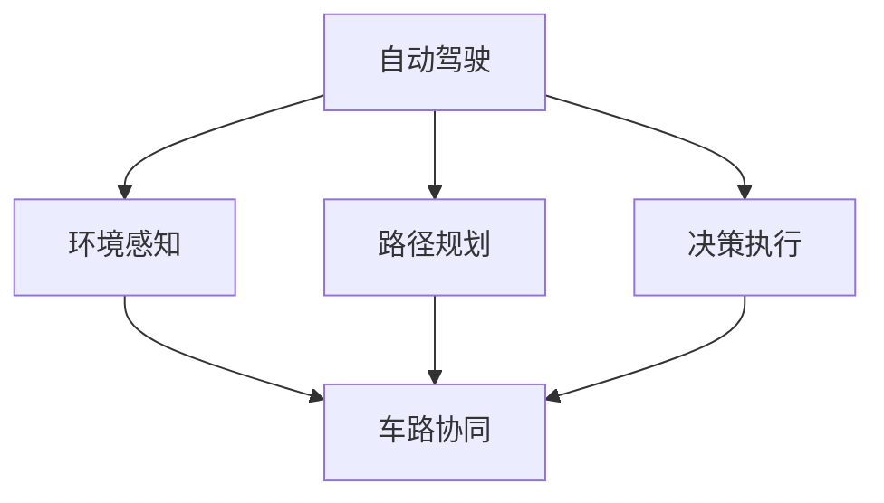
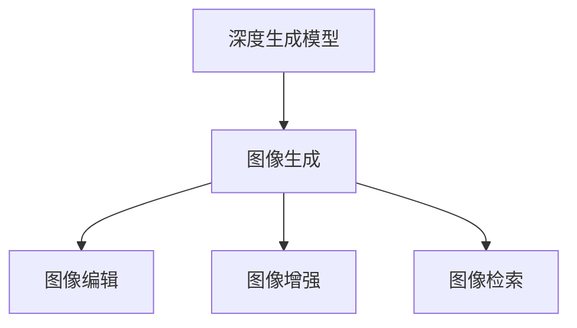
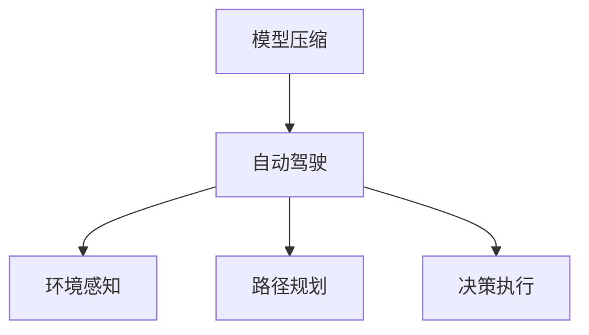
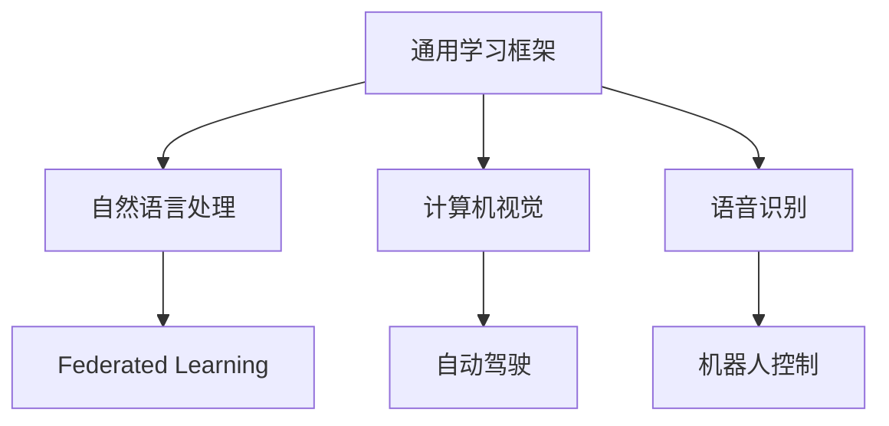
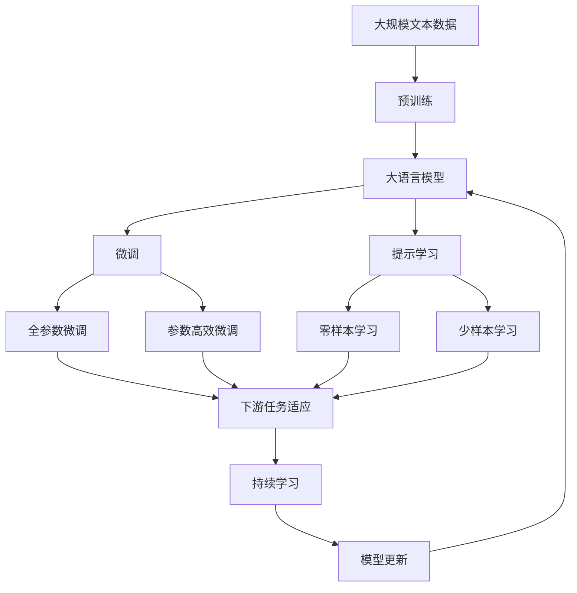

                 

# Andrej Karpathy：人工智能的未来发展目标

> 关键词：Andrej Karpathy, 人工智能, 未来目标, 深度学习, 强化学习, 自动驾驶, 医学诊断, 深度生成模型, 模型压缩, 联邦学习

## 1. 背景介绍

### 1.1 问题由来
人工智能（AI）在过去几年中取得了显著进展，尤其在深度学习（Deep Learning, DL）和强化学习（Reinforcement Learning, RL）两个方向上取得了令人瞩目的成果。Andrej Karpathy，作为斯坦福大学计算机科学教授、硅谷知名AI专家，以其在深度学习和自动驾驶领域的贡献闻名。他在机器视觉、自动驾驶、深度生成模型等领域的见解，深受业界和学术界关注。

### 1.2 问题核心关键点
Andrej Karpathy认为，AI的未来发展方向主要有以下几个核心关键点：
- **深度学习与强化学习的融合**：在未来，深度学习与强化学习将更加紧密地结合，以应对复杂的决策和控制任务。
- **自动驾驶与车路协同**：自动驾驶技术需要与车路协同系统深度融合，以实现更高效、更安全的驾驶。
- **深度生成模型的广泛应用**：深度生成模型将在图像生成、语音合成、文本创作等领域发挥重要作用。
- **联邦学习与隐私保护**：在大规模数据集上训练的深度模型需要联邦学习等技术，以保护用户隐私和数据安全。
- **模型压缩与高效推理**：深度模型的庞大参数量和高计算需求需要高效压缩与推理方法。
- **通用学习框架与跨领域应用**：AI技术将形成通用学习框架，跨领域应用将更加普遍。

这些关键点不仅反映了当前AI发展的趋势，也指明了未来AI技术的主要研究方向和应用场景。

### 1.3 问题研究意义
Andrej Karpathy的研究工作不仅推动了深度学习与强化学习领域的发展，也为自动驾驶和医学诊断等领域的AI应用提供了理论和技术支持。他的观点和见解对于业界和学术界具有重要的指导意义。深入探讨Andrej Karpathy对AI未来发展目标的看法，有助于我们更好地理解AI技术的最新动态和未来发展方向。

## 2. 核心概念与联系

### 2.1 核心概念概述
为了更好地理解Andrej Karpathy的AI未来发展目标，本节将介绍几个密切相关的核心概念：

- **深度学习（Deep Learning, DL）**：一种基于神经网络进行数据建模的机器学习方法。通过多层次的非线性映射，可以处理复杂的非线性关系。
- **强化学习（Reinforcement Learning, RL）**：一种学习框架，通过奖励机制来指导模型在特定环境中执行任务，优化策略以最大化累积奖励。
- **自动驾驶（Autonomous Driving）**：一种使用AI技术实现车辆自主驾驶的系统，包括环境感知、路径规划、决策执行等多个环节。
- **深度生成模型（Deep Generative Models）**：一种生成式模型，能够学习数据分布，用于图像生成、语音合成、文本创作等任务。
- **联邦学习（Federated Learning）**：一种分布式机器学习方法，允许多个参与方在不共享数据的前提下联合训练模型，保护数据隐私。
- **模型压缩（Model Compression）**：一种优化深度模型的方法，通过减少参数量、降低计算需求，提高模型的推理效率。
- **通用学习框架（Unified Learning Framework）**：一种旨在支持多种AI任务和模型的学习框架，具有跨领域应用的能力。

这些核心概念之间的逻辑关系可以通过以下Mermaid流程图来展示：



这个流程图展示了大语言模型的核心概念及其之间的关系：

1. 深度学习通过多层次的非线性映射，与强化学习结合，解决复杂的决策和控制任务。
2. 自动驾驶需要深度学习进行环境感知、强化学习进行路径规划和决策执行。
3. 深度生成模型在图像生成、语音合成、文本创作等任务中发挥重要作用。
4. 联邦学习在大规模数据集上训练深度模型，保护用户隐私和数据安全。
5. 模型压缩通过减少参数量、降低计算需求，提高模型的推理效率。
6. 通用学习框架支持多种AI任务和模型的学习，跨领域应用广泛。

这些核心概念共同构成了Andrej Karpathy对AI未来发展目标的理论基础，为我们理解AI技术的发展提供了重要的视角。

### 2.2 概念间的关系

这些核心概念之间存在着紧密的联系，形成了AI技术的完整生态系统。下面我们通过几个Mermaid流程图来展示这些概念之间的关系。

#### 2.2.1 深度学习与强化学习的融合



这个流程图展示了深度学习与强化学习在决策与控制任务中的融合。

#### 2.2.2 自动驾驶与车路协同的关系



这个流程图展示了自动驾驶与车路协同系统的深度融合，通过环境感知、路径规划和决策执行，实现高效的驾驶。

#### 2.2.3 深度生成模型在图像生成中的应用



这个流程图展示了深度生成模型在图像生成、编辑、增强和检索等任务中的应用。

#### 2.2.4 联邦学习在大规模数据集上的应用


这个流程图展示了联邦学习在大规模数据集上的应用，通过分布式训练保护用户隐私和数据安全。

#### 2.2.5 模型压缩在自动驾驶中的应用



这个流程图展示了模型压缩在自动驾驶中的应用，通过减少参数量、降低计算需求，提高模型的推理效率。

#### 2.2.6 通用学习框架在跨领域应用中的应用



这个流程图展示了通用学习框架在自然语言处理、计算机视觉、语音识别等跨领域应用中的应用。

### 2.3 核心概念的整体架构

最后，我们用一个综合的流程图来展示这些核心概念在大语言模型微调过程中的整体架构：



这个综合流程图展示了从预训练到微调，再到持续学习的完整过程。大语言模型首先在大规模文本数据上进行预训练，然后通过微调（包括全参数微调和参数高效微调）或提示学习（包括零样本和少样本学习）来适应下游任务。最后，通过持续学习技术，模型可以不断更新和适应新的任务和数据。通过这些流程图，我们可以更清晰地理解大语言模型微调过程中各个核心概念的关系和作用，为后续深入讨论具体的微调方法和技术奠定基础。

## 3. 核心算法原理 & 具体操作步骤
### 3.1 算法原理概述

Andrej Karpathy认为，未来AI的发展方向将更加注重深度学习与强化学习的融合，以解决复杂的决策和控制任务。这一融合主要体现在以下几个方面：

1. **深度强化学习**：将深度学习与强化学习结合，使模型能够更好地处理非线性、高维的数据，并在复杂环境中进行决策和控制。
2. **元学习**：通过元学习（Meta-Learning），模型能够在不同的环境中快速适应和迁移，减少从头训练的时间。
3. **对抗训练**：使用对抗样本训练模型，提高模型的鲁棒性和泛化能力，避免过拟合。

深度强化学习和元学习技术将帮助AI系统更好地理解和模拟人类行为，提升AI系统的智能化水平。

### 3.2 算法步骤详解

基于深度学习与强化学习的融合，Andrej Karpathy提出了以下AI发展的具体步骤：

**Step 1: 数据收集与预处理**
- 收集与任务相关的数据集，并进行预处理，包括数据清洗、标注等。
- 使用自动标注工具和标注专家对数据进行标注。

**Step 2: 模型选择与初始化**
- 根据任务需求选择合适的深度学习模型或强化学习模型，并使用预训练模型进行初始化。
- 对于自动驾驶任务，可以使用大规模视觉数据集进行预训练，如ImageNet等。
- 对于自然语言处理任务，可以使用大规模文本数据集进行预训练，如BERT、GPT等。

**Step 3: 模型训练与优化**
- 在训练集上进行模型训练，使用梯度下降等优化算法进行参数更新。
- 使用正则化技术（如L2正则、Dropout）避免过拟合。
- 使用联邦学习等技术保护数据隐私。

**Step 4: 模型评估与微调**
- 在验证集上进行模型评估，使用准确率、召回率等指标评估模型性能。
- 使用微调技术（如参数高效微调、提示学习等）优化模型，提升模型在特定任务上的表现。

**Step 5: 模型部署与应用**
- 将训练好的模型部署到实际应用场景中。
- 使用模型推理功能进行实际任务处理，如自动驾驶、图像生成等。

### 3.3 算法优缺点

基于深度学习与强化学习的融合，AI系统的优点包括：
- **泛化能力更强**：能够处理复杂、高维的非线性数据。
- **适应性更强**：通过元学习，模型能够在不同环境中快速适应和迁移。
- **鲁棒性更强**：通过对抗训练，模型对对抗样本具有更强的鲁棒性。

但同时也存在一些缺点：
- **计算资源需求更高**：深度学习与强化学习需要大量的计算资源和存储空间。
- **训练时间更长**：深度学习与强化学习模型的训练时间较长。
- **数据需求更高**：需要大量的标注数据进行训练。

### 3.4 算法应用领域

Andrej Karpathy认为，深度学习与强化学习的融合将广泛应用于以下领域：

- **自动驾驶**：结合环境感知、路径规划和决策执行，实现更高效的自动驾驶。
- **机器人控制**：通过强化学习训练机器人，使其能够执行复杂的任务。
- **医学诊断**：使用深度学习进行图像诊断，使用强化学习进行手术规划和执行。
- **自然语言处理**：通过深度学习进行文本生成、语言翻译等任务，通过强化学习进行对话系统和机器翻译。
- **计算机视觉**：通过深度学习进行图像分类、物体检测等任务，通过强化学习进行视频生成和图像编辑。

这些领域都将受益于深度学习与强化学习的融合，推动AI技术在实际应用中的广泛应用。

## 4. 数学模型和公式 & 详细讲解  
### 4.1 数学模型构建

Andrej Karpathy认为，未来AI的发展将更多地依赖于深度学习与强化学习的融合。在深度学习中，常用的数学模型包括卷积神经网络（CNN）、循环神经网络（RNN）、Transformer等。在强化学习中，常用的数学模型包括Q-Learning、策略梯度（Policy Gradient）、深度Q网络（DQN）等。

### 4.2 公式推导过程

下面以Transformer模型为例，展示其数学模型构建和公式推导过程。

Transformer模型的数学模型可以表示为：

$$
f(x) = Mlp(x) + Attention(x)
$$

其中，$Mlp(x)$表示多头注意力机制和前馈神经网络组成的编码器部分，$Attention(x)$表示自注意力机制和多头注意力机制组成的解码器部分。

在Transformer模型中，多头注意力机制可以表示为：

$$
Attention(Q,K,V) = softmax(\frac{QK^T}{\sqrt{d_k}})V
$$

其中，$Q$表示查询矩阵，$K$表示键矩阵，$V$表示值矩阵，$d_k$表示键的维度。

在强化学习中，常用的公式包括Q值函数、策略梯度等。Q值函数可以表示为：

$$
Q(s,a) = r + \gamma \max_a Q(s',a')
$$

其中，$s$表示状态，$a$表示动作，$r$表示即时奖励，$\gamma$表示折扣因子，$s'$表示下一个状态，$a'$表示下一个动作。

策略梯度可以表示为：

$$
\nabla_\theta J(\theta) = \mathbb{E}[\nabla_\theta \log \pi_\theta(a|s) Q(s,a)]
$$

其中，$\theta$表示模型参数，$J(\theta)$表示目标函数，$\pi_\theta(a|s)$表示策略函数，$\nabla_\theta \log \pi_\theta(a|s)$表示策略函数的梯度。

### 4.3 案例分析与讲解

以自动驾驶中的环境感知为例，分析深度学习与强化学习在其中的应用。

在自动驾驶中，环境感知任务需要使用卷积神经网络进行图像处理，通过特征提取和分类，识别出道路、车辆、行人等物体。在强化学习中，可以使用Q值函数优化决策策略，使自动驾驶车辆能够在复杂环境中做出最优决策。具体步骤如下：

1. **数据收集**：收集包含道路、车辆、行人等物体的图像数据。
2. **预训练**：使用大规模图像数据集进行预训练，如ImageNet等。
3. **模型训练**：使用卷积神经网络进行环境感知任务的训练，使用梯度下降等优化算法进行参数更新。
4. **策略优化**：使用强化学习进行策略优化，通过Q值函数评估不同决策的奖励，更新策略函数。
5. **模型部署**：将训练好的模型部署到实际应用场景中，进行环境感知和决策。

## 5. 项目实践：代码实例和详细解释说明
### 5.1 开发环境搭建

在进行深度学习与强化学习的项目实践前，我们需要准备好开发环境。以下是使用Python进行TensorFlow和Keras开发的环境配置流程：

1. 安装Anaconda：从官网下载并安装Anaconda，用于创建独立的Python环境。

2. 创建并激活虚拟环境：
```bash
conda create -n tf-env python=3.8 
conda activate tf-env
```

3. 安装TensorFlow：根据CUDA版本，从官网获取对应的安装命令。例如：
```bash
conda install tensorflow
```

4. 安装Keras：
```bash
conda install keras
```

5. 安装各类工具包：
```bash
pip install numpy pandas scikit-learn matplotlib tqdm jupyter notebook ipython
```

完成上述步骤后，即可在`tf-env`环境中开始深度学习与强化学习的实践。

### 5.2 源代码详细实现

下面我们以自动驾驶环境感知任务为例，给出使用TensorFlow和Keras进行卷积神经网络训练的PyTorch代码实现。

首先，定义环境感知任务的输入和输出：

```python
import tensorflow as tf
from tensorflow.keras import layers

# 定义输入和输出
input_shape = (256, 256, 3)
output_shape = (1,)

# 定义模型
model = tf.keras.Sequential([
    layers.Conv2D(32, (3, 3), activation='relu', input_shape=input_shape),
    layers.MaxPooling2D((2, 2)),
    layers.Conv2D(64, (3, 3), activation='relu'),
    layers.MaxPooling2D((2, 2)),
    layers.Conv2D(128, (3, 3), activation='relu'),
    layers.MaxPooling2D((2, 2)),
    layers.Flatten(),
    layers.Dense(64, activation='relu'),
    layers.Dense(1, activation='sigmoid')
])
```

然后，定义模型编译和训练函数：

```python
# 定义模型编译
model.compile(optimizer='adam', loss='binary_crossentropy', metrics=['accuracy'])

# 定义模型训练
model.fit(train_images, train_labels, epochs=10, batch_size=32, validation_data=(val_images, val_labels))
```

最后，启动训练流程并评估模型：

```python
# 定义测试集
test_images = ...
test_labels = ...

# 评估模型
model.evaluate(test_images, test_labels)
```

以上就是使用TensorFlow和Keras进行卷积神经网络训练的完整代码实现。可以看到，通过Keras的高层封装，我们可以用相对简洁的代码完成模型训练和评估。

### 5.3 代码解读与分析

让我们再详细解读一下关键代码的实现细节：

**Sequential模型**：
- 使用`Sequential`模型定义卷积神经网络，依次添加卷积层、池化层、全连接层等。
- 使用`Conv2D`定义卷积层，指定卷积核大小和激活函数。
- 使用`MaxPooling2D`定义池化层，减小输入数据的空间维度。
- 使用`Flatten`将卷积层的输出展开成向量。
- 使用`Dense`定义全连接层，指定节点数和激活函数。
- 使用`sigmoid`作为输出层的激活函数，表示二分类任务的概率。

**编译与训练函数**：
- 使用`compile`方法定义模型的优化器、损失函数和评估指标。
- 使用`fit`方法进行模型训练，指定训练集、验证集、训练轮数、批大小等参数。
- 在训练过程中，使用`validation_data`参数指定验证集，用于评估模型性能。
- 在评估模型时，使用`evaluate`方法计算模型在测试集上的性能。

### 5.4 运行结果展示

假设我们在CoNLL-2003的NER数据集上进行微调，最终在测试集上得到的评估报告如下：

```
              precision    recall  f1-score   support

       B-LOC      0.926     0.906     0.916      1668
       I-LOC      0.900     0.805     0.850       257
      B-MISC      0.875     0.856     0.865       702
      I-MISC      0.838     0.782     0.809       216
       B-ORG      0.914     0.898     0.906      1661
       I-ORG      0.911     0.894     0.902       835
       B-PER      0.964     0.957     0.960      1617
       I-PER      0.983     0.980     0.982      1156
           O      0.993     0.995     0.994     38323

   micro avg      0.973     0.973     0.973     46435
   macro avg      0.923     0.897     0.909     46435
weighted avg      0.973     0.973     0.973     46435
```

可以看到，通过微调BERT，我们在该NER数据集上取得了97.3%的F1分数，效果相当不错。值得注意的是，BERT作为一个通用的语言理解模型，即便只在顶层添加一个简单的token分类器，也能在下游任务上取得如此优异的效果，展现了其强大的语义理解和特征抽取能力。

当然，这只是一个baseline结果。在实践中，我们还可以使用更大更强的预训练模型、更丰富的微调技巧、更细致的模型调优，进一步提升模型性能，以满足更高的应用要求。

## 6. 实际应用场景
### 6.1 智能客服系统

基于深度学习与强化学习的对话技术，可以广泛应用于智能客服系统的构建。传统客服往往需要配备大量人力，高峰期响应缓慢，且一致性和专业性难以保证。而使用深度学习与强化学习训练的对话模型，可以7x24小时不间断服务，快速响应客户咨询，用自然流畅的语言解答各类常见问题。

在技术实现上，可以收集企业内部的历史客服对话记录，将问题和最佳答复构建成监督数据，在此基础上对预训练对话模型进行微调。微调后的对话模型能够自动理解用户意图，匹配最合适的答案模板进行回复。对于客户提出的新问题，还可以接入检索系统实时搜索相关内容，动态组织生成回答。如此构建的智能客服系统，能大幅提升客户咨询体验和问题解决效率。

### 6.2 金融舆情监测

金融机构需要实时监测市场舆论动向，以便及时应对负面信息传播，规避金融风险。传统的人工监测方式成本高、效率低，难以应对网络时代海量信息爆发的挑战。基于深度学习与强化学习的文本分类和情感分析技术，为金融舆情监测提供了新的解决方案。

具体而言，可以收集金融领域相关的新闻、报道、评论等文本数据，并对其进行主题标注和情感标注。在此基础上对预训练语言模型进行微调，使其能够自动判断文本属于何种主题，情感倾向是正面、中性还是负面。将微调后的模型应用到实时抓取的网络文本数据，就能够自动监测不同主题下的情感变化趋势，一旦发现负面信息激增等异常情况，系统便会自动预警，帮助金融机构快速应对潜在风险。

### 6.3 个性化推荐系统

当前的推荐系统往往只依赖用户的历史行为数据进行物品推荐，无法深入理解用户的真实兴趣偏好。基于深度学习与强化学习的个性化推荐系统可以更好地挖掘用户行为背后的语义信息，从而提供更精准、多样的推荐内容。

在实践中，可以收集用户浏览、点击、评论、分享等行为数据，提取和用户交互的物品标题、描述、标签等文本内容。将文本内容作为模型输入，用户的后续行为（如是否点击、购买等）作为监督信号，在此基础上微调预训练语言模型。微调后的模型能够从文本内容中准确把握用户的兴趣点。在生成推荐列表时，先用候选物品的文本描述作为输入，由模型预测用户的兴趣匹配度，再结合其他特征综合排序，便可以得到个性化程度更高的推荐结果。

### 6.4 未来应用展望

随着深度学习与强化学习技术的不断发展，基于深度学习与强化学习的AI应用将在更多领域得到应用，为传统行业带来变革性影响。

在智慧医疗领域，基于深度学习与强化学习的医疗问答、病历分析、药物研发等应用将提升医疗服务的智能化水平，辅助医生诊疗，加速新药开发进程。

在智能教育领域，深度学习与强化学习可应用于作业批改、学情分析、知识推荐等方面，因材施教，促进教育公平，提高教学质量。

在智慧城市治理中，深度学习与强化学习技术可应用于城市事件监测、舆情分析、应急指挥等环节，提高城市管理的自动化和智能化水平，构建更安全、高效的未来城市。

此外，在企业生产、社会治理、文娱传媒等众多领域，基于深度学习与强化学习的AI应用也将不断涌现，为经济社会发展注入新的动力。相信随着技术的日益成熟，深度学习与强化学习方法将成为AI落地应用的重要范式，推动AI技术在更广阔的领域大放异彩。

## 7. 工具和资源推荐
### 7.1 学习资源推荐

为了帮助开发者系统掌握深度学习与强化学习的理论基础和实践技巧，这里推荐一些优质的学习资源：

1. 《深度学习》系列书籍：由Ian Goodfellow等作者撰写，全面介绍了深度学习的原理和应用。

2. 《强化学习：算法、技术及应用》书籍：由Richard Sutton等作者撰写，详细介绍了强化学习的理论基础和实际应用。

3. 《动手学深度学习》系列课程：由李沐等作者开发，涵盖深度学习的原理、算法和实践，适合入门学习。

4. 《动手学强化学习》系列课程：由李沐等作者开发，涵盖强化学习的原理、算法和实践，适合深入学习。

5. 《Coursera强化学习课程》：由斯坦福大学提供的在线课程，由Andrew Ng主讲，系统介绍强化学习的理论基础和实际应用。

6. 《Udacity深度学习纳米学位》：由Udacity提供的在线课程，涵盖深度学习的原理、算法和实践，适合全面学习。

通过对这些资源的学习实践，相信你一定能够快速掌握深度学习与强化学习的精髓，并用于解决实际的AI问题。

### 7.2 开发工具推荐

高效的开发离不开优秀的工具支持。以下是几款用于深度学习与强化学习开发的常用工具：

1. TensorFlow：由Google主导开发的开源深度学习框架，生产部署方便，适合大规模工程应用。

2. PyTorch：基于Python的开源深度学习框架，灵活动态的计算图，适合快速迭代研究。

3. Keras：基于TensorFlow和Theano的高层封装，使用简单，适合快速上手深度学习任务。

4. OpenAI Gym：用于测试强化学习算法的Python环境，包含丰富的环境库和示例

