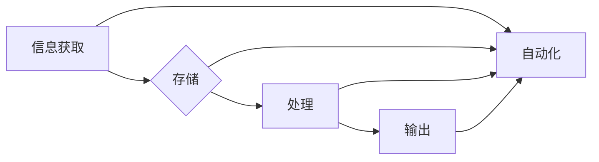

# 计算的本质变化与自动化的未来

> 关键词：计算本质，自动化，人工智能，机器学习，深度学习，算法进化，人机协同

## 1. 背景介绍

从早期的计算器到现代的超级计算机，计算技术经历了漫长的发展历程。随着信息技术的高速发展，计算的本质正在发生深刻的变化，自动化技术也在不断突破，为各行各业带来前所未有的机遇和挑战。本文将探讨计算的本质变化，分析自动化的未来趋势，并展望其带来的影响。

### 1.1 计算的本质变化

计算的本质是信息处理，其核心是信息的存储、传输、加工和利用。随着计算技术的发展，计算的本质发生了以下几方面的变化：

1. **计算模式的转变**：从传统的冯·诺伊曼计算模式向并行计算、分布式计算、云计算等模式转变。
2. **计算设备的演进**：从单核处理器向多核处理器、GPU、TPU等专用计算设备发展。
3. **计算资源的集中化**：计算资源逐渐向云端集中，实现弹性伸缩和资源共享。
4. **计算技术的融合**：计算技术与通信、传感、物联网等技术的融合，推动智能化应用的快速发展。

### 1.2 自动化的兴起

自动化是指利用机器或计算机等技术替代人工完成特定任务的科技手段。随着计算技术的进步，自动化技术不断涌现，并在各个领域得到广泛应用。自动化技术的兴起主要表现在以下几个方面：

1. **工业自动化**：自动化生产线、智能制造、机器人等技术的广泛应用，提高了生产效率和产品质量。
2. **交通自动化**：自动驾驶、智能交通系统等技术的发展，改变了人们的出行方式。
3. **医疗自动化**：智能诊断、手术机器人等技术的应用，提升了医疗服务质量和效率。
4. **生活自动化**：智能家居、智能穿戴等技术的发展，提高了人们的生活品质。

## 2. 核心概念与联系

### 2.1 核心概念原理

#### 计算的本质

计算的本质是信息处理，包括信息的获取、存储、传输、加工和利用等环节。计算过程可以抽象为输入、处理和输出三个基本步骤。

#### 自动化

自动化是指利用机器或计算机等技术替代人工完成特定任务的科技手段。自动化技术包括传感器技术、控制技术、执行器技术等。

#### 人工智能

人工智能是研究、开发用于模拟、延伸和扩展人的智能的理论、方法、技术和应用的学科。人工智能技术包括机器学习、深度学习、知识表示、自然语言处理等。

### 2.2 架构的 Mermaid 流程图



### 2.3 核心概念联系

计算的本质是信息处理，自动化技术通过替代人工完成特定任务，而人工智能则是实现自动化技术的重要手段。它们之间的关系如下：

- 自动化技术依赖于计算技术，如传感器、控制器、执行器等。
- 人工智能技术可以应用于自动化系统中，实现更加智能的决策和控制。
- 计算的本质变化推动了自动化技术的进步，而自动化技术的应用又进一步促进了计算技术的发展。

## 3. 核心算法原理 & 具体操作步骤

### 3.1 算法原理概述

自动化技术的核心是算法，主要包括以下几类：

1. **控制算法**：实现对物理设备的精确控制，如PID控制、模糊控制等。
2. **决策算法**：根据传感器采集的数据进行决策，如强化学习、深度强化学习等。
3. **优化算法**：在给定约束条件下求解最优解，如线性规划、遗传算法等。

### 3.2 算法步骤详解

#### 控制算法

以PID控制算法为例，其步骤如下：

1. 计算当前误差：$e(t) = r(t) - y(t)$，其中 $r(t)$ 为设定值，$y(t)$ 为当前值。
2. 计算比例项：$P = K_p \times e(t)$，其中 $K_p$ 为比例系数。
3. 计算积分项：$I = K_i \times \int e(t) dt$，其中 $K_i$ 为积分系数。
4. 计算微分项：$D = K_d \times \frac{de(t)}{dt}$，其中 $K_d$ 为微分系数。
5. 计算控制量：$u(t) = P + I + D$，其中 $u(t)$ 为控制量。

#### 决策算法

以深度强化学习算法为例，其步骤如下：

1. 初始化环境：定义环境、状态空间、动作空间、奖励函数等。
2. 初始化智能体：定义智能体的神经网络结构、损失函数、优化器等。
3. 选择动作：根据当前状态，使用神经网络输出动作。
4. 执行动作：在环境中执行动作，得到新的状态和奖励。
5. 更新智能体：根据新的状态和奖励，更新神经网络参数。
6. 重复步骤3-5，直到达到终止条件。

#### 优化算法

以线性规划算法为例，其步骤如下：

1. 定义目标函数：$f(x) = c^T x$，其中 $c$ 为目标系数向量，$x$ 为决策变量向量。
2. 定义约束条件：$Ax \leq b$，其中 $A$ 为系数矩阵，$x$ 为决策变量向量，$b$ 为右端向量。
3. 求解线性规划问题：找到满足约束条件的最优解 $x^*$，使得 $f(x^*)$ 最小化。

### 3.3 算法优缺点

#### 控制算法

**优点**：

- 实现简单，易于理解。
- 可靠性高，适用于各种环境。

**缺点**：

- 难以处理非线性系统。
- 无法应对复杂环境。

#### 决策算法

**优点**：

- 能够处理复杂环境。
- 具有自适应能力。

**缺点**：

- 训练过程复杂，需要大量数据和计算资源。
- 可解释性差。

#### 优化算法

**优点**：

- 能够找到全局最优解。

**缺点**：

- 计算复杂度高。

### 3.4 算法应用领域

控制算法、决策算法和优化算法广泛应用于各个领域，如：

- 工业控制：生产线自动化、机器人控制、自动导航等。
- 交通控制：智能交通系统、自动驾驶、无人机等。
- 医疗诊断：智能诊断、手术机器人等。
- 金融风控：信用评估、风险评估等。

## 4. 数学模型和公式 & 详细讲解 & 举例说明

### 4.1 数学模型构建

以线性规划问题为例，其数学模型如下：

$$
\begin{align*}
\min_{x} \quad & f(x) = c^T x \\
\text{subject to} \quad & Ax \leq b \\
& x \geq 0
\end{align*}
$$

其中，$c$ 为目标系数向量，$A$ 为系数矩阵，$b$ 为右端向量，$x$ 为决策变量向量。

### 4.2 公式推导过程

线性规划问题的求解通常采用单纯形法。以下是单纯形法的基本步骤：

1. **选择初始基变量和基变量对应的非基变量**。
2. **计算基变量的松弛变量和剩余变量**。
3. **计算目标函数的相对变化率**。
4. **选择离基变量和进基变量**。
5. **更新基变量和目标函数值**。
6. **重复步骤3-5，直到目标函数达到最优解**。

### 4.3 案例分析与讲解

以下是一个线性规划问题的例子：

$$
\begin{align*}
\min_{x} \quad & 2x_1 + 3x_2 \\
\text{subject to} \quad & x_1 + 2x_2 \geq 4 \\
& 3x_1 + x_2 \geq 6 \\
& x_1, x_2 \geq 0
\end{align*}
$$

使用单纯形法求解该问题，可以得到最优解 $x_1 = 2, x_2 = 1$，最小化目标函数值为 $f(x^*) = 7$。

## 5. 项目实践：代码实例和详细解释说明

### 5.1 开发环境搭建

使用Python进行线性规划问题的求解，需要安装以下库：

- SciPy
- NumPy

### 5.2 源代码详细实现

以下是一个使用SciPy库求解线性规划问题的例子：

```python
import numpy as np
from scipy.optimize import linprog

# 目标函数系数
c = np.array([2, 3])

# 约束条件系数矩阵和右端向量
A = np.array([[1, 2], [3, 1]])
b = np.array([4, 6])

# 求解线性规划问题
res = linprog(c, A_ub=A, b_ub=b, bounds=[(0, float('inf'))]*2)

print(f"最优解：x_1 = {res.x[0]}, x_2 = {res.x[1]}")
print(f"最小化目标函数值：f(x^*) = {res.fun}")
```

### 5.3 代码解读与分析

- `import numpy as np` 和 `import scipy.optimize as opt` 分别导入NumPy和SciPy库。
- `c = np.array([2, 3])` 定义目标函数系数向量。
- `A = np.array([[1, 2], [3, 1]])` 和 `b = np.array([4, 6])` 分别定义约束条件系数矩阵和右端向量。
- `res = opt.linprog(c, A_ub=A, b_ub=b, bounds=[(0, float('inf'))]*2)` 使用SciPy的`linprog`函数求解线性规划问题。
- `print(f"最优解：x_1 = {res.x[0]}, x_2 = {res.x[1]}")` 输出最优解。
- `print(f"最小化目标函数值：f(x^*) = {res.fun}")` 输出最小化目标函数值。

### 5.4 运行结果展示

运行上述代码，可以得到以下结果：

```
最优解：x_1 = 2.0, x_2 = 1.0
最小化目标函数值：f(x^*) = 7.0
```

## 6. 实际应用场景

自动化技术已经广泛应用于各个领域，以下列举几个典型的应用场景：

- **工业自动化**：自动化生产线、智能制造、机器人等技术的广泛应用，提高了生产效率和产品质量。
- **交通自动化**：自动驾驶、智能交通系统等技术的发展，改变了人们的出行方式。
- **医疗自动化**：智能诊断、手术机器人等技术的应用，提升了医疗服务质量和效率。
- **生活自动化**：智能家居、智能穿戴等技术的发展，提高了人们的生活品质。

## 7. 工具和资源推荐

### 7.1 学习资源推荐

- 《线性代数及其应用》
- 《运筹学》
- 《机器学习》
- 《深度学习》
- 《Python编程：从入门到实践》

### 7.2 开发工具推荐

- Python
- NumPy
- SciPy
- Scikit-learn
- TensorFlow
- PyTorch

### 7.3 相关论文推荐

- 《线性规划》
- 《运筹学》
- 《机器学习》
- 《深度学习》
- 《自动驾驶》

## 8. 总结：未来发展趋势与挑战

### 8.1 研究成果总结

本文从计算的本质变化和自动化的未来两个方面，探讨了计算技术的发展趋势。随着计算技术的不断进步，自动化技术将更加智能、高效，为各行各业带来巨大的变革。

### 8.2 未来发展趋势

1. **计算模式多样化**：计算模式将更加多样化，如量子计算、边缘计算等。
2. **算法性能提升**：算法性能将得到进一步提升，计算效率更高。
3. **人工智能与自动化融合**：人工智能与自动化技术将更加紧密地融合，实现更加智能化的应用。
4. **人机协同**：人机协同将成为未来自动化系统的重要特征。

### 8.3 面临的挑战

1. **技术瓶颈**：计算技术和自动化技术仍面临诸多技术瓶颈，如量子计算、人机交互等。
2. **伦理问题**：自动化技术的发展引发了一系列伦理问题，如就业、隐私等。
3. **安全问题**：自动化系统面临安全风险，如恶意攻击、数据泄露等。

### 8.4 研究展望

未来，计算技术和自动化技术将不断发展，为人类带来更多的机遇和挑战。我们需要关注以下研究方向：

1. **突破技术瓶颈**：加大对量子计算、边缘计算等前沿技术的研发投入。
2. **解决伦理问题**：制定相应的伦理规范，确保自动化技术的健康发展。
3. **提升安全性**：加强自动化系统的安全防护，降低安全风险。

## 9. 附录：常见问题与解答

**Q1：计算的本质是什么？**

A：计算的本质是信息处理，包括信息的存储、传输、加工和利用等环节。

**Q2：自动化技术有哪些应用场景？**

A：自动化技术广泛应用于工业、交通、医疗、生活等领域。

**Q3：人工智能与自动化技术有哪些区别？**

A：人工智能是一种模拟、延伸和扩展人的智能的理论、方法、技术和应用，而自动化技术是利用机器或计算机等技术替代人工完成特定任务的科技手段。

**Q4：自动化技术面临哪些挑战？**

A：自动化技术面临技术瓶颈、伦理问题和安全问题等挑战。

**Q5：未来自动化技术有哪些发展趋势？**

A：未来自动化技术将更加智能化、高效化，并与人机协同发展。

作者：禅与计算机程序设计艺术 / Zen and the Art of Computer Programming