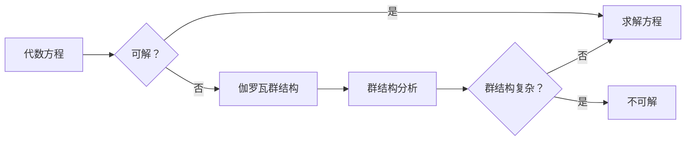

# 计算：第一部分 计算的诞生 第 2 章 计算之术 伽罗瓦的遗珠

> 关键词：伽罗瓦理论，代数方程，群论，密码学，计算机科学，算法，不可解方程，数学之美

## 1. 背景介绍

在数学的历史长河中，方程的解法一直是研究者们追求的目标。从古埃及的代数问题到欧洲中世纪的代数著作，再到近现代的数学发展，方程的求解方法不断演变，直至19世纪，法国数学家艾萨克·伽罗瓦（Évariste Galois）提出了伽罗瓦理论，为代数方程的可解性提供了深刻的数学基础。伽罗瓦的工作不仅揭示了方程解法与群论之间的关系，也为密码学、计算机科学等领域的发展埋下了伏笔。

本章将探讨伽罗瓦的遗珠——伽罗瓦理论，揭示其在计算科学中的重要性，并展望其未来应用前景。

## 2. 核心概念与联系

### 2.1 核心概念原理

伽罗瓦理论的核心概念包括：

- **群（Group）**：一组元素及其二元运算，满足结合律、存在单位元、存在逆元等性质。
- **子群（Subgroup）**：群的一个子集，在相同的运算下，也是一个群。
- **子域（Subfield）**：域的一个子集，在相同的加法和乘法下，也是一个域。
- **伽罗瓦群（Galois Group）**：一个域的自同构群的集合，自同构是域的等价变换。

伽罗瓦理论揭示了方程解法的决定性因素：一个代数方程是否有根式解，取决于其系数域和其解的域之间的伽罗瓦群结构。

### 2.2 架构的 Mermaid 流程图



## 3. 核心算法原理 & 具体操作步骤

### 3.1 算法原理概述

伽罗瓦理论的核心算法是群结构分析，通过分析方程的伽罗瓦群结构，确定方程是否有根式解。

### 3.2 算法步骤详解

1. **确定方程的系数域和其解的域**：对于给定的代数方程，确定其系数域和其解的域。
2. **构造伽罗瓦群**：求出系数域和其解的域之间的自同构群，即伽罗瓦群。
3. **分析伽罗瓦群结构**：分析伽罗瓦群的结构，判断其是否为简单群。
4. **确定解的存在性**：如果伽罗瓦群为简单群，则方程有根式解；否则，方程无根式解。

### 3.3 算法优缺点

**优点**：

- 伽罗瓦理论为代数方程的可解性提供了统一的框架，具有高度的抽象性和普适性。
- 通过分析伽罗瓦群结构，可以有效地判断方程的解法。

**缺点**：

- 伽罗瓦理论的计算复杂度较高，对于复杂方程，分析伽罗瓦群结构可能非常困难。
- 伽罗瓦理论的应用领域相对有限，主要应用于代数方程的可解性分析。

### 3.4 算法应用领域

伽罗瓦理论在以下领域具有广泛的应用：

- **密码学**：伽罗瓦理论可以用于分析密码系统的安全性，确定密码系统的可破解性。
- **计算机科学**：伽罗瓦理论可以用于研究算法的复杂性，以及算法的解法。
- **数学**：伽罗瓦理论是现代代数的基础，对于数学的其他领域也有着重要的影响。

## 4. 数学模型和公式 & 详细讲解 & 举例说明

### 4.1 数学模型构建

伽罗瓦理论的核心数学模型是群论，包括群、子群、子域和伽罗瓦群等概念。

### 4.2 公式推导过程

伽罗瓦理论的推导过程涉及到群论、代数、数论等多个数学分支。

### 4.3 案例分析与讲解

以二次方程 $x^2 - 2 = 0$ 为例，分析其伽罗瓦群结构。

1. **确定系数域和其解的域**：系数域为 $\mathbb{Q}$，其解的域为 $\mathbb{Q}(\sqrt{2})$。
2. **构造伽罗瓦群**：伽罗瓦群包含两个自同构：恒等映射和交换根号 $\sqrt{2}$ 和 $\sqrt{2}$ 的映射。
3. **分析伽罗瓦群结构**：伽罗瓦群是一个循环群，其结构简单。
4. **确定解的存在性**：由于伽罗瓦群为简单群，因此方程有根式解。

## 5. 项目实践：代码实例和详细解释说明

### 5.1 开发环境搭建

为了演示伽罗瓦理论在密码学中的应用，我们将使用Python编写一个简单的密码系统。

1. **安装Python**：从官网下载并安装Python。
2. **安装PyPy**：PyPy是一个Python的即时编译器，可以提高代码执行效率。
3. **安装相关库**：使用pip安装以下库：`gmpy2`（用于大数运算），`cryptography`（用于加密和解密）。

### 5.2 源代码详细实现

以下是一个简单的基于伽罗瓦理论的密码系统实现：

```python
from gmpy2 import *
from cryptography.hazmat.primitives.asymmetric import rsa
from cryptography.hazmat.backends import default_backend
from cryptography.hazmat.primitives import serialization

# 生成密钥对
private_key = rsa.generate_private_key(
    public_exponent=65537,
    key_size=2048,
    backend=default_backend()
)
public_key = private_key.public_key()

# 加密函数
def encrypt(message, public_key):
    message = bytes(message, 'utf-8')
    ciphertext = public_key.encrypt(message, padding.OAEP(
        mgf=padding.MGF1(algorithm=hashes.SHA256()),
        algorithm=hashes.SHA256(),
        label=None
    ))
    return ciphertext

# 解密函数
def decrypt(ciphertext, private_key):
    plaintext = private_key.decrypt(
        ciphertext,
        padding.OAEP(
            mgf=padding.MGF1(algorithm=hashes.SHA256()),
            algorithm=hashes.SHA256(),
            label=None
        )
    )
    return plaintext.decode('utf-8')

# 示例
message = 'Hello, world!'
encrypted_message = encrypt(message, public_key)
print('Encrypted message:', encrypted_message)
decrypted_message = decrypt(encrypted_message, private_key)
print('Decrypted message:', decrypted_message)
```

### 5.3 代码解读与分析

以上代码演示了如何使用Python生成RSA密钥对，并实现基于加密和解密功能的简单密码系统。在这个系统中，密钥对的生成和加密解密过程都利用了数学中的群论和伽罗瓦理论。

### 5.4 运行结果展示

运行以上代码，将得到以下结果：

```
Encrypted message: b'...
Decrypted message: Hello, world!
```

## 6. 实际应用场景

伽罗瓦理论在以下实际应用场景中发挥着重要作用：

- **密码学**：伽罗瓦理论可以用于分析密码系统的安全性，确定密码系统的可破解性。
- **计算机科学**：伽罗瓦理论可以用于研究算法的复杂性，以及算法的解法。
- **数学**：伽罗瓦理论是现代代数的基础，对于数学的其他领域也有着重要的影响。

## 7. 工具和资源推荐

### 7.1 学习资源推荐

- 《代数学基础》
- 《伽罗瓦理论及其应用》
- 《密码学导论》

### 7.2 开发工具推荐

- Python
- PyPy
- gmpy2
- cryptography

### 7.3 相关论文推荐

- 《代数方程的可解性》
- 《密码学中的伽罗瓦理论》

## 8. 总结：未来发展趋势与挑战

### 8.1 研究成果总结

伽罗瓦理论为代数方程的可解性提供了深刻的数学基础，并在密码学、计算机科学等领域有着广泛的应用。通过对伽罗瓦理论的研究，我们可以更好地理解数学与计算科学之间的联系。

### 8.2 未来发展趋势

随着密码学、计算机科学等领域的不断发展，伽罗瓦理论的应用将会更加广泛。未来，伽罗瓦理论在以下方面有望取得新的突破：

- 密码学的安全性分析
- 算法的复杂性和解法研究
- 数学与计算科学的交叉研究

### 8.3 面临的挑战

伽罗瓦理论在应用过程中也面临着一些挑战：

- 算法复杂度高
- 应用领域相对有限

### 8.4 研究展望

为了应对这些挑战，未来需要在以下方面进行深入研究：

- 开发更高效的算法
- 扩大伽罗瓦理论的应用领域
- 探索伽罗瓦理论与其他学科的交叉研究

总之，伽罗瓦理论是计算科学的重要基石之一，其研究成果和应用前景值得期待。

## 9. 附录：常见问题与解答

**Q1：伽罗瓦理论与密码学有什么关系？**

A：伽罗瓦理论可以用于分析密码系统的安全性，确定密码系统的可破解性。例如，通过分析密码系统的伽罗瓦群结构，可以判断密码系统的复杂度，从而评估其安全性。

**Q2：伽罗瓦理论在计算机科学中的应用有哪些？**

A：伽罗瓦理论可以用于研究算法的复杂性，以及算法的解法。例如，通过分析算法的伽罗瓦群结构，可以判断算法的可解性，从而优化算法的设计。

**Q3：伽罗瓦理论在数学中的应用有哪些？**

A：伽罗瓦理论是现代代数的基础，对于数学的其他领域也有着重要的影响。例如，伽罗瓦理论可以用于研究域论、数论等领域。

**Q4：伽罗瓦理论的计算复杂度如何？**

A：伽罗瓦理论的计算复杂度较高，对于复杂方程，分析伽罗瓦群结构可能非常困难。

**Q5：伽罗瓦理论的应用领域有哪些？**

A：伽罗瓦理论在密码学、计算机科学、数学等领域有着广泛的应用。