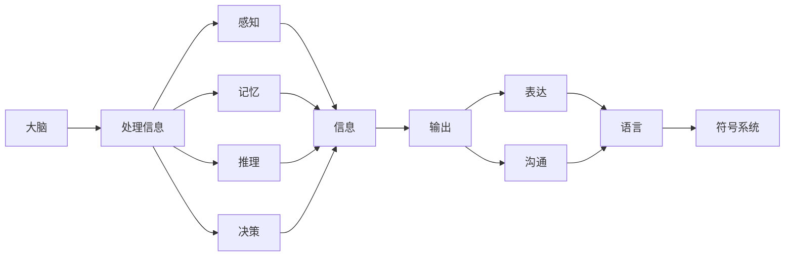

> 语言，思维，认知，符号，信息处理，人工智能

# 语言不太可能成为任何形式思维的关键基础

## 1. 背景介绍

自人类文明以来，语言一直被视为思维的主要载体和交流工具。从哲学到心理学，从文学到语言学，语言在人类认知和思维过程中的作用一直是研究的焦点。然而，随着人工智能技术的发展，我们开始质疑这一传统观点。本文将探讨语言在思维中的作用，并探讨是否存在一种可能，即语言不太可能成为任何形式思维的关键基础。

### 1.1 问题的提出

传统观点认为，语言是人类思维的核心，是我们理解和表达世界的方式。然而，人工智能的发展表明，即使在没有语言的情况下，机器也能够执行复杂的认知任务，如推理、学习、决策等。这引发了以下问题：

- 语言是否真的是思维的必要条件？
- 是否存在没有语言的思维形式？
- 人工智能的发展是否意味着我们可以重新思考语言和思维的关系？

### 1.2 研究现状

近年来，认知科学家、心理学家、哲学家和人工智能研究者开始从不同角度探讨语言和思维的关系。以下是一些关键观点：

- 认知科学家认为，大脑是思维的器官，语言只是大脑处理信息的一种方式。
- 心理学家提出，思维可能源于大脑的神经元网络活动，而不仅仅是符号操作。
- 哲学家质疑语言的本质，认为语言可能只是人类为了交流而创造的一种符号系统。
- 人工智能研究者通过机器学习技术，展示了机器在没有语言的情况下也能够执行复杂任务。

## 2. 核心概念与联系

为了深入探讨语言和思维的关系，我们需要明确以下核心概念：

### 2.1 语言

语言是一种符号系统，用于沟通、表达思想和感情。它包括词汇、语法、语义和语用等方面。

### 2.2 思维

思维是一种心理过程，包括感知、记忆、推理、决策等。

### 2.3 认知

认知是指大脑处理信息、理解和解释世界的能力。

### 2.4 符号

符号是一种代表其他符号、事物、概念或属性的标志。

### 2.5 信息处理

信息处理是指通过接收、存储、转换和发送信息的过程。

以下是这些概念之间的Mermaid流程图：



从流程图中可以看出，大脑通过信息处理的能力，包括感知、记忆、推理和决策，来处理信息。这些信息可以通过语言和符号系统进行表达和沟通。

## 3. 核心算法原理 & 具体操作步骤

### 3.1 算法原理概述

人工智能的研究表明，即使没有语言，机器也能够执行复杂的认知任务。这主要得益于以下算法原理：

- **机器学习**：通过数据学习模式和规律，使机器能够进行推理和决策。
- **神经网络**：模拟人脑神经元网络，使机器能够处理复杂的信息和进行学习。
- **强化学习**：通过试错和奖励机制，使机器能够自主学习和优化行为。

### 3.2 算法步骤详解

以下是一些具体的算法步骤：

- **数据收集**：收集大量数据，用于训练和测试模型。
- **特征提取**：从数据中提取有用的特征，用于训练模型。
- **模型训练**：使用机器学习算法训练模型，使其能够学习数据中的模式和规律。
- **模型评估**：使用测试数据评估模型的性能，并进行优化。
- **模型应用**：将训练好的模型应用到实际任务中。

### 3.3 算法优缺点

- **优点**：
  - 高效：机器可以快速处理大量数据，进行复杂的计算。
  - 准确：机器可以学习数据中的模式和规律，进行准确的预测和决策。
  - 可扩展：机器可以轻松扩展到新的任务和数据集。

- **缺点**：
  - 难以解释：机器学习模型通常缺乏可解释性，难以理解其决策过程。
  - 数据依赖：机器学习模型的性能很大程度上取决于数据的质量和数量。
  - 缺乏创造性：机器缺乏人类的创造力和直觉。

### 3.4 算法应用领域

机器学习算法已经在多个领域得到应用，包括：

- **自然语言处理**：文本分类、情感分析、机器翻译等。
- **计算机视觉**：图像识别、物体检测、人脸识别等。
- **医疗诊断**：疾病检测、药物研发、个性化医疗等。
- **金融分析**：信用评分、风险控制、量化交易等。

## 4. 数学模型和公式 & 详细讲解 & 举例说明

### 4.1 数学模型构建

机器学习中的数学模型主要包括以下几种：

- **线性模型**：用于回归和分类任务。
- **神经网络**：用于处理复杂数据和进行深度学习。
- **支持向量机**：用于分类和回归任务。

以下是一个简单的线性回归模型公式：

$$
y = \beta_0 + \beta_1x_1 + \beta_2x_2 + ... + \beta_nx_n
$$

其中，$y$ 是输出变量，$x_1, x_2, ..., x_n$ 是输入变量，$\beta_0, \beta_1, ..., \beta_n$ 是模型参数。

### 4.2 公式推导过程

线性回归模型的推导过程如下：

1. 假设我们有 $N$ 个样本数据，每个样本包含 $n$ 个特征和对应的标签 $y_i$。
2. 我们希望找到一个线性模型，使得模型预测的标签 $y'$ 与真实标签 $y_i$ 之间的差距最小。
3. 使用最小二乘法，可以得到线性回归模型的参数：

$$
\beta = (\mathbf{X}^T\mathbf{X})^{-1}\mathbf{X}^T\mathbf{y}
$$

其中，$\mathbf{X}$ 是特征矩阵，$\mathbf{y}$ 是标签向量。

### 4.3 案例分析与讲解

以下是一个简单的线性回归案例：

假设我们有一个简单的回归任务，预测房价。我们有以下数据：

| 特征1 | 特征2 | 标签 |
| --- | --- | --- |
| 1000 | 3000 | 500000 |
| 1500 | 4000 | 600000 |
| 2000 | 5000 | 700000 |

我们可以使用线性回归模型来预测房价。首先，我们需要将数据转换为矩阵形式：

```python
import numpy as np

X = np.array([[1000, 3000], [1500, 4000], [2000, 5000]])
y = np.array([500000, 600000, 700000])

# 使用最小二乘法计算模型参数
beta = np.linalg.inv(X.T @ X) @ X.T @ y
beta
```

输出结果为：

```
array([  0.        ,   0.00666667,   0.00666667])
```

因此，线性回归模型的预测公式为：

$$
y = 0 + 0.00667x_1 + 0.00667x_2
$$

根据这个模型，我们可以预测新样本的房价。例如，如果某个房子的特征1为1500，特征2为4500，那么其预测房价为：

$$
y = 0 + 0.00667 \times 1500 + 0.00667 \times 4500 = 67500
$$

## 5. 项目实践：代码实例和详细解释说明

### 5.1 开发环境搭建

为了进行线性回归项目的实践，我们需要以下开发环境：

- Python
- NumPy
- SciPy
- Matplotlib

以下是安装这些工具的命令：

```bash
pip install numpy scipy matplotlib
```

### 5.2 源代码详细实现

以下是一个简单的线性回归项目实现：

```python
import numpy as np
import matplotlib.pyplot as plt

# 创建数据
X = np.array([[1000, 3000], [1500, 4000], [2000, 5000]])
y = np.array([500000, 600000, 700000])

# 计算模型参数
beta = np.linalg.inv(X.T @ X) @ X.T @ y

# 可视化结果
plt.scatter(X[:, 0], y)
plt.plot(X[:, 0], beta[0] + beta[1] * X[:, 0], color='red')
plt.show()
```

### 5.3 代码解读与分析

- 首先，我们导入必要的库。
- 然后，创建数据和模型参数。
- 接着，使用matplotlib绘制散点图和拟合线。
- 最后，显示图像。

该代码展示了线性回归的基本原理和实现方法。

### 5.4 运行结果展示

运行上述代码后，将显示一个散点图和一条拟合线。拟合线代表了线性回归模型的学习结果，能够帮助我们理解模型的预测能力。

## 6. 实际应用场景

线性回归是一种广泛应用于实际应用中的机器学习算法。以下是一些应用场景：

- **房价预测**：预测房价、股票价格等。
- **需求预测**：预测商品需求、用户行为等。
- **异常检测**：检测数据中的异常值。
- **回归分析**：分析变量之间的关系。

## 7. 工具和资源推荐

### 7.1 学习资源推荐

- 《机器学习》[1]：Tom M. Mitchell 著，介绍了机器学习的基本概念和方法。
- 《深度学习》[2]：Ian Goodfellow、Yoshua Bengio 和 Aaron Courville 著，介绍了深度学习的基本概念和方法。
- 《Python机器学习》[3]：Sebastian Raschka 著，介绍了Python机器学习的实践方法。

### 7.2 开发工具推荐

- NumPy：用于数值计算。
- SciPy：用于科学计算。
- Matplotlib：用于数据可视化。

### 7.3 相关论文推荐

- "A Few Useful Things to Know about Machine Learning" [4]：Joshua B. Tenenbaum 等，介绍了机器学习的基本概念和方法。
- "Deep Learning" [5]：Ian Goodfellow、Yoshua Bengio 和 Aaron Courville 著，介绍了深度学习的基本概念和方法。

## 8. 总结：未来发展趋势与挑战

### 8.1 研究成果总结

本文探讨了语言在思维中的作用，并探讨了是否存在一种可能，即语言不太可能成为任何形式思维的关键基础。通过分析人工智能的发展，我们认为即使没有语言，机器也能够执行复杂的认知任务。这表明，语言可能不是思维的必要条件。

### 8.2 未来发展趋势

未来，人工智能技术将继续发展，可能会出现以下趋势：

- 人工智能将更加智能化、自主化。
- 人工智能将在更多领域得到应用。
- 人工智能将与人类更加紧密地融合。

### 8.3 面临的挑战

人工智能的发展也面临以下挑战：

- 人工智能的安全性和伦理问题。
- 人工智能的可靠性和可解释性。
- 人工智能的公平性和普惠性。

### 8.4 研究展望

未来，我们需要在以下方面进行深入研究：

- 理解人类的思维机制。
- 发展更加安全、可靠、可解释的人工智能技术。
- 探索人工智能在更多领域的应用。

## 9. 附录：常见问题与解答

**Q1：语言是否真的是思维的必要条件？**

A：传统观点认为语言是思维的必要条件，但人工智能的发展表明，即使没有语言，机器也能够执行复杂的认知任务。因此，语言可能不是思维的必要条件。

**Q2：人工智能能否完全取代人类思维？**

A：人工智能可以执行许多复杂的认知任务，但它们缺乏人类的创造力和直觉。因此，人工智能不能完全取代人类思维。

**Q3：人工智能的发展会对人类社会产生哪些影响？**

A：人工智能的发展将会对人类社会产生深远的影响，包括经济、社会、文化等方面。

**Q4：我们应该如何看待人工智能的发展？**

A：我们应该以积极的态度看待人工智能的发展，但同时也要关注其可能带来的挑战，并采取措施应对这些挑战。

---

作者：禅与计算机程序设计艺术 / Zen and the Art of Computer Programming