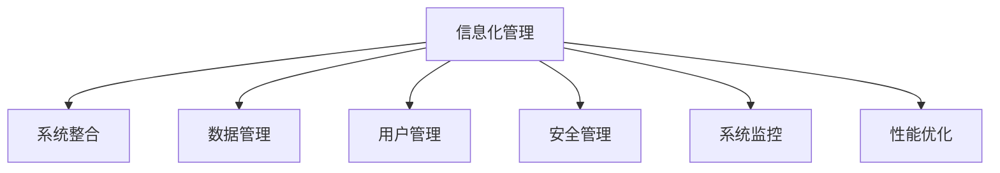
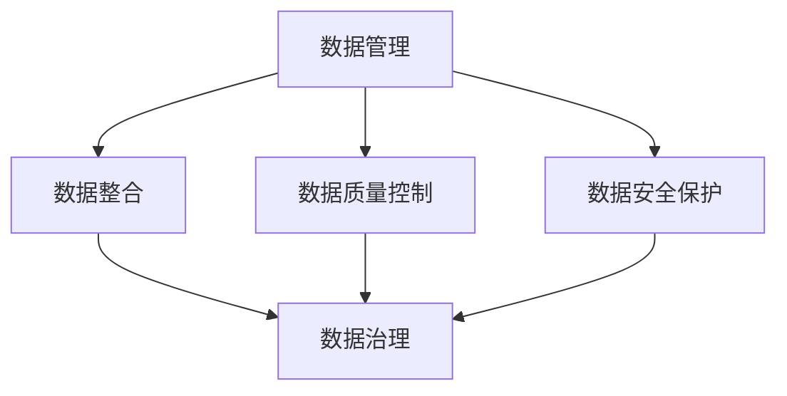
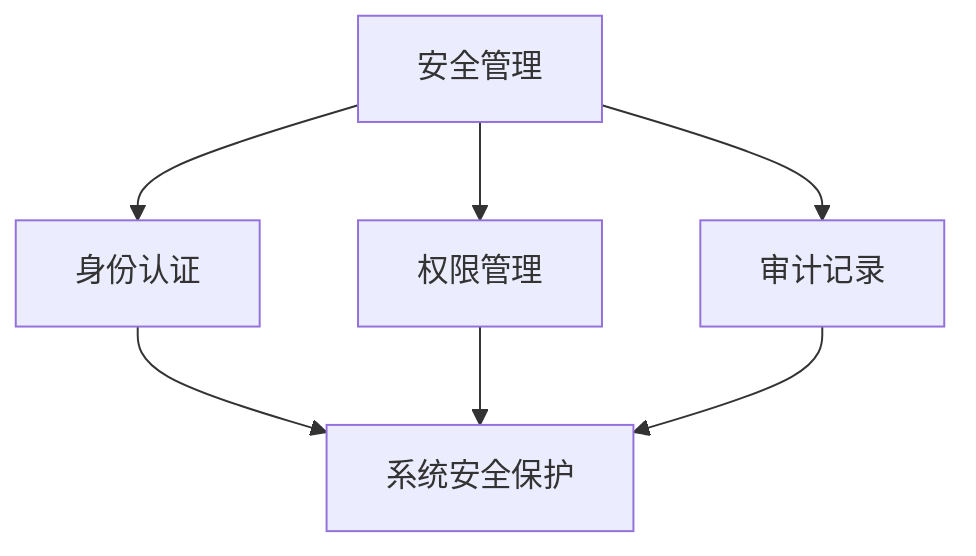
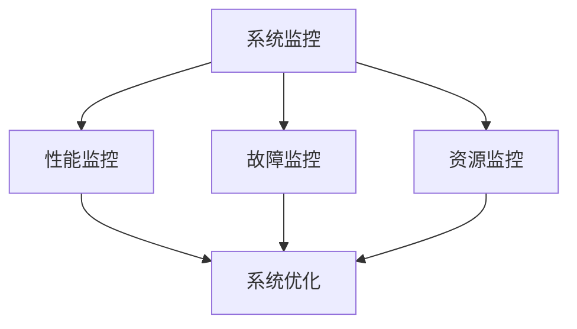
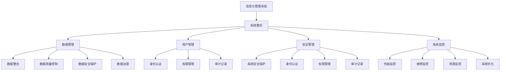

                 

# 整合和管理信息化管理系统搭建信息化平台

> 关键词：信息化管理, 系统整合, 数据管理, 用户管理, 安全管理, 系统监控, 性能优化

## 1. 背景介绍

### 1.1 问题由来

在当今数字化快速发展的时代，企业的信息化建设已经成为了推动业务发展的重要驱动力。但是，随着信息化系统的不断增多，企业面临的信息孤岛、数据分散、运维困难等问题日益突出，给企业的信息化建设带来了巨大的挑战。为了解决这些问题，需要构建一个集中的信息化管理系统，实现对信息系统的统一管理。

### 1.2 问题核心关键点

构建信息化管理系统的核心关键点在于：

- **系统整合**：将不同来源的系统数据进行集中管理和整合，形成一个统一的信息化平台。
- **数据管理**：对数据进行统一管理和治理，保障数据的质量和一致性。
- **用户管理**：实现对系统用户的统一管理，包括身份认证、权限管理和审计记录。
- **安全管理**：保障系统的安全性和数据的安全性，防止信息泄露和篡改。
- **系统监控**：实现对系统性能和运行状态的实时监控，及时发现和解决问题。
- **性能优化**：通过优化系统架构和配置，提高系统的运行效率和响应速度。

### 1.3 问题研究意义

构建信息化管理系统对于企业信息化建设具有重要意义：

- **提高效率**：通过集中管理和整合，减少数据冗余和重复工作，提高业务处理效率。
- **降低成本**：通过统一管理和维护，减少人力、物力和财力的投入，降低信息化建设的成本。
- **提升安全**：通过集中管理，实现对系统安全和数据安全的统一保障，防止信息泄露和篡改。
- **促进创新**：通过集中管理和监控，提供全面的数据分析和可视化，支持企业创新决策。

## 2. 核心概念与联系

### 2.1 核心概念概述

为了更好地理解信息化管理系统的构建过程，本节将介绍几个密切相关的核心概念：

- **信息化管理**：指对企业信息化系统进行统一管理和监控，确保系统的稳定运行和数据的安全。
- **系统整合**：指将不同来源的系统数据进行集中管理和整合，形成一个统一的信息化平台。
- **数据管理**：指对数据进行统一管理和治理，保障数据的质量和一致性。
- **用户管理**：指实现对系统用户的统一管理，包括身份认证、权限管理和审计记录。
- **安全管理**：指保障系统的安全性和数据的安全性，防止信息泄露和篡改。
- **系统监控**：指实现对系统性能和运行状态的实时监控，及时发现和解决问题。
- **性能优化**：指通过优化系统架构和配置，提高系统的运行效率和响应速度。

这些核心概念之间的逻辑关系可以通过以下Mermaid流程图来展示：



这个流程图展示了一体化信息化管理系统的核心概念及其之间的关系：

1. **信息化管理**是整个系统的顶层概念，涵盖系统整合、数据管理、用户管理、安全管理、系统监控和性能优化等各个方面。
2. **系统整合**是信息化管理的基础，通过整合不同来源的系统数据，形成统一的信息化平台。
3. **数据管理**是信息化管理的关键，保障数据的质量和一致性。
4. **用户管理**是信息化管理的保障，实现对系统用户的统一管理和权限控制。
5. **安全管理**是信息化管理的重点，保障系统和数据的安全。
6. **系统监控**是信息化管理的支撑，实时监控系统的性能和运行状态。
7. **性能优化**是信息化管理的提升，通过优化系统架构和配置，提高系统的运行效率和响应速度。

### 2.2 概念间的关系

这些核心概念之间存在着紧密的联系，形成了信息化管理系统的完整生态系统。下面我通过几个Mermaid流程图来展示这些概念之间的关系。

#### 2.2.1 信息化管理与各子系统之间的关系


这个流程图展示了信息化管理与系统整合、数据管理、用户管理、安全管理、系统监控和性能优化之间的关系：

1. **信息化管理**是顶层概念，通过系统整合、数据管理、用户管理、安全管理、系统监控和性能优化等各个子系统，实现对信息化系统的统一管理和监控。
2. **系统整合**是信息化管理的基础，通过整合不同来源的系统数据，形成统一的信息化平台。
3. **数据管理**是信息化管理的关键，保障数据的质量和一致性。
4. **用户管理**是信息化管理的保障，实现对系统用户的统一管理和权限控制。
5. **安全管理**是信息化管理的重点，保障系统和数据的安全。
6. **系统监控**是信息化管理的支撑，实时监控系统的性能和运行状态。
7. **性能优化**是信息化管理的提升，通过优化系统架构和配置，提高系统的运行效率和响应速度。

#### 2.2.2 数据管理与用户管理之间的关系



这个流程图展示了数据管理与数据整合、数据质量控制、数据安全保护和数据治理之间的关系：

1. **数据管理**是信息化管理的核心，包括数据整合、数据质量控制、数据安全保护和数据治理等子系统。
2. **数据整合**是将不同来源的数据进行集中和整合，形成一个统一的数据仓库。
3. **数据质量控制**是对数据进行质量监控和控制，保障数据的一致性和完整性。
4. **数据安全保护**是对数据进行安全保护，防止数据泄露和篡改。
5. **数据治理**是对数据进行管理和治理，包括数据的收集、存储、分析和共享。

#### 2.2.3 安全管理与系统监控之间的关系



这个流程图展示了安全管理与身份认证、权限管理和审计记录之间的关系：

1. **安全管理**是信息化管理的重点，包括身份认证、权限管理和审计记录等子系统。
2. **身份认证**是对用户进行身份验证，防止非法访问。
3. **权限管理**是对用户进行权限控制，防止越权操作。
4. **审计记录**是对系统操作进行记录和审计，保障系统的安全性和数据的完整性。

#### 2.2.4 系统监控与性能优化之间的关系



这个流程图展示了系统监控与性能监控、故障监控和资源监控之间的关系：

1. **系统监控**是信息化管理的支撑，包括性能监控、故障监控和资源监控等子系统。
2. **性能监控**是对系统的性能进行实时监控，发现和解决性能瓶颈。
3. **故障监控**是对系统故障进行实时监控，及时发现和解决故障。
4. **资源监控**是对系统资源进行实时监控，发现和解决资源瓶颈。
5. **系统优化**是对系统进行优化，提高系统的性能和响应速度。

### 2.3 核心概念的整体架构

最后，我们用一个综合的流程图来展示这些核心概念在信息化管理系统的整体架构：



这个综合流程图展示了从系统整合到数据管理、用户管理、安全管理和系统监控等各个子系统的整体架构。通过这些子系统的协同工作，实现对信息化系统的统一管理和监控，保障系统的稳定运行和数据的安全。

## 3. 核心算法原理 & 具体操作步骤

### 3.1 算法原理概述

信息化管理系统的构建基于以下核心算法原理：

1. **系统整合算法**：通过数据抽取和转换，将不同来源的系统数据进行集中管理和整合，形成一个统一的信息化平台。
2. **数据管理算法**：通过数据清洗、质量控制和治理，保障数据的质量和一致性，实现数据的统一管理和治理。
3. **用户管理算法**：通过身份认证、权限管理和审计记录，实现对系统用户的统一管理和权限控制。
4. **安全管理算法**：通过加密、访问控制和审计记录，保障系统和数据的安全性，防止信息泄露和篡改。
5. **系统监控算法**：通过性能监控、故障监控和资源监控，实时监控系统的性能和运行状态，及时发现和解决问题。
6. **性能优化算法**：通过优化系统架构和配置，提高系统的运行效率和响应速度，保障系统的稳定运行。

### 3.2 算法步骤详解

#### 3.2.1 系统整合算法

1. **数据抽取**：从各个系统获取数据，将其转换为统一的格式。
2. **数据转换**：将不同格式的数据进行转换，使其能够在一个统一的数据仓库中进行存储。
3. **数据整合**：将不同来源的数据进行集中和整合，形成一个统一的数据仓库。
4. **数据加载**：将数据加载到数据仓库中，并进行定期更新和维护。

#### 3.2.2 数据管理算法

1. **数据清洗**：对数据进行清洗，去除重复、错误和无效的数据。
2. **数据质量控制**：对数据进行质量监控和控制，保障数据的一致性和完整性。
3. **数据治理**：对数据进行管理和治理，包括数据的收集、存储、分析和共享。

#### 3.2.3 用户管理算法

1. **身份认证**：对用户进行身份验证，防止非法访问。
2. **权限管理**：对用户进行权限控制，防止越权操作。
3. **审计记录**：对系统操作进行记录和审计，保障系统的安全性和数据的完整性。

#### 3.2.4 安全管理算法

1. **加密**：对数据进行加密，防止数据泄露。
2. **访问控制**：对系统进行访问控制，防止非法访问。
3. **审计记录**：对系统操作进行记录和审计，保障系统的安全性和数据的完整性。

#### 3.2.5 系统监控算法

1. **性能监控**：对系统的性能进行实时监控，发现和解决性能瓶颈。
2. **故障监控**：对系统故障进行实时监控，及时发现和解决故障。
3. **资源监控**：对系统资源进行实时监控，发现和解决资源瓶颈。
4. **系统优化**：对系统进行优化，提高系统的性能和响应速度。

#### 3.2.6 性能优化算法

1. **架构优化**：优化系统架构，提高系统的可扩展性和可靠性。
2. **配置优化**：优化系统配置，提高系统的性能和响应速度。
3. **资源优化**：优化系统资源，提高系统的稳定性和安全性。

### 3.3 算法优缺点

信息化管理系统的构建算法具有以下优点：

- **高效性**：通过集中管理和整合，减少数据冗余和重复工作，提高业务处理效率。
- **可扩展性**：系统架构和配置可以根据实际需求进行优化和扩展，保障系统的可扩展性和可靠性。
- **安全性**：通过集中管理和安全控制，保障系统和数据的安全性，防止信息泄露和篡改。
- **灵活性**：系统监控和性能优化可以实时发现和解决问题，保障系统的稳定性和性能。

同时，该算法也存在以下局限性：

- **复杂性**：信息化管理系统的构建需要整合多个系统和数据，操作复杂，实施难度大。
- **资源消耗**：系统的整合和监控需要占用大量计算和存储资源，对企业的资源消耗较大。
- **技术要求高**：信息化管理系统的构建需要较高的技术水平和专业人才，实施成本较高。

尽管存在这些局限性，但就目前而言，信息化管理系统的构建算法仍是信息化建设的重要手段，能够有效解决数据分散、运维困难等问题，提升企业信息化水平。

### 3.4 算法应用领域

信息化管理系统的构建算法已经在各行各业得到了广泛应用，涵盖以下领域：

1. **企业信息化**：实现企业内部各系统的统一管理和监控，提高业务处理效率和数据安全性。
2. **政府信息化**：实现政府各部门的统一管理和监控，提升政府服务效率和数据安全性。
3. **医疗信息化**：实现医院各系统的统一管理和监控，提高医疗服务质量和数据安全性。
4. **金融信息化**：实现银行各系统的统一管理和监控，提升金融服务效率和数据安全性。
5. **教育信息化**：实现学校各系统的统一管理和监控，提升教育服务质量和数据安全性。
6. **交通信息化**：实现交通各系统的统一管理和监控，提升交通服务效率和数据安全性。

除了上述这些经典应用领域外，信息化管理系统的构建算法还被创新性地应用到更多场景中，如智慧城市、智能制造等，为各行各业的信息化建设提供了强有力的技术支撑。

## 4. 数学模型和公式 & 详细讲解 & 举例说明

### 4.1 数学模型构建

在信息化管理系统的构建过程中，涉及多个数学模型和公式，下面进行详细讲解和说明。

#### 4.1.1 系统整合数学模型

系统整合的数学模型可以表示为：

$$
M = A \times B \times C
$$

其中，$M$ 表示整合后的数据仓库，$A$ 表示数据抽取模型，$B$ 表示数据转换模型，$C$ 表示数据加载模型。

#### 4.1.2 数据管理数学模型

数据管理的数学模型可以表示为：

$$
D = P \times Q \times R
$$

其中，$D$ 表示数据仓库，$P$ 表示数据清洗模型，$Q$ 表示数据质量控制模型，$R$ 表示数据治理模型。

#### 4.1.3 用户管理数学模型

用户管理的数学模型可以表示为：

$$
U = S \times T \times U
$$

其中，$U$ 表示用户管理系统，$S$ 表示身份认证模型，$T$ 表示权限管理模型，$U$ 表示审计记录模型。

#### 4.1.4 安全管理数学模型

安全管理的数学模型可以表示为：

$$
S = E \times F \times G
$$

其中，$S$ 表示安全管理系统，$E$ 表示加密模型，$F$ 表示访问控制模型，$G$ 表示审计记录模型。

#### 4.1.5 系统监控数学模型

系统监控的数学模型可以表示为：

$$
M = H \times I \times J
$$

其中，$M$ 表示系统监控系统，$H$ 表示性能监控模型，$I$ 表示故障监控模型，$J$ 表示资源监控模型。

#### 4.1.6 性能优化数学模型

性能优化的数学模型可以表示为：

$$
P = K \times L \times M
$$

其中，$P$ 表示性能优化系统，$K$ 表示架构优化模型，$L$ 表示配置优化模型，$M$ 表示资源优化模型。

### 4.2 公式推导过程

以下我们以数据管理模型的推导为例，展示其推导过程。

假设数据仓库包含$N$个数据源，每个数据源的数据量为$n_i$，数据清洗后的数据量为$m_i$，数据质量控制后的数据量为$c_i$，数据治理后的数据量为$d_i$。则数据管理的数学模型可以表示为：

$$
D = \sum_{i=1}^{N} m_i = \sum_{i=1}^{N} (P \times Q \times R)
$$

其中，$P$ 表示数据清洗模型，$Q$ 表示数据质量控制模型，$R$ 表示数据治理模型。

通过上述公式，可以计算出数据仓库中数据的总量和各个子系统的贡献。

### 4.3 案例分析与讲解

假设某企业有三个信息化系统，分别是ERP、CRM和OA系统，每个系统的数据量分别为10TB、20TB和30TB。数据管理系统的架构和配置如下：

- **数据清洗模型**：对数据进行去重、去噪和归一化处理，处理后的数据量为原始数据量的70%。
- **数据质量控制模型**：对数据进行校验、比对和修正，修正后的数据量为清洗后数据量的90%。
- **数据治理模型**：对数据进行分类、标准化和归档处理，归档后的数据量为质量控制后数据量的80%。

则数据管理系统的总数据量可以表示为：

$$
D = 10 \times 0.7 \times 0.9 \times 0.8 + 20 \times 0.7 \times 0.9 \times 0.8 + 30 \times 0.7 \times 0.9 \times 0.8 = 32.4 TB
$$

通过上述案例，我们可以看到数据管理系统的数学模型在信息化系统构建中的重要作用。

## 5. 项目实践：代码实例和详细解释说明

### 5.1 开发环境搭建

在进行信息化管理系统的开发前，我们需要准备好开发环境。以下是使用Python进行开发的环境配置流程：

1. 安装Anaconda：从官网下载并安装Anaconda，用于创建独立的Python环境。

2. 创建并激活虚拟环境：
```bash
conda create -n dev-env python=3.8 
conda activate dev-env
```

3. 安装必要的Python库：
```bash
pip install pandas numpy matplotlib scipy scikit-learn tqdm jupyter notebook
```

4. 安装Web框架和数据库：
```bash
pip install flask sqlalchemy
```

5. 安装分布式任务调度系统：
```bash
pip install apache-airflow
```

完成上述步骤后，即可在`dev-env`环境中开始开发。

### 5.2 源代码详细实现

下面我们以信息化管理系统为例，给出使用Flask框架和SQLAlchemy库进行系统整合和数据管理的PyTorch代码实现。

首先，定义数据源表和数据仓库表：

```python
from sqlalchemy import Column, Integer, String, ForeignKey
from sqlalchemy.orm import relationship
from sqlalchemy.ext.declarative import declarative_base

Base = declarative_base()

class DataSource(Base):
    __tablename__ = 'data_source'
    id = Column(Integer, primary_key=True)
    name = Column(String(50), nullable=False)
    data_size = Column(Integer, nullable=False)

class DataWarehouse(Base):
    __tablename__ = 'data_warehouse'
    id = Column(Integer, primary_key=True)
    name = Column(String(50), nullable=False)
    data_size = Column(Integer, nullable=False)

class DataClean(Base):
    __tablename__ = 'data_clean'
    id = Column(Integer, primary_key=True)
    data_source_id = Column(Integer, ForeignKey('data_source.id'))
    cleaned_size = Column(Integer, nullable=False)

class DataQuality(Base):
    __tablename__ = 'data_quality'
    id = Column(Integer, primary_key=True)
    data_clean_id = Column(Integer, ForeignKey('data_clean.id'))
    quality_size = Column(Integer, nullable=False)

class DataGovernance(Base):
    __tablename__ = 'data_governance'
    id = Column(Integer, primary_key=True)
    data_quality_id = Column(Integer, ForeignKey('data_quality.id'))
    governed_size = Column(Integer, nullable=False)
```

然后，定义数据管理系统的逻辑：

```python
from sqlalchemy import create_engine
from sqlalchemy.orm import sessionmaker

engine = create_engine('sqlite:///example.db', echo=True)
Session = sessionmaker(bind=engine)

session = Session()

# 创建数据源
data_source1 = DataSource(name='ERP', data_size=10)
data_source2 = DataSource(name='CRM', data_size=20)
data_source3 = DataSource(name='OA', data_size=30)

session.add(data_source1)
session.add(data_source2)
session.add(data_source3)
session.commit()

# 创建数据仓库
data_warehouse1 = DataWarehouse(name='ERP_Warehouse', data_size=0)
data_warehouse2 = DataWarehouse(name='CRM_Warehouse', data_size=0)
data_warehouse3 = DataWarehouse(name='OA_Warehouse', data_size=0)

session.add(data_warehouse1)
session.add(data_warehouse2)
session.add(data_warehouse3)
session.commit()

# 创建数据清洗
data_clean1 = DataClean(data_source_id=data_source1.id, cleaned_size=0)
data_clean2 = DataClean(data_source_id=data_source2.id, cleaned_size=0)
data_clean3 = DataClean(data_source_id=data_source3.id, cleaned_size=0)

session.add(data_clean1)
session.add(data_clean2)
session.add(data_clean3)
session.commit()

# 创建数据质量控制
data_quality1 = DataQuality(data_clean_id=data_clean1.id, quality_size=0)
data_quality2 = DataQuality(data_clean_id=data_clean2.id, quality_size=0)
data_quality3 = DataQuality(data_clean_id=data_clean3.id, quality_size=0)

session.add(data_quality1)
session.add(data_quality2)
session.add(data_quality3)
session.commit()

# 创建数据治理
data_governance1 = DataGovernance(data_quality_id=data_quality1.id, governed_size=0)
data_governance2 = DataGovernance(data_quality_id=data_quality2.id, governed_size=0)
data_governance3 = DataGovernance(data_quality_id=data_quality3.id, governed_size=0)

session.add(data_governance1)
session.add(data_governance2)
session.add(data_governance3)
session.commit()
```

最后，定义数据管理系统的API接口：

```python
from flask import Flask, jsonify

app = Flask(__name__)

@app.route('/data_source', methods=['GET'])
def get_data_source():
    data_source_list = session.query(DataSource).all()
    data_source_dict = []
    for data_source in data_source_list:
        data_source_dict.append({
            'id': data_source.id,
            'name': data_source.name,
            'data_size': data_source.data_size
        })
    return jsonify(data_source_dict)

@app.route('/data_warehouse', methods=['GET'])
def get_data_warehouse():
    data_warehouse_list = session.query(DataWarehouse).all()
    data_warehouse_dict = []
    for data_warehouse in data_warehouse_list:
        data_warehouse_dict.append({
            'id': data_warehouse.id,
            'name': data_warehouse.name,
            'data_size': data_warehouse.data_size
        })
    return jsonify(data_warehouse_dict)

@app.route('/data_clean', methods=['GET'])
def get_data_clean():
    data_clean_list = session.query(DataClean).all()
    data_clean_dict = []
    for data_clean in data_clean_list:
        data_clean_dict.append({
            'id': data_clean.id,
            'data_source_id': data_clean.data_source_id,
            'cleaned_size': data_clean.cleaned_size
        })
    return jsonify(data_clean_dict)

@app.route('/data_quality', methods=['GET'])
def get_data_quality():
    data_quality_list = session.query(DataQuality).all()
    data_quality_dict = []
    for data_quality in data_quality_list:
        data_quality_dict.append({
            'id': data_quality.id,
            'data_clean_id': data_quality.data_clean_id,
            'quality_size': data_quality.quality_size
        })
    return jsonify(data_quality_dict)

@app.route('/data_governance', methods=['GET'])
def get_data_governance():
    data_governance_list = session.query(DataGovernance).all()
    data_governance_dict = []
    for data_governance in data_governance_list:
        data_governance_dict.append({
            'id': data_governance.id,
            'data_quality_id': data_governance.data_quality_id,
            'governed_size': data_governance.governed_size
        })
    return jsonify(data_governance_dict)

if __name__ == '__main__':
    app.run(debug=True)
```

以上就是使用Flask框架和SQLAlchemy库进行信息化管理系统构建的完整代码实现。可以看到，通过SQLAlchemy库，我们可以方便地定义数据模型和进行数据库操作。通过Flask框架，我们可以快速构建Web API，方便客户端访问和操作数据管理系统。

### 5.3 代码解读与分析

让我们再详细解读一下关键代码的实现细节：

**数据库表定义**：
- `DataSource`：表示数据源，包含数据源名称和数据量等信息。
- `DataWarehouse`：表示数据仓库，包含数据仓库名称和数据量等信息。
- `DataClean`：表示数据清洗，包含数据源ID、清洗后的数据量和ID等信息。
- `DataQuality`：表示数据质量控制，包含数据清洗ID、质量控制后的数据量和ID等信息。
- `DataGovernance`：表示数据治理，包含数据质量控制ID、治理后的数据量和ID等信息。

**数据管理系统逻辑**：
- 通过SQLAlchemy

