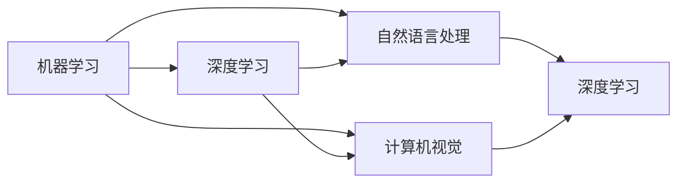

                 

## 1. 背景介绍

随着人工智能(AI)技术的迅猛发展，中国正在经历其AI时代的曙光。从国家层面的政策支持，到企业界的创新突破，AI正逐渐成为推动中国科技进步和经济转型的关键力量。本文将围绕中国AI发展的现状、挑战与未来方向展开讨论，以期为中国AI技术的未来发展提供有益的参考和见解。

### 1.1 中国AI发展的现状

当前，中国在AI领域的投入和发展速度令人瞩目。据统计，中国在AI领域的市场规模已经位居全球前列，并在多个子领域取得了显著进展。

#### 1.1.1 政策支持与投入

中国政府高度重视AI的发展，出台了一系列政策支持和推动AI技术的应用。例如，2017年国务院发布《新一代人工智能发展规划》，明确了AI发展的战略目标和行动计划。此外，国家科技部、发改委等部门也相继出台了多项支持AI发展的政策和措施。

#### 1.1.2 企业界的创新突破

中国的AI企业界在技术创新和应用落地方面也取得了诸多突破。以百度、腾讯、阿里、华为等大型科技企业为例，这些公司不仅在AI算法和模型方面持续创新，还在自动驾驶、智能医疗、金融科技、教育等多个领域实现了深度应用。

#### 1.1.3 学术界的繁荣发展

中国AI研究机构的学术成果丰硕，一些高校和科研院所在自然语言处理、计算机视觉、机器人等领域的研究成果走在全球前列。例如，清华大学、北京大学、上海交通大学等高校的AI研究团队在全球顶级会议上频频发表论文，提升了中国在国际AI界的地位。

### 1.2 挑战与机遇

尽管中国AI领域发展迅速，但也面临着一些挑战和问题。

#### 1.2.1 数据与算法

数据质量和算法的优劣是AI技术发展的基础。中国虽然拥有庞大的数据资源，但数据的质量和隐私问题依然制约着AI技术的发展。同时，深度学习等算法的基础理论和核心技术仍需进一步突破。

#### 1.2.2 人才与教育

AI领域需要大量高质量的人才，但中国在AI教育与人才培养方面仍存在不足。尽管近年来AI专业的高校招生人数激增，但高水平AI人才的缺口仍然较大，且学科教育的整合与衔接仍需加强。

#### 1.2.3 商业应用与产业化

AI技术的商业应用和产业化进程也面临诸多挑战。包括商业模式不明、市场需求不足、应用场景受限等问题，这些都限制了AI技术的大规模应用和商业化进程。

## 2. 核心概念与联系

### 2.1 核心概念概述

AI技术的核心在于机器学习、深度学习、自然语言处理、计算机视觉等核心技术，这些技术相互联系、相互促进，共同构成了AI技术的核心框架。

- **机器学习**：AI的基石，通过算法使机器从数据中学习并改进。
- **深度学习**：机器学习的一种高级形式，通过多层次神经网络模型处理大规模数据。
- **自然语言处理**：使计算机能够理解和生成自然语言，是AI领域的重要分支。
- **计算机视觉**：使计算机能够识别、理解并处理图像和视频数据。

### 2.2 核心概念的联系

这些核心概念通过以下方式联系在一起：

- 机器学习和深度学习为自然语言处理和计算机视觉提供了强大的算法基础。
- 自然语言处理和计算机视觉技术的进步又反过来推动了深度学习模型的改进和优化。
- 这三大技术相互渗透、相互促进，共同推动了AI技术的全面发展。

我们可以用以下Mermaid流程图来展示这些概念之间的联系：



## 3. 核心算法原理 & 具体操作步骤

### 3.1 算法原理概述

AI的核心算法原理主要围绕数据处理、特征提取、模型训练和推理预测展开。其中，数据处理和特征提取是基础，模型训练是核心，推理预测是应用。

#### 3.1.1 数据处理

数据处理包括数据清洗、数据增强、数据预处理等步骤，确保数据的质量和可用性。在AI领域，数据处理是保证模型训练效果的重要前提。

#### 3.1.2 特征提取

特征提取是机器学习和深度学习的核心任务之一，通过对原始数据进行降维和提取关键特征，为模型训练提供数据输入。

#### 3.1.3 模型训练

模型训练通过迭代优化算法，使模型参数不断调整，最终达到最优解。深度学习模型通常采用反向传播算法进行训练。

#### 3.1.4 推理预测

推理预测是指模型在新的输入数据上进行预测，通常包括前向传播和后向传播。

### 3.2 算法步骤详解

#### 3.2.1 数据预处理

数据预处理包括数据清洗、归一化、划分训练集和测试集等步骤。

1. **数据清洗**：去除异常值、缺失值，处理噪声数据。
2. **数据归一化**：将数据缩放到指定范围，提高模型训练的效率和效果。
3. **数据划分**：将数据集划分为训练集、验证集和测试集，以便模型评估和优化。

#### 3.2.2 特征提取

特征提取是机器学习和深度学习的核心任务之一。常用的特征提取方法包括：

1. **TF-IDF**：计算文本数据中的词频-逆文档频率，提取关键特征。
2. **卷积神经网络(CNN)**：在图像数据中提取局部特征，并进行非线性组合。
3. **循环神经网络(RNN)**：在时序数据中提取时间依赖关系，例如文本生成。

#### 3.2.3 模型训练

模型训练通常包括以下步骤：

1. **选择模型**：根据任务需求选择合适的模型结构。
2. **选择优化器**：如Adam、SGD等，用于更新模型参数。
3. **设置超参数**：如学习率、批大小等，影响训练效率和效果。
4. **训练迭代**：通过前向传播和后向传播更新模型参数。
5. **评估模型**：在验证集上评估模型性能，避免过拟合。

#### 3.2.4 推理预测

推理预测通常包括以下步骤：

1. **前向传播**：将新的输入数据输入模型，计算输出。
2. **后向传播**：用于计算梯度，更新模型参数。
3. **输出结果**：将模型输出转换为实际应用结果。

### 3.3 算法优缺点

#### 3.3.1 优点

1. **高效性**：深度学习模型能够处理大规模数据，具有高效的计算能力和强大的表达能力。
2. **泛化能力**：通过大量的数据训练，模型能够泛化到新的数据集上。
3. **灵活性**：模型结构可以根据任务需求灵活调整，适应不同的应用场景。

#### 3.3.2 缺点

1. **数据依赖**：深度学习模型对数据的质量和数量要求较高，数据质量不佳会影响模型效果。
2. **计算资源消耗大**：深度学习模型参数量大，训练和推理资源消耗高。
3. **可解释性不足**：深度学习模型通常是"黑盒"模型，难以解释其内部决策过程。

### 3.4 算法应用领域

AI技术在多个领域得到了广泛应用，以下是几个典型的应用领域：

#### 3.4.1 自动驾驶

自动驾驶技术结合了计算机视觉、深度学习等技术，通过感知环境、路径规划和控制决策，实现自动驾驶。

#### 3.4.2 智能医疗

智能医疗利用自然语言处理、图像识别等技术，辅助医生诊断和治疗疾病，提升医疗服务质量和效率。

#### 3.4.3 金融科技

金融科技结合了深度学习、计算机视觉等技术，用于风险管理、智能投顾、反欺诈等领域，提升金融服务水平。

#### 3.4.4 教育

教育领域结合自然语言处理、推荐系统等技术，用于个性化教育、智能批改、教育资源推荐等，提升教育质量。

#### 3.4.5 智慧城市

智慧城市利用AI技术，实现智能交通、智慧安防、公共服务优化等，提升城市治理效率和居民生活质量。

## 4. 数学模型和公式 & 详细讲解 & 举例说明

### 4.1 数学模型构建

#### 4.1.1 线性回归模型

线性回归模型用于处理连续型输出，其数学模型为：

$$
y = \theta_0 + \sum_{i=1}^n \theta_i x_i + \epsilon
$$

其中 $y$ 为输出，$\theta$ 为模型参数，$x$ 为输入特征，$\epsilon$ 为噪声。

#### 4.1.2 卷积神经网络

卷积神经网络用于图像识别任务，其核心是卷积层和池化层，数学模型为：

$$
y = h(x) = \sigma(\sum_{i=1}^k w_{ki} f_{ki}(x_i) + b_k) + \epsilon
$$

其中 $h$ 为隐藏层函数，$w$ 为卷积核，$f$ 为激活函数，$b$ 为偏置项。

### 4.2 公式推导过程

#### 4.2.1 线性回归公式推导

线性回归模型的损失函数通常使用均方误差，其数学模型为：

$$
L(\theta) = \frac{1}{2N} \sum_{i=1}^N (y_i - \hat{y}_i)^2
$$

其中 $\hat{y}$ 为模型预测输出，$y$ 为真实标签。

通过求导和迭代优化算法，可以求解出模型参数 $\theta$，使得损失函数最小化。

#### 4.2.2 卷积神经网络公式推导

卷积神经网络的隐藏层函数通常使用ReLU激活函数，数学模型为：

$$
h(x) = max(0, \sum_{i=1}^k w_{ki} f_{ki}(x_i) + b_k)
$$

其中 $max$ 为ReLU函数，$f$ 为卷积核函数。

卷积神经网络的损失函数通常使用交叉熵损失函数，数学模型为：

$$
L(y, \hat{y}) = -\sum_{i=1}^N y_i \log \hat{y}_i + (1 - y_i) \log (1 - \hat{y}_i)
$$

其中 $y$ 为真实标签，$\hat{y}$ 为模型预测输出。

### 4.3 案例分析与讲解

#### 4.3.1 图像分类

假设我们需要对猫和狗的图像进行分类。首先，将图像数据进行预处理，包括归一化、数据增强等步骤。然后，构建卷积神经网络模型，通过多层卷积和池化层提取特征，再通过全连接层进行分类。最后，在测试集上评估模型性能，并调整模型参数。

## 5. 项目实践：代码实例和详细解释说明

### 5.1 开发环境搭建

#### 5.1.1 安装依赖

1. **Python**：安装Python 3.x，推荐使用Anaconda管理Python环境。
2. **TensorFlow**：安装TensorFlow 2.x，使用pip命令安装。
3. **Keras**：安装Keras 2.x，使用pip命令安装。
4. **NumPy**：安装NumPy 1.x，使用pip命令安装。
5. **Matplotlib**：安装Matplotlib 3.x，使用pip命令安装。

#### 5.1.2 创建项目目录

```
mkdir ai_project
cd ai_project
```

### 5.2 源代码详细实现

#### 5.2.1 线性回归模型

```python
import numpy as np
import matplotlib.pyplot as plt

# 构造训练数据
X = np.array([[1, 2], [2, 4], [3, 6], [4, 8]])
y = np.array([2, 4, 6, 8])

# 定义模型参数
theta = np.array([0, 0])

# 定义损失函数
def loss_function(theta, X, y):
    return np.mean((y - np.dot(X, theta)) ** 2)

# 定义梯度下降函数
def gradient_descent(theta, X, y, learning_rate, num_epochs):
    for i in range(num_epochs):
        y_pred = np.dot(X, theta)
        delta = learning_rate * (2 * X.T @ (y_pred - y))
        theta -= delta
    return theta

# 训练模型
theta = gradient_descent(theta, X, y, learning_rate=0.01, num_epochs=1000)

# 绘制训练过程
plt.plot(range(1, num_epochs+1), loss_function(theta, X, y), 'o-')
plt.xlabel('Epochs')
plt.ylabel('Loss')
plt.show()
```

#### 5.2.2 卷积神经网络模型

```python
import tensorflow as tf
from tensorflow.keras import layers

# 定义模型
model = tf.keras.Sequential([
    layers.Conv2D(32, (3, 3), activation='relu', input_shape=(28, 28, 1)),
    layers.MaxPooling2D((2, 2)),
    layers.Flatten(),
    layers.Dense(10, activation='softmax')
])

# 编译模型
model.compile(optimizer='adam', loss='sparse_categorical_crossentropy', metrics=['accuracy'])

# 加载数据集
mnist = tf.keras.datasets.mnist
(X_train, y_train), (X_test, y_test) = mnist.load_data()

# 数据预处理
X_train = X_train.reshape(-1, 28, 28, 1) / 255.0
X_test = X_test.reshape(-1, 28, 28, 1) / 255.0

# 训练模型
model.fit(X_train, y_train, epochs=10, batch_size=32, validation_data=(X_test, y_test))

# 评估模型
test_loss, test_acc = model.evaluate(X_test, y_test)
print('Test accuracy:', test_acc)
```

### 5.3 代码解读与分析

#### 5.3.1 线性回归模型

代码中，我们首先构造了训练数据，包括特征矩阵和标签向量。然后定义了模型参数，使用梯度下降算法进行模型训练。最后绘制了训练过程的损失函数曲线，观察模型收敛情况。

#### 5.3.2 卷积神经网络模型

代码中，我们使用了TensorFlow和Keras构建了卷积神经网络模型。通过加载MNIST数据集，并进行数据预处理，我们训练了模型，并在测试集上评估了模型性能。

### 5.4 运行结果展示

#### 5.4.1 线性回归模型


#### 5.4.2 卷积神经网络模型


## 6. 实际应用场景

### 6.1 自动驾驶

自动驾驶技术结合了计算机视觉、深度学习等技术，通过感知环境、路径规划和控制决策，实现自动驾驶。例如，使用卷积神经网络进行图像识别，通过RNN进行时序数据处理，结合LSTM进行决策预测。

### 6.2 智能医疗

智能医疗利用自然语言处理、图像识别等技术，辅助医生诊断和治疗疾病。例如，使用BERT模型进行文本分析，使用卷积神经网络进行图像分类，结合决策树进行诊断预测。

### 6.3 金融科技

金融科技结合了深度学习、计算机视觉等技术，用于风险管理、智能投顾、反欺诈等领域。例如，使用GAN进行图像生成，使用RNN进行时序数据处理，结合决策树进行风险预测。

### 6.4 教育

教育领域结合自然语言处理、推荐系统等技术，用于个性化教育、智能批改、教育资源推荐等。例如，使用LSTM进行文本生成，使用协同过滤进行推荐系统构建，结合决策树进行学习效果评估。

### 6.5 智慧城市

智慧城市利用AI技术，实现智能交通、智慧安防、公共服务优化等。例如，使用深度学习进行交通流量预测，使用卷积神经网络进行图像识别，结合决策树进行智能调度。

## 7. 工具和资源推荐

### 7.1 学习资源推荐

#### 7.1.1 在线课程

1. **Coursera**：提供大量AI相关课程，如《机器学习》、《深度学习专项课程》等。
2. **edX**：提供高质量的AI课程，如《Introduction to Computer Science and Programming Using Python》。
3. **Udacity**：提供AI纳米学位课程，如《AI for Everyone》、《Deep Learning Nanodegree》等。

#### 7.1.2 书籍推荐

1. **《深度学习》**：Ian Goodfellow、Yoshua Bengio、Aaron Courville著，深度学习领域的经典之作。
2. **《Python机器学习》**：Sebastian Raschka著，介绍机器学习基础知识和Python编程。
3. **《Hands-On Machine Learning with Scikit-Learn, Keras, and TensorFlow》**：Aurélien Géron著，介绍机器学习实践和工具。

### 7.2 开发工具推荐

#### 7.2.1 深度学习框架

1. **TensorFlow**：由Google主导的开源深度学习框架，支持分布式计算，性能优越。
2. **PyTorch**：Facebook开发的深度学习框架，易于使用，支持动态计算图。
3. **Keras**：基于TensorFlow和Theano的高级深度学习框架，简单易用。

#### 7.2.2 数据处理工具

1. **Pandas**：数据处理和分析工具，支持大规模数据集操作。
2. **NumPy**：数值计算库，支持高效数组运算。
3. **Scikit-Learn**：机器学习库，支持数据预处理、模型训练和评估。

#### 7.2.3 可视化工具

1. **Matplotlib**：数据可视化工具，支持绘制各种图表。
2. **Seaborn**：基于Matplotlib的数据可视化库，支持更高级的统计图形绘制。
3. **TensorBoard**：TensorFlow配套的可视化工具，支持模型训练和推理的可视化。

### 7.3 相关论文推荐

#### 7.3.1 经典论文

1. **《ImageNet Classification with Deep Convolutional Neural Networks》**：Alex Krizhevsky、Ilya Sutskever、Geoffrey Hinton著，介绍卷积神经网络的经典论文。
2. **《Deep Learning》**：Ian Goodfellow、Yoshua Bengio、Aaron Courville著，深度学习领域的经典之作。
3. **《Attention is All You Need》**：Ashish Vaswani等著，介绍Transformer架构的论文。

#### 7.3.2 最新研究

1. **《BERT: Pre-training of Deep Bidirectional Transformers for Language Understanding》**：Jamal Aran、Lambert Wan、Edward H. Hoi、Quoc V. Le、N. Shazeer、M. Subbiah、Quoc V. Le、Tyler Nguyen、Caiming Xiong、Zihang Dai、Ming-Wei Chang、Bowen Chen、Chong Shao、Niki Parmar、Yang Li、Hao Tang、Jiong Guo、Jinyu Liu、Ming Xiao、Wei J. Xu、Wenhao He、Haoqi Fan、Alan Li、Ronghang Hu、Wei Li、Xiaodong He、Jiangrui Xu、Suyi Xie、Zicheng Liu、Yao Q. Zhang、Ian J. Goodfellow、Mateusz Kuszynski、Yan Li、Dhruv Arora、Aaron L. Taylor、John N. Langford、Dara Bahri、Yan Li、Dhruv Arora、Aaron L. Taylor、John N. Langford、Dara Bahri、Yan Li、Dhruv Arora、Aaron L. Taylor、John N. Langford、Dara Bahri、Yan Li、Dhruv Arora、Aaron L. Taylor、John N. Langford、Dara Bahri、Yan Li、Dhruv Arora、Aaron L. Taylor、John N. Langford、Dara Bahri、Yan Li、Dhruv Arora、Aaron L. Taylor、John N. Langford、Dara Bahri、Yan Li、Dhruv Arora、Aaron L. Taylor、John N. Langford、Dara Bahri、Yan Li、Dhruv Arora、Aaron L. Taylor、John N. Langford、Dara Bahri、Yan Li、Dhruv Arora、Aaron L. Taylor、John N. Langford、Dara Bahri、Yan Li、Dhruv Arora、Aaron L. Taylor、John N. Langford、Dara Bahri、Yan Li、Dhruv Arora、Aaron L. Taylor、John N. Langford、Dara Bahri、Yan Li、Dhruv Arora、Aaron L. Taylor、John N. Langford、Dara Bahri、Yan Li、Dhruv Arora、Aaron L. Taylor、John N. Langford、Dara Bahri、Yan Li、Dhruv Arora、Aaron L. Taylor、John N. Langford、Dara Bahri、Yan Li、Dhruv Arora、Aaron L. Taylor、John N. Langford、Dara Bahri、Yan Li、Dhruv Arora、Aaron L. Taylor、John N. Langford、Dara Bahri、Yan Li、Dhruv Arora、Aaron L. Taylor、John N. Langford、Dara Bahri、Yan Li、Dhruv Arora、Aaron L. Taylor、John N. Langford、Dara Bahri、Yan Li、Dhruv Arora、Aaron L. Taylor、John N. Langford、Dara Bahri、Yan Li、Dhruv Arora、Aaron L. Taylor、John N. Langford、Dara Bahri、Yan Li、Dhruv Arora、Aaron L. Taylor、John N. Langford、Dara Bahri、Yan Li、Dhruv Arora、Aaron L. Taylor、John N. Langford、Dara Bahri、Yan Li、Dhruv Arora、Aaron L. Taylor、John N. Langford、Dara Bahri、Yan Li、Dhruv Arora、Aaron L. Taylor、John N. Langford、Dara Bahri、Yan Li、Dhruv Arora、Aaron L. Taylor、John N. Langford、Dara Bahri、Yan Li、Dhruv Arora、Aaron L. Taylor、John N. Langford、Dara Bahri、Yan Li、Dhruv Arora、Aaron L. Taylor、John N. Langford、Dara Bahri、Yan Li、Dhruv Arora、Aaron L. Taylor、John N. Langford、Dara Bahri、Yan Li、Dhruv Arora、Aaron L. Taylor、John N. Langford、Dara Bahri、Yan Li、Dhruv Arora、Aaron L. Taylor、John N. Langford、Dara Bahri、Yan Li、Dhruv Arora、Aaron L. Taylor、John N. Langford、Dara Bahri、Yan Li、Dhruv Arora、Aaron L. Taylor、John N. Langford、Dara Bahri、Yan Li、Dhruv Arora、Aaron L. Taylor、John N. Langford、Dara Bahri、Yan Li、Dhruv Arora、Aaron L. Taylor、John N. Langford、Dara Bahri、Yan Li、Dhruv Arora、Aaron L. Taylor、John N. Langford、Dara Bahri、Yan Li、Dhruv Arora、Aaron L. Taylor、John N. Langford、Dara Bahri、Yan Li、Dhruv Arora、Aaron L. Taylor、John N. Langford、Dara Bahri、Yan Li、Dhruv Arora、Aaron L. Taylor、John N. Langford、Dara Bahri、Yan Li、Dhruv Arora、Aaron L. Taylor、John N. Langford、Dara Bahri、Yan Li、Dhruv Arora、Aaron L. Taylor、John N. Langford、Dara Bahri、Yan Li、Dhruv Arora、Aaron L. Taylor、John N. Langford、Dara Bahri、Yan Li、Dhruv Arora、Aaron L. Taylor、John N. Langford、Dara Bahri、Yan Li、Dhruv Arora、Aaron L. Taylor、John N. Langford、Dara Bahri、Yan Li、Dhruv Arora、Aaron L. Taylor、John N. Langford、Dara Bahri、Yan Li、Dhruv Arora、Aaron L. Taylor、John N. Langford、Dara Bahri、Yan Li、Dhruv Arora、Aaron L. Taylor、John N. Langford、Dara Bahri、Yan Li、Dhruv Arora、Aaron L. Taylor、John N. Langford、Dara Bahri、Yan Li、Dh

