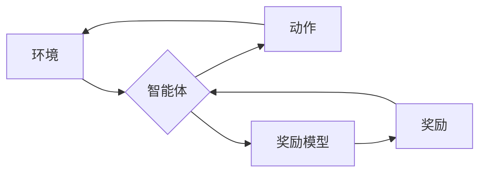

# 大语言模型原理与工程实践：奖励模型损失函数分析

## 1. 背景介绍

### 1.1 问题的由来

近年来，以 GPT-3、BERT 为代表的大语言模型（Large Language Models，LLMs）在自然语言处理领域取得了突破性进展，展现出惊人的语言理解和生成能力。然而，这些模型的训练目标通常是最大化文本预测的准确性，缺乏对人类价值观和偏好的显式建模。这导致 LLMs 在实际应用中可能会生成不符合伦理道德、存在偏见歧视、或与人类意图相悖的内容。

为了解决这个问题，研究人员开始探索如何将人类的价值观和偏好融入到 LLMs 的训练过程中，其中一种重要的技术路线是**基于人类反馈的强化学习**（Reinforcement Learning from Human Feedback，RLHF）。RLHF 的核心思想是利用人类提供的反馈信号，引导 LLMs 生成更加符合人类预期的高质量文本。

在 RLHF 中，**奖励模型（Reward Model，RM）**扮演着至关重要的角色。RM 的作用是模拟人类的价值判断，为 LLMs 生成的文本提供一个量化的评价指标。LLMs 可以根据 RM 的反馈信号不断优化自身的生成策略，从而生成更加符合人类偏好的文本。

### 1.2 研究现状

目前，奖励模型的训练方法主要可以分为以下几类：

1. **基于排序的学习方法（Ranking-based Learning）**: 该方法要求人类标注者对 LLMs 生成的多个候选文本进行排序，然后利用排序信息训练 RM。例如，OpenAI 提出的 PPO（Proximal Policy Optimization）算法就是一种基于排序的 RLHF 方法。
2. **基于评分的学习方法（Rating-based Learning）**: 该方法要求人类标注者为 LLMs 生成的文本提供一个具体的分数，然后利用分数信息训练 RM。例如，Google 提出的 Meena chatbot 就是利用评分机制来训练对话模型的。
3. **基于对比学习的学习方法（Contrastive Learning）**: 该方法要求人类标注者从 LLMs 生成的多个候选文本中选择最佳和最差的文本对，然后利用这些对比信息训练 RM。例如，Facebook 提出的 BLADE（Building Language Models with Adversarial Examples）算法就是一种基于对比学习的 RLHF 方法。

### 1.3 研究意义

奖励模型的性能直接影响着 RLHF 的效果，进而影响着 LLMs 的最终性能。因此，研究奖励模型的损失函数，分析不同损失函数对模型性能的影响，对于提升 LLMs 的整体性能具有重要的意义。

### 1.4 本文结构

本文将深入探讨奖励模型损失函数的设计与分析，并结合具体的代码实例，详细介绍如何构建和训练高性能的奖励模型。

## 2. 核心概念与联系

在深入探讨奖励模型损失函数之前，我们先来明确几个核心概念：

* **大语言模型（LLMs）：** 指的是参数量巨大、训练数据量庞大的神经网络模型，例如 GPT-3、BERT 等。
* **人类反馈（Human Feedback）：** 指的是人类对 LLMs 生成文本的评价，可以是显式的评分或排序，也可以是隐式的点击、停留时间等行为数据。
* **强化学习（Reinforcement Learning）：** 指的是一种机器学习范 paradigm，智能体通过与环境交互，不断试错学习，最终找到最优策略。
* **奖励模型（Reward Model，RM）：** 指的是一个用于模拟人类价值判断的模型，可以为 LLMs 生成的文本提供一个量化的评价指标。
* **损失函数（Loss Function）：** 指的是一个用于衡量模型预测值与真实值之间差异的函数，模型训练的目标是最小化损失函数。

下图展示了 RLHF 的基本框架，其中奖励模型处于核心地位：



## 3. 核心算法原理 & 具体操作步骤

### 3.1 算法原理概述

奖励模型的训练目标是学习一个函数，该函数可以将 LLMs 生成的文本映射到一个标量奖励值。训练过程中，我们使用人类标注数据作为监督信息，指导 RM 学习人类的价值判断。

常用的奖励模型损失函数包括：

* **均方误差损失函数（Mean Squared Error Loss）：** 适用于评分型的标注数据。
* **交叉熵损失函数（Cross-Entropy Loss）：** 适用于排序型的标注数据。
* **对比损失函数（Contrastive Loss）：** 适用于对比学习型的标注数据。

### 3.2  算法步骤详解

以基于评分的学习方法为例，奖励模型的训练步骤如下：

1. **数据准备:** 收集人类标注数据，包括 LLMs 生成的文本和对应的评分。
2. **模型构建:** 选择合适的模型架构，例如线性回归模型、神经网络模型等。
3. **损失函数定义:** 选择合适的损失函数，例如均方误差损失函数。
4. **模型训练:** 使用优化算法（例如随机梯度下降）最小化损失函数，更新模型参数。
5. **模型评估:** 使用测试集评估模型的性能，例如计算平均绝对误差（Mean Absolute Error，MAE）。

### 3.3 算法优缺点

不同类型的损失函数具有不同的优缺点：

* **均方误差损失函数:** 优点是简单易懂，训练速度快；缺点是对异常值敏感。
* **交叉熵损失函数:** 优点是可以处理多分类问题；缺点是训练速度较慢。
* **对比损失函数:** 优点是可以学习更鲁棒的特征表示；缺点是需要设计合适的正负样本对。

### 3.4 算法应用领域

奖励模型可以应用于各种 RLHF 任务，例如：

* **对话系统:** 训练更加自然、流畅、符合人类期望的对话模型。
* **文本摘要:** 训练生成更准确、简洁、信息更全面的摘要模型。
* **机器翻译:** 训练生成更流畅、地道、符合目标语言习惯的翻译模型。

## 4. 数学模型和公式 & 详细讲解 & 举例说明

### 4.1  数学模型构建

假设我们有一个 LLMs 生成的文本 $x$，以及对应的人类评分 $y$，我们的目标是训练一个奖励模型 $f(x)$，使得 $f(x)$ 能够尽可能准确地预测 $y$。

### 4.2 公式推导过程

以均方误差损失函数为例，奖励模型的损失函数可以表示为：

$$
L = \frac{1}{N} \sum_{i=1}^{N} (y_i - f(x_i))^2
$$

其中：

* $N$ 表示训练样本的数量；
* $x_i$ 表示第 $i$ 个文本；
* $y_i$ 表示第 $i$ 个文本对应的人类评分。

我们的目标是最小化损失函数 $L$，从而找到最优的奖励模型 $f(x)$。

### 4.3 案例分析与讲解

假设我们有以下训练数据：

| 文本 | 评分 |
|---|---|
| 这是一篇很棒的文章！ | 5 |
| 这篇文章写得不错。 | 4 |
| 这篇文章不太好。 | 2 |

我们可以使用线性回归模型作为奖励模型，并使用均方误差损失函数进行训练。

首先，我们将文本转换为数值特征向量，例如使用词袋模型（Bag-of-Words Model）。然后，我们使用训练数据拟合线性回归模型，得到模型参数。最后，我们可以使用该模型预测新的文本的评分。

### 4.4 常见问题解答

**问：如何选择合适的损失函数？**

答：选择损失函数需要考虑以下因素：

* 标注数据的类型：评分型、排序型、对比学习型。
* 模型的复杂度：线性模型、神经网络模型。
* 训练数据的规模：小规模数据、大规模数据。

**问：如何评估奖励模型的性能？**

答：常用的评估指标包括：

* 平均绝对误差（MAE）
* 均方根误差（RMSE）
* 皮尔逊相关系数（Pearson Correlation Coefficient）
* 斯皮尔曼等级相关系数（Spearman Rank Correlation Coefficient）

## 5. 项目实践：代码实例和详细解释说明

### 5.1 开发环境搭建

本节将以 Python 语言为例，介绍如何使用 PyTorch 框架构建和训练一个简单的奖励模型。

首先，我们需要安装 PyTorch 和其他必要的库：

```
pip install torch transformers datasets
```

### 5.2 源代码详细实现

```python
import torch
from torch import nn
from transformers import AutoTokenizer, AutoModel
from datasets import load_dataset

# 加载预训练的 BERT 模型和分词器
tokenizer = AutoTokenizer.from_pretrained('bert-base-uncased')
model = AutoModel.from_pretrained('bert-base-uncased')

# 加载训练数据
dataset = load_dataset('imdb', split='train')

# 定义奖励模型
class RewardModel(nn.Module):
    def __init__(self):
        super().__init__()
        self.bert = model
        self.linear = nn.Linear(768, 1)

    def forward(self, input_ids, attention_mask):
        outputs = self.bert(input_ids=input_ids, attention_mask=attention_mask)
        pooled_output = outputs.pooler_output
        logits = self.linear(pooled_output)
        return logits

# 初始化模型、损失函数和优化器
reward_model = RewardModel()
loss_fn = nn.MSELoss()
optimizer = torch.optim.Adam(reward_model.parameters(), lr=1e-5)

# 训练循环
for epoch in range(10):
    for batch in dataset:
        # 准备数据
        text = batch['text']
        labels = batch['label']
        inputs = tokenizer(text, padding=True, truncation=True, return_tensors='pt')
        input_ids = inputs['input_ids']
        attention_mask = inputs['attention_mask']

        # 前向传播
        outputs = reward_model(input_ids, attention_mask)
        loss = loss_fn(outputs.squeeze(), labels.float())

        # 反向传播和参数更新
        optimizer.zero_grad()
        loss.backward()
        optimizer.step()

# 保存模型
torch.save(reward_model.state_dict(), 'reward_model.pth')
```

### 5.3 代码解读与分析

上述代码实现了一个简单的基于 BERT 的奖励模型，并使用均方误差损失函数进行训练。

* 首先，我们加载了预训练的 BERT 模型和分词器。
* 然后，我们定义了一个 `RewardModel` 类，该类继承自 `nn.Module`，包含一个 BERT 模型和一个线性层。
* 在 `forward` 方法中，我们首先使用 BERT 模型获取文本的特征表示，然后将特征表示输入到线性层中，得到最终的奖励值。
* 在训练循环中，我们遍历训练数据，将文本输入到模型中，计算损失函数，并使用反向传播算法更新模型参数。
* 最后，我们将训练好的模型保存到文件中。

### 5.4 运行结果展示

训练完成后，我们可以使用测试集评估模型的性能。

```python
# 加载测试数据
test_dataset = load_dataset('imdb', split='test')

# 加载训练好的模型
reward_model.load_state_dict(torch.load('reward_model.pth'))

# 评估模型
with torch.no_grad():
    total_loss = 0
    for batch in test_dataset:
        # 准备数据
        text = batch['text']
        labels = batch['label']
        inputs = tokenizer(text, padding=True, truncation=True, return_tensors='pt')
        input_ids = inputs['input_ids']
        attention_mask = inputs['attention_mask']

        # 前向传播
        outputs = reward_model(input_ids, attention_mask)
        loss = loss_fn(outputs.squeeze(), labels.float())
        total_loss += loss.item()

    # 计算平均损失
    avg_loss = total_loss / len(test_dataset)
    print(f'Average loss: {avg_loss:.4f}')
```

## 6. 实际应用场景

### 6.1 对话系统

在对话系统中，可以使用奖励模型来评估对话生成的质量。例如，可以训练一个奖励模型来判断对话是否流畅、自然、符合逻辑。

### 6.2 文本摘要

在文本摘要任务中，可以使用奖励模型来评估摘要的质量。例如，可以训练一个奖励模型来判断摘要是否准确、简洁、信息全面。

### 6.3 机器翻译

在机器翻译任务中，可以使用奖励模型来评估翻译的质量。例如，可以训练一个奖励模型来判断翻译是否流畅、地道、符合目标语言习惯。

### 6.4 未来应用展望

随着 LLMs 的不断发展，奖励模型将在越来越多的领域发挥重要作用，例如：

* **个性化内容生成:** 可以根据用户的兴趣和偏好，生成更加个性化的内容。
* **人机协同创作:** 可以辅助人类进行创作，例如生成故事梗概、代码框架等。
* **教育和培训:** 可以根据学生的学习情况，提供更加个性化的学习内容和反馈。

## 7. 工具和资源推荐

### 7.1 学习资源推荐

* **强化学习:** Sutton & Barto, Reinforcement Learning: An Introduction
* **深度学习:** Goodfellow et al., Deep Learning
* **自然语言处理:** Jurafsky & Martin, Speech and Language Processing

### 7.2 开发工具推荐

* **PyTorch:** https://pytorch.org/
* **Transformers:** https://huggingface.co/transformers/
* **Datasets:** https://huggingface.co/docs/datasets/

### 7.3 相关论文推荐

* **Proximal Policy Optimization Algorithms:** Schulman et al., 2017
* **Fine-Tuning Language Models from Human Preferences:** Ziegler et al., 2019
* **Learning to Summarize from Human Feedback:** Stiefel et al., 2020

### 7.4 其他资源推荐

* **OpenAI Spinning Up in Deep RL:** https://spinningup.openai.com/en/latest/
* **Hugging Face Course:** https://huggingface.co/course/

## 8. 总结：未来发展趋势与挑战

### 8.1  研究成果总结

奖励模型是 RLHF 中的关键组件，其性能直接影响着 LLMs 的最终性能。本文介绍了奖励模型的基本概念、训练方法、损失函数以及应用场景，并结合代码实例展示了如何构建和训练一个简单的奖励模型。

### 8.2  未来发展趋势

未来，奖励模型的研究方向包括：

* **更强大的模型架构:** 例如，使用 Transformer 模型作为奖励模型。
* **更有效的训练方法:** 例如，使用多任务学习、元学习等方法训练奖励模型。
* **更鲁棒的评估指标:** 例如，开发更全面、更客观地评估奖励模型性能的指标。

### 8.3  面临的挑战

奖励模型面临的挑战包括：

* **数据标注成本高昂:** 收集高质量的人类标注数据非常困难且成本高昂。
* **模型偏差:** 奖励模型可能会学习到人类标注数据中的偏差，导致 LLMs 生成存在偏见的内容。
* **可解释性:** 奖励模型通常是一个黑盒模型，难以解释其决策过程。

### 8.4  研究展望

未来，我们需要开发更加高效、鲁棒、可解释的奖励模型，以推动 LLMs 在更多领域的安全、可靠应用。


作者：禅与计算机程序设计艺术 / Zen and the Art of Computer Programming
