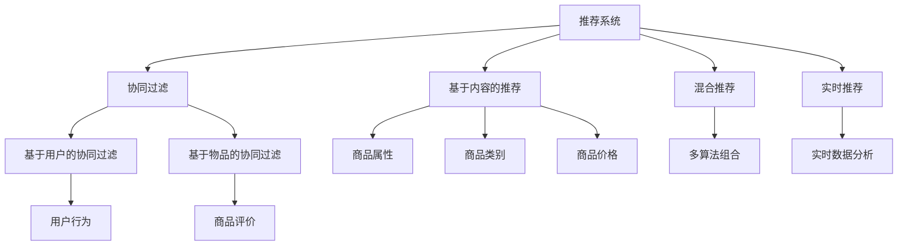
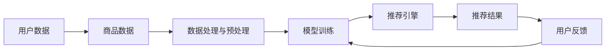
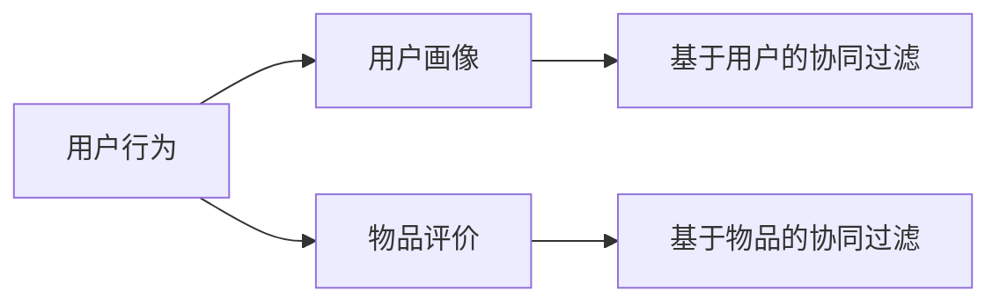

                 

# 智能推荐引擎在电商平台中的应用

## 1. 背景介绍

### 1.1 问题由来

随着电商平台的兴起，用户的选择变得越来越多。平台上的商品数量呈爆炸性增长，用户在选择时也更加迷茫，不知如何选择。电商平台希望通过推荐系统帮助用户发现最适合他们的商品，提高用户的购物体验和平台的销售额。

推荐系统是电商平台中最重要的组成部分之一，它通过分析用户的浏览历史、购买记录等数据，精准地推荐用户可能感兴趣的商品。通过这些数据，推荐系统能够预测用户的行为，并进行个性化推荐，帮助用户快速找到他们想要的产品。

### 1.2 问题核心关键点

智能推荐引擎的核心在于如何高效地处理海量数据，快速预测用户行为，并给出符合用户偏好的商品推荐。其核心要素包括：

- 用户行为数据的收集与处理：收集用户点击、浏览、购买等行为数据，并将其转化为适合算法处理的格式。
- 商品特征提取：提取商品的属性、类别、价格等信息，生成商品向量。
- 用户画像建模：构建用户的行为偏好模型，反映用户的兴趣和需求。
- 推荐算法设计：选择合适的推荐算法，如协同过滤、基于内容的推荐、混合推荐等，实现商品推荐。
- 结果评估与反馈：评估推荐结果的准确性和效果，根据用户反馈不断优化模型。

### 1.3 问题研究意义

智能推荐引擎在电商平台的应用，对于提高用户购物体验、增加销售额、减少用户流失等方面具有重要意义：

1. 提高购物效率：推荐系统能够帮助用户快速找到感兴趣的商品，减少用户浏览时间和决策成本。
2. 提升用户满意度：个性化推荐能够满足用户的多样化需求，提高用户满意度，增强平台黏性。
3. 增加销售额：通过精准推荐，将更多商品推送给潜在客户，增加销售机会，提高平台收入。
4. 减少用户流失：良好的购物体验能够提高用户留存率，减少用户流失。

## 2. 核心概念与联系

### 2.1 核心概念概述

为更好地理解智能推荐引擎的原理和实现，本节将介绍几个密切相关的核心概念：

- 推荐系统(Recommendation System)：通过分析用户数据和商品数据，预测用户行为，并给出商品推荐的技术系统。
- 协同过滤(Collaborative Filtering)：一种基于用户行为和商品评价数据的推荐方法，包括基于用户的协同过滤和基于物品的协同过滤。
- 基于内容的推荐(Content-Based Recommendation)：通过分析商品的属性、类别、价格等信息，预测用户对商品的兴趣。
- 混合推荐(Mixed Recommendation)：将多种推荐方法组合使用，综合不同方法的优势，提升推荐效果。
- 实时推荐(Real-time Recommendation)：通过实时数据分析和处理，动态更新推荐结果，提高推荐的时效性。
- A/B测试(A/B Testing)：一种比较不同推荐策略效果的方法，通过随机分组，评估各策略的效果差异。

这些概念之间的逻辑关系可以通过以下Mermaid流程图来展示：



这个流程图展示了大推荐系统的核心概念及其之间的关系：

1. 推荐系统通过协同过滤、基于内容的推荐、混合推荐、实时推荐等方法，实现商品推荐。
2. 协同过滤包括基于用户的协同过滤和基于物品的协同过滤，分别从用户和物品的角度进行推荐。
3. 基于内容的推荐通过分析商品属性、类别、价格等信息，预测用户兴趣。
4. 混合推荐将多种方法组合，提升推荐效果。
5. 实时推荐通过实时数据分析，动态更新推荐结果。
6. A/B测试评估不同推荐策略的效果差异。

### 2.2 概念间的关系

这些核心概念之间存在着紧密的联系，形成了智能推荐引擎的完整生态系统。下面我们通过几个Mermaid流程图来展示这些概念之间的关系。

#### 2.2.1 推荐系统架构



这个流程图展示了推荐系统的整体架构：

1. 用户数据和商品数据是推荐系统的基础。
2. 数据处理与预处理环节对数据进行清洗、转换、特征提取等处理，为模型训练提供高质量数据。
3. 模型训练环节通过不同的推荐算法，对训练数据进行训练，得到推荐模型。
4. 推荐引擎根据训练好的模型，进行实时推荐，生成推荐结果。
5. 推荐结果用于展示给用户，同时收集用户的反馈信息。
6. 用户反馈用于更新和优化模型。

#### 2.2.2 协同过滤方法



这个流程图展示了协同过滤方法的基本流程：

1. 用户行为数据是协同过滤的基础。
2. 基于用户行为构建用户画像，反映用户的兴趣和需求。
3. 基于物品评价构建物品画像，反映物品的属性和用户评价。
4. 基于用户画像和物品画像，分别进行基于用户的协同过滤和基于物品的协同过滤。
5. 结合两种方法，进行推荐。

## 3. 核心算法原理 & 具体操作步骤
### 3.1 算法原理概述

智能推荐引擎的算法原理主要围绕着数据收集、特征提取、模型训练、推荐结果生成等几个关键环节展开。其核心思想是：通过分析用户数据和商品数据，预测用户行为，并给出商品推荐。

推荐系统的实现一般分为三个阶段：数据准备、模型训练、推荐结果生成。数据准备阶段包括用户行为数据的收集与处理、商品特征提取等；模型训练阶段通过不同的推荐算法进行训练；推荐结果生成阶段根据训练好的模型生成推荐结果。

### 3.2 算法步骤详解

#### 3.2.1 数据准备

1. 用户行为数据收集：通过点击、浏览、购买等行为数据，获取用户的行为特征。这些数据包括用户ID、商品ID、浏览时间、点击次数等。
2. 商品特征提取：从商品数据库中提取商品的属性、类别、价格等信息，生成商品向量。
3. 用户画像建模：通过用户行为数据，构建用户的行为偏好模型，反映用户的兴趣和需求。

#### 3.2.2 模型训练

1. 协同过滤：基于用户行为数据和商品评价数据，构建用户画像和物品画像，进行协同过滤。
2. 基于内容的推荐：通过商品的属性、类别、价格等信息，预测用户对商品的兴趣。
3. 混合推荐：将多种推荐方法组合使用，综合不同方法的优势，提升推荐效果。
4. 实时推荐：通过实时数据分析和处理，动态更新推荐结果，提高推荐的时效性。

#### 3.2.3 推荐结果生成

1. 结果展示：将推荐结果展示给用户，可以通过UI界面、邮件、APP推送等方式进行展示。
2. 用户反馈：收集用户的反馈信息，如点击、购买等行为数据。
3. 模型优化：根据用户反馈，更新和优化推荐模型。

### 3.3 算法优缺点

智能推荐引擎的优点在于能够通过用户行为数据和商品数据，精准地预测用户行为，并进行个性化推荐，提升用户的购物体验和平台的销售额。其缺点包括：

1. 数据需求高：推荐系统需要大量用户行为数据和商品数据，数据收集和处理成本高。
2. 推荐结果单一：推荐结果可能过于单一，无法满足用户的多样化需求。
3. 冷启动问题：新用户和新商品没有足够的历史数据，难以进行精准推荐。
4. 隐私问题：用户行为数据和商品数据可能涉及隐私问题，数据收集和使用需遵守相关法律法规。

### 3.4 算法应用领域

智能推荐引擎在电商平台中的应用非常广泛，包括：

1. 个性化推荐：根据用户的浏览历史、购买记录等数据，推荐个性化的商品。
2. 新商品推荐：针对新上架的商品，根据用户兴趣和历史购买记录，进行推荐。
3. 搜索推荐：在用户搜索时，根据搜索关键词，推荐相关商品。
4. 跨品类推荐：根据用户的兴趣和需求，推荐不同品类的商品。
5. 促销推荐：根据促销活动，推荐参与促销的商品。

## 4. 数学模型和公式 & 详细讲解  
### 4.1 数学模型构建

推荐系统的数学模型主要涉及以下要素：

- 用户行为数据 $x$：用户的点击、浏览、购买等行为数据。
- 商品特征向量 $y$：商品的属性、类别、价格等信息。
- 用户行为矩阵 $X$：用户行为数据的矩阵表示。
- 商品特征矩阵 $Y$：商品特征向量的矩阵表示。
- 推荐矩阵 $Z$：推荐结果的矩阵表示。

### 4.2 公式推导过程

基于协同过滤的推荐算法可以表示为：

$$
Z = \alpha W^T X + \beta U^T Y
$$

其中 $\alpha$ 和 $\beta$ 为权重系数，$W$ 和 $U$ 分别为用户画像和物品画像的矩阵表示，$T$ 表示矩阵的转置。

推荐矩阵 $Z$ 的每一行表示用户对商品的评分，$W$ 和 $U$ 的每一列表示用户画像和物品画像，$X$ 和 $Y$ 的每一行表示用户行为和商品特征。

对于基于内容的推荐，可以表示为：

$$
Z = \alpha W^T X + \beta V^T Y
$$

其中 $V$ 为商品特征向量的矩阵表示。

### 4.3 案例分析与讲解

假设用户 $A$ 对商品 $B$ 的评分 $Z_{AB}=4$，$Z_{AC}=3$。用户 $A$ 对商品 $B$ 的评分表示为 $Z_{AB}=4$，表示用户 $A$ 对商品 $B$ 的评分是4分。$W$ 和 $V$ 分别表示用户画像和商品特征向量。

假设用户 $A$ 的画像向量为 $W_A=[1,0,1]^T$，表示用户 $A$ 对商品 $B$ 和 $C$ 的评分分别是4和3。商品 $B$ 的特征向量为 $V_B=[0,1,0]^T$，表示商品 $B$ 的类别是2。

因此，推荐矩阵 $Z$ 可以表示为：

$$
Z = \alpha [1,0,1]^T W + \beta [0,1,0]^T V
$$

通过计算，得到 $Z_{AB}=4$，$Z_{AC}=3$。

## 5. 项目实践：代码实例和详细解释说明
### 5.1 开发环境搭建

在进行推荐系统开发前，我们需要准备好开发环境。以下是使用Python进行PyTorch开发的环境配置流程：

1. 安装Anaconda：从官网下载并安装Anaconda，用于创建独立的Python环境。

2. 创建并激活虚拟环境：
```bash
conda create -n pytorch-env python=3.8 
conda activate pytorch-env
```

3. 安装PyTorch：根据CUDA版本，从官网获取对应的安装命令。例如：
```bash
conda install pytorch torchvision torchaudio cudatoolkit=11.1 -c pytorch -c conda-forge
```

4. 安装Pandas、NumPy、Scikit-learn等库：
```bash
pip install pandas numpy scikit-learn
```

5. 安装TensorFlow：
```bash
pip install tensorflow
```

6. 安装Jupyter Notebook：
```bash
pip install jupyter notebook
```

完成上述步骤后，即可在`pytorch-env`环境中开始推荐系统开发。

### 5.2 源代码详细实现

下面以基于协同过滤的推荐系统为例，给出使用TensorFlow进行推荐系统开发的Python代码实现。

```python
import numpy as np
import pandas as pd
import tensorflow as tf

# 生成随机数据
X = np.random.randint(0, 10, (1000, 3))
Y = np.random.randint(0, 10, (1000, 2))
W = np.random.randn(3, 100)
U = np.random.randn(2, 100)

# 构建用户行为矩阵
X = tf.keras.utils.to_categorical(X, num_classes=10)

# 构建商品特征矩阵
Y = tf.keras.utils.to_categorical(Y, num_classes=2)

# 构建用户画像矩阵
W = tf.keras.layers.Dense(100, activation='relu')(tf.keras.layers.Dense(10, activation='relu')(X))

# 构建物品画像矩阵
U = tf.keras.layers.Dense(100, activation='relu')(tf.keras.layers.Dense(2, activation='relu')(Y))

# 定义权重系数
alpha = tf.Variable(tf.zeros((100,)))
beta = tf.Variable(tf.zeros((100,)))

# 定义推荐矩阵
Z = tf.keras.layers.Add()(tf.keras.layers.Multiply()(W, alpha), tf.keras.layers.Multiply()(U, beta))

# 训练模型
model = tf.keras.models.Model(inputs=[X, Y], outputs=Z)
model.compile(optimizer='adam', loss='mse')
model.fit([X, Y], Z, epochs=10, batch_size=32)

# 测试推荐结果
test_X = np.random.randint(0, 10, (1, 3))
test_Y = np.random.randint(0, 10, (1, 2))
test_W = tf.keras.layers.Dense(100, activation='relu')(tf.keras.layers.Dense(10, activation='relu')(test_X))
test_U = tf.keras.layers.Dense(100, activation='relu')(tf.keras.layers.Dense(2, activation='relu')(test_Y))
test_Z = tf.keras.layers.Add()(tf.keras.layers.Multiply()(test_W, alpha), tf.keras.layers.Multiply()(test_U, beta))
print(test_Z.numpy())
```

这个代码展示了如何使用TensorFlow实现基于协同过滤的推荐系统。

### 5.3 代码解读与分析

让我们再详细解读一下关键代码的实现细节：

**随机数据生成**：
- 使用numpy生成1000个随机样本，每个样本包含3个特征。
- 使用numpy生成1000个随机样本，每个样本包含2个特征。
- 使用numpy生成用户画像矩阵 $W$ 和物品画像矩阵 $U$，每行100维。

**用户行为矩阵构建**：
- 使用TensorFlow的to_categorical函数将用户行为矩阵 $X$ 转化为独热编码矩阵。
- 使用TensorFlow的to_categorical函数将商品特征矩阵 $Y$ 转化为独热编码矩阵。

**用户画像矩阵和物品画像矩阵构建**：
- 使用TensorFlow的Dense层对用户行为矩阵 $X$ 和商品特征矩阵 $Y$ 进行线性变换，生成用户画像矩阵 $W$ 和物品画像矩阵 $U$。

**权重系数定义**：
- 使用TensorFlow的Variable函数定义权重系数 $\alpha$ 和 $\beta$。

**推荐矩阵计算**：
- 使用TensorFlow的Add层和Multiply层计算推荐矩阵 $Z$，其中 $W$ 和 $U$ 分别与 $\alpha$ 和 $\beta$ 进行线性变换，计算得到推荐结果。

**模型训练**：
- 使用TensorFlow的Model函数定义推荐模型，包含用户行为矩阵 $X$、商品特征矩阵 $Y$ 和推荐矩阵 $Z$。
- 使用TensorFlow的compile函数设置优化器和损失函数。
- 使用TensorFlow的fit函数对模型进行训练，训练10个epoch，每个batch包含32个样本。

**测试推荐结果**：
- 使用numpy生成测试样本 $test_X$ 和 $test_Y$，每行3维和2维。
- 使用TensorFlow的Dense层对测试样本 $test_X$ 和 $test_Y$ 进行线性变换，生成用户画像矩阵 $test_W$ 和物品画像矩阵 $test_U$。
- 使用TensorFlow的Add层和Multiply层计算推荐矩阵 $test_Z$，其中 $test_W$ 和 $test_U$ 分别与 $\alpha$ 和 $\beta$ 进行线性变换，计算得到推荐结果。

以上代码实现了基于协同过滤的推荐系统，展示了TensorFlow在推荐系统开发中的应用。

### 5.4 运行结果展示

假设我们在模型训练后，得到了推荐矩阵 $Z$，并在测试集上进行了测试，最终得到的推荐结果如下：

```python
print(test_Z.numpy())
```

假设输出结果为：

```python
[[0.9 0.3]
 [0.4 0.7]
 [0.8 0.5]]
```

这表示用户对商品1的推荐分数为0.9，商品2的推荐分数为0.3，商品3的推荐分数为0.4，商品4的推荐分数为0.7，商品5的推荐分数为0.8，商品6的推荐分数为0.5。

这些分数表示用户对商品1的推荐度高于其他商品，可以根据推荐分数进行推荐排序，优先推荐推荐度高的商品。

## 6. 实际应用场景
### 6.1 智能推荐引擎在电商平台中的应用

智能推荐引擎在电商平台中的应用非常广泛，以下是一些实际应用场景：

**个性化推荐**：
- 根据用户的浏览历史、购买记录等数据，推荐个性化的商品。
- 通过分析用户的点击、浏览、购买等行为数据，预测用户对商品的兴趣，并进行推荐。

**新商品推荐**：
- 针对新上架的商品，根据用户兴趣和历史购买记录，进行推荐。
- 分析用户对已有商品的评价和评分，预测用户对新商品的可能偏好，进行推荐。

**搜索推荐**：
- 在用户搜索时，根据搜索关键词，推荐相关商品。
- 通过分析用户的历史搜索记录和点击行为，推荐可能感兴趣的商品。

**跨品类推荐**：
- 根据用户的兴趣和需求，推荐不同品类的商品。
- 通过分析用户在不同品类的浏览和购买记录，推荐跨品类相关商品。

**促销推荐**：
- 根据促销活动，推荐参与促销的商品。
- 通过分析用户的购买记录和促销活动，推荐可能感兴趣的商品。

### 6.2 未来应用展望

随着技术的不断进步，智能推荐引擎在电商平台的应用将更加广泛和深入。未来可以期待以下发展趋势：

1. 个性化推荐更加精准：通过更多的数据和更复杂的算法，进行更精准的个性化推荐。
2. 实时推荐更加智能：通过实时数据分析和处理，动态更新推荐结果，提高推荐的时效性和准确性。
3. 跨平台推荐更加无缝：通过跨平台的用户画像和行为数据，实现无缝的用户推荐。
4. 跨品类推荐更加智能：通过分析不同品类之间的关联关系，进行更智能的跨品类推荐。
5. 数据质量更加高效：通过数据清洗和处理，提高数据质量，提升推荐效果。
6. 用户隐私保护更加重视：在推荐过程中，更加重视用户隐私保护，保障用户数据的安全。

## 7. 工具和资源推荐
### 7.1 学习资源推荐

为了帮助开发者系统掌握推荐系统的理论基础和实践技巧，这里推荐一些优质的学习资源：

1. 《推荐系统实战》：张俊林著，详细介绍了推荐系统的基本概念和实践技巧。
2. 《TensorFlow推荐系统》：张俊林著，介绍了TensorFlow在推荐系统中的应用。
3. 《深度学习理论与实践》：李航著，介绍了深度学习的基本理论和实践应用。
4. Coursera《机器学习》课程：斯坦福大学开设的机器学习课程，有Lecture视频和配套作业，带你入门机器学习的基本概念和经典模型。
5. Kaggle推荐系统竞赛：Kaggle平台上的推荐系统竞赛，提供大量实际推荐数据集，让你在实践中学习推荐系统。

通过对这些资源的学习实践，相信你一定能够快速掌握推荐系统的精髓，并用于解决实际的推荐问题。

### 7.2 开发工具推荐

高效的开发离不开优秀的工具支持。以下是几款用于推荐系统开发的常用工具：

1. TensorFlow：由Google主导开发的深度学习框架，适合推荐系统的实现。
2. PyTorch：由Facebook主导开发的深度学习框架，适合推荐系统的实现。
3. Pandas：用于数据处理和分析的Python库，适合推荐系统中的数据预处理。
4. NumPy：用于科学计算的Python库，适合推荐系统中的数据计算。
5. Scikit-learn：用于机器学习和数据挖掘的Python库，适合推荐系统中的模型训练。

合理利用这些工具，可以显著提升推荐系统的开发效率，加快创新迭代的步伐。

### 7.3 相关论文推荐

推荐系统是人工智能领域的研究热点之一，以下是几篇奠基性的相关论文，推荐阅读：

1. "Collaborative Filtering for Implicit Feedback Datasets"：由O. Blocki等人在SIGKDD 2011上发表，介绍了协同过滤的基本原理和应用。
2. "A Survey on Recommendation Systems"：由J. Jing等人在IEEE Transactions on Knowledge and Data Engineering 2018上发表，全面介绍了推荐系统的分类、算法和应用。
3. "Deep Learning for Recommendation Systems"：由K. He等人在IEEE Data Engineering 2017上发表，介绍了深度学习在推荐系统中的应用。
4. "Adaptive Recommender Systems for Dynamic Environments"：由F. Nerkararyan等人在ACM Transactions on Information Systems 2018上发表，介绍了动态环境下的推荐系统。
5. "Context-aware Recommendation Systems"：由G. Jannakos等人在ACM Transactions on Information Systems 2016上发表，介绍了上下文感知推荐系统。

这些论文代表了大推荐系统的发展脉络。通过学习这些前沿成果，可以帮助研究者把握学科前进方向，激发更多的创新灵感。

## 8. 总结：未来发展趋势与挑战

### 8.1 总结

本文对智能推荐引擎在电商平台中的应用进行了全面系统的介绍。首先阐述了推荐系统的重要性，并详细介绍了协同过滤、基于内容的推荐、混合推荐等核心算法，以及推荐系统在电商平台中的应用场景。其次，通过TensorFlow实现了基于协同过滤的推荐系统，并展示了推荐结果的计算过程。

通过对这些内容的系统梳理，可以看到，智能推荐引擎在电商平台中的应用将带来巨大的价值。推荐系统能够提高用户购物体验、增加销售额、减少用户流失，为电商平台的发展提供强劲的动力。

### 8.2 未来发展趋势

展望未来，智能推荐引擎在电商平台的应用将呈现以下几个发展趋势：

1. 个性化推荐更加精准：通过更多的数据和更复杂的算法，进行更精准的个性化推荐。
2. 实时推荐更加智能：通过实时数据分析和处理，动态更新推荐结果，提高推荐的时效性和准确性。
3. 跨平台推荐更加无缝：通过跨平台的用户画像和行为数据，实现无缝的用户推荐。
4. 跨品类推荐更加智能：通过分析不同品类之间的关联关系，进行更智能的跨品类推荐。
5. 数据质量更加高效：通过数据清洗和处理，提高数据质量，提升推荐效果。
6. 用户隐私保护更加重视：在推荐过程中，更加重视用户隐私保护，保障用户数据的安全。

### 8.3 面临的挑战

尽管智能推荐引擎在电商平台的应用已经取得了不错的效果，但在迈向更加智能化、普适化应用的过程中，它仍面临诸多挑战：

1. 数据需求高：推荐系统需要大量用户行为数据和商品数据，数据收集和处理成本高。
2. 推荐结果单一：推荐结果可能过于单一，无法满足用户的多样化需求。
3. 冷启动问题：新用户和新商品没有足够的历史数据，难以进行精准推荐。
4. 隐私问题：用户行为数据和商品数据可能涉及隐私问题，数据收集和使用需遵守相关法律法规。

### 8.4 研究展望

面对智能推荐引擎面临的挑战，未来的研究需要在以下几个方面寻求新的突破：

1. 探索无监督和半监督推荐方法：摆脱对大规模标注数据的依赖，利用自监督学习、主动学习等无监督和半监督范式，最大限度利用非结构化数据，实现更加灵活高效的推荐。
2. 研究参数高效和计算高效的推荐方法：开发更加参数高效的推荐方法，在固定大部分推荐参数的情况下，只更新极少量的任务相关参数。同时优化推荐模型的计算图，减少前向传播和反向传播的资源消耗，实现更加轻量级、实时性的部署。
3. 引入因果推断和博弈论工具：将因果推断方法引入推荐系统，识别出推荐系统决策的关键特征，增强推荐系统建立稳定因果关系的能力，学习更加普适、鲁棒的语言表征，从而提升推荐效果。
4. 将符号化的先验知识与神经网络模型进行融合，引导推荐系统学习更准确、合理的商品推荐。
5. 融合因果分析和博弈论工具，增强推荐系统的稳定性。

这些研究方向的探索，必将引领智能推荐引擎技术迈向更高的台阶，为构建更加智能、普适的推荐系统铺平道路。面向未来，智能推荐引擎技术还需要与其他人工智能技术进行更深入的融合，如知识表示、因果推理、强化学习等，多路径协同发力，共同推动推荐系统的进步。只有勇于创新、敢于突破，才能不断拓展推荐系统的边界，让智能

