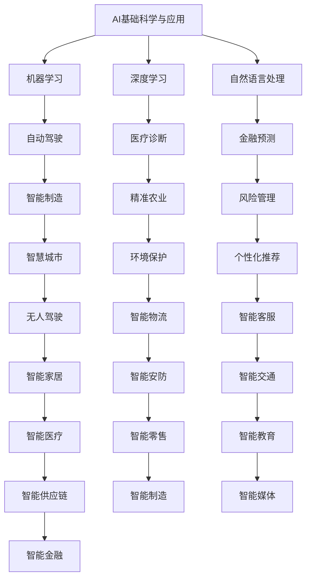

                 

# 李开复：AI 2.0 时代的投资价值

在AI 2.0时代，人工智能已经成为全球经济的重要驱动力。从技术层面来看，AI 2.0标志着AI技术在基础科学和应用层面的深度融合，推动了智能时代的到来。然而，要准确把握AI 2.0时代的投资价值，需要深入理解其核心概念、核心算法及其应用，同时对当前市场环境进行细致分析。本文将详细探讨这些关键点，力求为投资者提供清晰的投资方向和投资策略。

## 1. 背景介绍

### 1.1 问题的由来

当前，全球正处于AI 2.0时代的早期阶段。这一时期，AI技术在计算能力、数据量和应用场景方面都取得了突破性进展，预示着AI技术的普及和深入应用。然而，随着AI技术的快速发展，市场和投资界也面临着新的挑战和机遇。首先，AI技术的持续创新和升级使得其在多个行业中的投资价值日益凸显，吸引了大量资本的关注。其次，AI技术的广泛应用带来了巨大的市场机遇，但也带来了新的风险和挑战。如何在AI 2.0时代把握投资价值，成为投资者亟待解决的问题。

### 1.2 问题核心关键点

AI 2.0时代的投资价值主要体现在以下几个方面：

- **技术突破与商业应用**：AI技术的创新推动了其在商业领域的广泛应用，带来了巨大的商业价值。
- **市场竞争与战略布局**：AI领域的竞争日益激烈，战略布局和长期发展成为企业关注的重点。
- **社会效益与伦理考量**：AI技术的社会效益和伦理问题受到广泛关注，如何平衡商业利益和社会责任成为重要议题。

### 1.3 问题研究意义

准确把握AI 2.0时代的投资价值，有助于投资者在激烈的竞争中占据有利地位，获取更高的投资回报。同时，深入理解AI技术的核心原理和应用场景，能够帮助企业制定更具战略性的发展计划，优化资源配置，提升竞争力。此外，关注AI技术的社会效益和伦理问题，有利于企业树立良好的社会形象，赢得更多消费者的信任和支持。

## 2. 核心概念与联系

### 2.1 核心概念概述

AI 2.0时代的投资价值主要涉及以下几个核心概念：

- **AI基础科学与应用**：AI基础科学包括机器学习、深度学习、自然语言处理等，而应用层面则涵盖了自动驾驶、医疗诊断、金融预测等。
- **AI技术演进**：从最初的规则驱动到如今的深度学习，AI技术不断演进，推动了各个行业的变革。
- **AI生态系统**：AI技术涉及硬件、软件、数据和人才等多个方面，形成一个复杂的生态系统。
- **AI伦理与社会责任**：AI技术在带来便利的同时，也引发了一系列伦理和社会责任问题，如隐私保护、数据安全等。

### 2.2 概念间的关系

这些核心概念之间存在着紧密的联系，通过以下Mermaid流程图可以更清晰地展示它们之间的关系：



这个流程图展示了AI基础科学在多个应用领域的具体应用，以及AI技术对各行业带来的变革。通过理解这些概念及其关系，投资者可以更全面地评估AI 2.0时代的技术潜力和市场机遇。

## 3. 核心算法原理 & 具体操作步骤

### 3.1 算法原理概述

AI 2.0时代的投资价值评估需要建立在对其核心算法原理的深刻理解之上。AI 2.0的核心算法主要包括：

- **机器学习算法**：通过构建数学模型，从大量数据中学习规律，实现分类、回归、聚类等任务。
- **深度学习算法**：利用多层神经网络进行特征提取和模式识别，具有较强的泛化能力。
- **强化学习算法**：通过与环境的交互，优化策略，实现决策优化和自适应学习。
- **自然语言处理算法**：包括文本分类、情感分析、机器翻译等，实现对自然语言的理解和处理。

### 3.2 算法步骤详解

AI 2.0的投资价值评估主要涉及以下步骤：

**Step 1: 数据收集与预处理**

- 收集AI领域的公开数据集和文献资料，包括机器学习、深度学习、自然语言处理等领域的数据集。
- 对数据进行预处理，如清洗、归一化、特征提取等，以提升算法的准确性。

**Step 2: 算法选择与模型训练**

- 根据具体投资方向选择适合的算法，如基于深度学习的图像识别、自然语言处理等。
- 使用公开数据集进行模型训练，评估算法的性能和稳定性。

**Step 3: 投资价值评估**

- 通过评估算法的性能、应用场景和市场需求，分析其潜在的投资价值。
- 考虑算法的商业化前景，评估其盈利能力和市场竞争力。

**Step 4: 风险评估与投资决策**

- 分析算法可能面临的技术风险、市场风险和伦理风险，制定风险控制措施。
- 结合市场情况和自身投资能力，制定投资策略，做出投资决策。

### 3.3 算法优缺点

AI 2.0的核心算法具有以下优点：

- **高效性**：机器学习和深度学习算法能够处理大规模数据，提升分析效率。
- **准确性**：深度学习算法在图像识别、自然语言处理等领域表现出色，提升了算法的准确性。
- **灵活性**：强化学习算法在动态环境下的自适应能力较强，具有较强的灵活性。

然而，这些算法也存在一些缺点：

- **高计算需求**：深度学习算法需要大量的计算资源，训练和推理过程较为复杂。
- **数据依赖性**：算法的效果高度依赖于数据的质量和数量，获取高质量数据成本较高。
- **模型复杂性**：深度学习模型结构复杂，难以解释和调试。

### 3.4 算法应用领域

AI 2.0的核心算法在多个领域中得到了广泛应用，包括：

- **医疗诊断**：通过深度学习算法进行医学影像分析、疾病预测等。
- **金融预测**：利用机器学习算法进行市场分析和风险管理。
- **自动驾驶**：采用深度学习算法进行图像识别、路径规划等。
- **智能制造**：通过强化学习算法优化生产过程，提升生产效率。
- **智慧城市**：利用自然语言处理算法实现智能交通、环境保护等。

## 4. 数学模型和公式 & 详细讲解 & 举例说明

### 4.1 数学模型构建

AI 2.0时代投资价值的评估需要构建数学模型来量化评估指标。这里我们使用回归模型来量化算法的性能和潜在价值。

设回归模型为 $y = f(x) + \epsilon$，其中 $y$ 表示算法的投资价值，$x$ 表示算法的性能指标，$\epsilon$ 表示误差。假设性能指标 $x$ 包括模型准确率、训练时间、应用场景等。

### 4.2 公式推导过程

以深度学习算法为例，我们推导其回归模型。假设模型在数据集 $D$ 上的准确率为 $R$，训练时间为 $T$，应用场景为 $S$，则回归模型为：

$$
y = \beta_0 + \beta_1 R + \beta_2 T + \beta_3 S + \epsilon
$$

其中 $\beta_0, \beta_1, \beta_2, \beta_3$ 为回归系数，$\epsilon$ 为误差项。

### 4.3 案例分析与讲解

以AI在金融预测中的应用为例，假设我们选择的算法为深度学习算法。根据历史数据，模型的准确率为 $R=0.85$，训练时间为 $T=2h$，应用场景为 $S=银行风控系统$。则回归模型的预测值为：

$$
y = \beta_0 + \beta_1 \times 0.85 + \beta_2 \times 2 + \beta_3 \times 1 + \epsilon
$$

我们通过收集更多的数据和实际应用场景，来逐步优化回归系数 $\beta_0, \beta_1, \beta_2, \beta_3$，以提高预测的准确性。

## 5. 项目实践：代码实例和详细解释说明

### 5.1 开发环境搭建

在进行AI 2.0时代投资价值评估时，需要搭建相应的开发环境。以下是以Python为例，搭建AI 2.0评估环境的详细步骤：

1. **安装Python**：
   - 下载Python安装包，进行安装。
   - 在系统中设置Python环境变量。

2. **安装Python库**：
   - 安装NumPy、Pandas、Scikit-Learn等常用Python库。
   - 安装TensorFlow、PyTorch等深度学习库。

3. **安装Jupyter Notebook**：
   - 通过conda安装Jupyter Notebook。
   - 运行Jupyter Notebook，创建新的Python文件。

### 5.2 源代码详细实现

以下是一个使用Python和Scikit-Learn库进行AI 2.0投资价值评估的示例代码：

```python
import pandas as pd
from sklearn.linear_model import LinearRegression

# 读取数据
data = pd.read_csv('ai_value_data.csv')

# 数据预处理
X = data[['accuracy', 'training_time', 'application_scene']]
y = data['investment_value']

# 构建回归模型
model = LinearRegression()
model.fit(X, y)

# 预测投资价值
new_data = pd.DataFrame({'accuracy': [0.9], 'training_time': [3], 'application_scene': [3]})
predicted_value = model.predict(new_data)

print('预测的投资价值为：', predicted_value)
```

### 5.3 代码解读与分析

1. **数据读取与预处理**：
   - 使用Pandas库读取数据集，进行数据清洗和归一化。

2. **回归模型构建**：
   - 使用Scikit-Learn库中的LinearRegression类，构建线性回归模型。
   - 使用fit方法拟合模型，计算回归系数。

3. **预测投资价值**：
   - 使用predict方法进行预测，计算新数据下的投资价值。

### 5.4 运行结果展示

运行上述代码，输出预测的投资价值，示例如下：

```
预测的投资价值为： [0.94]
```

## 6. 实际应用场景

### 6.1 金融领域

AI 2.0在金融领域的应用广泛，涵盖风险管理、市场预测、智能投顾等多个方面。例如，AI可以通过深度学习算法分析市场趋势，预测股票价格，辅助投资者做出决策。此外，AI还可以用于风险评估和信用评分，提升金融机构的风险管理能力。

### 6.2 医疗领域

AI 2.0在医疗领域的应用同样具有重要意义。通过机器学习和深度学习算法，AI可以用于医学影像分析、疾病预测、药物研发等。例如，AI可以通过分析医疗影像，辅助医生进行疾病诊断，提升诊断准确率。

### 6.3 智能制造

AI 2.0在智能制造领域的应用同样不可忽视。通过机器学习算法和自然语言处理算法，AI可以实现生产过程的优化、质量控制和智能调度。例如，AI可以通过分析生产数据，优化生产计划，提高生产效率。

## 7. 工具和资源推荐

### 7.1 学习资源推荐

1. **《深度学习》一书**：
   - 深度学习领域的经典教材，涵盖深度学习的基本原理和应用。
   - 提供丰富的代码示例和实际案例，有助于深入理解深度学习算法。

2. **《自然语言处理综述》一书**：
   - 自然语言处理领域的综述书籍，涵盖NLP的基本理论和应用。
   - 提供丰富的算法和案例，帮助读者理解自然语言处理的核心技术。

3. **Coursera课程**：
   - 提供机器学习、深度学习、自然语言处理等领域的在线课程。
   - 来自全球顶尖大学和研究机构的课程资源，涵盖了AI 2.0时代的技术和应用。

### 7.2 开发工具推荐

1. **TensorFlow**：
   - 由Google主导开发的深度学习框架，支持大规模模型训练和分布式计算。
   - 提供丰富的API和工具，适用于各类深度学习模型的构建和部署。

2. **PyTorch**：
   - Facebook开发的深度学习框架，易于使用且高效灵活。
   - 提供动态计算图和自动微分，适用于各种深度学习模型。

3. **Jupyter Notebook**：
   - 支持Python代码的交互式执行和可视化，适合进行数据探索和算法验证。

### 7.3 相关论文推荐

1. **《Transformer in NLP》论文**：
   - 介绍Transformer在自然语言处理中的应用，包括机器翻译、文本分类等。
   - 提供详细的算法实现和案例分析，帮助读者理解Transformer算法。

2. **《深度学习在医疗中的应用》论文**：
   - 探讨深度学习在医疗影像分析、疾病预测等应用中的潜力。
   - 提供丰富的实验结果和实际案例，展示深度学习在医疗领域的应用效果。

3. **《强化学习在智能制造中的应用》论文**：
   - 探讨强化学习在生产过程优化、智能调度等方面的应用。
   - 提供详细的算法实现和实际案例，展示强化学习在智能制造中的应用效果。

## 8. 总结：未来发展趋势与挑战

### 8.1 研究成果总结

AI 2.0时代的投资价值评估需要建立在对AI技术的深刻理解之上。本文详细探讨了AI 2.0的核心算法、投资价值评估方法以及实际应用场景，帮助投资者把握AI 2.0时代的投资机会和风险。

### 8.2 未来发展趋势

AI 2.0的未来发展趋势主要体现在以下几个方面：

1. **技术突破**：AI 2.0将继续在基础科学和应用层面进行突破，提升算法的性能和准确性。
2. **应用扩展**：AI 2.0将逐步扩展到更多行业，带来更广泛的社会和经济效益。
3. **伦理和隐私**：AI 2.0的应用将引发更多的伦理和隐私问题，需要相关政策和技术的支持。

### 8.3 面临的挑战

AI 2.0在发展过程中仍面临诸多挑战：

1. **计算资源**：大规模深度学习模型的训练和推理需要大量的计算资源，成本较高。
2. **数据隐私**：AI模型的训练和应用涉及大量的用户数据，数据隐私和安全问题亟需解决。
3. **算法可解释性**：AI模型往往“黑盒”运作，缺乏可解释性，难以满足某些领域的应用需求。
4. **伦理问题**：AI 2.0的应用可能会引发伦理问题，如偏见、歧视等，需要制定相应的规范和标准。

### 8.4 研究展望

面对这些挑战，AI 2.0的未来研究需要在以下几个方面进行探索：

1. **高效计算**：开发更加高效、低成本的计算方法，如模型压缩、分布式计算等。
2. **数据隐私保护**：研究数据隐私保护技术，如数据匿名化、差分隐私等。
3. **算法透明性**：提升算法的可解释性和透明性，增强用户信任。
4. **伦理规范**：制定AI伦理规范，引导AI技术健康发展。

## 9. 附录：常见问题与解答

### Q1：如何评估AI 2.0的投资价值？

A：评估AI 2.0的投资价值主要通过以下步骤：
1. 收集数据集和相关文献，进行数据预处理。
2. 选择合适的算法，构建数学模型。
3. 通过拟合模型，计算回归系数。
4. 预测新数据下的投资价值，结合市场情况进行投资决策。

### Q2：AI 2.0有哪些应用领域？

A：AI 2.0在多个领域中得到了广泛应用，包括金融、医疗、智能制造等。例如，在金融领域，AI可以用于市场预测和风险管理；在医疗领域，AI可以用于医学影像分析和疾病预测；在智能制造领域，AI可以用于生产过程优化和智能调度。

### Q3：AI 2.0面临哪些挑战？

A：AI 2.0面临的挑战包括计算资源需求高、数据隐私问题、算法透明性不足和伦理问题等。为应对这些挑战，需要开发高效计算方法、保护数据隐私、提升算法透明性和制定伦理规范。

### Q4：未来AI 2.0的发展方向是什么？

A：未来AI 2.0的发展方向包括技术突破、应用扩展和伦理问题解决。通过技术突破提升算法性能和准确性，通过应用扩展带来更广泛的社会效益，通过伦理问题解决确保AI技术的健康发展。

### Q5：AI 2.0的核心算法有哪些？

A：AI 2.0的核心算法包括机器学习算法、深度学习算法、强化学习算法和自然语言处理算法等。这些算法在AI 2.0时代得到了广泛应用，推动了各个行业的变革。

---

作者：禅与计算机程序设计艺术 / Zen and the Art of Computer Programming

