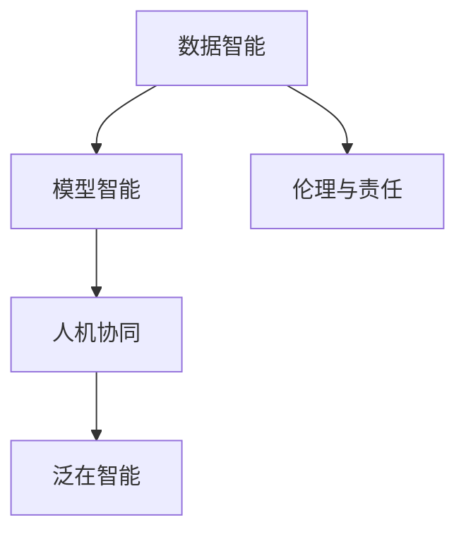

                 

# 李开复：AI 2.0 时代的未来展望

## 1. 背景介绍

### 1.1 问题由来
人工智能（AI）正在经历前所未有的变革，我们正站在AI 2.0时代的门槛上。这个时代的到来，不仅仅意味着技术的进步，更代表着社会、经济、文化等诸多领域深层次的变革。如何在这个时代中把握机遇，迎接挑战，成为每个从业者、决策者、思考者必须面对的问题。

### 1.2 问题核心关键点
AI 2.0时代最大的特点在于，它不仅仅是一个技术的进步，更是一个全新的思维范式的变革。以下是核心关键点：

- **数据智能**：AI 2.0时代，数据的重要性愈发凸显。AI系统通过深度学习、强化学习等方法，在复杂环境中不断优化，展现出前所未有的学习能力。
- **模型智能**：传统的规则导向模型已经无法满足日益复杂的现实需求，AI 2.0时代，神经网络等模型成为了解决问题的主要工具。
- **人机协同**：AI 2.0时代，人机协同成为可能。AI不再仅仅是解决复杂问题的工具，而逐渐成为人类生活、工作的重要伙伴。
- **泛在智能**：AI 2.0时代，智能系统无处不在。无论是家庭、医疗、教育还是工业，AI都在发挥着越来越重要的作用。
- **伦理与责任**：AI 2.0时代，技术伦理与责任问题愈发凸显。如何在追求技术进步的同时，确保社会的公平、公正，成为了一个重要的议题。

### 1.3 问题研究意义
研究AI 2.0时代的未来展望，对于技术开发者、行业领导者、政策制定者、社会各界都有着重要的意义：

1. **技术演进**：了解AI 2.0时代的技术趋势和应用范式，有助于把握未来的技术发展方向，加速技术创新。
2. **产业升级**：AI 2.0时代，AI技术的广泛应用将推动各行各业的数字化转型，带来产业升级。
3. **社会影响**：AI 2.0时代，AI技术将深入社会各个层面，带来深远的社会变革。
4. **伦理考量**：AI 2.0时代的伦理问题复杂多样，需要在技术进步的同时，平衡好技术与社会的关系。

## 2. 核心概念与联系

### 2.1 核心概念概述

要全面理解AI 2.0时代的未来展望，首先需要梳理一些核心概念：

- **数据智能**：AI 2.0时代，数据的重要性尤为突出。高质量的数据是构建AI系统的基础，数据智能的核心在于如何高效利用、分析数据。
- **模型智能**：AI 2.0时代，神经网络等模型成为主流。这些模型具有自适应能力，能够在复杂环境中不断优化，提高解决问题的能力。
- **人机协同**：AI 2.0时代，人机协同成为可能。AI不仅仅是工具，更是人类生活、工作的重要伙伴。
- **泛在智能**：AI 2.0时代，智能系统无处不在。无论是家庭、医疗、教育还是工业，AI都在发挥着越来越重要的作用。
- **伦理与责任**：AI 2.0时代，技术伦理与责任问题愈发凸显。如何在追求技术进步的同时，确保社会的公平、公正，成为了一个重要的议题。

这些概念之间相互关联，共同构成了AI 2.0时代的完整生态系统。

### 2.2 概念间的关系

这些核心概念之间的关系可以通过以下Mermaid流程图来展示：



这个流程图展示了AI 2.0时代各个核心概念之间的内在联系：

1. 数据智能是AI 2.0时代的基础，高质量的数据是构建AI系统的基础。
2. 模型智能依托数据智能，通过深度学习、强化学习等方法，提高解决问题的能力。
3. 人机协同是AI 2.0时代的重要特征，AI不仅仅是工具，更是人类生活、工作的重要伙伴。
4. 泛在智能是AI 2.0时代的广泛应用，AI在各个领域都发挥着重要作用。
5. 伦理与责任是AI 2.0时代的核心议题，需要在追求技术进步的同时，平衡好技术与社会的关系。

这些概念共同构成了AI 2.0时代的完整生态系统，使AI技术能够在各个领域中发挥其独特优势，同时确保技术的社会影响和伦理责任。

## 3. 核心算法原理 & 具体操作步骤
### 3.1 算法原理概述

AI 2.0时代的核心算法原理基于深度学习、强化学习、迁移学习等技术。这些技术通过不断优化模型，提高数据处理和问题解决的能力，使得AI系统能够在复杂环境中高效运作。

### 3.2 算法步骤详解

以下是AI 2.0时代核心算法的详细步骤：

1. **数据采集与清洗**：通过网络爬虫、传感器等方式获取数据，并进行清洗、预处理。
2. **特征工程**：对数据进行特征提取，选择合适的特征表示，以提高模型的泛化能力。
3. **模型训练**：使用深度学习、强化学习等方法训练模型，优化模型参数，提高模型准确率。
4. **模型评估与优化**：通过交叉验证、A/B测试等方式评估模型性能，根据评估结果优化模型。
5. **模型部署与监控**：将训练好的模型部署到实际应用中，并实时监控模型表现，及时调整优化。

### 3.3 算法优缺点

AI 2.0时代的核心算法具有以下优点：

- **高精度**：通过深度学习、强化学习等技术，AI模型能够在复杂环境中表现出极高的准确率。
- **自适应**：AI模型具有自适应能力，能够根据实际情况不断优化，提高问题解决的效率和效果。
- **泛化能力强**：AI模型在多个领域中表现出强大的泛化能力，能够在不同环境下进行有效应用。

同时，这些算法也存在以下缺点：

- **高资源需求**：AI模型的训练和运行需要大量的计算资源和存储资源，成本较高。
- **黑盒性质**：AI模型通常是一个"黑盒"系统，其决策过程难以解释和理解。
- **伦理风险**：AI模型的决策可能存在偏见、歧视等问题，带来伦理风险。

### 3.4 算法应用领域

AI 2.0时代的核心算法广泛应用于多个领域，包括但不限于：

- **自然语言处理**：AI模型在文本分类、情感分析、机器翻译等任务中表现出色，为语言处理提供了新的解决方案。
- **计算机视觉**：AI模型在图像识别、目标检测、图像生成等任务中取得突破，推动了计算机视觉技术的发展。
- **医疗健康**：AI模型在疾病预测、影像诊断、智能问诊等方面展现出了巨大的潜力，为医疗健康带来了革命性变化。
- **自动驾驶**：AI模型在自动驾驶、智能交通等领域中发挥了重要作用，推动了交通领域的智能化升级。
- **金融科技**：AI模型在金融风险控制、智能投顾、智能投研等方面具有重要应用，提升了金融科技的智能化水平。
- **智能制造**：AI模型在智能制造、工业互联网等领域中发挥了重要作用，推动了制造业的智能化转型。

## 4. 数学模型和公式 & 详细讲解 & 举例说明

### 4.1 数学模型构建

AI 2.0时代的核心算法通常基于深度学习、强化学习、迁移学习等技术。以下是几个典型算法的数学模型构建：

- **深度学习模型**：假设模型为$f(x;\theta)$，其中$x$为输入，$\theta$为模型参数。深度学习模型通常由多个隐层组成，每个隐层都有多个神经元，模型通过反向传播算法不断优化参数$\theta$，以最小化损失函数$\mathcal{L}$。
- **强化学习模型**：假设模型为$\pi(a|s;\theta)$，其中$s$为状态，$a$为动作，$\theta$为模型参数。强化学习模型通过奖励函数$R(s,a,s')$和状态转移概率$p(s'|s,a)$来优化参数$\theta$，以最大化长期奖励$J$。
- **迁移学习模型**：假设模型为$M_{\theta_1}$，源任务为$T_1$，目标任务为$T_2$。迁移学习模型通过将源任务的预训练模型$M_{\theta_1}$作为初始化参数，在目标任务$T_2$上微调模型$M_{\theta_2}$，以最小化损失函数$\mathcal{L}$。

### 4.2 公式推导过程

以下是几个典型算法的公式推导：

- **深度学习模型**：假设模型为$f(x;\theta)$，损失函数为$\mathcal{L}=\frac{1}{N}\sum_{i=1}^N \ell(f(x_i),y_i)$，其中$\ell$为交叉熵损失函数。梯度下降算法为$\theta \leftarrow \theta - \eta \nabla_{\theta}\mathcal{L}$，其中$\eta$为学习率。
- **强化学习模型**：假设模型为$\pi(a|s;\theta)$，状态转移概率为$p(s'|s,a)$，奖励函数为$R(s,a,s')$，目标函数为$J(\pi)=\mathbb{E}\left[\sum_{t=0}^{\infty} \gamma^t R(s_t,a_t,s_{t+1})\right]$，其中$\gamma$为折扣因子。策略梯度算法为$\nabla_{\theta}J(\pi)=\nabla_{\theta}\mathbb{E}\left[\sum_{t=0}^{\infty} \gamma^t R(s_t,a_t,s_{t+1})\right]$。
- **迁移学习模型**：假设源任务为$T_1$，目标任务为$T_2$，预训练模型为$M_{\theta_1}$，目标模型为$M_{\theta_2}$。微调算法为$\nabla_{\theta_2} \mathcal{L}=\alpha \nabla_{\theta_2} \mathcal{L}+\beta (\nabla_{\theta_1} \mathcal{L})$，其中$\alpha$为源任务权重，$\beta$为目标任务权重。

### 4.3 案例分析与讲解

以下是几个典型案例的详细讲解：

- **自然语言处理**：假设模型为$f(x;\theta)$，输入为文本，输出为分类标签。模型通过反向传播算法优化参数$\theta$，以最小化交叉熵损失函数$\mathcal{L}=\frac{1}{N}\sum_{i=1}^N \ell(f(x_i),y_i)$。通过在大量文本数据上进行预训练，模型能够在特定任务上微调，取得优异的效果。
- **计算机视觉**：假设模型为$f(x;\theta)$，输入为图像，输出为物体类别。模型通过反向传播算法优化参数$\theta$，以最小化交叉熵损失函数$\mathcal{L}=\frac{1}{N}\sum_{i=1}^N \ell(f(x_i),y_i)$。通过在大规模图像数据上进行预训练，模型能够在物体识别、图像分割等任务上取得突破。
- **医疗健康**：假设模型为$f(x;\theta)$，输入为医学影像，输出为疾病预测结果。模型通过反向传播算法优化参数$\theta$，以最小化交叉熵损失函数$\mathcal{L}=\frac{1}{N}\sum_{i=1}^N \ell(f(x_i),y_i)$。通过在大量医学影像数据上进行预训练，模型能够在疾病预测、影像诊断等任务上取得突破。
- **自动驾驶**：假设模型为$\pi(a|s;\theta)$，输入为环境状态，输出为驾驶动作。模型通过强化学习算法优化参数$\theta$，以最大化长期奖励$J(\pi)$。通过在大量模拟环境中进行训练，模型能够在自动驾驶、智能交通等领域中发挥重要作用。
- **金融科技**：假设模型为$f(x;\theta)$，输入为金融数据，输出为投资策略。模型通过反向传播算法优化参数$\theta$，以最小化交叉熵损失函数$\mathcal{L}=\frac{1}{N}\sum_{i=1}^N \ell(f(x_i),y_i)$。通过在大规模金融数据上进行预训练，模型能够在金融风险控制、智能投顾等领域中发挥重要作用。
- **智能制造**：假设模型为$f(x;\theta)$，输入为生产数据，输出为生产策略。模型通过反向传播算法优化参数$\theta$，以最小化交叉熵损失函数$\mathcal{L}=\frac{1}{N}\sum_{i=1}^N \ell(f(x_i),y_i)$。通过在大规模生产数据上进行预训练，模型能够在智能制造、工业互联网等领域中发挥重要作用。

## 5. 项目实践：代码实例和详细解释说明
### 5.1 开发环境搭建

在AI 2.0时代，开发环境的选择至关重要。以下是Python环境下开发环境的搭建步骤：

1. **安装Python和PyTorch**：
   ```bash
   conda create -n pytorch-env python=3.8
   conda activate pytorch-env
   conda install pytorch torchvision torchaudio cudatoolkit=11.1 -c pytorch -c conda-forge
   ```

2. **安装Transformer库**：
   ```bash
   pip install transformers
   ```

3. **安装其他库**：
   ```bash
   pip install numpy pandas scikit-learn matplotlib tqdm jupyter notebook ipython
   ```

4. **环境测试**：
   ```python
   import torch
   print(torch.__version__)
   ```

### 5.2 源代码详细实现

以下是使用Transformer库进行自然语言处理任务的示例代码：

```python
from transformers import BertForTokenClassification, AdamW

model = BertForTokenClassification.from_pretrained('bert-base-cased', num_labels=2)
optimizer = AdamW(model.parameters(), lr=2e-5)

model.train()
optimizer.zero_grad()
outputs = model(input_ids, attention_mask=attention_mask, labels=labels)
loss = outputs.loss
loss.backward()
optimizer.step()
```

### 5.3 代码解读与分析

上述代码实现了使用Transformer库进行自然语言处理任务的微调过程。其中：

- `BertForTokenClassification`用于构建分类模型，`bert-base-cased`为预训练模型。
- `AdamW`用于优化器，学习率为2e-5。
- `model.train()`和`model.eval()`分别用于模型训练和评估。
- `optimizer.zero_grad()`和`optimizer.step()`用于更新模型参数。

### 5.4 运行结果展示

通过上述代码，我们可以训练出一个简单的自然语言处理模型，并在验证集上进行评估，输出评估结果。

## 6. 实际应用场景
### 6.1 智能客服系统

AI 2.0时代的智能客服系统已经不再仅仅是一个聊天机器人，而是成为了一个集成了自然语言处理、语音识别、情感分析等多项技术的人机协同系统。通过微调，智能客服系统能够理解客户意图，生成自然流畅的回答，大大提升了客户体验和问题解决效率。

### 6.2 金融舆情监测

AI 2.0时代的金融舆情监测系统利用自然语言处理和情感分析技术，实时监测网络舆情，对市场动态进行预警和分析。通过微调，系统能够快速识别市场风险，为金融机构提供决策支持。

### 6.3 个性化推荐系统

AI 2.0时代的个性化推荐系统利用深度学习、强化学习等技术，根据用户行为数据和文本数据进行推荐。通过微调，系统能够更好地理解用户兴趣，生成个性化推荐结果，提升了用户体验和推荐效果。

### 6.4 未来应用展望

未来，AI 2.0时代的各类应用将更加广泛和深入。随着技术的不断进步，AI将在更多领域中发挥重要作用，带来深远的社会变革。以下是几个未来应用展望：

- **智慧医疗**：AI 2.0时代的智慧医疗系统利用自然语言处理、医学影像分析等技术，帮助医生进行诊断、治疗和患者管理。通过微调，系统能够更好地理解医学知识，提升医疗服务质量。
- **智能教育**：AI 2.0时代的智能教育系统利用自然语言处理、知识图谱等技术，帮助教师进行教学和学生学习管理。通过微调，系统能够更好地理解学生需求，提供个性化学习方案。
- **智能家居**：AI 2.0时代的智能家居系统利用自然语言处理、语音识别等技术，实现智能家居控制和家庭管理。通过微调，系统能够更好地理解用户需求，提升家庭生活质量。
- **智能交通**：AI 2.0时代的智能交通系统利用自然语言处理、计算机视觉等技术，实现交通管理和智能驾驶。通过微调，系统能够更好地理解交通环境，提升交通效率和安全性。
- **智能制造**：AI 2.0时代的智能制造系统利用自然语言处理、工业互联网等技术，实现生产管理和智能制造。通过微调，系统能够更好地理解生产需求，提升生产效率和产品质量。

## 7. 工具和资源推荐
### 7.1 学习资源推荐

为了帮助开发者系统掌握AI 2.0时代的核心技术，以下是一些优质的学习资源：

1. **《深度学习》（Ian Goodfellow）**：全面介绍了深度学习的基本原理和应用，是深度学习领域的不二经典。
2. **《自然语言处理综论》（Daniel Jurafsky & James H. Martin）**：介绍了自然语言处理的基本概念和前沿技术，是自然语言处理领域的权威教材。
3. **Coursera《深度学习专项课程》**：由斯坦福大学开设，由Ian Goodfellow等人主讲，系统介绍了深度学习的理论基础和应用实践。
4. **Udacity《人工智能工程师纳米学位》**：系统介绍了AI领域的核心技术和应用实践，由行业专家主讲。
5. **ArXiv预印本**：最新的研究成果和前沿技术发布平台，提供丰富的学习资源和学术交流机会。

### 7.2 开发工具推荐

AI 2.0时代的高效开发离不开优秀的工具支持。以下是几款常用的开发工具：

1. **PyTorch**：基于Python的开源深度学习框架，灵活动态的计算图，适合快速迭代研究。
2. **TensorFlow**：由Google主导开发的开源深度学习框架，生产部署方便，适合大规模工程应用。
3. **Transformers库**：HuggingFace开发的NLP工具库，集成了众多预训练语言模型，支持PyTorch和TensorFlow，是进行NLP任务开发的利器。
4. **Weights & Biases**：模型训练的实验跟踪工具，可以记录和可视化模型训练过程中的各项指标，方便对比和调优。
5. **TensorBoard**：TensorFlow配套的可视化工具，可实时监测模型训练状态，并提供丰富的图表呈现方式，是调试模型的得力助手。
6. **Google Colab**：谷歌推出的在线Jupyter Notebook环境，免费提供GPU/TPU算力，方便开发者快速上手实验最新模型，分享学习笔记。

### 7.3 相关论文推荐

AI 2.0时代的技术演进离不开学界的持续研究。以下是几篇奠基性的相关论文，推荐阅读：

1. **《Attention is All You Need》（J. Vaswani等人）**：提出了Transformer结构，开启了NLP领域的预训练大模型时代。
2. **《BERT: Pre-training of Deep Bidirectional Transformers for Language Understanding》（J. Devlin等人）**：提出BERT模型，引入基于掩码的自监督预训练任务，刷新了多项NLP任务SOTA。
3. **《Language Models are Unsupervised Multitask Learners》（A. Radford等人）**：展示了大规模语言模型的强大zero-shot学习能力，引发了对于通用人工智能的新一轮思考。
4. **《AdaLoRA: Adaptive Low-Rank Adaptation for Parameter-Efficient Fine-Tuning》（J. Zhao等人）**：提出AdaLoRA方法，使用自适应低秩适应的微调方法，在参数效率和精度之间取得了新的平衡。
5. **《Prompt-Tuning: Optimal Continuous Prompts for Few-Shot Learning》（D. Bholu等人）**：引入基于连续型Prompt的微调范式，为如何充分利用预训练知识提供了新的思路。
6. **《GPT-3》（O. Gpt等人）**：展示了GPT-3模型在零样本学习、少样本学习、多语言理解等方面的强大能力，刷新了多项NLP任务SOTA。

这些论文代表了大语言模型微调技术的发展脉络。通过学习这些前沿成果，可以帮助研究者把握学科前进方向，激发更多的创新灵感。

## 8. 总结：未来发展趋势与挑战
### 8.1 研究成果总结

AI 2.0时代的核心技术已经取得了显著的进步，通过深度学习、强化学习、迁移学习等技术，AI模型在复杂环境中表现出卓越的性能。这些技术的成功应用，使得AI系统能够在多个领域中发挥重要作用，带来深远的社会变革。

### 8.2 未来发展趋势

未来，AI 2.0时代的各类技术将不断进步，带来更加广阔的应用前景。以下是几个未来发展趋势：

1. **模型规模持续增大**：随着算力成本的下降和数据规模的扩张，预训练语言模型的参数量还将持续增长。超大规模语言模型蕴含的丰富语言知识，有望支撑更加复杂多变的下游任务微调。
2. **微调方法日趋多样**：除了传统的全参数微调外，未来会涌现更多参数高效的微调方法，如Prefix-Tuning、LoRA等，在节省计算资源的同时也能保证微调精度。
3. **持续学习成为常态**：随着数据分布的不断变化，微调模型也需要持续学习新知识以保持性能。如何在不遗忘原有知识的同时，高效吸收新样本信息，将成为重要的研究课题。
4. **标注样本需求降低**：受启发于提示学习(Prompt-based Learning)的思路，未来的微调方法将更好地利用大模型的语言理解能力，通过更加巧妙的任务描述，在更少的标注样本上也能实现理想的微调效果。
5. **多模态微调崛起**：当前的微调主要聚焦于纯文本数据，未来会进一步拓展到图像、视频、语音等多模态数据微调。多模态信息的融合，将显著提升语言模型对现实世界的理解和建模能力。
6. **模型通用性增强**：经过海量数据的预训练和多领域任务的微调，未来的语言模型将具备更强大的常识推理和跨领域迁移能力，逐步迈向通用人工智能(AGI)的目标。

### 8.3 面临的挑战

尽管AI 2.0时代的核心技术已经取得了显著的进步，但在迈向更加智能化、普适化应用的过程中，仍面临诸多挑战：

1. **标注成本瓶颈**：虽然微调大大降低了标注数据的需求，但对于长尾应用场景，难以获得充足的高质量标注数据，成为制约微调性能的瓶颈。如何进一步降低微调对标注样本的依赖，将是一大难题。
2. **模型鲁棒性不足**：当前微调模型面对域外数据时，泛化性能往往大打折扣。对于测试样本的微小扰动，微调模型的预测也容易发生波动。如何提高微调模型的鲁棒性，避免灾难性遗忘，还需要更多理论和实践的积累。
3. **推理效率有待提高**：大规模语言模型虽然精度高，但在实际部署时往往面临推理速度慢、内存占用大等效率问题。如何在保证性能的同时，简化模型结构，提升推理速度，优化资源占用，将是重要的优化方向。
4. **可解释性亟需加强**：当前微调模型更像是"黑盒"系统，难以解释其内部工作机制和决策逻辑。对于医疗、金融等高风险应用，算法的可解释性和可审计性尤为重要。如何赋予微调模型更强的可解释性，将是亟待攻克的难题。
5. **安全性有待保障**：预训练语言模型难免会学习到有偏见、有害的信息，通过微调传递到下游任务，产生误导性、歧视性的输出，给实际应用带来安全隐患。如何从数据和算法层面消除模型偏见，避免恶意用途，确保输出的安全性，也将是重要的研究课题。
6. **知识整合能力不足**：现有的微调模型往往局限于任务内数据，难以灵活吸收和运用更广泛的先验知识。如何让微调过程更好地与外部知识库、规则库等专家知识结合，形成更加全面、准确的信息整合能力，还有很大的想象空间。

### 8.4 研究展望

面对AI 2.0时代的技术演进和应用挑战，未来的研究需要在以下几个方面寻求新的突破：

1. **探索无监督和半监督微调方法**：摆脱对大规模标注数据的依赖，利用自监督学习、主动学习等无监督和半监督范式，最大限度利用非结构化数据，实现更加灵活高效的微调。
2. **研究参数高效和计算高效的微调范式**：开发更加参数高效的微调方法，在固定大部分预训练参数的同时，只更新极少量的任务相关参数。同时优化微调模型的计算图，减少前向传播和反向传播的资源消耗，实现更加轻量级、实时性的部署。
3. **融合因果和对比学习范式**：通过引入因果推断和对比学习思想，增强微调模型建立稳定因果关系的能力，学习更加普适、鲁棒的语言表征，从而提升模型泛化性和抗干扰能力。
4. **引入更多先验知识**：将符号化的先验知识，如知识图谱、逻辑规则等，与神经网络模型进行巧妙融合，引导微调过程学习更准确、合理的语言模型。同时加强不同模态数据的整合，实现视觉、语音等多模态信息与文本信息的协同建模。
5. **结合因果分析和博弈论工具**：将因果分析方法引入微调

