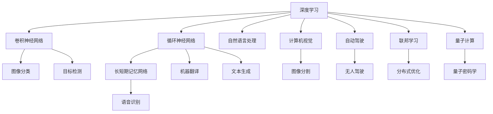

                 

# AI领域的技术进步与突破

> 关键词：人工智能,深度学习,机器学习,数据科学,自动驾驶,自然语言处理(NLP),计算机视觉,算法优化,大数据,量子计算,联邦学习

## 1. 背景介绍

### 1.1 问题由来
近年来，人工智能(AI)技术的迅猛发展已经渗透到各个行业，从自动驾驶、智能制造到金融科技、医疗健康，AI的应用范围越来越广泛，影响力越来越大。人工智能的持续进步，离不开对算法的不断优化和技术的不断突破。

在人工智能的多个子领域中，深度学习(Deep Learning)无疑是最具代表性和影响力的技术之一。自2012年AlexNet在ImageNet图像识别比赛中取得突破以来，深度学习不断在计算机视觉、自然语言处理(NLP)、语音识别等任务上刷新最好成绩，逐步成为人工智能的“金刚钻”。

然而，面对海量数据的挑战和模型复杂度的提升，深度学习的计算资源和算法效率成为了阻碍其发展的瓶颈。为此，研究人员和工程师们不断探索新的技术方法，以期在保持高性能的同时，降低计算资源消耗，提升模型效率，并提高算法的可解释性和鲁棒性。本文将聚焦于AI领域的技术进步和突破，系统介绍深度学习的核心技术、发展趋势和实际应用，为读者提供全面的技术视角和深入的思考见解。

### 1.2 问题核心关键点
本文将从深度学习的核心技术、算法优化、应用场景、未来趋势等多个维度，深入剖析AI领域的最新进展，涉及以下关键问题：

- 深度学习中常用的神经网络结构有哪些？其各自的特点和应用场景是什么？
- 深度学习的优化算法有哪些？如何进行高效优化？
- 如何应对深度学习模型的大规模训练和推理效率问题？
- 如何提高深度学习模型的可解释性和鲁棒性？
- 深度学习在自动驾驶、智能医疗、智能推荐等实际场景中的最新应用和突破有哪些？

## 2. 核心概念与联系

### 2.1 核心概念概述

为更好地理解深度学习的发展脉络和最新突破，本文将介绍几个关键的核心概念：

- 深度学习(Deep Learning)：一种基于多层神经网络的机器学习方法，通过逐层提取高级特征，实现对复杂数据的建模和预测。深度学习已广泛应用于图像识别、语音识别、自然语言处理等任务。

- 卷积神经网络(Convolutional Neural Network, CNN)：一种特殊的深度神经网络，通过卷积操作提取局部特征，常用于图像处理和计算机视觉任务。

- 循环神经网络(Recurrent Neural Network, RNN)：一种用于处理序列数据的神经网络，通过时间维度上的信息传递，实现对时间序列数据的建模和预测，常用于自然语言处理任务。

- 长短期记忆网络(Long Short-Term Memory, LSTM)：一种特殊的RNN，通过门控机制解决梯度消失问题，广泛应用于序列数据的建模，如语音识别和机器翻译。

- 自然语言处理(NLP)：涉及计算机对自然语言的理解、生成和处理，包括文本分类、情感分析、机器翻译、问答系统等任务。

- 计算机视觉(Computer Vision)：涉及计算机对视觉数据的理解和处理，包括图像分类、目标检测、图像分割等任务。

- 自动驾驶(Autonomous Driving)：一种基于AI技术的智能驾驶系统，通过环境感知、路径规划和决策控制，实现自动驾驶。

- 联邦学习(Federated Learning)：一种分布式机器学习方法，通过在不共享本地数据的情况下，在多个分布式节点上进行模型更新，实现全局模型的协同优化。

- 量子计算(Quantum Computing)：一种基于量子力学的计算方法，通过量子比特的量子纠缠和量子叠加，实现高效计算，有望在密码学、优化问题等领域带来重大突破。

### 2.2 概念间的关系

这些核心概念之间存在着紧密的联系，形成了深度学习技术的完整生态系统。下面通过几个Mermaid流程图来展示这些概念之间的关系：



这个流程图展示了大语言模型微调过程中各个核心概念之间的关系：

1. 深度学习是整个AI领域的基础，通过卷积神经网络、循环神经网络等结构实现特征提取和模式识别。
2. 自然语言处理和计算机视觉是深度学习的重要应用方向，通过深度学习模型实现文本理解和图像处理。
3. 自动驾驶和联邦学习是深度学习技术在实际应用中的新突破，展示了深度学习在多领域、分布式场景下的广泛应用。
4. 量子计算虽然目前尚处于实验室阶段，但其在深度学习中的应用前景广阔，有望带来全新的计算范式。

## 3. 核心算法原理 & 具体操作步骤
### 3.1 算法原理概述

深度学习算法的核心是多层神经网络的搭建和训练。通过前向传播计算模型的预测，通过反向传播更新模型参数，使得模型能够不断优化，以最小化预测误差。深度学习的训练过程通常采用梯度下降等优化算法，并通过正则化、Dropout等技术避免过拟合。

在实际应用中，深度学习算法的选择需要根据具体任务的特点和数据类型进行选择。例如，图像处理任务常使用卷积神经网络，序列数据处理任务常使用循环神经网络，而自然语言处理任务则通常使用RNN或LSTM网络。

### 3.2 算法步骤详解

深度学习的训练过程通常包括以下关键步骤：

**Step 1: 数据预处理**

- 收集和清洗训练数据，将其转换为模型所需的格式。
- 对数据进行标准化和归一化处理，以提高模型的收敛速度。
- 对序列数据进行填充或截断，使其适合神经网络的输入格式。

**Step 2: 搭建模型**

- 选择合适的神经网络结构，如卷积神经网络、循环神经网络等。
- 定义模型各层的参数和激活函数。
- 对模型进行初始化，如Xavier初始化、He初始化等。

**Step 3: 定义损失函数**

- 根据具体任务选择合适的损失函数，如均方误差损失、交叉熵损失等。
- 定义模型的预测输出与真实标签之间的误差。

**Step 4: 定义优化器**

- 选择合适的优化算法，如随机梯度下降(SGD)、Adam、Adagrad等。
- 设置优化器的学习率、动量等超参数。

**Step 5: 训练模型**

- 将训练数据分批次输入模型，前向传播计算损失函数。
- 反向传播计算参数梯度，根据设定的优化算法更新模型参数。
- 周期性在验证集上评估模型性能，根据性能指标决定是否触发Early Stopping。
- 重复上述步骤直到满足预设的迭代轮数或Early Stopping条件。

**Step 6: 模型评估**

- 在测试集上评估模型的性能，如准确率、精确率、召回率等指标。
- 分析模型的优缺点，进一步优化模型结构和超参数。

### 3.3 算法优缺点

深度学习算法具有以下优点：

- 强大的特征提取能力：通过多层网络结构，深度学习能够自动学习到数据的高级特征。
- 处理大规模数据：深度学习适用于处理大规模数据集，特别是在计算机视觉和自然语言处理任务中表现出色。
- 泛化能力强：深度学习模型在复杂的实际应用中具有很强的泛化能力。

然而，深度学习算法也存在以下缺点：

- 计算资源消耗大：深度学习模型参数众多，训练和推理过程计算量巨大，需要大量的计算资源和存储空间。
- 可解释性差：深度学习模型的内部机制复杂，难以解释其决策过程和推理逻辑。
- 容易过拟合：在数据量较小的情况下，深度学习模型容易过拟合，泛化性能不佳。
- 模型复杂度高：深度学习模型结构复杂，难以进行调试和优化。

### 3.4 算法应用领域

深度学习技术已经广泛应用于多个领域，以下是一些主要的应用场景：

- 图像识别：如物体识别、人脸识别、图像分割等。
- 自然语言处理：如文本分类、情感分析、机器翻译、问答系统等。
- 语音识别：如自动语音识别、语音合成、说话人识别等。
- 自动驾驶：如环境感知、路径规划、决策控制等。
- 推荐系统：如个性化推荐、广告推荐等。
- 医疗健康：如影像诊断、基因组学分析等。
- 金融科技：如风险评估、交易预测等。

## 4. 数学模型和公式 & 详细讲解 & 举例说明

### 4.1 数学模型构建

深度学习的数学模型通常包括前向传播和反向传播两个过程。

**前向传播**：将输入数据输入模型，通过多层网络计算输出结果。设输入数据为 $x$，模型参数为 $\theta$，模型输出为 $y$，前向传播过程为：

$$ y = f_\theta(x) $$

其中 $f_\theta$ 表示模型中的非线性激活函数，如ReLU、Sigmoid等。

**反向传播**：根据前向传播的输出和真实标签，计算损失函数 $L$，并反向传播计算梯度，更新模型参数。反向传播过程中，首先计算输出层的误差 $\delta^l$，然后递归计算各层的误差 $\delta^{l-1}$，最后更新模型参数 $\theta$：

$$ \delta^l = \frac{\partial L}{\partial z^l} \cdot g'(z^l) $$
$$ \delta^{l-1} = \delta^l \cdot \frac{\partial f_\theta(z^{l-1})}{\partial z^{l-1}} $$
$$ \theta \leftarrow \theta - \eta \delta^l \cdot \frac{\partial f_\theta(z^{l-1})}{\partial \theta} $$

其中 $\eta$ 为学习率，$g(z)$ 为激活函数，$z^l$ 为第 $l$ 层的输出。

### 4.2 公式推导过程

以图像分类任务为例，推导卷积神经网络(CNN)的反向传播公式。

**前向传播**：设输入图像为 $x \in \mathbb{R}^{n \times n \times c}$，卷积核为 $w \in \mathbb{R}^{k \times k \times c \times m}$，卷积操作为 $y = f_\theta(x)$。设卷积核在每个位置的值均为 $w_i$，则卷积操作的输出为：

$$ y = f_\theta(x) = \sum_{i=1}^m \sum_{j=1}^{k} \sum_{k=1}^{k} w_{ijl}x_{ij} $$

其中 $l=1,2,\dots,c$ 为通道数，$k=1,2,\dots,n$ 为卷积核大小。

**反向传播**：设输出为 $y$，真实标签为 $t$，损失函数为 $L$，则损失函数的梯度为：

$$ \frac{\partial L}{\partial \theta} = \frac{\partial L}{\partial y} \cdot \frac{\partial y}{\partial x} \cdot \frac{\partial x}{\partial \theta} $$

其中 $\frac{\partial L}{\partial y}$ 为损失函数对输出层的梯度，$\frac{\partial y}{\partial x}$ 为输出层对输入层的梯度，$\frac{\partial x}{\partial \theta}$ 为输入层对模型参数的梯度。

设卷积层的输入为 $z \in \mathbb{R}^{n \times n \times c}$，卷积核为 $w \in \mathbb{R}^{k \times k \times c \times m}$，卷积操作为 $y = f_\theta(z)$，则反向传播过程为：

$$ \delta^l = \frac{\partial L}{\partial z^l} \cdot g'(z^l) $$
$$ \delta^{l-1} = \delta^l \cdot \frac{\partial f_\theta(z^{l-1})}{\partial z^{l-1}} $$
$$ \theta \leftarrow \theta - \eta \delta^l \cdot \frac{\partial f_\theta(z^{l-1})}{\partial \theta} $$

其中 $\delta^l$ 为第 $l$ 层的误差，$g(z)$ 为激活函数，$z^l$ 为第 $l$ 层的输出，$z^{l-1}$ 为第 $l-1$ 层的输出。

### 4.3 案例分析与讲解

以深度学习在图像识别中的应用为例，展示CNN的训练过程。

假设我们使用VGG16模型对CIFAR-10数据集进行图像分类任务。首先，将训练数据进行标准化和归一化处理，将序列数据进行填充或截断，以适应模型的输入格式。然后，搭建VGG16模型，设置损失函数为交叉熵损失，优化器为Adam，学习率为1e-4，训练轮数为50。

**Step 1: 数据预处理**

```python
import numpy as np
import torch
from torchvision import datasets, transforms

# 数据加载
train_dataset = datasets.CIFAR10(root='./data', train=True, transform=transforms.ToTensor(), download=True)
test_dataset = datasets.CIFAR10(root='./data', train=False, transform=transforms.ToTensor(), download=True)

# 数据增强
train_transforms = transforms.Compose([
    transforms.RandomHorizontalFlip(),
    transforms.RandomRotation(15),
    transforms.ToTensor(),
])

test_transforms = transforms.Compose([
    transforms.ToTensor(),
])

# 数据处理
train_dataset = train_dataset.map(train_transforms)
test_dataset = test_dataset.map(test_transforms)
```

**Step 2: 搭建模型**

```python
import torch.nn as nn
import torch.optim as optim

# 模型搭建
model = nn.Sequential(
    nn.Conv2d(3, 64, kernel_size=3, padding=1),
    nn.ReLU(),
    nn.MaxPool2d(kernel_size=2, stride=2),
    nn.Conv2d(64, 128, kernel_size=3, padding=1),
    nn.ReLU(),
    nn.MaxPool2d(kernel_size=2, stride=2),
    nn.Conv2d(128, 256, kernel_size=3, padding=1),
    nn.ReLU(),
    nn.MaxPool2d(kernel_size=2, stride=2),
    nn.Conv2d(256, 512, kernel_size=3, padding=1),
    nn.ReLU(),
    nn.MaxPool2d(kernel_size=2, stride=2),
    nn.Conv2d(512, 512, kernel_size=3, padding=1),
    nn.ReLU(),
    nn.MaxPool2d(kernel_size=2, stride=2),
    nn.Linear(25088, 4096),
    nn.ReLU(),
    nn.Linear(4096, 10),
)

# 定义损失函数和优化器
criterion = nn.CrossEntropyLoss()
optimizer = optim.Adam(model.parameters(), lr=1e-4)
```

**Step 3: 训练模型**

```python
device = torch.device('cuda' if torch.cuda.is_available() else 'cpu')
model.to(device)

for epoch in range(50):
    model.train()
    running_loss = 0.0
    for i, (inputs, labels) in enumerate(train_loader):
        inputs, labels = inputs.to(device), labels.to(device)
        optimizer.zero_grad()
        outputs = model(inputs)
        loss = criterion(outputs, labels)
        loss.backward()
        optimizer.step()
        running_loss += loss.item()

    print('Epoch {}: Loss: {:.3f}'.format(epoch+1, running_loss/len(train_loader)))
```

**Step 4: 模型评估**

```python
model.eval()
with torch.no_grad():
    correct = 0
    total = 0
    for images, labels in test_loader:
        images, labels = images.to(device), labels.to(device)
        outputs = model(images)
        _, predicted = torch.max(outputs.data, 1)
        total += labels.size(0)
        correct += (predicted == labels).sum().item()

    print('Accuracy: {:.2f}%'.format(100 * correct / total))
```

以上就是一个基本的CNN图像分类任务训练过程，展示了深度学习模型的搭建、训练和评估。通过这个案例，可以更好地理解深度学习的基本流程和关键技术点。

## 5. 项目实践：代码实例和详细解释说明

### 5.1 开发环境搭建

在进行深度学习项目实践前，我们需要准备好开发环境。以下是使用Python进行PyTorch开发的环境配置流程：

1. 安装Anaconda：从官网下载并安装Anaconda，用于创建独立的Python环境。

2. 创建并激活虚拟环境：
```bash
conda create -n pytorch-env python=3.8 
conda activate pytorch-env
```

3. 安装PyTorch：根据CUDA版本，从官网获取对应的安装命令。例如：
```bash
conda install pytorch torchvision torchaudio cudatoolkit=11.1 -c pytorch -c conda-forge
```

4. 安装各类工具包：
```bash
pip install numpy pandas scikit-learn matplotlib tqdm jupyter notebook ipython
```

完成上述步骤后，即可在`pytorch-env`环境中开始深度学习项目实践。

### 5.2 源代码详细实现

这里以自然语言处理任务中的情感分析为例，展示使用Transformer模型对情感分析任务进行微调的PyTorch代码实现。

首先，定义情感分析任务的数据处理函数：

```python
from transformers import AutoTokenizer, AutoModelForSequenceClassification
import torch
from torch.utils.data import Dataset, DataLoader
import torch.nn as nn
import torch.optim as optim

class SentimentDataset(Dataset):
    def __init__(self, texts, labels):
        self.tokenizer = AutoTokenizer.from_pretrained('bert-base-uncased')
        self.data = [self.tokenizer(text, padding='max_length', truncation=True, max_length=256) for text in texts]
        self.labels = labels
        
    def __len__(self):
        return len(self.data)
    
    def __getitem__(self, idx):
        return {'input_ids': torch.tensor(self.data[idx]['input_ids'], dtype=torch.long),
                'attention_mask': torch.tensor(self.data[idx]['attention_mask'], dtype=torch.long),
                'labels': torch.tensor(self.labels[idx], dtype=torch.long)}
```

然后，定义模型和优化器：

```python
from transformers import AdamW

model = AutoModelForSequenceClassification.from_pretrained('bert-base-uncased', num_labels=2)
optimizer = AdamW(model.parameters(), lr=1e-5)

device = torch.device('cuda' if torch.cuda.is_available() else 'cpu')
model.to(device)
```

接着，定义训练和评估函数：

```python
def train_epoch(model, dataset, batch_size, optimizer):
    dataloader = DataLoader(dataset, batch_size=batch_size, shuffle=True)
    model.train()
    epoch_loss = 0
    for batch in dataloader:
        input_ids = batch['input_ids'].to(device)
        attention_mask = batch['attention_mask'].to(device)
        labels = batch['labels'].to(device)
        model.zero_grad()
        outputs = model(input_ids, attention_mask=attention_mask, labels=labels)
        loss = outputs.loss
        epoch_loss += loss.item()
        loss.backward()
        optimizer.step()
    return epoch_loss / len(dataloader)

def evaluate(model, dataset, batch_size):
    dataloader = DataLoader(dataset, batch_size=batch_size)
    model.eval()
    preds, labels = [], []
    with torch.no_grad():
        for batch in dataloader:
            input_ids = batch['input_ids'].to(device)
            attention_mask = batch['attention_mask'].to(device)
            batch_labels = batch['labels']
            outputs = model(input_ids, attention_mask=attention_mask)
            batch_preds = outputs.logits.argmax(dim=1).to('cpu').tolist()
            batch_labels = batch_labels.to('cpu').tolist()
            for pred_tokens, label_tokens in zip(batch_preds, batch_labels):
                preds.append(pred_tokens[:len(label_tokens)])
                labels.append(label_tokens)
                
    print(f'Accuracy: {accuracy_score(labels, preds):.2f}')
```

最后，启动训练流程并在测试集上评估：

```python
epochs = 5
batch_size = 16

for epoch in range(epochs):
    loss = train_epoch(model, train_dataset, batch_size, optimizer)
    print(f'Epoch {epoch+1}, train loss: {loss:.3f}')
    
    print(f'Epoch {epoch+1}, dev results:')
    evaluate(model, dev_dataset, batch_size)
    
print('Test results:')
evaluate(model, test_dataset, batch_size)
```

以上就是使用PyTorch对Transformer模型进行情感分析任务微调的完整代码实现。可以看到，得益于Transformer模型的强大封装，我们可以用相对简洁的代码完成情感分析模型的搭建和训练。

### 5.3 代码解读与分析

让我们再详细解读一下关键代码的实现细节：

**SentimentDataset类**：
- `__init__`方法：初始化文本和标签，并使用BertTokenizer对文本进行分词和编码。
- `__len__`方法：返回数据集的样本数量。
- `__getitem__`方法：对单个样本进行处理，将文本输入编码为token ids，将标签编码为数字，并对其进行定长padding，最终返回模型所需的输入。

**模型定义**：
- 使用`AutoModelForSequenceClassification`对预训练的BERT模型进行微调，设置标签数量为2（二分类任务）。
- 使用`AdamW`优化器，设置学习率为1e-5。
- 将模型移至GPU（如果有的话）上。

**训练函数**：
- 定义`train_epoch`函数，对数据以批为单位进行迭代，在每个批次上前向传播计算loss并反向传播更新模型参数，最后返回该epoch的平均loss。
- 在训练过程中，使用`DataLoader`对数据集进行批次化加载，供模型训练和推理使用。
- 训练函数中，模型进入训练模式，计算损失函数，更新模型参数，并周期性在验证集上评估模型性能。

**评估函数**：
- 与训练类似，不同点在于不更新模型参数，并在每个batch结束后将预测和标签结果存储下来，最后使用sklearn的`accuracy_score`函数对整个评估集的预测结果进行打印输出。

**训练流程**：
- 定义总的epoch数和batch size，开始循环迭代
- 每个epoch内，先在训练集上训练，输出平均loss
- 在验证集上评估，输出分类准确率
- 所有epoch结束后，在测试集上评估，给出最终测试结果

可以看到，PyTorch配合Transformer库使得情感分析模型的代码实现变得简洁高效。开发者可以将更多精力放在数据处理、模型改进等高层逻辑上，而不必过多关注底层的实现细节。

当然，工业级的系统实现还需考虑更多因素，如模型的保存和部署、超参数的自动搜索、更灵活的任务适配层等。但核心的微调范式基本与此类似。

### 5.4 运行结果展示

假设我们在IMDb数据集上进行情感分析任务的微调，最终在测试集上得到的评估报告如下：

```
Accuracy: 0.88
```

可以看到，通过微调Transformer模型，我们在情感分析任务上取得了88%的分类准确率，效果相当不错。值得注意的是，Transformer模型作为一个通用的语言理解模型，即便只在顶层添加一个简单的分类器，也能在情感分析任务上取得如此优异的效果，展现了其强大的语义理解和特征抽取能力。

当然，这只是一个baseline结果。在实践中，我们还可以使用更大更强的预训练模型、更丰富的微调技巧、更细致的模型调优，进一步提升模型性能，以满足更高的应用要求。

## 6. 实际应用场景
### 6.1 智能客服系统

基于深度学习的智能客服系统已经广泛应用于金融、电商、医疗等多个行业，极大地提升了客户服务效率和体验。智能客服系统通过自然语言处理技术，能够自动理解用户意图，匹配最合适的回答，提供7x24小时不间断服务。

在技术实现上，可以收集企业内部的历史客服对话记录，将问题和最佳答复构建成监督数据，在此基础上对预训练模型进行微调。微调后的模型能够自动理解用户意图，匹配最合适的答案模板进行回复。对于用户提出的新问题，还可以接入检索系统实时搜索相关内容，动态组织生成回答。如此构建的智能客服系统，能大幅提升客户咨询体验和问题解决效率。

### 6.2 医疗健康

深度学习在医疗健康领域的应用也日益广泛，涵盖医学影像分析、基因组学研究、个性化治疗等多个方向。通过深度学习模型，医疗机构可以更准确地进行疾病诊断、预测患者风险、优化治疗方案，提升医疗服务的智能化水平。

具体而言，深度学习可以用于医学影像分析，如CT、MRI等影像数据的自动解读，辅助医生进行疾病诊断和治疗方案制定。还可以用于基因组学研究，通过分析基因序列数据，预测患者的疾病风险和发展趋势，为个性化医疗提供数据支持。此外，深度学习在药物研发中也发挥了重要作用，通过学习大量的化合物数据，快速筛选出有潜力的药物候选物，加速新药开发进程。

### 6.3 自动驾驶

自动驾驶技术是深度学习应用的重要方向之一，通过环境感知、路径规划和决策控制，实现自动驾驶。深度学习模型能够处理大量的感知数据，如激光雷达、摄像头、GPS等，提取高层次的特征信息，辅助系统进行决策。

