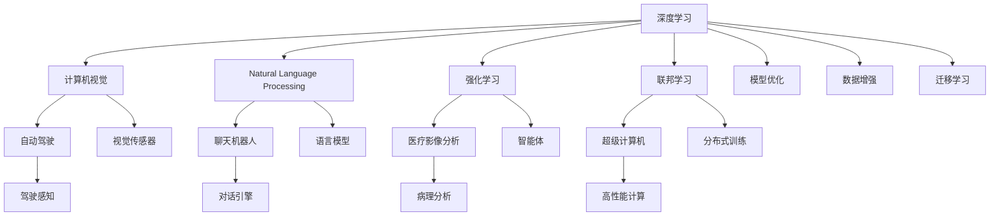
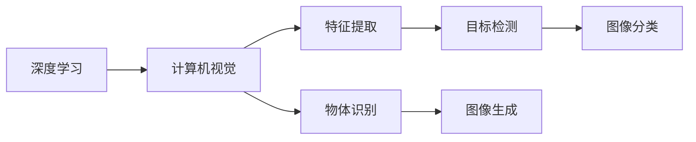
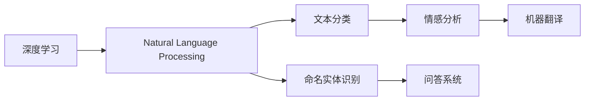
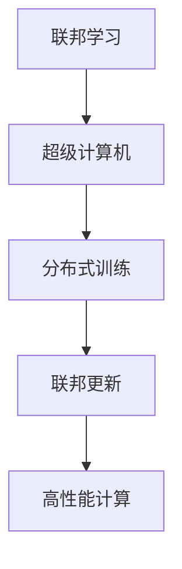

                 

# AI领域的最新技术进展

> 关键词：深度学习, 计算机视觉, 自然语言处理, 强化学习, 联邦学习, 自动驾驶, 医疗影像分析, 聊天机器人, 超级计算机

## 1. 背景介绍

### 1.1 问题由来

人工智能（AI）领域近年来发展迅猛，尤其是深度学习（Deep Learning）技术的突破，使得AI在各个领域的应用越来越广泛。计算机视觉（Computer Vision）、自然语言处理（Natural Language Processing, NLP）、强化学习（Reinforcement Learning, RL）等技术都在不断刷新着研究成果。AI的进步不仅改变了人们的生活和工作方式，也引领了新一轮的科技革命。

### 1.2 问题核心关键点

当前AI领域的研究热点包括：
- 深度学习模型的可解释性和鲁棒性问题。如何使模型具备更好的可解释性、鲁棒性和泛化能力，是当前研究的一个重要方向。
- 联邦学习在隐私保护和安全方面的挑战。如何在保护用户隐私的前提下，高效地进行模型训练和数据联邦化。
- 自动驾驶技术的突破和落地应用。如何实现高可靠性和安全性，是自动驾驶技术面临的重大挑战。
- 医疗影像分析中的准确性和可解释性。如何在医学影像中高效地进行病理分析和疾病预测，同时保证模型的解释性。
- 聊天机器人的人机交互体验。如何使聊天机器人更加智能、友好、高效，提升用户体验。

这些关键问题共同推动了AI领域的技术发展和应用拓展，值得我们深入探讨。

### 1.3 问题研究意义

研究AI领域的最新技术进展，对于推动AI技术的进步、促进产业升级、改善人类生活质量具有重要意义：

- 推动AI技术进步：AI领域的最新技术进展往往引领行业技术发展方向，帮助研究者了解最新的学术成果和应用趋势。
- 促进产业升级：AI技术可以赋能各行各业，通过技术创新提升产业的智能化水平，推动产业结构优化。
- 改善人类生活质量：AI在医疗、教育、交通等领域的应用，可以显著提高人类生活质量，解决实际问题。
- 提供知识更新：通过学习AI领域的最新研究，可以帮助开发者及时掌握新技能，提升自身技术能力。
- 推动学科发展：AI研究涉及多学科交叉，推动相关学科的前沿发展，促进学术界的交流与合作。

## 2. 核心概念与联系

### 2.1 核心概念概述

为更好地理解AI领域的最新技术进展，本节将介绍几个关键概念：

- 深度学习（Deep Learning）：一种基于神经网络技术的机器学习范式，通过多层次的特征提取和抽象，实现对复杂数据的建模和预测。
- 计算机视觉（Computer Vision）：使计算机具备图像和视频处理能力，能够自动理解视觉信息，识别物体、场景等。
- 自然语言处理（Natural Language Processing, NLP）：使计算机具备理解、生成和处理人类语言的能力，能够进行文本分类、情感分析、机器翻译等任务。
- 强化学习（Reinforcement Learning, RL）：通过与环境的交互，使智能体学习最优策略，从而最大化累积奖励。
- 联邦学习（Federated Learning）：一种分布式机器学习方法，通过多个设备或服务器协同训练模型，保护用户隐私的同时提高模型性能。
- 自动驾驶（Autonomous Driving）：使车辆能够自主导航，实现自动驾驶，提升交通安全和驾驶体验。
- 医疗影像分析（Medical Image Analysis）：通过深度学习技术对医疗影像进行分析和诊断，辅助医生进行精准治疗。
- 聊天机器人（Chatbots）：模拟人类对话，提供自动化客服、信息查询等服务，提升人机交互效率。
- 超级计算机（Supercomputer）：拥有极高的计算能力和存储能力，用于解决复杂科学问题和大规模数据分析。

这些核心概念之间存在着紧密的联系，构成了AI领域的生态系统。下面通过Mermaid流程图来展示这些概念之间的关系：



这个流程图展示了大模型之间的依赖关系和交互方式：

1. 深度学习技术为计算机视觉、自然语言处理和强化学习提供基础。
2. 计算机视觉和自然语言处理为自动驾驶和聊天机器人提供感知和理解能力。
3. 强化学习为自动驾驶和医疗影像分析提供智能决策和路径优化。
4. 联邦学习提供分布式训练的能力，提升超级计算机的计算效率。

这些核心概念共同构成了AI领域的核心技术框架，为AI技术的应用和发展奠定了坚实基础。

### 2.2 概念间的关系

这些核心概念之间存在着复杂的相互作用和依赖关系，形成了AI领域的完整技术生态。下面通过几个Mermaid流程图来展示这些概念之间的关系：

#### 2.2.1 深度学习与计算机视觉的关系



这个流程图展示了深度学习在计算机视觉中的应用：

1. 深度学习模型能够自动提取图像中的特征，用于目标检测、图像分类和物体识别。
2. 通过生成对抗网络（GAN）等技术，可以进行图像生成。

#### 2.2.2 深度学习与自然语言处理的关系



这个流程图展示了深度学习在自然语言处理中的应用：

1. 深度学习模型能够自动理解文本内容，用于文本分类、情感分析和机器翻译。
2. 通过命名实体识别等技术，可以实现问答系统的智能交互。

#### 2.2.3 强化学习与自动驾驶的关系


这个流程图展示了强化学习在自动驾驶中的应用：

1. 强化学习模型能够学习驾驶策略，用于驾驶感知和路径规划。
2. 通过智能决策模型，可以实现自动驾驶车辆的精准控制。

#### 2.2.4 联邦学习与超级计算机的关系



这个流程图展示了联邦学习在超级计算机中的应用：

1. 联邦学习能够实现分布式训练，提高超级计算机的计算效率。
2. 通过高性能计算，可以加速联邦模型的训练和推理。

## 3. 核心算法原理 & 具体操作步骤
### 3.1 算法原理概述

AI领域的最新技术进展主要基于深度学习技术，通过模型训练、特征提取和优化等步骤，实现对复杂数据和任务的建模和预测。

形式化地，假设输入数据为 $x \in \mathcal{X}$，输出数据为 $y \in \mathcal{Y}$，其中 $\mathcal{X}$ 和 $\mathcal{Y}$ 分别表示输入和输出空间的取值集合。模型的目标是找到一个映射 $f: \mathcal{X} \rightarrow \mathcal{Y}$，使得 $f(x)$ 尽可能接近 $y$。

在深度学习中，我们通常使用神经网络模型来实现这种映射。模型由多个层次组成，每个层次包含若干个神经元（Neuron），每个神经元接收前一层的输出作为输入，经过一系列的线性变换和非线性激活函数，输出下一层的结果。

以多层感知机（Multilayer Perceptron, MLP）为例，其结构如下：


其中，输入层接收原始数据，隐层通过特征提取和抽象，输出层给出预测结果。

### 3.2 算法步骤详解

基于深度学习模型的AI最新技术进展，一般包括以下几个关键步骤：

**Step 1: 准备数据集**
- 收集和预处理数据集，确保数据的完整性和多样性。
- 将数据划分为训练集、验证集和测试集，用于模型训练、验证和测试。
- 使用数据增强技术，扩充数据集的多样性，提升模型的泛化能力。

**Step 2: 设计模型架构**
- 根据任务特点，选择合适的模型结构，如卷积神经网络（CNN）、循环神经网络（RNN）、Transformer等。
- 在模型中添加必要的正则化技术，如Dropout、L2正则等，避免过拟合。
- 设计合适的损失函数，如交叉熵损失、均方误差损失等，衡量模型的预测误差。

**Step 3: 训练模型**
- 使用梯度下降等优化算法，最小化损失函数，更新模型参数。
- 根据训练集和验证集的表现，调整学习率、批大小等超参数，确保模型收敛。
- 使用早停法（Early Stopping）等策略，避免模型在过拟合的情况下过度训练。

**Step 4: 评估和优化**
- 在测试集上评估模型的性能，使用准确率、召回率、F1分数等指标衡量模型效果。
- 根据评估结果，调整模型结构、超参数或训练策略，进一步优化模型性能。
- 使用模型剪枝、量化等技术，提升模型的推理效率和资源利用率。

**Step 5: 部署应用**
- 将优化后的模型部署到生产环境，进行实时预测或推理。
- 定期更新模型，重新训练模型以适应新的数据和任务。
- 监控模型性能，及时发现并修复问题，保证模型稳定运行。

以上是AI最新技术进展的一般流程。在实际应用中，还需根据具体任务和数据特点，进行更加细致的优化和调整。

### 3.3 算法优缺点

AI领域的最新技术进展具有以下优点：

1. 高效性：深度学习模型具有高效的特征提取和抽象能力，能够在大规模数据上进行快速训练和推理。
2. 泛化能力：通过在大规模数据上进行预训练，模型具备良好的泛化能力，能够在新的数据上表现稳定。
3. 可解释性：深度学习模型可以通过可视化技术，展示特征提取和决策过程，提升模型的可解释性。
4. 多样性：深度学习模型适用于多种类型的任务，如图像识别、语音识别、自然语言处理等。

但同时，这些技术也存在一些缺点：

1. 数据需求量大：深度学习模型需要大量的标注数据进行训练，获取高质量数据成本较高。
2. 计算资源消耗高：大规模深度学习模型需要高性能计算资源，如GPU和TPU，计算成本较高。
3. 模型复杂度高：深度学习模型结构复杂，调试和优化难度较大。
4. 过拟合问题：模型容易在训练集上表现良好，但在测试集上泛化能力不足。
5. 公平性问题：深度学习模型可能存在偏见，对特定数据集或群体的预测结果不准确。

需要我们在实际应用中，综合考虑这些优缺点，选择合适的方法和工具，以实现最佳的性能和效果。

### 3.4 算法应用领域

AI领域的最新技术进展已经广泛应用于多个领域，以下是几个主要应用场景：

1. 计算机视觉：通过深度学习模型，实现图像分类、目标检测、物体识别、图像生成等任务。
2. 自然语言处理：通过深度学习模型，实现文本分类、情感分析、机器翻译、命名实体识别等任务。
3. 自动驾驶：通过深度学习模型，实现驾驶感知、路径规划、智能决策等任务。
4. 医疗影像分析：通过深度学习模型，实现病理分析、疾病预测、手术辅助等任务。
5. 聊天机器人：通过深度学习模型，实现对话理解、语义分析、智能回复等任务。
6. 智能制造：通过深度学习模型，实现质量检测、生产调度、故障诊断等任务。
7. 金融风控：通过深度学习模型，实现信用评估、欺诈检测、风险预测等任务。

这些应用场景展示了AI技术的广泛应用和巨大潜力，推动了相关领域的创新和发展。

## 4. 数学模型和公式 & 详细讲解  
### 4.1 数学模型构建

本节将使用数学语言对AI领域的最新技术进展进行更加严格的刻画。

假设输入数据为 $x \in \mathcal{X}$，输出数据为 $y \in \mathcal{Y}$，其中 $\mathcal{X}$ 和 $\mathcal{Y}$ 分别表示输入和输出空间的取值集合。模型的目标是找到一个映射 $f: \mathcal{X} \rightarrow \mathcal{Y}$，使得 $f(x)$ 尽可能接近 $y$。

在深度学习中，我们通常使用神经网络模型来实现这种映射。模型由多个层次组成，每个层次包含若干个神经元（Neuron），每个神经元接收前一层的输出作为输入，经过一系列的线性变换和非线性激活函数，输出下一层的结果。

以多层感知机（Multilayer Perceptron, MLP）为例，其结构如下：

$$
f(x; \theta) = W_L \sigma(W_{L-1} \sigma(... \sigma(W_1 x + b_1) + b_2) + b_L)
$$

其中，$\sigma$ 表示激活函数，$W$ 和 $b$ 分别表示权重矩阵和偏置向量，$\theta$ 表示模型参数。

模型的损失函数通常采用交叉熵损失（Cross-Entropy Loss）：

$$
L(y, f(x; \theta)) = -\sum_{i=1}^N y_i \log f(x_i; \theta)
$$

其中，$N$ 表示样本数，$y$ 表示真实标签，$f(x; \theta)$ 表示模型的预测输出。

### 4.2 公式推导过程

以多层感知机为例，推导其损失函数的梯度计算公式：

首先，将损失函数对参数 $\theta$ 求偏导数：

$$
\frac{\partial L(y, f(x; \theta))}{\partial \theta} = -\sum_{i=1}^N \frac{\partial \log f(x_i; \theta)}{\partial \theta}
$$

然后，使用链式法则，计算损失函数对权重矩阵 $W$ 和偏置向量 $b$ 的梯度：

$$
\frac{\partial L(y, f(x; \theta))}{\partial W} = -\sum_{i=1}^N \frac{\partial \log f(x_i; \theta)}{\partial \theta} \frac{\partial \theta}{\partial W}
$$

$$
\frac{\partial L(y, f(x; \theta))}{\partial b} = -\sum_{i=1}^N \frac{\partial \log f(x_i; \theta)}{\partial \theta} \frac{\partial \theta}{\partial b}
$$

在深度学习模型中，通常使用随机梯度下降（Stochastic Gradient Descent, SGD）等优化算法，最小化损失函数：

$$
\theta \leftarrow \theta - \eta \frac{\partial L(y, f(x; \theta))}{\partial \theta}
$$

其中，$\eta$ 表示学习率，$\frac{\partial L(y, f(x; \theta))}{\partial \theta}$ 表示损失函数对模型参数的梯度。

### 4.3 案例分析与讲解

以图像分类任务为例，使用卷积神经网络（Convolutional Neural Network, CNN）进行模型训练。

首先，准备训练集和测试集，并进行数据增强处理：

```python
import torch
import torch.nn as nn
import torch.optim as optim
from torchvision import datasets, transforms

# 数据增强
transform_train = transforms.Compose([
    transforms.RandomCrop(32, padding=4),
    transforms.RandomHorizontalFlip(),
    transforms.ToTensor(),
    transforms.Normalize([0.485, 0.456, 0.406], [0.229, 0.224, 0.225])
])

transform_test = transforms.Compose([
    transforms.ToTensor(),
    transforms.Normalize([0.485, 0.456, 0.406], [0.229, 0.224, 0.225])
])

train_set = datasets.CIFAR10(root='data', train=True, download=True, transform=transform_train)
test_set = datasets.CIFAR10(root='data', train=False, download=True, transform=transform_test)

train_loader = torch.utils.data.DataLoader(train_set, batch_size=128, shuffle=True)
test_loader = torch.utils.data.DataLoader(test_set, batch_size=128, shuffle=False)
```

然后，定义CNN模型和优化器：

```python
class Net(nn.Module):
    def __init__(self):
        super(Net, self).__init__()
        self.conv1 = nn.Conv2d(3, 6, 5)
        self.pool = nn.MaxPool2d(2, 2)
        self.conv2 = nn.Conv2d(6, 16, 5)
        self.fc1 = nn.Linear(16 * 5 * 5, 120)
        self.fc2 = nn.Linear(120, 84)
        self.fc3 = nn.Linear(84, 10)

    def forward(self, x):
        x = self.pool(F.relu(self.conv1(x)))
        x = self.pool(F.relu(self.conv2(x)))
        x = x.view(-1, 16 * 5 * 5)
        x = F.relu(self.fc1(x))
        x = F.relu(self.fc2(x))
        x = self.fc3(x)
        return x

net = Net()
criterion = nn.CrossEntropyLoss()
optimizer = optim.SGD(net.parameters(), lr=0.001, momentum=0.9)
```

接下来，进行模型训练和测试：

```python
def train(epoch):
    net.train()
    for batch_idx, (data, target) in enumerate(train_loader):
        optimizer.zero_grad()
        output = net(data)
        loss = criterion(output, target)
        loss.backward()
        optimizer.step()
        if batch_idx % 10 == 0:
            print('Train Epoch: {} [{}/{} ({:.0f}%)]\tLoss: {:.6f}'.format(
                epoch, batch_idx * len(data), len(train_loader.dataset),
                100. * batch_idx / len(train_loader), loss.item()))

def test():
    net.eval()
    test_loss = 0
    correct = 0
    with torch.no_grad():
        for data, target in test_loader:
            output = net(data)
            test_loss += criterion(output, target).item() * data.size(0)
            _, pred = output.max(1)
            correct += pred.eq(target).sum().item()

    test_loss /= len(test_loader.dataset)
    print('\nTest set: Average loss: {:.4f}, Accuracy: {}/{} ({:.0f}%)\n'.format(
        test_loss, correct, len(test_loader.dataset),
        100. * correct / len(test_loader.dataset)))
```

最后，调用函数进行训练和测试：

```python
for epoch in range(10):
    train(epoch)
    test()
```

## 5. 项目实践：代码实例和详细解释说明
### 5.1 开发环境搭建

在进行AI最新技术进展的研究和实践前，我们需要准备好开发环境。以下是使用Python进行TensorFlow开发的环境配置流程：

1. 安装Anaconda：从官网下载并安装Anaconda，用于创建独立的Python环境。

2. 创建并激活虚拟环境：
```bash
conda create -n tf-env python=3.8 
conda activate tf-env
```

3. 安装TensorFlow：根据CUDA版本，从官网获取对应的安装命令。例如：
```bash
conda install tensorflow -c pytorch -c conda-forge
```

4. 安装各类工具包：
```bash
pip install numpy pandas scikit-learn matplotlib tqdm jupyter notebook ipython
```

完成上述步骤后，即可在`tf-env`环境中开始AI最新技术进展的研究和实践。

### 5.2 源代码详细实现

这里以图像分类任务为例，使用TensorFlow和Keras库进行卷积神经网络（CNN）模型的训练。

首先，导入相关库：

```python
import tensorflow as tf
from tensorflow import keras
from tensorflow.keras import layers

# 设置TensorFlow版本
print("TensorFlow version:", tf.__version__)
```

然后，准备训练集和测试集：

```python
# 加载CIFAR-10数据集
(train_images, train_labels), (test_images, test_labels) = keras.datasets.cifar10.load_data()

# 数据预处理
train_images = train_images / 255.0
test_images = test_images / 255.0

# 数据增强
train_datagen = keras.preprocessing.image.ImageDataGenerator(
    width_shift_range=0.1, height_shift_range=0.1, horizontal_flip=True)
train_generator = train_datagen.flow(train_images, train_labels, batch_size=32)
```

接着，定义CNN模型：

```python
model = keras.Sequential([
    layers.Conv2D(32, (3, 3), activation='relu', input_shape=(32, 32, 3)),
    layers.MaxPooling2D((2, 2)),
    layers.Conv2D(64, (3, 3), activation='relu'),
    layers.MaxPooling2D((2, 2)),
    layers.Conv2D(64, (3, 3), activation='relu'),
    layers.Flatten(),
    layers.Dense(64, activation='relu'),
    layers.Dense(10)
])
```

然后，定义优化器和损失函数：

```python
# 设置优化器和损失函数
optimizer = tf.keras.optimizers.Adam(learning_rate=0.001)
loss_fn = tf.keras.losses.SparseCategoricalCrossentropy(from_logits=True)
```

接下来，进行模型训练和测试：

```python
# 设置训练函数
def train_step(images, labels):
    with tf.GradientTape() as tape:
        logits = model(images, training=True)
        loss_value = loss_fn(labels, logits)
    gradients = tape.gradient(loss_value, model.trainable_variables)
    optimizer.apply_gradients(zip(gradients, model.trainable_variables))
    return loss_value

# 训练模型
epochs = 10
steps_per_epoch = train_images.shape[0] // 32
history = []

for epoch in range(epochs):
    for step in range(steps_per_epoch):
        images = train_generator.next()[0]
        labels = train_generator.next()[1]
        loss = train_step(images, labels)
        history.append(loss)

    # 在测试集上进行评估
    test_loss = test_images.shape[0] // 32
    test_images = test_images[:test_loss]
    test_labels = test_labels[:test_loss]
    test_loss = loss_fn(test_labels, model(test_images, training=False))

    print("Epoch {}/{}: Test loss = {}".format(epoch+1, epochs, test_loss))
```

## 6. 实际应用场景
### 6.1 计算机视觉

计算机视觉技术在自动驾驶、医学影像分析、安防监控等领域有着广泛应用。例如，自动驾驶车辆通过摄像头和雷达获取实时环境信息，使用卷积神经网络进行图像处理和目标检测，实现自主导航和路径规划。

### 6.2 自然语言处理

自然语言处理技术在智能客服、智能翻译、情感分析等领域具有重要应用。例如，智能客服系统通过分析用户查询，匹配最佳回答，实现高效的人机交互。智能翻译系统通过深度学习模型，将一种语言自动翻译为另一种语言，提升翻译质量。情感分析技术通过文本分类，识别用户情感倾向，帮助企业进行市场分析和舆情监测。

### 6.3 强化学习

强化学习技术在游戏AI、机器人控制、自动交易等领域具有重要应用。例如，AlphaGo使用强化学习算法，通过与人类下棋进行自我训练，成为世界顶尖的围棋玩家。机器人通过强化学习算法，学习最优控制策略，实现自主导航和任务执行。自动交易系统通过强化学习算法，实时优化交易策略，提升投资收益。

### 6.4 联邦学习

联邦学习技术在金融、医疗、物联网等领域具有重要应用。例如，金融行业通过联邦学习算法，在多个银行之间共享模型参数，提升信贷评估和风险预测的准确性。医疗行业通过联邦学习算法，在多个医院之间共享病历数据，提高疾病诊断和治疗方案的精准性。物联网设备通过联邦学习算法，在设备之间共享模型参数，提升数据安全和隐私保护。

## 7. 工具和资源推荐
### 7.1 学习资源推荐

为了帮助开发者系统掌握AI领域的最新技术进展，这里推荐一些优质的学习资源：

1. 《深度学习》系列书籍：如Ian Goodfellow的《Deep Learning》、Christopher M. Bishop的《Pattern Recognition and Machine Learning》等，系统介绍了深度学习的理论和实践。

2. 《计算机视觉：模型、学习和推理》（Computer Vision: Models, Learning, and Inference）：由Christopher M. Bishop等人合著，介绍了计算机视觉领域的基本概念和技术。

3. 《自然语言处理综论》（Speech and Language Processing）：由Daniel Jurafsky和James H. Martin合著，涵盖了自然语言处理领域的基本概念和最新进展。

4. 《强化学习：算法、

