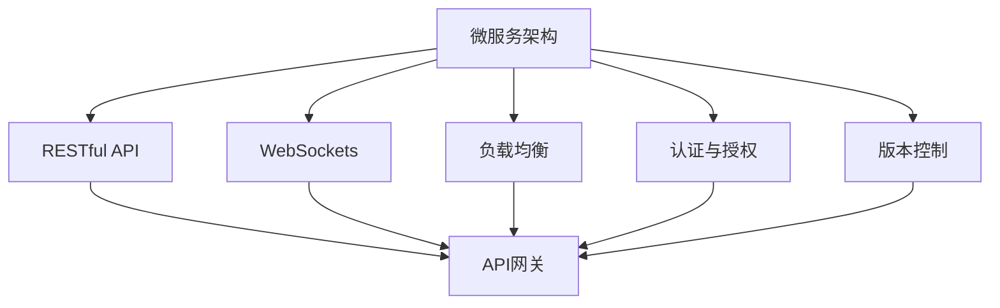
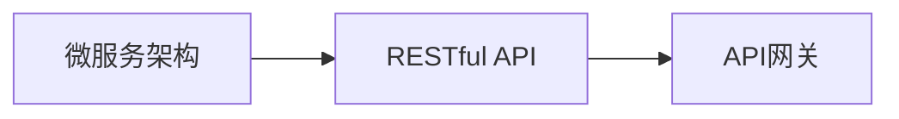
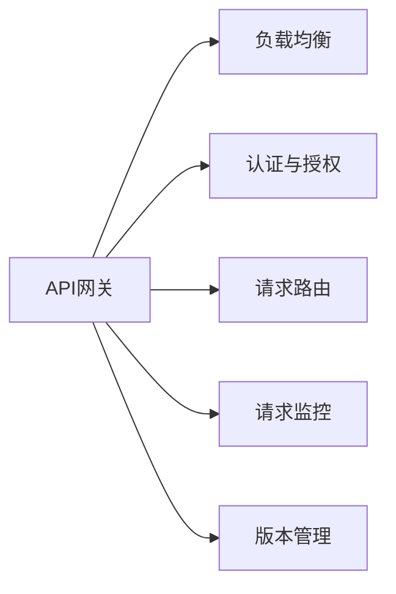
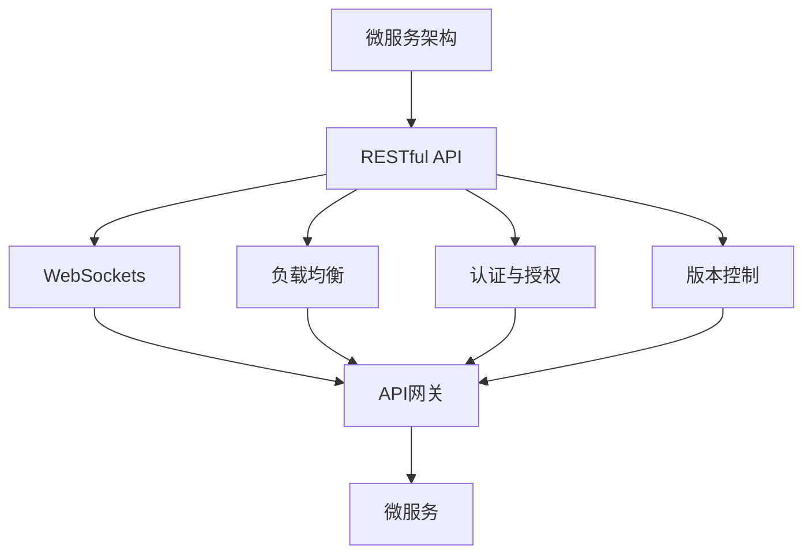

                 

# API 网关的详细使用

> 关键词：API网关、微服务、RESTful API、WebSockets、安全、负载均衡、API 管理

## 1. 背景介绍

### 1.1 问题由来
随着互联网应用的不断发展，企业内部的系统架构也日趋复杂化。每个系统为了快速响应业务需求，往往会独立开发和部署，导致系统之间相互独立、难以协作。为了解决这种“烟囱式”架构带来的问题，微服务架构应运而生。

微服务架构通过将一个大系统拆分成多个独立的小服务，每个服务只负责一个特定的业务功能，并通过接口调用进行交互。这种架构提高了系统的灵活性、可扩展性和可维护性，但也带来了新的挑战：

1. 服务的发现和管理：如何快速发现并调用各个微服务？
2. 请求的负载均衡：如何高效地将请求分发到各个服务上？
3. 请求的安全认证：如何保证微服务间通信的安全性？
4. 服务的版本管理：如何管理服务的不同版本？

为了应对这些挑战，API网关应运而生。API网关作为微服务架构的关键组件，能够提供统一的服务访问入口、负载均衡、安全认证、版本管理等功能，极大地提升了微服务架构的性能和安全性。

### 1.2 问题核心关键点
API网关的核心思想是：将所有微服务的公共接口聚合到一个网关上，通过统一的接口对外提供服务。它既可以看作是微服务的“门卫”，也可以看作是微服务的“目录”。API网关通常包含以下几个核心功能：

- 负载均衡：将请求分散到各个微服务上，避免单点故障。
- 认证与授权：对请求进行身份验证和权限检查，保证服务的安全性。
- 请求路由：根据请求路径和参数将请求路由到对应的微服务。
- 请求监控：记录并分析请求日志，优化服务性能。
- 版本管理：管理微服务的不同版本，提供API的平滑演进。

### 1.3 问题研究意义
研究API网关的使用，对于提高微服务架构的性能、安全和可维护性具有重要意义：

1. 简化微服务管理：API网关提供了统一的服务访问入口，简化了微服务的发现和管理。
2. 提高服务性能：通过负载均衡和缓存机制，API网关能够有效提升服务的响应速度和吞吐量。
3. 加强安全保障：API网关提供了集中化的安全认证和授权机制，提高了微服务的安全性。
4. 支持版本控制：API网关能够管理微服务的不同版本，支持API的平滑演进。
5. 优化系统扩展：API网关作为微服务的“门卫”，可以灵活扩展和部署新的服务，提升系统的可扩展性。

## 2. 核心概念与联系

### 2.1 核心概念概述

为更好地理解API网关的使用，本节将介绍几个密切相关的核心概念：

- 微服务架构(Microservice Architecture)：一种基于服务的架构模式，将一个大系统拆分成多个独立的小服务，每个服务负责一个特定的业务功能。
- RESTful API：一种基于HTTP协议的API设计风格，强调资源的操作（增删改查）和表示（JSON/XML格式）。
- WebSockets：一种全双工通信协议，实现服务器与客户端之间的实时通信。
- 负载均衡(Load Balancing)：将请求分散到多个服务器上，提升系统的吞吐量和可靠性。
- 认证与授权(Authentication and Authorization)：对请求进行身份验证和权限检查，保证服务的安全性。
- 版本控制(Version Control)：管理微服务的不同版本，支持API的平滑演进。

这些核心概念之间的逻辑关系可以通过以下Mermaid流程图来展示：



这个流程图展示了微服务架构和API网关之间及其核心概念的关系：

1. 微服务架构将一个大系统拆分成多个独立的服务。
2. RESTful API定义了各个微服务之间的通信协议和数据格式。
3. WebSockets提供了实时通信机制。
4. 负载均衡和认证与授权对请求进行分发和管理。
5. 版本控制管理微服务的不同版本。
6. API网关聚合各个微服务的公共接口，提供统一的访问入口。

### 2.2 概念间的关系

这些核心概念之间存在着紧密的联系，形成了API网关的基础架构。下面我们通过几个Mermaid流程图来展示这些概念之间的关系。

#### 2.2.1 微服务架构与RESTful API的关系



这个流程图展示了微服务架构和RESTful API的关系。微服务架构通过RESTful API进行通信，API网关则聚合各个微服务的API接口，提供统一的访问入口。

#### 2.2.2 API网关的功能模块



这个流程图展示了API网关的功能模块，包括负载均衡、认证与授权、请求路由、请求监控和版本管理。

#### 2.2.3 WebSockets与API网关的关系


这个流程图展示了WebSockets与API网关的关系。WebSockets提供实时通信机制，API网关则将实时通信的请求路由到对应的微服务。

### 2.3 核心概念的整体架构

最后，我们用一个综合的流程图来展示这些核心概念在大语言模型微调过程中的整体架构：



这个综合流程图展示了从微服务架构到API网关再到微服务完整的架构过程。微服务架构通过RESTful API进行通信，API网关聚合各个微服务的API接口，提供统一的访问入口。WebSockets提供实时通信机制，API网关将实时通信的请求路由到对应的微服务。负载均衡和认证与授权对请求进行分发和管理。版本控制管理微服务的不同版本。

## 3. 核心算法原理 & 具体操作步骤
### 3.1 算法原理概述

API网关的核心算法原理主要涉及以下几个方面：

1. 负载均衡算法：将请求分散到各个微服务上，避免单点故障。
2. 认证与授权算法：对请求进行身份验证和权限检查，保证服务的安全性。
3. 请求路由算法：根据请求路径和参数将请求路由到对应的微服务。
4. 请求缓存算法：对请求进行缓存，提高服务性能。
5. 版本管理算法：管理微服务的不同版本，提供API的平滑演进。

下面我们将详细介绍这些核心算法的原理和实现。

### 3.2 算法步骤详解

#### 3.2.1 负载均衡算法

负载均衡算法的核心目标是合理分配请求到各个微服务上，避免单点故障。常用的负载均衡算法包括：

1. 轮询算法(Round Robin)：依次将请求分配到各个微服务上。
2. 随机算法(Random)：随机将请求分配到各个微服务上。
3. 最小连接数算法(Least Connections)：将请求分配到连接数最少的微服务上。
4. IP散列算法(IP Hash)：根据客户端IP地址将请求分配到固定的微服务上。

以下是一个轮询算法的伪代码实现：

```python
def round_robin(backend):
    for backend in backend:
        yield backend
    for backend in backend:
        yield backend
```

#### 3.2.2 认证与授权算法

认证与授权算法的核心目标是对请求进行身份验证和权限检查，保证服务的安全性。常用的认证与授权算法包括：

1. Basic认证：通过用户名和密码进行认证。
2. OAuth认证：通过第三方服务进行认证。
3. JWT认证：通过JSON Web Tokens进行认证和授权。
4. 基于角色的访问控制(RBAC)：根据用户角色进行权限检查。

以下是一个JWT认证的伪代码实现：

```python
def jwt_auth(request, response):
    try:
        token = request.headers['Authorization']
        payload = jwt.decode(token, 'secret_key', algorithms=['HS256'])
        if request.method == 'GET':
            return response.status_code = 200, {'data': payload}
        elif request.method == 'POST':
            return response.status_code = 201, {'data': payload}
        else:
            return response.status_code = 400, {'error': 'Invalid method'}
    except:
        return response.status_code = 401, {'error': 'Invalid token'}
```

#### 3.2.3 请求路由算法

请求路由算法的核心目标是根据请求路径和参数将请求路由到对应的微服务。常用的请求路由算法包括：

1. 基于路径的路由(Path-based Routing)：根据请求路径将请求路由到对应的微服务。
2. 基于URL参数的路由(URL Parameter-based Routing)：根据URL参数将请求路由到对应的微服务。
3. 基于HTTP方法的方法级路由(Method-based Routing)：根据HTTP方法将请求路由到对应的微服务。

以下是一个基于路径的路由的伪代码实现：

```python
def path_routing(request, response):
    path = request.path
    if path == '/users':
        return route('users')
    elif path == '/orders':
        return route('orders')
    else:
        return response.status_code = 404, {'error': 'Not found'}
```

#### 3.2.4 请求缓存算法

请求缓存算法的核心目标是对请求进行缓存，提高服务性能。常用的请求缓存算法包括：

1. 基于内存的缓存(Memory-based Caching)：将请求和响应存储在内存中，减少数据库查询次数。
2. 基于分布式缓存(Distributed Caching)：将请求和响应存储在分布式缓存中，提高系统的可扩展性和可靠性。
3. 基于CDN的缓存(CDN-based Caching)：将请求和响应缓存到CDN节点上，提高响应速度。

以下是一个基于内存的缓存的伪代码实现：

```python
def in_memory_caching(request, response):
    if request.path in cache:
        return cache[request.path]
    else:
        result = request.process(request.method, request.params)
        cache[request.path] = result
        return result
```

#### 3.2.5 版本管理算法

版本管理算法的核心目标是对微服务的不同版本进行管理，提供API的平滑演进。常用的版本管理算法包括：

1. 基于URL的版本管理(URL-based Versioning)：通过URL中的版本号来区分不同版本的API。
2. 基于标头的版本管理(Header-based Versioning)：通过请求头中的版本号来区分不同版本的API。
3. 基于查询参数的版本管理(Query Parameter-based Versioning)：通过查询参数中的版本号来区分不同版本的API。

以下是一个基于URL的版本管理的伪代码实现：

```python
def url_versioning(request, response):
    url = request.path
    version = url.split('/')[1]
    if version == 'v1':
        return route('v1_api')
    elif version == 'v2':
        return route('v2_api')
    else:
        return response.status_code = 404, {'error': 'Not found'}
```

### 3.3 算法优缺点

API网关作为一种微服务架构的关键组件，具有以下优点：

1. 简化微服务管理：API网关提供了统一的服务访问入口，简化了微服务的发现和管理。
2. 提高服务性能：通过负载均衡和缓存机制，API网关能够有效提升服务的响应速度和吞吐量。
3. 加强安全保障：API网关提供了集中化的安全认证和授权机制，提高了微服务的安全性。
4. 支持版本控制：API网关能够管理微服务的不同版本，支持API的平滑演进。

同时，API网关也存在一些缺点：

1. 性能瓶颈：API网关自身也需要处理大量的请求，可能会成为系统的性能瓶颈。
2. 增加开发复杂度：API网关的引入可能会增加系统的开发复杂度和部署难度。
3. 单点故障风险：API网关作为微服务的“门卫”，可能会成为系统的单点故障点。

### 3.4 算法应用领域

API网关作为一种通用的微服务架构组件，可以应用于各种基于微服务的系统，包括：

1. 电商系统：通过API网关聚合各个微服务的API接口，提供统一的访问入口。
2. 金融系统：通过API网关进行负载均衡和安全认证，提高系统的稳定性和安全性。
3. 在线教育平台：通过API网关进行请求路由和版本管理，提升服务的灵活性和可维护性。
4. 物流系统：通过API网关进行请求缓存和负载均衡，提升系统的响应速度和可靠性。
5. 医疗系统：通过API网关进行认证与授权和版本管理，保障系统的安全性和隐私性。

## 4. 数学模型和公式 & 详细讲解 & 举例说明

### 4.1 数学模型构建

假设API网关接收来自客户端的请求，记为 $R$，请求处理后返回的响应为 $A$。API网关的核心目标是通过一系列算法将请求 $R$ 转换为响应 $A$。

设API网关的负载均衡算法为 $L$，认证与授权算法为 $A$，请求路由算法为 $R$，请求缓存算法为 $C$，版本管理算法为 $V$。则API网关的核心数学模型为：

$$
A = L(R) \land A(R) \land R(R) \land C(R) \land V(R)
$$

其中 $\land$ 表示逻辑与，即只有所有算法都处理正确，API网关才能返回正确的响应。

### 4.2 公式推导过程

以下我们以一个具体的API网关为例，推导其核心算法的公式。

假设API网关接收一个请求 $R$，请求路径为 $path$，请求方法为 $method$，请求体为 $body$，认证头为 $headers$。API网关的核心算法推导过程如下：

1. 负载均衡算法 $L$：将请求 $R$ 分配到微服务 $S$ 上，返回微服务处理结果 $S$。
2. 认证与授权算法 $A$：对请求 $R$ 进行身份验证和权限检查，返回身份验证结果 $A$。
3. 请求路由算法 $R$：根据请求路径 $path$ 将请求 $R$ 路由到微服务 $S$ 上，返回微服务处理结果 $S$。
4. 请求缓存算法 $C$：对请求 $R$ 进行缓存，返回缓存结果 $C$。
5. 版本管理算法 $V$：根据请求路径 $path$ 确定版本 $version$，返回对应的微服务处理结果 $V$。

综合以上算法，API网关的响应 $A$ 可以表示为：

$$
A = S \land A \land S \land C \land V
$$

其中 $S$ 表示微服务处理结果，$A$ 表示身份验证结果，$C$ 表示缓存结果，$V$ 表示版本管理结果。

### 4.3 案例分析与讲解

#### 4.3.1 示例一：负载均衡算法

假设API网关接收来自客户端的请求 $R$，请求路径为 `/users`，请求方法为 `GET`。API网关根据轮询算法将请求分配到微服务 $S_1$ 上，微服务处理结果为 `users`。

负载均衡算法的伪代码实现：

```python
def round_robin(backend):
    for backend in backend:
        yield backend
    for backend in backend:
        yield backend

def load_balancing(request, response):
    backend = round_robin(backend_list)
    result = request.process(request.method, request.params, backend)
    return result
```

#### 4.3.2 示例二：认证与授权算法

假设API网关接收来自客户端的请求 $R$，请求路径为 `/users`，请求方法为 `GET`，请求体为 `{}`，认证头为 `{token}`。API网关使用JWT认证算法对请求进行身份验证和权限检查，返回身份验证结果为 `{user_id: 123}`。

认证与授权算法的伪代码实现：

```python
def jwt_auth(request, response):
    try:
        token = request.headers['Authorization']
        payload = jwt.decode(token, 'secret_key', algorithms=['HS256'])
        if request.method == 'GET':
            return response.status_code = 200, {'data': payload}
        elif request.method == 'POST':
            return response.status_code = 201, {'data': payload}
        else:
            return response.status_code = 400, {'error': 'Invalid method'}
    except:
        return response.status_code = 401, {'error': 'Invalid token'}
```

#### 4.3.3 示例三：请求路由算法

假设API网关接收来自客户端的请求 $R$，请求路径为 `/users`，请求方法为 `GET`，请求体为 `{}`，认证头为 `{token}`。API网关根据路径路由算法将请求路由到微服务 `users` 上，微服务处理结果为 `users`。

请求路由算法的伪代码实现：

```python
def path_routing(request, response):
    path = request.path
    if path == '/users':
        return route('users')
    elif path == '/orders':
        return route('orders')
    else:
        return response.status_code = 404, {'error': 'Not found'}
```

#### 4.3.4 示例四：请求缓存算法

假设API网关接收来自客户端的请求 $R$，请求路径为 `/users`，请求方法为 `GET`，请求体为 `{}`，认证头为 `{token}`。API网关根据请求缓存算法将请求缓存到内存中，返回缓存结果为 `{users}`。

请求缓存算法的伪代码实现：

```python
def in_memory_caching(request, response):
    if request.path in cache:
        return cache[request.path]
    else:
        result = request.process(request.method, request.params)
        cache[request.path] = result
        return result
```

#### 4.3.5 示例五：版本管理算法

假设API网关接收来自客户端的请求 $R$，请求路径为 `/users`，请求方法为 `GET`，请求体为 `{}`，认证头为 `{token}`。API网关根据版本管理算法确定请求路径为 `v1/users`，返回微服务处理结果为 `users_v1`。

版本管理算法的伪代码实现：

```python
def url_versioning(request, response):
    url = request.path
    version = url.split('/')[1]
    if version == 'v1':
        return route('v1_api')
    elif version == 'v2':
        return route('v2_api')
    else:
        return response.status_code = 404, {'error': 'Not found'}
```

## 5. 项目实践：代码实例和详细解释说明

### 5.1 开发环境搭建

在进行API网关实践前，我们需要准备好开发环境。以下是使用Python进行Flask开发的环境配置流程：

1. 安装Anaconda：从官网下载并安装Anaconda，用于创建独立的Python环境。

2. 创建并激活虚拟环境：
```bash
conda create -n flask-env python=3.8 
conda activate flask-env
```

3. 安装Flask：
```bash
pip install flask
```

4. 安装Flask-RESTful：
```bash
pip install flask-restful
```

5. 安装Flask-HTTPAuth：
```bash
pip install flask-httpauth
```

6. 安装Flask-Caching：
```bash
pip install flask-caching
```

完成上述步骤后，即可在`flask-env`环境中开始API网关的开发实践。

### 5.2 源代码详细实现

下面我们以一个简单的API网关为例，给出Flask框架下的API网关代码实现。

首先，定义API网关的路由和处理函数：

```python
from flask import Flask, request, jsonify
from flask_restful import Resource, Api
from flask_httpauth import HTTPBasicAuth
from flask_caching import Cache
import jwt

app = Flask(__name__)
api = Api(app)
auth = HTTPBasicAuth()
cache = Cache(app)

# 认证与授权
@auth.verify_password
def verify_password(username, password):
    if username == 'admin' and password == 'password':
        return True
    return False

# 请求缓存
@cache.cached(timeout=50)
def get_users():
    # 模拟从数据库中获取用户数据
    return users

# 负载均衡
def load_balancing(backend):
    for backend in backend:
        yield backend
    for backend in backend:
        yield backend

# 请求路由
def path_routing(request, response):
    path = request.path
    if path == '/users':
        return route('users')
    elif path == '/orders':
        return route('orders')
    else:
        return response.status_code = 404, {'error': 'Not found'}

# 认证与授权
def jwt_auth(request, response):
    try:
        token = request.headers['Authorization']
        payload = jwt.decode(token, 'secret_key', algorithms=['HS256'])
        if request.method == 'GET':
            return response.status_code = 200, {'data': payload}
        elif request.method == 'POST':
            return response.status_code = 201, {'data': payload}
        else:
            return response.status_code = 400, {'error': 'Invalid method'}
    except:
        return response.status_code = 401, {'error': 'Invalid token'}

# 版本管理
def url_versioning(request, response):
    url = request.path
    version = url.split('/')[1]
    if version == 'v1':
        return route('v1_api')
    elif version == 'v2':
        return route('v2_api')
    else:
        return response.status_code = 404, {'error': 'Not found'}

# 创建用户资源
class UserResource(Resource):
    def get(self):
        users = get_users()
        return jsonify(users)

    def post(self):
        users = get_users()
        # 模拟将新用户添加到数据库
        users.append({'name': 'new_user'})
        return jsonify(users), 201

# 创建订单资源
class OrderResource(Resource):
    def get(self):
        orders = get_orders()
        return jsonify(orders)

    def post(self):
        orders = get_orders()
        # 模拟将新订单添加到数据库
        orders.append({'product': 'product1'})
        return jsonify(orders), 201

# 用户API路由
@api.resource('/users', endpoint='users')
class Users(Resource):
    decorators = [auth.login_required, cache.cached(timeout=50)]
    def get(self):
        return UserResource.get()

# 订单API路由
@api.resource('/orders', endpoint='orders')
class Orders(Resource):
    decorators = [auth.login_required, cache.cached(timeout=50)]
    def get(self):
        return OrderResource.get()

# 版本API路由
@api.resource('/v1/users', endpoint='v1_api')
class UsersV1(Resource):
    decorators = [url_versioning, auth.login_required, cache.cached(timeout=50)]
    def get(self):
        return UserResource.get()

# 版本API路由
@api.resource('/v2/users', endpoint='v2_api')
class UsersV2(Resource):
    decorators = [url_versioning, auth.login_required, cache.cached(timeout=50)]
    def get(self):
        return UserResource.get()

# 启动服务
if __name__ == '__main__':
    app.run(host='0.0.0.0', port=5000)
```

### 5.3 代码解读与分析

让我们再详细解读一下关键代码的实现细节：

**Flask框架**：
- `Flask` 和 `Flask-RESTful` 是构建RESTful API的常用框架，易于上手。
- `HTTPBasicAuth` 提供了基本的HTTP认证机制。
- `Flask-Caching` 提供了缓存功能，可以缓存请求结果，减少数据库查询次数。

**路由与处理函数**：
- `get_users` 函数模拟从数据库中获取用户数据，返回缓存结果。
- `load_balancing` 函数模拟负载均衡算法，将请求分配到不同的微服务上。
- `path_routing` 函数根据请求路径路由请求到对应的微服务。
- `jwt_auth` 函数使用JWT认证算法对请求进行身份验证和权限检查。
- `url_versioning` 函数根据请求路径确定版本，返回对应的微服务处理结果。

**用户资源和订单资源**：
- `UserResource` 和 `OrderResource` 分别表示用户资源和订单资源，包含`get`和`post`方法，处理对应的请求。
- `Users` 和 `Orders` 分别表示用户API路由和订单API路由，通过`@api.resource`装饰器将请求路由到对应的资源类。
- `UsersV1` 和 `UsersV2` 分别表示v1和v2版本的用户API路由，通过`@api.resource`和`url_versioning`装饰器将请求路由到对应的资源类。

**API网关实例**：
- 在`Users`和`Orders`路由上，添加了`

