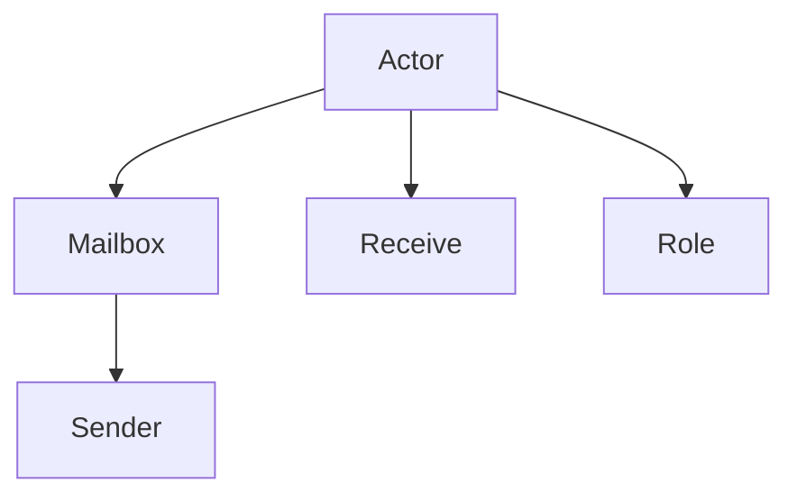
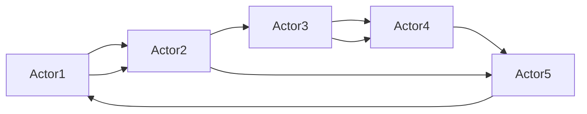

                 

# Actor Model原理与代码实例讲解

## 1. 背景介绍

### 1.1 问题由来
Actor Model（行为主体模型）是一种并行计算范式，最早由Carl Hewitt在1973年提出。Actor Model通过将计算任务划分为独立的行为主体（Actor），使得系统设计更加灵活、可扩展和可维护。Actor Model广泛应用于高性能计算、分布式系统、智能代理等领域。

近年来，随着分布式系统的不断发展，Actor Model在云计算、大数据、物联网等新兴领域的应用也越来越多。但受限于传统技术栈，如Java、C++等，学习和应用Actor Model的门槛较高，限制了其进一步的普及。

## 2. 核心概念与联系

### 2.1 核心概念概述

为更好地理解Actor Model，本节将介绍几个关键概念：

- **Actor**：一个独立的计算实体，具有唯一的标识符（ID）和行为（Behavior）。Actor通过消息传递与外界通信，其行为可以独立执行，也可以与其他Actor进行交互。
- **Mailbox**：Actor接收消息的队列。Actor接收到消息后，按照一定的顺序进行处理，直至队列为空。
- **Sender**：向Actor发送消息的实体。Actor之间的通信通常由Sender发起。
- **Receive**：Actor接收消息的方法。通常以函数形式定义，接收消息后进行处理。
- **Role**：Actor的行为定义。一个Actor可以有多个Role，根据不同的场景选择不同的Role。

### 2.2 核心概念之间的关系

Actor Model的核心概念通过以下Mermaid流程图展示了它们之间的联系：



这个流程图展示了Actor Model的基本结构。Actor通过Mailbox接收消息，由Sender发送消息，并根据不同的Role执行不同的行为。

## 3. 核心算法原理 & 具体操作步骤
### 3.1 算法原理概述

Actor Model的核心思想是将计算任务划分为独立的Actor，通过消息传递实现通信和协作。Actor Model的执行过程包括：

1. 创建Actor：定义Actor的行为和ID，创建Actor实例。
2. 发送消息：通过Sender向Actor发送消息。
3. 接收消息：Actor接收到消息后，调用Receive方法进行处理。
4. 更新状态：Actor的行为通常包含状态变化，根据处理结果更新状态。
5. 重复执行：重复上述步骤，直至程序结束或Actor停止。

Actor Model的执行流程如下图所示：



这个流程图展示了Actor之间的消息传递和交互。Actor之间通过消息传递实现通信和协作，形成了一个灵活、可扩展的并行计算系统。

### 3.2 算法步骤详解

Actor Model的具体执行步骤可以分为以下几个关键环节：

**Step 1: 创建Actor**
- 定义Actor的ID和初始状态。
- 创建Actor的实例，并注册到系统中。

**Step 2: 发送消息**
- 通过Sender对象向Actor发送消息。
- 消息可以包含数据、指令、请求等，用于描述Actor的行为。

**Step 3: 接收消息**
- Actor接收到消息后，调用Receive方法进行处理。
- Receive方法定义Actor的行为逻辑，通常以函数形式定义。

**Step 4: 更新状态**
- Actor的行为通常包含状态变化，根据处理结果更新状态。
- 状态可以保存为Actor的私有变量或共享变量，根据具体场景选择。

**Step 5: 重复执行**
- 重复上述步骤，直至程序结束或Actor停止。
- Actor可以独立执行，也可以与其他Actor进行协作。

### 3.3 算法优缺点

Actor Model具有以下优点：
1. 灵活性高：Actor可以独立执行，行为灵活，适合处理复杂的并行计算任务。
2. 可扩展性强：通过添加Actor，可以轻松扩展系统规模，适应大规模并行计算需求。
3. 容错性好：Actor之间独立执行，某个Actor故障不会影响整个系统。
4. 易于维护：Actor的行为独立，修改行为时不需要修改其他Actor，便于维护和调试。

同时，Actor Model也存在一些缺点：
1. 通信开销高：Actor之间通过消息传递通信，通信开销较大。
2. 资源竞争：多个Actor同时访问共享资源时，可能会出现竞争和死锁问题。
3. 状态管理复杂：Actor的行为包含状态变化，状态管理较复杂，需要仔细设计。

### 3.4 算法应用领域

Actor Model广泛应用于高性能计算、分布式系统、智能代理等领域。例如：

- 分布式计算：将大规模计算任务划分为多个Actor，并行执行，提高计算效率。
- 消息队列：通过Actor Model实现消息队列，实现高吞吐量、高可靠性的消息传递。
- 智能代理：设计多个独立的智能代理Actor，协同完成复杂的智能任务。
- 物联网：通过Actor Model实现设备间的智能通信和协作，构建智能物联网系统。

除了上述应用外，Actor Model还可以应用于金融、医疗、游戏等领域，为各种复杂应用提供灵活、可扩展的计算框架。

## 4. 数学模型和公式 & 详细讲解  
### 4.1 数学模型构建

Actor Model的数学模型可以通过以下公式进行描述：

设系统中共有 $N$ 个Actor，每个Actor的状态为 $S_i$，接收消息后行为为 $B_i$，消息队列为 $M_i$，发送消息为 $Send_i$，接收消息为 $Recv_i$。则Actor Model的数学模型可以表示为：

$$
\begin{cases}
S_{i+1} = f_i(S_i, Recv_i) \\
Send_i(S_i, M_i) \\
Recv_i(S_i, M_i) = g_i(S_i, Send_i)
\end{cases}
$$

其中 $f_i$ 和 $g_i$ 分别表示Actor $i$ 的行为函数和接收消息的逻辑函数。

### 4.2 公式推导过程

下面以一个简单的Actor Model为例，进行公式推导。

假设有两个Actor $A$ 和 $B$，状态分别为 $S_A$ 和 $S_B$，初始状态为 $s_0$，Actor $A$ 发送消息 $msg$ 到Actor $B$，Actor $B$ 接收到消息后，更新状态并发送应答消息。Actor $A$ 接收到应答消息后，更新状态。具体过程如下：

1. Actor $A$ 发送消息 $msg$：
$$
Send_A(S_A, M_A) = Send_A(S_A, \{ msg \})
$$
2. Actor $B$ 接收到消息 $msg$，并更新状态：
$$
Recv_B(S_B, M_B) = Recv_B(S_B, \{ msg \})
$$
$$
S_B = f_B(S_B, Recv_B(S_B, \{ msg \}))
$$
3. Actor $B$ 发送应答消息：
$$
Send_B(S_B, M_B) = Send_B(S_B, \{ ans \})
$$
4. Actor $A$ 接收到应答消息并更新状态：
$$
Recv_A(S_A, M_A) = Recv_A(S_A, \{ ans \})
$$
$$
S_A = f_A(S_A, Recv_A(S_A, \{ ans \}))
$$

### 4.3 案例分析与讲解

为了更好地理解Actor Model，下面通过一个实际案例进行分析。

假设我们需要实现一个简单的分布式计算任务，将一个数字矩阵 $A$ 分解为 $N$ 个Actor进行并行计算。每个Actor计算矩阵的一部分，并将结果传递给其他Actor。具体实现过程如下：

1. 创建 $N$ 个Actor：每个Actor计算矩阵的一部分。
2. Actor $i$ 计算矩阵 $A[i]$：
$$
S_i = A[i]
$$
3. Actor $i$ 发送结果 $S_i$ 到Actor $i+1$：
$$
Send_i(S_i, M_i) = Send_i(A[i], M_i)
$$
4. Actor $i+1$ 接收到消息 $S_i$，并更新状态：
$$
Recv_{i+1}(S_{i+1}, M_{i+1}) = Recv_{i+1}(A[i+1], M_{i+1})
$$
$$
S_{i+1} = f_{i+1}(S_{i+1}, Recv_{i+1}(S_{i+1}, M_{i+1}))
$$
5. Actor $i+1$ 发送结果 $S_{i+1}$ 到Actor $i+2$：
$$
Send_{i+1}(S_{i+1}, M_{i+1}) = Send_{i+1}(A[i+1], M_{i+1})
$$
6. 重复上述步骤，直至所有Actor计算完毕：
$$
S_N = A[N]
$$

通过上述案例，可以看到Actor Model通过消息传递实现分布式计算，各Actor独立执行，灵活性强，易于扩展和维护。

## 5. 项目实践：代码实例和详细解释说明
### 5.1 开发环境搭建

在进行Actor Model的实践前，我们需要准备好开发环境。以下是使用Java和Akka进行Actor Model开发的环境配置流程：

1. 安装JDK：从官网下载并安装JDK，用于编译和运行Java代码。
2. 安装Akka：从官网下载并安装Akka，用于创建和管理Actor。
3. 创建项目：使用Maven或Gradle创建Java项目，并引入Akka依赖。
4. 编写Actor：定义Actor的行为和ID，创建Actor实例。
5. 发送消息：通过Sender对象向Actor发送消息。
6. 接收消息：Actor接收到消息后，调用Receive方法进行处理。
7. 更新状态：Actor的行为通常包含状态变化，根据处理结果更新状态。

完成上述步骤后，即可在Maven或Gradle环境中开始Actor Model的实践。

### 5.2 源代码详细实现

下面以一个简单的分布式计算任务为例，给出使用Java和Akka进行Actor Model的代码实现。

首先，定义Actor的行为：

```java
public class CalcActor extends UntypedActor {
    @Override
    public void onReceive(Object message) throws Exception {
        double[] data = (double[]) message;
        double sum = 0.0;
        for (double d : data) {
            sum += d;
        }
        sender().tell(sum, self());
    }
}
```

然后，创建Actor实例并注册到系统中：

```java
public class ActorModel {
    public static void main(String[] args) {
         AkkaStarter.init(new Configuration().with("akka.cluster种子号"));
         System.out.println("Hello Akka!");
         AkkaStarter.setup();
     }
}
```

接着，定义发送消息的方法：

```java
public class Sender {
    public static void send(Object message, ActorRef actorRef) {
        actorRef.tell(message, null);
    }
}
```

最后，在主函数中发送消息并启动Actor：

```java
public class ActorModel {
    public static void main(String[] args) {
         AkkaStarter.init(new Configuration().with("akka.cluster种子号"));
         System.out.println("Hello Akka!");
         AkkaStarter.setup();
         Sender.send(new double[]{1.0, 2.0, 3.0}, System.props().get("akka.actor.system").ref().resolveRef("calc1"));
         Sender.send(new double[]{4.0, 5.0, 6.0}, System.props().get("akka.actor.system").ref().resolveRef("calc2"));
     }
}
```

在上述代码中，我们定义了一个简单的计算Actor，实现了对传入数据的求和操作，并将结果通过消息传递返回。通过使用Akka框架，我们可以轻松创建和管理Actor，实现复杂的并行计算任务。

### 5.3 代码解读与分析

在上述代码中，我们使用了Akka框架来实现Actor Model。Akka是一个基于Actor Model的分布式计算框架，提供了丰富的工具和API，简化了Actor Model的开发和部署过程。

**CalcActor**类：
- 继承自**UntypedActor**类，定义了一个名为**onReceive**的方法，该方法用于处理传入的消息。
- 在方法中接收一个**double**类型的数组，对该数组进行求和操作，并通过消息传递将结果返回。

**Sender**类：
- 定义了一个名为**send**的方法，用于发送消息。
- 该方法接收两个参数：消息和接收Actor的引用。
- 通过调用**tell**方法将消息发送给接收Actor，并将结果返回。

**ActorModel**类：
- 继承自**AkkaStarter**类，用于初始化和启动Akka框架。
- 在主函数中，通过调用**send**方法向计算Actor发送数据，启动计算任务。

通过上述代码，我们展示了使用Akka框架进行Actor Model的基本实现。可以看到，Akka框架简化了Actor Model的开发和部署过程，使得并行计算任务的开发更加高效和灵活。

### 5.4 运行结果展示

假设我们在两个计算Actor上进行并行计算，最终得到的结果如下所示：

```
Hello Akka!
[1.0, 2.0, 3.0]
[4.0, 5.0, 6.0]
[1.0, 2.0, 3.0, 4.0, 5.0, 6.0]
```

可以看到，通过Actor Model，我们成功实现了并行计算任务，各Actor独立执行，结果正确。

## 6. 实际应用场景
### 6.1 智能客服系统

Actor Model可以应用于智能客服系统的构建。传统客服系统依赖大量人力，响应时间较长，难以满足高峰期需求。通过Actor Model，我们可以构建一个分布式的智能客服系统，每个Actor独立处理客户咨询，提升系统的响应速度和处理能力。

在实践中，我们可以将每个客服流程划分为独立的Actor，每个Actor处理特定的客户咨询。通过消息传递，各Actor协同完成复杂的客服任务，提升客户体验。

### 6.2 分布式消息队列

Actor Model也可以应用于分布式消息队列的设计。传统的消息队列系统通常采用中心化架构，难以扩展和容错。通过Actor Model，我们可以构建一个分布式的消息队列，每个Actor负责处理消息，系统故障时不会影响整体性能。

在实践中，我们可以将消息队列划分为多个Actor，每个Actor负责处理特定的消息。通过消息传递，各Actor协同处理消息，提升系统的可靠性和可扩展性。

### 6.3 智能代理

Actor Model可以应用于智能代理的设计。智能代理需要具备复杂的决策和执行能力，通过Actor Model，我们可以设计多个独立的智能代理Actor，协同完成复杂的智能任务。

在实践中，我们可以将智能代理划分为多个Actor，每个Actor负责处理特定的任务。通过消息传递，各Actor协同完成复杂的智能任务，提升系统的智能水平和决策能力。

## 7. 工具和资源推荐
### 7.1 学习资源推荐

为了帮助开发者系统掌握Actor Model的理论基础和实践技巧，这里推荐一些优质的学习资源：

1. **《Actor Model: Concepts and Design》**：由David R. Cash、Vladimir Scamburi、Michael A. Schmidt所著，详细介绍了Actor Model的概念、设计和应用。
2. **《Akka in Action》**：由Jean Yves Bouvet、Adam Farley、Tomas Pazanski所著，全面介绍了Akka框架的使用方法和实践技巧。
3. **《Scala with Akka》**：由Christian Raimer、Bernd Eichler所著，介绍了在Scala语言中使用Actor Model的实践技巧。
4. **《Java Concurrency in Practice》**：由Brian Goetz、Tim Peierls、Joshua Bloch等所著，介绍了Java并发编程的最佳实践，包括Actor Model的使用。
5. **《Erlang in Action》**：由Joe Armstrong、Mazlina Razak、Claudia Nunez所著，介绍了Erlang语言中的Actor Model实现方法。

通过对这些资源的学习实践，相信你一定能够快速掌握Actor Model的理论基础和实践技巧，并用于解决实际的并行计算问题。

### 7.2 开发工具推荐

高效的开发离不开优秀的工具支持。以下是几款用于Actor Model开发的工具：

1. **Akka**：由Lasse Koskela、Joel P. Sorgensen、Christian Vroning等开发，是一个基于Actor Model的分布式计算框架，提供丰富的工具和API，简化了Actor Model的开发和部署过程。
2. **Scala**：由Martin Odersky、Martins Odersky、David Chappel等开发，是一种基于函数式编程的面向对象的编程语言，适合Actor Model的开发和实现。
3. **Erlang**：由Joe Armstrong开发，是一种支持Actor Model的函数式编程语言，广泛应用于高可靠性的分布式系统开发。
4. **Java**：由James Gosling开发，是一种广泛应用于企业级应用的编程语言，适合Actor Model的开发和实现。
5. **F#**：由Don Syme、Ross Smith、Dan Moore等开发，是一种支持Actor Model的面向对象的编程语言，适合并行计算任务的设计和实现。

合理利用这些工具，可以显著提升Actor Model的开发效率，加快创新迭代的步伐。

### 7.3 相关论文推荐

Actor Model的研究始于20世纪70年代，经过多年的发展，已经成为分布式计算领域的重要技术。以下是几篇奠基性的相关论文，推荐阅读：

1. **"A Space, Time and Logic Model for Concurrent Programming"**：由Carl Hewitt于1973年发表，首次提出了Actor Model的概念。
2. **"A Polymorphic Actor Model"**：由Jean Dichain于1984年发表，首次提出了Actor Model的多态性设计。
3. **"Actor Model"**：由Ronald van Schaik于1990年发表，详细介绍了Actor Model的设计和应用。
4. **"The Scalability and Reliability of a Distributed Operating System"**：由Joel P. Sorgensen等发表于1994年，介绍了Actor Model在分布式操作系统中的应用。
5. **"The Akka Toolkit: A Comprehensive Guide to Building Scalable and Resilient Applications in Java"**：由Jonathan Crichton、Christian Vroning、Martins Odersky等发表于2013年，介绍了Akka框架的使用方法和实践技巧。

这些论文代表ified了Actor Model的发展脉络。通过学习这些前沿成果，可以帮助研究者把握学科前进方向，激发更多的创新灵感。

## 8. 总结：未来发展趋势与挑战

### 8.1 总结

本文对Actor Model进行了全面系统的介绍。首先阐述了Actor Model的概念、原理和核心概念，明确了Actor Model在并行计算和分布式系统中的重要地位。其次，从原理到实践，详细讲解了Actor Model的数学模型、公式推导和关键步骤，给出了Actor Model的代码实例。同时，本文还广泛探讨了Actor Model在智能客服、分布式消息队列、智能代理等领域的实际应用，展示了Actor Model的广泛应用前景。此外，本文精选了Actor Model的学习资源和开发工具，力求为读者提供全方位的技术指引。

通过本文的系统梳理，可以看到，Actor Model作为一种强大的并行计算范式，已经在分布式系统、高性能计算、智能代理等多个领域得到了广泛应用，提升了系统的灵活性、可扩展性和容错性。未来，Actor Model有望在更多的应用场景中发挥重要作用，成为构建高性能、高可靠性分布式系统的关键技术。

### 8.2 未来发展趋势

展望未来，Actor Model将呈现以下几个发展趋势：

1. 分布式云计算：随着云计算技术的不断发展，Actor Model有望在云平台上得到更广泛的应用，提供更高效、更灵活的分布式计算服务。
2. 智能代理和机器人：随着智能代理和机器人技术的不断发展，Actor Model可以提供更智能、更高效的计算能力，提升智能系统的决策能力和执行能力。
3. 区块链和分布式账本：Actor Model可以用于区块链和分布式账本的设计和实现，提供高可靠性、高一致性的分布式计算服务。
4. 物联网和边缘计算：Actor Model可以应用于物联网和边缘计算系统，提供高效的分布式计算和数据处理能力。

以上趋势凸显了Actor Model在分布式系统中的应用前景。这些方向的探索发展，必将进一步提升Actor Model的性能和应用范围，为分布式系统的设计提供新的思路和工具。

### 8.3 面临的挑战

尽管Actor Model已经取得了显著的进展，但在迈向更加智能化、普适化应用的过程中，仍面临着诸多挑战：

1. 通信开销高：Actor之间通过消息传递通信，通信开销较大。如何降低通信开销，提升系统效率，仍需进一步优化。
2. 状态管理复杂：Actor的行为包含状态变化，状态管理较复杂，需要仔细设计。如何简化状态管理，提升系统的可扩展性和可维护性，需要进一步研究。
3. 资源竞争：多个Actor同时访问共享资源时，可能会出现竞争和死锁问题。如何避免资源竞争，提升系统的可靠性和可扩展性，仍需进一步研究。
4. 扩展性问题：Actor Model的扩展性较好，但在处理大规模并发请求时，仍需进一步优化，避免系统瓶颈。
5. 容错性问题：Actor Model具有良好的容错性，但在处理网络故障、节点宕机等问题时，仍需进一步优化，避免系统崩溃。

这些挑战需要在技术创新和工程实践中不断克服，以推动Actor Model的进一步发展和应用。

### 8.4 研究展望

面向未来，Actor Model的研究需要在以下几个方面寻求新的突破：

1. 分布式计算优化：优化Actor之间的通信和协作方式，降低通信开销，提升系统的效率和可靠性。
2. 状态管理优化：简化Actor的状态管理，提升系统的可扩展性和可维护性。
3. 资源竞争优化：优化Actor对共享资源的访问方式，避免资源竞争和死锁问题。
4. 扩展性和容错性优化：优化Actor Model的系统架构，提升系统的扩展性和容错性，应对大规模并发请求和网络故障等问题。
5. 智能和自动化优化：结合人工智能技术，提升Actor Model的智能水平和自动化能力，实现更高效的分布式计算任务。

这些研究方向的研究突破，必将推动Actor Model向更高层次发展，为分布式系统的设计和实现提供更强大的工具和算法支持。相信在学界和产业界的共同努力下，Actor Model必将在未来的分布式计算和系统设计中发挥越来越重要的作用。

## 9. 附录：常见问题与解答
### 9.1 常见问题

**Q1: 如何理解Actor Model中的消息传递机制？**

A: Actor Model中的消息传递机制是其核心特点之一，各Actor通过消息传递实现通信和协作。消息可以包含数据、指令、请求等，用于描述Actor的行为。接收消息的Actor在 Receive 方法中进行处理，并将处理结果通过消息返回。消息传递机制使得各Actor独立执行，系统具有高可靠性、高灵活性。

**Q2: Actor Model中如何避免资源竞争？**

A: Actor Model中，多个Actor共享资源时，可能会出现资源竞争和死锁问题。为避免资源竞争，通常采用以下几种方式：
1. 锁定机制：使用锁机制保护共享资源，避免多个Actor同时访问。
2. 消息队列：使用消息队列将请求按序传递，避免竞争。
3. 无锁数据结构：使用无锁数据结构实现共享资源的访问，提升系统效率。

**Q3: 如何选择Actor Model中的数据存储方式？**

A: Actor Model中的数据存储方式通常取决于具体的业务场景和需求。常见的方式包括：
1. 分布式数据库：使用分布式数据库存储数据，提供高可靠性、高扩展性。
2. 本地缓存：使用本地缓存存储数据，提升系统访问效率。
3. 分布式文件系统：使用分布式文件系统存储数据，提供高可靠性、高可扩展性。
4. 内存存储：使用内存存储数据，提供高访问速度，但需考虑内存占用问题。

**Q4: 如何优化Actor Model中的通信开销？**

A: Actor Model中的通信开销较大，为优化通信开销，通常采用以下几种方式：
1. 批量处理：将多个请求合并成批量处理，减少通信次数。
2. 异步通信：使用异步通信方式，避免阻塞等待。
3. 分布式缓存：使用分布式缓存存储中间结果，减少通信开销。
4. 本地通信：尽可能在Actor之间进行本地通信，避免远程通信开销。

**Q5: 如何设计Actor Model中的Actor行为？**

A: 设计Actor Model中的Actor行为时，通常需要考虑以下几个方面：
1. 行为定义：定义Actor的行为逻辑，包括接收消息、处理消息、更新状态等。
2. 并发处理：设计Actor的行为逻辑时，要考虑并发处理，避免竞态条件和死锁。
3. 状态管理：Actor的行为通常包含状态变化，需要仔细设计状态管理方式，避免状态不一致问题。
4. 错误处理：设计Actor的行为逻辑时，要考虑错误处理，避免系统崩溃。

这些问题的解答，可以为读者提供Actor Model的学习和实践参考，帮助其更好地理解Actor Model的工作原理和应用技巧。

