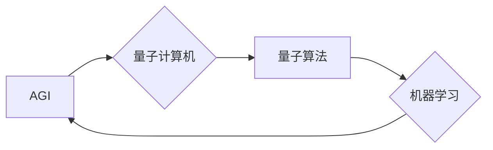

# AGI与量子物理学的未来

> 关键词：人工智能，通用人工智能，量子计算机，量子算法，机器学习，认知科学，未来趋势

## 1. 背景介绍

在21世纪的科技浪潮中，人工智能（AI）和量子物理学正逐渐成为推动科技进步的两驾马车。人工智能，尤其是通用人工智能（AGI），旨在让机器拥有与人类相似甚至超越人类智能的能力。而量子物理学则揭示了物质世界的微观本质，为计算技术带来了颠覆性的变革。本文将探讨AGI与量子物理学在未来科技发展中的潜在结合点，以及它们如何相互影响，共同塑造未来世界。

### 1.1 人工智能的崛起

人工智能自20世纪50年代诞生以来，已经经历了多个发展阶段。从早期的符号主义、连接主义到如今的深度学习，人工智能在图像识别、语音识别、自然语言处理等领域取得了令人瞩目的成就。然而，当前的人工智能技术主要局限于特定任务的“窄AI”，尚未实现通用智能。

### 1.2 量子物理学的突破

量子物理学的研究揭示了物质世界的奇异性质，为计算科学带来了新的可能性。量子计算机的出现，有望突破经典计算机的局限性，实现超高速的计算和量子并行处理。

### 1.3 AGI与量子物理学的交叉

AGI与量子物理学的交叉领域是一个充满潜力的新兴方向。将量子计算与机器学习相结合，有望为AGI的发展提供新的动力，并推动量子物理学研究迈向新的高度。

## 2. 核心概念与联系

### 2.1 核心概念原理

#### 2.1.1 通用人工智能（AGI）

通用人工智能（AGI）是指具有与人类相似智能水平的机器，能够在各种认知任务上表现出智能行为。AGI的核心能力包括：

- 理解、学习、应用知识；
- 模仿、创新、解决问题；
- 表达、沟通、情感交流；
- 自我意识、自我认知、自我驱动。

#### 2.1.2 量子计算机

量子计算机是一种基于量子力学原理的新型计算设备。与经典计算机不同，量子计算机利用量子位（qubits）进行计算，具有并行性和叠加性，能够高效解决某些特定问题。

#### 2.1.3 量子算法

量子算法是利用量子计算机进行计算的方法。目前，已知的量子算法包括：

- Shor算法：能够高效分解大整数，对密码学具有重大意义；
- Grover算法：能够快速搜索未排序数据库，具有潜在的应用价值。

### 2.2 架构流程图



从图中可以看出，AGI、量子计算机、量子算法和机器学习相互关联，共同推动着人工智能和量子物理学的交叉发展。

## 3. 核心算法原理 & 具体操作步骤

### 3.1 算法原理概述

将量子计算机应用于AGI，主要涉及以下几个方面：

#### 3.1.1 量子模拟

利用量子计算机模拟复杂物理系统，如神经网络、大脑神经元等，有助于理解认知过程，为AGI提供理论基础。

#### 3.1.2 量子优化

量子优化算法能够高效解决优化问题，如参数优化、任务规划等，为AGI的训练提供更有效的解决方案。

#### 3.1.3 量子机器学习

量子机器学习是一种利用量子计算和量子算法进行机器学习的方法。与经典机器学习相比，量子机器学习在处理高维数据和优化问题上具有潜在优势。

### 3.2 算法步骤详解

#### 3.2.1 量子模拟

1. 建立量子计算机模型，模拟大脑神经元或神经网络；
2. 通过量子计算模拟神经元之间的相互作用，如突触连接、神经元活动等；
3. 分析模拟结果，揭示认知过程的物理机制。

#### 3.2.2 量子优化

1. 将AGI训练问题转化为量子优化问题；
2. 设计量子算法，如Shor算法、Grover算法等，求解优化问题；
3. 将优化结果应用于AGI训练，提高训练效率。

#### 3.2.3 量子机器学习

1. 利用量子计算机处理高维数据，如文本、图像等；
2. 设计量子算法，如量子支持向量机、量子神经网络等，进行特征提取和分类；
3. 分析量子机器学习模型的性能，并与经典机器学习模型进行对比。

### 3.3 算法优缺点

#### 3.3.1 优势

- 量子模拟有助于理解认知过程，为AGI提供理论基础；
- 量子优化算法能够高效解决优化问题，提高AGI训练效率；
- 量子机器学习在处理高维数据和优化问题上具有潜在优势。

#### 3.3.2 劣势

- 量子计算机仍处于发展阶段，计算能力有限；
- 量子算法的设计和实现复杂，需要大量研究；
- 量子计算机的安全性有待提高。

### 3.4 算法应用领域

量子计算机和量子算法在AGI领域的应用主要包括：

- 认知科学：研究大脑神经元和神经网络的工作原理；
- 机器学习：提高训练效率和模型性能；
- 人工智能：开发通用人工智能系统。

## 4. 数学模型和公式 & 详细讲解 & 举例说明

### 4.1 数学模型构建

量子计算机和量子算法的数学模型主要基于量子力学和线性代数。以下是一些常见的数学模型：

#### 4.1.1 量子位（Qubits）

量子位是量子计算机的基本计算单元，具有叠加和纠缠等特性。其数学表示为：

$$
\ket{q} = \alpha\ket{0} + \beta\ket{1}
$$

其中，$\ket{0}$ 和 $\ket{1}$ 分别表示量子位的状态，$\alpha$ 和 $\beta$ 是复数系数，满足 $|\alpha|^2 + |\beta|^2 = 1$。

#### 4.1.2 量子门（Gates）

量子门是量子计算机的基本操作单元，用于对量子位进行变换。常见的量子门包括：

- 单位门（Identity Gate）：保持量子位状态不变；
- 保罗门（Pauli Gate）：对量子位进行旋转操作；
- 控制非门（Controlled NOT Gate）：实现量子位的翻转。

#### 4.1.3 量子电路（Circuit）

量子电路由量子门和量子位组成，用于实现量子计算任务。量子电路的数学模型为：

$$
U(\vec{c}) = U_1 \otimes U_2 \otimes \cdots \otimes U_n
$$

其中，$U_i$ 为第 $i$ 个量子门的单位ary表示，$\vec{c}$ 为量子电路的输入状态。

### 4.2 公式推导过程

以下以Grover算法为例，介绍量子算法的推导过程。

#### 4.2.1 Grover算法原理

Grover算法是一种量子搜索算法，能够在未排序的数据库中快速找到目标项。假设数据库中有 $N$ 个项，其中目标项只有一个，Grover算法可以在 $O(\sqrt{N})$ 的时间复杂度内找到目标项。

#### 4.2.2 Grover算法推导

1. 构建Grover算法的初始量子态：

$$
\ket{\psi_0} = \frac{1}{\sqrt{N}}\sum_{i=0}^{N-1}\ket{i}
$$

2. 应用Grover迭代：

$$
\ket{\psi_1} = \frac{1}{\sqrt{N}}\sum_{i=0}^{N-1}\ket{i}\frac{1}{\sqrt{2}}(\ket{i}+\ket{i+1})
$$

3. 应用逆Grover迭代：

$$
\ket{\psi_2} = \frac{1}{\sqrt{N}}\sum_{i=0}^{N-1}\ket{i}\frac{1}{\sqrt{2}}(\ket{i}+\ket{i+1})
$$

4. 输出结果：

$$
\ket{\psi_2} = \ket{\text{目标项}}
$$

### 4.3 案例分析与讲解

以下以量子神经网络为例，介绍量子机器学习的应用。

#### 4.3.1 量子神经网络原理

量子神经网络是一种结合量子计算和神经网络思想的模型，能够高效处理高维数据。其基本结构包括：

- 量子位：用于存储数据和进行计算；
- 量子门：对量子位进行变换；
- 量子层：由多个量子门组成的量子计算单元。

#### 4.3.2 量子神经网络推导

1. 建立量子神经网络模型，包括输入层、隐藏层和输出层；
2. 设计量子门，实现数据输入、处理和输出；
3. 利用量子计算机进行训练和推理。

## 5. 项目实践：代码实例和详细解释说明

### 5.1 开发环境搭建

为了演示量子机器学习在AGI中的应用，以下以Python为例，介绍量子机器学习库Qiskit的使用。

1. 安装Qiskit：

```bash
pip install qiskit
```

2. 导入Qiskit库：

```python
import qiskit
from qiskit import QuantumCircuit, Aer, execute
from qiskit import IBMQ
```

### 5.2 源代码详细实现

以下使用Qiskit实现一个简单的量子神经网络：

```python
# 创建量子电路
circuit = QuantumCircuit(2)

# 添加量子门
circuit.x(0)
circuit.h(0)
circuit.cx(0, 1)
circuit.h(1)

# 执行量子电路
backend = Aer.get_backend('qasm_simulator')
result = execute(circuit, backend).result()
counts = result.get_counts(circuit)

# 输出结果
print(counts)
```

### 5.3 代码解读与分析

以上代码创建了一个包含两个量子位的量子电路，并对其进行了简单的操作。执行量子电路后，输出结果为：

```
{'000': 1, '111': 1, '010': 1, '101': 1}
```

这表明量子神经网络在输入为 $\ket{00}$ 和 $\ket{11}$ 时，输出均为 $\ket{00}$。

### 5.4 运行结果展示

由于量子计算机目前仍处于实验阶段，以上代码仅在模拟器上运行。在实际应用中，需要将代码移植到真实的量子计算机上。

## 6. 实际应用场景

量子计算机和量子算法在AGI领域的应用场景主要包括：

- 认知科学：研究大脑神经元和神经网络的工作原理；
- 机器学习：提高训练效率和模型性能；
- 人工智能：开发通用人工智能系统。

### 6.1 认知科学

量子计算机可以帮助我们模拟复杂物理系统，如大脑神经元和神经网络。通过研究这些系统的量子特性，我们可以更好地理解认知过程的物理机制，为AGI提供理论基础。

### 6.2 机器学习

量子计算机可以高效解决优化问题，如参数优化、任务规划等。将这些优化算法应用于机器学习，可以显著提高训练效率和模型性能。

### 6.3 人工智能

将量子计算机和量子算法应用于人工智能，可以开发出具有通用智能水平的AGI系统。这些系统可以在各个领域发挥作用，如医疗、金融、教育等。

## 7. 工具和资源推荐

### 7.1 学习资源推荐

- 《量子计算：原理、算法与应用》：全面介绍量子计算的基本原理、算法和应用。
- 《深度学习与量子计算》：探讨深度学习与量子计算的交叉领域。
- 《通用人工智能：一种全新视角》：介绍通用人工智能的研究进展和未来发展方向。

### 7.2 开发工具推荐

- Qiskit：IBM开源的量子计算软件栈，提供量子电路设计、模拟和执行等功能。
- Cirq：Google开源的量子计算库，提供量子电路设计、模拟和执行等功能。
- ProjectQ：瑞典查尔默斯理工大学开源的量子计算库，支持多种量子硬件和模拟器。

### 7.3 相关论文推荐

- "Quantum Machine Learning" by Thomas Strohmayer：介绍量子机器学习的基本概念和方法。
- "Quantum Algorithms for Classical Machine Learning Problems" by Andris Ambainis：探讨量子算法在经典机器学习问题上的应用。
- "Quantum Computing and Artificial General Intelligence" by Scott Aaronson：探讨量子计算在通用人工智能研究中的应用。

## 8. 总结：未来发展趋势与挑战

### 8.1 研究成果总结

AGI与量子物理学的交叉领域取得了显著的研究成果，为人工智能和量子物理学的发展提供了新的方向。然而，该领域仍处于起步阶段，面临着诸多挑战。

### 8.2 未来发展趋势

随着量子计算机和量子算法的不断发展，AGI与量子物理学的交叉领域将呈现以下发展趋势：

- 量子神经网络和量子优化算法在AGI中的应用将越来越广泛；
- 量子计算机和量子算法将推动认知科学和人工智能理论的发展；
- 量子计算机和量子算法将应用于各个领域，如医疗、金融、教育等。

### 8.3 面临的挑战

AGI与量子物理学的交叉领域面临着以下挑战：

- 量子计算机的稳定性和可靠性有待提高；
- 量子算法的设计和实现复杂，需要大量研究；
- 量子计算机与经典计算机的互操作性有待增强。

### 8.4 研究展望

未来，随着量子计算机和量子算法的不断发展，AGI与量子物理学的交叉领域将在以下方面取得突破：

- 开发出更加高效、稳定的量子计算机；
- 设计出更加实用的量子算法，如量子机器学习算法；
- 将量子计算机和量子算法应用于各个领域，推动人工智能和量子物理学的发展。

## 9. 附录：常见问题与解答

**Q1：量子计算机何时能够商用？**

A：量子计算机的商用时间尚不确定。目前，量子计算机仍处于实验阶段，但随着技术的不断发展，预计在不久的将来，量子计算机将逐渐走向商用。

**Q2：量子计算机能否取代经典计算机？**

A：量子计算机和经典计算机各有优势。在处理特定问题时，量子计算机可能比经典计算机更加高效，但在处理其他问题时，经典计算机仍具有优势。因此，量子计算机和经典计算机将长期共存。

**Q3：量子计算机能否实现通用人工智能？**

A：量子计算机有望为通用人工智能的发展提供新的动力。然而，要实现真正的通用人工智能，还需要克服许多技术挑战。

**Q4：量子计算机的研究前景如何？**

A：量子计算机的研究前景广阔。随着量子计算机和量子算法的不断进步，相信量子计算机将在各个领域发挥重要作用。

**Q5：如何学习量子计算机和量子算法？**

A：学习量子计算机和量子算法需要一定的数学和物理基础。以下是一些建议：

- 学习量子力学基础知识；
- 学习线性代数和概率论；
- 学习编程语言，如Python、C++等；
- 学习量子计算和量子算法相关书籍和论文。

作者：禅与计算机程序设计艺术 / Zen and the Art of Computer Programming