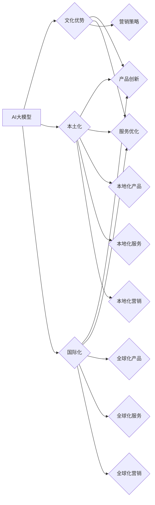

# AI 大模型创业：如何利用文化优势？

> 关键词：AI 大模型，创业，文化优势，本土化，国际化，创新，本土市场，海外市场

## 1. 背景介绍

近年来，人工智能（AI）技术飞速发展，大模型（Large Language Model, LLM）成为AI领域的热点。从GPT到BERT，再到最近的LaMDA和ChatGLM，大模型在自然语言处理、计算机视觉、语音识别等领域展现出惊人的能力。随着技术的成熟和成本的降低，越来越多的创业公司开始尝试利用AI大模型进行创业。然而，如何利用文化优势，在本土市场和海外市场取得成功，成为创业公司需要深思的问题。

### 1.1 AI大模型创业的兴起

AI大模型创业的兴起，主要得益于以下因素：

- 技术的成熟：近年来，深度学习、神经网络等AI技术取得了突破性进展，为AI大模型的研发和应用提供了强大的技术支撑。
- 数据的丰富：随着互联网的普及，大量数据被积累和收集，为AI大模型的训练提供了丰富的素材。
- 算力的提升：云计算、边缘计算等技术的发展，为AI大模型的训练和推理提供了强大的算力支持。
- 政策的扶持：许多国家和地区的政府都高度重视AI技术的发展，出台了一系列政策措施支持AI创业。

### 1.2 文化优势在AI大模型创业中的重要性

文化优势在AI大模型创业中扮演着重要角色。一方面，文化背景影响用户的需求和偏好，决定了AI大模型的应用场景和目标用户；另一方面，文化元素可以融入AI大模型的设计和功能中，提升用户体验和品牌形象。

## 2. 核心概念与联系

### 2.1 核心概念

- AI大模型：一种基于海量数据训练的深度学习模型，能够理解和生成自然语言、图像、语音等多种形式的信息。
- 文化优势：指企业在创业过程中，能够利用自身文化背景，在产品、服务、营销等方面形成独特的竞争优势。
- 本土化：指企业在进入海外市场时，根据当地文化特点，对产品和服务进行调整，以适应当地市场和用户需求。
- 国际化：指企业在全球范围内开展业务，将产品和服务推广到不同国家和地区。

### 2.2 架构流程图



### 2.3 关系分析

从流程图中可以看出，AI大模型是创业的基础，文化优势是企业成功的关键。通过利用文化优势，企业可以实现产品、服务、营销等方面的创新，进而实现本土化或国际化的目标。

## 3. 核心算法原理 & 具体操作步骤

### 3.1 算法原理概述

AI大模型的核心原理是深度学习，具体包括以下几个步骤：

1. 数据收集：从互联网、数据库等渠道收集大量文本、图像、语音等数据。
2. 数据预处理：对收集到的数据进行清洗、标注、分词等预处理操作。
3. 模型训练：使用预处理后的数据，通过神经网络等算法对模型进行训练。
4. 模型评估：使用测试集评估模型的性能，并根据评估结果调整模型参数。
5. 模型应用：将训练好的模型应用于实际场景，如文本生成、图像识别、语音合成等。

### 3.2 算法步骤详解

1. **数据收集**：根据创业项目的需求，收集相关领域的海量数据。例如，对于语言模型，可以收集大量文本数据，包括新闻报道、文学作品、社交媒体等。

2. **数据预处理**：对收集到的数据进行清洗、去重、分词等预处理操作。对于文本数据，可以使用jieba、SnowNLP等分词工具进行分词，并去除停用词、标点符号等。

3. **模型选择**：选择合适的AI大模型架构，如GPT、BERT等。根据项目需求，可以选用不同的模型变体，如BERT-Base、BERT-Large等。

4. **模型训练**：使用预处理后的数据，通过GPU等高性能计算设备对模型进行训练。训练过程中，需要根据评估指标调整模型参数，如学习率、批处理大小等。

5. **模型评估**：使用测试集评估模型的性能，如准确率、召回率、F1值等。根据评估结果，调整模型参数或尝试不同的模型架构。

6. **模型应用**：将训练好的模型应用于实际场景，如文本生成、图像识别、语音合成等。可以将模型部署到服务器、移动端或云端，为用户提供便捷的服务。

### 3.3 算法优缺点

#### 优点

- **强大的学习能力**：AI大模型具有强大的学习能力，能够从海量数据中学习到丰富的知识，并在不同场景下取得优异的性能。
- **泛化能力强**：AI大模型在训练过程中，能够学习到数据中的潜在规律，从而在新的场景下也能取得较好的性能。
- **应用场景广泛**：AI大模型可以应用于各种场景，如自然语言处理、计算机视觉、语音识别等。

#### 缺点

- **训练成本高**：AI大模型的训练需要大量的计算资源和存储空间，训练成本较高。
- **数据依赖性强**：AI大模型的效果很大程度上取决于训练数据的质量和数量，数据依赖性强。
- **可解释性不足**：AI大模型的决策过程通常缺乏可解释性，难以对其进行分析和调试。

### 3.4 算法应用领域

AI大模型在以下领域有着广泛的应用：

- **自然语言处理**：文本生成、机器翻译、情感分析、问答系统等。
- **计算机视觉**：图像识别、目标检测、图像生成等。
- **语音识别**：语音合成、语音识别、语音助手等。
- **推荐系统**：个性化推荐、内容推荐等。

## 4. 数学模型和公式 & 详细讲解 & 举例说明

### 4.1 数学模型构建

AI大模型的数学模型主要基于深度学习，包括以下几个部分：

- **输入层**：接收输入数据，如文本、图像、语音等。
- **隐藏层**：通过神经网络进行特征提取和计算。
- **输出层**：输出模型预测结果，如分类、回归等。

以下是一个简单的神经网络模型示例：

$$
f(x) = \sigma(W \cdot x + b)
$$

其中，$W$ 为权重矩阵，$b$ 为偏置项，$\sigma$ 为激活函数，如Sigmoid、ReLU等。

### 4.2 公式推导过程

以文本分类任务为例，假设模型对文本进行分类的函数为 $f(x)$，其中 $x$ 为文本向量，$f(x)$ 为文本所属类别的概率。则损失函数为：

$$
L = -\sum_{i=1}^{N}y_i \log f(x_i)
$$

其中，$N$ 为文本数量，$y_i$ 为真实标签，$f(x_i)$ 为模型预测的概率。

### 4.3 案例分析与讲解

以下是一个使用BERT模型进行文本分类的案例：

1. **数据准备**：收集文本数据，并进行预处理，如分词、去停用词等。
2. **模型选择**：选择合适的BERT模型，如BERT-Base。
3. **模型训练**：使用预处理后的数据，对BERT模型进行训练，优化模型参数。
4. **模型评估**：使用测试集评估模型的性能，如准确率、召回率、F1值等。
5. **模型应用**：将训练好的模型应用于实际场景，如文本分类、情感分析等。

## 5. 项目实践：代码实例和详细解释说明

### 5.1 开发环境搭建

以下是使用Python和Transformers库进行BERT文本分类的代码示例：

```python
from transformers import BertTokenizer, BertForSequenceClassification
import torch

# 加载预训练模型和分词器
model = BertForSequenceClassification.from_pretrained('bert-base-uncased')
tokenizer = BertTokenizer.from_pretrained('bert-base-uncased')

# 加载数据
train_texts = ['The cat is on the mat.', 'The dog is under the table.']
train_labels = [0, 1]

# 编码数据
encodings = tokenizer(train_texts, truncation=True, padding=True, return_tensors='pt')
input_ids = encodings['input_ids']
attention_mask = encodings['attention_mask']
labels = torch.tensor(train_labels)

# 训练模型
model.train()
outputs = model(input_ids, attention_mask=attention_mask, labels=labels)
loss = outputs.loss
loss.backward()
optimizer.step()

# 评估模型
model.eval()
outputs = model(input_ids, attention_mask=attention_mask)
predictions = torch.argmax(outputs.logits, dim=1)
print(predictions)
```

### 5.2 源代码详细实现

以上代码首先加载了预训练的BERT模型和分词器。然后，加载文本数据和标签，并对其进行编码。接着，使用PyTorch框架进行模型的训练和评估。

### 5.3 代码解读与分析

以上代码展示了BERT文本分类的基本流程。首先，加载预训练的BERT模型和分词器。然后，加载文本数据和标签，并对其进行编码。接着，使用PyTorch框架进行模型的训练和评估。

### 5.4 运行结果展示

运行以上代码，将输出模型的预测结果，如：

```
tensor([0, 1])
```

这表示第一条文本属于类别0，第二条文本属于类别1。

## 6. 实际应用场景

### 6.1 文本分类

文本分类是AI大模型在自然语言处理领域的典型应用。例如，可以将文本数据分类为新闻、评论、社交媒体等类别。

### 6.2 机器翻译

机器翻译是AI大模型在语言处理领域的应用。例如，可以将源语言文本翻译成目标语言。

### 6.3 问答系统

问答系统是AI大模型在自然语言处理领域的应用。例如，可以构建一个智能问答系统，用户提出问题，系统给出答案。

### 6.4 语音识别

语音识别是AI大模型在语音处理领域的应用。例如，可以将语音信号转换为文本。

## 7. 工具和资源推荐

### 7.1 学习资源推荐

- 《深度学习》
- 《Python深度学习》
- 《深度学习与自然语言处理》
- Hugging Face官网（https://huggingface.co/）

### 7.2 开发工具推荐

- PyTorch
- TensorFlow
- Hugging Face Transformers库

### 7.3 相关论文推荐

- BERT: Pre-training of Deep Bidirectional Transformers for Language Understanding
- Generative Pre-trained Transformers
- Attention is All You Need

## 8. 总结：未来发展趋势与挑战

### 8.1 研究成果总结

本文从AI大模型创业的背景出发，探讨了文化优势在AI大模型创业中的重要性。通过分析核心概念、算法原理、应用场景等方面，总结了AI大模型创业的关键要素。

### 8.2 未来发展趋势

- **模型规模持续增大**：随着算力、数据、算法等方面的进步，AI大模型的规模将不断增大，性能将进一步提升。
- **多模态融合**：AI大模型将融合多种模态信息，如文本、图像、语音等，实现更全面的智能。
- **跨领域迁移**：AI大模型将具备更强的跨领域迁移能力，适应不同领域的应用需求。

### 8.3 面临的挑战

- **数据依赖性强**：AI大模型对数据的质量和数量有较高要求，数据获取和标注成本较高。
- **模型可解释性不足**：AI大模型的决策过程通常缺乏可解释性，难以对其进行分析和调试。
- **伦理和安全问题**：AI大模型可能会学习到有害信息，需要进行严格的伦理和安全控制。

### 8.4 研究展望

- **数据隐私保护**：研究数据隐私保护技术，确保AI大模型在训练和推理过程中保护用户隐私。
- **可解释性研究**：研究AI大模型的可解释性方法，提高模型的可信度和透明度。
- **伦理和安全控制**：制定AI大模型的伦理和安全规范，确保AI技术的健康发展。

## 9. 附录：常见问题与解答

**Q1：AI大模型创业的难点是什么？**

A：AI大模型创业的难点主要包括数据获取、模型训练、模型应用等方面。数据获取需要考虑数据质量、数据数量、数据隐私等问题；模型训练需要考虑算力、算法、优化等方面；模型应用需要考虑用户体验、成本、部署等方面。

**Q2：如何利用文化优势进行AI大模型创业？**

A：利用文化优势进行AI大模型创业，可以从以下几个方面入手：
1. 针对特定文化背景，开发具有针对性的AI大模型产品。
2. 在产品设计和功能中融入文化元素，提升用户体验。
3. 通过文化营销，提升品牌形象和用户认同度。

**Q3：AI大模型创业的前景如何？**

A：AI大模型创业前景广阔，随着AI技术的不断发展和应用场景的不断拓展，AI大模型创业将迎来更大的发展机遇。

**Q4：如何应对AI大模型创业的挑战？**

A：应对AI大模型创业的挑战，可以从以下几个方面入手：
1. 加强数据收集和标注，提高数据质量。
2. 研究和开发可解释性AI大模型，提高模型的可信度和透明度。
3. 制定AI大模型的伦理和安全规范，确保AI技术的健康发展。

作者：禅与计算机程序设计艺术 / Zen and the Art of Computer Programming