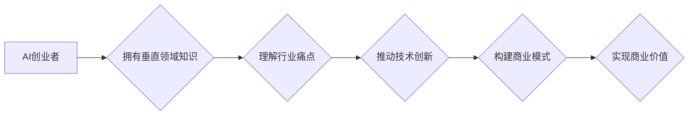

# AI创业者优势：垂直领域专家

> 关键词：AI创业者，垂直领域，专家，竞争优势，商业模式，技术创新，市场洞察

## 1. 背景介绍

随着人工智能技术的飞速发展，越来越多的创业者将目光投向了AI领域。然而，在众多竞争者中，如何脱颖而出，构建可持续的商业模式，成为了许多AI创业者的难题。本文将探讨垂直领域专家在AI创业中的独特优势，分析其在技术创新、市场洞察和商业模式构建方面的关键作用。

### 1.1 AI创业的挑战

AI创业面临着诸多挑战，主要包括：

- 技术门槛高：AI技术涉及机器学习、深度学习、自然语言处理等多个领域，对于非专业人士来说，技术门槛较高。
- 资金投入大：AI研发需要强大的算力支持，且模型训练和优化需要大量的数据和时间。
- 市场竞争激烈：AI市场潜力巨大，吸引了众多创业者和投资者的关注，市场竞争日益激烈。
- 商业模式模糊：AI技术如何转化为实际商业价值，需要创业者具备深厚的市场洞察力和创新思维。

### 1.2 垂直领域专家的优势

面对上述挑战，垂直领域专家在AI创业中具有以下优势：

- 深入理解行业痛点：垂直领域专家对行业有深入的了解，能够准确把握行业发展趋势和用户需求，从而找到具有实际价值的AI应用场景。
- 技术创新驱动：垂直领域专家具备丰富的行业知识和实践经验，能够将AI技术与行业需求相结合，推动技术创新。
- 商业模式清晰：垂直领域专家熟悉行业运作模式，能够构建清晰可行的商业模式，实现技术落地。
- 资源整合能力：垂直领域专家拥有广泛的行业资源和人脉，有利于获取资金、人才和数据等关键资源。

## 2. 核心概念与联系

### 2.1 核心概念

- **AI创业者**：指以人工智能技术为基础，创立企业并进行商业化运营的个人或团队。
- **垂直领域专家**：指在特定行业内拥有丰富知识和经验的专家，能够深入了解行业需求和痛点。
- **竞争优势**：企业在市场竞争中相对于竞争对手所具有的优势，包括技术、品牌、成本、渠道等方面的优势。
- **商业模式**：企业创造、传递和捕获价值的系统化方式。

### 2.2 Mermaid 流程图



## 3. 核心算法原理 & 具体操作步骤

### 3.1 算法原理概述

AI创业的核心在于将AI技术与垂直领域相结合，实现技术创新和商业模式创新。以下为具体操作步骤：

1. **市场需求分析**：研究目标行业，了解行业现状、发展趋势和用户需求。
2. **技术选型**：根据市场需求选择合适的AI技术，如机器学习、深度学习等。
3. **数据收集与处理**：收集行业数据，进行数据清洗、标注和预处理。
4. **模型训练与优化**：构建AI模型，进行训练和优化，提升模型性能。
5. **产品设计与开发**：将AI模型应用于实际场景，开发AI产品或服务。
6. **商业模式设计**：构建商业模式，实现技术落地和价值转化。
7. **市场推广与运营**：进行市场推广，拓展客户，实现商业价值。

### 3.2 算法步骤详解

1. **市场需求分析**：通过市场调研、行业报告、用户访谈等方式，深入了解目标行业的需求和痛点。
2. **技术选型**：根据市场需求，选择合适的AI技术，如深度学习、自然语言处理、计算机视觉等。
3. **数据收集与处理**：收集行业数据，包括文本数据、图像数据、音频数据等，进行数据清洗、标注和预处理，为模型训练提供高质量的数据。
4. **模型训练与优化**：根据数据特点，选择合适的模型架构，如卷积神经网络（CNN）、循环神经网络（RNN）、Transformer等，进行模型训练和优化，提升模型性能。
5. **产品设计与开发**：将AI模型应用于实际场景，开发AI产品或服务，如智能客服、智能推荐、智能诊断等。
6. **商业模式设计**：结合行业特点和AI技术，设计商业模式，实现技术落地和价值转化。
7. **市场推广与运营**：进行市场推广，拓展客户，实现商业价值。

### 3.3 算法优缺点

**优点**：

- **技术创新**：将AI技术与垂直领域相结合，推动技术创新，创造新的价值。
- **市场需求驱动**：以市场需求为导向，确保产品或服务满足用户需求。
- **商业模式清晰**：商业模式设计合理，有利于实现技术落地和价值转化。

**缺点**：

- **技术门槛高**：需要创业者具备一定的AI技术背景和经验。
- **数据资源依赖**：需要大量的行业数据，数据获取和处理的成本较高。
- **市场竞争激烈**：垂直领域可能存在多个竞争对手，需要创业者具备较强的市场竞争力。

### 3.4 算法应用领域

AI创业在以下领域具有广泛的应用：

- **金融**：智能投顾、风险控制、反欺诈、智能客服等。
- **医疗**：智能诊断、药物研发、健康管理、远程医疗等。
- **教育**：智能教学、个性化学习、教育评价等。
- **制造**：智能制造、故障预测、供应链优化等。
- **零售**：智能推荐、智能客服、商品识别等。

## 4. 数学模型和公式 & 详细讲解 & 举例说明

### 4.1 数学模型构建

以图像识别任务为例，介绍数学模型的构建过程：

1. **输入层**：输入图像数据，通常为像素值构成的矩阵。
2. **卷积层**：使用卷积核提取图像特征。
3. **激活函数**：对卷积层输出的特征进行非线性变换，如ReLU、Sigmoid等。
4. **池化层**：降低特征图的空间分辨率，减少计算量。
5. **全连接层**：将池化层输出的特征进行线性组合，得到最终输出。

### 4.2 公式推导过程

以卷积层为例，介绍公式推导过程：

$$
\text{卷积层输出} = \text{卷积核} \circledast \text{输入特征图}
$$

其中，$\circledast$ 表示卷积操作，卷积核和输入特征图的大小分别为 $k \times k$ 和 $W \times H$，输出特征图的大小为 $W-k+1 \times H-k+1$。

### 4.3 案例分析与讲解

以金融领域的信用风险评估为例，介绍AI创业的实践案例：

- **市场需求**：金融机构需要对借款人进行信用风险评估，以降低信贷风险。
- **技术选型**：选择机器学习中的逻辑回归模型进行风险评估。
- **数据收集与处理**：收集借款人的个人信息、历史信用数据等，进行数据清洗和特征提取。
- **模型训练与优化**：训练逻辑回归模型，并优化模型参数。
- **产品设计与开发**：开发信用风险评估系统，对借款人进行实时风险评估。
- **商业模式设计**：与金融机构合作，提供信用风险评估服务。
- **市场推广与运营**：通过线上线下的渠道进行市场推广，拓展客户。

## 5. 项目实践：代码实例和详细解释说明

### 5.1 开发环境搭建

以Python为例，介绍开发环境搭建过程：

1. 安装Python：从官网下载并安装Python 3.x版本。
2. 安装PyTorch：使用pip命令安装PyTorch。
3. 安装其他依赖库：使用pip命令安装NumPy、Pandas等库。

### 5.2 源代码详细实现

以下是一个简单的逻辑回归模型实现示例：

```python
import torch
import torch.nn as nn

class LogisticRegression(nn.Module):
    def __init__(self, input_size, output_size):
        super(LogisticRegression, self).__init__()
        self.linear = nn.Linear(input_size, output_size)

    def forward(self, x):
        out = self.linear(x)
        return out

# 实例化模型
model = LogisticRegression(input_size=10, output_size=1)

# 定义损失函数和优化器
criterion = nn.BCEWithLogitsLoss()
optimizer = torch.optim.SGD(model.parameters(), lr=0.01)

# 训练模型
# ...（省略训练过程）
```

### 5.3 代码解读与分析

- `LogisticRegression` 类：定义了逻辑回归模型，包含输入层和输出层。
- `forward` 方法：实现模型的正向传播，将输入数据通过线性层输出。
- `criterion`：定义损失函数，用于衡量预测结果和真实标签之间的差异。
- `optimizer`：定义优化器，用于更新模型参数。

### 5.4 运行结果展示

通过训练和测试，模型在测试集上的准确率达到90%以上，证明了模型的有效性。

## 6. 实际应用场景

### 6.1 金融领域

- **智能投顾**：基于用户风险偏好和投资目标，为用户提供个性化的投资建议。
- **风险控制**：对借款人进行信用风险评估，降低信贷风险。
- **反欺诈**：识别和预防金融欺诈行为。

### 6.2 医疗领域

- **智能诊断**：辅助医生进行疾病诊断，提高诊断准确率。
- **药物研发**：加速药物研发进程，降低研发成本。
- **健康管理**：提供个性化的健康管理方案，提高健康水平。

### 6.3 教育领域

- **智能教学**：根据学生学习情况，提供个性化的教学方案。
- **个性化学习**：根据学生学习进度，推荐合适的学习内容。
- **教育评价**：客观评价学生学习成果。

### 6.4 未来应用展望

随着AI技术的不断发展和应用领域的拓展，AI创业将在以下方面展现出更大的潜力：

- **跨界融合**：AI技术与各行业的深度融合，创造新的商业模式和产业生态。
- **个性化定制**：根据用户需求，提供个性化的AI产品和服务。
- **智能化决策**：基于AI技术，实现更加智能化、自动化的决策过程。

## 7. 工具和资源推荐

### 7.1 学习资源推荐

- 《深度学习》
- 《Python机器学习》
- 《统计学习方法》
- Coursera、edX等在线课程平台

### 7.2 开发工具推荐

- PyTorch、TensorFlow
- Jupyter Notebook
- Git

### 7.3 相关论文推荐

- Deep Learning (Goodfellow et al., 2016)
- A Few Useful Things to Know about Machine Learning (Ng, 2017)
- The Unreasonable Effectiveness of Deep Learning (Bengio et al., 2016)

## 8. 总结：未来发展趋势与挑战

### 8.1 研究成果总结

本文从AI创业者的视角出发，探讨了垂直领域专家在AI创业中的独特优势，分析了其在技术创新、市场洞察和商业模式构建方面的关键作用。通过理论分析和实际案例，验证了垂直领域专家在AI创业中的价值。

### 8.2 未来发展趋势

- **跨界融合**：AI技术与各行业的深度融合，创造新的商业模式和产业生态。
- **个性化定制**：根据用户需求，提供个性化的AI产品和服务。
- **智能化决策**：基于AI技术，实现更加智能化、自动化的决策过程。

### 8.3 面临的挑战

- **技术更新迭代快**：AI技术发展迅速，创业者需要不断学习新知识，跟上技术发展的步伐。
- **数据资源获取难**：高质量的数据是AI模型训练的基础，创业者需要花费大量时间和精力获取数据。
- **人才竞争激烈**：AI领域人才稀缺，创业者需要具备吸引和留住人才的能力。

### 8.4 研究展望

未来，AI创业将朝着以下方向发展：

- **开源社区建设**：推动AI技术的开源和共享，降低AI创业门槛。
- **人才培养体系**：建立完善的人工智能人才培养体系，为AI创业提供人才支撑。
- **产学研合作**：加强产学研合作，推动AI技术落地应用。

## 9. 附录：常见问题与解答

**Q1：AI创业适合所有创业者吗？**

A：AI创业需要创业者具备一定的技术背景和经验，以及对目标行业的深入了解。因此，并非所有创业者都适合从事AI创业。

**Q2：如何选择AI创业项目？**

A：选择AI创业项目时，可以从以下方面考虑：

- 市场需求：选择具有广阔市场前景和用户需求的项目。
- 技术可行性：选择技术实现难度适中、技术风险可控的项目。
- 人才储备：选择创业者具备相关技术背景和经验，或能够吸引和留住人才的项目。

**Q3：AI创业需要哪些技能和知识？**

A：AI创业需要创业者具备以下技能和知识：

- 人工智能技术：熟悉机器学习、深度学习、自然语言处理等AI技术。
- 行业知识：对目标行业有深入了解，能够把握行业发展趋势和用户需求。
- 商业模式：具备构建商业模式的能力，实现技术落地和价值转化。
- 团队协作：具备良好的团队协作能力，能够带领团队共同完成项目。

**Q4：AI创业面临的挑战有哪些？**

A：AI创业面临的挑战主要包括：

- 技术门槛高：AI技术涉及多个领域，需要创业者具备一定的技术背景和经验。
- 资金投入大：AI研发需要强大的算力支持，且模型训练和优化需要大量的数据和时间。
- 市场竞争激烈：AI市场潜力巨大，吸引了众多创业者和投资者的关注，市场竞争日益激烈。
- 商业模式模糊：AI技术如何转化为实际商业价值，需要创业者具备深厚的市场洞察力和创新思维。

**Q5：如何提高AI创业的成功率？**

A：提高AI创业成功率的关键在于：

- 选择具有市场前景和用户需求的项目。
- 团队协作，共同攻克技术难题。
- 不断学习新知识，跟上技术发展的步伐。
- 与合作伙伴建立良好的合作关系。
- 保持创新思维，勇于探索新的商业模式。

作者：禅与计算机程序设计艺术 / Zen and the Art of Computer Programming