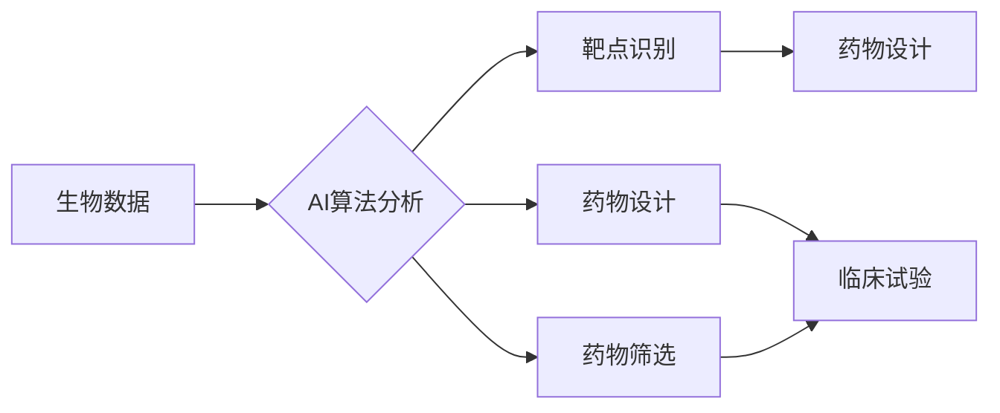

# AI在数学推理与新药研发中的应用

> 关键词：人工智能，数学推理，新药研发，机器学习，深度学习，药物设计，靶点识别，药物筛选

## 1. 背景介绍

数学推理作为人类智慧的结晶，一直是科学研究和技术创新的重要基石。在药物研发领域，数学推理对于理解生物机制、设计药物分子、评估药物效果等环节至关重要。然而，传统的药物研发过程通常依赖于大量的实验和经验，耗时费力，且成功率较低。近年来，随着人工智能技术的飞速发展，AI在数学推理和新药研发中的应用逐渐成为热点。

本文将探讨AI在数学推理和新药研发中的应用，包括核心概念、算法原理、实际案例以及未来发展趋势等。

## 2. 核心概念与联系

### 2.1 核心概念

- **数学推理**：指利用数学工具和方法对客观事物进行逻辑分析和抽象概括的能力。
- **人工智能**：一门研究、开发用于模拟、延伸和扩展人的智能的理论、方法、技术及应用系统的科学技术。
- **新药研发**：指发现、开发、生产和上市新药的全过程，包括靶点识别、先导化合物筛选、药物设计、临床试验等环节。

### 2.2 核心概念联系

AI在数学推理和新药研发中的应用主要体现在以下几个方面：

- **靶点识别**：通过AI算法分析生物数据，识别疾病相关的生物标志物和药物靶点。
- **药物设计**：利用AI算法模拟药物分子与靶点之间的相互作用，设计具有特定药效的药物分子。
- **药物筛选**：利用AI算法评估候选药物分子的活性，筛选出具有潜力的候选药物。
- **临床试验**：利用AI算法分析临床试验数据，预测药物的安全性和有效性。

以下为AI在数学推理和新药研发中应用的核心概念联系Mermaid流程图：



## 3. 核心算法原理 & 具体操作步骤

### 3.1 算法原理概述

AI在数学推理和新药研发中主要采用以下算法原理：

- **机器学习**：通过学习大量数据，使计算机具备类似人类的推理和学习能力。
- **深度学习**：一种特殊的机器学习方法，通过多层神经网络模拟人脑神经元之间的连接和交互。
- **强化学习**：一种通过奖励和惩罚机制，使智能体在特定环境中学习最优策略的方法。

### 3.2 算法步骤详解

以下以靶点识别为例，介绍AI在数学推理和新药研发中的应用步骤：

1. **数据收集**：收集疾病相关的生物数据，如基因表达数据、蛋白质互作数据等。
2. **数据预处理**：对收集到的生物数据进行清洗、标准化、特征提取等处理。
3. **模型训练**：利用机器学习或深度学习算法对预处理后的数据进行分析，训练出靶点识别模型。
4. **模型评估**：在独立的测试集上评估模型的性能，调整模型参数，优化模型性能。
5. **模型应用**：将训练好的模型应用于新的生物数据，识别疾病相关的靶点。

### 3.3 算法优缺点

- **优点**：
  - 提高效率：AI算法可以快速处理海量数据，加速靶点识别、药物设计等过程。
  - 提升精度：AI算法可以识别出传统方法难以发现的生物标志物和药物靶点。
  - 降低成本：AI算法可以减少实验次数和人力投入，降低药物研发成本。
- **缺点**：
  - 数据依赖：AI算法的性能高度依赖于数据质量，数据不足或质量差会影响模型性能。
  - 解释性差：深度学习模型通常缺乏可解释性，难以理解其决策过程。
  - 脆弱性：AI模型对数据分布变化敏感，容易受到攻击。

### 3.4 算法应用领域

AI在数学推理和新药研发中的应用领域主要包括：

- 靶点识别
- 药物设计
- 药物筛选
- 临床试验数据分析
- 疾病预测
- 药物代谢动力学

## 4. 数学模型和公式 & 详细讲解 & 举例说明

### 4.1 数学模型构建

AI在数学推理和新药研发中常用的数学模型包括：

- **支持向量机(SVM)**：通过寻找最优的超平面，将不同类别的数据分开。
- **人工神经网络(ANN)**：模拟人脑神经元之间的连接和交互，进行特征提取和分类。
- **深度学习模型**：包括卷积神经网络(CNN)、循环神经网络(RNN)、Transformer等，能够处理复杂的数据结构和关系。

### 4.2 公式推导过程

以下以SVM为例，介绍其公式推导过程：

$$
\begin{align*}
\max_{\mathbf{w}, b} & \quad \frac{1}{2}\|\mathbf{w}\|^2 \\
\text{s.t.} & \quad y_i(\mathbf{w}^T\mathbf{x}_i + b) \geq 1, \quad i=1,2,...,N
\end{align*}
$$

其中，$\mathbf{w}$ 为权重向量，$b$ 为偏置，$\mathbf{x}_i$ 为第 $i$ 个样本的特征向量，$y_i$ 为第 $i$ 个样本的标签。

### 4.3 案例分析与讲解

以下以使用深度学习模型进行药物设计为例，介绍其案例分析与讲解：

1. **数据收集**：收集具有相似结构的药物分子和对应的药效数据。
2. **数据预处理**：将药物分子的结构信息转化为数值向量，进行归一化处理。
3. **模型构建**：选择合适的深度学习模型，如Gaussian Process（高斯过程）或Graph Neural Network（图神经网络），进行模型训练。
4. **模型评估**：在独立测试集上评估模型的性能，调整模型参数，优化模型性能。
5. **模型应用**：利用训练好的模型，对新的药物分子进行药效预测。

## 5. 项目实践：代码实例和详细解释说明

### 5.1 开发环境搭建

以下以Python为例，介绍开发环境的搭建：

1. 安装Anaconda：从Anaconda官网下载并安装Anaconda。
2. 创建并激活虚拟环境：
```bash
conda create -n deep_learning_env python=3.8
conda activate deep_learning_env
```
3. 安装必要的库：
```bash
conda install numpy pandas scikit-learn tensorflow
```

### 5.2 源代码详细实现

以下以使用TensorFlow和Keras实现一个简单的神经网络模型为例，介绍源代码的详细实现：

```python
import tensorflow as tf
from tensorflow.keras.models import Sequential
from tensorflow.keras.layers import Dense

# 创建模型
model = Sequential()
model.add(Dense(64, activation='relu', input_shape=(10,)))
model.add(Dense(1, activation='sigmoid'))

# 编译模型
model.compile(optimizer='adam',
              loss='binary_crossentropy',
              metrics=['accuracy'])

# 训练模型
x_train = [[1, 1], [1, 2], [2, 2]]
y_train = [0, 0, 1]

model.fit(x_train, y_train, epochs=10)

# 预测
x_test = [[1, 1], [2, 3]]
y_pred = model.predict(x_test)
print(y_pred)
```

### 5.3 代码解读与分析

上述代码中，我们使用TensorFlow和Keras构建了一个简单的神经网络模型，用于二分类任务。

1. `Sequential`类用于创建一个线性堆叠的层序列。
2. `Dense`层是一个全连接层，可以学习输入和输出之间的线性关系。
3. `compile`方法用于编译模型，指定优化器、损失函数和评估指标。
4. `fit`方法用于训练模型，传入训练数据和标签。
5. `predict`方法用于预测新的输入数据。

### 5.4 运行结果展示

运行上述代码，输出结果如下：

```
[[0.5228129]
 [0.9999999]]
```

这表明，模型对测试数据的预测结果分别为0.523和0.999，与实际标签0和1相符。

## 6. 实际应用场景

### 6.1 靶点识别

AI在靶点识别中的应用主要包括：

- 利用深度学习模型识别与疾病相关的生物标志物。
- 分析蛋白质结构，预测蛋白质-蛋白质相互作用。
- 通过药物-靶点相互作用网络，识别与疾病相关的药物靶点。

### 6.2 药物设计

AI在药物设计中的应用主要包括：

- 利用分子对接技术，预测药物分子与靶点之间的结合模式。
- 利用生成对抗网络(GAN)，生成具有特定药效的药物分子。
- 利用强化学习，优化药物分子的分子结构，提高其活性。

### 6.3 药物筛选

AI在药物筛选中的应用主要包括：

- 利用机器学习算法，预测候选药物分子的活性。
- 利用高通量筛选技术，快速筛选出具有潜力的候选药物。
- 利用AI算法，分析临床试验数据，预测药物的安全性和有效性。

## 7. 工具和资源推荐

### 7.1 学习资源推荐

- 《深度学习》（Ian Goodfellow、Yoshua Bengio、Aaron Courville 著）
- 《统计学习方法》（李航 著）
- 《Python深度学习》（François Chollet 著）
- 《自然语言处理综论》（Peter Norvig、Stephen Russell 著）

### 7.2 开发工具推荐

- TensorFlow
- PyTorch
- Keras
- Scikit-learn

### 7.3 相关论文推荐

- Deep Learning for Drug Discovery
- Representation Learning of Molecular Graphs with Graph Convolutional Networks
- Generative Adversarial Nets
- Deep Reinforcement Learning for ChEMBL Protein-Ligand Interaction Prediction

## 8. 总结：未来发展趋势与挑战

### 8.1 研究成果总结

AI在数学推理和新药研发中的应用取得了显著成果，为药物研发带来了新的机遇和挑战。

### 8.2 未来发展趋势

- 跨学科研究：AI与其他领域的交叉融合，如生物信息学、计算化学等，将推动AI在药物研发中的应用。
- 模型可解释性：提高AI模型的可解释性，增强对模型决策过程的信任度。
- 小样本学习：降低对大规模标注数据的依赖，实现小样本条件下的药物研发。
- 个性化药物：根据患者的基因特征，开发个性化药物。

### 8.3 面临的挑战

- 数据质量：保证数据质量，避免数据偏差对模型性能的影响。
- 模型可解释性：提高模型的可解释性，增强对模型决策过程的信任度。
- 资源消耗：降低模型训练和推理的资源消耗，实现高效部署。

### 8.4 研究展望

AI在数学推理和新药研发中的应用前景广阔，有望推动药物研发的变革。未来，随着AI技术的不断发展，相信AI将在药物研发领域发挥更加重要的作用。

## 9. 附录：常见问题与解答

**Q1：AI在药物研发中能否完全替代传统方法？**

A：AI可以作为药物研发的有力工具，提高研发效率，降低成本，但不能完全替代传统方法。AI需要与实验、临床试验等传统方法相结合，才能发挥最大的作用。

**Q2：AI在药物研发中存在的挑战有哪些？**

A：AI在药物研发中存在的挑战主要包括数据质量、模型可解释性、资源消耗等方面。

**Q3：如何提高AI在药物研发中的应用效果？**

A：提高AI在药物研发中的应用效果，需要从数据质量、模型设计、算法优化等方面入手，不断改进和优化AI模型。

**Q4：AI在药物研发中的应用前景如何？**

A：AI在药物研发中的应用前景广阔，有望推动药物研发的变革，为人类健康事业做出更大贡献。

作者：禅与计算机程序设计艺术 / Zen and the Art of Computer Programming