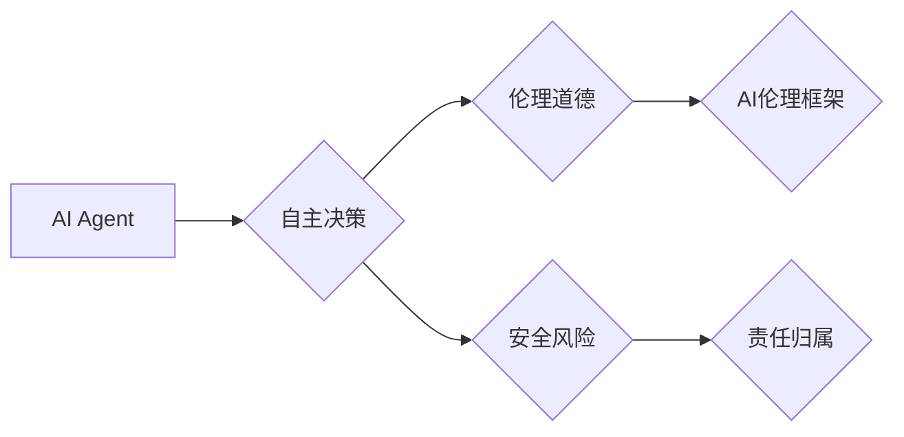

# AI Agent: AI的下一个风口 自主决策与人类的伦理界限

> 关键词：AI Agent, 人工智能代理, 自主决策, 伦理学, 人工智能伦理, AI伦理框架, 机器人道德规范

## 1. 背景介绍

随着人工智能技术的飞速发展，AI Agent——能够自主决策的智能实体，逐渐成为科技界关注的焦点。AI Agent具备处理复杂任务的能力，从自动驾驶汽车到智能客服，从智能家庭助手到工业自动化控制，AI Agent的应用场景正在不断扩展。然而，随着AI Agent的自主性增强，如何确保其决策的道德性和透明性，成为了一个亟待解决的问题。本文将探讨AI Agent的核心概念、算法原理、伦理挑战以及未来发展趋势。

### 1.1 问题的由来

AI Agent的概念起源于人工智能领域，它是指能够执行特定任务并做出自主决策的智能实体。随着深度学习、强化学习等技术的突破，AI Agent的智能水平得到了显著提升。然而，随着AI Agent的自主决策能力增强，以下问题逐渐凸显：

- **伦理挑战**：AI Agent的决策过程是否公正、透明、符合伦理道德？
- **责任归属**：当AI Agent的决策导致不良后果时，责任应由谁承担？
- **安全风险**：AI Agent的决策是否会带来不可预见的安全风险？
- **技术限制**：如何确保AI Agent在复杂动态环境中做出合理决策？

### 1.2 研究现状

目前，AI Agent的研究主要集中在以下几个方面：

- **算法研究**：研究能够实现自主决策的算法，如强化学习、规划算法等。
- **伦理研究**：探讨AI Agent的伦理道德规范，建立AI伦理框架。
- **法律研究**：研究AI Agent的法律地位和责任归属问题。
- **安全研究**：研究AI Agent的安全风险评估和防范措施。

### 1.3 研究意义

研究AI Agent的自主决策与伦理界限，对于以下方面具有重要意义：

- **确保AI Agent的道德性**：确保AI Agent的决策符合伦理道德，避免造成负面影响。
- **明确责任归属**：明确AI Agent的决策责任，为潜在的法律纠纷提供解决方案。
- **保障安全风险**：降低AI Agent带来的安全风险，提高社会安全水平。
- **推动技术发展**：促进AI技术的发展，为构建智能社会奠定基础。

## 2. 核心概念与联系

为了更好地理解AI Agent的自主决策与伦理界限，本节将介绍几个核心概念及其相互关系。

### 2.1 AI Agent

AI Agent是指能够执行特定任务并做出自主决策的智能实体。它通常由感知器、控制器和执行器组成。感知器负责收集环境信息，控制器根据感知信息进行决策，执行器根据决策执行相应的动作。

### 2.2 自主决策

自主决策是指AI Agent在不受外界直接控制的情况下，根据自身目标和环境信息进行决策的过程。自主决策是AI Agent区别于传统软件系统的关键特征。

### 2.3 伦理道德

伦理道德是指人们在社会生活中遵循的道德规范和行为准则。在AI Agent领域，伦理道德关注AI Agent的决策是否公正、透明、符合伦理道德。

### 2.4 AI伦理框架

AI伦理框架是指一套规范AI Agent设计和应用的伦理原则和标准。AI伦理框架旨在确保AI Agent的决策符合伦理道德，降低潜在的风险和负面影响。

### 2.5 Mermaid 流程图

以下是AI Agent核心概念之间的Mermaid流程图：



从流程图中可以看出，AI Agent的核心概念包括自主决策、伦理道德和AI伦理框架，同时还需要考虑安全风险和责任归属问题。

## 3. 核心算法原理 & 具体操作步骤

### 3.1 算法原理概述

AI Agent的自主决策通常基于以下几种算法：

- **强化学习**：通过与环境交互学习最优策略，使Agent能够在特定环境中做出最优决策。
- **规划算法**：根据目标和约束条件，生成一系列动作序列，使Agent能够达到目标。
- **决策树**：根据输入条件，选择最优的行动方案。

### 3.2 算法步骤详解

以下以强化学习为例，介绍AI Agent的算法步骤：

1. **定义环境**：明确Agent所处的环境，包括状态空间、动作空间、奖励函数等。
2. **选择学习算法**：选择合适的强化学习算法，如Q-learning、SARSA等。
3. **初始化参数**：初始化学习算法的参数，如Q值表、策略参数等。
4. **训练过程**：Agent在环境中与环境进行交互，根据学习算法更新参数，优化决策策略。
5. **评估与优化**：评估Agent的决策效果，根据评估结果优化模型参数和策略。

### 3.3 算法优缺点

- **强化学习**：能够学习到复杂的决策策略，但训练过程可能需要大量时间和数据。
- **规划算法**：能够生成一系列动作序列，但难以处理高维状态空间。
- **决策树**：简单易懂，但难以处理复杂决策问题。

### 3.4 算法应用领域

- **强化学习**：游戏、自动驾驶、机器人控制等领域。
- **规划算法**：路径规划、任务规划等领域。
- **决策树**：推荐系统、分类等领域。

## 4. 数学模型和公式 & 详细讲解 & 举例说明

### 4.1 数学模型构建

AI Agent的数学模型通常包括状态空间、动作空间、奖励函数和决策策略。

- **状态空间**：描述Agent所处的环境状态，用 $S$ 表示。
- **动作空间**：描述Agent可执行的动作集合，用 $A$ 表示。
- **奖励函数**：描述Agent执行动作后获得的奖励，用 $R(s,a)$ 表示。
- **决策策略**：描述Agent如何根据状态选择动作，用 $\pi(s)$ 表示。

### 4.2 公式推导过程

以下以Q-learning为例，介绍强化学习中的数学模型和公式推导过程。

- **Q值表**：描述Agent在状态 $s$ 下执行动作 $a$ 的预期奖励，用 $Q(s,a)$ 表示。
- **Q-learning更新公式**：

$$
Q(s,a) \leftarrow Q(s,a) + \alpha [R(s,a) + \gamma \max_{a'} Q(s',a') - Q(s,a)]
$$

其中 $\alpha$ 为学习率，$\gamma$ 为折扣因子。

### 4.3 案例分析与讲解

以下以自动驾驶为例，分析AI Agent在自动驾驶场景下的决策过程。

- **状态空间**：描述车辆的位置、速度、方向等信息。
- **动作空间**：描述车辆的加减速、转向等动作。
- **奖励函数**：根据车辆行驶的轨迹、速度、碰撞等因素计算奖励。
- **决策策略**：使用Q-learning算法，根据状态选择最优动作。

## 5. 项目实践：代码实例和详细解释说明

### 5.1 开发环境搭建

以下是使用Python和TensorFlow实现Q-learning算法的代码示例。

```python
import tensorflow as tf

# 定义状态空间、动作空间和奖励函数
state_space = [0, 0, 0]  # 车辆位置、速度、方向
action_space = [1, 2, 3, 4]  # 加速、减速、左转、右转
reward_function = lambda s, a: ...

# 初始化Q值表
Q = tf.Variable(tf.zeros([len(state_space), len(action_space)]))

# 定义Q-learning更新操作
def update_Q(s, a, r, next_s):
    Q_update = Q.assign_add(tf.GradientTape().gradient(lambda q: -r + gamma * tf.reduce_max(Q(next_s)), Q))
    return Q_update

# 训练过程
for episode in range(num_episodes):
    s = ...
    while True:
        a = ...
        r = ...
        next_s = ...
        update_Q(s, a, r, next_s)
        s = next_s
```

### 5.2 源代码详细实现

以下是完整的Q-learning算法实现代码：

```python
import tensorflow as tf

# 定义状态空间、动作空间和奖励函数
state_space = [0, 0, 0]  # 车辆位置、速度、方向
action_space = [1, 2, 3, 4]  # 加速、减速、左转、右转
reward_function = lambda s, a: ...

# 初始化Q值表
Q = tf.Variable(tf.zeros([len(state_space), len(action_space)]))

# 定义Q-learning更新操作
def update_Q(s, a, r, next_s):
    with tf.GradientTape() as tape:
        q_current = tape.watch(Q)
        q_current = tf.gather_nd(q_current, [s, a])
        q_next = tf.reduce_max(Q[next_s], axis=1)
        loss = -r + gamma * q_next
    gradients = tape.gradient(loss, q_current)
    return Q.assign_sub(gradients)

# 训练过程
for episode in range(num_episodes):
    s = ...
    while True:
        a = ...
        r = ...
        next_s = ...
        update_Q(s, a, r, next_s)
        s = next_s
```

### 5.3 代码解读与分析

以上代码实现了Q-learning算法的核心功能，包括初始化Q值表、更新Q值、训练过程等。

- `state_space` 和 `action_space` 分别定义了状态空间和动作空间。
- `reward_function` 定义了奖励函数，根据车辆行驶的轨迹、速度、碰撞等因素计算奖励。
- `Q` 为Q值表，使用TensorFlow的变量进行封装。
- `update_Q` 为Q值更新操作，通过自动微分技术计算梯度并更新Q值。
- `for` 循环实现了训练过程，包括初始化状态、选择动作、获取奖励、更新Q值等步骤。

### 5.4 运行结果展示

运行以上代码，可以得到Q值表和最终的决策策略。根据Q值表，可以分析Agent在各个状态下的最优动作，从而指导车辆行驶。

## 6. 实际应用场景

### 6.1 自动驾驶

自动驾驶是AI Agent应用最广泛的领域之一。通过在车辆上部署AI Agent，可以实现自动驾驶、自动泊车、车道保持等功能。

### 6.2 机器人控制

AI Agent在机器人控制领域也有广泛的应用，如工业机器人、服务机器人等。

### 6.3 智能家居

AI Agent可以应用于智能家居系统，实现智能灯光、温度调节、安防监控等功能。

### 6.4 未来应用展望

随着AI Agent技术的不断发展，未来将在更多领域得到应用，如：

- 智能医疗
- 智能金融
- 智能教育
- 智能城市

## 7. 工具和资源推荐

### 7.1 学习资源推荐

- 《深度学习》系列书籍：介绍深度学习基础和算法，适合入门学习。
- 《强化学习》系列书籍：介绍强化学习原理和应用，适合进阶学习。
- 《Python深度学习》书籍：介绍使用Python进行深度学习开发，适合实践应用。

### 7.2 开发工具推荐

- TensorFlow：开源的深度学习框架，适用于开发AI Agent。
- PyTorch：开源的深度学习框架，适用于开发AI Agent。
- OpenAI Gym：开源的强化学习环境，提供丰富的机器人控制、强化学习等场景。

### 7.3 相关论文推荐

- 《Deep Reinforcement Learning》
- 《Human-level control through deep reinforcement learning》
- 《Policy Gradient Methods for Reinforcement Learning》

## 8. 总结：未来发展趋势与挑战

### 8.1 研究成果总结

本文对AI Agent的核心概念、算法原理、伦理挑战以及未来发展趋势进行了全面探讨。通过介绍强化学习、规划算法等算法原理，以及Q-learning、规划算法等具体操作步骤，为读者提供了AI Agent开发的基本知识。同时，本文还强调了AI Agent的伦理道德问题，并介绍了AI伦理框架和机器人道德规范。

### 8.2 未来发展趋势

未来AI Agent技术将呈现以下发展趋势：

- **算法研究**：开发更加高效、鲁棒的强化学习、规划算法等。
- **伦理研究**：建立更加完善的人工智能伦理框架，确保AI Agent的道德性。
- **安全研究**：研究AI Agent的安全风险评估和防范措施，降低安全风险。
- **应用研究**：将AI Agent应用于更多领域，如医疗、金融、教育等。

### 8.3 面临的挑战

AI Agent技术在未来发展中将面临以下挑战：

- **算法复杂度**：设计更加高效、鲁棒的算法，以应对复杂动态环境。
- **伦理道德**：建立普遍适用的AI伦理框架，确保AI Agent的道德性。
- **安全风险**：研究AI Agent的安全风险评估和防范措施，降低安全风险。
- **技术普及**：降低AI Agent的开发门槛，促进其在更多领域的应用。

### 8.4 研究展望

未来，AI Agent技术将在以下方面取得突破：

- **跨领域迁移**：使AI Agent能够在不同领域之间进行迁移，提高其泛化能力。
- **多智能体协同**：使多个AI Agent能够协同工作，完成复杂任务。
- **人机协同**：使AI Agent能够与人类协同工作，提高人类的工作效率。

## 9. 附录：常见问题与解答

**Q1：AI Agent的伦理道德问题如何解决？**

A1：解决AI Agent的伦理道德问题需要从多个层面入手，包括：

- 建立AI伦理框架，明确AI Agent的道德规范和行为准则。
- 在算法设计过程中，将伦理道德因素纳入考虑范围。
- 对AI Agent的决策过程进行透明化，便于监督和评估。
- 加强AI伦理教育，提高公众的AI伦理意识。

**Q2：如何评估AI Agent的决策能力？**

A2：评估AI Agent的决策能力可以从以下几个方面进行：

- 评估AI Agent在不同环境下的决策效果。
- 评估AI Agent的决策效率，如决策速度、资源消耗等。
- 评估AI Agent的决策鲁棒性，如面对不确定性和异常情况的能力。

**Q3：AI Agent在自动驾驶中的应用有哪些？**

A3：AI Agent在自动驾驶中的应用主要包括：

- 车辆控制：控制车辆的加减速、转向等动作。
- 车道保持：保持车辆在车道内行驶。
- 避障：检测和避开障碍物。
- 信号识别：识别交通信号、行人、其他车辆等。

**Q4：如何降低AI Agent的安全风险？**

A4：降低AI Agent的安全风险可以从以下几个方面进行：

- 对AI Agent进行安全风险评估，识别潜在风险点。
- 设计安全机制，如紧急停止、安全协议等，降低安全风险。
- 加强AI Agent的鲁棒性，提高其对异常情况的应对能力。
- 建立AI Agent的监控和审计机制，及时发现和处理安全问题。

**Q5：如何提高AI Agent的泛化能力？**

A5：提高AI Agent的泛化能力可以从以下几个方面进行：

- 收集更多样化的数据，提高模型的泛化能力。
- 使用迁移学习技术，将其他领域的学习经验应用于当前领域。
- 设计更加鲁棒的算法，提高模型在不同环境下的适应能力。

作者：禅与计算机程序设计艺术 / Zen and the Art of Computer Programming