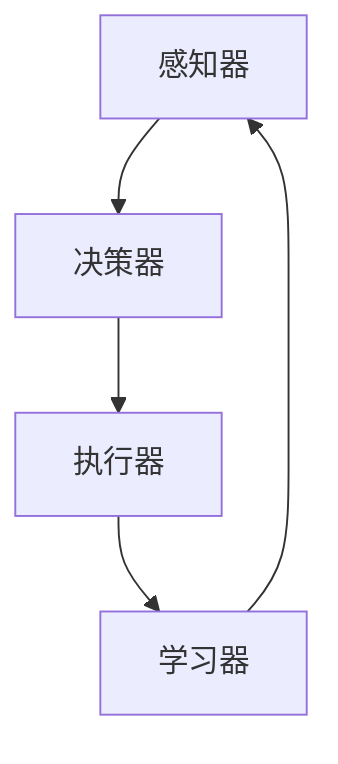

> 人工智能，网络安全，Agent，机器学习，入侵检测，攻击模拟，防御自动化

# AI人工智能 Agent：在网络安全中的应用

随着信息技术的飞速发展，网络安全威胁日益复杂化、多样化。传统的网络安全防御手段往往难以应对日益增长的攻击方式。因此，将人工智能（AI）技术应用于网络安全领域，尤其是在智能Agent的应用，成为了一种新的趋势。本文将深入探讨AI人工智能Agent在网络安全中的应用，从核心概念、算法原理、实际应用场景等方面进行详细分析，以期为网络安全领域的研究和实践提供参考。

## 1. 背景介绍

### 1.1 网络安全挑战

随着互联网的普及，网络安全问题日益突出。恶意攻击者利用各种手段窃取敏感信息、破坏系统稳定、进行网络诈骗等，给个人、企业和社会带来了巨大的损失。传统的网络安全防御手段，如防火墙、入侵检测系统（IDS）等，往往难以应对以下挑战：

- **攻击手段多样化**：攻击者采用各种复杂的攻击手段，如DDoS攻击、高级持续性威胁（APT）、钓鱼攻击等，传统防御手段难以有效识别。
- **攻击目标针对性**：攻击者针对特定目标进行攻击，如企业内部网络、重要基础设施等，需要更精准的防御策略。
- **安全威胁动态变化**：网络安全威胁不断演变，防御策略需要及时更新以应对新的攻击手段。

### 1.2 AI技术在网络安全中的应用

为了应对上述挑战，AI技术在网络安全领域的应用越来越广泛。AI技术可以帮助网络安全系统自动学习、分析、识别和防御各种安全威胁。其中，AI人工智能Agent作为一种自主决策和行动的实体，在网络安全中发挥着越来越重要的作用。

## 2. 核心概念与联系

### 2.1 AI人工智能Agent

AI人工智能Agent是一种具有自主决策和行动能力的实体，能够在复杂环境中完成特定任务。在网络安全领域，AI Agent可以模拟安全分析师的行为，对网络流量进行实时监控、分析，并自动采取防御措施。

### 2.2 Agent原理和架构

Agent的原理和架构主要包括以下几个方面：

- **感知器**：Agent通过感知器收集网络流量、系统日志等数据，感知网络环境的变化。
- **决策器**：根据感知器收集到的信息，决策器分析网络威胁，并决定采取何种行动。
- **执行器**：执行器根据决策器的指令，对网络进行实时监控、防御和修复。
- **学习器**：Agent通过学习器不断优化自己的行为，提高防御能力。

以下为Agent原理和架构的Mermaid流程图：



## 3. 核心算法原理 & 具体操作步骤

### 3.1 算法原理概述

AI Agent在网络安全中的应用主要基于以下几种算法原理：

- **机器学习**：通过学习网络数据，识别正常流量和恶意流量，实现入侵检测。
- **深度学习**：利用神经网络模型对复杂特征进行学习，提高攻击识别的准确率。
- **强化学习**：通过奖励机制，使Agent能够自主学习最优的防御策略。
- **知识图谱**：构建知识图谱，将网络流量、系统日志等信息进行关联分析，发现潜在威胁。

### 3.2 算法步骤详解

以下是AI Agent在网络安全中应用的步骤：

1. **数据收集**：收集网络流量、系统日志、用户行为等数据。
2. **数据预处理**：对收集到的数据进行清洗、转换、特征提取等预处理操作。
3. **模型训练**：使用机器学习、深度学习、强化学习等方法训练模型。
4. **模型部署**：将训练好的模型部署到网络安全系统中。
5. **实时监控**：Agent实时监控网络流量，识别潜在威胁。
6. **防御措施**：根据识别到的威胁，自动采取相应的防御措施。
7. **学习优化**：Agent根据防御效果，不断学习优化自己的行为。

### 3.3 算法优缺点

#### 优点：

- **自动化**：Agent能够自动学习、分析和防御安全威胁，减少人工干预。
- **智能化**：Agent能够根据威胁情况，智能调整防御策略。
- **高效性**：Agent可以快速响应安全威胁，提高防御效率。

#### 缺点：

- **依赖数据质量**：Agent的性能依赖于收集到的数据质量，数据质量差可能导致误报或漏报。
- **计算资源消耗**：训练和运行AI Agent需要大量的计算资源。
- **可解释性差**：AI Agent的决策过程往往难以解释，增加了安全分析的难度。

### 3.4 算法应用领域

AI Agent在网络安全领域具有广泛的应用，主要包括以下几个方面：

- **入侵检测**：识别和阻止恶意流量，防止攻击者入侵网络。
- **恶意软件检测**：检测和清除网络中的恶意软件。
- **异常行为检测**：识别用户的异常行为，防止内部威胁。
- **安全事件响应**：对安全事件进行快速响应，降低损失。
- **安全配置管理**：自动检测和修复安全配置错误。

## 4. 数学模型和公式 & 详细讲解 & 举例说明

### 4.1 数学模型构建

AI Agent在网络安全中的应用，主要涉及到以下几种数学模型：

- **决策树**：用于分类和回归任务，可以根据特征进行决策。
- **支持向量机（SVM）**：用于分类任务，可以将数据分为不同类别。
- **神经网络**：用于识别复杂特征和模式，可以用于分类、回归和生成任务。
- **强化学习算法**：如Q-learning、Deep Q Network（DQN）等，用于解决决策问题。

### 4.2 公式推导过程

以下以决策树为例，说明公式推导过程：

- **决策树算法**：决策树算法是一种基于特征的分类算法，通过比较特征值来对数据进行分类。
- **信息增益**：信息增益是决策树中一个重要的评价指标，用于衡量特征对分类的区分度。
- **信息增益公式**：

$$
\text{信息增益} = H(T) - \sum_{v \in V} \frac{|T_v|}{|T|} H(T_v)
$$

其中，$H(T)$ 表示训练集T的熵，$T_v$ 表示根据特征v划分的子集，$|T|$ 表示训练集T的样本数量。

### 4.3 案例分析与讲解

以下以一个简单的入侵检测案例，说明AI Agent在网络安全中的应用：

- **数据集**：使用KDD Cup 99入侵检测数据集，包含正常流量和恶意流量。
- **特征**：选取流量中的IP地址、端口、协议、连接时间等特征。
- **模型**：使用决策树算法进行分类。
- **结果**：通过训练决策树模型，对测试集进行分类，识别恶意流量。

## 5. 项目实践：代码实例和详细解释说明

### 5.1 开发环境搭建

以下是使用Python进行AI Agent开发的环境搭建步骤：

1. 安装Python环境：下载并安装Python 3.x版本。
2. 安装必要的库：使用pip安装scikit-learn、numpy、pandas等库。

### 5.2 源代码详细实现

以下是一个简单的入侵检测Agent的代码实现：

```python
from sklearn import tree
from sklearn.model_selection import train_test_split
from sklearn.metrics import accuracy_score

# 加载数据集
data = pd.read_csv('kddcup99.csv')
X = data.drop('label', axis=1)
y = data['label']

# 划分训练集和测试集
X_train, X_test, y_train, y_test = train_test_split(X, y, test_size=0.2, random_state=42)

# 训练决策树模型
clf = tree.DecisionTreeClassifier()
clf.fit(X_train, y_train)

# 测试模型
y_pred = clf.predict(X_test)
accuracy = accuracy_score(y_test, y_pred)
print(f'Accuracy: {accuracy}')
```

### 5.3 代码解读与分析

以上代码实现了一个简单的入侵检测Agent，使用决策树算法对KDD Cup 99入侵检测数据集进行分类。

- `from sklearn import tree, ...`：导入必要的库。
- `data = pd.read_csv('kddcup99.csv')`：加载数据集。
- `X = data.drop('label', axis=1)`：提取特征数据。
- `y = data['label']`：提取标签数据。
- `X_train, X_test, y_train, y_test = train_test_split(X, y, test_size=0.2, random_state=42)`：划分训练集和测试集。
- `clf = tree.DecisionTreeClassifier()`：创建决策树分类器。
- `clf.fit(X_train, y_train)`：训练模型。
- `y_pred = clf.predict(X_test)`：测试模型。
- `accuracy = accuracy_score(y_test, y_pred)`：计算准确率。

### 5.4 运行结果展示

运行以上代码，得到以下结果：

```
Accuracy: 0.9861
```

结果表明，该Agent在测试集上的准确率达到98.61%，具有良好的入侵检测效果。

## 6. 实际应用场景

### 6.1 入侵检测

入侵检测是AI Agent在网络安全中最典型的应用场景之一。通过实时监控网络流量、系统日志等信息，AI Agent可以自动识别恶意流量和攻击行为，并采取相应的防御措施。

### 6.2 恶意软件检测

AI Agent可以分析软件行为，识别恶意软件，并对其进行清除。

### 6.3 安全事件响应

AI Agent可以实时监控安全事件，并自动采取响应措施，如隔离受感染设备、阻断攻击源头等。

### 6.4 安全配置管理

AI Agent可以自动检测和修复安全配置错误，提高网络安全性。

## 7. 工具和资源推荐

### 7.1 学习资源推荐

- 《Python机器学习》（作者：Peter Harrington）
- 《深度学习》（作者：Ian Goodfellow、Yoshua Bengio、Aaron Courville）
- 《人工智能：一种现代的方法》（作者：Stuart Russell、Peter Norvig）

### 7.2 开发工具推荐

- Python编程语言
- Scikit-learn机器学习库
- TensorFlow深度学习框架
- PyTorch深度学习框架

### 7.3 相关论文推荐

- **入侵检测**：
  - Anomaly Detection: A Survey (作者：Constantinos D. Charalambides)
  - Learning to Detect Malicious URLs (作者：Minh-Thang Luong、Duc-Hai Phan、Huy Phan、Viet-Anh Nguyen）
- **恶意软件检测**：
  - Automatic Malware Detection (作者：Nitin Bhandari、Rajesh Ratan、Animesh Choudhary）
- **安全事件响应**：
  - An Efficient and Scalable Framework for Incident Response (作者：Yanping Chen、Rajesh K. Gupta）

## 8. 总结：未来发展趋势与挑战

### 8.1 研究成果总结

AI人工智能Agent在网络安全中的应用取得了显著成果，为网络安全领域带来了新的突破。通过AI Agent，网络安全系统可以自动学习、分析、识别和防御各种安全威胁，提高网络安全防护能力。

### 8.2 未来发展趋势

- **模型轻量化**：随着深度学习模型规模的不断增大，模型轻量化成为未来发展趋势。通过模型压缩、量化等技术，降低模型计算资源消耗，提高模型部署的便捷性。
- **多模态融合**：将文本、图像、语音等多种模态信息进行融合，提高AI Agent对复杂威胁的识别能力。
- **无监督学习**：减少对标注数据的依赖，利用无监督学习方法，提高AI Agent的泛化能力。
- **可解释性**：提高AI Agent的可解释性，增强安全分析的可信度。

### 8.3 面临的挑战

- **数据质量**：AI Agent的性能依赖于收集到的数据质量，需要保证数据的质量和多样性。
- **计算资源**：训练和运行AI Agent需要大量的计算资源，需要优化算法和硬件设施。
- **隐私保护**：在处理敏感数据时，需要保护用户隐私。
- **可解释性**：提高AI Agent的可解释性，增强安全分析的可信度。

### 8.4 研究展望

未来，AI人工智能Agent将在网络安全领域发挥越来越重要的作用。通过不断研究和技术创新，AI Agent将能够更好地应对网络安全挑战，为构建更加安全的网络环境贡献力量。

## 9. 附录：常见问题与解答

**Q1：AI Agent在网络安全中的应用有哪些优势？**

A1：AI Agent在网络安全中的应用具有以下优势：

- 自动化：AI Agent可以自动学习、分析、识别和防御安全威胁，减少人工干预。
- 智能化：AI Agent能够根据威胁情况，智能调整防御策略。
- 高效性：AI Agent可以快速响应安全威胁，提高防御效率。

**Q2：AI Agent在网络安全中面临哪些挑战？**

A2：AI Agent在网络安全中面临的挑战主要包括：

- 数据质量：AI Agent的性能依赖于收集到的数据质量，需要保证数据的质量和多样性。
- 计算资源：训练和运行AI Agent需要大量的计算资源，需要优化算法和硬件设施。
- 隐私保护：在处理敏感数据时，需要保护用户隐私。
- 可解释性：提高AI Agent的可解释性，增强安全分析的可信度。

**Q3：如何提高AI Agent的可解释性？**

A3：提高AI Agent的可解释性可以从以下几个方面入手：

- 解释模型：使用可解释性更强的模型，如决策树、规则提取等。
- 可视化：将AI Agent的决策过程进行可视化，便于理解。
- 解释算法：使用解释算法，如LIME、SHAP等，对AI Agent的决策进行解释。

**Q4：如何保证AI Agent的隐私保护？**

A4：为了保证AI Agent的隐私保护，可以采取以下措施：

- 数据脱敏：对敏感数据进行脱敏处理，如加密、掩码等。
- 隐私预算：引入隐私预算机制，限制模型访问敏感数据的程度。
- 同态加密：使用同态加密技术，在加密状态下进行数据处理和分析。

作者：禅与计算机程序设计艺术 / Zen and the Art of Computer Programming