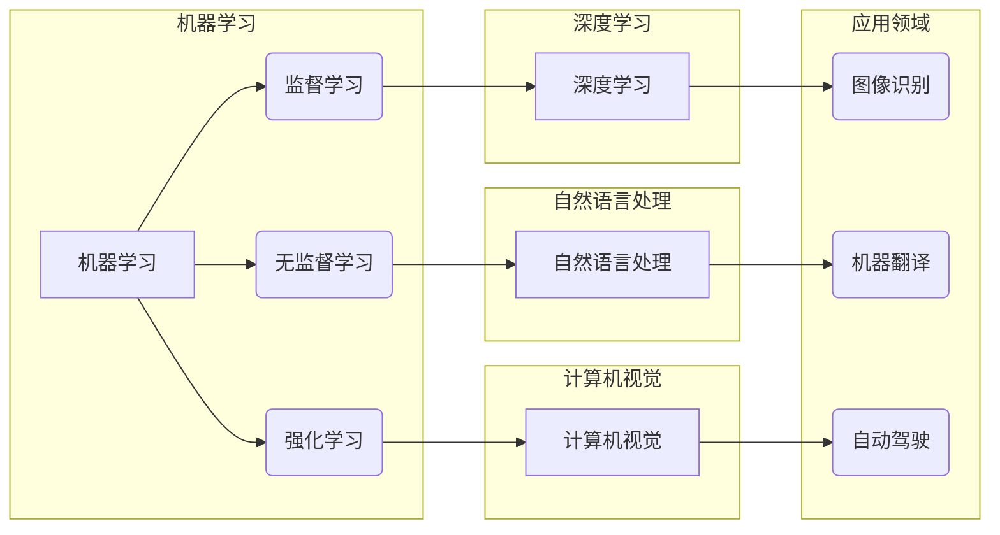

# AI技术趋势与应用场景的结合

> 关键词：人工智能，技术趋势，应用场景，机器学习，深度学习，自然语言处理，计算机视觉，智能决策

## 1. 背景介绍

随着计算机科学和技术的飞速发展，人工智能（AI）已经成为当今科技领域的热点。从早期的专家系统到现在的深度学习，AI技术在多个领域取得了显著的成果。然而，如何将AI技术有效地应用于实际问题中，实现技术趋势与应用场景的结合，成为当前研究和开发的关键问题。

### 1.1 AI技术发展的历史与现状

人工智能的发展经历了多个阶段，包括早期的符号主义、连接主义和进化计算。近年来，随着大数据、云计算和计算能力的提升，深度学习等新型算法的兴起，AI技术进入了一个新的发展阶段。目前，AI技术在图像识别、自然语言处理、智能决策等领域取得了突破性进展。

### 1.2 AI技术应用的挑战

尽管AI技术取得了显著成果，但在实际应用中仍面临诸多挑战，主要包括：

- 数据质量与可用性：高质量的训练数据是AI模型性能的基础，但获取高质量数据往往成本高昂。
- 模型解释性：许多AI模型，尤其是深度学习模型，缺乏可解释性，难以理解其决策过程。
- 模型泛化能力：AI模型在训练数据上表现良好，但在新数据上可能表现不佳，即泛化能力不足。
- 道德和伦理问题：AI技术的应用可能会引发隐私、歧视等道德和伦理问题。

## 2. 核心概念与联系

为了更好地理解AI技术趋势与应用场景的结合，我们需要了解以下几个核心概念：

### 2.1 机器学习

机器学习是AI技术的基础，它使计算机能够从数据中学习并做出决策。机器学习可以分为监督学习、无监督学习和强化学习。

### 2.2 深度学习

深度学习是机器学习的一个子领域，它使用多层神经网络模拟人脑处理信息的方式。深度学习在图像识别、自然语言处理等领域取得了显著成果。

### 2.3 自然语言处理

自然语言处理是AI技术在语言领域的应用，它使计算机能够理解、解释和生成人类语言。自然语言处理在机器翻译、语音识别、情感分析等领域发挥着重要作用。

### 2.4 计算机视觉

计算机视觉是AI技术在图像和视频领域的应用，它使计算机能够识别、理解和分析图像和视频中的内容。计算机视觉在自动驾驶、人脸识别、医学影像分析等领域有着广泛的应用。

### 2.5 Mermaid 流程图

以下是一个Mermaid流程图，展示了上述核心概念之间的联系：



## 3. 核心算法原理 & 具体操作步骤

### 3.1 算法原理概述

AI技术的核心算法主要包括：

- 神经网络：由多个神经元组成的计算模型，用于特征提取和分类。
- 随机梯度下降（SGD）：一种优化算法，用于训练神经网络。
- 生成对抗网络（GAN）：一种对抗性训练方法，用于生成逼真的数据。
- 支持向量机（SVM）：一种分类算法，用于分类数据。

### 3.2 算法步骤详解

以下是使用神经网络进行图像分类的基本步骤：

1. 数据预处理：对图像数据进行缩放、裁剪等处理。
2. 构建神经网络模型：选择合适的网络结构，如卷积神经网络（CNN）。
3. 训练模型：使用训练数据对模型进行训练，调整网络参数。
4. 验证和测试：使用验证集和测试集评估模型性能。
5. 部署模型：将训练好的模型部署到实际应用中。

### 3.3 算法优缺点

以下是几种常见AI算法的优缺点：

- 神经网络：优点是能够自动提取特征，缺点是计算复杂度高，难以解释。
- 随机梯度下降：优点是收敛速度快，缺点是容易陷入局部最优。
- 生成对抗网络：优点是能够生成逼真的数据，缺点是训练过程不稳定。
- 支持向量机：优点是泛化能力强，缺点是计算复杂度高，难以处理非线性问题。

### 3.4 算法应用领域

AI算法在各个领域都有广泛的应用，以下是一些例子：

- 图像识别：人脸识别、物体检测、医学影像分析。
- 自然语言处理：机器翻译、情感分析、文本摘要。
- 计算机视觉：自动驾驶、视频监控、机器人视觉。

## 4. 数学模型和公式 & 详细讲解 & 举例说明

### 4.1 数学模型构建

以下是神经网络中常用的数学模型：

- 神经元模型：$y = \sigma(\sum_{j=1}^n w_{ij}x_j + b_i)$
- 损失函数：交叉熵损失、均方误差等。

### 4.2 公式推导过程

以下是一个简单的交叉熵损失函数的推导过程：

$$
L(y, \hat{y}) = -\sum_{i=1}^N y_i \log \hat{y}_i
$$

其中 $y$ 是真实标签，$\hat{y}$ 是模型预测概率。

### 4.3 案例分析与讲解

以下是一个使用神经网络进行图像分类的案例：

```python
import torch
import torch.nn as nn
import torchvision.transforms as transforms
import torchvision.datasets as datasets
import torch.optim as optim

# 数据预处理
transform = transforms.Compose([
    transforms.Resize((64, 64)),
    transforms.ToTensor(),
])

train_dataset = datasets.CIFAR10(root='./data', train=True, download=True, transform=transform)
train_loader = torch.utils.data.DataLoader(train_dataset, batch_size=4, shuffle=True)

# 构建神经网络模型
class Net(nn.Module):
    def __init__(self):
        super(Net, self).__init__()
        self.conv1 = nn.Conv2d(3, 6, 5)
        self.pool = nn.MaxPool2d(2, 2)
        self.conv2 = nn.Conv2d(6, 16, 5)
        self.fc1 = nn.Linear(16 * 5 * 5, 120)
        self.fc2 = nn.Linear(120, 84)
        self.fc3 = nn.Linear(84, 10)

    def forward(self, x):
        x = self.pool(nn.functional.relu(self.conv1(x)))
        x = self.pool(nn.functional.relu(self.conv2(x)))
        x = x.view(-1, 16 * 5 * 5)
        x = nn.functional.relu(self.fc1(x))
        x = nn.functional.relu(self.fc2(x))
        x = self.fc3(x)
        return x

net = Net()

# 训练模型
criterion = nn.CrossEntropyLoss()
optimizer = optim.SGD(net.parameters(), lr=0.001, momentum=0.9)

for epoch in range(2):  # loop over the dataset multiple times

    running_loss = 0.0
    for i, data in enumerate(train_loader, 0):
        inputs, labels = data

        optimizer.zero_grad()

        outputs = net(inputs)
        loss = criterion(outputs, labels)
        loss.backward()
        optimizer.step()

        running_loss += loss.item()
        if i % 2000 == 1999:    # print every 2000 mini-batches
            print(f'[{epoch + 1}, {i + 1}] loss: {running_loss / 2000:.3f}')
            running_loss = 0.0

print('Finished Training')
```

## 5. 项目实践：代码实例和详细解释说明

### 5.1 开发环境搭建

以下是使用Python进行AI项目开发的基本环境搭建步骤：

1. 安装Anaconda：从官网下载并安装Anaconda。
2. 创建虚拟环境：`conda create -n ai-env python=3.8`
3. 激活虚拟环境：`conda activate ai-env`
4. 安装必要的库：`pip install torch torchvision`
5. 安装其他库：`pip install matplotlib numpy scikit-learn`

### 5.2 源代码详细实现

以下是一个使用PyTorch进行图像分类的简单示例：

```python
import torch
import torch.nn as nn
import torchvision.transforms as transforms
import torchvision.datasets as datasets
import torch.optim as optim

# 数据预处理
transform = transforms.Compose([
    transforms.Resize((64, 64)),
    transforms.ToTensor(),
])

train_dataset = datasets.CIFAR10(root='./data', train=True, download=True, transform=transform)
train_loader = torch.utils.data.DataLoader(train_dataset, batch_size=4, shuffle=True)

# 构建神经网络模型
class Net(nn.Module):
    def __init__(self):
        super(Net, self).__init__()
        self.conv1 = nn.Conv2d(3, 6, 5)
        self.pool = nn.MaxPool2d(2, 2)
        self.conv2 = nn.Conv2d(6, 16, 5)
        self.fc1 = nn.Linear(16 * 5 * 5, 120)
        self.fc2 = nn.Linear(120, 84)
        self.fc3 = nn.Linear(84, 10)

    def forward(self, x):
        x = self.pool(nn.functional.relu(self.conv1(x)))
        x = self.pool(nn.functional.relu(self.conv2(x)))
        x = x.view(-1, 16 * 5 * 5)
        x = nn.functional.relu(self.fc1(x))
        x = nn.functional.relu(self.fc2(x))
        x = self.fc3(x)
        return x

net = Net()

# 训练模型
criterion = nn.CrossEntropyLoss()
optimizer = optim.SGD(net.parameters(), lr=0.001, momentum=0.9)

for epoch in range(2):  # loop over the dataset multiple times

    running_loss = 0.0
    for i, data in enumerate(train_loader, 0):
        inputs, labels = data

        optimizer.zero_grad()

        outputs = net(inputs)
        loss = criterion(outputs, labels)
        loss.backward()
        optimizer.step()

        running_loss += loss.item()
        if i % 2000 == 1999:    # print every 2000 mini-batches
            print(f'[{epoch + 1}, {i + 1}] loss: {running_loss / 2000:.3f}')
            running_loss = 0.0

print('Finished Training')
```

### 5.3 代码解读与分析

上述代码演示了使用PyTorch进行图像分类的基本流程。首先，我们进行了数据预处理，包括缩放、裁剪和转换为张量。然后，我们构建了一个简单的卷积神经网络模型，并使用交叉熵损失函数进行训练。最后，我们打印了每个epoch的平均损失，以监控训练过程。

### 5.4 运行结果展示

在运行上述代码后，你将看到每个epoch的平均损失逐渐下降，表明模型性能在提高。

## 6. 实际应用场景

### 6.1 自动驾驶

自动驾驶是AI技术在交通领域的重要应用。通过使用计算机视觉和机器学习技术，自动驾驶汽车可以识别道路上的物体、理解交通规则，并在复杂的交通环境中安全驾驶。

### 6.2 医疗诊断

AI技术在医疗领域的应用可以帮助医生进行疾病诊断、药物研发和患者管理。例如，使用深度学习技术可以分析医学影像，辅助医生诊断疾病。

### 6.3 金融服务

AI技术在金融服务领域的应用可以帮助银行和金融机构进行风险评估、欺诈检测和个性化推荐。例如，使用机器学习技术可以对客户进行信用评分，并为其提供个性化的金融产品。

### 6.4 智能家居

AI技术在智能家居领域的应用可以帮助家庭实现自动化、智能化的生活。例如，使用语音识别技术可以实现语音控制家中的电器设备。

## 7. 工具和资源推荐

### 7.1 学习资源推荐

- 《深度学习》
- 《Python机器学习》
- 《机器学习实战》
- Coursera上的《机器学习》课程
- fast.ai的《深度学习》课程

### 7.2 开发工具推荐

- PyTorch
- TensorFlow
- Keras
- OpenCV
- scikit-learn

### 7.3 相关论文推荐

- "Playing for Data: Energy Efficient Reinforcement Learning" by OpenAI
- "BERT: Pre-training of Deep Bidirectional Transformers for Language Understanding" by Google AI
- "Generative Adversarial Nets" by Ian Goodfellow et al.

## 8. 总结：未来发展趋势与挑战

### 8.1 研究成果总结

本文介绍了AI技术趋势与应用场景的结合，探讨了AI技术在机器学习、深度学习、自然语言处理、计算机视觉等领域的应用。同时，本文还分析了AI技术应用的挑战，并推荐了相关学习资源、开发工具和论文。

### 8.2 未来发展趋势

未来，AI技术将朝着以下方向发展：

- 模型轻量化：开发更轻量级的AI模型，降低计算和存储需求。
- 模型可解释性：提高AI模型的可解释性，使决策过程更加透明。
- 模型泛化能力：增强AI模型的泛化能力，使其能够适应更多样化的数据分布。
- 多模态学习：将图像、文本、声音等多种模态信息进行融合，提高模型的感知和理解能力。

### 8.3 面临的挑战

AI技术应用的挑战主要包括：

- 数据隐私和安全：保护用户数据隐私和安全，防止数据泄露和滥用。
- 道德和伦理：确保AI技术的应用符合道德和伦理规范。
- 法律法规：制定相应的法律法规，规范AI技术的应用。

### 8.4 研究展望

未来，AI技术将在更多领域得到应用，为社会带来更多福祉。同时，我们也需要关注AI技术的挑战，以确保其健康、可持续发展。

## 9. 附录：常见问题与解答

**Q1：什么是机器学习？**

A：机器学习是AI技术的一个子领域，它使计算机能够从数据中学习并做出决策。

**Q2：什么是深度学习？**

A：深度学习是机器学习的一个子领域，它使用多层神经网络模拟人脑处理信息的方式。

**Q3：什么是自然语言处理？**

A：自然语言处理是AI技术在语言领域的应用，它使计算机能够理解、解释和生成人类语言。

**Q4：什么是计算机视觉？**

A：计算机视觉是AI技术在图像和视频领域的应用，它使计算机能够识别、理解和分析图像和视频中的内容。

**Q5：如何选择合适的AI算法？**

A：选择合适的AI算法需要考虑应用场景、数据特点、计算资源等因素。

**Q6：如何提高AI模型的性能？**

A：提高AI模型的性能可以通过以下方法：

- 收集更多的训练数据。
- 选择合适的模型结构。
- 调整超参数。
- 使用更有效的优化算法。

**Q7：AI技术的应用前景如何？**

A：AI技术的应用前景非常广阔，它将在更多领域得到应用，为社会带来更多福祉。

---

作者：禅与计算机程序设计艺术 / Zen and the Art of Computer Programming