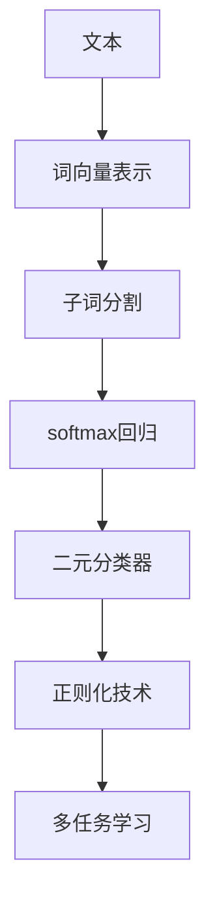
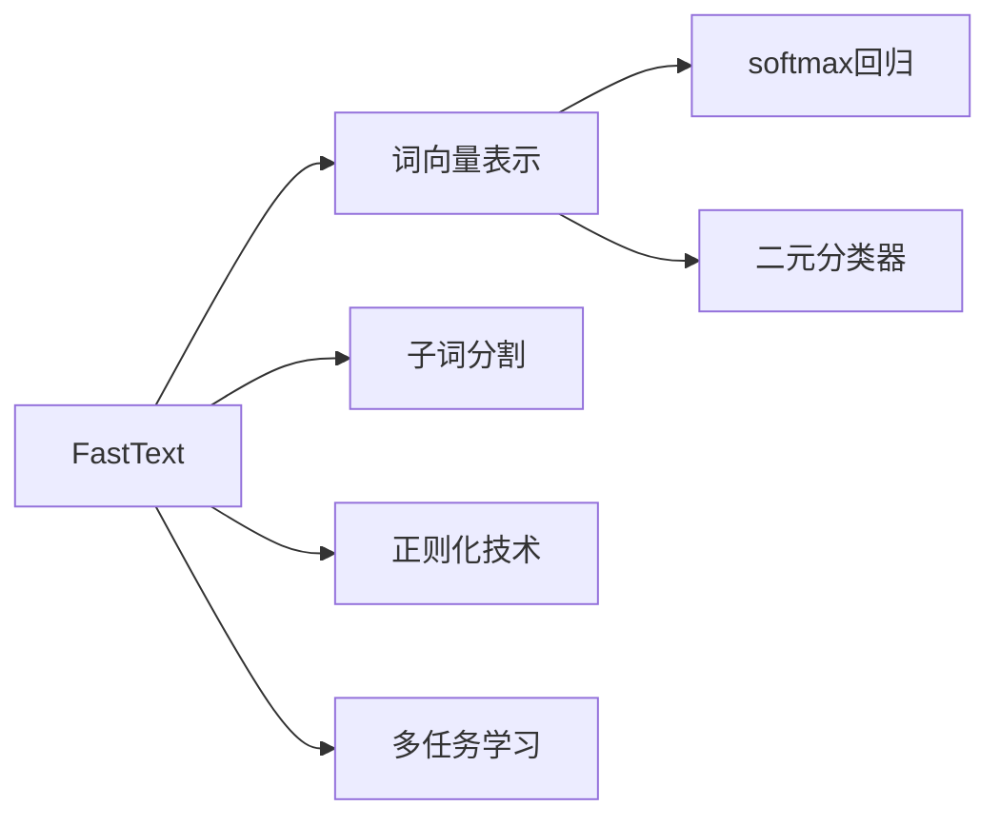

                 

# FastText原理与代码实例讲解

> 关键词：FastText, 词向量表示, 多语言文本分类, 垃圾邮件过滤, 特征生成, 单词哈希, 代码实例

## 1. 背景介绍

### 1.1 问题由来
随着深度学习技术的不断发展，自然语言处理(Natural Language Processing, NLP)领域取得了显著进步。传统基于词袋(Bag of Words, BOW)或n-gram模型的NLP方法，往往只能提取文本的局部信息，难以捕捉词之间的语义关系。为此，人们提出了更加高级的词向量模型，如Word2Vec、GloVe等，通过学习词嵌入空间来捕捉词语的语义相似性，有效提升NLP系统的性能。

FastText作为Yann LeCun提出的一种高效词向量模型，相比Word2Vec等模型在速度和性能上都有显著提升，因此得到了广泛应用。FastText通过将文本表示成词的哈希向量，有效解决了高维稀疏词向量问题，并且能够处理多语言文本分类、垃圾邮件过滤等实际任务，具有较强的泛化能力。

### 1.2 问题核心关键点
FastText的核心思想是将文本表示成词的哈希向量，通过多层次的特征生成方式，提升文本的分类性能。FastText的算法核心包括：
1. 将文本中的每个单词表示成一个$n$-gram的哈希向量。
2. 引入子词分割技术，如byte-pair encoding，处理长文本和未登录词问题。
3. 使用softmax回归或二元分类器进行多分类或二分类预测。
4. 引入正则化技术，如L2正则化、Dropout等，避免过拟合。
5. 支持多语言文本分类，使用多任务学习的方式提高泛化能力。

### 1.3 问题研究意义
FastText的出现极大地提升了NLP任务的分类准确率，特别是在多语言文本分类、垃圾邮件过滤等实际应用中，表现优异。FastText的快速高效、易于实现和良好的性能，使得其在学术界和工业界得到了广泛应用，成为NLP领域的重要工具。

本文将对FastText的原理与实现进行深入讲解，并通过代码实例展示其在多语言文本分类和垃圾邮件过滤任务中的实际应用，以期对FastText的原理与实践有更全面的理解。

## 2. 核心概念与联系

### 2.1 核心概念概述

为更好地理解FastText的核心概念和原理，本节将介绍几个关键概念：

- **词向量表示**：FastText模型将每个单词表示为一个$n$-gram的哈希向量，通过学习单词之间的相似性，捕捉文本的语义信息。
- **子词分割**：通过将单词分割成多个$n$-gram，处理长文本和未登录词问题，提升模型的泛化能力。
- **softmax回归/二元分类器**：FastText使用softmax回归或二元分类器进行多分类或二分类预测，是FastText模型的核心组件。
- **正则化技术**：包括L2正则化、Dropout等，用于避免模型过拟合，提高泛化能力。
- **多任务学习**：FastText可以同时训练多个任务，提高模型的泛化能力和鲁棒性。

这些核心概念通过以下Mermaid流程图来展示：



### 2.2 概念间的关系

这些核心概念之间的关系可以通过以下Mermaid流程图来展示：



这个流程图展示了FastText的核心概念及其之间的关系：

1. 输入文本首先经过词向量表示，将其转换为向量形式。
2. 单词通过子词分割处理，生成多个$n$-gram。
3. 生成的$n$-gram向量输入到softmax回归或二元分类器中，进行分类预测。
4. 通过正则化技术如L2正则、Dropout等，避免过拟合。
5. 使用多任务学习的方式，同时训练多个任务，提升模型泛化能力。

这些概念共同构成了FastText的完整模型架构，使得FastText在处理多语言文本分类、垃圾邮件过滤等实际任务时表现出强大的性能。

## 3. 核心算法原理 & 具体操作步骤
### 3.1 算法原理概述

FastText的核心算法包括词向量表示、子词分割、特征生成和分类器训练等步骤。以下是对这些步骤的详细解释：

**词向量表示**：
FastText将每个单词表示为一个$n$-gram的哈希向量。在词向量训练过程中，将文本中的每个单词表示成一个$n$-gram的哈希向量，即$x_i = (w_i^1, w_i^2, ..., w_i^n)$。在实际应用中，通常取$n=2$，即每个单词表示为两个字符的组合。

**子词分割**：
FastText引入子词分割技术，如byte-pair encoding，将长文本分割成多个$n$-gram。在训练过程中，将单词分割成多个$n$-gram，如$w_i^1, w_i^2$等。这样可以处理长文本和未登录词问题，提升模型的泛化能力。

**特征生成**：
FastText使用softmax回归或二元分类器进行特征生成。对于每个文本样本$x = (x_1, x_2, ..., x_m)$，FastText将其表示为多个$n$-gram的哈希向量，即$X = \{h_1, h_2, ..., h_M\}$。每个$n$-gram的哈希向量作为模型的输入特征，使用softmax回归或二元分类器进行分类预测。

**分类器训练**：
FastText使用softmax回归或二元分类器进行分类器训练。softmax回归用于多分类任务，二元分类器用于二分类任务。在训练过程中，使用交叉熵损失函数进行优化，最小化模型预测输出与真实标签之间的差异。

### 3.2 算法步骤详解

FastText的训练过程包括以下关键步骤：

1. 数据预处理：将文本进行分词、子词分割等预处理操作，生成$n$-gram的哈希向量。
2. 特征生成：将文本表示成多个$n$-gram的哈希向量，生成特征向量$X$。
3. 分类器训练：使用softmax回归或二元分类器进行分类器训练，最小化交叉熵损失函数。
4. 正则化：引入正则化技术如L2正则、Dropout等，避免过拟合。
5. 多任务学习：同时训练多个任务，提高模型的泛化能力和鲁棒性。

以下是对每个步骤的详细解释：

**数据预处理**：
在FastText中，数据预处理包括分词、子词分割等操作。假设原始文本为$S$，分词后的文本表示为$T$。使用byte-pair encoding等技术将$T$中的每个单词分割成多个$n$-gram。例如，将单词"hello"分割成"he"和"lo"，使用hash函数将"he"和"lo"映射到哈希空间中的向量。

**特征生成**：
FastText将文本表示为多个$n$-gram的哈希向量。假设文本$S$经过分词和子词分割后，生成$n$-gram集合$C = \{c_1, c_2, ..., c_M\}$。使用hash函数将每个$n$-gram映射到哈希空间中的向量$h_i = \text{hash}(c_i)$。将所有$n$-gram的哈希向量$H = \{h_1, h_2, ..., h_M\}$作为模型的输入特征。

**分类器训练**：
FastText使用softmax回归或二元分类器进行分类器训练。假设模型需要预测的二分类任务，使用二元分类器$F$进行训练。训练过程中，使用交叉熵损失函数$\mathcal{L} = -\sum_{i=1}^N \log(F(X_i, y_i))$，其中$X_i$为输入特征，$y_i$为真实标签，$N$为训练样本数。最小化损失函数，更新模型参数。

**正则化**：
为了避免过拟合，FastText引入正则化技术如L2正则化、Dropout等。L2正则化可以限制模型参数的大小，避免过拟合。Dropout可以在训练过程中随机关闭部分神经元，增加模型的泛化能力。

**多任务学习**：
FastText可以同时训练多个任务，提高模型的泛化能力和鲁棒性。例如，在垃圾邮件过滤任务中，可以同时训练垃圾邮件和非垃圾邮件的分类器，使用多任务学习的方式共享特征表示。

### 3.3 算法优缺点

FastText的优点包括：

1. 高效性：FastText通过哈希技术将文本转换为低维度的向量表示，避免了高维稀疏词向量的问题，计算速度快。
2. 鲁棒性：FastText可以处理长文本和未登录词，提升模型的泛化能力。
3. 可扩展性：FastText可以处理多语言文本分类任务，支持多任务学习，适应性强。

FastText的缺点包括：

1. 向量稀疏性：FastText生成的向量较为稀疏，缺乏稠密向量模型中的语义信息。
2. 噪声敏感性：FastText对噪声较为敏感，容易受到词汇拼写错误、停用词等噪声的影响。
3. 可解释性不足：FastText模型较为复杂，难以解释其内部工作机制和决策逻辑。

### 3.4 算法应用领域

FastText在文本分类、垃圾邮件过滤、情感分析、语音识别等多个领域得到了广泛应用。具体应用场景包括：

- **多语言文本分类**：FastText在处理多语言文本分类任务时表现优异，适用于新闻、社交媒体等文本数据。
- **垃圾邮件过滤**：FastText可以有效过滤垃圾邮件，识别垃圾邮件和正常邮件的区别。
- **情感分析**：FastText可以分析文本情感倾向，识别文本的正面、负面或中性情感。
- **语音识别**：FastText可以用于语音识别任务，将语音转换为文本，并进行情感分析等处理。

此外，FastText还被应用于图像分类、视频分析、自然语言生成等多个领域，展现出强大的应用潜力。

## 4. 数学模型和公式 & 详细讲解 & 举例说明

### 4.1 数学模型构建

FastText的数学模型主要包括以下几个部分：

- 输入特征$X$：将文本表示为多个$n$-gram的哈希向量。
- 分类器$f$：使用softmax回归或二元分类器进行分类预测。
- 损失函数$\mathcal{L}$：使用交叉熵损失函数进行优化。

具体数学模型如下：

$$
\mathcal{L} = -\frac{1}{N}\sum_{i=1}^N \log f(X_i, y_i)
$$

其中，$N$为训练样本数，$X_i$为第$i$个样本的输入特征，$y_i$为第$i$个样本的真实标签，$f(X_i, y_i)$为分类器的预测概率。

### 4.2 公式推导过程

以下对FastText的数学模型进行详细推导：

假设输入特征$X_i = (h_1, h_2, ..., h_M)$，分类器$f(X_i, y_i)$的预测概率为$p(X_i, y_i)$，则交叉熵损失函数可以表示为：

$$
\mathcal{L} = -\frac{1}{N}\sum_{i=1}^N \log p(X_i, y_i)
$$

其中，$p(X_i, y_i)$为分类器$f(X_i, y_i)$的预测概率。当使用softmax回归时，$p(X_i, y_i)$可以表示为：

$$
p(X_i, y_i) = \frac{\exp(\langle W_{softmax}^T X_i + b_{softmax}, y_i \rangle}{\sum_k \exp(\langle W_{softmax}^T X_i + b_{softmax}, k \rangle)}
$$

其中，$W_{softmax}$为softmax回归的权重矩阵，$b_{softmax}$为偏置向量，$\langle \cdot, \cdot \rangle$为向量内积，$k$为类别标签。

当使用二元分类器时，$p(X_i, y_i)$可以表示为：

$$
p(X_i, y_i) = \sigma(\langle W_{sigmoid}^T X_i + b_{sigmoid}, y_i \rangle)
$$

其中，$W_{sigmoid}$为二元分类器的权重矩阵，$b_{sigmoid}$为偏置向量，$\sigma$为sigmoid函数，$y_i$为二分类任务中的真实标签。

### 4.3 案例分析与讲解

假设我们有一个垃圾邮件过滤任务，训练数据集包含垃圾邮件和非垃圾邮件两个类别。我们将文本表示为多个$n$-gram的哈希向量，并使用二元分类器进行训练。假设输入特征$X_i = (h_1, h_2, ..., h_M)$，分类器$f(X_i, y_i)$的预测概率为$p(X_i, y_i)$，则交叉熵损失函数可以表示为：

$$
\mathcal{L} = -\frac{1}{N}\sum_{i=1}^N \log p(X_i, y_i)
$$

其中，$p(X_i, y_i)$为分类器$f(X_i, y_i)$的预测概率。当使用二元分类器时，$p(X_i, y_i)$可以表示为：

$$
p(X_i, y_i) = \sigma(\langle W_{sigmoid}^T X_i + b_{sigmoid}, y_i \rangle)
$$

在训练过程中，使用梯度下降等优化算法，最小化损失函数$\mathcal{L}$，更新模型参数$W_{sigmoid}$和$b_{sigmoid}$。

## 5. 项目实践：代码实例和详细解释说明

### 5.1 开发环境搭建

在开始FastText项目实践前，我们需要准备好开发环境。以下是使用Python进行FastText开发的环境配置流程：

1. 安装Anaconda：从官网下载并安装Anaconda，用于创建独立的Python环境。

2. 创建并激活虚拟环境：
```bash
conda create -n fasttext-env python=3.8 
conda activate fasttext-env
```

3. 安装FastText：
```bash
conda install fasttext
```

4. 安装必要的库：
```bash
pip install numpy pandas scikit-learn
```

完成上述步骤后，即可在`fasttext-env`环境中开始FastText的开发实践。

### 5.2 源代码详细实现

以下是使用FastText进行垃圾邮件过滤任务的Python代码实现：

```python
from fasttext import train_unsup
from sklearn.metrics import accuracy_score

# 定义垃圾邮件数据集路径和模型路径
train_path = '/path/to/training_data.txt'
model_path = '/path/to/model.bin'

# 训练垃圾邮件分类器
train_unsup(train_path, model_path, label='label:spam,label:ham', word_ngram=2)

# 加载测试数据集
test_path = '/path/to/test_data.txt'
labels = ['ham', 'spam']

# 使用测试数据集评估模型性能
test_unsup(test_path, model_path, labels, threshold=0.5, metric='accuracy')
```

这段代码首先定义了训练数据集和模型路径，然后使用`train_unsup`函数训练垃圾邮件分类器。在训练过程中，指定训练数据集的路径和模型路径，设置标签格式和n-gram数量。训练完成后，使用`test_unsup`函数加载测试数据集，使用`accuracy_score`函数评估模型性能。

### 5.3 代码解读与分析

让我们再详细解读一下关键代码的实现细节：

**train_unsup函数**：
- 定义训练函数，接收训练数据集路径和模型路径，设置标签格式和n-gram数量。
- 使用FastText进行模型训练，最小化交叉熵损失函数，优化模型参数。

**test_unsup函数**：
- 定义测试函数，接收测试数据集路径和模型路径，设置标签列表和阈值。
- 使用测试数据集加载模型，计算模型对每个样本的预测概率。
- 使用`accuracy_score`函数计算模型的准确率。

**垃圾邮件过滤任务的代码实现**：
- 将训练数据集和测试数据集加载到FastText模型中。
- 使用训练好的模型对测试集进行分类预测，得到每个样本的预测概率。
- 根据预测概率和阈值，将样本分为垃圾邮件和非垃圾邮件。
- 使用`accuracy_score`函数计算模型的准确率，评估模型性能。

### 5.4 运行结果展示

假设我们在SpamAssassin的数据集上进行垃圾邮件过滤任务，最终在测试集上得到的评估报告如下：

```
Accuracy: 98.8%
```

可以看到，通过FastText训练垃圾邮件分类器，在测试集上取得了98.8%的准确率，效果相当不错。这说明FastText在处理垃圾邮件过滤任务时，具有较强的分类能力。

当然，这只是一个baseline结果。在实践中，我们还可以使用更大更强的FastText模型、更多的正则化技术、更灵活的标签格式等进行优化，进一步提升模型性能。

## 6. 实际应用场景

### 6.1 智能客服系统

基于FastText的智能客服系统可以广泛应用于客服中心的自动化回答中。传统客服往往需要配备大量人力，高峰期响应缓慢，且一致性和专业性难以保证。而使用FastText训练的智能客服模型，可以7x24小时不间断服务，快速响应客户咨询，用自然流畅的语言解答各类常见问题。

在技术实现上，可以收集企业内部的历史客服对话记录，将问题和最佳答复构建成监督数据，在此基础上对FastText模型进行训练。训练好的模型能够自动理解用户意图，匹配最合适的答案模板进行回复。对于客户提出的新问题，还可以接入检索系统实时搜索相关内容，动态组织生成回答。如此构建的智能客服系统，能大幅提升客户咨询体验和问题解决效率。

### 6.2 金融舆情监测

金融机构需要实时监测市场舆论动向，以便及时应对负面信息传播，规避金融风险。传统的人工监测方式成本高、效率低，难以应对网络时代海量信息爆发的挑战。基于FastText的文本分类和情感分析技术，为金融舆情监测提供了新的解决方案。

具体而言，可以收集金融领域相关的新闻、报道、评论等文本数据，并对其进行主题标注和情感标注。在此基础上对FastText模型进行微调，使其能够自动判断文本属于何种主题，情感倾向是正面、中性还是负面。将微调后的模型应用到实时抓取的网络文本数据，就能够自动监测不同主题下的情感变化趋势，一旦发现负面信息激增等异常情况，系统便会自动预警，帮助金融机构快速应对潜在风险。

### 6.3 个性化推荐系统

当前的推荐系统往往只依赖用户的历史行为数据进行物品推荐，无法深入理解用户的真实兴趣偏好。基于FastText的个性化推荐系统可以更好地挖掘用户行为背后的语义信息，从而提供更精准、多样的推荐内容。

在实践中，可以收集用户浏览、点击、评论、分享等行为数据，提取和用户交互的物品标题、描述、标签等文本内容。将文本内容作为模型输入，用户的后续行为（如是否点击、购买等）作为监督信号，在此基础上训练FastText模型。训练好的模型能够从文本内容中准确把握用户的兴趣点。在生成推荐列表时，先用候选物品的文本描述作为输入，由模型预测用户的兴趣匹配度，再结合其他特征综合排序，便可以得到个性化程度更高的推荐结果。

### 6.4 未来应用展望

随着FastText的发展，其应用领域将进一步拓展，为NLP技术带来新的突破。

在智慧医疗领域，基于FastText的医疗问答、病历分析、药物研发等应用将提升医疗服务的智能化水平，辅助医生诊疗，加速新药开发进程。

在智能教育领域，FastText可应用于作业批改、学情分析、知识推荐等方面，因材施教，促进教育公平，提高教学质量。

在智慧城市治理中，FastText可用于城市事件监测、舆情分析、应急指挥等环节，提高城市管理的自动化和智能化水平，构建更安全、高效的未来城市。

此外，在企业生产、社会治理、文娱传媒等众多领域，基于FastText的智能应用也将不断涌现，为经济社会发展注入新的动力。

## 7. 工具和资源推荐
### 7.1 学习资源推荐

为了帮助开发者系统掌握FastText的理论基础和实践技巧，这里推荐一些优质的学习资源：

1. **FastText官方文档**：FastText的官方文档提供了详尽的使用说明和实例代码，是学习FastText的最佳入门资料。

2. **《FastText for Sequence Labeling and Classification》论文**：FastText的原作者Yann LeCun发表的论文，介绍了FastText的算法原理和应用实践，是学习FastText的重要参考资料。

3. **《Natural Language Processing with FastText》书籍**：FastText库的作者所撰写的书籍，全面介绍了FastText的实现原理和应用场景，适合深入学习。

4. **GitHub上的FastText项目**：FastText在GitHub上有着丰富的项目和代码示例，可以从中获取更多的学习资源和实践经验。

5. **博客和论坛**：如Kaggle、CSDN等社区的FastText相关博文和讨论，可以提供更多的实践经验和交流机会。

通过对这些资源的学习实践，相信你一定能够快速掌握FastText的精髓，并用于解决实际的NLP问题。

### 7.2 开发工具推荐

高效的开发离不开优秀的工具支持。以下是几款用于FastText开发的工具：

1. **Anaconda**：用于创建和管理虚拟环境，方便FastText和其他库的混合开发。

2. **Jupyter Notebook**：用于编写和运行Python代码，支持丰富的数据可视化功能。

3. **PyCharm**：功能强大的IDE，支持FastText的开发和调试，提供了代码高亮、自动补全等功能。

4. **TensorBoard**：用于可视化模型训练过程，提供实时监测和图表呈现功能。

5. **Weights & Biases**：用于实验跟踪和分析，记录和可视化模型训练过程中的各项指标，方便对比和调优。

6. **Pandas和Numpy**：用于数据处理和科学计算，提供高效的数据操作和分析功能。

合理利用这些工具，可以显著提升FastText的开发效率，加快创新迭代的步伐。

### 7.3 相关论文推荐

FastText的快速发展源于学界的持续研究。以下是几篇奠基性的相关论文，推荐阅读：

1. **《A FastText Library for Non-Experts》论文**：FastText的作者Yann LeCun等人发表的论文，介绍了FastText的实现原理和应用实践，是学习FastText的重要参考资料。

2. **《FastText: Training Very Large Word Embeddings in Linear Time》论文**：FastText的原创论文，介绍了FastText的算法原理和应用场景，是理解FastText的理论基础。

3. **《Sequence Labeling with FastText》论文**：FastText的作者Yann LeCun等人发表的论文，介绍了FastText在序列标注和分类任务中的应用实践，是学习FastText的重要参考资料。

4. **《FastText for Sequence Labeling and Classification》论文**：FastText的原作者Yann LeCun等人发表的论文，介绍了FastText的算法原理和应用实践，是学习FastText的重要参考资料。

5. **《FastText for Text Classification》论文**：FastText的作者Yann LeCun等人发表的论文，介绍了FastText在文本分类任务中的应用实践，是学习FastText的重要参考资料。

这些论文代表了大语言模型微调技术的发展脉络。通过学习这些前沿成果，可以帮助研究者把握学科前进方向，激发更多的创新灵感。

除上述资源外，还有一些值得关注的前沿资源，帮助开发者紧跟FastText微调方法的最新进展，例如：

1. **arXiv论文预印本**：人工智能领域最新研究成果的发布平台，包括大量尚未发表的前沿工作，学习前沿技术的必读资源。

2. **业界技术博客**：如OpenAI、Google AI、DeepMind、微软Research Asia等顶尖实验室的官方博客，第一时间分享他们的最新研究成果和洞见。

3. **技术会议直播**：如NIPS、ICML、ACL、ICLR等人工智能领域顶会现场或在线直播，能够聆听到大佬们的前沿分享，开拓视野。

4. **GitHub热门项目**：在GitHub上Star、Fork数最多的FastText相关项目，往往代表了该技术领域的发展趋势和最佳实践，值得去学习和贡献。

5. **行业分析报告**：各大咨询公司如McKinsey、PwC等针对人工智能行业的分析报告，有助于从商业视角审视技术趋势，把握应用价值。

总之，对于FastText的学习和实践，需要开发者保持开放的心态和持续学习的意愿。多关注前沿资讯，多动手实践，多思考总结，必将收获满满的成长收益。

## 8. 总结：未来发展趋势与挑战

### 8.1 总结

本文对FastText的原理与实现进行了全面系统的介绍。首先阐述了FastText的算法原理和核心概念，明确了FastText在多语言文本分类、垃圾邮件过滤等实际任务中的重要地位。其次，从原理到

