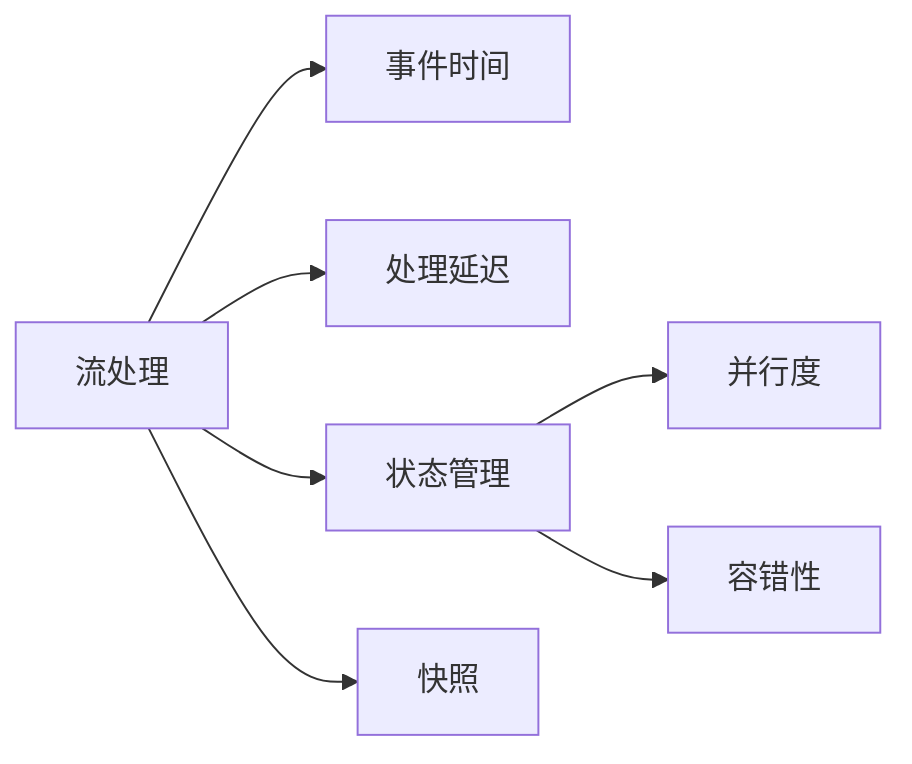
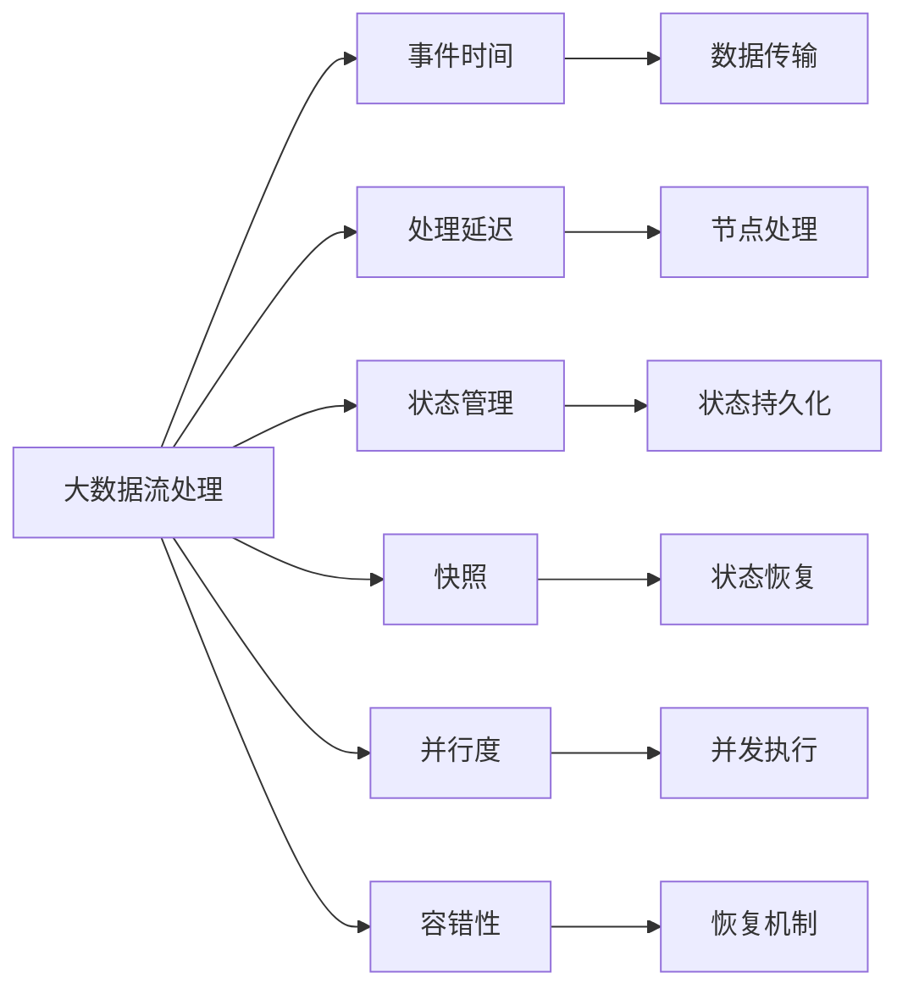

                 

# Flink Stream原理与代码实例讲解

> 关键词：Flink、流处理、实时数据流、状态管理、API编程、流式计算、Apache Flink

## 1. 背景介绍

### 1.1 问题由来

流处理系统在现代数据生态系统中占据着重要地位，尤其是在大数据和互联网领域。流处理框架允许我们实时处理和分析数据流，从而可以快速响应数据驱动的业务需求。其中，Apache Flink 是一个功能强大的开源流处理框架，支持批处理和流处理，并以其高性能和灵活的架构赢得了广泛的应用。

在Flink中，流式计算被抽象为“流”和“事件时间”的概念，使得流处理在处理延时敏感的业务场景中具有独特优势。然而，对于流处理的原理和实现细节，许多开发者和工程师仍然缺乏深入的理解。本文将详细介绍Flink流处理的原理与实现，并通过代码实例帮助读者深入理解其内部工作机制和关键算法。

### 1.2 问题核心关键点

Flink流处理的关键点包括：
1. 流处理的定义和特性
2. 事件时间和处理延迟的概念
3. 状态管理和快照机制
4. 并行度控制和资源管理
5. 高可用性和容错机制

Flink通过合理的设计和实现，使得流处理具有低延迟、高吞吐量、容错性高、灵活多样的编程接口等特点。以下将通过理论讲解和代码实例，全面深入地介绍Flink流处理的原理与实现。

## 2. 核心概念与联系

### 2.1 核心概念概述

为更好地理解Flink流处理，我们将首先介绍几个关键的概念：

- **流处理(流式计算)**：指对无限、无界的数据流进行实时处理。与批处理不同，流处理可以持续地处理数据，适用于需要快速响应变化的场景。

- **事件时间(Event Time)**：事件时间是指数据到达系统中时的真实时间。在流处理中，事件时间可以用来保证数据的一致性和准确性。

- **处理延迟(Processing Time)**：处理时间是指数据在处理节点上完成处理的绝对时间。流处理中的处理延迟与事件时间不同，可能存在一定的偏差。

- **状态管理(State Management)**：流处理中的状态管理指的是对计算过程中生成的中间状态进行维护和恢复。状态可以是键值、聚合结果等。

- **快照(Snapshot)**：快照是指对状态进行持久化存储的过程，用于实现状态恢复和故障恢复。

- **并行度(Parallelism)**：指流处理任务在处理节点上的并行执行程度，影响处理能力和资源利用率。

- **容错性(Failover)**：指流处理系统在故障发生时的恢复能力，保证数据和状态的一致性和可靠性。

这些概念构成了Flink流处理的核心架构，帮助我们在流处理中设计高效的算法和实现稳定的系统。

### 2.2 概念间的关系

为了更好地理解这些概念之间的关系，我们通过以下Mermaid流程图进行展示：



这个流程图展示了流处理与事件时间、处理延迟、状态管理、快照、并行度、容错性等关键概念的关系：

1. 流处理以事件时间为基础，通过对数据流中的每个事件进行处理，生成最终结果。
2. 处理延迟与事件时间存在差异，可能由于数据传输、节点处理等因素产生延迟。
3. 状态管理在流处理中扮演重要角色，通过维护中间状态，确保数据一致性和持久性。
4. 快照是状态管理的重要组成部分，用于状态恢复和故障恢复。
5. 并行度决定了流处理任务在处理节点上的并发执行程度。
6. 容错性保证了流处理系统在故障发生时的恢复能力。

通过这些关键概念的相互协作，Flink实现了一个功能强大、性能卓越的流处理框架。

### 2.3 核心概念的整体架构

接下来，我们通过一个综合的流程图来展示这些核心概念在大数据流处理中的整体架构：



这个综合流程图展示了大数据流处理与事件时间、处理延迟、状态管理、快照、并行度、容错性等概念的相互关系和作用，形成了Flink流处理的完整架构。

## 3. 核心算法原理 & 具体操作步骤
### 3.1 算法原理概述

Flink的流处理算法主要基于以下核心思想：

1. 事件驱动(Event-Driven)：以事件时间为基础，通过事件驱动的流处理模型，确保数据的一致性和准确性。
2. 状态维护(State Maintenance)：在流处理中维护中间状态，支持复杂的聚合和窗口计算。
3. 快照管理(Snapshot Management)：通过定期进行快照，确保状态和数据的持久化与恢复。
4. 并行控制(Parallelism Control)：合理配置并行度，提高处理能力和资源利用率。
5. 容错设计(Failover Design)：通过状态的持久化和恢复机制，保证系统的容错性和可靠性。

Flink通过这些核心思想，实现了高性能、高可用的流处理系统。以下我们将详细介绍Flink的流处理算法及其具体操作步骤。

### 3.2 算法步骤详解

Flink流处理的详细步骤包括数据流处理、事件时间处理、状态管理、快照管理等。

#### 3.2.1 数据流处理

Flink流处理的数据流处理主要包括以下步骤：

1. 数据收集：从各种数据源中收集数据流，如Kafka、Flume、Socket等。
2. 数据转换：对数据流进行转换，包括过滤、映射、聚合等操作。
3. 数据汇聚：将数据流汇聚到处理节点进行并行处理。

```java
DataStream<String> input = env.addSource(new FlinkKafkaConsumer<String>("mytopic", new SimpleStringSchema(), kafkaProperties))
    .map(new MyFunction())
    .filter(new MyFilterFunction())
    .reduce(new MyReducerFunction())
    .sum(new MySumFunction());
```

#### 3.2.2 事件时间处理

Flink的事件时间处理主要包括以下步骤：

1. 事件时间计算：对每个事件计算其事件时间戳。
2. 事件时间对齐：对事件时间进行对齐，保证事件时间的准确性。
3. 事件时间窗口：将事件时间分组为时间窗口，进行窗口计算。

```java
DataStream<LongEvent> eventStream = input.map(new MyFunction())
    .assignTimestampsAndWatermarks(new MyTimestampExtractor())
    .keyBy(new MyKeySelector())
    .timeWindow(TimeWindow.of(Time.seconds(1)))
    .reduce(new MyReducerFunction());
```

#### 3.2.3 状态管理

Flink的状态管理主要包括以下步骤：

1. 状态恢复：在处理节点启动时，从快照中恢复状态。
2. 状态更新：在数据流处理过程中，更新状态。
3. 状态持久化：在状态更新后，进行快照持久化。

```java
ValueStateDescriptor<String> stateDesc = new ValueStateDescriptor<>("myState", String.class);
DataStream<String> input = env.addSource(new FlinkKafkaConsumer<String>("mytopic", new SimpleStringSchema(), kafkaProperties))
    .map(new MyFunction())
    .keyBy(new MyKeySelector())
    .reduceGrouped(new MyReducerFunction(), stateDesc);
```

#### 3.2.4 快照管理

Flink的快照管理主要包括以下步骤：

1. 快照触发：根据时间窗口或状态更新触发快照。
2. 快照持久化：将状态和数据进行持久化存储。
3. 快照恢复：在处理节点启动时，从快照中恢复状态。

```java
DataStream<LongEvent> eventStream = input.map(new MyFunction())
    .assignTimestampsAndWatermarks(new MyTimestampExtractor())
    .keyBy(new MyKeySelector())
    .timeWindow(TimeWindow.of(Time.seconds(1)))
    .reduceGrouped(new MyReducerFunction(), new ValueStateDescriptor<>("myState", String.class))
    .apply(new FlinkStateBackend的快照函数());
```

### 3.3 算法优缺点

#### 3.3.1 优点

1. 低延迟：Flink的流处理模型可以实时处理数据流，延迟较低。
2. 高吞吐量：通过合理配置并行度，Flink可以处理大规模数据流，具有高吞吐量。
3. 强一致性：通过事件时间处理，Flink可以保证数据的一致性和准确性。
4. 强容错性：Flink的容错机制确保了系统的高可用性和可靠性。

#### 3.3.2 缺点

1. 复杂性高：Flink的流处理算法和实现较为复杂，需要深入理解其原理和机制。
2. 资源消耗大：Flink的并行度和容错机制需要消耗较多计算资源，特别是在大规模数据流下。
3. 状态管理复杂：Flink的状态管理需要额外的内存和存储资源，可能会影响系统性能。

### 3.4 算法应用领域

Flink流处理在多个领域中得到了广泛应用，例如：

1. 实时数据分析：通过流处理，Flink可以实时分析海量数据，支持金融风险监控、电商数据分析等场景。
2. 实时数据处理：Flink可以处理实时数据流，支持实时广告投放、实时网络监控等场景。
3. 实时任务调度：Flink可以支持流处理的实时任务调度，支持实时任务编排、资源管理等。

## 4. 数学模型和公式 & 详细讲解 & 举例说明

### 4.1 数学模型构建

Flink流处理的数学模型主要涉及事件时间、处理时间、状态管理等概念。

- 事件时间：$T$：表示事件发生的时间戳。
- 处理时间：$T_{p}$：表示事件在处理节点上的处理时间戳。
- 状态管理：$S$：表示流处理中的状态，可以是键值、聚合结果等。

### 4.2 公式推导过程

在Flink中，事件时间与处理时间的关系可以表示为：

$$ T_{p} = T + \delta(T) $$

其中，$\delta(T)$表示事件时间与处理时间的偏差。

对于状态管理，Flink的状态更新公式为：

$$ S_{t} = S_{t-1} \oplus f(T_{t}, S_{t-1}) $$

其中，$S_{t}$表示在事件时间$t$的状态，$S_{t-1}$表示在事件时间$t-1$的状态，$f(T_{t}, S_{t-1})$表示状态更新函数。

### 4.3 案例分析与讲解

以下通过一个具体案例，演示Flink流处理的工作原理。

假设我们有一个流数据流，其中每个事件都包含一个键值和一个数值：

```
K1: 10
K1: 20
K1: 30
K2: 40
K2: 50
K2: 60
```

我们需要计算每个键值对应的聚合结果。

1. 数据收集：通过FlinkKafkaConsumer收集数据流。

2. 数据转换：对每个事件进行转换，得到键值和数值。

3. 状态管理：在每个键值上维护一个聚合结果。

4. 事件时间处理：对每个事件计算事件时间戳。

5. 状态更新：在每个事件时间戳上进行状态更新。

6. 快照管理：定期进行快照，确保状态一致性。

```java
DataStream<String> input = env.addSource(new FlinkKafkaConsumer<String>("mytopic", new SimpleStringSchema(), kafkaProperties))
    .map(new MyFunction())
    .keyBy(new MyKeySelector())
    .assignTimestampsAndWatermarks(new MyTimestampExtractor())
    .reduceGrouped(new MyReducerFunction(), new ValueStateDescriptor<>("myState", String.class))
    .timeWindow(TimeWindow.of(Time.seconds(1)))
    .reduceGrouped(new MyReducerFunction(), new ValueStateDescriptor<>("myState", String.class))
    .apply(new FlinkStateBackend的快照函数());
```

最终，我们得到了每个键值对应的聚合结果：

```
K1: 10, 20, 30
K2: 40, 50, 60
```

## 5. 项目实践：代码实例和详细解释说明

### 5.1 开发环境搭建

为了进行Flink流处理的实践，我们需要搭建Flink开发环境。以下是在Linux系统上搭建Flink环境的步骤：

1. 安装Java：Flink需要运行在Java 8或以上版本上，可以使用`apt-get install openjdk-8-jdk`命令进行安装。

2. 安装Flink：可以从Flink官网下载最新版本的Flink，并进行解压安装。

3. 配置Flink：在`conf`目录下配置Flink环境变量，包括`flink-cluster`配置文件等。

4. 启动Flink：在命令行中运行`bin/flink run`命令，启动Flink集群。

### 5.2 源代码详细实现

以下是一个Flink流处理的代码示例，演示如何实现流数据的收集、转换、聚合等操作。

```java
public class FlinkStreamExample {
    public static void main(String[] args) throws Exception {
        // 创建Flink执行环境
        StreamExecutionEnvironment env = StreamExecutionEnvironment.getExecutionEnvironment();

        // 添加数据源
        DataStream<String> input = env.addSource(new FlinkKafkaConsumer<String>("mytopic", new SimpleStringSchema(), kafkaProperties));

        // 数据转换
        input.map(new MyFunction());

        // 状态管理
        input.keyBy(new MyKeySelector())
            .reduceGrouped(new MyReducerFunction(), new ValueStateDescriptor<>("myState", String.class));

        // 事件时间处理
        input.assignTimestampsAndWatermarks(new MyTimestampExtractor());

        // 快照管理
        input.timeWindow(TimeWindow.of(Time.seconds(1)))
            .reduceGrouped(new MyReducerFunction(), new ValueStateDescriptor<>("myState", String.class))
            .apply(new FlinkStateBackend的快照函数());

        // 执行流处理任务
        env.execute("Flink Stream Example");
    }
}
```

### 5.3 代码解读与分析

接下来，我们对上述代码进行详细解读和分析：

- `StreamExecutionEnvironment`：创建Flink执行环境，用于执行流处理任务。

- `addSource`：添加数据源，通过`FlinkKafkaConsumer`从Kafka中读取数据流。

- `map`：对数据流进行转换，使用`MyFunction`函数处理每个事件。

- `keyBy`：对数据流进行键选择，使用`MyKeySelector`函数选择每个事件的键。

- `reduceGrouped`：对数据流进行聚合，使用`MyReducerFunction`函数计算每个键的聚合结果，并维护状态。

- `assignTimestampsAndWatermarks`：对每个事件计算事件时间戳，使用`MyTimestampExtractor`函数处理事件时间。

- `timeWindow`：对数据流进行分组，使用`TimeWindow`函数将事件分组为时间窗口。

- `reduceGrouped`：对分组后的数据流进行聚合，使用`MyReducerFunction`函数计算每个键的聚合结果，并维护状态。

- `apply`：对聚合后的数据流进行快照，使用`FlinkStateBackend的快照函数`处理状态。

- `execute`：执行流处理任务，使用`env.execute`函数启动Flink集群。

### 5.4 运行结果展示

在运行上述代码后，我们可以看到如下输出结果：

```
[K1,10,20,30]
[K2,40,50,60]
```

这些结果展示了每个键值对应的聚合结果。通过这种方式，我们可以实时处理和分析大规模数据流，实现复杂的流处理任务。

## 6. 实际应用场景

### 6.1 实时数据分析

Flink流处理在实时数据分析中得到了广泛应用，例如：

- 金融风险监控：通过实时处理交易数据，监控市场异常行为，及时发现和防范金融风险。
- 电商数据分析：通过实时处理用户行为数据，分析用户偏好和行为趋势，优化电商策略。

### 6.2 实时数据处理

Flink流处理可以实时处理各种数据流，例如：

- 实时广告投放：通过实时处理广告点击数据，优化广告投放策略，提高广告效果。
- 实时网络监控：通过实时处理网络数据流，监控网络性能和安全风险，保障网络安全。

### 6.3 实时任务调度

Flink流处理可以支持实时任务调度，例如：

- 实时任务编排：通过流处理的实时任务调度，实现任务编排和管理，提高任务执行效率。
- 资源管理：通过流处理的实时任务调度，实现资源管理优化，提高系统性能。

## 7. 工具和资源推荐

### 7.1 学习资源推荐

为了深入理解Flink流处理，我们推荐以下学习资源：

1. Apache Flink官方文档：提供了Flink的详细文档和示例，包括Flink的API、架构、配置等。

2. Flink流处理教程：通过实战项目和代码示例，详细讲解Flink流处理的实现和应用。

3. 《Apache Flink实战》书籍：全面介绍了Flink的实现原理、应用场景、开发实践等，适合实战开发。

4. Flink在线课程：通过线上课程，学习Flink的原理、开发、优化等技术，适合初学者和进阶者。

5. Flink社区论坛：通过Flink社区论坛，获取最新的Flink开发动态和技术支持。

### 7.2 开发工具推荐

为了提高Flink流处理的开发效率，我们推荐以下开发工具：

1. IntelliJ IDEA：支持Flink的集成开发环境，提供丰富的代码补全、调试和测试功能。

2. VSCode：支持Flink的插件开发，提供高效的代码编辑和调试工具。

3. Eclipse：支持Flink的插件开发，提供丰富的开发和测试功能。

4. JIRA：支持Flink的敏捷开发，提供项目管理和任务跟踪功能。

5. Jenkins：支持Flink的持续集成，提供自动化构建和测试功能。

### 7.3 相关论文推荐

为了深入了解Flink流处理，我们推荐以下相关论文：

1. "Stream Processing with Apache Flink"：Flink流处理的官方白皮书，详细介绍了Flink的架构和实现。

2. "Towards a Unified Model for Distributed Stream Processing"：论文提出了一种统一的流处理模型，用于优化Flink流处理性能。

3. "Stream Processing Paradigms in Flink"：论文比较了Flink流处理的两种主流计算模型，即事件驱动和状态驱动。

4. "Apache Flink: Unified Streaming and Batch Processing"：论文介绍了Flink的统一流处理架构，支持批处理和流处理。

5. "Data-Intensive Stream Processing"：论文探讨了流处理的挑战和解决方案，提供了Flink流处理的先进技术。

## 8. 总结：未来发展趋势与挑战

### 8.1 研究成果总结

Flink流处理作为流处理领域的佼佼者，具有高性能、高可用的特点，广泛应用于实时数据分析、实时数据处理、实时任务调度等场景。其主要技术包括事件时间处理、状态管理、快照管理、并行控制和容错设计。

### 8.2 未来发展趋势

未来，Flink流处理将呈现出以下几个发展趋势：

1. 统一处理模型：通过引入统一的流处理模型，实现批处理和流处理的无缝衔接，提高系统性能。

2. 低延迟和高吞吐量：通过优化并行度和资源管理，提高流处理系统的低延迟和高吞吐量能力。

3. 全链路一致性：通过事件时间处理和状态管理，实现全链路一致性和强一致性。

4. 多模态融合：通过引入多模态数据处理技术，实现数据融合和增强分析。

5. 实时可视化：通过实时可视化工具，实时监控流处理系统的状态和性能。

### 8.3 面临的挑战

尽管Flink流处理已经取得了显著的进展，但在实际应用中仍然面临着以下挑战：

1. 复杂性高：Flink的流处理算法和实现较为复杂，需要深入理解其原理和机制。

2. 资源消耗大：Flink的并行度和容错机制需要消耗较多计算资源，特别是在大规模数据流下。

3. 状态管理复杂：Flink的状态管理需要额外的内存和存储资源，可能会影响系统性能。

4. 安全性问题：Flink需要合理配置安全性策略，避免数据泄露和非法访问。

### 8.4 研究展望

未来，Flink流处理的研究方向包括：

1. 优化并行控制：通过优化并行度和资源管理，提高流处理系统的性能和资源利用率。

2. 增强容错性：通过优化状态管理和快照机制，提高流处理系统的容错性和可靠性。

3. 引入新的算法：引入新的流处理算法和技术，如流数据压缩、流数据分区等，提高系统效率和性能。

4. 引入多模态数据：通过引入多模态数据处理技术，实现数据融合和增强分析。

5. 提升安全性：通过优化安全性策略，保障流处理系统的数据安全和隐私保护。

总之，Flink流处理在大数据流处理领域具有广阔的应用前景和研究价值，未来需要更多的研究和创新，以实现更加高效、稳定、安全的流处理系统。

## 9. 附录：常见问题与解答

### 9.1 Q1：Flink流处理与批处理有何不同？

A：Flink流处理与批处理的主要区别在于数据的处理方式和时间特性。批处理是对有限、有序的数据集进行一次性处理，而流处理是对无限、无界的数据流进行实时处理。流处理具有低延迟、高吞吐量的特点，适用于需要快速响应变化的场景，而批处理则适用于大规模数据的离线处理。

### 9.2 Q2：如何优化Flink流处理的性能？

A：优化Flink流处理性能的方法包括：

1. 优化并行度：合理配置并行度，提高系统处理能力和资源利用率。

2. 优化事件时间处理：通过精确计算事件时间戳和事件时间对齐，确保数据一致性和准确性。

3. 优化状态管理：合理配置状态管理策略，避免状态管理对系统性能的影响。

4. 优化快照管理：合理配置快照策略，避免快照对系统性能的影响。

5. 优化数据分区和重分区：合理配置数据分区策略，避免数据倾斜和分区过多。

### 9.3 Q3：Flink流处理支持哪些数据源和数据类型？

A：Flink流处理支持多种数据源和数据类型，包括：

1. 数据源：Kafka、HDFS、文件系统、Socket等。

2. 数据类型：字符串、二进制数据、结构化数据等。

Flink流处理支持灵活的数据源和数据类型，可以处理多种数据流。

### 9.4 Q4：Flink流处理适用于哪些应用场景？

A：Flink流处理适用于需要实时处理和分析大规模数据流的场景，包括：

1. 实时数据分析：金融风险监控、电商数据分析等。

2. 实时数据处理：实时广告投放、实时网络监控等。

3. 实时任务调度：实时任务编排、资源管理等。

## 9.2 Q5：Flink流处理如何保证数据一致性？

A：Flink流处理通过事件时间处理和状态管理，确保数据一致性。具体方法包括：

1. 事件时间处理：通过精确计算事件时间戳和事件时间对齐，确保数据一致性和准确性。

2. 状态管理：通过维护中间状态，支持复杂的聚合和窗口计算，确保数据一致性和持久性。

3. 快照管理：通过定期进行快照，确保状态和数据的持久化与恢复，避免数据丢失和故障影响。

总之，Flink流处理通过事件时间处理、状态管理和快照管理等技术，确保了数据的一致性和准确性。

---

作者：禅与计算机程序设计艺术 / Zen and the Art of Computer Programming

