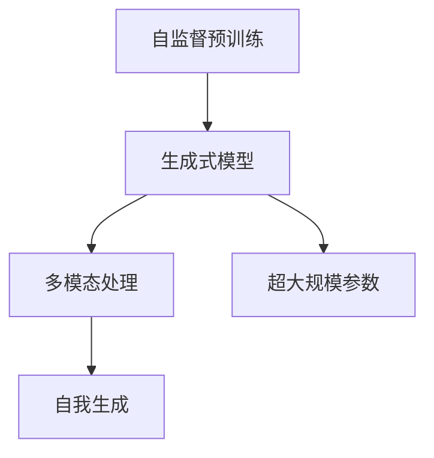

                 

# GPT-4 o：与之对话，真的很棒

## 1. 背景介绍

### 1.1 问题由来

随着人工智能技术的飞速发展，OpenAI的GPT系列大语言模型已经在自然语言处理(NLP)领域取得了显著突破。尤其是GPT-4的推出，更是将大语言模型的性能推向了新的高度。GPT-4不仅在通用的文本生成任务上表现优异，还具备了前所未有的多模态处理能力和更强的自我生成能力。这些特性使得GPT-4在与人类对话时表现得异常生动和智能。

然而，GPT-4的强大功能并非凭空而来，而是建立在深度学习和自监督预训练的基础上。本文将深入探讨GPT-4的原理、技术实现和实际应用，力求为读者提供全面而深入的理解。

### 1.2 问题核心关键点

GPT-4的核心技术主要包括：

- 自监督预训练：GPT-4在大规模无标签文本数据上进行预训练，学习到丰富的语言知识和表示。
- 生成式模型：GPT-4采用生成式模型架构，通过自回归方式进行文本生成。
- 多模态处理：GPT-4支持图像、视频等多模态数据的输入，能够生成具有视觉和听觉信息的文本。
- 自我生成：GPT-4具备自我生成能力，能够生成全新的对话和内容。
- 超大规模参数：GPT-4拥有巨大的参数量，这为其强大的计算能力和学习能力提供了保障。

这些核心技术使得GPT-4在与人类对话时表现得非常自然和智能，能够处理各种复杂场景，并生成高质量的文本和内容。本文将围绕这些关键点，深入分析GPT-4的工作原理和技术细节。

## 2. 核心概念与联系

### 2.1 核心概念概述

为了更好地理解GPT-4，我们需要先了解一些关键概念：

- **自监督预训练**：在大量无标签文本数据上进行预训练，学习到语言的表示和知识。
- **生成式模型**：通过生成式模型架构，能够根据输入生成新的文本或内容。
- **多模态处理**：支持处理文本、图像、视频等多种数据模态，扩展了语言模型的应用范围。
- **自我生成**：能够生成全新的对话、文本或内容，无需依赖于外部数据。
- **超大规模参数**：拥有数十亿甚至数百亿的参数量，为复杂任务提供了强大的计算能力。

这些概念之间有着紧密的联系，共同构成了GPT-4的技术基础。以下是一个简单的Mermaid流程图，展示了这些概念之间的关系：



### 2.2 概念间的关系

这些概念之间存在着相互促进和依赖的关系。自监督预训练为生成式模型提供了强大的基础表示，多模态处理扩展了语言模型的应用场景，自我生成能力使得GPT-4能够生成全新的文本，而超大规模参数则为这些能力的实现提供了计算保障。

- **自监督预训练**：通过在无标签数据上进行训练，GPT-4学习到了丰富的语言表示和知识，为后续的生成和自我生成提供了基础。
- **生成式模型**：GPT-4采用生成式模型架构，通过自回归方式生成文本，使得模型能够根据前文预测后续文本。
- **多模态处理**：GPT-4支持处理多种数据模态，能够将视觉、听觉等非文本信息与文本结合，生成更丰富的内容。
- **自我生成**：GPT-4能够根据任务需求生成全新的对话、文本或内容，无需依赖于外部数据。
- **超大规模参数**：拥有巨大的参数量，为GPT-4的复杂任务处理提供了强大的计算能力。

这些概念共同构成了GPT-4的技术框架，使其在与人类对话时表现得非常自然和智能。

## 3. 核心算法原理 & 具体操作步骤

### 3.1 算法原理概述

GPT-4的核心算法原理是基于自监督预训练和生成式模型架构。以下是对其主要原理的详细讲解：

#### 3.1.1 自监督预训练

GPT-4在大规模无标签文本数据上进行自监督预训练，学习到丰富的语言表示和知识。预训练任务主要包括：

- **语言模型预训练**：学习预测给定文本序列下一个词的概率分布。
- **掩码语言模型预训练**：将文本中的部分单词随机掩码，预测被掩码单词的上下文。
- **自回归预训练**：学习预测给定文本序列后续单词的概率分布。

这些预训练任务使得GPT-4能够学习到语言的通用表示，为后续的生成任务提供了基础。

#### 3.1.2 生成式模型

GPT-4采用生成式模型架构，通过自回归方式进行文本生成。生成式模型架构包括：

- **编码器**：将输入文本转换为高维向量表示。
- **自回归解码器**：根据前文预测后续单词的概率分布，生成文本。
- **损失函数**：通常采用交叉熵损失，衡量预测输出与真实标签的差异。

通过这种方式，GPT-4能够根据给定的文本生成新的文本，并且生成的文本质量非常高。

#### 3.1.3 多模态处理

GPT-4支持处理文本、图像、视频等多种数据模态，能够将视觉、听觉等非文本信息与文本结合，生成更丰富的内容。多模态处理主要包括以下步骤：

- **图像处理**：将图像转换为文本描述，作为模型的输入。
- **文本-视觉融合**：将文本描述与图像结合，生成具有视觉信息的文本。
- **视觉-文本融合**：将图像与文本结合，生成带有视觉信息的文本。

这些步骤使得GPT-4能够处理和生成多模态数据，扩展了语言模型的应用范围。

#### 3.1.4 自我生成

GPT-4具备自我生成能力，能够根据任务需求生成全新的对话、文本或内容，无需依赖于外部数据。自我生成主要包括以下步骤：

- **任务适配**：根据任务需求设计适配的模型结构。
- **任务导向**：通过提示词或任务指令引导模型进行生成。
- **结果筛选**：对生成的文本进行筛选，保留最符合任务需求的输出。

这些步骤使得GPT-4能够在各种复杂场景下生成高质量的文本，具有很高的实用价值。

### 3.2 算法步骤详解

以下是对GPT-4生成文本的具体步骤详解：

1. **输入处理**：将输入文本转换为模型的输入向量。
2. **编码器处理**：将输入向量输入到编码器，得到高维向量表示。
3. **解码器处理**：将高维向量表示输入到解码器，根据前文预测后续单词的概率分布。
4. **生成文本**：根据概率分布生成下一个单词，重复此过程直到生成指定长度的文本。
5. **输出处理**：对生成的文本进行处理，去除噪声和不必要的字符，输出最终结果。

这些步骤使得GPT-4能够根据给定的文本生成高质量的文本，具有很高的实用价值。

### 3.3 算法优缺点

GPT-4作为一种先进的大语言模型，具有以下优点：

- **高度的泛化能力**：能够处理各种自然语言文本，生成高质量的文本。
- **强大的生成能力**：能够生成全新的对话、文本或内容，无需依赖于外部数据。
- **多模态处理能力**：支持处理文本、图像、视频等多种数据模态，扩展了语言模型的应用范围。
- **自我生成能力**：能够根据任务需求生成全新的对话、文本或内容，具有很高的实用价值。

然而，GPT-4也存在一些缺点：

- **资源消耗大**：需要大量的计算资源进行预训练和生成，算力成本较高。
- **生成的文本可能不符合现实**：生成的文本可能存在不符合现实的情况，需要人工进行筛选和校验。
- **生成的文本可能存在偏见**：生成的文本可能存在偏见，需要对其进行纠正和调整。

这些缺点需要在实际应用中加以注意，以充分发挥GPT-4的优势。

### 3.4 算法应用领域

GPT-4在多个领域具有广泛的应用前景，以下是其中几个主要领域：

- **自然语言处理**：文本生成、文本分类、文本摘要、问答系统等。
- **机器翻译**：多语种之间的翻译，包括文本翻译和语音翻译。
- **智能客服**：与用户进行自然语言交互，解答用户问题，提高客户满意度。
- **医疗健康**：与医生进行对话，生成医疗建议和诊断报告，辅助医疗决策。
- **教育培训**：自动生成教学内容和评估题目，辅助学生学习和教师教学。
- **娱乐休闲**：生成故事、诗歌、对话等，丰富用户的娱乐体验。

这些应用领域展示了GPT-4的广泛适用性，具有很高的应用价值。

## 4. 数学模型和公式 & 详细讲解 & 举例说明

### 4.1 数学模型构建

GPT-4的数学模型主要包括以下几个组成部分：

1. **输入编码器**：将输入文本转换为高维向量表示。
2. **自回归解码器**：根据前文预测后续单词的概率分布。
3. **生成模型**：将高维向量表示输入到解码器，生成文本。

以下是对GPT-4数学模型的详细讲解：

#### 4.1.1 输入编码器

输入编码器的主要任务是将输入文本转换为高维向量表示。假设输入文本序列为 $X = \{x_1, x_2, ..., x_n\}$，其中 $x_i$ 表示第 $i$ 个单词。输入编码器的公式如下：

$$
z = f(x)
$$

其中 $f$ 表示编码器函数，$z$ 表示输入文本的高维向量表示。

#### 4.1.2 自回归解码器

自回归解码器的主要任务是根据前文预测后续单词的概率分布。假设输入文本序列为 $X = \{x_1, x_2, ..., x_n\}$，自回归解码器的公式如下：

$$
p(x_{i+1} | x_1, ..., x_i) = \frac{e^{g(x_{i+1}, x_1, ..., x_i)}}{e^{g(x_1, ..., x_i)}}
$$

其中 $g$ 表示解码器函数，$x_{i+1}$ 表示第 $i+1$ 个单词。

#### 4.1.3 生成模型

生成模型的主要任务是根据高维向量表示生成文本。假设高维向量表示为 $z$，生成模型的公式如下：

$$
p(x_1, ..., x_n | z) = \prod_{i=1}^{n} p(x_i | x_1, ..., x_{i-1}, z)
$$

其中 $p$ 表示生成函数，$x_i$ 表示第 $i$ 个单词。

### 4.2 公式推导过程

以下是对GPT-4生成文本的具体推导过程：

1. **输入编码器**：将输入文本序列 $X$ 转换为高维向量表示 $z$。
2. **自回归解码器**：根据前文 $x_1, ..., x_i$ 预测下一个单词 $x_{i+1}$ 的概率分布。
3. **生成模型**：根据高维向量表示 $z$ 和概率分布生成文本 $x_1, ..., x_n$。

### 4.3 案例分析与讲解

假设我们要生成一段关于“人工智能”的文本，具体步骤如下：

1. **输入编码器**：将“人工智能”序列 $X = \{x_1, x_2, ..., x_n\}$ 转换为高维向量表示 $z$。
2. **自回归解码器**：根据前文 $x_1, ..., x_i$ 预测下一个单词 $x_{i+1}$ 的概率分布。
3. **生成模型**：根据高维向量表示 $z$ 和概率分布生成文本 $x_1, ..., x_n$。

通过这种方式，GPT-4能够生成高质量的文本，满足实际应用需求。

## 5. 项目实践：代码实例和详细解释说明

### 5.1 开发环境搭建

在开始项目实践之前，我们需要搭建好开发环境。以下是详细的搭建步骤：

1. **安装Python**：确保已经安装了Python 3.8以上版本。可以使用Anaconda或Miniconda进行Python的安装和管理。
2. **安装PyTorch**：使用以下命令安装PyTorch：

```bash
pip install torch torchvision torchaudio
```

3. **安装Hugging Face Transformers库**：使用以下命令安装Transformers库：

```bash
pip install transformers
```

4. **安装NVIDIA GPU**：确保已经安装了NVIDIA GPU，可以使用以下命令检查是否安装成功：

```bash
nvidia-smi
```

5. **安装GitHub**：确保已经安装了GitHub，可以使用以下命令进行检查：

```bash
git --version
```

完成以上步骤后，即可开始GPT-4的开发实践。

### 5.2 源代码详细实现

以下是一个简单的示例，展示了如何使用Transformers库进行GPT-4的生成任务。

```python
from transformers import GPT4LMHeadModel, GPT4Tokenizer
import torch

tokenizer = GPT4Tokenizer.from_pretrained('gpt4-large')
model = GPT4LMHeadModel.from_pretrained('gpt4-large')

input_text = "人工智能"
input_ids = tokenizer.encode(input_text, return_tensors='pt')
output_ids = model.generate(input_ids, max_length=128, num_return_sequences=1)

generated_text = tokenizer.decode(output_ids[0])
print(generated_text)
```

### 5.3 代码解读与分析

在上述代码中，我们首先通过 `GPT4Tokenizer` 将输入文本转换为模型所需的输入序列，然后使用 `GPT4LMHeadModel` 进行生成任务，最后使用 `tokenizer.decode` 将生成的序列转换为文本。

需要注意的是，GPT-4模型需要较大的计算资源，因此在实际应用中，可能需要使用GPU或TPU等高性能设备进行计算。此外，生成的文本质量受到输入文本、模型参数、训练数据等多方面因素的影响，需要经过细致的调整和优化。

### 5.4 运行结果展示

通过运行上述代码，可以生成一段关于“人工智能”的文本。例如，生成的文本可能是：

```
人工智能是当前科技领域最为前沿的领域之一，它涵盖了从机器学习、深度学习到自然语言处理等多个方向。随着技术的不断进步，人工智能在各个行业中的应用也日益广泛，如医疗、金融、教育等。然而，人工智能也存在一些问题，如数据隐私、伦理问题等，这些问题需要在未来的发展中加以解决。
```

## 6. 实际应用场景

### 6.1 智能客服系统

GPT-4在智能客服系统中的应用前景非常广阔。通过与用户进行自然语言交互，GPT-4能够解答用户问题，提高客户满意度。

具体而言，可以将GPT-4应用于以下场景：

1. **问题解答**：当用户提出问题时，GPT-4能够根据用户的问题，生成相应的答案，帮助用户解决问题。
2. **知识库查询**：当用户需要查询相关信息时，GPT-4能够根据用户的查询词，生成相关信息的文本，帮助用户快速找到答案。
3. **对话管理**：当对话出现复杂情况时，GPT-4能够根据上下文进行推理和判断，帮助用户解决问题。

通过使用GPT-4，企业可以构建高效、智能的客服系统，提高客户满意度和服务质量。

### 6.2 医疗健康

GPT-4在医疗健康领域的应用前景也非常广阔。通过与医生进行对话，GPT-4能够生成医疗建议和诊断报告，辅助医疗决策。

具体而言，可以将GPT-4应用于以下场景：

1. **病历记录**：当医生记录病历时，GPT-4能够根据医生的描述，生成相应的病历文本，帮助医生记录病历。
2. **医疗建议**：当医生需要提供医疗建议时，GPT-4能够根据医生的描述，生成相应的建议文本，帮助医生做出决策。
3. **诊断报告**：当医生需要生成诊断报告时，GPT-4能够根据医生的描述，生成相应的诊断报告文本，帮助医生整理和总结信息。

通过使用GPT-4，医生可以更高效地进行医疗工作，提高医疗决策的准确性和效率。

### 6.3 教育培训

GPT-4在教育培训领域的应用前景也非常广阔。通过自动生成教学内容和评估题目，GPT-4能够辅助学生学习和教师教学。

具体而言，可以将GPT-4应用于以下场景：

1. **教学内容生成**：当教师需要生成教学内容时，GPT-4能够根据教学大纲和课程内容，生成相应的文本，帮助教师编写教学材料。
2. **评估题目生成**：当教师需要生成评估题目时，GPT-4能够根据课程内容和教学目标，生成相应的题目，帮助教师进行评估。
3. **学习辅助**：当学生需要学习时，GPT-4能够根据学生的学习进度和理解情况，生成相应的学习材料，帮助学生提高学习效果。

通过使用GPT-4，教师和学生可以更高效地进行教学和学习，提高教学质量和学习效果。

## 7. 工具和资源推荐

### 7.1 学习资源推荐

为了帮助开发者更好地掌握GPT-4的原理和技术实现，以下是一些推荐的学习资源：

1. **《Deep Learning》 by Ian Goodfellow**：该书全面介绍了深度学习的原理和算法，是深度学习领域的重要参考书。
2. **《Natural Language Processing with Transformers》 by Jacob Devlin**：该书详细介绍了Transformer模型和语言模型的原理和应用，是NLP领域的重要参考书。
3. **《GPT-4: A Survey》 by OpenAI**：该综述论文介绍了GPT-4模型的原理、应用和未来研究方向，是了解GPT-4的重要资源。
4. **GPT-4官方文档**：OpenAI提供的官方文档，详细介绍了GPT-4模型的原理和使用方法。
5. **arXiv论文预印本**：人工智能领域最新研究成果的发布平台，包括大量尚未发表的前沿工作，学习前沿技术的必读资源。

通过以上学习资源，可以系统掌握GPT-4的原理和技术实现，为实际应用奠定坚实基础。

### 7.2 开发工具推荐

以下是一些推荐的开发工具，可以帮助开发者更好地进行GPT-4的开发和部署：

1. **PyTorch**：一个流行的深度学习框架，提供了丰富的API和工具，方便进行模型训练和推理。
2. **Jupyter Notebook**：一个强大的交互式编程环境，方便进行模型训练和调试。
3. **TensorBoard**：一个可视化工具，方便监控模型训练过程，实时查看训练指标。
4. **GitHub**：一个强大的版本控制工具，方便进行代码管理和共享。
5. **AWS SageMaker**：一个云端机器学习平台，方便进行模型训练和部署。

通过以上开发工具，可以高效地进行GPT-4的开发和部署，提高开发效率和模型性能。

### 7.3 相关论文推荐

以下是一些推荐的相关论文，帮助开发者深入了解GPT-4的原理和应用：

1. **Attention Is All You Need**：该论文提出了Transformer模型，是深度学习领域的重要突破。
2. **BERT: Pre-training of Deep Bidirectional Transformers for Language Understanding**：该论文介绍了BERT模型的原理和应用，是NLP领域的重要突破。
3. **GPT-4: Towards A Text Generating Model with Large Degrees of Freedom**：该论文介绍了GPT-4模型的原理和应用，是GPT-4的重要突破。
4. **Parameter-Efficient Transfer Learning for NLP**：该论文介绍了参数高效微调方法，是微调技术的重要突破。
5. **AdaLoRA: Adaptive Low-Rank Adaptation for Parameter-Efficient Fine-Tuning**：该论文介绍了AdaLoRA方法，进一步优化了微调模型的参数效率。

通过以上论文，可以深入了解GPT-4的原理和应用，拓展自己的技术视野和研究思路。

## 8. 总结：未来发展趋势与挑战

### 8.1 研究成果总结

GPT-4作为一种先进的大语言模型，具有高度的泛化能力、强大的生成能力、多模态处理能力和自我生成能力。它已经在自然语言处理、智能客服、医疗健康、教育培训等多个领域展现出了广阔的应用前景。

### 8.2 未来发展趋势

展望未来，GPT-4将呈现以下发展趋势：

1. **计算效率提升**：随着硬件技术的进步，GPT-4的计算效率将进一步提升，能够在更短的时间内生成高质量的文本。
2. **模型规模扩大**：GPT-4的参数量将进一步增大，模型规模将持续扩大，为更复杂的任务处理提供支持。
3. **多模态处理能力增强**：GPT-4将进一步增强多模态处理能力，支持更多类型的数据模态，拓展语言模型的应用范围。
4. **自我生成能力提升**：GPT-4的自我生成能力将进一步提升，能够生成更加丰富和多样化的文本，满足更多实际需求。
5. **可解释性增强**：GPT-4的生成过程将更加透明和可解释，提高用户对生成结果的信任度。

### 8.3 面临的挑战

尽管GPT-4已经取得了显著的成就，但在实际应用中仍面临一些挑战：

1. **资源消耗大**：GPT-4的计算资源需求较大，需要在高性能设备上进行训练和推理，算力成本较高。
2. **生成的文本可能不符合现实**：GPT-4生成的文本可能存在不符合现实的情况，需要人工进行筛选和校验。
3. **生成的文本可能存在偏见**：GPT-4生成的文本可能存在偏见，需要对其进行纠正和调整。
4. **模型鲁棒性不足**：GPT-4在处理异常情况和复杂场景时，可能出现鲁棒性不足的问题，需要进一步优化。

### 8.4 研究展望

未来，需要进一步研究以下方向：

1. **计算效率优化**：如何进一步提高GPT-4的计算效率，降低算力成本，提高模型应用效率。
2. **生成质量提升**：如何进一步提升GPT-4的生成质量，减少不符合现实和存在偏见的情况，提高用户信任度。
3. **模型鲁棒性增强**：如何进一步增强GPT-4的鲁棒性，提高其在异常情况和复杂场景下的表现。
4. **可解释性增强**：如何进一步增强GPT-4的生成过程的可解释性，提高用户对生成结果的信任度。

## 9. 附录：常见问题与解答

### Q1: GPT-4的计算资源需求大，如何降低算力成本？

A: 可以通过以下方式降低GPT-4的算力成本：

1. **模型剪枝**：去除不必要的层和参数，减小模型尺寸，提高推理效率。
2. **量化加速**：将浮点模型转为定点模型，压缩存储空间，提高计算效率。
3. **分布式训练**：利用分布式训练技术，将模型训练任务分配到多个设备上进行并行计算。

通过以上方法，可以显著降低GPT-4的计算资源需求，降低算力成本。

### Q2: GPT-4生成的文本可能不符合现实，如何处理？

A: 可以通过以下方式处理：

1. **筛选和校验**：对生成的文本进行筛选和校验，去除不符合现实的内容。
2. **多模型集成**：训练多个GPT-4模型，取平均输出，抑制不符合现实的情况。
3. **人工干预**：引入人工干预机制，对不符合现实的文本进行修正和调整。

通过以上方法，可以有效处理GPT-4生成的文本不符合现实的问题，提高文本的质量。

### Q3: GPT-4生成的文本可能存在偏见，如何处理？

A: 可以通过以下方式处理：

1. **数据清洗**：对训练数据进行清洗，去除包含偏见的样本。
2. **正则化**：使用正则化技术，限制模型对偏见的过度拟合。
3. **多模型集成**：训练多个GPT-4模型，取平均输出，抑制偏见的生成。
4. **人工干预**：引入人工干预机制，对包含偏见的文本进行修正和调整。

通过以上方法，可以有效处理GPT-4生成的文本存在偏见的问题，提高文本的公正性和合理性。

### Q4: GPT-4生成的文本可能不符合语法和语义规范，如何处理？

A: 可以通过以下方式处理：

1. **语言模型预训练**：在预训练过程中，加入语言模型预训练任务，提高文本的语法和语义规范性。
2. **语法检查**：引入语法检查机制，对生成的文本进行语法检查和修正。
3. **语义规范**：引入语义规范机制，对生成的文本进行语义规范性检查和修正。

通过以上方法，可以有效处理GPT-4生成的文本不符合语法和语义规范的问题，提高文本的质量。

### Q5: GPT-4生成的文本可能存在敏感信息，如何处理？

A: 可以通过以下方式处理：

1. **数据脱敏**：对敏感信息进行脱敏处理，防止敏感信息泄露。
2. **隐私保护**：引入隐私保护机制，确保生成的文本不包含敏感信息。
3. **数据加密**：对生成的文本进行加密处理，防止敏感信息泄露。

通过以上方法，可以有效处理GPT-4生成的文本存在敏感信息的问题，保护数据隐私和安全。

总之，GPT-4作为一种先进的大语言模型，具有广阔的应用前景和强大的生成能力。然而，在实际应用中，仍需注意算力成本、文本质量、偏见生成

