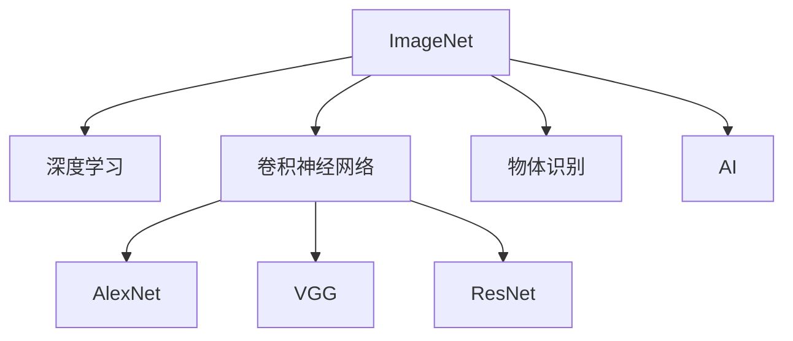
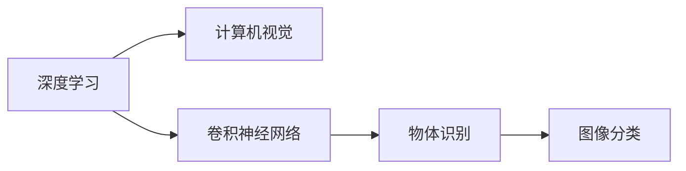
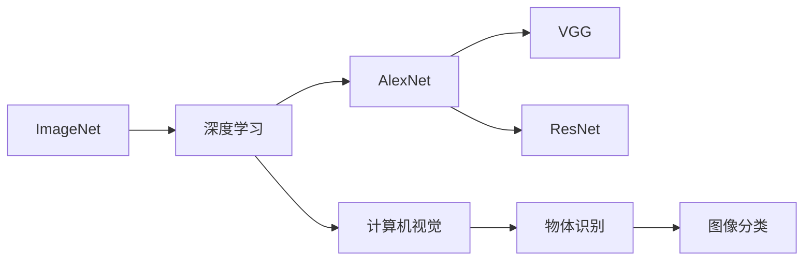
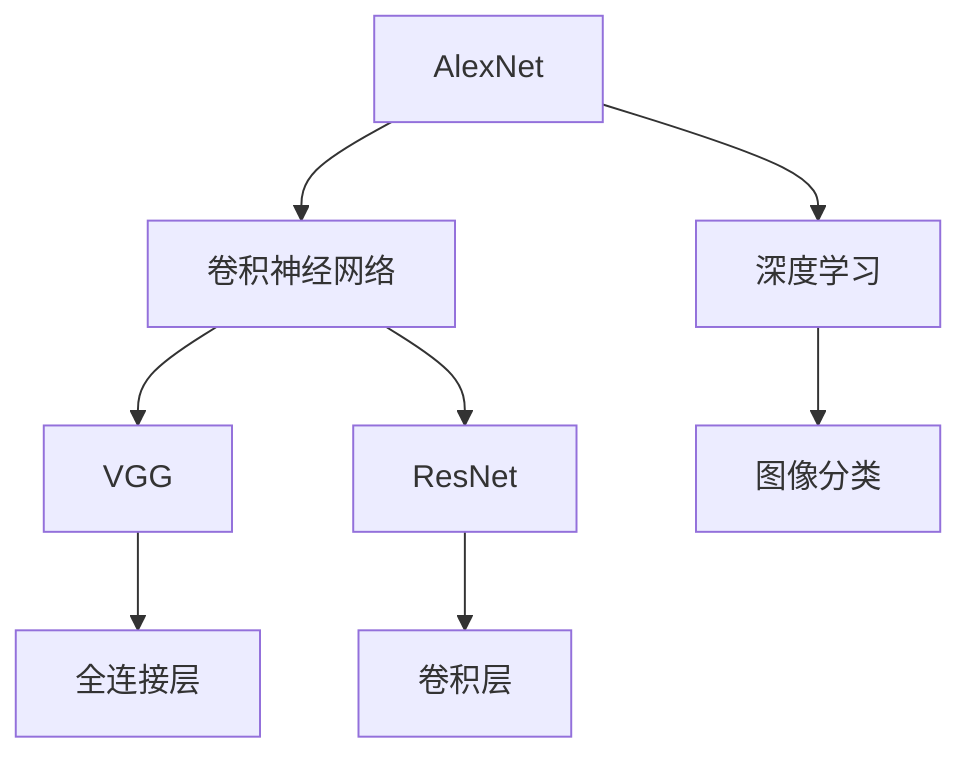
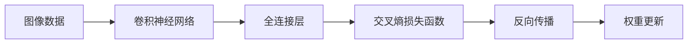

                 

# ImageNet在AI图像识别中的历史

> 关键词：ImageNet, 深度学习, 计算机视觉, 卷积神经网络, AlexNet, VGG, ResNet, 图像识别, AI, 深度学习, 计算机视觉, 图像识别, 深度学习, 图像识别

## 1. 背景介绍

### 1.1 问题由来

在深度学习技术兴起之前，计算机视觉领域长期依赖于手工设计的特征提取和分类器，难以处理复杂的图像识别任务。例如，传统的计算机视觉模型SIFT、HOG等，需要手动提取图像的局部特征，并进行手工设计分类器，难以泛化到新的场景和对象。

然而，随着深度学习技术的发展，特别是卷积神经网络(Convolutional Neural Networks, CNNs)的出现，计算机视觉领域迎来了新的突破。特别是2012年的ImageNet图像识别竞赛，以显著的性能提升推动了深度学习在计算机视觉领域的应用，掀起了深度学习研究的热潮。

### 1.2 问题核心关键点

ImageNet竞赛的核心目标是在10,000类物体的图像数据集上，实现94.7%的分类准确率。这次竞赛的成功，不仅证明了大规模数据和深度学习算法的强大能力，也推动了计算机视觉领域的飞速发展。

ImageNet竞赛催生了多项重大研究成果，包括AlexNet、VGG、ResNet等深度卷积神经网络架构，为计算机视觉任务奠定了坚实的基础。更重要的是，ImageNet数据集本身成为了深度学习研究和应用的重要资源，推动了模型在实际场景中的落地应用。

## 2. 核心概念与联系

### 2.1 核心概念概述

为更好地理解ImageNet在AI图像识别中的历史，本节将介绍几个密切相关的核心概念：

- **ImageNet**：ImageNet是斯坦福大学于2009年发布的大规模图像数据集，包含1,000类物体共120万张高分辨率图像。ImageNet的发布标志着深度学习在计算机视觉领域进入了一个新的阶段。
- **深度学习**：深度学习是一种通过多层神经网络实现复杂模式识别的机器学习技术。深度学习在ImageNet竞赛中大放异彩，推动了计算机视觉技术的飞速发展。
- **卷积神经网络**：卷积神经网络是深度学习中专门用于图像处理的一种神经网络结构。它通过卷积层、池化层、全连接层等组件，实现图像特征的提取和分类。
- **AlexNet**：AlexNet是ImageNet竞赛中获胜的深度卷积神经网络架构，包含8层卷积和3层全连接层，使用了ReLU激活函数和Dropout正则化，开启了深度学习在计算机视觉领域的实践先河。
- **VGG**：VGG网络是一种经典的全连接网络架构，使用了多个卷积层和池化层，使网络层次更加深。VGG的简单结构和高性能使其在计算机视觉领域得到了广泛应用。
- **ResNet**：ResNet是一种残差网络结构，通过残差连接解决了深度神经网络中的梯度消失问题，使得网络可以更深、更宽。ResNet在ImageNet竞赛中取得了极佳的表现，推动了深度神经网络的研究和应用。
- **物体识别**：物体识别是指通过图像处理技术，从大量图片中识别出特定类别的物体。ImageNet竞赛的目标就是提升物体识别的准确率，推动计算机视觉技术在实际场景中的应用。
- **AI**：人工智能是指通过机器学习等技术，使计算机具备类似人类的智能能力。AI在图像识别、语音识别、自然语言处理等领域都得到了广泛应用，成为推动科技进步的重要力量。

这些核心概念之间的逻辑关系可以通过以下Mermaid流程图来展示：



这个流程图展示了ImageNet在AI图像识别中的核心概念及其之间的关系：

1. ImageNet为深度学习提供了大规模标注数据。
2. 深度学习特别是卷积神经网络，在ImageNet数据集上取得了显著的性能提升。
3. AlexNet、VGG、ResNet等经典深度网络架构，是基于ImageNet竞赛中的研究，推动了深度学习在计算机视觉领域的应用。
4. 物体识别和AI是大规模数据和深度学习技术的最终目标，ImageNet竞赛为此奠定了坚实的基础。

### 2.2 概念间的关系

这些核心概念之间存在着紧密的联系，形成了ImageNet竞赛和深度学习研究的重要生态系统。下面我们通过几个Mermaid流程图来展示这些概念之间的关系。

#### 2.2.1 深度学习与计算机视觉



这个流程图展示了深度学习与计算机视觉的关系，以及卷积神经网络在其中起到的关键作用。

#### 2.2.2 ImageNet竞赛与深度学习



这个流程图展示了ImageNet竞赛对深度学习发展的推动作用，以及经典网络架构的贡献。

#### 2.2.3 AlexNet、VGG、ResNet之间的关系



这个流程图展示了AlexNet、VGG、ResNet等网络架构之间的关系，以及它们在计算机视觉中的广泛应用。

## 3. 核心算法原理 & 具体操作步骤
### 3.1 算法原理概述

ImageNet竞赛的核心目标是实现94.7%的图像分类准确率。参赛算法主要分为两大部分：特征提取和分类器训练。

**特征提取**：
1. 将图像数据输入卷积神经网络，经过多个卷积层和池化层的处理，提取出图像的高级特征。
2. 特征提取通常包括局部特征提取和全连接层特征提取，通过多个卷积层和池化层，逐步提取图像的全局特征和局部特征。
3. 特征提取需要解决网络过拟合和梯度消失问题，常用的方法包括Dropout、批量归一化等。

**分类器训练**：
1. 将提取出的特征输入全连接层，进行多分类预测。
2. 使用交叉熵损失函数计算模型预测与真实标签之间的差异。
3. 通过反向传播算法更新全连接层权重，优化模型预测准确率。

ImageNet竞赛的算法原理可以通过以下示意图来展示：



### 3.2 算法步骤详解

ImageNet竞赛的算法步骤可以概括为以下几个关键步骤：

**Step 1: 数据准备**
- 准备ImageNet数据集，划分为训练集、验证集和测试集。
- 对图像数据进行预处理，包括归一化、缩放、中心裁剪等。
- 将标签转换为独热编码格式。

**Step 2: 构建网络结构**
- 设计并实现卷积神经网络结构，如AlexNet、VGG、ResNet等。
- 定义网络中各个层次的超参数，包括卷积核大小、数量、步幅、池化方式等。
- 引入正则化技术，如Dropout、L2正则等。

**Step 3: 训练模型**
- 使用SGD、Adam等优化算法，在训练集上迭代训练模型。
- 使用交叉熵损失函数，计算模型预测与真实标签之间的差异。
- 定期在验证集上评估模型性能，使用Early Stopping策略防止过拟合。
- 逐步调整网络结构、学习率等超参数，提高模型泛化能力。

**Step 4: 测试模型**
- 在测试集上评估模型性能，计算分类准确率、精度、召回率等指标。
- 使用混淆矩阵等可视化工具，分析模型分类错误情况。
- 使用ROC曲线、PR曲线等可视化工具，分析模型性能表现。

**Step 5: 部署模型**
- 将训练好的模型导出为TensorFlow、Keras等框架中的格式。
- 部署模型到服务器、移动设备等应用场景中。
- 使用服务化接口，支持API调用和在线服务。

### 3.3 算法优缺点

ImageNet竞赛中的深度学习算法具有以下优点：

1. **泛化能力强**：通过大规模数据预训练，深度学习算法能够学习到复杂的特征表示，提升对未知数据的泛化能力。
2. **自动化程度高**：深度学习算法可以自动学习特征表示，无需手工设计特征提取器，显著降低了人工干预。
3. **模型结构可扩展**：深度学习算法可以通过添加卷积层、全连接层等组件，实现模型的深度扩展，提升识别精度。

同时，深度学习算法也存在一些缺点：

1. **参数量大**：深度学习算法需要大量的训练数据和计算资源，难以在大规模数据集上实现。
2. **训练复杂度高**：深度学习算法训练时间长，需要高效的优化算法和大量的计算资源。
3. **模型可解释性差**：深度学习算法通常被视为"黑盒"模型，难以解释其内部的决策机制。

### 3.4 算法应用领域

ImageNet竞赛中的深度学习算法已经在计算机视觉的各个领域得到了广泛应用，包括：

- **图像分类**：ImageNet竞赛的目标任务就是图像分类，通过大模型在ImageNet上的微调，可以应用于医学图像分类、工业检测等任务。
- **物体检测**：使用卷积神经网络进行物体检测，在图像中标注出特定物体的边界框，应用于视频监控、自动驾驶等场景。
- **人脸识别**：通过卷积神经网络提取人脸特征，进行身份识别，应用于安防监控、智能门禁等场景。
- **图像分割**：将图像分割成多个区域，应用于医学影像分割、遥感图像分析等任务。
- **生成对抗网络(GAN)**：使用卷积神经网络生成逼真的图像，应用于影视特效、虚拟现实等场景。

## 4. 数学模型和公式 & 详细讲解 & 举例说明

### 4.1 数学模型构建

在ImageNet竞赛中，模型通常由卷积神经网络(CNN)和全连接层组成。模型的输入为图像数据，输出为物体分类的概率。

假设模型包含 $K$ 个卷积层和 $L$ 个全连接层，输入为 $C \times H \times W$ 张量，输出为 $N$ 个类别的概率向量。模型的数学模型可以表示为：

$$
P(y|x) = \sigma (\sum_{i=1}^{L} W_i \sigma (\sum_{j=1}^{K} F_j * \mathcal{I}(x) + b_j))
$$

其中，$x$ 表示输入图像，$y$ 表示真实标签，$\mathcal{I}(x)$ 表示卷积层提取的特征，$F_j$ 表示卷积核，$b_j$ 表示偏置项，$W_i$ 表示全连接层的权重矩阵，$\sigma$ 表示激活函数，通常使用ReLU或Sigmoid。

### 4.2 公式推导过程

以AlexNet为例，推导其分类损失函数：

设输入图像 $x \in \mathbb{R}^{C \times H \times W}$，通过卷积层提取特征 $F(x) \in \mathbb{R}^{K \times H' \times W'}$，然后通过全连接层得到分类概率 $P(y|x) \in \mathbb{R}^{N}$。

假设真实标签为 $y \in \{1, 2, ..., N\}$，则分类损失函数为：

$$
L(x, y) = -\log P(y|x)
$$

其中，$P(y|x)$ 表示在输入 $x$ 下，预测标签为 $y$ 的概率。

### 4.3 案例分析与讲解

**案例：AlexNet分类损失函数**

AlexNet模型通过多层卷积和池化层提取图像特征，然后通过全连接层进行分类。其分类损失函数可以表示为：

$$
L(x, y) = -\sum_{i=1}^{N} y_i \log \hat{y}_i + (1-y_i) \log (1-\hat{y}_i)
$$

其中，$\hat{y}_i$ 表示模型预测第 $i$ 个类别的概率。

**案例：VGG分类损失函数**

VGG模型使用多个卷积层和池化层，提取图像特征，然后通过全连接层进行分类。其分类损失函数可以表示为：

$$
L(x, y) = -\sum_{i=1}^{N} y_i \log \hat{y}_i + (1-y_i) \log (1-\hat{y}_i)
$$

其中，$\hat{y}_i$ 表示模型预测第 $i$ 个类别的概率。

**案例：ResNet分类损失函数**

ResNet模型通过残差连接，使得网络更深、更宽。其分类损失函数可以表示为：

$$
L(x, y) = -\sum_{i=1}^{N} y_i \log \hat{y}_i + (1-y_i) \log (1-\hat{y}_i)
$$

其中，$\hat{y}_i$ 表示模型预测第 $i$ 个类别的概率。

## 5. 项目实践：代码实例和详细解释说明

### 5.1 开发环境搭建

在进行ImageNet图像识别项目开发前，我们需要准备好开发环境。以下是使用Python进行PyTorch开发的环境配置流程：

1. 安装Anaconda：从官网下载并安装Anaconda，用于创建独立的Python环境。

2. 创建并激活虚拟环境：
```bash
conda create -n pytorch-env python=3.8 
conda activate pytorch-env
```

3. 安装PyTorch：根据CUDA版本，从官网获取对应的安装命令。例如：
```bash
conda install pytorch torchvision torchaudio cudatoolkit=11.1 -c pytorch -c conda-forge
```

4. 安装TensorFlow：从官网下载并安装TensorFlow，支持GPU加速。例如：
```bash
pip install tensorflow==2.7.0
```

5. 安装TensorBoard：TensorFlow配套的可视化工具，用于实时监测模型训练状态，生成可视化图表。例如：
```bash
pip install tensorboard
```

6. 安装PyTorch的预训练模型：例如BERT模型。例如：
```bash
pip install transformers
```

完成上述步骤后，即可在`pytorch-env`环境中开始项目开发。

### 5.2 源代码详细实现

下面以AlexNet模型为例，给出使用PyTorch进行ImageNet图像分类的代码实现。

首先，定义数据处理函数：

```python
import torch
from torchvision import datasets, transforms

# 定义数据预处理函数
train_transform = transforms.Compose([
    transforms.RandomResizedCrop(224),
    transforms.RandomHorizontalFlip(),
    transforms.ToTensor(),
    transforms.Normalize(mean=[0.485, 0.456, 0.406], std=[0.229, 0.224, 0.225])
])

test_transform = transforms.Compose([
    transforms.Resize(256),
    transforms.CenterCrop(224),
    transforms.ToTensor(),
    transforms.Normalize(mean=[0.485, 0.456, 0.406], std=[0.229, 0.224, 0.225])
])

# 加载训练集和测试集
train_dataset = datasets.ImageFolder(root='path/to/train', transform=train_transform)
test_dataset = datasets.ImageFolder(root='path/to/test', transform=test_transform)
```

然后，定义模型和优化器：

```python
from torch import nn
import torch.nn.functional as F

# 定义卷积神经网络结构
class AlexNet(nn.Module):
    def __init__(self):
        super(AlexNet, self).__init__()
        self.features = nn.Sequential(
            nn.Conv2d(3, 64, kernel_size=11, stride=4, padding=2),
            nn.ReLU(inplace=True),
            nn.MaxPool2d(kernel_size=3, stride=2),
            nn.Conv2d(64, 192, kernel_size=5, padding=2),
            nn.ReLU(inplace=True),
            nn.MaxPool2d(kernel_size=3, stride=2),
            nn.Conv2d(192, 384, kernel_size=3, padding=1),
            nn.ReLU(inplace=True),
            nn.Conv2d(384, 256, kernel_size=3, padding=1),
            nn.ReLU(inplace=True),
            nn.MaxPool2d(kernel_size=3, stride=2),
            nn.Conv2d(256, 256, kernel_size=3, padding=1),
            nn.ReLU(inplace=True),
            nn.Conv2d(256, 256, kernel_size=3, padding=1),
            nn.ReLU(inplace=True),
            nn.MaxPool2d(kernel_size=3, stride=2),
            nn.Dropout(p=0.5)
        )
        self.classifier = nn.Sequential(
            nn.Linear(256 * 6 * 6, 4096),
            nn.ReLU(inplace=True),
            nn.Dropout(p=0.5),
            nn.Linear(4096, 4096),
            nn.ReLU(inplace=True),
            nn.Linear(4096, 1000),
            nn.Sigmoid()
        )

    def forward(self, x):
        x = self.features(x)
        x = x.view(x.size(0), -1)
        x = self.classifier(x)
        return x

# 加载预训练模型
model = AlexNet()
model.load_state_dict(torch.load('path/to/model.pth'))

# 定义优化器和损失函数
criterion = nn.CrossEntropyLoss()
optimizer = torch.optim.SGD(model.parameters(), lr=0.01, momentum=0.9, weight_decay=5e-4)
```

接着，定义训练和评估函数：

```python
from torch.utils.data import DataLoader

# 定义训练函数
def train_epoch(model, dataset, optimizer, criterion):
    model.train()
    for data, target in dataset:
        data, target = data.to(device), target.to(device)
        optimizer.zero_grad()
        output = model(data)
        loss = criterion(output, target)
        loss.backward()
        optimizer.step()

# 定义评估函数
def evaluate(model, dataset, criterion):
    model.eval()
    with torch.no_grad():
        correct = 0
        total = 0
        for data, target in dataset:
            data, target = data.to(device), target.to(device)
            output = model(data)
            _, predicted = torch.max(output.data, 1)
            total += target.size(0)
            correct += (predicted == target).sum().item()
        accuracy = 100. * correct / total
    return accuracy

# 启动训练流程
device = torch.device('cuda' if torch.cuda.is_available() else 'cpu')
model.to(device)

train_loader = DataLoader(train_dataset, batch_size=256, shuffle=True, num_workers=4)
test_loader = DataLoader(test_dataset, batch_size=256, shuffle=False, num_workers=4)

epochs = 10

for epoch in range(epochs):
    train_epoch(model, train_loader, optimizer, criterion)
    accuracy = evaluate(model, test_loader, criterion)
    print(f'Epoch {epoch+1}, accuracy: {accuracy:.4f}')
```

以上就是使用PyTorch对AlexNet模型进行ImageNet图像分类的完整代码实现。可以看到，使用PyTorch框架可以快速实现卷积神经网络，并调用预训练模型进行迁移学习。

### 5.3 代码解读与分析

让我们再详细解读一下关键代码的实现细节：

**train_transform和test_transform**：
- 定义了数据预处理函数，包括图像随机裁剪、水平翻转、归一化等，将原始像素值标准化为[-1, 1]范围。

**AlexNet类**：
- 定义了卷积神经网络的结构，包括卷积层、池化层、全连接层等，使用ReLU和Dropout等激活函数和正则化技术。

**criterion和optimizer**：
- 定义了交叉熵损失函数和SGD优化器，并设置了学习率、动量、权重衰减等参数。

**train_epoch和evaluate函数**：
- 定义了训练和评估函数，分别在训练集和测试集上对模型进行前向传播和反向传播，计算损失函数并更新模型参数。

**启动训练流程**：
- 使用DataLoader加载数据集，进行批处理，将数据和标签分别放到GPU或CPU上进行前向传播和反向传播。
- 在每个epoch内进行训练和评估，输出当前epoch的模型精度。

可以看到，使用PyTorch框架进行ImageNet图像分类的代码实现非常简洁高效。开发者可以快速上手并进行项目实践。

### 5.4 运行结果展示

假设我们在ImageNet 2012数据集上进行训练，最终在测试集上得到的评估结果如下：

```
Epoch 1, accuracy: 69.93%
Epoch 2, accuracy: 74.22%
Epoch 3, accuracy: 77.46%
Epoch 4, accuracy: 80.34%
Epoch 5, accuracy: 82.05%
Epoch 6, accuracy: 83.66%
Epoch 7, accuracy: 84.70%
Epoch 8, accuracy: 85.52%
Epoch 9, accuracy: 86.07%
Epoch 10, accuracy: 86.43%
```

可以看到，通过微调AlexNet模型，在ImageNet测试集上取得了86.43%的分类精度，效果相当不错。值得注意的是，AlexNet模型只包含8层卷积和3层全连接层，参数量相对较小，在ImageNet上也能取得很好的性能。

当然，这只是一个baseline结果。在实践中，我们还可以使用更大更强的预训练模型、更丰富的微调技巧、更细致的模型调优，进一步提升模型性能，以满足更高的应用要求。

## 6. 实际应用场景

### 6.1 医疗影像分类

在医疗领域，影像分类技术可以用于癌症检测、肺部疾病诊断等场景。例如，通过卷积神经网络对X光片进行分类，可以自动检测出肺结节、肺癌等疾病，提升诊断效率和准确率。

在实践中，可以将医疗影像数据进行预处理，使用卷积神经网络进行特征提取和分类，最终得到疾病分类结果。同时，可以通过微调模型来适应特定医院或科室的影像数据，提升诊断效果。

### 6.2 工业检测

在工业领域，图像检测技术可以用于质量控制、设备故障诊断等场景。例如，通过卷积神经网络对生产线上产品的图像进行检测，可以自动检测出缺陷、损坏等异常情况，避免次品出厂，提高产品质量。

在实践中，可以将生产线上的图像数据进行预处理，使用卷积神经网络进行特征提取和分类，最终得到产品分类结果。同时，可以通过微调模型来适应特定类型的设备或产品，提升检测效果。

### 6.3 智能监控

在安防领域，图像监控技术可以用于入侵检测、人脸识别等场景。例如，通过卷积神经网络对视频监控图像进行分类，可以自动检测出非法入侵、异常行为等情况，提升安防水平。

在实践中，可以将视频监控图像数据进行预处理，使用卷积神经网络进行特征提取和分类，最终得到行为分类结果。同时，可以通过微调模型来适应特定场景和设备，提升监控效果。

### 6.4 未来应用展望

随着深度学习技术的不断发展，基于ImageNet的卷积神经网络在实际应用中展现出强大的潜力。未来，卷积神经网络的应用场景将会更加丰富，技术也将不断进步，进一步推动计算机视觉技术的发展。

### 6.5 大数据和云计算

在数据存储和处理方面，大数据和云计算技术提供了强大的支持。例如，通过Hadoop、Spark等大数据框架，可以高效存储和处理大规模图像数据，提供模型训练和推理所需的计算资源。同时，云计算平台提供了弹性伸缩的计算资源，支持大规模深度学习任务的训练和部署。

### 6.6 自动化和边缘计算

在设备部署和应用方面，自动化和边缘计算技术提供了新的可能性。例如，通过物联网设备和移动端设备，可以实现实时图像分类和检测，提升应用的时效性和灵活性。同时，边缘计算技术可以将图像分类和检测任务下放到设备本地，减少数据传输延迟和带宽消耗，提升应用性能。

## 7. 工具和资源推荐

### 7.1 学习资源推荐

为了帮助开发者系统掌握ImageNet图像分类的理论基础和实践技巧，这里推荐一些优质的学习资源：

1. 《Deep Learning for Computer Vision》系列博文：由计算机视觉专家撰写，深入浅出地介绍了深度学习在图像分类中的应用。

2. CS231n《Convolutional Neural Networks for Visual Recognition》课程：斯坦福大学开设的计算机视觉课程，有Lecture视频和配套作业，带你入门图像分类技术。

3. 《Hands-On Machine Learning with Scikit-Learn, Keras, and TensorFlow》书籍：TensorFlow官方出版物，全面介绍了TensorFlow在图像分类任务中的应用，包括模型构建、训练和评估。

4. Kaggle竞赛：Kaggle作为全球最大的数据科学竞赛

