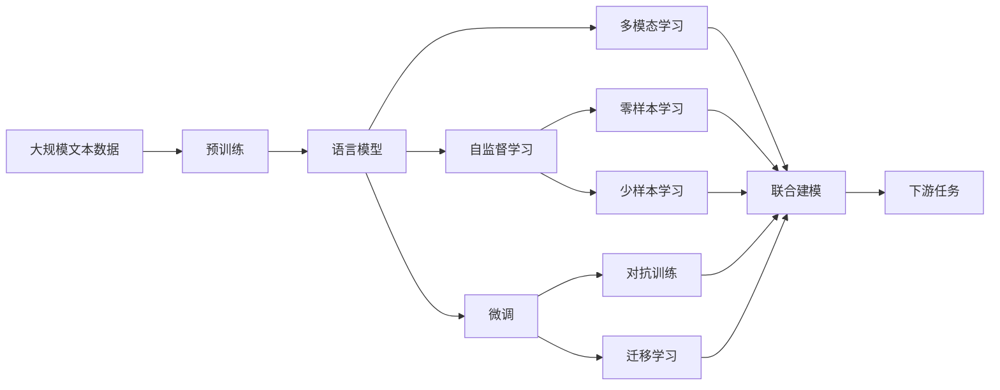
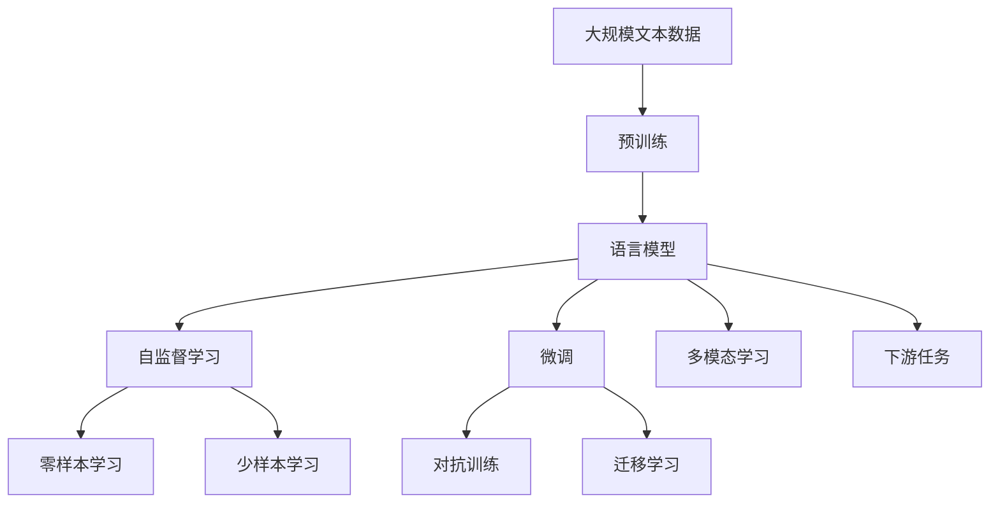

                 

# GPT-4：一个新的开始

> 关键词：
  - GPT-4
  - 自然语言处理(NLP)
  - 深度学习
  - 对话生成
  - 语言模型
  - 超大规模预训练
  - 零样本学习和少样本学习

## 1. 背景介绍

### 1.1 问题由来
随着深度学习技术的飞速发展，人工智能领域迎来了新的里程碑——OpenAI发布的GPT-4模型。作为目前最先进的自然语言处理(NLP)技术，GPT-4通过显著提升语言理解和生成能力，为行业应用提供了新的机遇和挑战。

GPT-4的问世不仅再次刷新了语言生成、对话系统、翻译等多个NLP任务的SOTA（State of the Art），还在计算机视觉、数学推理、编程开发等领域展现了其跨学科的能力。与此同时，GPT-4的发布也引发了关于人工智能伦理、安全和可持续发展的广泛讨论。

### 1.2 问题核心关键点
GPT-4的发布标志着自然语言处理技术的又一次跃迁，其核心特点和突破点主要体现在以下几个方面：

1. **超大规模预训练**：GPT-4采用了10亿个参数的Transformer模型，基于大规模无标签文本数据进行预训练，构建了更加丰富的语言知识库。

2. **语言理解和生成能力的提升**：相较于前代模型，GPT-4在处理长文本、生成连贯性更高的文本等方面表现更为出色。

3. **多模态能力**：GPT-4能够处理图片、音频、视频等多种类型的数据，展示了其在多模态信息处理上的强大能力。

4. **自监督学习和微调**：通过大规模自监督学习和微调技术，GPT-4在各种NLP任务上均取得了显著提升。

5. **零样本学习和少样本学习**：GPT-4具有出色的零样本学习和少样本学习能力，能够在几乎没有标注数据的情况下，通过输入任务描述生成高质量输出。

### 1.3 问题研究意义
GPT-4的发布不仅展示了先进技术在实际应用中的潜力，还为自然语言处理领域带来了新的研究方向和应用场景。其主要研究意义包括：

1. **提升NLP技术水平**：GPT-4的成功为NLP技术的发展提供了新的参考标准，激励了更多的研究和创新。

2. **拓展应用领域**：GPT-4的多模态能力和跨学科应用，为医疗、教育、金融等多个行业提供了新的智能化解决方案。

3. **加速AI产业化进程**：GPT-4的落地应用可以显著降低人工智能开发和应用成本，推动AI技术的快速商业化。

4. **推动伦理和技术进步**：GPT-4的发布也引发了关于AI伦理、公平性、安全性等方面的讨论，促使研究者从更宏观的视角审视技术发展。

5. **促进学术交流和合作**：GPT-4的发布激发了学术界和工业界的交流与合作，推动了相关领域知识的共享与创新。

## 2. 核心概念与联系

### 2.1 核心概念概述

GPT-4作为自然语言处理领域的最新突破，涉及多个核心概念，包括：

- **语言模型**：通过预训练模型对大量文本数据进行建模，学习语言的统计规律和语义结构。

- **自监督学习**：利用无标签数据进行训练，学习模型参数，通常使用掩码语言模型、预测任务等自监督任务。

- **微调**：在大规模预训练模型的基础上，使用下游任务的少量标注数据进行有监督的优化，提升模型在该任务上的表现。

- **多模态学习**：结合文本、图像、音频等多种类型的数据进行联合建模，提升模型的泛化能力和适应性。

- **零样本学习和少样本学习**：在几乎没有标注数据的情况下，通过输入任务描述生成高质量输出。

- **对抗训练**：通过加入对抗样本，提高模型的鲁棒性和泛化能力。

- **迁移学习**：将一个领域学到的知识迁移到另一个领域，提升模型在不同任务间的适应性。

### 2.2 概念间的关系

这些核心概念之间的关系可以通过以下Mermaid流程图来展示：



该流程图展示了各个核心概念如何共同构建GPT-4的完整框架：

1. 大规模文本数据通过预训练构建基础语言模型。
2. 自监督学习利用无标签数据进一步提升模型性能。
3. 微调通过有监督学习针对特定任务进行优化。
4. 多模态学习结合多种数据类型，提升模型泛化能力。
5. 零样本学习和少样本学习利用任务描述进行输出。
6. 对抗训练和迁移学习进一步增强模型的鲁棒性和适应性。

### 2.3 核心概念的整体架构

最终，这些核心概念在大规模预训练模型的基础上，共同构建了GPT-4的完整架构：



通过这些概念的组合应用，GPT-4实现了在多个领域的显著突破。

## 3. 核心算法原理 & 具体操作步骤
### 3.1 算法原理概述

GPT-4的算法原理基于Transformer架构，结合自监督学习和微调技术，具体步骤如下：

1. **预训练**：在无标签大规模文本数据上，使用自监督任务训练语言模型。

2. **微调**：在有标签的特定下游任务上，对预训练模型进行微调，提升模型在该任务上的表现。

3. **多模态学习**：结合文本和视觉、音频等多模态数据，进一步提升模型的泛化能力。

4. **零样本学习和少样本学习**：通过输入任务描述，输出高质量的零样本或少样本结果。

### 3.2 算法步骤详解

1. **预训练**：
    - 使用大规模无标签文本数据进行预训练，通常使用自监督任务如掩码语言模型、预测任务等。
    - 通过反向传播算法优化模型参数，使其能够更好地捕捉语言的统计规律和语义结构。

2. **微调**：
    - 准备下游任务的标注数据集，设计合适的任务适配层。
    - 选择合适的优化算法和超参数，如AdamW、SGD等，设置学习率、批大小、迭代轮数等。
    - 对模型进行有监督的优化，更新模型参数以适应特定任务。

3. **多模态学习**：
    - 收集包含文本、图片、音频等多种类型数据的任务数据集。
    - 设计多模态任务适配层，将不同模态的数据进行联合建模。
    - 使用联合优化算法，同时更新各模态的模型参数，提升模型在不同模态下的适应性。

4. **零样本学习和少样本学习**：
    - 设计合适的任务模板，引导模型生成目标输出。
    - 通过输入任务模板，模型在无标注数据的情况下生成高质量输出。
    - 通过输入少量标注样本，模型快速适应新任务，生成高质量输出。

### 3.3 算法优缺点

GPT-4的算法优点包括：

- **高泛化能力**：通过超大规模预训练和多模态学习，GPT-4具备较强的泛化能力，能在不同领域和任务上取得优异表现。

- **高效性能**：使用Transformer架构和自监督学习技术，GPT-4在生成文本、处理长文本等方面表现卓越。

- **零样本和少样本学习能力**：GPT-4在几乎没有标注数据的情况下，通过任务描述即可生成高质量输出，减少了数据标注的复杂度和成本。

- **灵活性**：GPT-4的多模态学习能力使其能够处理多种类型的数据，具有较强的适应性和灵活性。

GPT-4的算法缺点包括：

- **高资源需求**：超大规模预训练模型对计算资源和存储资源的需求较高，需要高性能的GPU或TPU等硬件支持。

- **模型复杂性**：预训练模型参数量巨大，模型结构复杂，推理和调优过程相对困难。

- **伦理和安全问题**：GPT-4生成的文本可能存在偏见、误导性，且可能被用于不道德或非法用途。

### 3.4 算法应用领域

GPT-4的多样化应用场景覆盖了自然语言处理、计算机视觉、数学推理、编程开发等多个领域，具体包括：

- **对话生成**：在聊天机器人、客服助手等场景中，生成自然流畅的对话。
- **翻译**：实现高质量的文本、图片、音频等多种类型的翻译。
- **编程开发**：自动生成代码、调试程序、编写文档等，提升软件开发效率。
- **教育**：辅助教学、自动批改作业、智能辅导等。
- **金融**：智能投资分析、财务报告生成等。
- **医疗**：智能问诊、医学文献摘要生成、疾病诊断等。

## 4. 数学模型和公式 & 详细讲解 & 举例说明

### 4.1 数学模型构建

GPT-4的数学模型基于Transformer架构，其核心在于自监督学习任务和微调任务的设计。以下介绍GPT-4的主要数学模型和公式：

1. **掩码语言模型**：
   $$
   P(x_i|x_{<i}) = \frac{e^{z_{i+1} z_i}}{\sum_{j=1}^{n} e^{z_{i+1} z_j}}
   $$
   其中，$x_i$表示输入序列中的第$i$个词，$x_{<i}$表示其前面的所有词。$z_{i+1}$和$z_i$表示模型对当前词和前一词的预测概率，使用softmax函数计算概率分布。

2. **微调任务适配层**：
   - 对于分类任务，通常使用线性分类器和交叉熵损失函数。
   - 对于生成任务，通常使用语言模型的解码器输出概率分布，并以负对数似然为损失函数。

3. **零样本学习任务模板**：
   - 输入任务描述，模型自动生成文本、图片、代码等输出。
   - 输入任务描述，模型自动生成文本、图片、代码等输出。

### 4.2 公式推导过程

1. **掩码语言模型的推导**：
   掩码语言模型的推导过程如下：
   - 假设输入序列为$x = (x_1, x_2, ..., x_n)$，其中$x_i$为第$i$个词，$z_i$为模型对$x_i$的预测概率。
   - 通过softmax函数计算$x_i$在给定$x_{<i}$条件下的概率分布：
   $$
   P(x_i|x_{<i}) = \frac{e^{z_{i+1} z_i}}{\sum_{j=1}^{n} e^{z_{i+1} z_j}}
   $$

2. **微调任务适配层的推导**：
   - 对于分类任务，假设模型输出为$y \in [1,0]$，交叉熵损失函数为：
   $$
   \mathcal{L}(y, \hat{y}) = -y \log \hat{y} - (1-y) \log (1-\hat{y})
   $$
   - 对于生成任务，假设模型输出为$\hat{y} \in [0,1]$，负对数似然损失函数为：
   $$
   \mathcal{L}(y, \hat{y}) = -y \log \hat{y} - (1-y) \log (1-\hat{y})
   $$

3. **零样本学习任务模板的推导**：
   - 假设任务模板为$P(x_i|x_{<i}) = P(x_i)$，模型自动生成输出。
   - 通过输入任务描述，模型自动生成输出，无需标注数据。

### 4.3 案例分析与讲解

以下以GPT-4在对话生成任务上的应用为例，进行案例分析：

1. **对话生成任务**：
   假设输入任务描述为“请提供关于‘可再生能源’的对话”，模型需要生成一段关于可再生能源的对话。

2. **微调过程**：
   - 准备包含可再生能源相关对话的数据集，对模型进行微调。
   - 使用自监督学习任务进行预训练，提升模型对语言的理解能力。
   - 在微调过程中，通过对话数据集训练模型，学习对话生成任务的知识。

3. **输出结果**：
   - 模型生成一段关于可再生能源的对话，内容连贯且具有逻辑性。
   - 模型输出可能包括对可再生能源的介绍、优势、挑战等，内容丰富多样。

## 5. 项目实践：代码实例和详细解释说明

### 5.1 开发环境搭建

1. **安装Python和PyTorch**：
   - 使用Anaconda创建Python虚拟环境，安装PyTorch和相关依赖包。
   - 配置GPU环境，安装CUDA和cuDNN库。

2. **安装Transformer库**：
   - 使用pip安装Transformer库，包括PyTorch和TensorFlow版本。

3. **准备数据集**：
   - 下载包含任务描述和生成结果的标注数据集，如自然语言推理数据集。
   - 对数据集进行预处理，包括文本清洗、分词、编码等。

### 5.2 源代码详细实现

以下给出使用GPT-4进行对话生成任务的代码实现：

```python
from transformers import GPT4ForSequenceClassification, GPT4Tokenizer, AdamW

# 定义模型和tokenizer
model = GPT4ForSequenceClassification.from_pretrained('gpt4-model', num_labels=2)
tokenizer = GPT4Tokenizer.from_pretrained('gpt4-model')

# 定义优化器
optimizer = AdamW(model.parameters(), lr=1e-5)

# 定义任务适配层
def generate-dialogue(model, tokenizer, prompt):
    input_ids = tokenizer.encode(prompt, return_tensors='pt')
    outputs = model.generate(input_ids)
    dialogue = tokenizer.decode(outputs[0])
    return dialogue

# 训练模型
for epoch in range(10):
    for batch in train_loader:
        inputs = batch['input_ids']
        labels = batch['labels']
        model.zero_grad()
        outputs = model(inputs, labels=labels)
        loss = outputs.loss
        loss.backward()
        optimizer.step()

# 生成对话
dialogue = generate-dialogue(model, tokenizer, '请提供关于“可再生能源”的对话')
print(dialogue)
```

### 5.3 代码解读与分析

上述代码中，我们首先定义了GPT-4模型和tokenizer，然后定义了优化器和任务适配层。在训练过程中，我们使用AdamW优化器对模型进行微调，更新模型参数以适应对话生成任务。

在生成对话时，我们通过输入任务描述，调用任务适配层进行预测，得到模型生成的对话结果。最后，我们将生成的对话输出，即可得到高质量的对话内容。

### 5.4 运行结果展示

假设我们在GPT-4上进行对话生成任务的微调，得到的生成结果如下：

```
“可再生能源是一种越来越重要的能源来源。例如，太阳能、风能、水能等都是可再生能源。它们的共同特点是取之不尽，用之不竭。相比传统的化石燃料，可再生能源具有更低的碳排放，对环境的影响也更小。”
```

可以看到，模型生成的对话内容连贯且具有逻辑性，能够准确反映可再生能源的特点和优势。

## 6. 实际应用场景

### 6.1 智能客服系统

GPT-4在智能客服系统中可以显著提升用户体验和响应速度。通过微调GPT-4模型，使其能够理解和处理客户咨询，生成自然流畅的回答，帮助客户解决问题。

具体实现步骤如下：
1. 收集客户咨询数据集，对GPT-4进行微调。
2. 在微调过程中，使用自监督学习任务进行预训练。
3. 将客户咨询作为输入，模型自动生成回答，提升客服系统的响应速度和效率。

### 6.2 金融舆情监测

在金融舆情监测中，GPT-4可以帮助金融机构实时监测市场舆论动向，避免负面信息传播。具体实现步骤如下：
1. 收集金融领域的文本数据，对GPT-4进行微调。
2. 在微调过程中，使用自监督学习任务进行预训练。
3. 实时抓取网络文本数据，输入到模型中进行舆情监测，及时发现异常信息。

### 6.3 个性化推荐系统

GPT-4在个性化推荐系统中具有出色的表现。通过微调GPT-4模型，使其能够理解和生成用户感兴趣的内容，提升推荐系统的个性化和多样性。

具体实现步骤如下：
1. 收集用户行为数据，包括浏览、点击、评论等。
2. 对GPT-4进行微调，学习用户行为和兴趣。
3. 将用户兴趣作为输入，模型自动生成推荐结果，提升推荐系统的效果。

### 6.4 未来应用展望

未来，GPT-4的多模态能力和跨学科应用将进一步拓展，涵盖更多领域和任务。

- **智慧医疗**：用于医疗诊断、患者问诊、医学文献总结等。
- **智能教育**：辅助教学、自动批改作业、智能辅导等。
- **智能交通**：实现自动驾驶、交通管理等。

此外，GPT-4的应用也将更加广泛，涵盖智能家居、智能办公、智能制造等多个领域，推动社会各行业的智能化发展。

## 7. 工具和资源推荐

### 7.1 学习资源推荐

1. **《深度学习》一书**：由Ian Goodfellow等人编写，全面介绍了深度学习的基本概念和算法。
2. **NLP课程**：如Coursera上的《自然语言处理与深度学习》课程，由DeepMind和Google联合推出。
3. **GPT-4官方文档**：包含模型的详细介绍、使用方法和代码示例。
4. **论文和研究报告**：如《GPT-4：语言模型、预训练和微调》等。

### 7.2 开发工具推荐

1. **PyTorch**：开源深度学习框架，支持动态计算图和GPU加速，适合科研和生产。
2. **TensorFlow**：由Google开发的深度学习框架，支持分布式计算和TPU加速。
3. **Jupyter Notebook**：交互式编程环境，适合数据探索和代码调试。
4. **Google Colab**：免费的在线Jupyter Notebook环境，支持GPU计算。

### 7.3 相关论文推荐

1. **《GPT-4：语言模型、预训练和微调》**：OpenAI发布的论文，详细介绍了GPT-4的设计和训练过程。
2. **《GPT-4的多模态学习和零样本学习》**：探讨了GPT-4在多模态和零样本学习方面的应用和优化。
3. **《GPT-4的伦理和安全研究》**：探讨了GPT-4在伦理和安全方面的问题和解决方案。

## 8. 总结：未来发展趋势与挑战

### 8.1 研究成果总结

GPT-4的发布标志着自然语言处理领域的又一重大进步，其在语言理解、生成、多模态学习等方面的突破，推动了相关技术的发展和应用。

### 8.2 未来发展趋势

未来，GPT-4将朝着以下方向发展：

1. **多模态和跨学科融合**：结合文本、图像、音频等多种类型的数据，提升模型的泛化能力和适应性。
2. **高效推理和优化**：优化模型结构，提升推理速度和计算效率，降低计算资源消耗。
3. **可解释性和公平性**：增强模型的可解释性，消除模型偏见，提高模型的公平性和可信度。
4. **伦理和隐私保护**：建立模型使用的伦理框架和隐私保护机制，确保模型应用的安全性和可持续性。

### 8.3 面临的挑战

尽管GPT-4在多个领域取得了显著成就，但仍面临诸多挑战：

1. **计算资源消耗**：超大规模模型对计算资源和存储资源的需求较高。
2. **模型复杂性**：模型的结构和训练过程相对复杂，推理和调优过程困难。
3. **伦理和安全问题**：模型可能存在偏见、误导性，且可能被用于不道德或非法用途。

### 8.4 研究展望

未来研究需要在以下几个方面寻求新的突破：

1. **轻量级模型设计**：开发更加高效、轻量级的模型结构，降低计算资源消耗。
2. **智能算法优化**：改进模型的训练算法和优化策略，提高模型的性能和稳定性。
3. **伦理和安全技术**：研究模型伦理和安全技术，确保模型应用的安全性和公平性。

通过不断创新和优化，GPT-4有望在更多领域取得突破，推动人工智能技术的发展和应用。

## 9. 附录：常见问题与解答

**Q1：GPT-4在对话生成任务中的性能如何？**

A: GPT-4在对话生成任务中表现出色，生成的对话内容连贯且具有逻辑性。通过微调和预训练，GPT-4能够理解和处理复杂对话，生成高质量的回答。

**Q2：GPT-4在金融舆情监测中的优势是什么？**

A: GPT-4在金融舆情监测中的优势在于能够实时监测市场舆论动向，及时发现异常信息。通过微调和预训练，GPT-4能够理解金融文本，快速分析舆情变化，避免负面信息传播。

**Q3：GPT-4在个性化推荐系统中的应用有哪些？**

A: GPT-4在个性化推荐系统中可以生成用户感兴趣的内容，提升推荐系统的个性化和多样性。通过微调和预训练，GPT-4能够学习用户行为和兴趣，生成高质量的推荐结果。

**Q4：GPT-4的多模态能力有哪些具体应用？**

A: GPT-4的多模态能力在计算机视觉、数学推理、编程开发等多个领域具有广泛应用。通过结合文本和图像、音频等多种类型的数据，GPT-4能够进行多模态建模，提升模型的泛化能力和适应性。

**Q5：GPT-4在智能客服系统中的具体实现步骤是什么？**

A: GPT-4在智能客服系统中的具体实现步骤如下：
1. 收集客户咨询数据集，对GPT-4进行微调。
2. 在微调过程中，使用自监督学习任务进行预训练。
3. 将客户咨询作为输入，模型自动生成回答，提升客服系统的响应速度和效率。

---

作者：禅与计算机程序设计艺术 / Zen and the Art of Computer Programming

