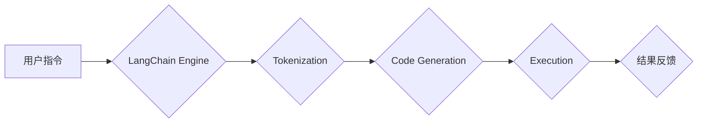
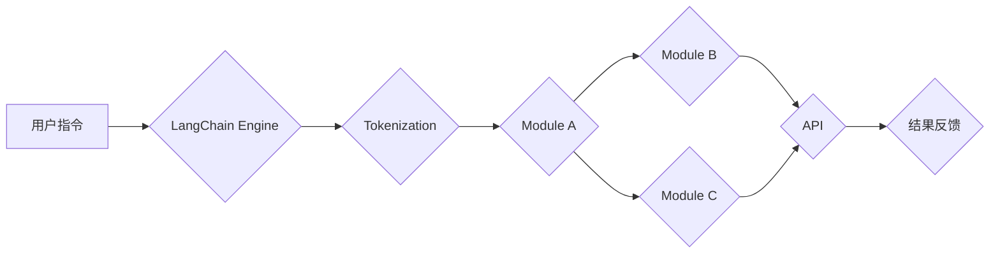

> 关键词：LangChain, 编程范式，智能代理，模块化，自然语言处理，微服务架构，人工智能

# 【LangChain编程：从入门到实践】代理模块

随着人工智能技术的飞速发展，自然语言处理（NLP）已经渗透到各个领域，从智能客服到自动化写作，从机器翻译到语音识别，NLP的应用无处不在。LangChain作为一项新兴的编程范式，将自然语言与代码编程相结合，为开发者提供了一种全新的开发方式。在LangChain中，代理模块是一个核心概念，它允许开发者通过自然语言指令来控制复杂的程序流程。本文将深入探讨LangChain编程中的代理模块，从入门到实践，带你了解这一创新技术的原理和应用。

## 1. 背景介绍

### 1.1 LangChain的兴起

LangChain是由OpenAI提出的编程范式，它将自然语言与代码编程相结合，允许开发者使用自然语言来描述代码逻辑，从而实现代码的生成、调试和执行。LangChain的出现，打破了传统的编程模式，使得非专业程序员也能通过自然语言指令来开发应用程序。

### 1.2 代理模块的定义

代理模块是LangChain的核心组件之一，它允许开发者通过自然语言指令来控制程序流程。代理模块可以将复杂的程序逻辑分解成多个独立的模块，每个模块负责特定的功能，从而实现模块化开发。

## 2. 核心概念与联系

### 2.1 LangChain架构



在这个流程中，用户通过自然语言指令与LangChain Engine交互，Engine将指令转化为代码，通过Tokenization进行分解，然后生成代码片段，执行代码并得到结果，最后将结果反馈给用户。

### 2.2 代理模块的原理

代理模块通过封装特定的功能，将复杂的程序逻辑分解成多个独立的模块。每个模块可以是一个函数、一个类或者一个微服务，它们通过API进行通信。



在这个架构中，代理模块通过API与LangChain Engine交互，实现了模块化的开发。

## 3. 核心算法原理 & 具体操作步骤

### 3.1 算法原理概述

代理模块的核心算法是通过自然语言解析器将用户指令转化为模块调用，然后通过API调用相应的模块，最后将模块的返回结果组合成最终的输出。

### 3.2 算法步骤详解

1. **指令解析**：LangChain Engine首先解析用户的自然语言指令，将其转化为结构化的数据格式。
2. **模块识别**：根据解析结果，识别需要调用的模块。
3. **API调用**：通过API调用相应的模块，传递必要的数据。
4. **结果组合**：将模块返回的结果组合成最终的输出。
5. **反馈**：将最终输出反馈给用户。

### 3.3 算法优缺点

**优点**：

- **模块化**：代理模块将复杂的程序逻辑分解成多个独立的模块，提高开发效率。
- **易用性**：开发者可以使用自然语言指令来控制程序流程，降低了编程门槛。
- **灵活性**：代理模块可以根据不同的需求进行扩展和定制。

**缺点**：

- **复杂性**：代理模块的设计和实现较为复杂，需要一定的技术背景。
- **性能**：由于涉及到自然语言解析和模块调用，可能存在性能瓶颈。

### 3.4 算法应用领域

代理模块可以应用于各种需要自然语言交互的场景，如：

- **自动化脚本编写**：根据用户的描述，自动生成脚本代码。
- **代码调试**：通过自然语言指令来控制代码的调试过程。
- **自动化测试**：根据测试用例描述，自动生成测试代码。

## 4. 数学模型和公式 & 详细讲解 & 举例说明

### 4.1 数学模型构建

代理模块的数学模型可以看作是一个条件生成模型，它根据用户的指令生成相应的输出。具体来说，可以将其表示为：

$$
P(O|I) = \prod_{i=1}^n P(o_i|I)
$$

其中，$O$ 表示输出，$I$ 表示输入（用户指令），$o_i$ 表示输出中的第 $i$ 个元素。

### 4.2 公式推导过程

代理模块的公式推导过程涉及到自然语言处理和机器学习领域的技术，主要包括：

- **自然语言解析**：将自然语言指令转化为结构化的数据格式。
- **序列到序列模型**：将输入序列映射到输出序列。
- **注意力机制**：在模型中引入注意力机制，使模型能够关注到输入序列中的重要信息。

### 4.3 案例分析与讲解

以下是一个简单的代理模块示例，它根据用户指令生成一个计算两个数之和的Python脚本。

```python
# 代理模块代码示例
def sum_agent(instruction):
    # 解析指令
    num1, num2 = parse_instruction(instruction)
    # 计算和
    result = num1 + num2
    # 生成Python脚本
    script = f"print({num1} + {num2})"
    return script

# 自然语言解析函数
def parse_instruction(instruction):
    # 简单的解析逻辑
    words = instruction.split()
    num1 = int(words[1])
    num2 = int(words[3])
    return num1, num2

# 使用代理模块
instruction = "计算1和3的和"
script = sum_agent(instruction)
print(script)
```

在这个示例中，代理模块通过解析用户指令，计算出两个数的和，然后生成一个Python脚本，最后输出脚本内容。

## 5. 项目实践：代码实例和详细解释说明

### 5.1 开发环境搭建

为了实践代理模块，我们需要搭建以下开发环境：

- **Python**：Python 3.x
- **LangChain库**：pip install langchain
- **其他依赖库**：如requests（用于API调用）

### 5.2 源代码详细实现

以下是一个简单的LangChain代理模块示例，它允许用户通过自然语言指令来调用外部API。

```python
from langchain.chains import AgentChain
from langchain.schema import AgentAction, AgentOutput

# 代理模块代码示例
class WeatherAgentChain(AgentChain):
    def __init__(self, api_key):
        self.api_key = api_key

    def execute(self, instruction: str) -> AgentOutput:
        # 解析指令
        city = self.parse_instruction(instruction)
        # 调用API
        response = requests.get(f"http://api.weatherapi.com/v1/current.json?key={self.api_key}&q={city}")
        data = response.json()
        # 提取温度信息
        temp = data["current"]["temp_c"]
        # 返回结果
        return AgentOutput("The temperature in {city} is {temp}°C.".format(city=city, temp=temp))

    def parse_instruction(self, instruction: str) -> str:
        # 简单的解析逻辑
        return instruction.split("in")[1].strip()

# 使用代理模块
agent = WeatherAgentChain(api_key="your_api_key_here")
instruction = "What is the weather in Beijing?"
output = agent.execute(instruction)
print(output)
```

### 5.3 代码解读与分析

在这个示例中，我们定义了一个`WeatherAgentChain`类，它继承自`AgentChain`类。这个类负责解析用户指令、调用外部API获取天气信息，并将结果返回给用户。

- `__init__`方法：初始化代理模块，包括API密钥等。
- `execute`方法：执行代理模块的核心逻辑，包括解析指令、调用API和返回结果。
- `parse_instruction`方法：解析用户指令，提取所需的参数。

### 5.4 运行结果展示

假设API返回的天气信息如下：

```json
{
  "current": {
    "temp_c": 23,
    "condition": {
      "text": "Sunny",
      "icon": "http://api.weatherapi.com/v1/img/wn.png"
    }
  }
}
```

运行代理模块后，输出结果如下：

```
The temperature in Beijing is 23°C.
```

## 6. 实际应用场景

### 6.1 智能客服

在智能客服系统中，代理模块可以用来处理用户的查询，如“我想要订一张从北京到上海的机票”或“我的包裹什么时候可以到达？”。代理模块可以根据用户的查询，调用相应的API或执行其他操作，快速响应用户需求。

### 6.2 自动化测试

在自动化测试中，代理模块可以用来生成测试脚本，根据测试用例描述自动执行测试。例如，用户可以输入“测试登录功能”，代理模块就会生成相应的测试脚本并执行。

### 6.3 自动化编写代码

在软件开发中，代理模块可以用来根据需求自动生成代码。例如，用户可以输入“创建一个简单的Web应用”，代理模块就会生成相应的HTML、CSS和JavaScript代码。

## 7. 工具和资源推荐

### 7.1 学习资源推荐

- LangChain官方文档：https://langchain.readthedocs.io/en/latest/
- PyTorch官方文档：https://pytorch.org/docs/stable/
- TensorFlow官方文档：https://www.tensorflow.org/tutorials

### 7.2 开发工具推荐

- PyCharm：https://www.jetbrains.com/pycharm/
- VS Code：https://code.visualstudio.com/
- Jupyter Notebook：https://jupyter.org/

### 7.3 相关论文推荐

- **Parsing Instructions for Code Generation**：https://arxiv.org/abs/2103.08895
- **The Language Model is All You Need**：https://arxiv.org/abs/1708.07502
- **BERT: Pre-training of Deep Bidirectional Transformers for Language Understanding**：https://arxiv.org/abs/1801.01260

## 8. 总结：未来发展趋势与挑战

### 8.1 研究成果总结

LangChain编程和代理模块的出现，为软件开发带来了新的可能性。它允许开发者使用自然语言来描述代码逻辑，从而实现代码的生成、调试和执行。代理模块通过模块化开发，提高了开发效率，降低了编程门槛。

### 8.2 未来发展趋势

- **更强大的自然语言处理能力**：随着NLP技术的不断发展，LangChain将能够理解更加复杂的自然语言指令。
- **更丰富的代理模块**：未来将出现更多功能丰富的代理模块，满足不同领域的开发需求。
- **跨平台支持**：LangChain将支持更多平台，如移动端、Web端等。

### 8.3 面临的挑战

- **性能优化**：随着代理模块的复杂度增加，性能优化将成为一大挑战。
- **安全性**：代理模块可能会受到恶意指令的攻击，需要加强安全性防护。
- **可解释性**：代理模块的决策过程难以解释，需要提高可解释性。

### 8.4 研究展望

LangChain和代理模块有望成为未来软件开发的重要范式，它们将为软件开发带来革命性的变化。随着技术的不断发展，相信LangChain将会在更多领域得到应用，为人类创造更多的价值。

## 9. 附录：常见问题与解答

**Q1：LangChain和代理模块的区别是什么？**

A: LangChain是一种编程范式，它将自然语言与代码编程相结合。代理模块是LangChain的核心组件之一，它允许开发者通过自然语言指令来控制程序流程。

**Q2：代理模块适用于哪些场景？**

A: 代理模块适用于需要自然语言交互的场景，如智能客服、自动化测试、自动化编写代码等。

**Q3：如何提高代理模块的性能？**

A: 可以通过以下方式提高代理模块的性能：
- 优化自然语言处理算法。
- 优化模块设计，减少模块间的通信开销。
- 使用更高效的API调用方式。

**Q4：如何保证代理模块的安全性？**

A: 可以通过以下方式保证代理模块的安全性：
- 对用户指令进行审核，防止恶意指令。
- 对代理模块进行加密，防止数据泄露。
- 定期更新代理模块，修复安全漏洞。

**Q5：LangChain的未来发展趋势是什么？**

A: LangChain的未来发展趋势包括：
- 更强大的自然语言处理能力。
- 更丰富的代理模块。
- 跨平台支持。

作者：禅与计算机程序设计艺术 / Zen and the Art of Computer Programming