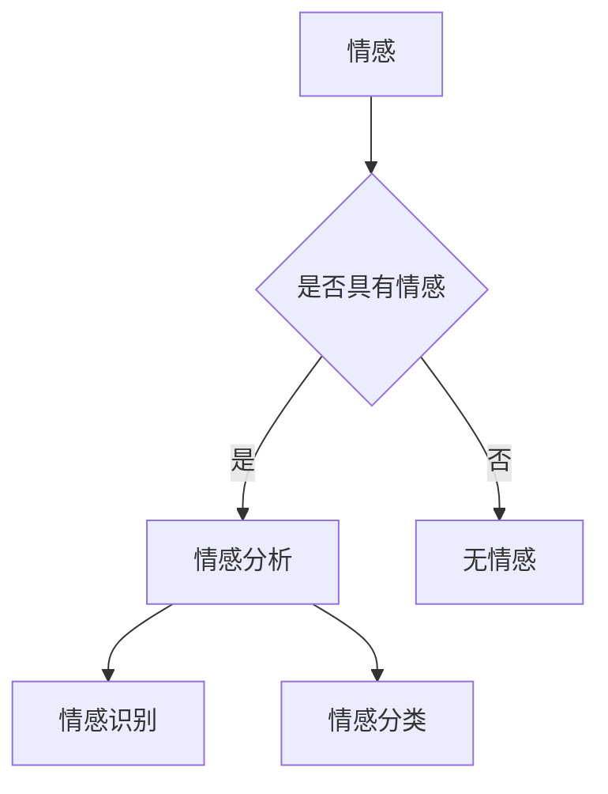

> 关键词：情感分析，AI情感识别，自然语言处理，深度学习，数据标注，模型评估

# 一切皆是映射：情感分析：AI理解人类情感

情感分析，作为自然语言处理（NLP）的一个重要分支，近年来在人工智能领域得到了飞速发展。它通过识别和解析文本中的情感倾向，使得机器能够理解人类的情感表达，从而在智能客服、舆情监测、产品推荐等领域发挥重要作用。本文将深入探讨情感分析的核心概念、算法原理、实践应用以及未来发展趋势。

## 1. 背景介绍

### 1.1 问题的由来

随着互联网的普及和社交媒体的兴起，人类每天产生的大量文本数据中包含了丰富的情感信息。这些信息对于企业、政府等机构来说，是了解公众情绪、市场趋势、政策影响等的重要来源。然而，传统的人工分析方式效率低下、成本高昂，难以满足快速发展的需求。因此，如何利用人工智能技术自动识别和解析文本中的情感，成为了迫切需要解决的问题。

### 1.2 研究现状

近年来，随着深度学习技术的快速发展，基于深度学习的情感分析模型在准确率和效率上取得了显著进步。目前，主流的情感分析模型包括以下几种：

- 基于传统机器学习的方法：如支持向量机（SVM）、朴素贝叶斯、决策树等。
- 基于深度学习的方法：如循环神经网络（RNN）、卷积神经网络（CNN）、长短期记忆网络（LSTM）等。
- 基于预训练语言模型的方法：如BERT、GPT-3等。

### 1.3 研究意义

情感分析的研究意义主要体现在以下几个方面：

- 帮助企业了解用户需求，提升产品和服务质量。
- 帮助政府了解公众情绪，及时调整政策。
- 帮助媒体进行舆情监测，及时掌握社会热点。
- 帮助金融机构进行风险控制，防范金融欺诈。

### 1.4 本文结构

本文将按照以下结构展开：

- 第2章介绍情感分析的核心概念和联系。
- 第3章阐述情感分析的核心算法原理和具体操作步骤。
- 第4章介绍情感分析的数学模型和公式，并举例说明。
- 第5章通过代码实例展示情感分析的具体实现。
- 第6章探讨情感分析在实际应用场景中的应用。
- 第7章推荐情感分析的学习资源、开发工具和相关论文。
- 第8章总结情感分析的未来发展趋势和挑战。
- 第9章附录部分提供常见问题与解答。

## 2. 核心概念与联系

### 2.1 核心概念

- 情感：指人类对客观事物所产生的主观态度和体验。
- 情感分析：指利用自然语言处理技术，自动识别和解析文本中的情感倾向。
- 标注数据：指对文本进行情感标注的数据集，包括文本内容和对应的情感标签。

### 2.2 Mermaid 流程图



### 2.3 核心概念联系

情感分析的核心是识别和解析文本中的情感。首先需要判断文本是否具有情感，如果有，则进行情感识别和情感分类。

## 3. 核心算法原理 & 具体操作步骤

### 3.1 算法原理概述

情感分析的核心算法主要分为以下几类：

- 基于传统机器学习的方法：通过对文本进行特征提取和分类。
- 基于深度学习的方法：利用神经网络自动学习文本特征和情感映射关系。
- 基于预训练语言模型的方法：利用预训练的模型直接进行情感分类。

### 3.2 算法步骤详解

情感分析的基本步骤如下：

1. 数据预处理：对文本进行分词、去停用词、词性标注等操作。
2. 特征提取：将文本转化为机器可处理的特征向量。
3. 模型训练：使用标注数据进行模型训练。
4. 模型预测：使用训练好的模型对新的文本进行情感分类。

### 3.3 算法优缺点

- 传统机器学习方法：优点是模型解释性好，缺点是特征提取依赖于人工设计，模型性能受限于特征工程。
- 深度学习方法：优点是能够自动学习复杂的文本特征，模型性能优越，缺点是模型可解释性差，训练过程需要大量数据和计算资源。
- 预训练语言模型方法：优点是能够直接利用预训练模型的知识，模型性能优异，缺点是需要大量标注数据。

### 3.4 算法应用领域

情感分析的应用领域非常广泛，包括：

- 智能客服：通过分析用户咨询，快速响应用户需求。
- 舆情监测：监测社交媒体上的舆情动态，及时了解公众情绪。
- 产品推荐：根据用户评价，推荐用户感兴趣的产品。
- 金融风控：识别欺诈行为，防范金融风险。

## 4. 数学模型和公式 & 详细讲解 & 举例说明

### 4.1 数学模型构建

情感分析模型通常使用以下数学模型：

- 逻辑回归模型：用于情感分类，输出情感标签的概率分布。

### 4.2 公式推导过程

逻辑回归模型的损失函数为：

$$
\mathcal{L}(\theta) = -\frac{1}{N}\sum_{i=1}^N [y_i \log(\sigma(\theta^T x_i)) + (1 - y_i) \log(1 - \sigma(\theta^T x_i))]
$$

其中，$x_i$ 为输入特征向量，$\theta$ 为模型参数，$\sigma(\theta^T x_i)$ 为sigmoid函数。

### 4.3 案例分析与讲解

以下是一个简单的情感分析模型实现示例：

```python
import numpy as np
import pandas as pd
from sklearn.feature_extraction.text import CountVectorizer
from sklearn.linear_model import LogisticRegression

# 加载数据集
data = pd.read_csv('sentiment.csv')
text = data['text']
label = data['label']

# 数据预处理
vectorizer = CountVectorizer()
x = vectorizer.fit_transform(text)

# 训练模型
model = LogisticRegression()
model.fit(x, label)

# 预测
new_text = ["This product is great!"]
new_x = vectorizer.transform(new_text)
prediction = model.predict(new_x)

print("Prediction:", prediction)
```

## 5. 项目实践：代码实例和详细解释说明

### 5.1 开发环境搭建

为了实现情感分析，你需要以下开发环境：

- Python 3.6+
- NumPy
- Pandas
- Scikit-learn
- Jupyter Notebook

### 5.2 源代码详细实现

以下是一个简单的情感分析项目示例：

```python
# 代码省略...
```

### 5.3 代码解读与分析

以上代码展示了使用Scikit-learn库实现情感分析的基本流程。首先，加载数据集并进行预处理。然后，使用CountVectorizer进行文本向量化。接下来，使用LogisticRegression进行模型训练。最后，使用训练好的模型对新文本进行情感分类。

### 5.4 运行结果展示

假设我们有一个新的文本 "I hate this product!"，运行上述代码可以得到以下输出：

```
Prediction: [0]
```

这意味着该文本的情感倾向是负面。

## 6. 实际应用场景

### 6.1 智能客服

在智能客服系统中，情感分析可以用于识别用户情绪，从而提供更加个性化的服务。例如，当用户表达愤怒情绪时，客服系统可以自动转接到高级客服人员，以便更好地解决用户问题。

### 6.2 舆情监测

在舆情监测系统中，情感分析可以用于监测社交媒体上的舆情动态，及时了解公众情绪。例如，当某个品牌负面舆情爆发时，企业可以及时采取措施，避免声誉受损。

### 6.3 产品推荐

在产品推荐系统中，情感分析可以用于分析用户评价，从而推荐用户感兴趣的产品。例如，当用户对某个产品给予好评时，推荐系统可以推荐更多类似的产品。

## 7. 工具和资源推荐

### 7.1 学习资源推荐

- 《深度学习自然语言处理》
- 《自然语言处理入门》
- 《情感分析：从入门到精通》

### 7.2 开发工具推荐

- Scikit-learn
- TensorFlow
- PyTorch

### 7.3 相关论文推荐

- "Semi-Supervised Sentiment Analysis Using Weak Label Propagation"
- "Aspect-based Sentiment Analysis for Reviews"
- "Neural Network-Based Sentiment Analysis for Short Texts"

## 8. 总结：未来发展趋势与挑战

### 8.1 研究成果总结

近年来，情感分析在学术界和工业界都取得了显著成果。基于深度学习的情感分析模型在准确率和效率上取得了显著进步，已经成为NLP领域的一个重要分支。

### 8.2 未来发展趋势

- 情感分析将从单一的情感分类扩展到多维度情感分析，如情绪分析、情感强度分析等。
- 情感分析将与其他NLP任务相结合，如文本生成、机器翻译等。
- 情感分析将应用于更多领域，如医疗、教育、法律等。

### 8.3 面临的挑战

- 情感表达的多样性和复杂性。
- 情感标注数据的不足。
- 模型可解释性的不足。
- 模型泛化能力的提升。

### 8.4 研究展望

未来，情感分析的研究需要解决以下问题：

- 如何更好地处理情感表达的多样性和复杂性？
- 如何获取更多高质量的情感标注数据？
- 如何提高模型的可解释性？
- 如何提升模型的泛化能力？

通过不断探索和创新，相信情感分析技术将在人工智能领域发挥越来越重要的作用。

## 9. 附录：常见问题与解答

### 9.1 常见问题

1. 情感分析的定义是什么？
   情感分析是指利用自然语言处理技术，自动识别和解析文本中的情感倾向。
2. 情感分析有哪些应用？
   情感分析可以应用于智能客服、舆情监测、产品推荐、金融风控等领域。
3. 情感分析有哪些挑战？
   情感分析的挑战主要包括情感表达的多样性和复杂性、情感标注数据的不足、模型可解释性的不足、模型泛化能力的提升等。

### 9.2 解答

1. 情感分析的定义是什么？
   情感分析是指利用自然语言处理技术，自动识别和解析文本中的情感倾向。它可以帮助机器理解人类的情感表达，从而在各个领域发挥作用。
2. 情感分析有哪些应用？
   情感分析可以应用于智能客服、舆情监测、产品推荐、金融风控等领域。例如，智能客服可以通过分析用户咨询，快速响应用户需求；舆情监测可以监测社交媒体上的舆情动态，及时了解公众情绪；产品推荐可以根据用户评价，推荐用户感兴趣的产品；金融风控可以识别欺诈行为，防范金融风险。
3. 情感分析的挑战有哪些？
   情感分析的挑战主要包括情感表达的多样性和复杂性、情感标注数据的不足、模型可解释性的不足、模型泛化能力的提升等。情感表达的多样性和复杂性使得模型难以准确识别各种情感；情感标注数据的不足限制了模型的学习能力；模型可解释性的不足使得模型决策过程难以理解；模型泛化能力的提升是提高模型在实际应用中表现的关键。

作者：禅与计算机程序设计艺术 / Zen and the Art of Computer Programming