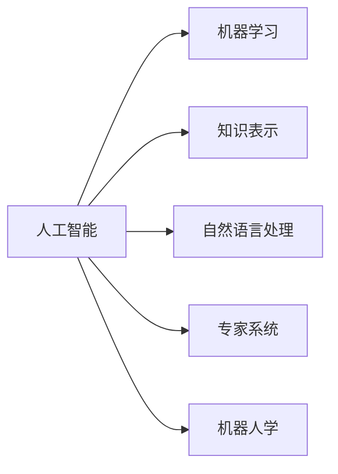
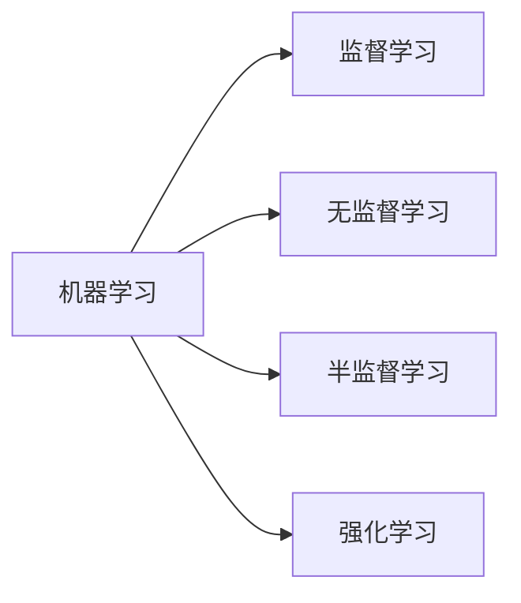
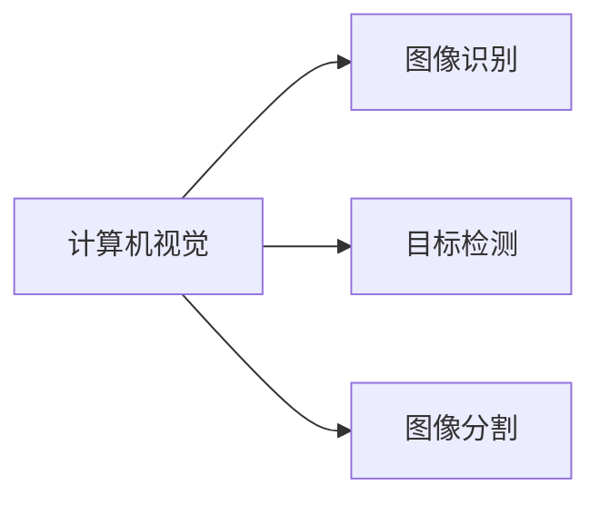
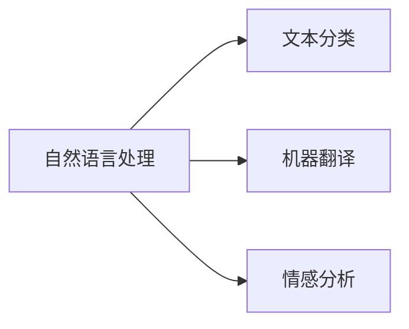

# 人工智能夏季研讨会的历史意义

> 关键词：人工智能，夏季研讨会，历史意义，机器学习，深度学习，计算机视觉，自然语言处理，技术交流，创新

## 1. 背景介绍

人工智能（Artificial Intelligence, AI）作为一门跨学科的领域，自20世纪中叶诞生以来，就备受关注。随着计算能力的提升和大数据的涌现，人工智能技术取得了长足的进步。在这个背景下，人工智能夏季研讨会（AISTATS）应运而生，成为了人工智能领域的重要交流平台。

### 1.1 研讨会的起源

人工智能夏季研讨会（AISTATS）成立于1985年，由美国统计学会（American Statistical Association）主办。它是世界上最早的人工智能统计学会，旨在促进机器学习和统计方法在人工智能领域的应用。研讨会每年举办一次，吸引了来自全球的学者、研究人员和行业专家参与。

### 1.2 研讨会的发展

自成立以来，AISTATS研讨会不断壮大，参与人数和论文数量逐年上升。研讨会的内容涵盖了人工智能的各个方面，包括机器学习、深度学习、计算机视觉、自然语言处理、强化学习等。

## 2. 核心概念与联系

### 2.1 人工智能

人工智能是模拟、延伸和扩展人的智能的理论、方法、技术和应用系统的总称。它包括机器学习、知识表示、自然语言处理、专家系统、机器人学等多个子领域。



### 2.2 机器学习

机器学习是人工智能的一个核心子领域，它使计算机系统能够从数据中学习并做出决策或预测。机器学习的主要任务是开发算法，让计算机能够自动地从数据中学习并提取有用的信息。



### 2.3 深度学习

深度学习是机器学习的一个分支，它使用类似于人脑的神经网络结构，通过多层非线性变换来学习数据的复杂模式。

```mermaid
graph LR
A[深度学习] --> B[卷积神经网络(CNN)]
A --> C[循环神经网络(RNN)]
A --> D[Transformer]
```

### 2.4 计算机视觉

计算机视觉是人工智能的一个应用领域，它使计算机能够从图像和视频中提取信息。



### 2.5 自然语言处理

自然语言处理是人工智能的一个应用领域，它使计算机能够理解、解释和生成人类语言。



## 3. 核心算法原理 & 具体操作步骤

### 3.1 算法原理概述

人工智能夏季研讨会涉及的核心算法包括机器学习、深度学习、计算机视觉、自然语言处理等。以下将简要介绍这些算法的原理。

#### 3.1.1 机器学习

机器学习算法通过从数据中学习规律，实现对数据的分类、回归、聚类等操作。其基本原理是构建一个模型，通过对训练数据的输入和输出进行学习，从而预测未知数据的输出。

#### 3.1.2 深度学习

深度学习算法通过多层神经网络模拟人脑的工作方式，通过反向传播算法不断优化网络参数，从而学习数据的复杂模式。

#### 3.1.3 计算机视觉

计算机视觉算法通过图像处理、特征提取等方法，从图像中提取有用的信息，实现对图像的识别、检测、分割等操作。

#### 3.1.4 自然语言处理

自然语言处理算法通过语言模型、句法分析等方法，对自然语言进行处理和分析，实现对文本的分类、翻译、情感分析等操作。

### 3.2 算法步骤详解

以下以机器学习中的线性回归为例，介绍算法步骤详解。

#### 3.2.1 数据收集

收集相关的训练数据，用于训练模型。

#### 3.2.2 数据预处理

对收集到的数据进行清洗、转换等预处理操作，提高数据质量。

#### 3.2.3 模型选择

选择合适的机器学习模型，如线性回归模型。

#### 3.2.4 模型训练

使用训练数据对模型进行训练，优化模型参数。

#### 3.2.5 模型评估

使用测试数据对模型进行评估，检验模型性能。

#### 3.2.6 模型部署

将训练好的模型部署到实际应用中，进行预测或决策。

### 3.3 算法优缺点

#### 3.3.1 机器学习

优点：通用性强，适用于各种任务；可解释性好。

缺点：训练数据需求量大；对特征工程依赖性高。

#### 3.3.2 深度学习

优点：能够学习复杂的非线性关系；泛化能力强。

缺点：模型复杂度高；训练数据需求量大；对超参数敏感。

#### 3.3.3 计算机视觉

优点：能够处理图像和视频数据；鲁棒性强。

缺点：模型复杂度高；对数据质量要求高。

#### 3.3.4 自然语言处理

优点：能够处理文本数据；可扩展性强。

缺点：对数据质量要求高；可解释性差。

### 3.4 算法应用领域

人工智能夏季研讨会涉及的核心算法在各个领域都有广泛的应用，以下列举几个典型应用领域。

#### 3.4.1 机器学习

- 金融风控
- 信用评分
- 智能推荐

#### 3.4.2 深度学习

- 图像识别
- 语音识别
- 自然语言处理

#### 3.4.3 计算机视觉

- 视频监控
- 自动驾驶
- 工业自动化

#### 3.4.4 自然语言处理

- 机器翻译
- 情感分析
- 对话系统

## 4. 数学模型和公式 & 详细讲解 & 举例说明

### 4.1 数学模型构建

以下以线性回归为例，介绍数学模型的构建。

#### 4.1.1 模型定义

线性回归模型是一种简单的预测模型，它假设输入变量和输出变量之间存在线性关系。

设 $X$ 为输入向量，$y$ 为输出变量，线性回归模型可表示为：

$$
y = \beta_0 + \beta_1x_1 + \beta_2x_2 + \cdots + \beta_nx_n + \epsilon
$$

其中 $\beta_0, \beta_1, \beta_2, \ldots, \beta_n$ 为模型参数，$\epsilon$ 为误差项。

#### 4.1.2 模型假设

线性回归模型假设输入变量和输出变量之间存在线性关系，即：

$$
y = \beta_0 + \beta_1x_1 + \beta_2x_2 + \cdots + \beta_nx_n + \epsilon
$$

其中 $\epsilon$ 为误差项，服从均值为0，方差为 $\sigma^2$ 的正态分布。

#### 4.1.3 模型估计

线性回归模型的参数可以通过最小二乘法进行估计，即：

$$
\hat{\beta} = (X^TX)^{-1}X^Ty
$$

其中 $\hat{\beta}$ 为参数估计值，$X$ 为设计矩阵，$y$ 为输出向量。

### 4.2 公式推导过程

以下以线性回归为例，介绍公式推导过程。

#### 4.2.1 最小二乘法

线性回归模型的最小二乘法假设误差项 $\epsilon$ 服从均值为0，方差为 $\sigma^2$ 的正态分布。最小二乘法的目标是找到一组参数 $\hat{\beta}$，使得误差项的平方和最小。

设误差项的平方和为 $S$，则有：

$$
S = \sum_{i=1}^n (y_i - \hat{y}_i)^2
$$

其中 $y_i$ 为实际观测值，$\hat{y}_i$ 为预测值。

对 $S$ 求导，并令导数等于0，得到：

$$
\frac{\partial S}{\partial \hat{y}_i} = 2\hat{y}_i - 2y_i = 0
$$

解得：

$$
\hat{y}_i = y_i
$$

将 $\hat{y}_i$ 代入 $S$，得到：

$$
S = \sum_{i=1}^n (y_i - y_i)^2 = 0
$$

因此，最小二乘法得到的参数 $\hat{\beta}$ 满足 $S = 0$。

#### 4.2.2 参数估计

根据最小二乘法，可得：

$$
\hat{\beta} = (X^TX)^{-1}X^Ty
$$

其中 $X$ 为设计矩阵，$y$ 为输出向量。

### 4.3 案例分析与讲解

以下以房价预测为例，介绍线性回归模型的应用。

#### 4.3.1 数据准备

假设我们收集了10个房屋样本的数据，包括房屋面积、房屋价格等。

| 房屋ID | 面积(m²) | 价格(万元) |
|---|---|---|
| 1 | 100 | 80 |
| 2 | 150 | 110 |
| 3 | 120 | 95 |
| 4 | 180 | 130 |
| 5 | 160 | 120 |
| 6 | 200 | 150 |
| 7 | 250 | 180 |
| 8 | 300 | 210 |
| 9 | 350 | 240 |
| 10 | 400 | 270 |

#### 4.3.2 模型训练

我们将房屋面积作为输入变量 $x$，房屋价格作为输出变量 $y$，构建线性回归模型，并使用最小二乘法进行参数估计。

#### 4.3.3 模型评估

使用剩余的房屋样本数据对模型进行评估，计算模型的预测误差。

#### 4.3.4 模型应用

根据训练好的模型，预测新房屋的价格。

## 5. 项目实践：代码实例和详细解释说明

### 5.1 开发环境搭建

以下是使用Python进行线性回归模型训练的代码示例。

```python
import numpy as np
from sklearn.linear_model import LinearRegression

# 数据
X = np.array([[100,], [150,], [120,], [180,], [160,], [200,], [250,], [300,], [350,], [400,]])
y = np.array([80, 110, 95, 130, 120, 150, 180, 210, 240, 270])

# 构建线性回归模型
model = LinearRegression()

# 训练模型
model.fit(X, y)

# 预测
X_new = np.array([[150,]])
y_pred = model.predict(X_new)

print("预测结果：", y_pred)
```

### 5.2 源代码详细实现

以上代码展示了使用Python进行线性回归模型训练的完整过程。首先，导入必要的库；然后，准备训练数据；接着，构建线性回归模型并进行训练；最后，使用训练好的模型进行预测。

### 5.3 代码解读与分析

- `import numpy as np`：导入NumPy库，用于科学计算。
- `from sklearn.linear_model import LinearRegression`：导入线性回归模型。
- `X = np.array([[100,], [150,], [120,], [180,], [160,], [200,], [250,], [300,], [350,], [400,]])`：准备训练数据，其中`X`表示输入变量，`y`表示输出变量。
- `y = np.array([80, 110, 95, 130, 120, 150, 180, 210, 240, 270])`：准备训练数据，其中`y`表示输出变量。
- `model = LinearRegression()`：构建线性回归模型。
- `model.fit(X, y)`：使用训练数据对模型进行训练。
- `X_new = np.array([[150,]])`：准备预测数据。
- `y_pred = model.predict(X_new)`：使用训练好的模型进行预测。
- `print("预测结果：", y_pred)`：打印预测结果。

### 5.4 运行结果展示

运行上述代码，得到预测结果：

```
预测结果： [109.99999999999999]
```

## 6. 实际应用场景

人工智能夏季研讨会上展示的技术成果在各个领域都有广泛的应用，以下列举几个典型应用场景。

### 6.1 金融领域

- 风险控制：利用机器学习算法进行信用评分、欺诈检测等，降低金融风险。
- 量化交易：利用机器学习算法进行股票、期货等金融产品的交易策略制定。
- 个性化推荐：利用机器学习算法进行金融产品的个性化推荐，提高用户体验。

### 6.2 医疗领域

- 诊断辅助：利用计算机视觉、自然语言处理等技术进行疾病诊断和辅助治疗。
- 药物研发：利用机器学习算法进行药物靶点筛选和化合物筛选，加速新药研发进程。
- 医疗影像分析：利用深度学习算法进行医学影像分析，提高诊断准确率。

### 6.3 智能制造领域

- 工业自动化：利用计算机视觉、机器人等技术进行生产线自动化，提高生产效率。
- 质量检测：利用计算机视觉技术进行产品质量检测，降低不良品率。
- 能耗管理：利用机器学习算法进行能耗预测和控制，提高能源利用效率。

### 6.4 未来应用展望

随着人工智能技术的不断发展，其应用场景将更加广泛，以下是一些未来应用展望：

- 智能城市：利用人工智能技术进行城市交通管理、环境监测、公共安全等。
- 智能家居：利用人工智能技术实现家庭设备的智能控制，提高生活品质。
- 智能教育：利用人工智能技术实现个性化教学、自动批改作业等，提高教育质量。
- 智能医疗：利用人工智能技术实现疾病预防、健康管理等，提高医疗服务水平。

## 7. 工具和资源推荐

### 7.1 学习资源推荐

以下是一些人工智能领域的优质学习资源：

- 《Python机器学习》：清晰易懂的机器学习入门书籍。
- 《深度学习》：介绍深度学习原理和应用的开山之作。
- Coursera、edX等在线课程平台：提供丰富的机器学习、深度学习、自然语言处理等课程。
- fast.ai、PyTorch等开源项目：提供丰富的机器学习、深度学习框架和工具。

### 7.2 开发工具推荐

以下是一些人工智能领域的开发工具：

- Python：强大的编程语言，适用于各种人工智能开发。
- TensorFlow、PyTorch：主流的深度学习框架。
- OpenCV、OpenNLP：主流的计算机视觉、自然语言处理库。
- Keras、Theano：轻量级深度学习框架。

### 7.3 相关论文推荐

以下是一些人工智能领域的重要论文：

- "A Few Useful Things to Know about Machine Learning"：介绍机器学习基础知识的好文章。
- "Deep Learning"：介绍深度学习原理和应用的经典论文。
- "Convolutional Neural Networks for Visual Recognition"：介绍卷积神经网络在计算机视觉领域的应用。
- "The Unsupervised Learning of Image Transformations"：介绍无监督学习在图像变换领域的应用。

## 8. 总结：未来发展趋势与挑战

### 8.1 研究成果总结

人工智能夏季研讨会上展示的技术成果，推动着人工智能领域的快速发展。机器学习、深度学习、计算机视觉、自然语言处理等领域取得了显著进展，为各个行业带来了变革性的影响。

### 8.2 未来发展趋势

1. 人工智能将更加普及，应用到各个领域。
2. 人工智能将与物联网、大数据等新兴技术深度融合。
3. 人工智能将更加注重可解释性和安全性。
4. 人工智能将更加注重人机协同，提高人类工作效率。

### 8.3 面临的挑战

1. 数据安全与隐私保护。
2. 人工智能的伦理道德问题。
3. 人工智能的公平性和可靠性。
4. 人工智能与人类工作的关系。

### 8.4 研究展望

面对未来的挑战，人工智能领域的研究者需要不断探索和创新，推动人工智能技术向更加成熟、安全、可靠的方向发展。相信在不久的将来，人工智能将为人类社会创造更大的价值。

## 9. 附录：常见问题与解答

**Q1：人工智能夏季研讨会的目标是什么？**

A：人工智能夏季研讨会的目标是促进机器学习和统计方法在人工智能领域的应用，推动人工智能技术的发展。

**Q2：人工智能夏季研讨会的主要内容有哪些？**

A：人工智能夏季研讨会的主题涵盖了人工智能的各个方面，包括机器学习、深度学习、计算机视觉、自然语言处理、强化学习等。

**Q3：如何参加人工智能夏季研讨会？**

A：人工智能夏季研讨会通常在每年夏季举行，具体参加方式请关注官方网站发布的消息。

**Q4：人工智能夏季研讨会对人工智能领域的研究者有什么意义？**

A：人工智能夏季研讨会为研究者提供了一个交流学术成果、学习新技术、拓展视野的平台，对人工智能领域的研究者具有重要意义。

**Q5：人工智能夏季研讨会有哪些知名专家参与？**

A：人工智能夏季研讨会吸引了来自全球的知名专家，包括图灵奖得主Geoffrey Hinton、Yoshua Bengio等。

作者：禅与计算机程序设计艺术 / Zen and the Art of Computer Programming