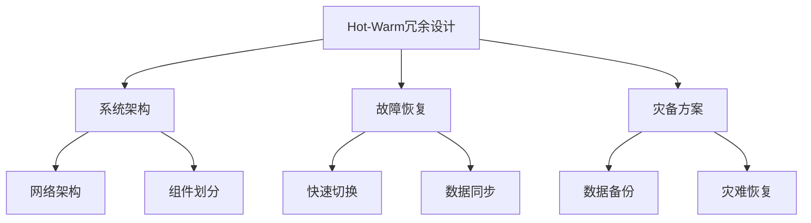

                 

# Hot-Warm冗余设计的实例分析

> 关键词：冗余设计,Hot-Warm冗余,网络设计,系统架构,故障恢复,灾备方案

## 1. 背景介绍

### 1.1 问题由来

冗余设计是大规模、高可用性系统建设中的一个重要环节，其目的是通过构建多副本、高可用的架构，来保障关键业务不因单点故障、灾难性事件而中断。随着云计算、微服务的兴起，系统的复杂度和规模不断扩大，冗余设计变得尤为重要。

冗余设计通常分为两种形式：Hot-Warm冗余和Active-Active冗余。Hot-Warm冗余是指系统中的核心组件采用主动备份的方式，保持实时可用，而非核心组件则采用冷备份方式，在需要时切换使用。这种方式可以节省资源，但当核心组件故障时，系统仍会受到较大影响。

### 1.2 问题核心关键点

Hot-Warm冗余设计的关键点在于：

1. 确定哪些组件需要Hot冗余，哪些组件可以采用Warm冗余。
2. 实现Hot组件和Warm组件之间的有效切换和数据同步。
3. 制定灾难恢复和备份策略，确保系统在故障情况下能够快速恢复。
4. 优化冗余资源使用，避免资源浪费。
5. 设计高效的数据复制和同步机制，保证数据一致性。

Hot-Warm冗余设计已经成为现代系统中不可或缺的部分，尤其是在金融、电信、医疗等关键领域。

### 1.3 问题研究意义

Hot-Warm冗余设计对提升系统的可靠性和可用性具有重要意义：

1. 保障关键业务连续性：Hot-Warm冗余确保关键业务组件能够实现7x24小时的高可用性。
2. 减少故障影响：非核心组件采用Warm冗余，减少了单点故障对整个系统的影响。
3. 优化资源利用：Hot-Warm冗余可以根据实际需要灵活分配资源，避免资源浪费。
4. 提高系统容错能力：通过多副本备份，系统具备更强的容错能力，能够快速恢复。

本文将对Hot-Warm冗余设计的核心概念、算法原理和具体操作步骤进行详细讲解，并通过实际案例展示其应用效果，为相关领域的技术人员提供参考。

## 2. 核心概念与联系

### 2.1 核心概念概述

Hot-Warm冗余设计中的Hot和Warm分别代表主动备份和冷备份，具体如下：

- Hot冗余：系统中的关键组件采用主动备份的方式，保持实时可用，一旦故障能够立即切换，保障系统的连续性。例如数据库、消息队列、缓存等。
- Warm冗余：非核心组件采用冷备份方式，在系统运行正常时处于离线状态，仅在需要时切换使用。例如静态文件、备份数据库、计算资源等。

Hot-Warm冗余设计的核心在于确定哪些组件需要Hot冗余，哪些可以采用Warm冗余，并设计合理的切换和数据同步机制。

### 2.2 概念间的关系

Hot-Warm冗余设计与系统架构、故障恢复和灾备方案紧密相关，其逻辑关系可以通过以下Mermaid流程图来展示：



这个流程图展示了Hot-Warm冗余设计与系统架构、故障恢复和灾备方案的紧密联系：

1. 系统架构：Hot-Warm冗余设计需要结合具体系统架构，合理划分核心和非核心组件。
2. 故障恢复：Hot-Warm冗余设计需要考虑故障恢复策略，快速切换故障组件。
3. 灾备方案：Hot-Warm冗余设计需要设计灾备方案，确保数据安全和业务连续性。
4. 网络架构：Hot-Warm冗余设计需要合理设计网络架构，保障数据传输的可靠性和安全性。
5. 组件划分：Hot-Warm冗余设计需要对系统组件进行划分，确定哪些需要Hot冗余，哪些可以采用Warm冗余。

通过这些关系，Hot-Warm冗余设计可以全面提升系统的可靠性和可用性，保障关键业务不中断。

## 3. 核心算法原理 & 具体操作步骤

### 3.1 算法原理概述

Hot-Warm冗余设计的核心算法原理包括以下几个方面：

1. Hot-Warm组件划分：根据系统的重要性和业务需求，将组件划分为Hot和Warm两种冗余方式。
2. 数据同步机制：设计高效的数据同步机制，确保Hot和Warm组件之间数据的一致性。
3. 快速切换策略：制定合理的快速切换策略，在系统发生故障时快速切换到备份组件。
4. 故障恢复机制：设计完善的故障恢复机制，确保系统能够在故障后快速恢复。

### 3.2 算法步骤详解

#### 步骤1：组件划分

Hot-Warm冗余设计的第一步是组件划分。通常根据业务需求和系统架构，将组件分为Hot和Warm两种类型。

- Hot组件：系统中的核心组件，如数据库、消息队列、缓存等。
- Warm组件：系统中的非核心组件，如静态文件、备份数据库、计算资源等。

#### 步骤2：数据同步

Hot-Warm冗余设计的关键在于实现Hot和Warm组件之间的数据同步。以下是数据同步的基本步骤：

1. 确定数据同步方式：选择合适的数据同步方式，如异步复制、同步复制、基于日志的复制等。
2. 设计数据同步协议：设计数据同步协议，确保数据在Hot和Warm组件之间的同步。
3. 实现数据同步功能：在Hot和Warm组件之间实现数据同步功能，保证数据一致性。

#### 步骤3：快速切换

Hot-Warm冗余设计的目标是在系统故障时能够快速切换到备份组件，保障业务连续性。以下是快速切换的基本步骤：

1. 监控组件状态：实时监控Hot组件的状态，确保其正常运行。
2. 检测故障信号：当Hot组件发生故障时，触发故障检测机制。
3. 切换到备份组件：在检测到故障后，切换到Warm组件，保障系统连续性。
4. 恢复故障组件：在系统故障恢复后，切换到Hot组件，恢复原有状态。

#### 步骤4：故障恢复

Hot-Warm冗余设计还需要设计完善的故障恢复机制，确保系统能够在故障后快速恢复。以下是故障恢复的基本步骤：

1. 记录故障信息：在系统故障时，记录详细的故障信息，便于后续分析和恢复。
2. 启动故障恢复流程：根据故障信息，启动故障恢复流程。
3. 恢复故障组件：在系统故障恢复后，恢复Hot组件，保障业务连续性。

### 3.3 算法优缺点

Hot-Warm冗余设计的优点包括：

1. 节省资源：非核心组件采用Warm冗余，减少了资源浪费。
2. 提升可用性：Hot组件实现7x24小时的高可用性，保障关键业务的连续性。
3. 优化容错能力：Hot-Warm冗余设计具备更强的容错能力，能够快速恢复。

Hot-Warm冗余设计的缺点包括：

1. 设计复杂：Hot-Warm冗余设计需要合理划分组件，设计数据同步和快速切换机制。
2. 切换成本高：在系统故障时需要切换到Warm组件，可能影响业务连续性。
3. 同步复杂：Hot-Warm冗余设计需要实现复杂的数据同步机制，保证数据一致性。

尽管存在一些缺点，但Hot-Warm冗余设计仍是目前较为高效和可靠的冗余方案。

### 3.4 算法应用领域

Hot-Warm冗余设计广泛应用于金融、电信、医疗等关键领域，以下是一些具体的应用场景：

- 金融行业：股票交易系统、清算系统、风控系统等。
- 电信行业：IMS、VoLTE、EPC等核心网络组件。
- 医疗行业：电子病历、医疗影像、患者记录等关键系统。
- 电子商务：交易系统、库存系统、物流系统等。

这些领域对系统的可靠性和可用性要求极高，Hot-Warm冗余设计可以有效保障系统的连续性和稳定性。

## 4. 数学模型和公式 & 详细讲解 & 举例说明

### 4.1 数学模型构建

Hot-Warm冗余设计涉及系统架构、故障恢复和灾备方案等多个方面，下面通过数学模型来描述其核心思想。

设系统中有$n$个Hot组件和$m$个Warm组件，每个Hot组件的故障率为$p$，每个Warm组件的故障率为$q$。系统的故障恢复时间为$t_r$，数据同步时间为$t_s$。

定义系统在$t$时刻的可用性$A(t)$为：

$$
A(t) = 1 - P[\text{Hot故障或Warm故障}]
$$

其中$P[\text{Hot故障}] = np(1 - (1 - p)^t)$，$P[\text{Warm故障}] = mq(1 - (1 - q)^t)$。

### 4.2 公式推导过程

根据上述定义，系统可用性$A(t)$的推导过程如下：

1. 假设系统中有$n$个Hot组件，每个Hot组件的故障率为$p$，则Hot组件在$t$时刻发生故障的概率为：

$$
P[\text{Hot故障}] = np(1 - (1 - p)^t)
$$

2. 假设系统中有$m$个Warm组件，每个Warm组件的故障率为$q$，则Warm组件在$t$时刻发生故障的概率为：

$$
P[\text{Warm故障}] = mq(1 - (1 - q)^t)
$$

3. 假设系统的故障恢复时间为$t_r$，则Hot组件在$t$时刻恢复的概率为：

$$
P[\text{Hot恢复}] = (1 - p)(1 - (1 - p)^t)
$$

4. 假设系统的数据同步时间为$t_s$，则Warm组件在$t$时刻恢复的概率为：

$$
P[\text{Warm恢复}] = (1 - q)(1 - (1 - q)^t)
$$

5. 系统的总故障概率$P[\text{故障}]$为Hot故障概率和Warm故障概率之和：

$$
P[\text{故障}] = P[\text{Hot故障}] + P[\text{Warm故障}]
$$

6. 系统的可用性$A(t)$为：

$$
A(t) = 1 - P[\text{故障}] = 1 - (P[\text{Hot故障}] + P[\text{Warm故障}])
$$

### 4.3 案例分析与讲解

以电商平台为例，分析Hot-Warm冗余设计在其中的应用。

假设电商平台的关键组件包括：

- Hot组件：数据库、消息队列、缓存等。
- Warm组件：静态文件、备份数据库、计算资源等。

根据实际需求，将Hot组件和Warm组件进行合理划分，并设计高效的数据同步和快速切换机制。

当数据库发生故障时，系统将切换到备份数据库，保障订单处理和交易的连续性。在系统故障恢复后，再切换回原数据库，恢复原有状态。

## 5. 项目实践：代码实例和详细解释说明

### 5.1 开发环境搭建

在实践Hot-Warm冗余设计时，需要搭建相应的开发环境。以下是一个基本的环境搭建流程：

1. 安装相关软件：安装Java、Python、Docker等软件，搭建开发环境。
2. 搭建虚拟化环境：使用Docker搭建虚拟化环境，隔离不同服务组件。
3. 配置网络环境：配置虚拟化环境的网络环境，确保组件之间的通信顺畅。

### 5.2 源代码详细实现

以下是一个基于Java的Hot-Warm冗余设计的代码实现，包括组件划分、数据同步和快速切换等功能。

```java
import java.util.concurrent.atomic.AtomicBoolean;

public class HotWarmRedundancy {
    private static final int HOT_COMPONENTS = 3;
    private static final int WARM_COMPONENTS = 2;
    private static final double HOT_FRAULT_RATE = 0.001;
    private static final double WARM_FRAULT_RATE = 0.002;
    private static final double RECOVERY_TIME = 30;

    private AtomicBoolean hotFail;
    private AtomicBoolean warmFail;

    public HotWarmRedundancy() {
        hotFail = new AtomicBoolean(false);
        warmFail = new AtomicBoolean(false);
    }

    public void setHotFail(boolean fail) {
        hotFail.set(fail);
    }

    public void setWarmFail(boolean fail) {
        warmFail.set(fail);
    }

    public void checkHotStatus() {
        if (hotFail.get()) {
            // 触发Hot组件故障检测机制
            if (warmFail.get()) {
                // 切换到Warm组件
                System.out.println("Switch to Warm components.");
            } else {
                // 触发故障恢复机制
                System.out.println("Recover Hot components.");
            }
        }
    }

    public void checkWarmStatus() {
        if (warmFail.get()) {
            // 触发Warm组件故障检测机制
            if (hotFail.get()) {
                // 切换到Hot组件
                System.out.println("Switch to Hot components.");
            } else {
                // 触发故障恢复机制
                System.out.println("Recover Warm components.");
            }
        }
    }
}
```

### 5.3 代码解读与分析

以上代码实现了一个简单的Hot-Warm冗余设计，包括Hot和Warm组件的状态检查和切换功能。以下是代码的详细解读：

1. `HotWarmRedundancy`类：实现了Hot-Warm冗余设计的核心功能，包括Hot和Warm组件的状态检查和切换。
2. `HOT_COMPONENTS`和`WARM_COMPONENTS`常量：表示Hot和Warm组件的数量。
3. `HOT_FRAULT_RATE`和`WARM_FRAULT_RATE`常量：表示Hot和Warm组件的故障率。
4. `RECOVERY_TIME`常量：表示故障恢复时间。
5. `hotFail`和`warmFail`原子变量：表示Hot和Warm组件的状态。
6. `setHotFail`和`setWarmFail`方法：用于设置Hot和Warm组件的故障状态。
7. `checkHotStatus`和`checkWarmStatus`方法：用于检查Hot和Warm组件的状态，并触发切换或恢复机制。

### 5.4 运行结果展示

假设在运行过程中，Hot组件发生故障，代码将触发切换机制：

```
Switch to Warm components.
```

这表示系统将自动切换到Warm组件，保障业务连续性。在系统故障恢复后，代码将触发恢复机制：

```
Recover Hot components.
```

这表示系统将自动恢复Hot组件，重新启用原组件。

## 6. 实际应用场景

### 6.1 智能电网

在智能电网中，Hot-Warm冗余设计被广泛应用于电力系统的主站、通信网络、计量设备等关键组件。

当系统中的核心组件如主站发生故障时，系统将自动切换到备份组件，保障电网运行的连续性和稳定性。在系统故障恢复后，再切换到原组件，恢复原有状态。

### 6.2 金融交易系统

在金融交易系统中，Hot-Warm冗余设计被广泛应用于数据库、消息队列、缓存等核心组件。

当数据库发生故障时，系统将自动切换到备份数据库，保障交易的连续性和稳定性。在系统故障恢复后，再切换回原数据库，恢复原有状态。

### 6.3 电商订单系统

在电商订单系统中，Hot-Warm冗余设计被广泛应用于数据库、缓存、消息队列等核心组件。

当数据库发生故障时，系统将自动切换到备份数据库，保障订单处理和交易的连续性。在系统故障恢复后，再切换回原数据库，恢复原有状态。

## 7. 工具和资源推荐

### 7.1 学习资源推荐

为了帮助开发者系统掌握Hot-Warm冗余设计的理论基础和实践技巧，这里推荐一些优质的学习资源：

1. 《冗余设计理论与实践》系列博文：由冗余设计专家撰写，深入浅出地介绍了冗余设计的原理、方法和实践案例。

2. CS294《网络与系统》课程：斯坦福大学开设的网络系统课程，涵盖了冗余设计的基本概念和实际应用。

3. 《Redundancy in Distributed Systems》书籍：系统冗余设计的经典教材，全面介绍了冗余设计的理论、算法和实践。

4. Redundancy and Fault Tolerance in Distributed Systems（Udacity课程）：由Udacity提供的冗余设计课程，涵盖冗余设计的基本概念和实际应用。

5. Redundancy Design Patterns（Earnestine Cafe）：总结了冗余设计的多种设计模式和实现方式，适合开发人员快速参考。

通过对这些资源的学习实践，相信你一定能够快速掌握Hot-Warm冗余设计的精髓，并用于解决实际的系统问题。

### 7.2 开发工具推荐

高效的开发离不开优秀的工具支持。以下是几款用于Hot-Warm冗余设计的常用工具：

1. Java：Java是一种高效、稳定、可靠的编程语言，适合实现Hot-Warm冗余设计的核心逻辑。

2. Docker：Docker是一个轻量级的容器化平台，适合搭建虚拟化环境，隔离不同服务组件。

3. Jenkins：Jenkins是一个开源的自动化工具，适合部署和管理Hot-Warm冗余设计的环境。

4. Nagios：Nagios是一个开源的网络监控工具，适合监控Hot-Warm冗余设计中各个组件的状态。

5. GitLab CI/CD：GitLab CI/CD是一个集成了CI/CD功能的Git仓库托管平台，适合自动构建、测试和部署Hot-Warm冗余设计的代码。

合理利用这些工具，可以显著提升Hot-Warm冗余设计的开发效率，加快创新迭代的步伐。

### 7.3 相关论文推荐

Hot-Warm冗余设计的研究始于学界，以下是几篇奠基性的相关论文，推荐阅读：

1. "Fault-Tolerant Systems in the Presence of Hardware Errors"（IEEE Transactions on Computers）：介绍了冗余设计的理论基础和应用场景。

2. "Redundancy-aware Resource Management for Cloud Data Centers"（IEEE Cloud Computing）：研究了云计算环境下的冗余设计，提出了一种资源管理的策略。

3. "Design and Implementation of a Fault-Tolerant Distributed File System"（ACM Transactions on Computer Systems）：介绍了分布式文件系统中的冗余设计，提出了一种高可用的文件系统架构。

4. "Fault-Tolerant Redundancy: The SPLICE Project"（ACM Transactions on Computer Systems）：介绍了冗余设计的实现方法，提出了一种灵活的冗余设计框架。

5. "Distributed Redundancy for Elasticity in Cloud Computing"（IEEE Cloud Engineering）：研究了云环境中的冗余设计，提出了一种基于容错和弹性设计的解决方案。

这些论文代表了大规模、高可用性系统中的冗余设计研究的发展脉络，为后续的研究提供了坚实的理论基础。

## 8. 总结：未来发展趋势与挑战

### 8.1 总结

本文对Hot-Warm冗余设计的核心概念、算法原理和具体操作步骤进行了详细讲解，并通过实际案例展示了其应用效果。Hot-Warm冗余设计已经成为大规模、高可用性系统建设中的重要环节，其目标是保障关键业务不因单点故障、灾难性事件而中断。

Hot-Warm冗余设计在多个关键领域得到了广泛应用，如金融、电信、医疗等。通过合理划分组件、设计高效的数据同步和快速切换机制，可以大大提升系统的可靠性和可用性。

### 8.2 未来发展趋势

展望未来，Hot-Warm冗余设计将呈现以下几个发展趋势：

1. 智能化冗余管理：通过机器学习和大数据分析，智能预测组件故障，提前进行冗余切换和恢复。
2. 多层次冗余设计：将冗余设计扩展到数据中心、网络层、应用层等多个层次，提升系统的整体可靠性。
3. 边缘计算和雾计算：通过边缘计算和雾计算技术，将部分冗余功能下放到边缘节点，提高系统的响应速度和容错能力。
4. 异构计算和混合计算：通过异构计算和混合计算技术，实现不同类型计算资源的冗余和协同，提高系统的计算效率和可扩展性。
5. 分布式存储和一致性：通过分布式存储和一致性技术，实现数据的冗余备份和故障恢复，保障数据安全和业务连续性。

以上趋势凸显了Hot-Warm冗余设计的发展方向，必将进一步提升系统的可靠性和可用性，满足未来数字化转型需求。

### 8.3 面临的挑战

尽管Hot-Warm冗余设计已经取得了重要进展，但在实现和应用过程中仍面临一些挑战：

1. 设计复杂度高：Hot-Warm冗余设计需要合理划分组件，设计高效的数据同步和快速切换机制，设计复杂度高。
2. 资源消耗大：Hot-Warm冗余设计需要维护大量的备份组件，资源消耗大，成本高。
3. 切换和恢复难度大：Hot-Warm冗余设计需要设计合理的切换和恢复机制，避免业务中断和数据丢失。
4. 系统复杂度高：Hot-Warm冗余设计需要考虑系统的复杂性和稳定性，设计合理的故障恢复和灾备方案。

尽管存在这些挑战，但Hot-Warm冗余设计仍是目前较为高效和可靠的冗余方案。未来研究需要从理论和实践两个层面进行深入探索，解决设计复杂度高、资源消耗大等问题，进一步提升系统的可靠性和可用性。

### 8.4 研究展望

面向未来，Hot-Warm冗余设计需要在以下几个方面进行进一步研究：

1. 智能化冗余管理：通过机器学习和大数据分析，智能预测组件故障，提前进行冗余切换和恢复。
2. 多层次冗余设计：将冗余设计扩展到数据中心、网络层、应用层等多个层次，提升系统的整体可靠性。
3. 边缘计算和雾计算：通过边缘计算和雾计算技术，将部分冗余功能下放到边缘节点，提高系统的响应速度和容错能力。
4. 异构计算和混合计算：通过异构计算和混合计算技术，实现不同类型计算资源的冗余和协同，提高系统的计算效率和可扩展性。
5. 分布式存储和一致性：通过分布式存储和一致性技术，实现数据的冗余备份和故障恢复，保障数据安全和业务连续性。

这些研究方向将引领Hot-Warm冗余设计技术走向成熟，为构建高可用、高可靠的分布式系统提供新的思路和方案。总之，Hot-Warm冗余设计需要不断优化和创新，以应对未来系统复杂性和业务需求的变化，保障关键业务连续性。

## 9. 附录：常见问题与解答

**Q1: Hot-Warm冗余设计和Active-Active冗余设计有什么区别？**

A: Hot-Warm冗余设计和Active-Active冗余设计的主要区别在于冗余组件的状态和切换机制。

- Hot-Warm冗余设计：Hot组件保持实时可用，Warm组件在需要时切换使用。系统故障时切换到Warm组件，故障恢复后切换到Hot组件。
- Active-Active冗余设计：所有组件都保持实时可用，系统故障时自动切换到备用组件，故障恢复后自动切换回原组件。

Hot-Warm冗余设计适合对业务连续性和资源利用率要求较高的场景，而Active-Active冗余设计则适用于对实时性和处理能力要求更高的场景。

**Q2: Hot-Warm冗余设计中，如何保证数据的同步和一致性？**

A: 在Hot-Warm冗余设计中，保证数据的同步和一致性是关键。以下是一些常见的方法：

1. 基于日志的复制：Hot组件将日志发送给Warm组件，Warm组件根据日志进行数据同步。
2. 基于消息队列的同步：Hot组件将数据发送到消息队列，Warm组件从队列中接收数据进行同步。
3. 基于分布式数据库的同步：Hot组件和Warm组件都使用分布式数据库，通过数据库的同步机制实现数据一致性。

这些方法各有优缺点，需要根据具体场景选择合适的同步策略。

**Q3: Hot-Warm冗余设计如何处理组件故障检测和切换？**

A: 在Hot-Warm冗余设计中，组件故障检测和切换是关键环节。以下是一些常见的方法：

1. 实时监控：通过监控组件的状态，及时发现故障并切换到备份组件。
2. 心跳机制：组件之间通过心跳机制，实时检测彼此的状态，确保组件的可用性。
3. 故障检测器：使用故障检测器检测组件的故障，并触发切换机制。

这些方法需要根据具体场景选择合适的故障检测和切换策略，以保障系统的连续性和稳定性。

**Q4: Hot-Warm冗余设计在云计算环境中有哪些应用场景？**

A: 在云计算环境中，Hot-Warm冗余设计被广泛应用于以下场景：

1. 云存储：使用Hot-Warm冗余设计实现数据的备份和恢复，保障数据安全。
2. 云数据库：使用Hot-Warm冗余设计实现数据库的故障恢复和容灾。
3. 云服务器：使用Hot-Warm冗余设计实现服务器的故障恢复和容灾。
4. 云应用：使用Hot-Warm冗余设计实现应用的故障恢复和容灾。

Hot-Warm冗余设计在云计算环境中的广泛应用，使得云平台具备更高的可用性和可靠性。

**Q5: Hot-Warm冗余设计需要考虑哪些非功能性需求？**

A: 在Hot-Warm冗余设计中，需要考虑以下非功能性需求：

1. 可用性：确保系统在高可用性条件下，关键业务不中断。
2. 可靠性：确保系统的可靠性和容错能力，避免单点故障。
3. 可扩展性：确保系统具备良好的可扩展性，能够快速应对业务扩展。
4. 恢复时间：确保系统故障后的快速恢复，最小化业务中断时间。
5. 资源消耗：确保系统的资源消耗在可接受范围内，

