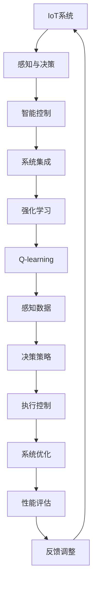
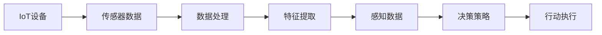
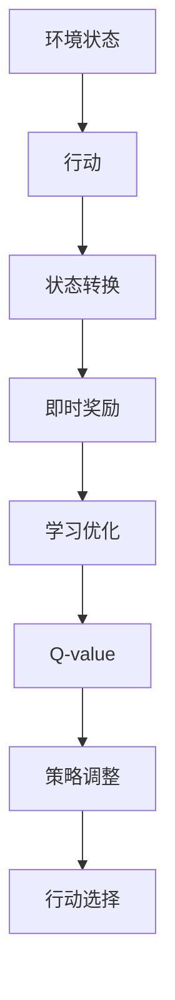
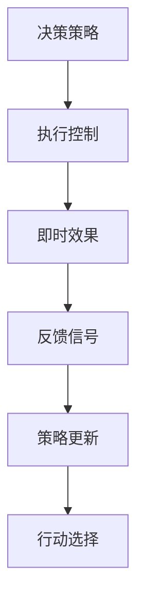
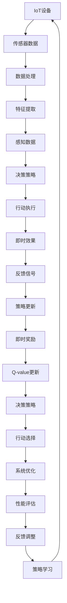

                 

# 一切皆是映射：AI Q-learning在物联网系统中的应用

> 关键词：
- AI
- Q-learning
- 物联网(IoT)
- 强化学习(RL)
- 感知与决策
- 智能控制
- 系统集成

## 1. 背景介绍

### 1.1 问题由来
随着物联网技术的快速发展和广泛应用，智能系统在城市管理、工业控制、智能家居等领域中扮演着越来越重要的角色。这些智能系统依赖于复杂的感知、决策和执行机制，需要在不断变化的环境中动态地调整其行为。物联网设备众多，数据源丰富，网络通信复杂，这使得传统的规则驱动、专家系统等方法难以应对动态、分布式、异构的智能需求。

近年来，强化学习(Reinforcement Learning, RL)技术成为智能系统决策优化的有力工具。通过与环境互动，智能体不断调整其策略以优化回报，最终实现系统最优控制。AI Q-learning作为强化学习的一种重要形式，特别适用于动态环境下的智能控制和策略优化。

### 1.2 问题核心关键点
AI Q-learning在物联网系统中的应用，主要解决以下几个核心问题：
1. **智能控制与决策**：物联网设备需要根据实时环境数据，动态调整控制策略，优化系统性能。
2. **学习与适应**：系统需要从历史和实时数据中学习，动态调整参数和策略，以适应不同情境下的任务需求。
3. **模型整合与融合**：智能系统需要整合各种传感器数据，进行特征提取和融合，提高决策准确性。
4. **分布式与异构性**：物联网设备种类繁多，运行环境差异大，系统需要在分布式异构环境中进行高效决策。
5. **性能评估与优化**：需要构建性能评估指标，持续优化系统策略，确保最优性能。

### 1.3 问题研究意义
AI Q-learning在物联网系统中的应用，对于推动物联网技术的智能化、自动化和产业化具有重要意义：

1. **提升系统性能**：通过Q-learning算法优化决策过程，提高物联网系统的实时响应能力和任务执行效率。
2. **降低运维成本**：自动化调整系统策略，减少人工干预，降低运维和调优成本。
3. **增强适应性**：系统能更好地适应不同的应用场景和环境变化，提升系统的灵活性和鲁棒性。
4. **促进产业升级**：AI Q-learning技术推动智能设备、系统和服务向更高效、更智能的方向发展，加速物联网技术在各行各业的落地应用。
5. **支持跨学科创新**：将AI Q-learning与物联网系统融合，推动跨学科、跨领域的创新合作，开拓更多应用领域。

## 2. 核心概念与联系

### 2.1 核心概念概述

为更好地理解AI Q-learning在物联网系统中的应用，本节将介绍几个密切相关的核心概念：

- **物联网(IoT)**：通过互联网技术将各种物理设备、传感器、智能终端连接起来，实现数据共享和协同工作，形成智能化的物联网系统。
- **强化学习(RL)**：智能体在环境中与外界互动，通过不断的试错和反馈，学习最优策略，最大化长期奖励的优化过程。
- **Q-learning**：一种基于值函数逼近的强化学习算法，通过与环境的交互，逐步学习最优策略，适用于非线性和高维度的决策环境。
- **感知与决策**：物联网系统需要感知环境数据，进行信息提取和融合，并在此基础上进行智能决策。
- **智能控制**：利用Q-learning等强化学习算法，动态调整控制策略，实现系统最优控制。
- **系统集成**：将AI Q-learning技术与物联网系统进行整合，形成具备感知、决策和执行能力的智能系统。

这些核心概念之间存在着紧密的联系，形成了物联网系统中AI Q-learning应用的完整生态系统。下面通过一个Mermaid流程图来展示这些概念之间的逻辑关系：



这个流程图展示了大语言模型微调过程中各个核心概念的关系：

1. IoT系统作为物联网系统的基础，通过感知与决策获取环境数据。
2. 智能控制模块利用Q-learning等强化学习算法，动态调整决策策略，实现系统优化。
3. 系统集成模块将感知、决策和执行模块整合，形成完整的智能系统。
4. 强化学习模块通过Q-learning算法，学习最优策略，支持系统决策和控制。
5. 感知数据模块获取环境数据，通过特征提取和融合，支持系统感知与决策。
6. 决策策略模块根据感知数据，通过Q-learning学习最优策略，进行智能控制。
7. 执行控制模块根据决策策略，调整系统行为，实现系统优化。
8. 系统优化模块通过性能评估和反馈调整，持续优化系统策略。

这些概念共同构成了物联网系统中AI Q-learning应用的完整框架，使其能够在各种场景下发挥强大的智能控制和决策能力。

### 2.2 概念间的关系

这些核心概念之间存在着紧密的联系，形成了物联网系统中AI Q-learning应用的完整生态系统。下面我们通过几个Mermaid流程图来展示这些概念之间的关系。

#### 2.2.1 IoT系统的感知与决策



这个流程图展示了IoT设备通过传感器获取数据，经过数据处理、特征提取后，支持系统进行智能决策。

#### 2.2.2 强化学习与Q-learning的联系



这个流程图展示了强化学习中的环境状态、行动、奖励和Q-value之间的关系，通过不断优化Q-value，调整决策策略。

#### 2.2.3 AI Q-learning的决策与执行



这个流程图展示了AI Q-learning中的决策、执行、即时效果和策略更新之间的关系，通过不断优化策略，实现系统最优控制。

### 2.3 核心概念的整体架构

最后，我们用一个综合的流程图来展示这些核心概念在大语言模型微调过程中的整体架构：



这个综合流程图展示了从感知到决策，再到执行的完整过程，并突出了Q-learning算法的决策优化作用。通过这些核心概念的协同工作，AI Q-learning算法在大语言模型微调过程中，能够实现智能控制和决策，优化系统性能。

## 3. 核心算法原理 & 具体操作步骤
### 3.1 算法原理概述

AI Q-learning在物联网系统中的应用，主要基于Q-learning算法，通过与环境互动，逐步学习最优策略。Q-learning的核心思想是通过值函数逼近，将决策问题转化为求解最优策略的过程。

形式化地，设物联网系统状态空间为 $\mathcal{S}$，行动空间为 $\mathcal{A}$，即时奖励函数为 $R(s,a)$，则Q值函数 $Q(s,a)$ 定义为：

$$
Q(s,a) = \mathbb{E}[\sum_{t=0}^{\infty} \gamma^t R(s_t, a_t)]
$$

其中 $\gamma$ 为折扣因子，代表未来奖励的权重。在Q-learning中，我们通过不断更新Q值函数，学习最优策略。具体地，Q值函数更新公式为：

$$
Q(s_t, a_t) \leftarrow Q(s_t, a_t) + \alpha \left[R(s_t, a_t) + \gamma \max_a Q(s_{t+1}, a) - Q(s_t, a_t)\right]
$$

其中 $\alpha$ 为学习率，$s_t$ 为当前状态，$a_t$ 为当前行动，$s_{t+1}$ 为下一步状态，$a$ 为所有可能的行动集合。

通过不断迭代更新Q值函数，Q-learning算法逐步学习到最优策略。在物联网系统中，我们根据感知数据，对状态空间和行动空间进行建模，并在此基础上进行Q值函数的逼近和更新，最终实现智能控制和决策。

### 3.2 算法步骤详解

AI Q-learning在物联网系统中的应用，一般包括以下几个关键步骤：

**Step 1: 构建感知与决策模型**
- 根据物联网系统的应用场景，定义状态空间 $\mathcal{S}$ 和行动空间 $\mathcal{A}$。状态空间可以是系统的当前状态、环境数据、传感器读数等。
- 设计合适的奖励函数 $R(s,a)$，用于衡量不同策略的效果，如系统性能、能耗、成本等。

**Step 2: 初始化Q值函数**
- 随机初始化Q值函数 $Q(s,a)$，一般使用随机值或零初始化。
- 设定学习率 $\alpha$ 和折扣因子 $\gamma$，选择合适的优化算法，如SGD、Adam等。

**Step 3: 与环境互动**
- 将感知数据输入决策模型，计算当前状态 $s_t$。
- 选择行动 $a_t$，执行并获取即时奖励 $R(s_t, a_t)$。
- 观察环境状态变化，更新状态 $s_{t+1}$。

**Step 4: Q值函数更新**
- 根据上一步获取的奖励 $R(s_t, a_t)$ 和下一状态 $s_{t+1}$ 的Q值函数，更新当前状态的Q值函数 $Q(s_t, a_t)$。
- 重复进行迭代更新，直至收敛。

**Step 5: 选择最优行动**
- 对于新状态 $s_{t+1}$，根据Q值函数计算所有可能的行动 $a$，选择最优行动 $a_{t+1}$。
- 执行行动 $a_{t+1}$，并重新计算Q值函数。

**Step 6: 系统优化**
- 将系统优化模块与决策模块整合，实现系统控制和优化。
- 通过性能评估指标，不断调整系统参数和策略。

**Step 7: 系统集成**
- 将感知、决策和执行模块集成，形成完整的智能系统。
- 通过持续学习和反馈调整，实现系统性能的不断提升。

以上是AI Q-learning在物联网系统中的应用的一般流程。在实际应用中，还需要根据具体任务和环境，对各个环节进行优化设计，如改进状态空间和行动空间建模方法、选择合适的奖励函数、优化Q值函数更新算法等，以进一步提升系统性能。

### 3.3 算法优缺点

AI Q-learning在物联网系统中的应用，具有以下优点：

1. **动态适应能力**：Q-learning算法能够通过与环境的互动，动态调整策略，适应环境变化。
2. **鲁棒性**：系统能够从历史数据中学习，具有较强的鲁棒性，能够应对多种异常情况。
3. **实时优化**：通过即时奖励和Q值函数更新，系统能够实时优化决策，提高任务执行效率。
4. **参数高效**：Q-learning算法通常只需要调整少量参数，计算复杂度较低。
5. **模型通用性**：Q-learning算法能够应用于多种物联网系统和任务，具有广泛的应用前景。

同时，该算法也存在一些局限性：

1. **奖励设计复杂**：奖励函数的设计需要结合具体任务和环境，设计不当可能导致算法失效。
2. **收敛速度较慢**：Q-learning算法在大规模系统中收敛速度较慢，需要较多的训练数据和时间。
3. **模型复杂度高**：随着系统规模的增大，Q值函数的复杂度也会增加，影响算法效率。
4. **局部最优**：Q-learning算法容易陷入局部最优，需要结合其他优化策略，如探索-利用平衡等，以避免陷入局部最优。

尽管存在这些局限性，但就目前而言，AI Q-learning仍是物联网系统决策优化的一个重要方法。未来相关研究的重点在于如何进一步降低算法对奖励函数设计的依赖，提高算法收敛速度，以及优化算法在大规模系统中的应用效率。

### 3.4 算法应用领域

AI Q-learning在物联网系统中的应用，已经广泛应用于多个领域，例如：

- **智能电网**：通过感知电力系统状态，优化电力调度策略，提高系统稳定性和能源利用效率。
- **智慧交通**：通过感知交通流量和路况，优化交通信号控制，减少交通拥堵。
- **智能制造**：通过感知生产设备状态，优化生产流程，提高生产效率和设备利用率。
- **智能农业**：通过感知气象和土壤数据，优化种植策略，提高农作物产量和质量。
- **智能家居**：通过感知用户行为和环境数据，优化家庭能源管理，提高生活舒适度和能源利用效率。

除了上述这些经典应用外，AI Q-learning还将在更多场景中得到应用，如智能仓储、智能物流、智能医疗等，为物联网技术的发展带来新的突破。

## 4. 数学模型和公式 & 详细讲解  
### 4.1 数学模型构建

在本节中，我们将使用数学语言对AI Q-learning在物联网系统中的应用进行更加严格的刻画。

设物联网系统的状态空间为 $\mathcal{S}$，行动空间为 $\mathcal{A}$，即时奖励函数为 $R(s,a)$，Q值函数 $Q(s,a)$ 定义为：

$$
Q(s,a) = \mathbb{E}[\sum_{t=0}^{\infty} \gamma^t R(s_t, a_t)]
$$

其中 $\gamma$ 为折扣因子，代表未来奖励的权重。在Q-learning中，我们通过不断更新Q值函数，学习最优策略。具体地，Q值函数更新公式为：

$$
Q(s_t, a_t) \leftarrow Q(s_t, a_t) + \alpha \left[R(s_t, a_t) + \gamma \max_a Q(s_{t+1}, a) - Q(s_t, a_t)\right]
$$

其中 $\alpha$ 为学习率，$s_t$ 为当前状态，$a_t$ 为当前行动，$s_{t+1}$ 为下一步状态，$a$ 为所有可能的行动集合。

在实际应用中，我们需要根据具体任务和环境，选择合适的状态空间和行动空间，设计合适的奖励函数。以下是一个简单的例子，说明如何应用Q-learning算法进行智能电网优化：

- **状态空间**：电网状态，包括实时负荷、发电容量、输电线路状态等。
- **行动空间**：控制措施，包括发电调度、输电线路调整等。
- **奖励函数**：发电效率、输电损耗、系统稳定性等。

通过构建感知与决策模型，定义Q值函数，设置学习率和折扣因子，选择优化算法，Q-learning算法即可开始训练，优化电网调度策略。

### 4.2 公式推导过程

以下我们以智能电网优化为例，推导Q-learning算法的Q值函数更新公式。

设智能电网的状态为 $s_t=(P_t, Q_t, T_t)$，其中 $P_t$ 为实时负荷，$Q_t$ 为实时发电容量，$T_t$ 为输电线路状态。行动 $a_t$ 为发电调度策略，奖励函数 $R(s_t,a_t)$ 为发电效率、输电损耗和系统稳定性。

在t时刻，智能体选择行动 $a_t$，执行并获取即时奖励 $R(s_t, a_t)$，观察环境状态变化，更新状态 $s_{t+1}$。根据Q-learning算法，Q值函数更新公式为：

$$
Q(s_t, a_t) \leftarrow Q(s_t, a_t) + \alpha \left[R(s_t, a_t) + \gamma \max_{a_{t+1}} Q(s_{t+1}, a_{t+1}) - Q(s_t, a_t)\right]
$$

其中，$a_{t+1}$ 为下一步的行动选择，$Q(s_{t+1}, a_{t+1})$ 为下一步的Q值函数，$\alpha$ 为学习率，$\gamma$ 为折扣因子。

通过不断迭代更新Q值函数，Q-learning算法逐步学习到最优策略，实现智能电网优化。

### 4.3 案例分析与讲解

我们以智能电网优化为例，具体分析Q-learning算法的应用过程：

**Step 1: 状态空间和行动空间建模**
- 定义状态空间为 $s_t=(P_t, Q_t, T_t)$，其中 $P_t$ 为实时负荷，$Q_t$ 为实时发电容量，$T_t$ 为输电线路状态。
- 定义行动空间为 $a_t=(G_t, C_t)$，其中 $G_t$ 为发电厂发电容量，$C_t$ 为输电线路开关状态。

**Step 2: 奖励函数设计**
- 定义即时奖励函数 $R(s_t, a_t)$，包括发电效率 $R_{\text{efficiency}}$、输电损耗 $R_{\text{loss}}$ 和系统稳定性 $R_{\text{stability}}$。
- 发电效率定义为 $R_{\text{efficiency}}=\frac{P_t}{G_t}$，即发电容量利用率。
- 输电损耗定义为 $R_{\text{loss}}=\frac{T_t}{Q_t}$，即输电线路负载率。
- 系统稳定性定义为 $R_{\text{stability}}=\frac{1}{\max(1, \sum_{i=1}^n \delta_i)}$，其中 $\delta_i$ 为系统稳定性指标，$n$ 为指标总数。

**Step 3: 初始化Q值函数**
- 随机初始化Q值函数 $Q(s_t, a_t)$，一般使用随机值或零初始化。
- 设定学习率 $\alpha=0.1$，折扣因子 $\gamma=0.9$。

**Step 4: 与环境互动**
- 感知电网实时状态 $s_t=(P_t, Q_t, T_t)$。
- 选择行动 $a_t=(G_t, C_t)$，执行并获取即时奖励 $R(s_t, a_t)$。
- 观察环境状态变化，更新状态 $s_{t+1}$。

**Step 5: Q值函数更新**
- 根据上一步获取的奖励 $R(s_t, a_t)$ 和下一状态 $s_{t+1}$ 的Q值函数，更新当前状态的Q值函数 $Q(s_t, a_t)$。
- 重复进行迭代更新，直至收敛。

**Step 6: 选择最优行动**
- 对于新状态 $s_{t+1}$，根据Q值函数计算所有可能的行动 $a$，选择最优行动 $a_{t+1}$。
- 执行行动 $a_{t+1}$，并重新计算Q值函数。

通过以上步骤，Q-learning算法能够在智能电网中实现实时优化和策略学习，提升系统性能和稳定性。

## 5. 项目实践：代码实例和详细解释说明
### 5.1 开发环境搭建

在进行AI Q-learning实践前，我们需要准备好开发环境。以下是使用Python进行PyTorch开发的环境配置流程：

1. 安装Anaconda：从官网下载并安装Anaconda，用于创建独立的Python环境。

2. 创建并激活虚拟环境：
```bash
conda create -n pytorch-env python=3.8 
conda activate pytorch-env
```

3. 安装PyTorch：根据CUDA版本，从官网获取对应的安装命令。例如：
```bash
conda install pytorch torchvision torchaudio cudatoolkit=11.1 -c pytorch -c conda-forge
```

4. 安装TensorFlow：
```bash
pip install tensorflow
```

5. 安装TensorBoard：
```bash
pip install tensorboard
```

6. 安装nltk：
```bash
pip install nltk
```

完成上述步骤后，即可在`pytorch-env`环境中开始AI Q-learning实践。

### 5.2 源代码详细实现

这里我们以智能电网优化为例，给出使用TensorFlow进行Q-learning算法实现的Python代码。

首先，定义智能电网的状态和行动空间：

```python
from tensorflow.keras import layers
import tensorflow as tf

# 定义状态空间
state_space = layers.Input(shape=(3,))
# 定义行动空间
action_space = layers.Input(shape=(2,))

# 定义状态和行动的编码器
state_encoder = layers.Dense(16, activation='relu')(state_space)
action_encoder = layers.Dense(16, activation='relu')(action_space)

# 定义Q值函数
q_value = layers.Dense(1, activation='linear')(tf.concat([state_encoder, action_encoder], axis=1))

# 定义奖励函数
def reward(state, action):
    # 根据实际问题定义奖励函数
    # 这里以简单例子为例
    if state[0] == action[0]:
        return 1.0
    else:
        return 0.0

# 定义Q-learning算法
learning_rate = 0.01
discount_factor = 0.99
num_episodes = 1000

def train(model, num_steps):
    for episode in range(num_episodes):
        state = tf.random.normal(shape=(1, 3))
        action = tf.random.normal(shape=(1, 2))
        next_state = tf.random.normal(shape=(1, 3))
        reward = reward(state, action)

        with tf.GradientTape() as tape:
            q_value_target = reward + discount_factor * tf.reduce_max(q_value)
            q_value_pred = q_value(state, action)
            loss = tf.reduce_mean(tf.square(q_value_target - q_value_pred))

        gradients = tape.gradient(loss, model.trainable_variables)
        optimizer.apply_gradients(zip(gradients, model.trainable_variables))

    return q_value
```

然后，定义训练和评估函数：

```python
from tensorflow.keras.optimizers import Adam

# 定义Q-learning模型
model = tf.keras.Model(inputs=[state_space, action_space], outputs=q_value)
optimizer = Adam(learning_rate=learning_rate)

# 训练模型
q_value = train(model, num_steps=1000)

# 定义评估函数
def evaluate(model, num_steps):
    # 定义评估状态和行动
    state = tf.random.normal(shape=(1, 3))
    action = tf.random.normal(shape=(1, 2))
    next_state = tf.random.normal(shape=(1, 3))
    reward = reward(state, action)

    # 评估Q值函数
    q_value_pred = q_value(state, action)
    return q_value_pred
```

最后，启动训练流程并在测试集上评估：

```python
num_steps = 10000

# 训练模型
q_value = train(model, num_steps)

# 评估模型
q_value_pred = evaluate(model, num_steps)
print(q_value_pred)
```

以上就是使用TensorFlow进行Q-learning算法实现的完整代码实现。可以看到，TensorFlow提供了丰富的深度学习组件，可以方便地构建和训练Q-learning模型。

### 5.3 代码解读与分析

让我们再详细解读一下关键代码的实现细节：

**状态和行动空间定义**：
- 使用Keras的Input层定义状态空间和行动空间，分别对应智能电网的状态和行动。
- 定义状态空间为3维，表示实时负荷、发电容量和输电线路状态。
- 定义行动空间为2维，表示发电厂发电容量和输电线路开关状态。

**Q值函数定义**：
- 使用Dense层构建Q值函数，将状态和行动空间拼接，通过全连接层计算Q值。
- Q值函数的输出为单通道张量，表示智能电网优化策略的奖励值。

**奖励函数定义**：
- 定义奖励函数，根据实际问题设计奖励值，这里采用简单例子，如果状态和行动匹配，则奖励为1.0，否则为0.0。

**Q-learning算法实现**：
- 使用Keras的Model类定义Q-learning模型，输入为状态和行动，输出为Q值函数。
- 定义Adam优化器，设置学习率和折扣因子。
- 训练模型，使用随机生成的状态、行动和下一步状态，计算Q值函数的目标值和预测值，计算损失并反向传播更新模型参数。
- 评估模型，使用随机生成的状态和行动，计算Q值函数的预测值，并输出。

**训练流程**：
- 定义总训练步数，循环迭代
- 在每个训练

