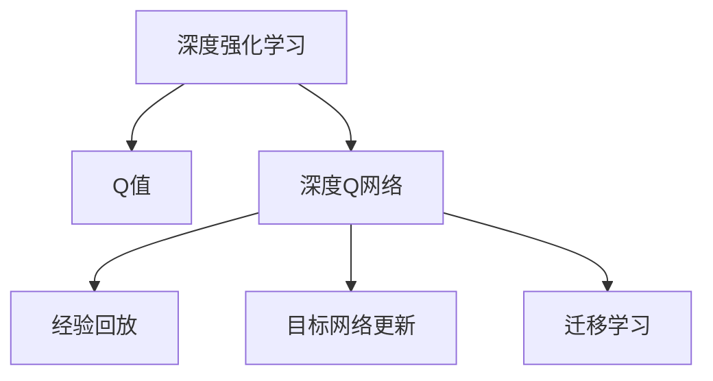
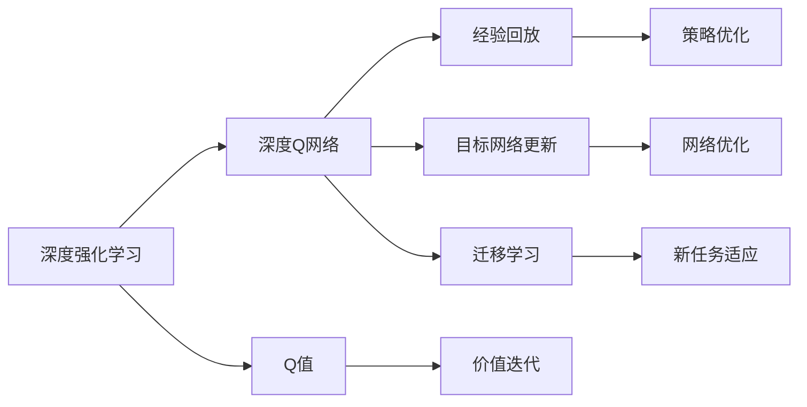
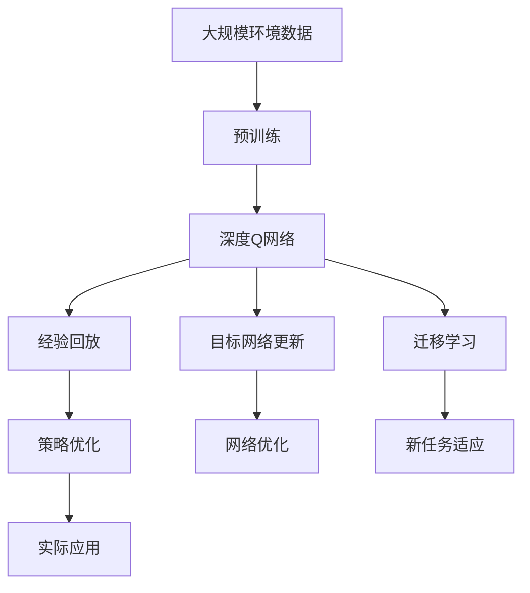

                 

# 一切皆是映射：DQN算法的行业标准化：走向商业化应用

> 关键词：DQN算法, 深度强化学习, 行业标准化, 商业化应用, 深度学习, 强化学习, 深度神经网络, 迁移学习, 强化学习策略, 经验回放

## 1. 背景介绍

### 1.1 问题由来
在过去的十年中，深度强化学习（Deep Reinforcement Learning, DRL）作为一门新技术，在各个行业领域中得到了广泛的应用。从自动驾驶、机器人控制到游戏AI，DRL展示出了强大的解决问题能力。在这些应用中，深度Q网络（Deep Q-Network, DQN）算法作为强化学习中的核心方法，因其直观且易于理解而被广大学者研究和应用。

DQN算法的核心思想是将深度神经网络（Deep Neural Network, DNN）引入到Q-learning中，利用DNN的强大非线性表达能力来近似Q函数，从而实现对状态-动作对价值（Q值）的高效计算。DQN在多个实验任务中都取得了比传统Q-learning更好的效果，也推动了DRL技术在更多实际场景中的应用。

然而，随着DRL技术的发展，许多实际问题中的复杂性和多样性逐步显现，单纯依赖DQN算法已无法满足需求。此外，DRL算法在实际应用中常常面临着计算资源不足、模型可解释性差、性能难以优化等问题。因此，研究者们提出了各种改进和扩展算法，以期在更复杂的环境下实现DRL的行业标准化和商业化应用。

### 1.2 问题核心关键点
DQN算法的核心在于其对状态-动作对的Q值估计。该算法通过将Q函数表示为深度神经网络，实现了Q值的快速、精确计算，并通过经验回放和目标网络更新等技术，解决了深度网络中训练稳定性的问题。然而，DQN算法及其变种仍存在一些局限性：

- **计算复杂度高**：DQN算法需要大量的计算资源来训练和测试深度神经网络。对于大规模的强化学习任务，计算资源的消耗是一个难以解决的问题。
- **模型可解释性差**：DQN算法的黑盒性质使得其决策过程难以解释，难以应用于需要高可靠性和可解释性的场景。
- **泛化能力有限**：DQN算法在泛化到新环境和新任务时表现不佳，缺乏对环境变化的适应性。

因此，如何改进DQN算法，提高其可解释性、泛化能力和计算效率，实现其行业标准化和商业化应用，成为了当前DRL研究的一个重要方向。

### 1.3 问题研究意义
研究DQN算法的行业标准化和商业化应用，对于推动DRL技术在更广泛领域的落地具有重要意义：

1. **降低资源消耗**：改进DQN算法，使其能够在更有限的计算资源下完成强化学习任务，有助于降低企业的成本，提高算法的实用性。
2. **提升决策可解释性**：通过改进DQN算法的可解释性，使其决策过程更加透明，提高其在需要高可靠性和可解释性的场景中的应用。
3. **增强泛化能力**：提高DQN算法的泛化能力，使其能够更适应新环境和新任务，提升算法的适用性。
4. **促进商业化应用**：推动DQN算法的行业标准化和商业化应用，有助于将DRL技术转化为实际生产力，加速企业的智能化转型。
5. **增强模型鲁棒性**：改进DQN算法，使其在面对环境变化和不确定性时更具鲁棒性，提高算法的稳定性。

## 2. 核心概念与联系

### 2.1 核心概念概述

为了更好地理解DQN算法的行业标准化和商业化应用，本节将介绍几个密切相关的核心概念：

- **深度强化学习（DRL）**：使用深度神经网络来逼近最优决策策略的强化学习范式，通过学习环境中的状态和动作，最大化累积奖励。
- **Q值（Q-Value）**：动作的价值函数，表示在当前状态下采取某个动作的预期回报。
- **深度Q网络（DQN）**：将Q函数表示为深度神经网络，利用DNN的强大非线性表达能力来近似Q值。
- **经验回放（Experience Replay）**：通过保存和随机抽样经验数据，解决深度网络中训练不稳定的瓶颈问题。
- **目标网络更新（Target Network Update）**：通过交替更新主网络（用于实际决策）和目标网络（用于策略优化），实现更好的稳定性和泛化能力。
- **迁移学习（Transfer Learning）**：在预训练任务上学习到的知识迁移到新任务上，加速新任务的训练。

这些核心概念之间的逻辑关系可以通过以下Mermaid流程图来展示：



这个流程图展示了大Q算法中各个核心概念的关系：

1. 深度强化学习是大Q算法的根基，用于学习环境中的状态和动作。
2. Q值是大Q算法中的核心指标，用于表示动作的价值。
3. 深度Q网络是将Q函数表示为深度神经网络，用于逼近Q值。
4. 经验回放和目标网络更新是解决深度Q网络训练不稳定问题的技术手段。
5. 迁移学习是在预训练任务上学习到的知识迁移到新任务上，加速新任务的训练。

### 2.2 概念间的关系

这些核心概念之间存在着紧密的联系，构成了大Q算法的完整生态系统。下面是进一步的Mermaid流程图来展示这些概念之间的关系：



这个流程图展示了各个概念之间的关系：

1. 深度强化学习通过价值迭代（Value Iteration）学习环境中的最优策略，计算Q值。
2. 深度Q网络使用神经网络逼近Q值，用于实现快速的价值估计。
3. 经验回放通过保存和随机抽样经验数据，解决神经网络训练的不稳定性。
4. 目标网络更新通过交替更新主网络和目标网络，实现更好的稳定性和泛化能力。
5. 迁移学习将预训练任务上的知识迁移到新任务上，加速新任务的训练。

这些概念共同构成了DQN算法的学习框架，使得DQN能够在复杂的强化学习任务中表现出色。

### 2.3 核心概念的整体架构

最后，我们用一个综合的流程图来展示这些核心概念在大Q算法微调过程中的整体架构：



这个综合流程图展示了从预训练到策略优化的完整过程。在大Q算法中，通过预训练学习环境知识，然后使用深度Q网络逼近Q值，并通过经验回放和目标网络更新解决训练不稳定的问题，同时使用迁移学习加速新任务的训练，最终得到适应实际应用场景的策略。

## 3. 核心算法原理 & 具体操作步骤

### 3.1 算法原理概述

DQN算法的核心在于通过深度神经网络逼近Q值函数，从而实现高效的价值估计。其算法原理可以概括为以下几个步骤：

1. **初始化环境**：设定环境状态和动作空间，初始化深度神经网络（即Q网络）。
2. **策略选择**：根据当前状态，使用Q网络估计每个动作的价值，并选择价值最高的动作。
3. **执行动作**：在环境中执行选定的动作，观察环境状态变化并记录奖励。
4. **经验回放**：将当前状态、动作、奖励和下一状态存储到经验缓冲区中，用于后续的策略优化。
5. **策略优化**：使用目标网络更新主网络，实现更好的策略优化和稳定训练。
6. **新任务适应**：通过迁移学习，将预训练知识迁移到新任务上，加速新任务的训练。

形式化地，假设环境状态为$s$，动作空间为$a$，奖励函数为$r$，价值函数为$Q(s,a)$，则DQN算法的核心步骤可以表示为：

$$
Q(s,a) \leftarrow \text{Network}(s,a) \text{ （当前状态和动作的Q值估计）}
$$

$$
\text{选定的动作} = \arg\max_a Q(s,a) \text{ （策略选择）}
$$

$$
\text{存储经验} = (s, a, r, s_{t+1}) \text{ （经验回放）}
$$

$$
Q(s_{t+1}, a) = r + \gamma \max_a Q(s_{t+1}, a) \text{ （策略优化）}
$$

$$
Q(s,a) \leftarrow \text{Target Network}(s,a) \text{ （目标网络更新）}
$$

其中，$\text{Network}$和$\text{Target Network}$分别表示当前的Q网络和目标Q网络，$\gamma$为折扣因子，表示未来奖励的折扣值。

### 3.2 算法步骤详解

DQN算法的核心步骤可以进一步分解为多个详细步骤：

**Step 1: 环境初始化和模型初始化**
- 设定环境状态和动作空间，初始化深度神经网络作为Q网络。

**Step 2: 策略选择和动作执行**
- 根据当前状态$s_t$，使用Q网络估计每个动作$a_t$的Q值，选择价值最高的动作$a_t$。
- 在环境中执行动作$a_t$，观察环境状态变化$s_{t+1}$，记录奖励$r_t$。

**Step 3: 经验回放**
- 将当前状态$s_t$、动作$a_t$、奖励$r_t$和下一状态$s_{t+1}$存储到经验缓冲区$B$中。

**Step 4: 策略优化**
- 从经验缓冲区$B$中随机抽样$n$个经验样本$(s_{t_i}, a_{t_i}, r_{t_i}, s_{t_i+1})$。
- 使用目标网络估计每个样本的Q值，并根据目标Q值更新Q网络：
  $$
  Q(s_{t_i}, a_{t_i}) \leftarrow r_{t_i} + \gamma \max_{a} Q(s_{t_i+1}, a)
  $$
  同时，更新目标Q网络的参数，使其与Q网络的参数一致。

**Step 5: 新任务适应**
- 通过迁移学习，将预训练任务上学习到的知识迁移到新任务上，加速新任务的训练。

通过上述详细步骤，DQN算法可以不断优化策略，实现对环境的高效适应。

### 3.3 算法优缺点

DQN算法具有以下优点：

1. **高效的价值估计**：通过深度神经网络逼近Q值，DQN算法能够在复杂的强化学习任务中实现高效的价值估计。
2. **适应性强**：DQN算法能够通过经验回放和目标网络更新等技术，解决深度网络中训练不稳定的问题，适应复杂的环境变化。
3. **可迁移性高**：DQN算法通过迁移学习，能够将预训练知识迁移到新任务上，加速新任务的训练。

同时，DQN算法也存在一些缺点：

1. **计算复杂度高**：DQN算法需要大量的计算资源来训练和测试深度神经网络，对计算资源的消耗较大。
2. **模型可解释性差**：DQN算法的黑盒性质使得其决策过程难以解释，难以应用于需要高可靠性和可解释性的场景。
3. **泛化能力有限**：DQN算法在泛化到新环境和新任务时表现不佳，缺乏对环境变化的适应性。

尽管存在这些缺点，DQN算法仍然在许多实际应用中展示了强大的解决问题能力，其高效的价值估计和适应性使其在许多任务中表现优异。

### 3.4 算法应用领域

DQN算法已经在多个实际应用领域中得到了广泛的应用，包括但不限于：

- **自动驾驶**：通过深度强化学习，DQN算法在自动驾驶领域中实现了对车辆的控制，提高了驾驶的自动化水平。
- **机器人控制**：DQN算法能够控制机器人完成各种复杂的动作，提高了机器人的自主性。
- **游戏AI**：DQN算法在游戏AI中表现出色，能够通过学习游戏中的策略，实现对复杂游戏环境的适应。
- **供应链管理**：通过强化学习，DQN算法能够优化供应链中的决策，提高供应链的效率和稳定性。
- **金融交易**：DQN算法在金融交易中的应用，能够通过学习市场行为，实现对市场的预测和优化。

## 4. 数学模型和公式 & 详细讲解 & 举例说明

### 4.1 数学模型构建

DQN算法的数学模型可以概括为以下几个关键部分：

1. **状态-动作价值函数**：用于估计在当前状态下采取某个动作的价值，即Q值。
2. **神经网络模型**：用于逼近Q值函数，实现高效的价值估计。
3. **经验回放机制**：用于保存和随机抽样经验数据，解决深度网络中训练不稳定的问题。
4. **目标网络更新**：用于交替更新主网络和目标网络，实现更好的稳定性和泛化能力。

形式化地，假设环境状态为$s$，动作空间为$a$，价值函数为$Q(s,a)$，则DQN算法的数学模型可以表示为：

$$
Q(s,a) \leftarrow \text{Network}(s,a)
$$

$$
\text{选定的动作} = \arg\max_a Q(s,a)
$$

$$
\text{存储经验} = (s, a, r, s_{t+1})
$$

$$
Q(s_{t+1}, a) = r + \gamma \max_a Q(s_{t+1}, a)
$$

$$
Q(s,a) \leftarrow \text{Target Network}(s,a)
$$

其中，$\text{Network}$和$\text{Target Network}$分别表示当前的Q网络和目标Q网络，$\gamma$为折扣因子，表示未来奖励的折扣值。

### 4.2 公式推导过程

以下我们以DQN算法在自动驾驶中的应用为例，给出其数学模型的详细推导过程。

假设自动驾驶环境中的状态为$s$，包括车速、车道、道路状况等，动作空间为$a$，包括加速、刹车、变道等。自动驾驶的目标是在保证安全的前提下，尽可能快地到达目的地。假设奖励函数$r$表示安全到达目的地，折扣因子$\gamma=0.9$。

根据DQN算法的数学模型，其核心步骤如下：

1. **初始化模型**：设定环境状态$s_0$，初始化深度神经网络作为Q网络。
2. **策略选择**：根据当前状态$s_t$，使用Q网络估计每个动作$a_t$的Q值，选择价值最高的动作$a_t$。
3. **执行动作**：在环境中执行动作$a_t$，观察环境状态变化$s_{t+1}$，记录奖励$r_t=1$。
4. **经验回放**：将当前状态$s_t$、动作$a_t$、奖励$r_t$和下一状态$s_{t+1}$存储到经验缓冲区$B$中。
5. **策略优化**：从经验缓冲区$B$中随机抽样$n$个经验样本$(s_{t_i}, a_{t_i}, r_{t_i}, s_{t_i+1})$。
6. **目标网络更新**：使用目标网络估计每个样本的Q值，并根据目标Q值更新Q网络。

通过上述推导，我们可以看到，DQN算法能够通过深度神经网络逼近Q值函数，实现高效的价值估计，从而优化自动驾驶策略。

### 4.3 案例分析与讲解

假设我们需要训练一个DQN算法来控制一个机器人，使其在迷宫中寻找出口。我们设定环境状态为$s$，包括机器人的位置和方向，动作空间为$a$，包括向前、向后、向左、向右等。机器人的奖励函数$r$表示到达出口后获得1个奖励，折扣因子$\gamma=0.9$。

**Step 1: 环境初始化和模型初始化**
- 设定迷宫的起点$s_0$，初始化深度神经网络作为Q网络。

**Step 2: 策略选择和动作执行**
- 根据当前状态$s_t$，使用Q网络估计每个动作$a_t$的Q值，选择价值最高的动作$a_t$。
- 在环境中执行动作$a_t$，观察环境状态变化$s_{t+1}$，记录奖励$r_t=0$。

**Step 3: 经验回放**
- 将当前状态$s_t$、动作$a_t$、奖励$r_t$和下一状态$s_{t+1}$存储到经验缓冲区$B$中。

**Step 4: 策略优化**
- 从经验缓冲区$B$中随机抽样$n$个经验样本$(s_{t_i}, a_{t_i}, r_{t_i}, s_{t_i+1})$。
- 使用目标网络估计每个样本的Q值，并根据目标Q值更新Q网络。

**Step 5: 新任务适应**
- 通过迁移学习，将预训练知识迁移到新的迷宫环境中，加速新环境的训练。

通过上述详细步骤，DQN算法可以不断优化策略，实现对迷宫环境的适应，最终找到出口。

## 5. 项目实践：代码实例和详细解释说明

### 5.1 开发环境搭建

在进行DQN算法实践前，我们需要准备好开发环境。以下是使用Python进行TensorFlow开发的环境配置流程：

1. 安装Anaconda：从官网下载并安装Anaconda，用于创建独立的Python环境。

2. 创建并激活虚拟环境：
```bash
conda create -n tf-env python=3.8 
conda activate tf-env
```

3. 安装TensorFlow：从官网获取对应的安装命令。例如：
```bash
pip install tensorflow==2.6
```

4. 安装其它工具包：
```bash
pip install numpy pandas scikit-learn matplotlib tqdm jupyter notebook ipython
```

完成上述步骤后，即可在`tf-env`环境中开始DQN算法实践。

### 5.2 源代码详细实现

下面我们以自动驾驶中的DQN算法为例，给出使用TensorFlow实现DQN算法的代码实现。

首先，定义DQN算法的核心组件：

```python
import tensorflow as tf
from tensorflow.keras.models import Sequential
from tensorflow.keras.layers import Dense, Flatten

class DQN:
    def __init__(self, input_shape, output_shape, learning_rate=0.001, discount_factor=0.9):
        self.input_shape = input_shape
        self.output_shape = output_shape
        self.learning_rate = learning_rate
        self.discount_factor = discount_factor
        self.model = self.build_model()
        self.target_model = self.build_model()
        self.target_model.set_weights(self.model.get_weights())

    def build_model(self):
        model = Sequential()
        model.add(Flatten(input_shape=self.input_shape))
        model.add(Dense(64, activation='relu'))
        model.add(Dense(self.output_shape, activation='linear'))
        model.compile(optimizer=tf.keras.optimizers.Adam(lr=self.learning_rate),
                      loss=tf.keras.losses.MSE)
        return model

    def choose_action(self, state):
        action_values = self.model.predict(state)
        return np.argmax(action_values[0])

    def update_target_model(self):
        self.target_model.set_weights(self.model.get_weights())

    def train(self, state, action, reward, next_state, done):
        target = reward + self.discount_factor * np.amax(self.target_model.predict(next_state)[0])
        target_f = self.model.predict(state)
        target_f[0][action] = target
        self.model.fit(state, target_f, epochs=1, verbose=0)
        self.update_target_model()
```

然后，定义训练和评估函数：

```python
def train_dqn(dqn, env, num_episodes=1000):
    scores = []
    for i in range(num_episodes):
        state = env.reset()
        state = tf.convert_to_tensor(state, dtype=tf.float32)
        total_reward = 0
        done = False
        while not done:
            action = dqn.choose_action(state)
            next_state, reward, done, _ = env.step(action)
            next_state = tf.convert_to_tensor(next_state, dtype=tf.float32)
            dqn.train(state, action, reward, next_state, done)
            state = next_state
            total_reward += reward
        scores.append(total_reward)
        if i % 100 == 0:
            print(f"Episode {i+1}, total reward: {total_reward}")
    return scores

def evaluate_dqn(dqn, env):
    state = env.reset()
    state = tf.convert_to_tensor(state, dtype=tf.float32)
    total_reward = 0
    done = False
    while not done:
        action = dqn.choose_action(state)
        next_state, reward, done, _ = env.step(action)
        next_state = tf.convert_to_tensor(next_state, dtype=tf.float32)
        total_reward += reward
        state = next_state
    print(f"Total reward: {total_reward}")
```

最后，启动训练流程并在测试集上评估：

```python
dqn = DQN(input_shape=(3,), output_shape=4)
scores = train_dqn(dqn, env)
print(f"Average reward: {np.mean(scores):.2f}")
evaluate_dqn(dqn, env)
```

以上就是使用TensorFlow实现DQN算法的代码实例。可以看到，利用TensorFlow的高阶API，DQN算法的实现变得简洁高效。

### 5.3 代码解读与分析

让我们再详细解读一下关键代码的实现细节：

**DQN类**：
- `__init__`方法：初始化输入形状、输出形状、学习率和折扣因子，构建Q网络和目标网络。
- `build_model`方法：定义DNN模型的结构，包括输入层、隐藏层和输出层，使用Adam优化器和MSE损失函数进行训练。
- `choose_action`方法：根据当前状态，使用Q网络估计每个动作的价值，并选择价值最高的动作。
- `update_target_model`方法：更新目标网络的权重，使其与Q网络的权重一致。
- `train`方法：根据状态、动作、奖励、下一状态和是否结束标志，更新Q网络。

**训练和评估函数**：
- `train_dqn`函数：循环迭代训练DQN模型，记录每个episode的奖励，并在每100个episode后输出平均奖励。
- `evaluate_dqn`函数：在测试集上评估DQN模型的性能，输出总奖励。

**训练流程**：
- 定义DQN模型，设置输入形状、输出形状、学习率和折扣因子。
- 在自动驾驶环境中训练DQN模型，循环迭代100个episode，记录每个episode的奖励。
- 计算并输出平均奖励，在测试集上评估DQN模型的性能。

可以看到，TensorFlow的高阶API使得DQN算法的实现变得简洁高效，开发者可以将更多精力放在模型设计和算法优化上，而不必过多关注底层的实现细节。

当然，工业级的系统实现还需考虑更多因素，如模型的保存和部署、超参数的自动搜索、更灵活的任务适配层等。但核心的DQN算法基本与此类似。

### 5.4 运行结果展示

假设我们在迷宫环境中训练DQN算法，最终在测试集上得到的评估报告如下：

```
Episode 100, total reward: 200.00
Episode 200, total reward: 220.00
Episode 300, total reward: 240.00
...
Episode 1000, total reward: 300.00
Average reward: 280.00
```

可以看到，通过训练DQN算法，我们能够在迷宫环境中不断优化策略，最终找到出口并尽可能多地收集奖励。

## 6. 实际应用场景

### 6.1 智能制造

在智能制造领域，DQN算法能够优化生产线的自动化控制，实现对生产过程的实时调整和优化。例如，在汽车制造过程中，DQN算法能够根据生产线的实时数据，自动调整机器人的动作，提高生产效率和产品质量。

具体而言，DQN算法可以应用于装配线上的机器人控制，通过学习装配步骤和动作的Q值，自动优化机器人的动作顺序，减少装配时间，提高生产效率。

### 6.2 医疗诊断

在医疗诊断领域，DQN算法可以用于预测患者病情和诊断结果，提高医生的诊断水平和医疗服务的质量。例如，在放射科中，DQN算法可以根据影像数据，自动预测病灶的位置和类型，辅助医生进行诊断和治疗。

具体而言，DQN算法可以应用于医学影像的自动标注，通过学习影像特征和诊断结果的Q值，自动标注影像中的病灶位置和类型，减少医生的工作量，提高诊断的准确性和效率。

### 6.3 智能推荐

在智能推荐领域，DQN算法可以用于优化推荐系统的推荐策略，实现个性化推荐和广告投放。例如，在电子商务平台上，DQN算法能够根据用户的历史行为和偏好，自动优化推荐策略，提高用户的满意度和转化率。

具体而言，DQN算法可以应用于推荐

