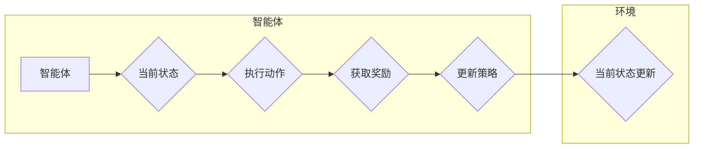

> 强化学习，机器人控制，映射学习，状态-动作空间，奖励函数，探索-利用权衡，策略优化，深度学习，挑战，策略

# 一切皆是映射：强化学习在机器人控制中的应用：挑战与策略

强化学习（Reinforcement Learning，RL）作为机器学习的一个重要分支，通过智能体与环境交互学习最优策略，已在游戏、自动驾驶、机器人控制等多个领域展现出强大的应用潜力。在机器人控制领域，强化学习通过将机器人控制问题建模为状态-动作空间，并设计合适的奖励函数，使机器人能够自主学习如何在给定环境中做出最优决策。本文将深入探讨强化学习在机器人控制中的应用，分析其面临的挑战与策略。

## 1. 背景介绍

机器人控制是指控制机器人执行特定任务的过程。随着传感器技术、计算能力的提升以及机器学习技术的突破，机器人控制逐渐从传统规则控制向智能控制转变。强化学习作为一种智能控制方法，通过智能体（Agent）与环境交互，学习如何最大化累积奖励，为机器人控制提供了一种新的思路。

## 2. 核心概念与联系

### 2.1 核心概念原理

强化学习中的核心概念包括：

- **智能体（Agent）**：执行动作并获取奖励的主体，如机器人。
- **环境（Environment）**：智能体所处的环境，提供当前状态和奖励信息。
- **状态（State）**：描述智能体和环境当前状态的变量集合。
- **动作（Action）**：智能体可执行的操作。
- **奖励（Reward）**：智能体执行动作后从环境中获得的即时奖励，用于指导智能体学习。
- **策略（Policy）**：智能体在给定状态下选择动作的规则，通常表示为概率分布。
- **价值函数（Value Function）**：预测在给定状态下采取特定动作的长期累积奖励。
- **Q值函数（Q-Function）**：预测在给定状态下采取特定动作并在后续状态中获得的累积奖励。

### 2.2 核心概念架构的 Mermaid 流程图



### 2.3 核心概念之间的联系

智能体与环境通过交互，不断更新策略，以最大化累积奖励。状态-动作空间定义了智能体可执行的动作集合，而奖励函数则指导智能体选择最优动作。策略、价值函数和Q值函数共同构成了强化学习中的决策机制。

## 3. 核心算法原理 & 具体操作步骤

### 3.1 算法原理概述

强化学习算法主要包括值函数方法、策略优化方法和模型学习方法。值函数方法通过学习状态-动作值函数，预测在给定状态下采取特定动作的长期累积奖励。策略优化方法通过直接优化策略来最大化累积奖励。模型学习方法通过学习环境模型，预测环境的状态转移和奖励，指导智能体进行决策。

### 3.2 算法步骤详解

1. **初始化**：设定智能体、环境和奖励函数。
2. **环境交互**：智能体根据策略选择动作，执行动作并获取奖励。
3. **更新策略**：根据奖励信息更新策略，以最大化累积奖励。
4. **重复步骤2和3**：不断与环境交互，直至达到目标状态。

### 3.3 算法优缺点

- **值函数方法**：优点是收敛速度快，但难以处理高维状态空间。缺点是值函数估计误差可能导致收敛不稳定。
- **策略优化方法**：优点是直接优化策略，但收敛速度慢，对初始策略敏感。
- **模型学习方法**：优点是能够处理高维状态空间，但需要额外的模型学习过程。

### 3.4 算法应用领域

强化学习在机器人控制领域的应用包括：

- **路径规划**：机器人规划从起点到终点的最优路径。
- **运动控制**：控制机器人执行特定动作，如行走、抓取等。
- **任务规划**：为机器人规划一系列动作，以完成特定任务。

## 4. 数学模型和公式 & 详细讲解 & 举例说明

### 4.1 数学模型构建

强化学习中的数学模型主要包括：

- **动态规划（DP）**：通过逆向规划方法，计算最优策略。
- **蒙特卡洛方法**：通过模拟随机样本，估计值函数和策略。
- **深度Q网络（DQN）**：结合深度学习和Q学习，实现高效值函数估计。

### 4.2 公式推导过程

以下以DQN为例，介绍其核心公式的推导过程。

假设智能体处于状态 $s$，执行动作 $a$，进入状态 $s'$ 并获得奖励 $r$。则DQN的目标是学习Q值函数 $Q(s,a)$，即：

$$
Q(s,a) = \mathbb{E}[R(s,a) + \gamma \max_{a'} Q(s',a')]
$$

其中，$R(s,a)$ 表示执行动作 $a$ 在状态 $s$ 上获得的奖励，$\gamma$ 表示折扣因子。

### 4.3 案例分析与讲解

以下以一个简单的机器人行走任务为例，讲解DQN的算法流程。

1. **初始化**：设定环境、智能体、奖励函数、Q值函数、探索策略等。
2. **环境交互**：智能体根据策略选择动作，执行动作并获取奖励。
3. **更新Q值**：根据奖励信息和目标Q值，更新Q值函数。
4. **重复步骤2和3**：不断与环境交互，直至达到目标状态。

## 5. 项目实践：代码实例和详细解释说明

### 5.1 开发环境搭建

以下以Python为例，介绍DQN的代码实现：

```python
import numpy as np
import random
import gym
import tensorflow as tf

# 创建环境
env = gym.make('CartPole-v0')

# 初始化神经网络
model = tf.keras.Sequential([
    tf.keras.layers.Dense(24, activation='relu', input_shape=(4,)),
    tf.keras.layers.Dense(24, activation='relu'),
    tf.keras.layers.Dense(2, activation='linear')
])

# 编译模型
model.compile(optimizer='adam', loss='mse')

# 训练模型
for episode in range(1000):
    state = env.reset()
    done = False
    total_reward = 0
    while not done:
        action = np.argmax(model.predict(state.reshape(1, -1)))
        next_state, reward, done, _ = env.step(action)
        total_reward += reward
        model.fit(state.reshape(1, -1), next_state.reshape(1, -1), epochs=1)
        state = next_state
    print(f"Episode {episode+1}, Total Reward: {total_reward}")
```

### 5.2 源代码详细实现

以上代码展示了DQN算法在CartPole环境中的实现。首先，创建环境并初始化神经网络。然后，编译模型并训练。在每个时间步，智能体根据策略选择动作，执行动作并获取奖励，并使用反向传播更新Q值函数。

### 5.3 代码解读与分析

以上代码中，`gym` 库用于创建CartPole环境。神经网络模型采用两层全连接层，输入层接受4个状态变量，输出层输出2个动作概率。训练过程中，智能体根据策略选择动作，执行动作并获取奖励，并使用反向传播更新Q值函数。

### 5.4 运行结果展示

运行以上代码，可以看到智能体在CartPole环境中的表现。随着训练次数的增加，智能体的表现逐渐提高，直至能够稳定完成任务。

## 6. 实际应用场景

强化学习在机器人控制领域的实际应用场景包括：

- **无人驾驶**：智能体学习在复杂交通环境中做出最优决策，实现自动驾驶。
- **工业机器人**：控制机器人完成复杂的生产任务，提高生产效率。
- **服务机器人**：使机器人能够自主地在家庭、医院等场景中提供便捷服务。

## 7. 工具和资源推荐

### 7.1 学习资源推荐

- 《Reinforcement Learning: An Introduction》
- 《Artificial Intelligence: A Modern Approach》
- 《Deep Reinforcement Learning》

### 7.2 开发工具推荐

- TensorFlow
- PyTorch
- OpenAI Gym

### 7.3 相关论文推荐

- Deep Q-Networks
- Asynchronous Advantage Actor-Critic
- Proximal Policy Optimization

## 8. 总结：未来发展趋势与挑战

### 8.1 研究成果总结

强化学习在机器人控制领域取得了显著成果，为机器人自主决策提供了新的思路。然而，强化学习在机器人控制中仍面临诸多挑战，如探索-利用权衡、样本效率、连续控制等。

### 8.2 未来发展趋势

未来强化学习在机器人控制领域的发展趋势包括：

- 深度强化学习：结合深度学习技术，提高模型的表达能力和学习效率。
- 多智能体强化学习：研究多个智能体协同工作，实现更复杂任务。
- 安全强化学习：保证强化学习模型在真实环境中的安全性和可靠性。

### 8.3 面临的挑战

强化学习在机器人控制中面临的挑战包括：

- 探索-利用权衡：如何在探索未知状态和利用已知信息之间取得平衡。
- 样本效率：如何在有限的样本量下快速学习。
- 连续控制：如何处理机器人连续动作空间中的控制问题。

### 8.4 研究展望

未来，强化学习在机器人控制领域的应用将更加广泛，为机器人技术的发展注入新的活力。同时，研究者需要关注探索-利用权衡、样本效率、连续控制等挑战，推动强化学习在机器人控制领域的应用落地。

## 9. 附录：常见问题与解答

**Q1：什么是探索-利用权衡？**

A：探索-利用权衡是指在强化学习中，如何在探索未知状态和利用已知信息之间取得平衡。如果过度探索，可能导致智能体在训练初期花费大量时间学习未知状态，影响学习效率。如果过度利用，可能导致智能体在训练过程中无法发现更好的策略。

**Q2：如何提高强化学习的样本效率？**

A：提高强化学习的样本效率可以通过以下方法实现：

- 使用强化学习算法：如深度确定性策略梯度（DDPG）等，能够提高学习效率。
- 使用数据增强技术：如随机化动作、随机化初始状态等，增加训练数据的多样性。
- 使用迁移学习：利用已有知识的预训练模型，提高新任务的学习速度。

**Q3：如何处理机器人连续控制问题？**

A：处理机器人连续控制问题可以通过以下方法实现：

- 使用连续动作空间：将连续动作空间离散化，使模型可训练。
- 使用连续动作策略：如软演员-评论家（SAC）等，实现连续动作优化。
- 使用物理模拟器：使用物理模拟器生成连续动作数据，提高样本质量。

---

作者：禅与计算机程序设计艺术 / Zen and the Art of Computer Programming