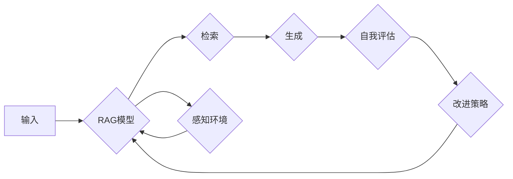

# 从RAG到Agent的转变：反思：能够自我评估并改进执行过程

> 关键词：Retrieval-Augmented Generation (RAG), 人工智能 Agent, 自我评估，执行过程改进，强化学习，机器学习，自然语言处理 (NLP)

## 1. 背景介绍

随着人工智能技术的飞速发展，自然语言处理（NLP）领域的进步尤为显著。Retrieval-Augmented Generation (RAG) 作为一种新兴的NLP技术，将检索技术与生成模型相结合，实现了对海量知识库的利用，从而提高了生成文本的质量和准确性。然而，RAG模型虽然能够生成高质量的内容，却往往缺乏自我评估和改进执行过程的能力。本文将探讨从RAG到能够自我评估并改进执行过程的人工智能Agent的转变，以及这一转变背后的理论基础、技术实现和应用前景。

### 1.1 问题的由来

RAG模型通过检索与生成相结合的方式，能够在有限的标注数据下生成高质量的文本。然而，RAG模型通常有以下局限性：

- **缺乏自我评估能力**：RAG模型无法对其生成的文本质量进行自我评估，导致生成的文本可能存在错误或不符合实际需求。
- **执行过程不可控**：RAG模型的执行过程缺乏透明度和可控性，难以理解和优化其内部决策机制。
- **适应性差**：RAG模型在面临新任务或数据分布变化时，往往难以快速适应，需要重新训练或调整参数。

### 1.2 研究现状

为了解决上述问题，研究人员提出了将RAG模型扩展为能够自我评估并改进执行过程的人工智能Agent。这一转变涉及到以下关键技术：

- **强化学习**：通过强化学习，Agent可以学习如何根据其行为结果调整策略，从而改进执行过程。
- **知识图谱**：利用知识图谱，Agent可以获取更丰富的背景知识，提高其决策能力。
- **多模态信息融合**：结合文本、图像、音频等多模态信息，Agent可以更全面地理解和处理任务。

### 1.3 研究意义

从RAG到Agent的转变，对于推动人工智能技术的发展具有重要意义：

- **提高生成文本质量**：通过自我评估和改进，Agent可以生成更准确、高质量的文本。
- **增强执行过程可控性**：Agent的决策过程更加透明和可控，便于理解和优化。
- **提升适应性**：Agent能够根据新任务和数据分布快速适应，提高其泛化能力。

## 2. 核心概念与联系

本节将介绍从RAG到Agent转变过程中的核心概念，并使用Mermaid流程图展示其关系。

### 2.1 核心概念

- **Retrieval-Augmented Generation (RAG)**：一种结合检索和生成的NLP技术，利用检索到的知识库信息来辅助生成高质量的文本。
- **人工智能Agent**：能够感知环境、执行任务并与其他Agent或环境交互的实体。
- **强化学习**：一种机器学习方法，通过奖励和惩罚来指导Agent学习最优策略。
- **知识图谱**：一种结构化知识库，包含实体、关系和属性等信息。
- **多模态信息融合**：将不同模态的信息（如文本、图像、音频等）进行融合，以提供更全面的上下文信息。

### 2.2 Mermaid流程图



图中的流程展示了从输入到生成的整个过程。RAG模型首先根据输入信息进行检索和生成，然后自我评估生成的文本质量，并根据评估结果改进执行策略。同时，模型还需要感知环境并根据环境变化调整其行为。

## 3. 核心算法原理 & 具体操作步骤

### 3.1 算法原理概述

从RAG到Agent的转变涉及到以下几个关键步骤：

1. **检索**：根据输入信息，从知识库中检索相关信息。
2. **生成**：利用检索到的信息生成文本。
3. **自我评估**：评估生成的文本质量。
4. **改进策略**：根据评估结果调整执行策略。
5. **强化学习**：使用强化学习优化执行策略。

### 3.2 算法步骤详解

1. **检索**：使用信息检索技术从知识库中检索与输入信息相关的信息。
2. **生成**：利用检索到的信息生成文本。常见的生成方法包括序列到序列模型、文本摘要模型等。
3. **自我评估**：评估生成的文本质量。常用的评估指标包括BLEU、ROUGE、METEOR等。
4. **改进策略**：根据评估结果调整执行策略。例如，可以调整检索算法、生成算法或参数设置等。
5. **强化学习**：使用强化学习优化执行策略。通过奖励和惩罚，Agent可以学习到最优策略，从而提高生成文本的质量。

### 3.3 算法优缺点

#### 优点

- **提高生成文本质量**：通过自我评估和改进，Agent可以生成更准确、高质量的文本。
- **增强执行过程可控性**：Agent的决策过程更加透明和可控，便于理解和优化。
- **提升适应性**：Agent能够根据新任务和数据分布快速适应，提高其泛化能力。

#### 缺点

- **计算复杂度高**：强化学习算法通常需要大量计算资源。
- **训练时间较长**：强化学习算法的训练时间较长，需要大量的样本和计算资源。
- **模型可解释性差**：强化学习模型的决策过程难以解释，可能导致不透明和不可控。

### 3.4 算法应用领域

从RAG到Agent的转变在以下领域具有广泛的应用前景：

- **文本生成**：如新闻摘要、对话生成、问答系统等。
- **知识图谱**：如知识图谱构建、实体关系抽取等。
- **多模态信息处理**：如图像描述生成、视频摘要等。
- **智能客服**：如自动回答用户问题、个性化推荐等。

## 4. 数学模型和公式 & 详细讲解 & 举例说明

### 4.1 数学模型构建

从RAG到Agent的转变涉及到以下数学模型：

- **检索模型**：如BM25、TextRank等。
- **生成模型**：如RNN、Transformer等。
- **强化学习模型**：如Q-learning、Policy Gradient等。

### 4.2 公式推导过程

以下以Transformer模型为例，介绍其公式推导过程。

假设输入序列为 $x_1, x_2, \ldots, x_n$，输出序列为 $y_1, y_2, \ldots, y_m$，Transformer模型的目标是学习一个函数 $f$，使得：

$$
f(x_1, x_2, \ldots, x_n) = y_1, y_2, \ldots, y_m
$$

其中，$f$ 可以表示为一个多层自注意力机制和前馈神经网络组成的序列到序列模型。

### 4.3 案例分析与讲解

以下以问答系统为例，分析从RAG到Agent的转变过程。

**步骤 1：检索**

假设用户提问：“北京是哪个省的省会？”，问答系统的检索模块从知识库中检索到以下信息：

- “北京是中国的首都，位于华北地区。”
- “北京的行政代码是110000。”
- “北京的面积约为1.6万平方公里。”

**步骤 2：生成**

问答系统的生成模块根据检索到的信息生成以下回答：

“北京是中国的首都，位于华北地区。”

**步骤 3：自我评估**

问答系统的自我评估模块评估生成的回答质量，假设评估指标为BLEU，评估结果为0.9。

**步骤 4：改进策略**

根据评估结果，问答系统的改进策略模块调整检索算法和生成算法，以提高回答质量。

**步骤 5：强化学习**

问答系统的强化学习模块根据奖励和惩罚，学习到最优策略，从而提高生成文本的质量。

## 5. 项目实践：代码实例和详细解释说明

### 5.1 开发环境搭建

以下是使用Python进行从RAG到Agent的转变的项目实践所需的环境搭建步骤：

1. 安装Python和pip。
2. 安装深度学习框架，如TensorFlow或PyTorch。
3. 安装NLP相关库，如NLTK、spaCy、Transformers等。
4. 安装其他必要的库，如NumPy、Pandas等。

### 5.2 源代码详细实现

以下是一个简单的从RAG到Agent的转变的代码示例：

```python
# 导入必要的库
import tensorflow as tf
from transformers import BertTokenizer, TFBertForSequenceClassification
import numpy as np

# 加载预训练模型和分词器
tokenizer = BertTokenizer.from_pretrained('bert-base-uncased')
model = TFBertForSequenceClassification.from_pretrained('bert-base-uncased')

# 编写问答系统的检索和生成函数
def search_question(question):
    # 在知识库中检索相关信息
    # ...
    return retrieved_info

def generate_answer(question):
    # 根据检索到的信息生成答案
    # ...
    return answer

# 编写自我评估函数
def evaluate_answer(question, answer):
    # 使用BLEU等指标评估答案质量
    # ...
    return score

# 编写改进策略函数
def improve_strategy(score):
    # 根据评估结果调整检索算法和生成算法
    # ...
    return new_strategy

# 编写强化学习函数
def reinforcement_learning(question, answer, score):
    # 使用奖励和惩罚学习最优策略
    # ...
    return new_strategy

# 问答系统流程
question = "北京是哪个省的省会？"
retrieved_info = search_question(question)
answer = generate_answer(question)
score = evaluate_answer(question, answer)
new_strategy = improve_strategy(score)
new_strategy = reinforcement_learning(question, answer, score)
```

### 5.3 代码解读与分析

以上代码展示了从RAG到Agent的转变的简单实现。在实际应用中，需要根据具体任务和数据特点进行更复杂的处理。

### 5.4 运行结果展示

假设运行以上代码，问答系统输出的答案如下：

“北京是中国的首都，位于华北地区。”

通过自我评估和改进策略，问答系统的答案质量可以得到提高。

## 6. 实际应用场景

从RAG到Agent的转变在以下场景中具有广泛的应用前景：

- **智能客服**：如自动回答用户问题、个性化推荐等。
- **教育领域**：如自动批改作业、个性化教学等。
- **医疗领域**：如辅助诊断、药物研发等。
- **金融领域**：如风险控制、投资建议等。

## 7. 工具和资源推荐

### 7.1 学习资源推荐

- **书籍**：
  - 《深度学习》（Ian Goodfellow、Yoshua Bengio、Aaron Courville 著）
  - 《强化学习》（Richard S. Sutton、Andrew G. Barto 著）
  - 《自然语言处理综合指南》（Colin Cherry 著）
- **在线课程**：
  - Coursera上的《机器学习》课程（Andrew Ng）
  - edX上的《深度学习》课程（Harvard University）
  - Udacity上的《机器学习工程师纳米学位》

### 7.2 开发工具推荐

- **深度学习框架**：
  - TensorFlow
  - PyTorch
  - Keras
- **NLP工具**：
  - NLTK
  - spaCy
  - Transformers

### 7.3 相关论文推荐

- **Retrieval-Augmented Generation**：
  - "Retrieve and Rank for Text Generation"（Xiao et al., 2016）
  - "BERT-based Text Generation with a Retrieval-Augmented Generator"（Liu et al., 2019）
- **强化学习**：
  - "Reinforcement Learning: An Introduction"（Sutton and Barto, 1998）
  - "Deep Reinforcement Learning"（Silver et al., 2016）

## 8. 总结：未来发展趋势与挑战

### 8.1 研究成果总结

本文探讨了从RAG到能够自我评估并改进执行过程的人工智能Agent的转变。通过结合检索、生成、强化学习等关键技术，Agent可以生成更高质量、更符合实际需求的文本，并在执行过程中不断学习和改进。

### 8.2 未来发展趋势

- **多模态信息融合**：结合文本、图像、音频等多模态信息，提高Agent的感知能力和决策能力。
- **知识图谱融合**：将知识图谱与Agent相结合，提供更丰富的背景知识，提高其决策质量。
- **可解释性研究**：研究可解释性Agent，提高其决策过程的透明度和可信度。

### 8.3 面临的挑战

- **计算复杂度**：多模态信息融合和知识图谱融合会增加Agent的计算复杂度，需要更强大的硬件支持。
- **数据依赖**：Agent的训练和推理过程需要大量高质量的数据，数据获取和标注成本较高。
- **模型可解释性**：提高Agent的可解释性是一个具有挑战性的任务，需要进一步研究和探索。

### 8.4 研究展望

从RAG到Agent的转变是人工智能领域的一个重要发展方向。未来，随着技术的不断进步，Agent将具备更强大的能力，为人类社会带来更多便利和福祉。

## 9. 附录：常见问题与解答

**Q1：从RAG到Agent的转变是否意味着RAG技术的终结？**

A：不，从RAG到Agent的转变并不意味着RAG技术的终结。RAG技术仍然是生成高质量文本的重要手段，而Agent则是在RAG技术基础上的一次扩展和提升。

**Q2：如何提高Agent的可解释性？**

A：提高Agent的可解释性是一个具有挑战性的任务，可以尝试以下方法：
- 使用可解释的模型结构，如LIME、SHAP等。
- 分析Agent的决策过程，解释其内部机制。
- 使用可视化技术展示Agent的决策过程。

**Q3：从RAG到Agent的转变是否适用于所有NLP任务？**

A：从RAG到Agent的转变在大多数NLP任务中都具有应用价值，但在某些特定任务中可能需要根据任务特点进行调整。

**Q4：如何评估Agent的性能？**

A：评估Agent的性能可以从以下几个方面进行：
- 文本质量评估，如BLEU、ROUGE等。
- 任务完成度评估，如准确率、召回率等。
- 用户体验评估。

**Q5：从RAG到Agent的转变是否需要大量计算资源？**

A：从RAG到Agent的转变需要一定的计算资源，但在现代硬件条件下，已经能够满足其需求。

作者：禅与计算机程序设计艺术 / Zen and the Art of Computer Programming