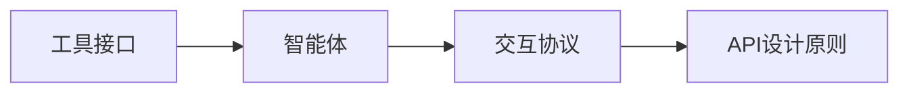
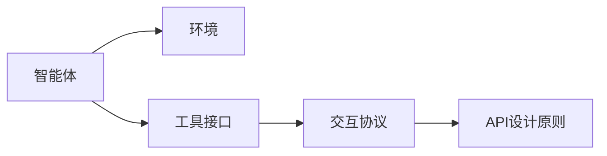
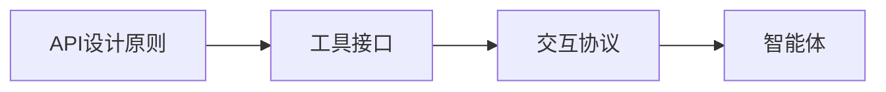
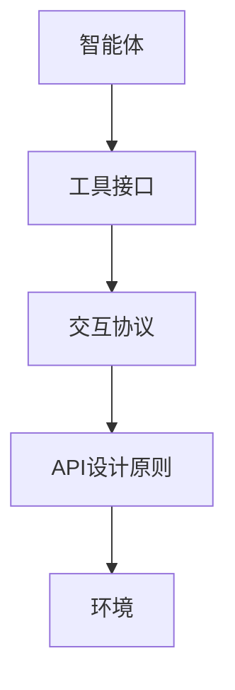

                 

# 从RAG到Agent的转变：工具接口：与外部环境进行交互，使用工具来辅助任务执行

## 1. 背景介绍

### 1.1 问题由来
在人工智能（AI）的发展过程中，从最初的规则型系统（Rule-based Adaptive Agents, RAGs）到现代的智能体（Agents），工具接口（Tool Interface）扮演了至关重要的角色。随着AI技术的应用场景越来越复杂，如何构建高效、灵活、适应性强、能与外部环境交互的工具接口，成为了一个重要课题。

### 1.2 问题核心关键点
1. **工具接口的定义**：工具接口是指用于连接AI系统与外部环境进行交互的接口。它定义了系统的输入输出格式、通信协议、交互方式等，是系统与环境进行有效互动的基础。

2. **RAG与Agent的区别**：RAG是早期基于规则的适应性智能体，依赖于明确的规则和约束，而Agent则是一种更加灵活、具有自适应和自主决策能力的智能体，能够动态调整策略以适应环境变化。

3. **工具接口的设计目标**：设计高效、稳定、可扩展、易于维护的工具接口，使得AI系统能够快速响应环境变化，同时减少人为干预，提升系统的智能化水平。

### 1.3 问题研究意义
构建高质量的工具接口，对于提升AI系统的效率、降低开发成本、增强系统的适应性等方面具有重要意义：

1. **提高系统效率**：工具接口使得系统能够更快速地与环境互动，减少不必要的延迟，提升响应速度。
2. **降低开发成本**：标准化、模块化的工具接口减少了代码的复杂性，降低了系统开发和维护成本。
3. **增强系统适应性**：灵活的工具接口使得系统能够动态调整策略，更好地适应环境变化。
4. **促进技术创新**：高效的接口设计使得新技术能够更灵活地集成到现有系统中，推动技术进步。
5. **增强安全性与可维护性**：标准化的接口设计增强了系统的可维护性，降低了因接口错误导致的安全风险。

## 2. 核心概念与联系

### 2.1 核心概念概述

为更好地理解工具接口的设计与实现，本节将介绍几个关键概念：

- **工具接口（Tool Interface）**：用于连接AI系统与外部环境进行交互的接口。工具接口包括输入输出格式、通信协议、交互方式等。
- **智能体（Agent）**：具有自主决策能力、能与环境动态交互的智能系统。智能体根据环境反馈不断调整策略，以实现特定目标。
- **交互协议（Interaction Protocol）**：定义了智能体与环境之间如何通信和交互的规则，包括消息格式、时序等。
- **API设计原则**：接口设计应遵循简洁、清晰、易于扩展、健壮可靠等原则，以确保系统高效运行。

这些概念之间的逻辑关系可以通过以下Mermaid流程图来展示：



这个流程图展示了工具接口与智能体、交互协议、API设计原则之间的联系。工具接口是智能体与环境互动的桥梁，而API设计原则则指导了工具接口的设计和实现。

### 2.2 概念间的关系

这些核心概念之间存在着紧密的联系，形成了工具接口设计的完整生态系统。下面我们通过几个Mermaid流程图来展示这些概念之间的关系。

#### 2.2.1 智能体与环境交互的流程



这个流程图展示了智能体通过工具接口与环境互动的过程。智能体通过定义好的API与环境通信，执行预定的任务。

#### 2.2.2 API设计原则与工具接口的关联



这个流程图展示了API设计原则指导工具接口设计的全过程。工具接口的设计需要遵循简洁、清晰、易于扩展、健壮可靠等原则，以确保系统高效运行。

### 2.3 核心概念的整体架构

最后，我们用一个综合的流程图来展示这些核心概念在工具接口设计中的整体架构：



这个综合流程图展示了智能体通过工具接口与环境进行互动的全过程，强调了API设计原则在工具接口设计和实现中的核心作用。

## 3. 核心算法原理 & 具体操作步骤
### 3.1 算法原理概述

工具接口的设计与实现，本质上是一个将智能体的决策输出转化为具体行动的过程。智能体通过工具接口与环境互动，执行特定的任务。工具接口的构建需考虑输入输出格式、通信协议、消息格式等关键要素，使得智能体能够高效、可靠地与环境进行交互。

形式化地，假设智能体 $A$ 与环境 $E$ 通过工具接口 $I$ 进行交互，其中 $I$ 包含输入输出格式、通信协议等。智能体的决策输出为 $A_o$，经过工具接口 $I$ 转化为具体行动 $I_o$，然后由环境 $E$ 执行。因此，工具接口 $I$ 的构建过程可以表示为：

$$
I_o = I(A_o)
$$

其中 $A_o$ 为智能体的决策输出，$I_o$ 为具体行动。

### 3.2 算法步骤详解

工具接口的设计和实现，通常遵循以下几个关键步骤：

**Step 1: 定义交互协议**

定义智能体与环境之间的通信协议，包括消息格式、编码方式、传输协议等。例如，可以采用RESTful API、消息队列、发布订阅模式等。

**Step 2: 设计输入输出格式**

设计智能体与环境交互的输入输出格式，包括数据结构、字段定义、字段长度等。例如，可以采用JSON、XML、Protocol Buffers等数据格式。

**Step 3: 实现工具接口**

根据定义好的交互协议和输入输出格式，使用编程语言实现工具接口。例如，使用Python、Java、C++等语言进行API开发。

**Step 4: 测试与优化**

对工具接口进行测试，确保其性能、可靠性和安全性。根据测试结果进行优化，例如增加错误处理、提高并发性能等。

**Step 5: 部署与应用**

将工具接口部署到生产环境，与智能体系统集成，开始正式应用。持续监控接口性能，根据实际运行情况进行调整优化。

### 3.3 算法优缺点

工具接口的设计与实现，具有以下优点：

1. **标准化接口**：统一的标准化接口使得不同系统和环境能够无缝衔接，提升了系统的灵活性和可扩展性。
2. **减少耦合**：工具接口使得智能体与环境解耦，便于独立维护和升级，降低了系统复杂性。
3. **提高效率**：标准化、模块化的接口设计减少了代码复杂性，提升了系统的运行效率。

同时，工具接口也存在一些局限性：

1. **开发成本高**：设计和实现高质量的工具接口需要耗费大量时间和精力，成本较高。
2. **依赖外部环境**：工具接口的设计和优化需要充分考虑外部环境的复杂性和变化，增加了开发难度。
3. **性能瓶颈**：在网络通信、数据处理等方面，工具接口可能成为系统的性能瓶颈，需要优化处理。

### 3.4 算法应用领域

工具接口在AI系统中有着广泛的应用，主要涉及以下几个领域：

1. **智能机器人**：智能机器人通过工具接口与环境互动，执行巡检、清洁、搬运等任务。
2. **智能家居**：智能家居系统通过工具接口与各种传感器和设备互动，实现自动化控制。
3. **智能客服**：智能客服系统通过工具接口与用户互动，提供快速、准确的问答服务。
4. **自动驾驶**：自动驾驶系统通过工具接口与传感器、地图等环境信息互动，实现自主导航和决策。
5. **健康医疗**：健康医疗系统通过工具接口与各种设备和数据源互动，实现病患监测、诊断和治疗等。

以上领域展示了工具接口在AI系统中的重要地位，工具接口的设计和实现直接影响着系统的性能和应用效果。

## 4. 数学模型和公式 & 详细讲解 & 举例说明

### 4.1 数学模型构建

本节将使用数学语言对工具接口的设计与实现进行更加严格的刻画。

假设智能体 $A$ 与环境 $E$ 通过工具接口 $I$ 进行交互，其中 $I$ 包含输入输出格式、通信协议等。智能体的决策输出为 $A_o$，经过工具接口 $I$ 转化为具体行动 $I_o$，然后由环境 $E$ 执行。因此，工具接口 $I$ 的设计可以表示为：

$$
I_o = I(A_o)
$$

其中 $A_o$ 为智能体的决策输出，$I_o$ 为具体行动。

### 4.2 公式推导过程

以下我们以一个简单的智能体与环境交互为例，推导工具接口的设计过程。

假设智能体 $A$ 与环境 $E$ 通过RESTful API进行交互。智能体的决策输出为 $A_o$，即执行某个动作的请求。环境 $E$ 接收到请求后，执行具体行动 $I_o$，即返回执行结果。

智能体的决策输出 $A_o$ 可以表示为一个JSON格式的请求，例如：

```json
{
    "action": "clean",
    "location": "floor1"
}
```

环境接收到请求后，根据请求内容执行具体行动 $I_o$，即返回执行结果。例如，环境执行清洁操作后，返回一个JSON格式的响应：

```json
{
    "status": "success",
    "msg": "Cleaning completed."
}
```

根据上述定义，工具接口 $I$ 可以表示为：

$$
I_o = I(A_o)
$$

其中 $A_o$ 为智能体的决策输出，$I_o$ 为具体行动。具体实现如下：

1. **请求格式**：智能体将决策输出 $A_o$ 转换为请求格式，例如使用Python的requests库进行请求发送。
2. **响应格式**：环境接收到请求后，返回响应格式的数据，例如使用Python的requests库获取响应数据。
3. **消息解析**：将响应数据解析为Python对象，获取执行结果。

### 4.3 案例分析与讲解

以下以一个智能家居系统为例，展示工具接口的实现过程。

智能家居系统由智能体 $A$ 和环境 $E$ 组成。智能体 $A$ 包括传感器、设备控制器等，环境 $E$ 包括各种智能设备和数据源。智能体通过工具接口 $I$ 与环境互动，实现自动化控制。

**Step 1: 定义交互协议**

智能体与环境之间通过RESTful API进行通信，API地址为 `http://home.example.com/api`。

**Step 2: 设计输入输出格式**

智能体与环境之间的交互数据采用JSON格式，具体格式如下：

```json
{
    "action": "open_window",
    "room": "bedroom"
}
```

**Step 3: 实现工具接口**

智能体使用Python requests库进行API请求，例如：

```python
import requests

url = "http://home.example.com/api"
headers = {"Content-Type": "application/json"}
data = {"action": "open_window", "room": "bedroom"}
response = requests.post(url, headers=headers, json=data)

if response.status_code == 200:
    print(response.json())
else:
    print("Error: {}".format(response.status_code))
```

**Step 4: 测试与优化**

对工具接口进行测试，确保其性能、可靠性和安全性。例如，增加错误处理、提高并发性能等。

**Step 5: 部署与应用**

将工具接口部署到生产环境，与智能体系统集成，开始正式应用。持续监控接口性能，根据实际运行情况进行调整优化。

## 5. 项目实践：代码实例和详细解释说明
### 5.1 开发环境搭建

在进行工具接口开发前，我们需要准备好开发环境。以下是使用Python进行Flask开发的环境配置流程：

1. 安装Anaconda：从官网下载并安装Anaconda，用于创建独立的Python环境。

2. 创建并激活虚拟环境：
```bash
conda create -n flask-env python=3.8 
conda activate flask-env
```

3. 安装Flask：
```bash
pip install flask
```

4. 安装Flask RESTful：
```bash
pip install flask-restful
```

5. 安装Flask Swagger：
```bash
pip install flask-swagger
```

6. 安装Flask Swagger UI：
```bash
pip install flask-swagger-ui
```

完成上述步骤后，即可在`flask-env`环境中开始工具接口开发。

### 5.2 源代码详细实现

这里我们以一个简单的智能家居系统为例，展示工具接口的实现过程。

首先，定义API接口：

```python
from flask import Flask, jsonify, request
from flask_restful import Resource, Api

app = Flask(__name__)
api = Api(app)

class OpenWindow(Resource):
    def post(self):
        room = request.json.get('room')
        if room:
            # 执行打开窗户操作
            return jsonify({"msg": "Window opened."}), 200
        else:
            return jsonify({"msg": "Invalid room."}), 400

api.add_resource(OpenWindow, '/api/open_window')

if __name__ == '__main__':
    app.run(debug=True)
```

然后，定义Swagger文档：

```python
import flask_swaqger

@api.route('/')
def index():
    return jsonify(api)

if __name__ == '__main__':
    app.run(debug=True)
```

最后，启动Flask服务，测试API接口：

```python
from flask import Flask, jsonify, request
from flask_restful import Resource, Api
from flask_swagger import Swagger
from flask_swagger_ui import SwaggerUI

app = Flask(__name__)
api = Api(app)

class OpenWindow(Resource):
    def post(self):
        room = request.json.get('room')
        if room:
            # 执行打开窗户操作
            return jsonify({"msg": "Window opened."}), 200
        else:
            return jsonify({"msg": "Invalid room."}), 400

api.add_resource(OpenWindow, '/api/open_window')

@api.route('/')
def index():
    return jsonify(api)

swagger = Swagger(app)
swagger_doc_url = 'http://127.0.0.1:5000/swagger'
swagger.serve(app, api, swagger_doc_url)

if __name__ == '__main__':
    app.run(debug=True)
```

以上代码实现了智能家居系统的API接口，实现了打开窗户操作。开发者可以通过Swagger UI查看API文档，测试API接口。

### 5.3 代码解读与分析

让我们再详细解读一下关键代码的实现细节：

**Flask框架搭建**：
- 使用Flask框架搭建RESTful API，方便处理请求和响应。
- 使用Flask RESTful库简化API开发，提供路由管理功能。
- 使用Flask Swagger库生成API文档，方便测试和调试。

**OpenWindow类实现**：
- 定义OpenWindow类，实现打开窗户操作的API接口。
- 通过`post`方法处理API请求，解析请求数据，并执行相应操作。
- 返回JSON格式的响应数据，状态码表示操作结果。

**Swagger文档生成**：
- 使用Flask Swagger库生成API文档，方便测试和调试。
- 通过`swagger_doc_url`参数指定API文档的URL，使得Swagger UI可以正确显示API文档。

**启动Flask服务**：
- 启动Flask服务，设置`debug=True`参数，方便调试。

可以看到，通过Flask框架搭建RESTful API，开发工具接口变得简单高效。开发者可以利用丰富的第三方库和框架，快速实现API接口，并进行测试和优化。

当然，工业级的系统实现还需考虑更多因素，如安全性、并发处理、数据缓存等。但核心的接口实现基本与此类似。

### 5.4 运行结果展示

假设我们在测试环境中启动Flask服务，并在客户端发送请求：

```python
import requests

url = "http://127.0.0.1:5000/api/open_window"
data = {"room": "bedroom"}
response = requests.post(url, json=data)

if response.status_code == 200:
    print(response.json())
else:
    print("Error: {}".format(response.status_code))
```

如果请求成功，将返回打开窗户操作的响应数据。如果请求失败，则返回错误信息。

## 6. 实际应用场景
### 6.1 智能机器人

智能机器人通过工具接口与外部环境进行互动，执行巡检、清洁、搬运等任务。例如，智能机器人通过API接口与环境互动，获取任务指令和反馈信息。

**应用示例**：
- **巡检任务**：智能机器人通过API获取巡检任务列表，执行巡检操作。例如，通过API获取巡检路线、障碍检测信息等。
- **清洁任务**：智能机器人通过API获取清洁任务列表，执行清洁操作。例如，通过API获取清洁任务位置、清理进度等。
- **搬运任务**：智能机器人通过API获取搬运任务列表，执行搬运操作。例如，通过API获取搬运对象、搬运路径等。

**技术要点**：
- 定义API协议和数据格式，确保智能体与环境的高效互动。
- 实现智能体的决策输出到具体行动的转换，提升系统的智能化水平。
- 确保API接口的健壮性和安全性，防止恶意攻击和数据泄露。

### 6.2 智能家居

智能家居系统通过工具接口与各种智能设备和数据源进行互动，实现自动化控制。例如，智能家居系统通过API获取环境数据，执行控制操作。

**应用示例**：
- **温度控制**：智能家居系统通过API获取环境温度信息，执行温度调节操作。例如，通过API获取室温、湿度等数据，自动调节空调、加湿器等设备。
- **照明控制**：智能家居系统通过API获取环境光线信息，执行照明调节操作。例如，通过API获取光线强度、时间等数据，自动调节窗帘、灯光等设备。
- **安防控制**：智能家居系统通过API获取环境安全信息，执行安防操作。例如，通过API获取门窗状态、入侵检测信息，自动调节报警系统。

**技术要点**：
- 定义API协议和数据格式，确保智能体与环境的高效互动。
- 实现智能体的决策输出到具体行动的转换，提升系统的智能化水平。
- 确保API接口的健壮性和安全性，防止恶意攻击和数据泄露。

### 6.3 智能客服

智能客服系统通过工具接口与用户进行互动，提供快速、准确的问答服务。例如，智能客服系统通过API获取用户问题，执行回答操作。

**应用示例**：
- **问题回答**：智能客服系统通过API获取用户问题，自动回答。例如，通过API获取用户输入的问题，调用NLP模型进行语义分析，生成回答结果。
- **情感分析**：智能客服系统通过API获取用户情绪信息，执行情感分析操作。例如，通过API获取用户情感数据，调用情感分析模型进行情感分类。
- **客户反馈**：智能客服系统通过API获取客户反馈信息，执行改进操作。例如，通过API获取客户满意度数据，调用分析模型进行改进建议。

**技术要点**：
- 定义API协议和数据格式，确保智能体与用户的高效互动。
- 实现智能体的决策输出到具体行动的转换，提升系统的智能化水平。
- 确保API接口的健壮性和安全性，防止恶意攻击和数据泄露。

### 6.4 未来应用展望

随着AI技术的发展，工具接口在各个领域的应用将越来越广泛。未来的工具接口设计将更加灵活、高效、安全，实现人与机器的深度融合。

**智能城市**：智能城市系统通过工具接口与各种传感器和设备互动，实现自动化控制。例如，智能城市系统通过API获取环境数据，执行控制操作。

**智慧医疗**：智慧医疗系统通过工具接口与各种设备和数据源互动，实现病患监测、诊断和治疗等。例如，智慧医疗系统通过API获取病患数据，执行监测和分析操作。

**智能制造**：智能制造系统通过工具接口与各种设备和数据源互动，实现生产自动化和智能化。例如，智能制造系统通过API获取生产数据，执行监控和优化操作。

总之，随着AI技术的不断成熟和普及，工具接口将扮演更加重要的角色，推动智能技术的广泛应用。未来，工具接口的设计和实现将更加注重安全性、可扩展性和可维护性，确保系统的稳定运行和高效互动。

## 7. 工具和资源推荐
### 7.1 学习资源推荐

为了帮助开发者系统掌握工具接口的设计和实现，这里推荐一些优质的学习资源：

1. **《Python网络编程》**：深入浅出地介绍了网络编程的基本原理和实现方法，适合初学者入门。

2. **《RESTful API设计规范》**：详细介绍了RESTful API的设计原则和最佳实践，帮助开发者设计高质量的API接口。

3. **《Flask官方文档》**：Flask框架的官方文档，提供了详细的API开发教程和示例，适合深入学习和实践。

4. **《Swagger UI官方文档》**：Swagger UI的官方文档，详细介绍了Swagger UI的安装和使用，适合调试和测试API接口。

5. **《RESTful API开发实战》**：介绍了RESTful API开发的实际案例和最佳实践，适合实战演练。

通过这些资源的学习实践，相信你一定能够快速掌握工具接口的设计和实现，并用于解决实际的AI应用问题。

### 7.2 开发工具推荐

高效的开发离不开优秀的工具支持。以下是几款用于工具接口开发常用的工具：

1. **Flask**：基于Python的Web框架，简单易用，适合快速开发API接口。

2. **Django**：基于Python的全栈Web框架，功能丰富，适合大型应用开发。

3. **Spring Boot**：基于Java的微服务框架，适合构建高效、可扩展的API接口。

4. **Koa**：基于Node.js的Web框架，性能优异，适合处理高并发请求。

5. **Fabric**：基于Python的微服务框架，支持容器化部署，适合云环境下的API接口开发。

6. **Swagger UI**：生成API文档和测试接口的工具，帮助开发者进行API设计和调试。

合理利用这些工具，可以显著提升工具接口的开发效率，加快创新迭代的步伐。

### 7.3 相关论文推荐

工具接口的设计和实现涉及诸多前沿技术，以下是几篇相关的经典论文，推荐阅读：

1. **《RESTful Web Services》**：介绍了RESTful架构的基本原理和设计规范，是RESTful API设计的经典之作。

2. **《Web Service Security》**：详细介绍了Web服务的安全机制和最佳实践，帮助开发者设计安全的API接口。

3. **《API Design Patterns》**：介绍了API设计模式和最佳实践，帮助开发者设计可扩展、可维护的API接口。

4. **《RESTful API Design》**：详细介绍了RESTful API设计的最佳实践，帮助开发者设计高效的API接口。

5. **《API Design for the Web》**：介绍了Web API设计的基本原理和实现方法，适合实战演练。

这些论文代表了大语言模型微调技术的发展脉络。通过学习这些前沿成果，可以帮助研究者把握学科前进方向，激发更多的创新灵感。

除上述资源外，还有一些值得关注的前沿资源，帮助开发者紧跟工具接口设计的最新进展，例如：

1. **arXiv论文预印本**：人工智能领域最新研究成果的发布平台，包括大量尚未发表的前沿工作，学习前沿技术的必读资源。

2. **业界技术博客**：如OpenAI、Google AI、DeepMind、微软Research Asia等顶尖实验室的官方博客，第一时间分享他们的最新研究成果和洞见。

3. **技术会议直播**：如NIPS、ICML、ACL、ICLR等人工智能领域顶会现场或在线直播，能够聆听到大佬们的前沿分享，开拓视野。

4. **GitHub热门项目**：在GitHub上Star、Fork数最多的API开发相关项目，往往代表了该技术领域的发展趋势和最佳实践，值得去学习和贡献。

5. **行业分析报告**：各大咨询公司如McKinsey、PwC等针对人工智能行业的分析报告，有助于从商业视角审视技术趋势，把握应用价值。

总之，对于工具接口的设计和实现，需要开发者保持开放的心态和持续学习的意愿。多关注前沿资讯，多动手实践，多思考总结，必将收获满满的成长收益。

## 8. 总结：未来发展趋势与挑战
### 8.1 研究成果总结

本文对工具接口的设计与实现进行了全面系统的介绍。首先阐述了工具接口的定义和作用，明确了其在智能体与环境互动中的核心地位。其次，从原理到实践，详细讲解了工具接口的设计和实现方法，给出了具体的代码实例和解释说明。同时，本文还探讨了工具接口在智能机器人、智能家居、智能客服等多个领域的应用场景，展示了工具接口的广泛应用前景。此外，本文精选了工具接口设计的各类学习资源，力求为读者提供全方位的技术指引。

通过本文的系统梳理，可以看到，工具接口的设计和实现是大语言模型微调技术的重要基础，使得智能体能够高效、可靠地与环境互动，实现任务执行。未来，随着AI技术的不断发展，工具接口将扮演更加重要的角色，推动智能技术的广泛应用。

### 8.2 未来发展趋势

展望未来，工具

