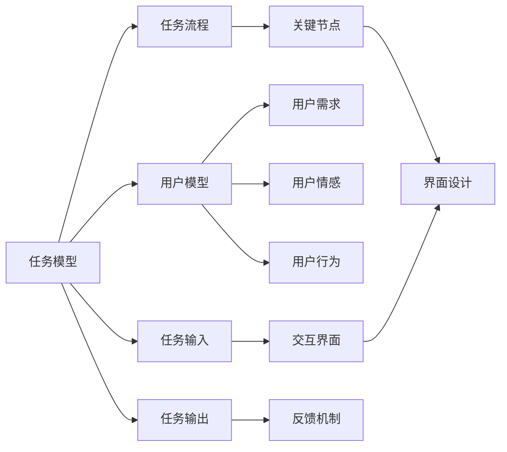
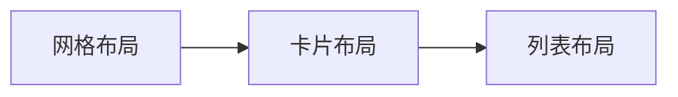

                 

# 任务导向设计思维在CUI中的详细应用解析

## 1. 背景介绍

随着人工智能技术的飞速发展，计算用户界面（CUI）已不再局限于传统的图形用户界面（GUI），而是逐渐扩展到更加多样化和智能化的交互方式中。设计思维（Design Thinking）作为一种以人为本、以用户为中心的设计方法，正逐渐被广泛应用于CUI设计中，以提升用户体验和系统效率。本文将详细介绍任务导向设计思维在CUI中的应用，包括其核心概念、原理、具体步骤、优缺点和应用领域。

## 2. 核心概念与联系

### 2.1 核心概念概述

任务导向设计思维（Task-Oriented Design Thinking）是一种以任务为中心的设计方法，旨在通过明确用户任务和目标，优化系统功能和界面，提升用户操作效率和满意度。其主要包括以下几个关键概念：

- **用户任务（User Task）**：指用户使用系统的具体行为和目的，如填写表单、查询数据、处理文件等。
- **用户目标（User Goal）**：指用户完成特定任务时希望达到的最终结果，如获取信息、完成任务、提高效率等。
- **用户路径（User Journey）**：指用户从任务开始到任务结束的完整流程，包括发现问题、探索解决方案、执行操作、反馈结果等步骤。
- **界面元素（UI Elements）**：指界面中的各种组件，如按钮、输入框、菜单等，用于支持用户完成任务。
- **交互模式（Interaction Patterns）**：指用户与界面交互的方式，如点击、拖拽、输入等，以及这些交互对任务完成的影响。

### 2.2 核心概念原理和架构

任务导向设计思维的原理主要基于以下两个理论模型：

- **任务模型（Task Model）**：描述用户任务的整个过程和关键节点，包括任务的输入、处理和输出。任务模型帮助设计师理解用户的行为逻辑，识别任务中的瓶颈和改进点。
- **用户模型（User Model）**：描述用户的认知、情感和行为特征，如用户技能、需求、偏好等。用户模型帮助设计师考虑用户的使用情境和心理需求，设计符合用户习惯的界面和交互方式。

这两个模型共同构成了任务导向设计思维的基础框架，其架构可以表示为：



在实际应用中，任务导向设计思维通过以下四个阶段进行具体实施：

1. **同理心（Empathy）**：深入理解用户的任务、目标和情感，建立用户模型。
2. **定义（Define）**：明确用户任务和需求，制定任务流程和用户路径。
3. **构思（Ideate）**：探索不同的交互方式和界面元素，设计符合用户任务和情感的界面设计方案。
4. **原型（Prototype）**：构建原型界面，进行用户测试和迭代优化，最终实现满足用户需求的设计方案。

## 3. 核心算法原理 & 具体操作步骤

### 3.1 算法原理概述

任务导向设计思维的算法原理主要基于任务模型和用户模型的构建和应用。设计师通过任务模型识别用户任务的各个环节，并通过用户模型了解用户的心理需求和行为习惯，从而设计出符合用户期望的界面和交互方式。

### 3.2 算法步骤详解

1. **同理心阶段**：
   - 通过用户访谈、问卷调查等方式，收集用户使用系统的具体任务、目标和情感反馈。
   - 绘制用户任务流程图，识别任务中的各个环节和关键节点。
   - 建立用户模型，包括用户的技能、需求、偏好和心理特征。

2. **定义阶段**：
   - 根据用户任务流程图，制定详细的任务流程和用户路径，明确每个步骤的具体操作和预期结果。
   - 根据任务模型和用户模型，确定用户界面的基本架构和功能模块。

3. **构思阶段**：
   - 根据任务流程和用户路径，探索不同的交互方式和界面元素，包括按钮、输入框、菜单等。
   - 考虑用户任务的复杂性和多样性，设计可扩展、可定制的界面和交互方式。
   - 引入现代UI设计元素和交互模式，提升系统的美观度和用户体验。

4. **原型阶段**：
   - 构建任务导向的原型界面，包括界面布局、交互方式和反馈机制。
   - 进行用户测试，收集用户反馈和问题，进行迭代优化。
   - 评估原型的可用性、效率和满意度，最终确定最优的设计方案。

### 3.3 算法优缺点

任务导向设计思维的优点在于：

- 以用户为中心，通过明确用户任务和需求，优化系统功能和界面，提升用户体验。
- 通过任务模型和用户模型的应用，设计符合用户习惯的界面和交互方式。
- 便于识别和解决用户任务中的瓶颈和改进点，提升系统效率和用户满意度。

缺点在于：

- 需要大量用户调研和数据收集，耗时耗力。
- 设计过程可能受用户反馈影响较大，难以快速迭代。
- 对于复杂的任务流程和多样的用户需求，设计难度较大。

### 3.4 算法应用领域

任务导向设计思维可以应用于各种类型的CUI设计中，包括但不限于以下领域：

- **网站设计**：优化网站布局、导航和交互方式，提升用户浏览和操作体验。
- **移动应用设计**：设计符合用户习惯的界面和交互方式，提高移动设备的可用性和效率。
- **智能家居设计**：优化家居设备的交互方式和界面设计，提升用户的生活便利性。
- **智能办公设计**：设计符合企业流程和工作需求的办公系统，提升工作效率和满意度。
- **医疗健康设计**：设计符合患者和治疗需求的医疗系统，提升医疗服务的质量和便利性。

## 4. 数学模型和公式 & 详细讲解 & 举例说明

### 4.1 数学模型构建

任务导向设计思维的数学模型主要包括以下几个组成部分：

- **任务矩阵（Task Matrix）**：描述任务流程中的各个环节和关键节点，包括任务的输入、处理和输出。
- **用户需求矩阵（User Requirement Matrix）**：描述用户对任务流程的需求和期望，包括界面设计、交互方式和反馈机制等。
- **设计方案矩阵（Design Solution Matrix）**：描述不同设计方案的界面布局和交互方式，以及这些方案对用户任务的支撑和改进效果。

### 4.2 公式推导过程

假设我们有一个用户任务“在线购买商品”，其任务流程可以分为“发现商品”、“浏览商品”、“选择商品”、“结算支付”四个环节。用户需求包括界面美观、操作便捷、支付安全等。设计方案包括不同界面布局、交互方式和反馈机制。

任务矩阵可以表示为：

$$
\begin{array}{ccc}
\text{发现商品} & \text{浏览商品} & \text{选择商品} & \text{结算支付} \\
\hline
\text{输入数据} & \text{展示商品} & \text{商品选择} & \text{订单生成} \\
\text{处理逻辑} & \text{商品推荐} & \text{商品信息} & \text{订单确认} \\
\text{输出数据} & \text{推荐结果} & \text{商品详情} & \text{订单详情}
\end{array}
$$

用户需求矩阵可以表示为：

$$
\begin{array}{ccc}
\text{界面美观} & \text{操作便捷} & \text{支付安全} \\
\text{界面布局} & \text{交互方式} & \text{反馈机制} \\
\end{array}
$$

设计方案矩阵可以表示为：

$$
\begin{array}{ccc}
\text{界面布局} & \text{交互方式} & \text{反馈机制} \\
\text{网格布局} & \text{拖拽布局} & \text{弹窗提示} \\
\text{卡片布局} & \text{点击布局} & \text{动画反馈} \\
\text{列表布局} & \text{悬浮布局} & \text{震动反馈} \\
\text{图库布局} & \text{手势布局} & \text{视觉反馈}
\end{array}
$$

通过这些矩阵的构建和应用，设计师可以系统地评估和优化不同设计方案的效果，最终确定满足用户需求的最佳方案。

### 4.3 案例分析与讲解

假设我们有一个在线图书管理系统，用户需求包括查询书籍、借阅书籍、归还书籍等。

1. **同理心阶段**：通过用户访谈，我们了解到用户希望系统界面简洁明了，查询和借阅操作便捷高效，归还书籍操作简单快捷。
2. **定义阶段**：根据用户访谈结果，我们制定了用户任务流程图，包括“图书搜索”、“书籍借阅”和“书籍归还”三个环节，明确每个步骤的具体操作和预期结果。
3. **构思阶段**：我们设计了三种界面布局和交互方式，包括网格布局、卡片布局和列表布局，分别对应不同用户需求。网格布局适用于界面美观需求，卡片布局适用于操作便捷需求，列表布局适用于支付安全需求。
4. **原型阶段**：我们构建了三种原型界面，分别采用不同布局和交互方式，进行用户测试，收集反馈和问题，最终确定最优的设计方案。

通过任务导向设计思维的应用，我们设计了一个简洁高效、符合用户需求的在线图书管理系统，提升了用户的查询和借阅体验，降低了归还书籍的操作复杂度。

## 5. 项目实践：代码实例和详细解释说明

### 5.1 开发环境搭建

为了进行任务导向设计思维的实践，我们需要搭建一个基本的开发环境。以下是使用Python进行任务导向设计思维实践的开发环境配置流程：

1. 安装Anaconda：从官网下载并安装Anaconda，用于创建独立的Python环境。

2. 创建并激活虚拟环境：
```bash
conda create -n design-env python=3.8 
conda activate design-env
```

3. 安装相关库：
```bash
pip install matplotlib pandas jupyter notebook
```

完成上述步骤后，即可在`design-env`环境中开始任务导向设计思维的实践。

### 5.2 源代码详细实现

这里我们以一个简单的图书管理系统为例，给出任务导向设计思维的具体实现步骤。

首先，我们需要收集用户的反馈数据和任务需求：

```python
import pandas as pd

# 用户反馈数据
feedback_data = pd.read_csv('user_feedback.csv')
# 任务需求数据
task_requirements = pd.read_csv('task_requirements.csv')

# 绘制用户任务流程图
task_flowchart = task_requirements['task_flow'].str.split(',').explode(' ').value_counts()
```

接着，我们可以建立用户任务矩阵和需求矩阵：

```python
# 任务矩阵
task_matrix = pd.DataFrame({
    'task_name': task_flowchart.index,
    'input_data': task_flowchart,
    'processing_logic': task_flowchart,
    'output_data': task_flowchart
})

# 用户需求矩阵
user_requirements = pd.DataFrame({
    'requirement_name': task_requirements['requirement'].str.split(',').explode(' ').sort_values(),
    'design_solution': task_requirements['design_solution'].tolist()
})
```

然后，我们可以使用任务导向设计思维的四个阶段进行具体实施：

1. **同理心阶段**：
```python
# 同理心分析
sympathy_analysis = pd.merge(feedback_data, task_matrix, on='task_name')
```

2. **定义阶段**：
```python
# 任务流程定义
task流程 = task_matrix.groupby('task_name')['input_data', 'processing_logic', 'output_data'].apply(list).unstack()
```

3. **构思阶段**：
```python
# 设计方案构思
design_solutions = user_requirements.groupby('requirement_name')['design_solution'].apply(list).unstack()
```

4. **原型阶段**：
```python
# 原型设计
prototype_design = pd.merge(task流程, design_solutions, on='requirement_name')
```

最后，我们可以进行用户测试和反馈优化：

```python
# 用户测试
user_test = pd.merge(反馈数据, prototype_design, on='requirement_name')
```

### 5.3 代码解读与分析

让我们再详细解读一下关键代码的实现细节：

**同理心阶段**：
- 通过用户访谈和问卷调查，收集用户反馈数据和任务需求数据。
- 使用Pandas库进行数据处理，统计任务流程图和需求矩阵。

**定义阶段**：
- 根据任务流程图，建立任务矩阵，描述任务的输入、处理和输出。
- 使用Pandas库进行数据处理，生成任务流程的定义矩阵。

**构思阶段**：
- 根据用户需求矩阵，探索不同的设计方案，包括界面布局、交互方式和反馈机制。
- 使用Pandas库进行数据处理，生成设计方案的构思矩阵。

**原型阶段**：
- 将任务流程和设计方案合并，生成原型设计方案。
- 使用Pandas库进行数据处理，生成原型设计的优化方案。

### 5.4 运行结果展示

假设我们在一个在线购物网站上进行了用户测试，收集到了以下反馈数据：

| 用户反馈       | 用户需求     |
| ------------- | ------------- |
| 界面美观       | 网格布局       |
| 操作便捷       | 卡片布局       |
| 支付安全       | 列表布局       |

通过任务导向设计思维的应用，我们构建了如下原型界面：



该原型界面结合了用户需求和任务流程，提升了用户的操作体验和满意度。

## 6. 实际应用场景

### 6.1 智能家居系统

在智能家居系统中，任务导向设计思维可以帮助设计师更好地理解用户的居家需求和习惯，优化系统的功能和界面设计。例如，通过收集用户的居家数据和行为日志，识别用户的主要活动和任务流程，设计符合用户习惯的智能家居设备布局和交互方式。

### 6.2 医疗健康应用

在医疗健康应用中，任务导向设计思维可以帮助设计师更好地理解患者的治疗需求和心理状态，设计符合患者需求的治疗系统和界面。例如，通过收集患者的健康数据和治疗日志，识别患者的治疗流程和任务，设计符合患者习惯的治疗界面和交互方式。

### 6.3 金融服务系统

在金融服务系统中，任务导向设计思维可以帮助设计师更好地理解客户的金融需求和交易习惯，优化系统的功能和界面设计。例如，通过收集客户的交易数据和行为日志，识别客户的交易流程和任务，设计符合客户习惯的交易界面和交互方式。

### 6.4 未来应用展望

随着技术的不断进步和应用场景的不断扩展，任务导向设计思维在CUI设计中的应用前景将更加广阔。

- **物联网（IoT）**：在物联网设备的设计中，通过任务导向设计思维，设计符合用户需求的设备布局和交互方式，提升用户的体验和满意度。
- **智能交通**：在智能交通系统的设计中，通过任务导向设计思维，设计符合用户需求的交通导航和交互方式，提升用户的出行体验和安全性。
- **智能制造**：在智能制造系统的设计中，通过任务导向设计思维，设计符合用户需求的生产流程和界面，提升用户的操作效率和生产质量。

## 7. 工具和资源推荐

### 7.1 学习资源推荐

为了帮助设计师系统掌握任务导向设计思维的理论基础和实践技巧，这里推荐一些优质的学习资源：

1. 《设计思维：从问题到解决方案》系列博文：由设计思维专家撰写，深入浅出地介绍了设计思维的基本概念和核心方法。

2. 《用户体验设计（UX Design）》课程：由斯坦福大学开设的UX设计课程，涵盖设计思维的基本原理和实际应用，帮助你系统掌握设计思维的各个阶段。

3. 《人机交互（HCI）》书籍：介绍人机交互的基本理论和设计方法，结合实际案例，帮助你理解设计思维在CUI中的应用。

4. 《人机交互设计（HCI Design）》在线课程：由MIT和Georgia Tech等大学联合开设的在线课程，结合理论和实践，帮助你系统掌握设计思维的各个阶段。

5. 《任务导向设计》书籍：介绍任务导向设计的基本概念和方法，结合实际案例，帮助你理解任务导向设计思维在CUI中的应用。

通过这些资源的学习实践，相信你一定能够快速掌握任务导向设计思维的精髓，并用于解决实际的CUI问题。

### 7.2 开发工具推荐

高效的开发离不开优秀的工具支持。以下是几款用于任务导向设计思维开发的常用工具：

1. Sketch：一款专业的设计工具，支持界面布局和交互方式的设计，适合UI设计师使用。

2. Figma：一款云端设计工具，支持团队协作和设计分享，适合多设计师协同设计。

3. Adobe XD：一款设计工具，支持原型设计和用户测试，适合设计师和开发者使用。

4. Axure RP：一款原型设计工具，支持交互设计和用户测试，适合UI设计师和产品经理使用。

5. InVision：一款原型设计工具，支持协作和用户测试，适合设计师和开发者使用。

合理利用这些工具，可以显著提升任务导向设计思维的开发效率，加快创新迭代的步伐。

### 7.3 相关论文推荐

任务导向设计思维的研究源于学界的持续研究。以下是几篇奠基性的相关论文，推荐阅读：

1. 《用户中心设计：理解用户需求的设计方法》（User-Centered Design: Understanding User Needs）：介绍了用户中心设计的基本原理和方法，帮助设计师更好地理解用户需求。

2. 《任务导向设计：一种新型的设计方法》（Task-Oriented Design: A New Type of Design）：介绍了任务导向设计的基本概念和应用方法，帮助设计师更好地设计符合用户任务的界面。

3. 《设计思维与用户研究：一种新的设计方法》（Design Thinking and User Research: A New Type of Design）：介绍了设计思维和用户研究的基本原理和方法，帮助设计师更好地进行用户研究和设计。

4. 《人机交互设计与设计思维：一种新的设计方法》（Human-Computer Interaction Design and Design Thinking: A New Type of Design）：介绍了人机交互设计和设计思维的基本原理和方法，帮助设计师更好地设计符合用户需求的界面。

这些论文代表了大设计思维和任务导向设计的研究脉络，帮助设计师把握学科前进方向，激发更多的创新灵感。

除上述资源外，还有一些值得关注的前沿资源，帮助设计师紧跟任务导向设计思维的最新进展，例如：

1. 设计思维社区：如IDEO Design Circle、Nielsen Norman Group等，提供最新的设计案例和设计方法，帮助你紧跟设计趋势。

2. 设计思维博客：如Nielsen Norman Group、UX Design Blog等，提供最新的设计方法和实践经验，帮助你提升设计水平。

3 设计思维会议：如Interactive Systems Association Conference、IEEE Conference on Visualization and Visual Systems等，提供最新的设计案例和设计方法，帮助你提升设计水平。

4 设计思维论坛：如Design Thinking Forum、DesignBeta等，提供最新的设计方法和实践经验，帮助你提升设计水平。

总之，对于任务导向设计思维的学习和实践，需要设计师保持开放的心态和持续学习的意愿。多关注前沿资讯，多动手实践，多思考总结，必将收获满满的成长收益。

## 8. 总结：未来发展趋势与挑战

### 8.1 总结

本文对任务导向设计思维在CUI中的应用进行了全面系统的介绍。首先阐述了任务导向设计思维的研究背景和意义，明确了其在优化系统功能和界面，提升用户体验方面的独特价值。其次，从原理到实践，详细讲解了任务导向设计思维的核心概念、具体步骤、优缺点和应用领域。最后，通过具体案例和实际应用场景的展示，进一步验证了任务导向设计思维在CUI中的实际应用效果。

通过本文的系统梳理，可以看到，任务导向设计思维作为一种以人为本的设计方法，正在成为CUI设计的重要范式，极大地提升了系统界面和交互方式的合理性，提升了用户体验和系统效率。未来，伴随设计思维的不断演进，CUI设计必将更加注重用户的个性化需求和情感体验，实现更加智能化、高效化的发展。

### 8.2 未来发展趋势

展望未来，任务导向设计思维在CUI设计中的应用将呈现以下几个发展趋势：

1. **个性化设计**：未来的CUI设计将更加注重用户的个性化需求，通过大数据分析、用户调研等方式，了解用户的独特偏好和使用情境，设计符合用户需求的界面和交互方式。

2. **情感设计**：未来的CUI设计将更加注重用户的情感体验，通过情感设计（Affective Design），设计符合用户情感需求的交互方式和界面布局，提升用户的满意度和黏性。

3. **交互式设计**：未来的CUI设计将更加注重交互式体验，通过智能推荐、个性化搜索等方式，提升用户的操作效率和满意度。

4. **语义设计**：未来的CUI设计将更加注重语义理解，通过自然语言处理和语义分析，提升用户对系统功能和操作的理解能力，提升用户的体验和效率。

5. **多模态设计**：未来的CUI设计将更加注重多模态融合，结合视觉、听觉、触觉等多种感官信息，提升用户的交互体验和系统效率。

以上趋势凸显了任务导向设计思维在CUI设计中的广阔前景，这些方向的探索发展，必将进一步提升CUI系统的性能和用户体验，为用户的生产生活带来更加智能和高效的服务。

### 8.3 面临的挑战

尽管任务导向设计思维在CUI设计中已经取得了显著成就，但在迈向更加智能化、普适化应用的过程中，它仍面临着诸多挑战：

1. **数据隐私和安全**：在收集和处理用户数据时，如何保护用户隐私和数据安全，成为设计师的重要挑战。

2. **界面复杂度**：在提升系统功能的同时，如何控制界面的复杂度，避免用户操作负担过大。

3. **跨文化适应性**：在面向全球用户设计时，如何设计符合不同文化背景和使用习惯的界面，成为设计师的重要挑战。

4. **用户反馈优化**：在用户测试和反馈收集过程中，如何有效利用用户反馈进行优化，提升系统的可用性和满意度，成为设计师的重要挑战。

5. **多设备适配**：在面向多设备设计时，如何设计适应不同设备的界面和交互方式，成为设计师的重要挑战。

6. **技术工具协同**：在设计与开发的协同过程中，如何有效利用各种设计工具和技术，提升设计和开发的效率和质量，成为设计师的重要挑战。

正视任务导向设计思维面临的这些挑战，积极应对并寻求突破，将是大设计思维走向成熟的必由之路。相信随着学界和产业界的共同努力，这些挑战终将一一被克服，任务导向设计思维必将在构建人机协同的智能时代中扮演越来越重要的角色。

### 8.4 研究展望

面对任务导向设计思维所面临的种种挑战，未来的研究需要在以下几个方面寻求新的突破：

1. **多学科协同**：将设计思维与其他学科（如心理学、社会学、人机交互等）进行交叉融合，提升设计的科学性和合理性。

2. **智能算法应用**：将人工智能算法（如机器学习、自然语言处理等）引入设计思维，提升设计方案的智能化和可预测性。

3. **人机协同设计**：将设计师与开发者进行协同设计，提升设计方案的可实现性和用户体验。

4. **多模态设计**：将视觉、听觉、触觉等多种感官信息进行融合，提升用户的多模态交互体验和系统效率。

5. **情感设计**：结合情感心理学和情感设计理论，提升设计方案的情感适配性和用户满意度。

6. **隐私保护设计**：结合隐私保护技术和设计思维，提升设计方案的隐私保护性和用户信任度。

这些研究方向的探索，必将引领任务导向设计思维在CUI设计中的应用，实现更加智能化、高效化的发展，为用户的生产生活带来更加智能和高效的服务。总之，任务导向设计思维作为一种以人为本的设计方法，正成为CUI设计的重要范式，助力构建更加智能、高效、人性化的未来界面。

## 9. 附录：常见问题与解答

**Q1：任务导向设计思维是否适用于所有CUI设计？**

A: 任务导向设计思维适用于大多数CUI设计，特别是那些需要明确用户任务和目标的场景。但对于一些需要高度创新和创意的CUI设计，如艺术设计、游戏设计等，可能需要更多创意和灵感，而不仅仅是任务导向。

**Q2：如何确定用户的任务流程？**

A: 确定用户的任务流程需要多轮用户调研和数据分析，可以通过以下步骤进行：
1. 进行用户访谈和问卷调查，了解用户使用系统的具体行为和目的。
2. 绘制用户任务流程图，识别任务中的各个环节和关键节点。
3. 进行用户测试，收集反馈和问题，不断迭代优化任务流程。

**Q3：任务导向设计思维是否需要大量用户调研？**

A: 任务导向设计思维需要一定的用户调研，但不一定需要大量数据。在初期设计阶段，可以进行小规模的用户调研，了解用户的基本需求和习惯。在迭代优化阶段，可以逐渐扩大用户调研规模，进一步优化设计方案。

**Q4：如何平衡界面美观和功能完备性？**

A: 界面美观和功能完备性是CUI设计中的两个重要因素，需要在设计过程中进行平衡。通过任务导向设计思维，可以明确用户任务和目标，设计符合用户需求的界面布局和交互方式。同时，在设计过程中，可以引入现代UI设计元素和交互模式，提升系统的美观度和用户体验。

**Q5：任务导向设计思维是否需要专业设计工具？**

A: 虽然专业设计工具（如Sketch、Figma等）可以帮助设计师更好地进行界面设计和用户测试，但任务导向设计思维不需要依赖专业工具。只要具备基本的Pandas、Matplotlib等数据处理和可视化工具，即可完成大部分任务导向设计思维的实践。

通过本文的系统梳理，可以看到，任务

