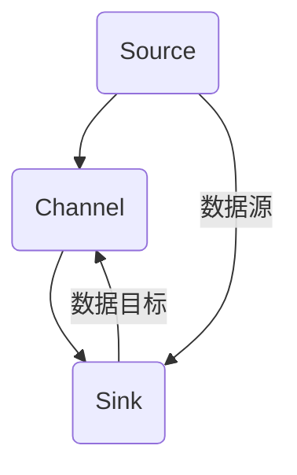
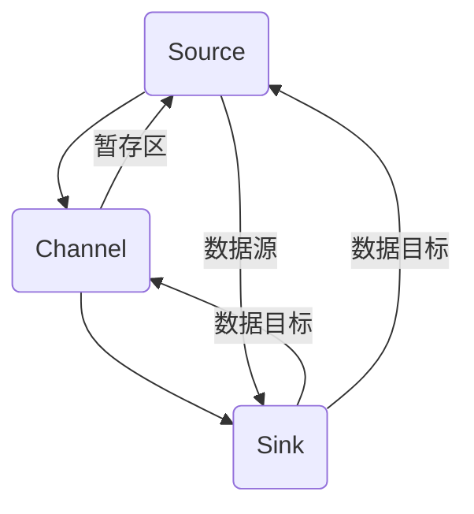

                 

## 1. 背景介绍

Flume是Apache软件基金会（Apache Software Foundation）开发的一款大数据处理工具，旨在提高大数据的收集和传输效率。它支持多种数据源和数据目标，能够处理海量数据，且具有高可用性、高性能和可扩展性等特点。Flume在数据收集方面有着广泛的应用，例如日志收集、事件收集、网络数据捕获等。本文将深入探讨Flume的基本原理，并通过代码实例讲解Flume在实际项目中的应用。

## 2. 核心概念与联系

### 2.1 核心概念概述

Flume主要由以下几大核心概念构成：

- **Source**：负责从各种数据源收集数据，如日志文件、网络数据包、数据库等。
- **Channel**：负责暂存Source收集到的数据，并提供给Sink。
- **Sink**：负责将Channel中的数据发送到目标存储系统，如Hadoop HDFS、ElasticSearch、Kafka等。

Flume的整个数据流向可以简单描述为：数据源（Source） -> 暂存区（Channel） -> 数据汇（Sink）。下面将详细介绍每个组件的功能和特点。

### 2.2 核心概念间的关系

以下是一个Mermaid流程图，展示了Flume的核心组件和数据流向：



### 2.3 核心概念的整体架构

Flume的整体架构如下图所示：



从这个架构图中，我们可以清晰地看到，Source和Sink是Flume的核心组件，Channel则充当了数据暂存区，保证了数据的稳定传输和处理。

## 3. 核心算法原理 & 具体操作步骤

### 3.1 算法原理概述

Flume的核心算法原理基于事件驱动的设计思想，即数据处理以事件（Event）为单位，每个事件包含从数据源收集到的数据。Flume的事件驱动架构保证了其高可扩展性和高吞吐量。

Flume的事件驱动架构包括：

- **Event Source**：负责从各种数据源收集事件。
- **Event Sink**：负责将事件发送到目标存储系统。
- **Event Channel**：负责暂存事件。

Event Channel使用文件系统、内存、数据库等不同方式来实现数据暂存，并支持多种类型的事件处理器。Flume的事件处理器包括文本处理器、Combiner、Spiller等，可以灵活处理不同类型的事件数据。

### 3.2 算法步骤详解

Flume的事件驱动架构包括以下关键步骤：

1. **Source初始化**：初始化Source，连接数据源，开始收集事件。
2. **Channel暂存**：将Source收集的事件暂存在Channel中，等待处理。
3. **Sink处理**：从Channel中读取事件，发送到目标存储系统。
4. **事件处理器**：对事件进行各种处理，如格式化、合并、压缩等。
5. **事件Spiller**：将处理后的事件写入目标存储系统。

### 3.3 算法优缺点

Flume的主要优点包括：

- **高可扩展性**：Flume可以灵活扩展Source和Sink，支持多种数据源和数据目标。
- **高吞吐量**：通过事件驱动设计，支持高并发数据处理。
- **高可靠性**：支持数据备份、冗余、故障转移等机制，保证数据传输的可靠性。

其主要缺点包括：

- **配置复杂**：需要详细配置Source、Channel和Sink的参数，配置复杂度高。
- **单节点限制**：默认情况下，Flume只能在一个节点上运行。
- **性能瓶颈**：在某些情况下，Channel可能会成为性能瓶颈。

### 3.4 算法应用领域

Flume主要应用于以下领域：

- **日志收集**：将日志文件收集到中央存储系统，方便后续分析。
- **事件收集**：从各种事件源（如网络数据包）收集数据，进行实时分析。
- **网络数据捕获**：从网络中捕获数据，进行网络监控和安全分析。
- **大数据预处理**：将各种数据源的数据预处理后，传递给Hadoop等大数据系统。

## 4. 数学模型和公式 & 详细讲解

### 4.1 数学模型构建

Flume的数学模型主要涉及事件流的处理。假设事件流中包含N个事件，每个事件的大小为S，则总数据量为N×S。Flume的数学模型可以描述为：

- **事件生成速率**：假设事件每秒生成速率恒定，为λ，则事件数为N=λT。
- **事件处理速率**：假设事件在Channel中的处理速率为μ，则事件处理时间为T/N=1/μ。

### 4.2 公式推导过程

Flume的事件处理速率和事件生成速率之间的关系可以表示为：

$$
\frac{1}{μ} = \frac{T}{N} = \frac{T}{\lambda T} = \frac{1}{\lambda}
$$

这意味着，当事件生成速率恒定时，事件处理速率也恒定。

### 4.3 案例分析与讲解

以一个简单的日志收集场景为例，假设有一个日志文件，每秒生成100个日志事件，每个事件大小为10KB，则日志文件每秒生成1MB的数据。如果Channel的处理速率为50MB/s，则数据处理时间为：

$$
T/N = \frac{1}{\lambda} = \frac{1}{100} = 0.01s
$$

即事件在Channel中处理时间为0.01秒。由于处理速率为50MB/s，每秒可以处理5MB的事件，因此日志文件的处理时间为：

$$
T/处理速率 = \frac{1MB}{50MB/s} = 0.02s
$$

即日志文件每秒可以处理5个日志事件，处理时间约为0.02秒。

## 5. 项目实践：代码实例和详细解释说明

### 5.1 开发环境搭建

在搭建Flume开发环境之前，需要先安装Apache Flume，可以从官网下载并根据说明进行安装。安装完成后，可以通过以下命令启动Flume：

```bash
bin/flume-ng agent --loggers=log4j2 --cluster-file=flume-config.yaml --run-mode=permanent
```

### 5.2 源代码详细实现

以下是一个简单的Flume配置文件（flume-config.yaml），用于配置Source、Channel和Sink：

```yaml
agent {
  name: local
  log4j.logger.flume = info
  log4j.logger.flume agent = debug
  configuration {
    interceptor {
      name: /sink/eh
      types = EventMap
      properties {
        mapping = {"field":"field", "type":"string"}
      }
    }
    source {
      type = exec
      command = /path/to/log/file
      executor = Concurrent
    }
    channel {
      type = memory
      capacity = 100000
      properties {
        map = {"field":"field", "type":"string"}
      }
    }
    sink {
      type = stdout
      map = {"field":"field", "type":"string"}
    }
  }
}
```

这个配置文件定义了三个组件：

- **Source**：执行程序 /path/to/log/file，每秒生成100个日志事件。
- **Channel**：内存暂存区，容量为100000个事件。
- **Sink**：输出到标准输出，并映射事件字段 "field" 为 "field"。

### 5.3 代码解读与分析

在配置文件flume-config.yaml中，我们可以看到Flume配置的核心逻辑：

- **Source**：配置了执行程序 /path/to/log/file，每秒生成100个日志事件。
- **Channel**：定义了内存暂存区，容量为100000个事件。
- **Sink**：定义了标准输出作为输出目标，并映射事件字段 "field" 为 "field"。

### 5.4 运行结果展示

启动Flume后，可以通过以下命令查看日志文件：

```bash
bin/flume-ng tail -q agent
```

## 6. 实际应用场景

### 6.1 日志收集

Flume在日志收集中的应用非常广泛，可以实时收集各种类型的日志文件，如Web服务器日志、应用程序日志等。通过Flume，可以将这些日志文件收集到一个中心存储系统，如Hadoop HDFS、ElasticSearch等，方便后续的分析和处理。

### 6.2 事件收集

Flume也可以用于收集各种类型的事件数据，如网络数据包、消息队列消息等。通过Flume，可以将这些事件数据收集到一个中心存储系统，并进行实时分析。

### 6.3 网络数据捕获

Flume可以用于捕获网络数据包，进行网络监控和安全分析。通过Flume，可以将网络数据包收集到一个中心存储系统，并进行实时分析，发现潜在的攻击和异常。

### 6.4 未来应用展望

Flume在未来仍有广泛的应用前景，例如：

- **实时流数据处理**：Flume可以处理实时流数据，支持Spark、Storm等大数据处理框架。
- **多节点扩展**：通过配置多个Agent，Flume可以扩展到多个节点，实现高可用性。
- **集成多种数据源**：Flume可以集成多种数据源，如日志文件、网络数据包、数据库等。

## 7. 工具和资源推荐

### 7.1 学习资源推荐

为了深入理解Flume，可以关注以下学习资源：

- **Apache Flume官方文档**：提供了Flume的详细配置和使用说明。
- **Flume实战**：介绍Flume在实际项目中的应用场景和配置技巧。
- **Flume学习教程**：包括Flume的基本概念、配置、应用等。

### 7.2 开发工具推荐

Flume的开发工具推荐包括：

- **Eclipse**：可以方便地编辑和调试Flume配置文件。
- **IntelliJ IDEA**：支持Flume的开发和调试。
- **Linux环境**：Flume在Linux环境下运行良好，支持多种配置和扩展。

### 7.3 相关论文推荐

Flume的相关论文推荐包括：

- **Flume: Fault-tolerant, Highly-available, In-memory Log Collection and Messaging System**：介绍Flume的设计思想和核心架构。
- **Apache Flume: A Fault-tolerant and Highly-available Log Collection and Messaging System**：介绍Flume的实际应用和优化。

## 8. 总结：未来发展趋势与挑战

### 8.1 研究成果总结

Flume作为Apache软件基金会开发的大数据处理工具，其核心算法原理基于事件驱动设计，支持多种数据源和数据目标。Flume在实际项目中应用广泛，能够高效地收集和传输海量数据。

### 8.2 未来发展趋势

Flume的未来发展趋势包括：

- **多节点扩展**：支持多个节点扩展，实现高可用性。
- **实时流数据处理**：支持Spark、Storm等大数据处理框架。
- **大数据集成**：集成多种数据源，支持大数据分析。

### 8.3 面临的挑战

Flume面临的主要挑战包括：

- **配置复杂**：需要详细配置Source、Channel和Sink的参数。
- **单节点限制**：默认情况下，Flume只能在一个节点上运行。
- **性能瓶颈**：Channel可能会成为性能瓶颈。

### 8.4 研究展望

未来研究Flume的重点在于：

- **优化配置**：简化配置过程，提高Flume的易用性。
- **多节点优化**：支持多节点扩展，提高Flume的可扩展性。
- **性能优化**：提高Channel的处理效率，优化Flume的性能。

## 9. 附录：常见问题与解答

**Q1: Flume的Source组件如何配置？**

A: Flume的Source组件可以通过配置文件（flume-config.yaml）来配置，具体配置参数包括命令、执行程序、执行器等。

**Q2: Flume的Channel组件如何配置？**

A: Flume的Channel组件可以通过配置文件（flume-config.yaml）来配置，具体配置参数包括类型、容量、映射等。

**Q3: Flume的Sink组件如何配置？**

A: Flume的Sink组件可以通过配置文件（flume-config.yaml）来配置，具体配置参数包括类型、映射等。

**Q4: Flume的实际应用场景有哪些？**

A: Flume的实际应用场景包括日志收集、事件收集、网络数据捕获等。

**Q5: Flume如何实现高可扩展性和高吞吐量？**

A: Flume通过事件驱动设计，支持高并发数据处理，同时支持多种数据源和数据目标，实现高可扩展性和高吞吐量。

**Q6: Flume的缺点有哪些？**

A: Flume的主要缺点包括配置复杂、单节点限制和性能瓶颈等。

---

作者：禅与计算机程序设计艺术 / Zen and the Art of Computer Programming

