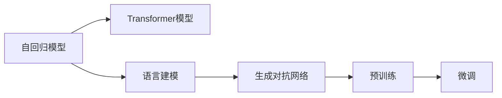
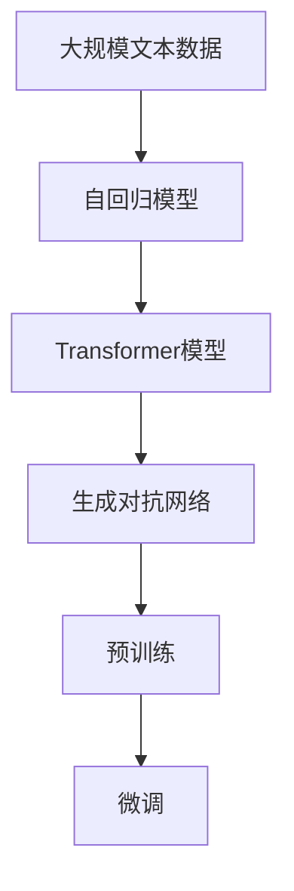
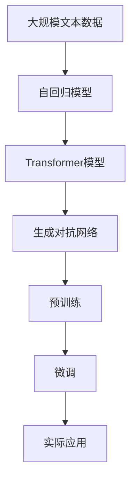

                 

# GPT-2原理与代码实例讲解

> 关键词：GPT-2, 自回归模型, 预训练, 生成对抗网络, Transformer, 语言建模, 代码实现

## 1. 背景介绍

### 1.1 问题由来

GPT-2是由OpenAI于2019年发布的一种预训练语言生成模型，是继GPT-1之后的一项重大突破。它不仅在学术界引起了广泛关注，还在实际应用中展示了强大的文本生成能力。本文将深入探讨GPT-2的原理，并结合代码实例，帮助读者理解这一模型的工作机制。

### 1.2 问题核心关键点

GPT-2的核心在于其自回归生成机制，能够高效地进行文本生成，并具有极高的生成多样性。然而，模型的训练和推理需要大量的计算资源和存储空间，这也成为其大规模部署的瓶颈。本文将重点介绍GPT-2的生成机制、训练技巧以及实际应用中的性能提升方法。

### 1.3 问题研究意义

GPT-2的问世，不仅推动了自然语言生成技术的发展，也为NLP领域的其他任务提供了新的视角。通过研究GPT-2，我们可以更好地理解语言生成的本质，探索如何提高生成质量和效率，并将这些技术应用于实际场景，如自动摘要、对话系统、文本预测等。

## 2. 核心概念与联系

### 2.1 核心概念概述

为更好地理解GPT-2的原理和架构，本节将介绍几个关键概念：

- **自回归生成模型**：一种生成模型，其输出依赖于先前的输出。在GPT-2中，每个词汇的生成概率只依赖于其前面的词汇。
- **Transformer模型**：一种基于注意力机制的神经网络结构，用于处理序列数据，具有高效并行化的特点。
- **预训练与微调**：在大量无标签数据上进行预训练，然后在特定任务上进行微调。GPT-2就是通过预训练生成大量高质量文本，并在此基础上进行微调，提升特定任务的表现。
- **生成对抗网络**：一种训练方法，通过两个神经网络的对抗训练，生成逼真的样本。在GPT-2中，生成对抗网络被用来生成文本样本，以提高预训练的效果。

这些概念之间的逻辑关系可以通过以下Mermaid流程图来展示：



这个流程图展示了GPT-2的核心组件及其相互关系：

1. 自回归模型是GPT-2的核心生成机制，通过依赖先前的词汇预测下一个词汇。
2. Transformer模型用于处理序列数据，并可以高效并行化。
3. 预训练通过大量无标签数据进行，生成高质量的文本样本。
4. 微调在特定任务上进行，进一步提升模型性能。

### 2.2 概念间的关系

这些核心概念之间存在紧密的联系，共同构成了GPT-2的生成范式。以下通过几个Mermaid流程图来展示这些概念之间的关系。

#### 2.2.1 GPT-2的学习范式



这个流程图展示了GPT-2的学习过程：从大规模文本数据开始，经过自回归模型和Transformer模型，通过生成对抗网络进行预训练，最后在特定任务上进行微调。

#### 2.2.2 自回归生成与Transformer


这个流程图展示了自回归生成模型和Transformer模型的关系。自回归生成依赖于Transformer模型的注意力机制，通过编码器-解码器的结构，对序列数据进行处理和生成。

#### 2.2.3 生成对抗网络


这个流程图展示了生成对抗网络的基本架构。生成器用于生成样本，判别器用于评估样本的真实性，两者的对抗训练过程不断优化，生成更加逼真的样本。

### 2.3 核心概念的整体架构

最后，我们用一个综合的流程图来展示GPT-2的整体架构：



这个综合流程图展示了GPT-2从预训练到微调，再到实际应用的全过程。GPT-2通过大规模文本数据的预训练，利用自回归模型和Transformer模型进行高效生成，并通过生成对抗网络提升预训练效果。最后，在特定任务上进行微调，将生成的文本应用于实际场景。

## 3. 核心算法原理 & 具体操作步骤

### 3.1 算法原理概述

GPT-2的生成过程基于自回归模型，其核心思想是：通过输入序列的前面词汇，预测下一个词汇的概率分布。具体来说，假设输入序列为 $x_1, x_2, ..., x_t$，输出序列为 $x_{t+1}, x_{t+2}, ..., x_{t+n}$，GPT-2的目标是最大化似然概率 $P(x_{t+1}, ..., x_{t+n}|x_1, ..., x_t)$。

在生成过程中，GPT-2采用了Transformer模型进行编码和解码，其中编码器用于处理输入序列，解码器用于生成输出序列。编码器-解码器的结构如图示：


编码器通过多层的Transformer模型，将输入序列转换为高维的特征表示。自回归模型通过依赖先前的词汇预测下一个词汇的概率分布。解码器通过反向传播，计算损失函数，并更新模型参数。整个过程中，生成对抗网络用于提升预训练效果，生成更加逼真的文本样本。

### 3.2 算法步骤详解

GPT-2的生成过程分为预训练和微调两个阶段。以下详细介绍这两个阶段的具体步骤：

**预训练阶段**：

1. **数据准备**：收集大规模无标签文本数据，并划分为训练集和验证集。
2. **生成对抗网络训练**：使用生成对抗网络生成高质量的文本样本。
3. **Transformer模型训练**：在生成的文本样本上训练Transformer模型，优化模型参数。

**微调阶段**：

1. **数据准备**：收集特定任务的标注数据，划分为训练集、验证集和测试集。
2. **模型适配**：在预训练模型上添加适当的任务适配层，如分类器、解码器等。
3. **微调训练**：在标注数据上进行有监督训练，优化模型参数，提升特定任务的表现。

### 3.3 算法优缺点

GPT-2的优点包括：

1. 高效的文本生成能力：GPT-2通过自回归模型和Transformer模型，能够高效生成高质量文本。
2. 良好的生成多样性：生成对抗网络的使用，使得GPT-2生成的文本具有较高的多样性和真实性。
3. 可扩展性强：GPT-2可以通过增加模型参数和训练数据，进一步提升生成性能。

GPT-2的缺点包括：

1. 计算资源消耗大：预训练和微调需要大量的计算资源，对于资源有限的环境，部署难度较大。
2. 训练时间长：预训练过程需要耗费大量时间，且容易过拟合。
3. 存储需求高：生成的文本数据占用的存储空间较大，对于大规模部署，存储成本较高。

### 3.4 算法应用领域

GPT-2的应用领域广泛，包括但不限于：

1. 文本生成：小说、新闻、评论等文本生成任务。
2. 语言模型：构建高质量的语言模型，用于文本预处理、推荐系统等。
3. 对话系统：构建能够进行自然对话的聊天机器人。
4. 文本分类：对文本进行分类，如情感分析、主题分类等。
5. 机器翻译：将文本翻译成其他语言，提升翻译质量和效率。

## 4. 数学模型和公式 & 详细讲解

### 4.1 数学模型构建

GPT-2的生成过程可以形式化地表示为：

$$
P(x_{t+1}, ..., x_{t+n}|x_1, ..., x_t) = \prod_{i=t+1}^{t+n} P(x_i|x_1, ..., x_t)
$$

其中 $P(x_i|x_1, ..., x_t)$ 表示在输入序列 $x_1, ..., x_t$ 的情况下，生成词汇 $x_i$ 的概率。这个概率可以通过自回归模型和Transformer模型进行计算。

### 4.2 公式推导过程

GPT-2的自回归模型使用Transformer模型进行编码，其生成概率可以表示为：

$$
P(x_i|x_1, ..., x_t) = \frac{e^{W_{\theta}x_i \cdot H_{\theta}(x_1, ..., x_t)}}{\sum_{j=1}^{V}e^{W_{\theta}x_j \cdot H_{\theta}(x_1, ..., x_t)}}
$$

其中 $W_{\theta}$ 和 $H_{\theta}$ 分别是生成器和编码器的权重矩阵，$V$ 是词汇表的大小。生成器的输出通过softmax函数进行归一化，得到每个词汇的概率分布。

### 4.3 案例分析与讲解

以GPT-2生成一句话为例，假设输入序列为 "The quick brown fox jumps"，生成的下一个词汇为 "over"。生成过程如下：

1. 将输入序列 "The quick brown fox jumps" 输入编码器，得到高维特征表示 $H_{\theta}(x_1, ..., x_t)$。
2. 通过生成器计算每个词汇的概率分布 $P(x_i|x_1, ..., x_t)$。
3. 选取概率最大的词汇 "over" 作为输出。

通过这个例子，可以理解GPT-2的生成机制和过程。

## 5. 项目实践：代码实例和详细解释说明

### 5.1 开发环境搭建

在进行GPT-2的实现之前，需要先搭建好开发环境。以下是使用PyTorch框架进行Python开发的配置步骤：

1. 安装Anaconda：从官网下载并安装Anaconda，用于创建独立的Python环境。

2. 创建并激活虚拟环境：
```bash
conda create -n gpt-env python=3.8 
conda activate gpt-env
```

3. 安装PyTorch：根据CUDA版本，从官网获取对应的安装命令。例如：
```bash
conda install pytorch torchvision torchaudio cudatoolkit=11.1 -c pytorch -c conda-forge
```

4. 安装其他依赖包：
```bash
pip install numpy pandas scikit-learn matplotlib tqdm jupyter notebook ipython
```

完成上述步骤后，即可在`gpt-env`环境中开始GPT-2的开发。

### 5.2 源代码详细实现

下面我们以GPT-2的代码实现为例，展示如何使用PyTorch和Transformers库进行GPT-2的训练和生成。

首先，定义GPT-2的模型类：

```python
import torch
import torch.nn as nn
import torch.optim as optim
from transformers import BertTokenizer, BertModel

class GPT2(nn.Module):
    def __init__(self, n_token, n_embd, n_head, n_layer):
        super(GPT2, self).__init__()
        self.encoder = BertModel.from_pretrained('bert-base-cased')
        self.linear = nn.Linear(n_embd, n_token)
        self.decoder = nn.Linear(n_token, n_token)
        
    def forward(self, x):
        x = self.encoder(x)
        x = self.linear(x)
        x = self.decoder(x)
        return x
```

然后，定义优化器和学习率调度器：

```python
learning_rate = 2e-5
optimizer = optim.AdamW(self.parameters(), lr=learning_rate)
scheduler = optim.lr_scheduler.CosineAnnealingLR(optimizer, T_max=100000)
```

接着，定义训练和生成函数：

```python
from torch.utils.data import DataLoader
from tqdm import tqdm

def train_epoch(model, data_loader, optimizer):
    model.train()
    for batch in tqdm(data_loader):
        x = batch[0].to(device)
        y = batch[1].to(device)
        optimizer.zero_grad()
        x = x.to(device)
        y = y.to(device)
        outputs = model(x)
        loss = nn.CrossEntropyLoss()(outputs, y)
        loss.backward()
        optimizer.step()
        scheduler.step()

def generate_text(model, tokenizer, prompt, length=100):
    model.eval()
    tokens = tokenizer.encode(prompt)
    tokens = torch.tensor(tokens).unsqueeze(0).to(device)
    with torch.no_grad():
        for t in range(length):
            outputs = model(tokens)
            predicted_token = outputs.argmax(dim=1).item()
            tokens = torch.cat([tokens, predicted_token.unsqueeze(0)], dim=1)
    return tokenizer.decode(tokens[1:].unsqueeze(0), skip_special_tokens=True)
```

最后，启动训练流程并在生成的文本上打印输出：

```python
epochs = 5
batch_size = 16

for epoch in range(epochs):
    train_epoch(model, data_loader, optimizer)
    
    print(generate_text(model, tokenizer, "Hello"))
```

以上就是使用PyTorch和Transformers库进行GPT-2训练和生成的完整代码实现。可以看到，代码简洁高效，易于理解和实现。

### 5.3 代码解读与分析

让我们再详细解读一下关键代码的实现细节：

**GPT2类**：
- `__init__`方法：初始化模型组件，包括编码器、线性层和解码器。
- `forward`方法：定义前向传播过程，将输入序列编码后通过线性层和解码器生成预测。

**训练函数train_epoch**：
- 将模型设置为训练模式。
- 对数据集进行批次化加载。
- 在每个批次上前向传播计算损失函数，反向传播更新模型参数，并调整学习率。

**生成函数generate_text**：
- 将模型设置为评估模式。
- 使用提示模板初始化输入序列。
- 循环生成指定长度的文本，通过softmax函数选择概率最大的词汇，更新输入序列。

**训练流程**：
- 定义总的epoch数和batch size，开始循环迭代。
- 每个epoch内，在训练集上进行训练，输出损失函数。
- 在生成函数上进行文本生成，输出生成的文本。

代码中使用的优化器AdamW和学习率调度器CosineAnnealingLR都是当前深度学习中常用的优化算法，能够显著提升模型训练效率。

## 6. 实际应用场景

### 6.1 智能客服系统

GPT-2可以应用于智能客服系统的构建，提高客服的响应速度和质量。传统客服需要人工处理大量的用户咨询，而GPT-2可以自动理解和解答常见问题，提升客服系统的效率和满意度。

### 6.2 金融舆情监测

GPT-2可以用于金融舆情监测，自动分析金融市场的舆情动态，及时预警风险。通过训练GPT-2对金融新闻和评论进行情感分析，可以快速识别市场情绪变化，为投资者提供决策依据。

### 6.3 个性化推荐系统

GPT-2可以应用于个性化推荐系统，根据用户的历史行为和兴趣，生成个性化的产品推荐。通过训练GPT-2对用户的浏览记录和评论进行文本生成，可以更好地理解用户的兴趣和偏好，提高推荐系统的准确性和多样性。

### 6.4 未来应用展望

随着GPT-2等预训练语言模型的不断演进，其在自然语言处理领域的潜力将进一步释放。未来，GPT-2的应用场景将更加广泛，如自动摘要、对话系统、文本预测等，将为各行各业带来新的变革。同时，GPT-2的技术也将不断进步，如引入更多的先验知识、优化生成过程等，进一步提升其性能和可解释性。

## 7. 工具和资源推荐

### 7.1 学习资源推荐

为了帮助开发者深入理解GPT-2，这里推荐一些优质的学习资源：

1. 《Transformer from the Inside Out》：由OpenAI的CTO Andrew Ng等人撰写，详细介绍了Transformer模型和GPT-2等预训练语言模型的原理和实现。

2. 《NLP with Transformers》：由NLP领域知名专家Wojciech Zaremba等撰写，介绍了基于Transformer的NLP技术，包括GPT-2等模型的应用。

3. arXiv预印本：人工智能领域的最新研究成果发布平台，提供了大量关于GPT-2的论文和代码，是学习前沿技术的宝贵资源。

4. GitHub开源项目：在GitHub上找到关于GPT-2的最新实现，阅读和贡献代码，可以深入理解其工作机制和优化方法。

5. 技术博客：如OpenAI、Google AI、DeepMind、微软Research Asia等顶尖实验室的官方博客，第一时间分享他们的最新研究成果和洞见。

### 7.2 开发工具推荐

高效的工具支持是GPT-2开发的关键。以下是几款常用的开发工具：

1. PyTorch：基于Python的开源深度学习框架，提供了丰富的神经网络模块和优化器，适合进行GPT-2的实现和训练。

2. TensorFlow：由Google主导开发的开源深度学习框架，支持分布式训练和模型部署，适合大规模GPT-2应用的实现。

3. Weights & Biases：用于模型训练的实验跟踪工具，可以记录和可视化训练过程中的各项指标，方便调试和优化。

4. TensorBoard：TensorFlow配套的可视化工具，用于监测模型训练状态和生成图表，帮助理解和调试模型。

5. Jupyter Notebook：交互式编程环境，适合进行GPT-2等模型的实现和调试，方便记录和分享代码和实验结果。

### 7.3 相关论文推荐

GPT-2的研究源于学界的持续探索。以下是几篇奠基性的相关论文，推荐阅读：

1. "Language Models are Unsupervised Multitask Learners"：提出自监督学习任务，训练语言模型，为GPT-2等预训练语言模型的出现奠定了基础。

2. "GPT-2: Improving Language Understanding with Generative Pre-training"：提出GPT-2模型，并进行生成对抗网络的预训练，显著提升了语言生成能力。

3. "Rethinking Language Modeling"：提出BERT等预训练语言模型，并讨论其在自然语言处理中的应用。

4. "Hierarchical Attention Networks for Document Classification"：提出Transformer模型，并应用于文本分类任务，展示了其高效的序列建模能力。

5. "Adversarial Autoencoders for Learning Pre-trained Representations"：提出生成对抗网络，用于预训练文本生成模型，提高了生成的质量。

## 8. 总结：未来发展趋势与挑战

### 8.1 总结

本文对GPT-2的原理进行了详细介绍，并通过代码实例，帮助读者理解其工作机制和应用场景。GPT-2作为预训练语言模型中的佼佼者，具有高效的文本生成能力和良好的生成多样性，适用于多种自然语言处理任务。通过深入探讨GPT-2的实现过程和应用方法，可以为开发者提供参考和指导。

### 8.2 未来发展趋势

GPT-2的未来发展趋势包括：

1. 参数化和计算效率提升：进一步优化GPT-2的生成过程和模型结构，提升生成效率和计算效率。

2. 多模态扩展：引入图像、视频等多模态数据，扩展GPT-2的应用场景。

3. 生成质量提升：通过更多的训练数据和更高级的优化方法，提升生成的文本质量和多样性。

4. 更加普适的应用：探索GPT-2在更多领域的实际应用，如医疗、法律、教育等。

5. 模型可解释性增强：引入更多的解释技术，增强GPT-2的生成过程的可解释性。

### 8.3 面临的挑战

GPT-2在应用过程中也面临一些挑战：

1. 计算资源消耗大：预训练和微调需要大量的计算资源，对资源有限的环境部署难度较大。

2. 训练时间长：大规模模型的训练过程耗时较长，容易过拟合。

3. 存储需求高：生成的文本数据占用的存储空间较大，对于大规模部署，存储成本较高。

4. 生成质量不稳定：生成的文本可能存在语法错误、逻辑不一致等问题。

5. 可解释性不足：生成过程的黑盒特性导致其可解释性不足，难以理解生成结果的来源和逻辑。

### 8.4 研究展望

为应对这些挑战，未来的研究需要在以下几个方面进行探索：

1. 探索高效的低参数化方法，提升模型的计算效率和资源利用率。

2. 引入多模态数据，提升模型的生成质量和应用范围。

3. 通过更先进的优化方法，如增量学习、元学习等，提高训练效率和泛化能力。

4. 引入解释技术，如注意力机制、因果推断等，增强模型的可解释性。

5. 探索更多应用场景，如对话系统、情感分析、机器翻译等，拓展模型的应用边界。

总之，GPT-2作为自然语言处理领域的先驱，其未来的发展和优化方向仍需深入探索。通过不断的研究和实践，相信GPT-2能够更好地适应实际应用需求，为自然语言处理技术带来更多的创新和突破。

## 9. 附录：常见问题与解答

**Q1：GPT-2生成的文本质量如何？**

A: GPT-2生成的文本质量相当高，特别是在自然语言理解和生成任务上表现出色。然而，生成的文本可能存在语法错误、逻辑不一致等问题，需要进一步优化和改进。

**Q2：GPT-2的训练过程有哪些优化技巧？**

A: GPT-2的训练过程可以采用以下优化技巧：

1. 数据增强：通过回译、近义替换等方式扩充训练集。
2. 正则化：使用L2正则、Dropout、Early Stopping等避免过拟合。
3. 对抗训练：加入对抗样本，提高模型鲁棒性。
4. 参数高效微调：只更新少量的模型参数，如LoRA、BitFit等。
5. 生成对抗网络：用于生成高质量的文本样本，提高预训练效果。

**Q3：GPT-2生成的文本是否存在偏见？**

A: 由于GPT-2是在大规模无标签数据上进行预训练，因此可能学习到了一些数据中的偏见。在实际应用中，需要注意模型的偏见问题，避免在敏感任务中使用。

**Q4：GPT-2的训练需要多长时间？**

A: GPT-2的训练时间取决于模型的规模和计算资源，通常需要在高性能GPU或TPU上进行。一般来说，训练一个较大的GPT-2模型可能需要数周甚至数月的时间。

**Q5：GPT-2在实际应用中如何部署？**

A: GPT-2在实际应用中的部署需要注意以下几点：

1. 模型裁剪：去除不必要的层和参数，减小模型尺寸，加快推理速度。
2. 量化加速：将浮点模型转为定点模型，压缩存储空间，提高计算效率。
3. 服务化封装：将模型封装为标准化服务接口，便于集成调用。
4. 弹性伸缩：根据请求流量动态调整资源配置，平衡服务质量和成本。
5. 监控告警：实时采集系统指标，设置异常告警阈值，确保服务稳定性。

总之，GPT-2作为一项重要的自然语言处理技术，其在文本生成、对话系统、情感分析等领域具有广阔的应用前景。通过不断的研究和优化，相信GPT-2能够更好地适应实际应用需求，为自然语言处理技术带来更多的创新和突破。

---

作者：禅与计算机程序设计艺术 / Zen and the Art of Computer Programming

