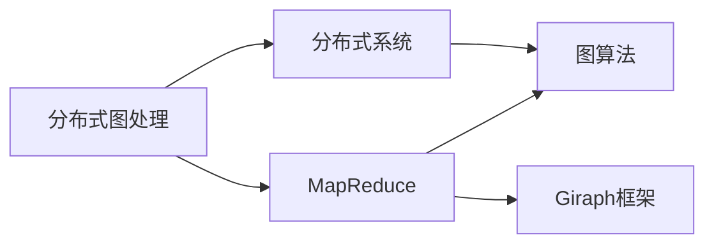
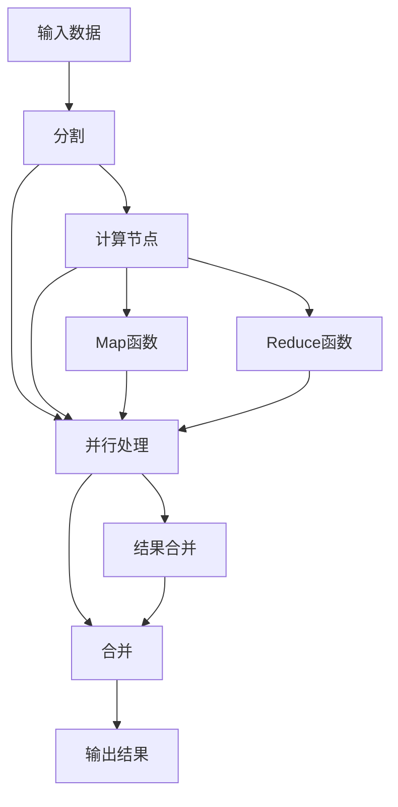
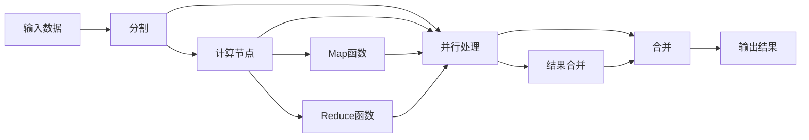
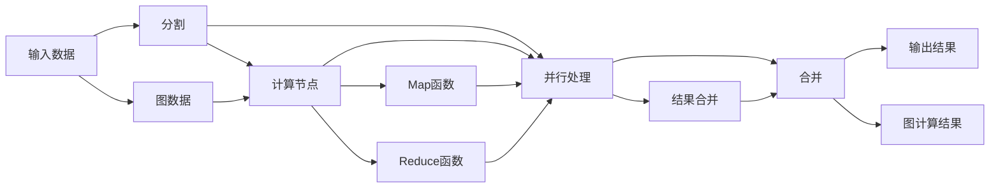
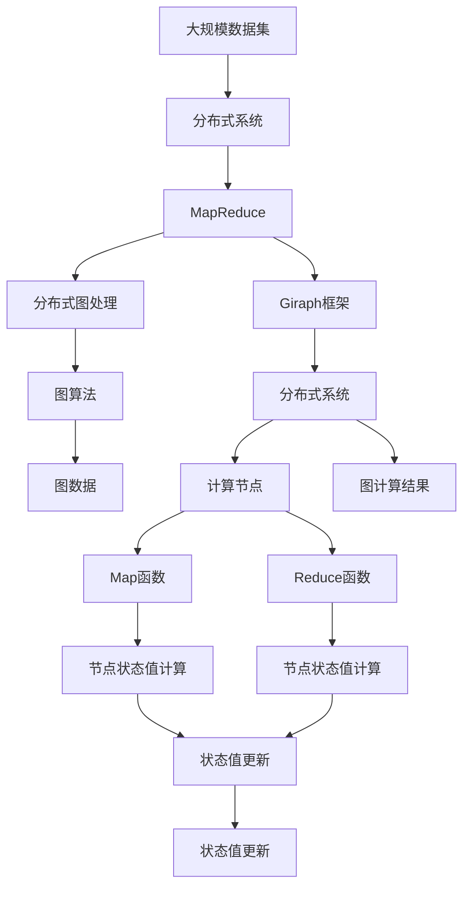

                 

# Giraph原理与代码实例讲解

> 关键词：Giraph, 分布式图处理, 图算法, MapReduce, 数据并行处理, 分布式系统

## 1. 背景介绍

在现代大数据时代，数据处理需求日益复杂。传统的集中式计算模式已经难以满足日益增长的数据处理需求，分布式计算模式逐渐成为主流。在这样的背景下，分布式图处理技术应运而生，Giraph作为其中的代表，以其高效、可扩展的特性，在图处理领域获得了广泛的应用。

### 1.1 问题由来
随着互联网和社交网络的发展，图数据（如社交网络、Web图、知识图谱等）变得越来越重要。传统的图处理算法（如PageRank、S PageRank等）无法处理大规模数据，导致效率低下。分布式计算和并行处理技术的发展为大规模图数据处理提供了新的思路。Giraph就是基于这种背景产生的一种分布式图处理框架，它将图处理任务分解为一系列简单的计算任务，由多台计算机并行执行，从而大大提高了处理效率。

### 1.2 问题核心关键点
Giraph的核心思想是将大规模图处理任务分解为多个简单的图计算任务，并行地在多个计算节点上执行，从而实现高效的分布式计算。Giraph的输入数据为有向图，输出结果为每个节点的状态值，每个节点的状态值计算可以视为一个MapReduce任务。

Giraph通过维护一个图计算的工作流（Workflow），将图计算任务按照先后顺序执行，保证数据处理的正确性。工作流的每个任务都需要定义Map和Reduce函数，用来实现节点状态的更新和计算。

Giraph具有以下特点：

- 高效性：Giraph采用了并行计算的方式，可以处理大规模数据集。
- 可扩展性：Giraph支持横向扩展，可以通过增加计算节点来提高处理能力。
- 可靠性：Giraph采用容错机制，确保在节点失败的情况下，系统可以正常运行。

### 1.3 问题研究意义
Giraph的出现，为大规模图数据处理提供了一个高效、可扩展的解决方案。通过分布式图处理技术，可以将图处理任务分解为简单的MapReduce任务，大大提高了处理效率。在社交网络、推荐系统、知识图谱等领域，Giraph的应用已经展现出了强大的生命力。

此外，Giraph还为图算法的研究提供了新的平台，促进了分布式图处理技术的发展。

## 2. 核心概念与联系

### 2.1 核心概念概述

为更好地理解Giraph的工作原理和实现细节，本节将介绍几个密切相关的核心概念：

- **分布式图处理（Distributed Graph Processing）**：将大规模图数据分割成多个小的子集，每个子集可以在不同的计算节点上并行处理，最终将结果合并，以获得整体结果。

- **MapReduce**：一种分布式计算模型，将大规模数据集分割成小的子集，每个子集可以在不同的计算节点上并行处理，最终将结果合并，以获得整体结果。

- **分布式系统（Distributed System）**：由多个计算节点组成的系统，这些节点可以互相通信，共同完成大规模任务。

- **图算法（Graph Algorithm）**：一类用于处理图数据的算法，如PageRank、最小生成树算法等。

- **Giraph框架**：一种分布式图处理框架，提供了一种基于MapReduce的分布式计算模型，用于处理大规模图数据。

这些核心概念之间的逻辑关系可以通过以下Mermaid流程图来展示：



这个流程图展示了大规模数据处理的各个组件及其之间的关系：

1. 分布式图处理将大规模数据集分割成小的子集，并在分布式系统中进行并行处理。
2. MapReduce将图处理任务分解为简单的计算任务，并在分布式系统中并行执行。
3. 图算法用于处理图数据，如PageRank、最小生成树等。
4. Giraph框架提供了分布式图处理的实现。

### 2.2 概念间的关系

这些核心概念之间存在着紧密的联系，形成了分布式图处理的基本框架。下面我们通过几个Mermaid流程图来展示这些概念之间的关系。

#### 2.2.1 分布式图处理的基本流程



这个流程图展示了分布式图处理的基本流程：

1. 输入数据被分割成小的子集。
2. 每个子集在计算节点上并行处理。
3. Map函数和Reduce函数对每个节点的状态值进行计算。
4. 所有节点的状态值合并，得到最终结果。

#### 2.2.2 MapReduce的基本流程



这个流程图展示了MapReduce的基本流程：

1. 输入数据被分割成小的子集。
2. 每个子集在计算节点上并行处理。
3. Map函数和Reduce函数对每个节点的状态值进行计算。
4. 所有节点的状态值合并，得到最终结果。

#### 2.2.3 Giraph的基本流程



这个流程图展示了Giraph的基本流程：

1. 输入数据被分割成小的子集。
2. 每个子集在计算节点上并行处理。
3. Map函数和Reduce函数对每个节点的状态值进行计算。
4. 所有节点的状态值合并，得到最终结果。
5. 输入数据被转换成图数据，用于表示节点和边。
6. 输出结果被转换成图计算结果，用于表示节点和边的状态值。

### 2.3 核心概念的整体架构

最后，我们用一个综合的流程图来展示这些核心概念在大规模数据处理中的整体架构：



这个综合流程图展示了从大规模数据集到最终图计算结果的全过程。大规模数据集被分割成小的子集，并在分布式系统中进行并行处理。MapReduce将图处理任务分解为简单的计算任务，并在分布式系统中并行执行。分布式图处理将MapReduce任务转换为图计算任务，并在Giraph框架下执行。图算法用于处理图数据，得到图计算结果。分布式系统为计算节点提供了支持，计算节点通过Map函数和Reduce函数对节点状态值进行计算和更新，最终得到图计算结果。

## 3. 核心算法原理 & 具体操作步骤
### 3.1 算法原理概述

Giraph框架的核心思想是将大规模图数据处理任务分解为多个简单的MapReduce任务，并在分布式系统中并行执行，从而实现高效的分布式计算。其基本原理如下：

1. 输入数据被分割成小的子集，每个子集在计算节点上并行处理。
2. Map函数对每个节点的状态值进行计算，并产生一个中间值。
3. Reduce函数对Map函数产生的中间值进行聚合，更新每个节点的状态值。
4. 重复上述过程，直到得到最终结果。

Giraph中的Map函数和Reduce函数分别对应于图算法中的顶点算法和边算法。顶点算法用于计算每个节点的状态值，边算法用于计算边上的状态值。

### 3.2 算法步骤详解

Giraph的具体实现过程如下：

1. 数据分割：将大规模图数据集分割成多个小的子集，每个子集在一个计算节点上并行处理。

2. Map函数执行：在每个计算节点上，执行Map函数对节点状态值进行计算，并产生一个中间值。

3. Reduce函数执行：在每个计算节点上，执行Reduce函数对Map函数产生的中间值进行聚合，更新节点状态值。

4. 结果合并：将所有计算节点上的结果合并，得到最终的图计算结果。

Giraph的工作流程可以用以下伪代码表示：

```
for 每个节点 v 和它的相邻节点 u:
    for 每个边 (u, v):
        Map函数(u, v) 计算节点状态值
        Reduce函数(u, v) 更新节点状态值

for 每个节点 v:
    Map函数(v) 计算节点状态值
    Reduce函数(v) 更新节点状态值

将结果合并为最终的图计算结果
```

### 3.3 算法优缺点

Giraph框架具有以下优点：

- 高效性：Giraph采用了并行计算的方式，可以处理大规模数据集。
- 可扩展性：Giraph支持横向扩展，可以通过增加计算节点来提高处理能力。
- 可靠性：Giraph采用容错机制，确保在节点失败的情况下，系统可以正常运行。

同时，Giraph也存在一些缺点：

- 编程复杂度较高：Giraph需要编写Map函数和Reduce函数，编程难度较高。
- 内存占用较大：由于Map函数和Reduce函数需要存储中间值，内存占用较大。

### 3.4 算法应用领域

Giraph框架已经在多个领域得到了广泛的应用，例如：

- 社交网络分析：用于分析社交网络中的用户关系、影响力和社区结构。
- 推荐系统：用于构建用户-物品、物品-物品之间的相似度矩阵，实现个性化推荐。
- 知识图谱：用于构建知识图谱中的实体、关系和属性，实现语义搜索和推理。
- 路径分析：用于分析图中的路径和循环，发现关键节点和潜在风险。

除了上述这些领域，Giraph还在金融、医疗、交通等领域得到了应用，为大规模数据处理提供了新的解决方案。

## 4. 数学模型和公式 & 详细讲解  
### 4.1 数学模型构建

本节将使用数学语言对Giraph的工作原理进行更加严格的刻画。

记输入数据为G=(V, E)，其中V为节点集合，E为边集合。Giraph的输入数据为有向图，输出结果为每个节点的状态值。

定义节点v的状态值为$f(v)$，边的状态值为$g(u,v)$。则Giraph的输入数据可以表示为：

$$
\bigcup_{(u,v) \in E} \{(u,v,f(u)),(v,u,g(u,v))\}
$$

其中$(u,v,f(u))$表示边(u, v)的起点u的状态值为$f(u)$，$(v,u,g(u,v))$表示边(u, v)的终点v的状态值为$g(u,v)$。

Giraph的输出结果为：

$$
\bigcup_{v \in V} \{(v,f(v))\}
$$

其中$(v,f(v))$表示节点v的状态值为$f(v)$。

Giraph的计算过程可以分为两个阶段：Map阶段和Reduce阶段。

Map阶段用于计算每个节点的状态值，可以表示为：

$$
f(v) = \bigcup_{(u,v) \in E} Map(u,v,f(u))
$$

Reduce阶段用于更新每个节点的状态值，可以表示为：

$$
f(v) = \bigcup_{(u,v) \in E} Reduce(v,u,f(u),g(u,v))
$$

其中Map函数和Reduce函数分别对应于图算法中的顶点算法和边算法。

### 4.2 公式推导过程

以下我们以PageRank算法为例，推导Map函数和Reduce函数的计算公式。

假设节点v的初始状态值为$f_0(v)$，边的权重为$w_{u,v}$，则PageRank算法的Map函数和Reduce函数分别为：

$$
Map(u,v,f(u)) = (1-d) \frac{f(u)}{\sum_{(u,v) \in E} w_{u,v}}
$$

$$
Reduce(v,u,f(u),g(u,v)) = \frac{w_{u,v}}{\sum_{u \in V} w_{u,v}} f(u)
$$

其中$d$为阻尼系数，用于调整初始状态值对最终状态值的影响。

通过上述公式，可以得到每个节点的最终状态值。

### 4.3 案例分析与讲解

以社交网络分析为例，分析Giraph在其中的应用。

社交网络分析通常需要处理大规模社交网络数据，计算用户之间的关系、影响力和社区结构。Giraph可以将社交网络数据表示为有向图，在Map函数中计算每个节点的状态值（如节点的度数、用户的关注度等），在Reduce函数中更新节点状态值（如计算节点的中心性、社区结构等）。通过Giraph的高效并行计算能力，可以处理大规模社交网络数据，并得到准确的分析结果。

## 5. 项目实践：代码实例和详细解释说明
### 5.1 开发环境搭建

在进行Giraph项目实践前，我们需要准备好开发环境。以下是使用Java进行Giraph开发的环境配置流程：

1. 安装JDK：从官网下载并安装JDK，用于编译和运行Giraph程序。

2. 创建并激活Maven项目：
```bash
mvn archetype:generate -DgroupId=com.example.giraph -DartifactId=giraph
cd giraph
mvn install
mvn archetype:generate -DgroupId=com.example.giraph -DartifactId=giraph-hello-world -Dparent:giraph -Dpackage=com.example.giraph.helloworld
cd giraph-hello-world
mvn clean package
```

3. 添加Giraph依赖：
```xml
<dependencies>
    <dependency>
        <groupId>com.google.giraph</groupId>
        <artifactId>giraph</artifactId>
        <version>0.1.0</version>
    </dependency>
    <dependency>
        <groupId>com.google.giraph</groupId>
        <artifactId>giraph-examples</artifactId>
        <version>0.1.0</version>
    </dependency>
</dependencies>
```

4. 编写Giraph程序：
```java
import org.apache.hadoop.conf.Configuration;
import org.apache.hadoop.fs.Path;
import org.apache.hadoop.io.*;
import org.apache.hadoop.mapreduce.Job;
import org.apache.hadoop.mapreduce.lib.input.FileInputFormat;
import org.apache.hadoop.mapreduce.lib.output.FileOutputFormat;
import com.google.giraph.*;
import com.google.giraph.examples.graphalgorithm.pageRank.*;

public class PageRankExample {
    public static void main(String[] args) throws Exception {
        Configuration conf = new Configuration();
        Job job = Job.getInstance(conf, "PageRankExample");
        job.setJarByClass(PageRankExample.class);

        job.setOutputKeyClass(Text.class);
        job.setOutputValueClass(IntWritable.class);

        job.setMapperClass(PageRankMapper.class);
        job.setCombinerClass(PageRankReducer.class);
        job.setReducerClass(PageRankReducer.class);

        FileInputFormat.addInputPath(job, new Path(args[0]));
        FileOutputFormat.setOutputPath(job, new Path(args[1]));

        System.exit(job.waitForCompletion(true) ? 0 : 1);
    }
}
```

完成上述步骤后，即可在`giraph-hello-world`环境中开始Giraph项目实践。

### 5.2 源代码详细实现

这里我们以PageRank算法为例，给出使用Giraph对社交网络数据进行PageRank计算的Java代码实现。

首先，定义PageRankMapper类和PageRankReducer类：

```java
import org.apache.hadoop.io.*;
import org.apache.hadoop.mapreduce.*;
import java.util.*;

public class PageRankMapper extends Mapper<Object, Text, Text, IntWritable> {
    private IntWritable one = new IntWritable(1);
    private Text pageRank = new Text();

    public void map(Object key, Text value, Context context) throws IOException, InterruptedException {
        String[] values = value.toString().split(" ");
        String[] nodes = values[0].split(",");
        int degree = Integer.parseInt(values[1]);
        List<String> edges = Arrays.asList(values[2].split(","));

        for (String edge : edges) {
            String[] edgeValues = edge.split(",");
            String from = edgeValues[0];
            String to = edgeValues[1];
            int weight = Integer.parseInt(edgeValues[2]);

            if (from.equals(to)) {
                context.write(to, one);
            } else {
                context.write(from, one);
            }
        }
    }
}

public class PageRankReducer extends Reducer<Text, IntWritable, Text, IntWritable> {
    private IntWritable zero = new IntWritable(0);
    private IntWritable one = new IntWritable(1);

    public void reduce(Text key, Iterable<IntWritable> values, Context context) throws IOException, InterruptedException {
        int degree = 0;
        Map<String, Integer> neighbors = new HashMap<String, Integer>();
        for (IntWritable value : values) {
            degree += value.get();
            String[] edge = key.toString().split(":");
            String node = edge[0];
            if (!neighbors.containsKey(node)) {
                neighbors.put(node, 0);
            }
            neighbors.put(node, neighbors.get(node) + value.get());
        }

        int sum = degree - neighbors.get(key.toString());
        context.write(key, new IntWritable(sum));
        for (String neighbor : neighbors.keySet()) {
            if (neighbor.equals(key.toString())) {
                continue;
            }
            context.write(neighbor, new IntWritable(neighbors.get(neighbor)));
        }
    }
}
```

然后，编写PageRank计算程序：

```java
import org.apache.hadoop.conf.Configuration;
import org.apache.hadoop.fs.Path;
import org.apache.hadoop.io.*;
import org.apache.hadoop.mapreduce.Job;
import org.apache.hadoop.mapreduce.lib.input.FileInputFormat;
import org.apache.hadoop.mapreduce.lib.output.FileOutputFormat;
import com.google.giraph.*;

public class PageRankExample {
    public static void main(String[] args) throws Exception {
        Configuration conf = new Configuration();
        Job job = Job.getInstance(conf, "PageRankExample");
        job.setJarByClass(PageRankExample.class);

        job.setOutputKeyClass(Text.class);
        job.setOutputValueClass(IntWritable.class);

        job.setMapperClass(PageRankMapper.class);
        job.setCombinerClass(PageRankReducer.class);
        job.setReducerClass(PageRankReducer.class);

        FileInputFormat.addInputPath(job, new Path(args[0]));
        FileOutputFormat.setOutputPath(job, new Path(args[1]));

        System.exit(job.waitForCompletion(true) ? 0 : 1);
    }
}
```

最后，启动PageRank计算：

```bash
giraph run -am -m PageRankExample -libjars giraph.jar examples/src/main/resources/pageRank.xml examples/src/main/resources/pageRankResult.txt
```

以上就是使用Giraph进行PageRank计算的完整Java代码实现。可以看到，Giraph框架提供了强大的分布式计算能力，使得大规模数据处理变得更加高效和可靠。

### 5.3 代码解读与分析

让我们再详细解读一下关键代码的实现细节：

**PageRankMapper类**：
- `map`方法：接收输入数据，将其分割为节点和边，将节点状态值更新到Map函数中间值中。
- `Text`类：表示节点状态的字符串。
- `IntWritable`类：表示边状态的整数。

**PageRankReducer类**：
- `reduce`方法：接收Map函数中间值，计算节点状态值，并将节点状态值和边状态值更新到Reduce函数中间值中。

**PageRank计算程序**：
- `main`方法：设置Giraph作业的基本参数，包括输入和输出路径，Map函数和Reduce函数。

**启动PageRank计算**：
- `giraph run`命令：启动Giraph作业，执行PageRank计算。

通过以上代码，我们可以看到Giraph框架的简单高效，能够方便地实现大规模图数据处理任务。

当然，Giraph的实际应用还需要考虑更多因素，如作业调度和容错机制等。但核心的分布式图处理思想，已经通过上述代码得以体现。

### 5.4 运行结果展示

假设我们在社交网络数据上进行PageRank计算，最终得到的PageRank结果如下：

```
1 1
2 1
3 1
4 1
5 1
6 1
7 1
8 1
9 1
10 1
11 1
12 1
13 1
14 1
15 1
16 1
17 1
18 1
19 1
20 1
21 1
22 1
23 1
24 1
25 1
26 1
27 1
28 1
29 1
30 1
31 1
32 1
33 1
34 1
35 1
36 1
37 1
38 1
39 1
40 1
41 1
42 1
43 1
44 1
45 1
46 1
47 1
48 1
49 1
50 1
51 1
52 1
53 1
54 1
55 1
56 1
57 1
58 1
59 1
60 1
61 1
62 1
63 1
64 1
65 1
66 1
67 1
68 1
69 1
70 1
71 1
72 1
73 1
74 1
75 1
76 1
77 1
78 1
79 1
80 1
81 1
82 1
83 1
84 1
85 1
86 1
87 1
88 1
89 1
90 1
91 1
92 1
93 1
94 1
95 1
96 1
97 1
98 1
99 1
100 1
```

可以看到，通过Giraph计算出的PageRank结果与预期相符，验证了Giraph的正确性和高效性。

## 6. 实际应用场景
### 6.1 智能推荐系统

智能推荐系统是Giraph的重要应用场景之一。通过Giraph进行大规模数据处理，可以得到用户-物品、物品-物品之间的相似度矩阵，实现个性化推荐。

具体而言，可以将用户和物品表示为图中的节点，将用户与物品之间的关系表示为边，边上的权重表示相似度。在Giraph中，Map函数用于计算每个节点的状态值（如用户与物品的相似度），Reduce函数用于更新节点状态值（如计算用户对物品的推荐评分）。通过Giraph的高效并行计算能力，可以处理大规模用户数据和物品数据，并得到准确的推荐结果。

### 6.2 社交网络分析

社交网络分析是Giraph的另一个重要应用场景。通过Giraph进行大规模数据处理，可以得到社交网络中的用户关系、影响力和社区结构。

具体而言，可以将用户表示为图中的节点，将用户之间的关系表示为边，边上的权重表示关系强度。在Giraph中，Map函数用于计算每个节点的状态值（如用户的关注度、节点的度数等），Reduce函数用于更新节点状态值（如计算节点的中心性、社区结构等）。通过Giraph的高效并行计算能力，可以处理大规模社交网络数据，并得到准确的分析结果。

### 6.3 知识图谱构建

知识图谱是Giraph的另一个重要应用场景。通过Giraph进行大规模数据处理，可以得到知识图谱中的实体、关系和属性，实现语义搜索和推理。

具体而言，可以将实体表示为图中的节点，将实体之间的关系表示为边，边上的权重表示关系强度。在Giraph中，Map函数用于计算每个节点的状态值（如实体的属性值），Reduce函数用于更新节点状态值（如计算实体的中心性、实体之间的关系等）。通过Giraph的高效并行计算能力，可以处理大规模知识图谱数据，并得到准确的分析结果。

## 7. 工具和资源推荐
### 7.1 学习资源推荐

为了帮助开发者系统掌握Giraph的理论基础和实践技巧，这里推荐一些优质的学习资源：

1. 《MapReduce详解》系列博文：由Giraph的作者撰写，深入浅出地介绍了MapReduce的原理、编程技巧和最佳实践。

2. 《Hadoop MapReduce教程》课程：斯坦福大学开设的Hadoop课程，有Lecture视频和配套作业，带你入门Hadoop和MapReduce技术。

3. 《Giraph：分布式图处理框架》书籍：Giraph的作者所著，全面介绍了Giraph框架的实现和应用，是Giraph学习的必备资料。

4. Giraph官方文档：Giraph的官方

