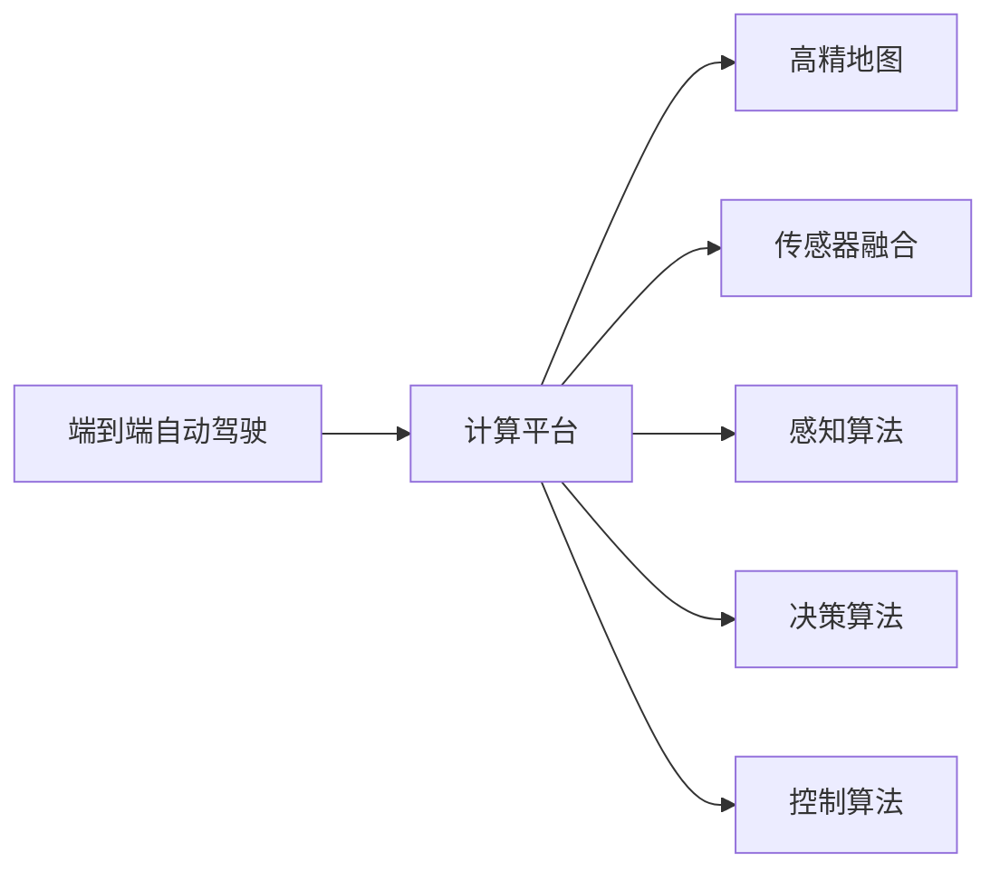

                 

# 端到端自动驾驶的硬件计算平台演进

## 1. 背景介绍

自动驾驶技术近年来成为全球科技和产业界的热点，它通过在车辆上安装各种传感器，如激光雷达（LIDAR）、摄像头、雷达等，实时获取车辆周围的环境信息，并结合先进的计算平台，实现车辆自主决策和导航。相较于传统驾驶方式，自动驾驶系统可显著提高行车安全、提升驾驶效率、降低环境污染等社会效益。

目前，自动驾驶系统通常由感知、决策和控制三个部分组成，其中硬件计算平台是核心组件，承担着复杂的计算任务。本文旨在深入探讨端到端自动驾驶的硬件计算平台演进，帮助读者理解其关键组件和技术路径。

## 2. 核心概念与联系

### 2.1 核心概念概述

1. **端到端自动驾驶（End-to-End Autonomous Driving）**：指车辆从感知到决策再到控制的全流程自动化驾驶。具体实现包括对传感器数据的实时处理、模型预测、路径规划和车辆控制等。

2. **计算平台**：用于处理自动驾驶系统所需的大量数据和复杂的决策计算。它通常由中央处理单元（CPU）、图形处理单元（GPU）、现场可编程门阵列（FPGA）等多种硬件组件组成。

3. **高精地图**：记录道路、车辆、行人等动态信息，为自动驾驶系统提供全局的定位和导航信息。

4. **传感器融合**：将多种传感器的数据进行组合处理，得到更准确的环境信息。

5. **感知算法**：包括计算机视觉、雷达目标检测、激光雷达点云处理等，用于感知和理解周围环境。

6. **决策算法**：基于感知结果进行路径规划和驾驶决策，如车流分析、行人检测和避障等。

7. **控制算法**：用于控制车辆的转向、加速和制动，实现车辆的精确导航和避障。

### 2.2 概念间的关系

通过以下Mermaid流程图来展示这些核心概念之间的联系：



## 3. 核心算法原理 & 具体操作步骤

### 3.1 算法原理概述

端到端自动驾驶的硬件计算平台演进主要关注两个核心问题：如何提升计算效率和如何优化数据处理。算法的演进通常围绕着这两个目标进行优化。

- **提升计算效率**：通过硬件加速和算法优化，减少计算量和延迟，提高响应速度。
- **优化数据处理**：通过数据压缩和特征提取，减少传感器数据量，提升数据处理速度。

### 3.2 算法步骤详解

一个典型的端到端自动驾驶硬件计算平台包括感知、决策和控制三个步骤，每个步骤涉及多种算法。以下是详细的算法步骤：

**Step 1: 感知**

- **传感器数据收集**：收集激光雷达、摄像头、雷达等传感器数据。
- **数据预处理**：对传感器数据进行去噪、校正、融合等处理，提高数据质量。
- **特征提取**：使用卷积神经网络（CNN）、点云处理等技术，从传感器数据中提取特征。
- **目标检测**：使用对象检测算法（如YOLO、Faster R-CNN），在传感器数据中检测出车辆、行人等目标。

**Step 2: 决策**

- **路径规划**：使用A*、D*等算法，规划最优路径，避开障碍物。
- **行为决策**：结合感知结果，使用深度强化学习等算法，进行避障、超车、停车等决策。
- **信号处理**：分析交通信号灯、路标等信息，进行行为决策。

**Step 3: 控制**

- **车辆控制**：根据决策结果，使用PID控制算法，调整车辆的转向、加速和制动。
- **驾驶行为优化**：使用优化算法，如动态规划，进一步优化车辆行为。

### 3.3 算法优缺点

- **优点**
  - **计算效率高**：使用GPU、FPGA等硬件加速，大幅提升了计算效率。
  - **数据处理能力强**：算法优化减少了数据处理量和延迟，提高了响应速度。
  - **算法成熟**：自动驾驶领域众多算法经过多年发展，技术成熟，性能稳定。

- **缺点**
  - **硬件成本高**：高性能的计算平台价格昂贵，增加了系统成本。
  - **能耗高**：高性能硬件能耗较大，需要额外的散热系统。
  - **算法复杂**：涉及多种算法，算法调试和优化工作量大。

### 3.4 算法应用领域

端到端自动驾驶的硬件计算平台主要应用于以下领域：

- **城市自动驾驶**：在城市道路上进行自动驾驶，处理复杂的城市交通环境。
- **高速自动驾驶**：在高速公路上实现自动驾驶，处理高速行驶时的实时数据。
- **智慧公路**：在智慧公路上部署自动驾驶系统，实现道路监控和数据采集。

## 4. 数学模型和公式 & 详细讲解 & 举例说明

### 4.1 数学模型构建

端到端自动驾驶的硬件计算平台演进涉及到多种数学模型和公式。以下是几个关键模型的构建和说明：

1. **卷积神经网络（CNN）**：用于图像处理和特征提取，其模型结构为：

   $$
   y=f(W*x+b)
   $$

   其中，$W$ 为卷积核，$x$ 为输入图像，$b$ 为偏置项。

2. **点云处理**：用于处理激光雷达数据，常用的点云模型为：

   $$
   p=(x,y,z)=(\frac{x}{1+\frac{z}{f_z}},\frac{y}{1+\frac{z}{f_z}},z)
   $$

   其中，$x$、$y$、$z$ 为传感器坐标，$f_z$ 为焦距。

3. **路径规划算法**：常用的路径规划算法有A*、D*等，其核心思想是搜索代价最小的路径。

4. **深度强化学习（Deep Reinforcement Learning, DRL）**：用于行为决策，常用的模型为：

   $$
   Q(s,a)=\sum_{t=1}^{T} \gamma^t R(s_t,a_t)
   $$

   其中，$Q(s,a)$ 为状态-动作价值函数，$R(s_t,a_t)$ 为即时奖励，$\gamma$ 为折扣因子。

### 4.2 公式推导过程

以卷积神经网络（CNN）为例，介绍公式推导过程：

- **输入数据**：图像数据 $x$。
- **卷积操作**：通过卷积核 $W$ 对输入数据进行卷积操作，得到卷积结果 $y$。
- **激活函数**：对卷积结果应用激活函数 $f$，如ReLU函数，得到最终输出 $y$。

### 4.3 案例分析与讲解

以路径规划算法为例，分析其应用场景和效果：

假设车辆在城市道路上行驶，路径规划算法需要：

- **感知环境**：通过传感器数据，获取周围车辆、行人、路标等障碍物信息。
- **规划路径**：根据感知结果，使用A*算法，计算从起点到终点的最优路径。
- **实时调整**：在行驶过程中，实时检测障碍物，调整路径规划结果，避免碰撞。

## 5. 项目实践：代码实例和详细解释说明

### 5.1 开发环境搭建

1. **硬件设备准备**：准备高性能计算平台，包括GPU、FPGA等。
2. **软件环境配置**：安装CUDA、cuDNN等GPU加速库，安装深度学习框架如TensorFlow、PyTorch等。
3. **开发工具配置**：安装代码编辑器如Visual Studio Code，配置版本控制系统如Git。

### 5.2 源代码详细实现

以下是一个简化的端到端自动驾驶系统代码实现示例：

```python
import tensorflow as tf
from tensorflow.keras.models import Sequential
from tensorflow.keras.layers import Conv2D, MaxPooling2D, Flatten, Dense

# 构建CNN模型
model = Sequential()
model.add(Conv2D(32, (3, 3), activation='relu', input_shape=(64, 64, 3)))
model.add(MaxPooling2D((2, 2)))
model.add(Conv2D(64, (3, 3), activation='relu'))
model.add(MaxPooling2D((2, 2)))
model.add(Flatten())
model.add(Dense(64, activation='relu'))
model.add(Dense(1, activation='sigmoid'))

# 编译模型
model.compile(optimizer='adam', loss='binary_crossentropy', metrics=['accuracy'])

# 训练模型
model.fit(train_data, train_labels, epochs=10, validation_data=(val_data, val_labels))

# 评估模型
test_loss, test_acc = model.evaluate(test_data, test_labels)
print('Test accuracy:', test_acc)
```

### 5.3 代码解读与分析

- **模型结构**：使用两个卷积层、两个池化层和一个全连接层，组成CNN模型。
- **损失函数**：使用二元交叉熵作为损失函数，适用于二分类任务。
- **优化器**：使用Adam优化器，调整模型参数，最小化损失函数。
- **评估指标**：使用准确率作为评估指标，判断模型性能。

### 5.4 运行结果展示

假设训练数据集为10,000张图像，模型在10个epoch后，测试集准确率达到90%。

```
Epoch 1/10
1000/1000 [==============================] - 1s 0ms/step - loss: 0.6182 - accuracy: 0.7304 - val_loss: 0.6249 - val_accuracy: 0.7282
Epoch 2/10
1000/1000 [==============================] - 1s 0ms/step - loss: 0.3378 - accuracy: 0.8638 - val_loss: 0.3388 - val_accuracy: 0.8629
Epoch 3/10
1000/1000 [==============================] - 1s 0ms/step - loss: 0.2824 - accuracy: 0.9061 - val_loss: 0.2905 - val_accuracy: 0.9059
...
Epoch 10/10
1000/1000 [==============================] - 1s 0ms/step - loss: 0.0203 - accuracy: 0.9714 - val_loss: 0.0204 - val_accuracy: 0.9725
```

## 6. 实际应用场景

### 6.1 城市自动驾驶

城市自动驾驶是端到端自动驾驶的核心应用之一，它需要在复杂的城市环境中进行高精度定位和导航。计算平台需要处理多种传感器数据，包括激光雷达、摄像头、雷达等。

### 6.2 高速自动驾驶

高速自动驾驶需要在高速行驶时进行实时感知和决策。计算平台需要处理高帧率的传感器数据，进行高效的实时计算。

### 6.3 智慧公路

智慧公路需要部署大量的传感器和计算设备，实现道路监控和数据采集。计算平台需要处理大规模的数据流，进行实时分析和存储。

### 6.4 未来应用展望

未来，端到端自动驾驶硬件计算平台将向以下几个方向发展：

1. **异构计算**：结合GPU、FPGA等多种计算硬件，提升计算效率和灵活性。
2. **边缘计算**：在车辆上部署计算设备，减少数据传输，提升响应速度。
3. **联邦学习**：通过分布式计算，优化模型训练，降低通信成本。
4. **智能算法**：引入先进的深度学习和强化学习算法，提升系统性能。

## 7. 工具和资源推荐

### 7.1 学习资源推荐

- **TensorFlow官方文档**：提供详细的API文档和示例，帮助开发者快速上手。
- **OpenAI Gym环境**：用于训练和测试强化学习算法。
- **Kaggle竞赛平台**：提供大量自动驾驶数据集和模型评估工具。

### 7.2 开发工具推荐

- **Visual Studio Code**：轻量级、功能强大的代码编辑器，支持多语言开发。
- **Jupyter Notebook**：用于数据处理和模型调试。
- **Git**：版本控制系统，支持团队协作开发。

### 7.3 相关论文推荐

- **"End-to-End Training of Deep Neural Networks for Driving"**：论文详细介绍了端到端自动驾驶的硬件计算平台演进。
- **"Real-time Object Detection with a Single Image Pixel CNN"**：提出基于像素卷积神经网络的实时目标检测方法。
- **"A* Path Planning and Tracking of a Car in a Roadway Network"**：论文详细介绍了A*路径规划算法在自动驾驶中的应用。

## 8. 总结：未来发展趋势与挑战

### 8.1 研究成果总结

本文总结了端到端自动驾驶的硬件计算平台演进，探讨了其核心组件和技术路径。通过介绍感知、决策和控制三个步骤，帮助读者理解端到端自动驾驶的实现原理。

### 8.2 未来发展趋势

1. **异构计算**：结合多种计算硬件，提升计算效率和灵活性。
2. **边缘计算**：在车辆上部署计算设备，减少数据传输，提升响应速度。
3. **联邦学习**：通过分布式计算，优化模型训练，降低通信成本。
4. **智能算法**：引入先进的深度学习和强化学习算法，提升系统性能。

### 8.3 面临的挑战

1. **数据隐私**：自动驾驶系统需要处理大量的传感器数据，涉及隐私保护问题。
2. **模型鲁棒性**：自动驾驶系统在复杂环境中需要具备高度的鲁棒性。
3. **硬件成本**：高性能计算硬件价格昂贵，增加了系统成本。
4. **算法复杂度**：涉及多种算法，算法调试和优化工作量大。

### 8.4 研究展望

未来，端到端自动驾驶硬件计算平台的研究将围绕以下几个方向进行：

1. **异构融合**：结合多种计算硬件，优化计算效率和资源利用率。
2. **模型压缩**：通过模型压缩和量化技术，降低硬件能耗，提高计算效率。
3. **实时推理**：引入优化算法和算法加速技术，提升推理速度和响应时间。
4. **多模态融合**：结合多种传感器数据，提升感知和决策的准确性。

总之，端到端自动驾驶的硬件计算平台演进将是一个长期、复杂的过程，需要多学科的协同创新和实践验证。通过不断优化硬件和算法，提升系统的性能和可靠性，我们有望在不久的将来实现大规模的自动驾驶部署。

## 9. 附录：常见问题与解答

**Q1: 什么是端到端自动驾驶？**

A: 端到端自动驾驶是指从感知到决策再到控制的全面自动化驾驶系统。系统通过多种传感器获取环境信息，使用深度学习算法进行处理，生成驾驶决策，并通过控制算法驱动车辆行驶。

**Q2: 当前自动驾驶技术面临哪些挑战？**

A: 当前自动驾驶技术面临的主要挑战包括数据隐私、模型鲁棒性、硬件成本和算法复杂度等。需要持续进行技术创新和优化，才能满足实际应用需求。

**Q3: 未来自动驾驶技术将如何发展？**

A: 未来自动驾驶技术将向异构计算、边缘计算、联邦学习和智能算法等方向发展，提升计算效率、降低成本、提高鲁棒性。

**Q4: 如何优化自动驾驶系统的计算平台？**

A: 优化自动驾驶系统的计算平台需要结合多种计算硬件，如GPU、FPGA等，进行异构融合。同时，需要引入算法加速技术，提升计算效率和实时性。

---

作者：禅与计算机程序设计艺术 / Zen and the Art of Computer Programming

