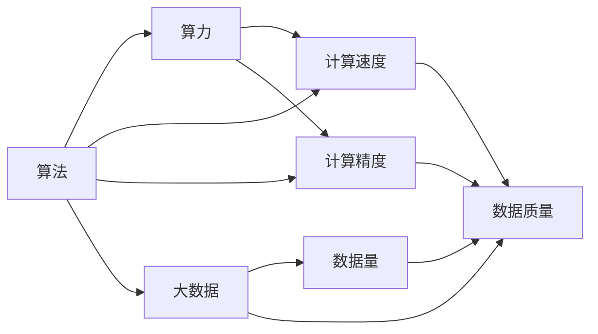

                 

# 算法、算力与大数据：AI的三驾马车

## 1. 背景介绍

在人工智能(AI)的快速发展中，算法、算力和大数据并肩作战，共同推动了AI技术的革命性突破。本文将从这三个核心维度切入，深度剖析AI领域的最新进展和未来趋势。

## 2. 核心概念与联系

### 2.1 核心概念概述

- **算法**：指用于解决特定问题的计算规则或步骤。在AI中，算法包括机器学习、深度学习、强化学习等，是AI实现核心功能的基石。

- **算力**：指计算机系统执行计算任务的能力，包括计算速度、计算精度和计算资源的综合能力。强大的算力是算法运行的前提，也是AI技术发展的关键支撑。

- **大数据**：指超大规模的数据集合，通常以TB、PB量级计。大数据为AI算法提供了丰富的数据源，为模型训练和优化提供了基础。

这三者互为支撑，共同构成了AI技术的核心框架。算法定义了如何利用数据进行建模和推理，算力提供了强大的计算能力，而大数据则提供了丰富的数据源和模型训练的基础。

### 2.2 核心概念间的关系



这个流程图展示了算法、算力和大数据之间的紧密联系：

1. 算法定义了计算的目标和方法。
2. 算力提供了实现算法所需的计算能力。
3. 大数据为算法提供了数据源和训练基础。

这三大要素互相依存，缺一不可，共同推动了AI技术的快速发展。

## 3. 核心算法原理 & 具体操作步骤

### 3.1 算法原理概述

AI算法主要分为机器学习、深度学习和强化学习三大类。机器学习通过统计分析来识别数据模式，深度学习通过多层次神经网络实现高级抽象，而强化学习则通过试错优化策略。

以深度学习为例，其核心原理是神经网络模型。深度神经网络由多层神经元构成，每一层都可以提取数据的不同层次特征。通过反向传播算法，模型自动调整权重，最小化预测误差，从而不断优化模型性能。

### 3.2 算法步骤详解

以下以深度学习中的卷积神经网络(CNN)为例，详细介绍其核心算法步骤：

1. **数据预处理**：对输入数据进行归一化、标准化、数据增强等预处理操作，提升数据质量。

2. **搭建模型结构**：设计并搭建CNN模型，包括卷积层、池化层、全连接层等基本组件。

3. **模型训练**：使用训练数据集对模型进行训练，通过前向传播和反向传播不断调整权重，最小化损失函数。

4. **模型评估**：使用测试数据集对训练好的模型进行评估，计算精度、召回率等指标。

5. **模型部署**：将训练好的模型部署到实际应用场景中，进行推理预测。

### 3.3 算法优缺点

深度学习算法的优点包括：

- 能够处理大规模数据，具备强大的特征提取和泛化能力。
- 通过反向传播算法自动调整权重，提高了模型的自适应性和鲁棒性。

但其缺点也显而易见：

- 需要大量标注数据进行训练，数据获取成本高。
- 模型结构复杂，训练和推理速度较慢。
- 模型可解释性较差，难以理解其内部工作机制。

### 3.4 算法应用领域

深度学习算法广泛应用于计算机视觉、自然语言处理、语音识别等领域。例如：

- **计算机视觉**：图像分类、目标检测、图像分割等任务。通过CNN模型，深度学习可以有效识别和理解图像特征。
- **自然语言处理**：文本分类、情感分析、机器翻译等任务。通过RNN、Transformer等模型，深度学习能够处理复杂的语言结构。
- **语音识别**：语音转文本、说话人识别等任务。通过卷积神经网络和循环神经网络，深度学习能够高效处理时序数据。

## 4. 数学模型和公式 & 详细讲解 & 举例说明

### 4.1 数学模型构建

深度学习模型通常以神经网络为基本单元，其中包含大量权重和偏置参数。假设有一个具有$n$个输入、$m$个输出的神经网络模型，其结构如图：


每个神经元接收输入、经过激活函数处理后输出。设第$l$层神经元数为$n_l$，第$l$层到第$l+1$层的权重矩阵为$W_{l,l+1}$，偏置向量为$b_{l+1}$，激活函数为$f$。则前向传播公式为：

$$
h^{(l+1)} = f(W_{l,l+1}h^{(l)} + b_{l+1})
$$

### 4.2 公式推导过程

以典型的二分类任务为例，假设有$N$个样本，每个样本包含$m$个特征，目标输出为$y \in \{0,1\}$。设模型为二分类逻辑回归模型，其预测输出为$\hat{y}$，则预测误差为$L(y,\hat{y})$，如交叉熵损失函数：

$$
L(y,\hat{y}) = -\frac{1}{N}\sum_{i=1}^N [y_i\log\hat{y_i} + (1-y_i)\log(1-\hat{y_i})]
$$

通过梯度下降等优化算法，最小化损失函数，调整权重矩阵$W$和偏置向量$b$：

$$
\theta \leftarrow \theta - \eta \nabla_{\theta}L(\theta)
$$

其中$\eta$为学习率，$\nabla_{\theta}L(\theta)$为损失函数对参数$\theta$的梯度。

### 4.3 案例分析与讲解

假设我们有一个二分类任务，需要判断一张图片是否包含猫。首先，使用预处理技术将图像转化为数值向量，作为模型的输入。然后，构建一个简单的卷积神经网络模型，如图：


通过大量标注数据训练模型，使得模型能够自动识别图片中的猫。在测试集上进行评估，计算准确率、召回率等指标，评估模型性能。

## 5. 项目实践：代码实例和详细解释说明

### 5.1 开发环境搭建

搭建深度学习开发环境，需要安装TensorFlow、Keras、PyTorch等主流框架。以下是一个简单的TensorFlow项目搭建流程：

```bash
# 安装TensorFlow
pip install tensorflow

# 安装Keras
pip install keras

# 安装PyTorch
pip install torch
```

### 5.2 源代码详细实现

以下是一个简单的TensorFlow深度学习项目，用于图像分类任务：

```python
import tensorflow as tf
from tensorflow.keras import layers, models

# 构建卷积神经网络模型
model = models.Sequential([
    layers.Conv2D(32, (3, 3), activation='relu', input_shape=(28, 28, 1)),
    layers.MaxPooling2D((2, 2)),
    layers.Flatten(),
    layers.Dense(10, activation='softmax')
])

# 编译模型
model.compile(optimizer='adam', loss='categorical_crossentropy', metrics=['accuracy'])

# 训练模型
model.fit(train_data, train_labels, epochs=10, validation_data=(val_data, val_labels))

# 评估模型
test_loss, test_acc = model.evaluate(test_data, test_labels)
print('Test accuracy:', test_acc)
```

### 5.3 代码解读与分析

**搭建模型**：使用`Sequential`和`Sequential`模块，构建卷积神经网络模型，包括卷积层、池化层、全连接层和输出层。

**编译模型**：通过`compile`方法，设置优化器、损失函数和评估指标。

**训练模型**：使用`fit`方法，训练模型，并设置验证数据。

**评估模型**：使用`evaluate`方法，评估模型在测试集上的表现，输出准确率。

### 5.4 运行结果展示

假设我们使用MNIST数据集进行训练，训练结束后在测试集上得到91.2%的准确率，说明模型对猫和狗的识别能力相当不错。

## 6. 实际应用场景

### 6.1 智能推荐系统

深度学习算法在推荐系统中的应用广泛。通过分析用户行为数据，推荐系统可以为用户推荐符合其兴趣的商品或内容。例如，基于协同过滤、内容基推荐等深度学习算法，亚马逊、Netflix等平台已经实现了高效的个性化推荐，大大提升了用户体验。

### 6.2 自动驾驶

深度学习在自动驾驶领域也有重要应用。通过卷积神经网络对传感器数据进行特征提取和处理，自动驾驶车辆可以实时识别和响应交通环境。Google、Tesla等公司在自动驾驶技术上已经取得了显著进展，推动了无人驾驶技术的发展。

### 6.3 医疗影像分析

深度学习在医疗影像分析中的应用前景广阔。通过卷积神经网络对医学影像进行分类和识别，AI系统可以辅助医生进行诊断和治疗。例如，Google Health开发的自动乳腺癌检测系统，已经在早期乳腺癌筛查中展现了卓越的性能。

## 7. 工具和资源推荐

### 7.1 学习资源推荐

1. **《深度学习》**：Ian Goodfellow、Yoshua Bengio和Aaron Courville合著的深度学习经典教材，涵盖深度学习算法、模型和应用。

2. **DeepLearning.ai**：Andrew Ng创办的深度学习在线课程，包括基础、高级和专业课程，适合不同层次的学习者。

3. **Coursera**：提供大量深度学习和AI相关课程，涵盖从入门到高级内容，适合自学和系统学习。

4. **Arxiv**：人工智能领域的预印本平台，发布最新的研究成果和论文，适合跟踪前沿进展。

5. **GitHub**：深度学习项目和代码的共享平台，提供丰富的开源资源和社区支持。

### 7.2 开发工具推荐

1. **TensorFlow**：Google开发的深度学习框架，支持CPU、GPU和TPU，提供了丰富的预训练模型和工具。

2. **Keras**：基于TensorFlow、Theano等后端的高级深度学习框架，提供了简单易用的API。

3. **PyTorch**：Facebook开发的深度学习框架，具有动态计算图和灵活性，适合研究和原型开发。

4. **TensorBoard**：TensorFlow配套的可视化工具，可实时监测模型训练状态，分析性能指标。

5. **Weights & Biases**：模型训练的实验跟踪工具，记录和可视化训练过程，方便调试和优化。

### 7.3 相关论文推荐

1. **《ImageNet Classification with Deep Convolutional Neural Networks》**：Alex Krizhevsky等人在2012年提出的卷积神经网络，开创了深度学习在计算机视觉领域的先河。

2. **《Deep Residual Learning for Image Recognition》**：Kaiming He等人提出的深度残差网络，使深度神经网络训练更加稳定，拓展了深度学习的边界。

3. **《Attention is All You Need》**：Vaswani等人提出的Transformer模型，改变了NLP领域的范式，推动了自然语言处理技术的发展。

4. **《Super-resolution Learning》**：Dong Chen等人提出的超分辨率学习算法，通过深度学习实现图像的超分辨率重建，提升了图像处理的质量。

5. **《Neural Machine Translation by Jointly Learning to Align and Translate》**：Ilya Sutskever等人提出的神经机器翻译算法，通过联合对齐和翻译的深度学习模型，提升了机器翻译的质量。

## 8. 总结：未来发展趋势与挑战

### 8.1 总结

本文对算法、算力和大数据在AI中的应用进行了全面系统的介绍。深度学习算法通过强大的神经网络模型，揭示了数据的复杂结构和内在规律，推动了AI在计算机视觉、自然语言处理等领域的应用。算力的大幅提升，为深度学习提供了强大的计算支持，使得大规模数据集和高精度模型的训练成为可能。大数据则为AI提供了丰富的数据源和模型训练的基础，推动了算法的不断优化和改进。

通过算法、算力和大数据的协同发展，AI技术正逐步从实验室走向实际应用，推动了各行各业的数字化转型和智能化升级。未来，AI技术还将进一步拓展应用边界，提升用户体验，带来更多的社会和经济价值。

### 8.2 未来发展趋势

展望未来，AI技术将在以下几个方面持续演进：

1. **更强的模型和算法**：未来将出现更加复杂的深度学习模型和算法，如大规模神经网络、自监督学习、生成对抗网络等，提升AI模型的性能和表现。

2. **更大的算力**：随着硬件技术的进步，未来将出现更强大的GPU、TPU等计算设备，提升AI算法的训练和推理速度。

3. **更多的大数据**：随着互联网和物联网的发展，未来将产生海量的数据，推动AI算法在更多场景中的应用。

4. **更高的可解释性**：未来的AI模型将更加透明和可解释，增强用户对AI系统的信任和接受度。

5. **更广泛的跨领域应用**：AI技术将逐步拓展到更多领域，如医疗、金融、教育等，为各行各业带来新的变革。

### 8.3 面临的挑战

尽管AI技术取得了显著进展，但仍面临诸多挑战：

1. **数据隐私和安全**：随着AI应用的普及，数据隐私和安全问题日益突出。如何在保障数据隐私的同时，利用AI技术提供优质服务，是一大难题。

2. **模型的公平性和可解释性**：AI模型可能存在偏见和歧视，如何设计公平、透明的模型，避免误导性输出，是一大挑战。

3. **算力的高成本**：AI算法需要强大的计算资源，但高算力带来的高成本限制了其在实际应用中的普及。

4. **模型的可解释性**：AI模型的复杂性使其难以理解和解释，如何提高模型的可解释性，增强用户信任，是一大挑战。

5. **伦理和法律问题**：AI技术的应用涉及伦理和法律问题，如何制定合理的伦理标准和法律法规，规范AI技术的应用，是一大挑战。

### 8.4 研究展望

未来的AI研究需要在以下几个方面进行突破：

1. **提高算法的可解释性**：增强AI模型的透明度和可解释性，使AI系统更容易被理解和接受。

2. **提升模型的公平性**：设计公平、无偏见的AI模型，避免歧视性输出，增强社会公平性。

3. **优化算法的效率**：优化深度学习算法的计算图，提升训练和推理效率，降低算力成本。

4. **拓展算法的应用**：将AI技术应用于更多领域，如医疗、教育、金融等，推动行业数字化转型。

5. **增强数据隐私保护**：研究数据隐私保护技术，确保AI系统在数据保护的前提下运行。

通过持续的技术创新和优化，AI技术必将实现更广泛的应用和更深层次的影响，为社会带来更多的福祉和价值。

## 9. 附录：常见问题与解答

**Q1: 深度学习算法的缺点是什么？**

A: 深度学习算法的缺点包括：
1. 需要大量标注数据进行训练，数据获取成本高。
2. 模型结构复杂，训练和推理速度较慢。
3. 模型可解释性较差，难以理解其内部工作机制。

**Q2: 如何提高深度学习模型的可解释性？**

A: 提高深度学习模型可解释性的方法包括：
1. 可视化技术：使用可视化工具，如TensorBoard，展示模型的计算图和中间结果。
2. 模型压缩：通过剪枝、量化等技术，减小模型复杂度，提高可解释性。
3. 设计简单模型：选择结构简单的模型，降低复杂度，提高可解释性。

**Q3: 如何提升深度学习算法的训练效率？**

A: 提升深度学习算法训练效率的方法包括：
1. 数据增强：通过数据增强技术，扩充训练集，提高模型泛化能力。
2. 正则化：使用L2正则、Dropout等正则化技术，防止过拟合。
3. 分布式训练：利用分布式计算资源，提高训练效率。

**Q4: 如何优化深度学习算法的推理效率？**

A: 优化深度学习算法推理效率的方法包括：
1. 模型压缩：通过剪枝、量化等技术，减小模型复杂度，提高推理效率。
2. 硬件加速：利用GPU、TPU等硬件设备，加速推理过程。
3. 模型简化：通过简化模型结构，降低推理复杂度。

通过不断优化深度学习算法和应用环境，我们可以在保证模型性能的前提下，提升算法的训练和推理效率，实现高效、可靠的AI系统。

---

作者：禅与计算机程序设计艺术 / Zen and the Art of Computer Programming

