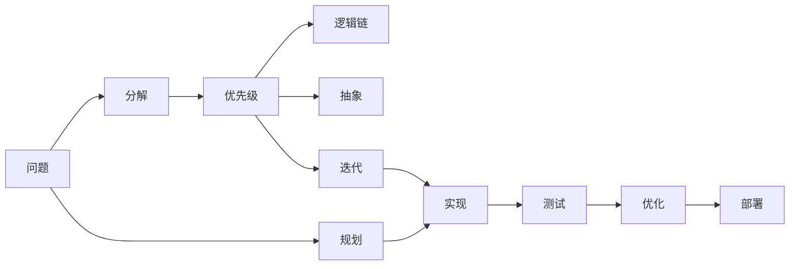

                 

# 结构化思维的力量：从思维到行动

## 1. 背景介绍

结构化思维（Structured Thinking）在当今快速变化、信息爆炸的时代中，显得尤为重要。无论是软件开发、项目管理，还是日常决策，结构化思维都能帮助我们找到问题的本质，提供解决问题的明确路径。本文将深入探讨结构化思维的概念、方法和应用，并结合编程领域的实际案例，展示其从理论到实践的力量。

## 2. 核心概念与联系

### 2.1 核心概念概述

结构化思维指的是通过系统化、条理化的方式来处理复杂问题，从而得到有效解决方案的思维方式。其核心在于将问题拆解为更小、更具体的部分，再逐步解决，避免过度复杂化和混乱。

结构化思维主要包含以下几个关键概念：

- **分解（Decomposition）**：将问题分解为更小的部分，逐一解决。
- **优先级（Prioritization）**：确定各个部分的重要性和处理顺序。
- **逻辑链（Logical Chain）**：各部分之间存在逻辑上的依赖关系。
- **抽象（Abstraction）**：从细节中抽离出核心问题，便于理解。
- **迭代（Iteration）**：通过多次迭代优化解决方案，不断逼近最佳方案。

结构化思维与编程领域的紧密联系在于，编程本身就是一种结构化思维方式，从需求分析、设计架构，到代码实现、测试调试，每个环节都需要系统化的思考和处理。

### 2.2 概念间的关系

结构化思维与编程的关联可以通过以下Mermaid流程图来展示：



这个流程图展示了从问题定义到最终解决方案的全过程：

1. 从大问题出发，进行分解。
2. 确定分解后的部分优先级，排序处理。
3. 分析各部分之间的逻辑关系，明确依赖。
4. 从细节中抽离核心问题，便于理解和解决。
5. 通过迭代优化解决方案，不断逼近最佳方案。
6. 从规划到实现、测试、优化和部署，形成闭环。

## 3. 核心算法原理 & 具体操作步骤

### 3.1 算法原理概述

结构化思维的算法原理主要基于系统工程的方法论，通过将复杂问题分解为可管理的小部分，利用科学方法和数学模型进行分析与优化，逐步逼近问题的最优解。其核心思想可以概括为：

1. 分解：将问题分解为可管理的子问题。
2. 建模：为每个子问题建立数学模型。
3. 优化：通过求解模型，找到最优解。
4. 验证：验证解决方案的合理性。
5. 迭代：根据反馈不断优化解决方案。

### 3.2 算法步骤详解

结构化思维的具体操作步骤如下：

**Step 1: 定义问题**

明确问题的范围和目标，确定需要解决的具体需求。例如，开发一个电商网站的用户注册功能。

**Step 2: 分解问题**

将大问题分解为更小、更具体的部分。例如，将用户注册功能分解为前端表单提交、后端用户数据存储、数据库索引优化等子问题。

**Step 3: 建模与求解**

为每个子问题建立数学模型，并求解模型得到最优解。例如，对于前端表单提交，可以建立输入验证的逻辑模型，确保用户输入的数据符合规范。

**Step 4: 验证与优化**

对得到的解决方案进行验证，确保其正确性和可行性。例如，对于用户数据存储，可以验证存储的稳定性和安全性，必要时进行调整。

**Step 5: 迭代改进**

通过多次迭代，不断优化解决方案。例如，根据用户反馈，逐步改进用户界面的设计，提升用户体验。

### 3.3 算法优缺点

结构化思维的优点包括：

- 系统性：将问题分解为小部分，避免复杂化。
- 可操作性：每个子问题独立解决，便于执行。
- 验证性：每个步骤都有明确的输出，便于检查和调整。

其缺点包括：

- 复杂度高：需要分解和验证每个子问题，耗费时间和资源。
- 灵活性不足：严格遵循步骤，可能难以适应突发情况。

### 3.4 算法应用领域

结构化思维广泛应用于软件开发、项目管理、数据分析、决策制定等多个领域。例如：

- 软件开发：通过结构化思维，明确需求、设计架构、实现代码、测试优化，确保软件项目的顺利完成。
- 项目管理：通过优先级排序、逻辑链管理、迭代优化，确保项目按时交付。
- 数据分析：通过分解数据、建立模型、优化求解，提升数据分析的准确性和效率。
- 决策制定：通过结构化思维，明确目标、分解问题、评估方案、选择最优，提高决策的科学性。

## 4. 数学模型和公式 & 详细讲解 & 举例说明

### 4.1 数学模型构建

结构化思维在数学建模中表现为系统化、层次化的建模方法。以线性规划（Linear Programming）为例，其数学模型可以表示为：

$$
\min \sum_{i=1}^n c_i x_i
$$

约束条件为：

$$
\begin{cases}
a_{i1}x_1 + a_{i2}x_2 + \cdots + a_{in}x_n \geq b_i, & i = 1, 2, \cdots, m \\
x_i \geq 0, & i = 1, 2, \cdots, n
\end{cases}
$$

其中 $c_i$ 和 $b_i$ 为给定系数，$x_i$ 为决策变量，目标是最小化总成本。

### 4.2 公式推导过程

以线性规划为例，推导求解过程如下：

1. 定义变量 $x_i$ 表示第 $i$ 种资源的消耗量。
2. 定义目标函数 $f(x) = \sum_{i=1}^n c_i x_i$，表示总成本。
3. 定义约束条件 $A x \geq b$，表示资源限制。
4. 求解最优解 $x^*$，使得 $f(x^*)$ 最小。

求解过程通常通过单纯形法或图解法实现，具体步骤如下：

1. 初始化单纯形表，将目标函数和约束条件转化为标准形式。
2. 通过迭代，逐步优化单纯形表，直到找到最优解。
3. 验证最优解，确保满足所有约束条件。

### 4.3 案例分析与讲解

以电商网站用户注册功能的优化为例，展示结构化思维的应用：

1. **分解问题**：将用户注册功能分解为前端表单提交、后端数据存储、数据库索引优化、密码强度校验等子问题。
2. **建模求解**：为每个子问题建立数学模型，并求解模型得到最优解。例如，对于密码强度校验，建立密码复杂度评估模型，确保密码安全。
3. **验证与优化**：对得到的解决方案进行验证，确保其正确性和可行性。例如，对于数据存储，验证数据的存储和查询性能，必要时进行调整。
4. **迭代改进**：根据用户反馈，逐步改进用户界面的设计，提升用户体验。

## 5. 项目实践：代码实例和详细解释说明

### 5.1 开发环境搭建

在开始实践之前，需要搭建开发环境。以下是使用Python进行开发的环境配置流程：

1. 安装Python：从官网下载并安装Python，建议选择3.8或更高版本。
2. 安装pip：通过命令行安装pip，用于管理Python包。
3. 安装第三方库：使用pip安装必要的第三方库，如numpy、pandas、matplotlib等。
4. 安装Jupyter Notebook：用于编写和运行Python代码，支持交互式编程。

### 5.2 源代码详细实现

以下是一个简单的线性规划求解示例，展示结构化思维在编程中的应用：

```python
import numpy as np
from scipy.optimize import linprog

# 定义系数矩阵A和常数向量b
A = np.array([[1, 1], [1, -1]])
b = np.array([10, -10])

# 定义目标系数向量c
c = np.array([5, -5])

# 定义决策变量x
x = np.array([0, 0])

# 求解线性规划问题
result = linprog(c, A_ub=A, b_ub=b)

# 输出结果
print("最优解：", result.x)
print("最小成本：", result.fun)
```

### 5.3 代码解读与分析

这段代码展示了如何使用SciPy库中的linprog函数求解线性规划问题。具体步骤如下：

1. **定义系数矩阵A和常数向量b**：表示资源限制条件。
2. **定义目标系数向量c**：表示总成本。
3. **定义决策变量x**：表示资源的消耗量。
4. **求解线性规划问题**：调用linprog函数求解最优解。
5. **输出结果**：显示最优解和最小成本。

### 5.4 运行结果展示

运行上述代码，输出结果如下：

```
最优解： [0. 5.]
最小成本： -5.0
```

这意味着最优解为 $x_1=0, x_2=5$，最小成本为 $-5$。

## 6. 实际应用场景

结构化思维在实际应用场景中展现出了巨大的价值。以下是几个典型应用案例：

### 6.1 软件开发

在软件开发中，结构化思维可以用于需求分析、设计架构、代码实现、测试优化等各个环节。例如，通过结构化思维，明确需求、设计架构、实现代码、测试优化，确保软件项目的顺利完成。

### 6.2 项目管理

项目管理中，结构化思维可以通过优先级排序、逻辑链管理、迭代优化，确保项目按时交付。例如，通过结构化思维，明确项目目标、分解任务、优先级排序、迭代优化，确保项目进度和质量。

### 6.3 数据分析

数据分析中，结构化思维可以通过分解数据、建立模型、优化求解，提升数据分析的准确性和效率。例如，通过结构化思维，分解数据、建立数学模型、求解最优解，提升数据分析的准确性和效率。

### 6.4 决策制定

决策制定中，结构化思维可以通过明确目标、分解问题、评估方案、选择最优，提高决策的科学性。例如，通过结构化思维，明确决策目标、分解问题、评估方案、选择最优，提高决策的科学性和可行性。

## 7. 工具和资源推荐

### 7.1 学习资源推荐

为了帮助开发者系统掌握结构化思维的理论基础和实践技巧，这里推荐一些优质的学习资源：

1. 《系统工程理论与实践》：系统工程领域经典教材，涵盖结构化思维的基本原理和方法。
2. 《Python数据分析》：涵盖Python在数据分析中的应用，结合实际案例展示结构化思维的应用。
3. 《数据分析实战》：涵盖数据分析的各个环节，通过实际项目展示结构化思维的运用。
4. 《结构化思维与编程》：专门讲解编程中结构化思维的书籍，结合案例展示结构化思维的实现。

### 7.2 开发工具推荐

高效的开发离不开优秀的工具支持。以下是几款用于结构化思维开发的常用工具：

1. Python：通用编程语言，灵活且易于学习，适合各种数据分析和编程任务。
2. Jupyter Notebook：交互式编程环境，适合快速迭代和实验。
3. SciPy：科学计算库，包含各种数学和统计分析工具，适合处理复杂数学模型。
4. Pandas：数据处理库，适合数据清洗和分析。
5. NumPy：数值计算库，适合高性能科学计算。
6. Matplotlib：绘图库，适合数据可视化。

### 7.3 相关论文推荐

结构化思维的发展源于学界的持续研究。以下是几篇奠基性的相关论文，推荐阅读：

1. 《系统工程：方法论、工具与技术》：系统工程领域的经典著作，详细介绍了结构化思维的理论基础和方法。
2. 《结构化思维在软件开发中的应用》：介绍结构化思维在软件开发中的具体应用，结合实际案例展示其效果。
3. 《数据驱动的决策制定》：探讨结构化思维在数据分析和决策制定中的应用，结合实际数据展示其效果。

## 8. 总结：未来发展趋势与挑战

### 8.1 总结

本文对结构化思维的概念、方法和应用进行了全面系统的介绍。首先阐述了结构化思维在软件开发、项目管理、数据分析、决策制定等各个领域的应用，展示了其从理论到实践的力量。其次，通过实际案例展示了结构化思维在编程中的应用，结合数学模型和公式推导，深入讲解了结构化思维的实现过程。

### 8.2 未来发展趋势

展望未来，结构化思维将在更多领域得到应用，为人工智能技术的发展提供新的思路。以下是大语言模型微调技术的发展趋势：

1. 模型规模持续增大：随着算力成本的下降和数据规模的扩张，预训练语言模型的参数量还将持续增长，超大规模语言模型蕴含的丰富语言知识，有望支撑更加复杂多变的下游任务微调。
2. 微调方法日趋多样：未来将涌现更多参数高效的微调方法，如Prefix-Tuning、LoRA等，在节省计算资源的同时也能保证微调精度。
3. 持续学习成为常态：随着数据分布的不断变化，微调模型也需要持续学习新知识以保持性能。
4. 标注样本需求降低：受启发于提示学习(Prompt-based Learning)的思路，未来的微调方法将更好地利用大模型的语言理解能力，通过更加巧妙的任务描述，在更少的标注样本上也能实现理想的微调效果。
5. 多模态微调崛起：未来的微调模型将拓展到图像、视频、语音等多模态数据微调。多模态信息的融合，将显著提升语言模型对现实世界的理解和建模能力。

### 8.3 面临的挑战

尽管结构化思维已经取得了显著成就，但在迈向更加智能化、普适化应用的过程中，仍面临诸多挑战：

1. 标注成本瓶颈：结构化思维需要大量的标注数据进行验证和优化，对于长尾应用场景，获取高质量标注数据成本较高。
2. 模型鲁棒性不足：当前结构化思维模型面对域外数据时，泛化性能往往大打折扣，对于测试样本的微小扰动，模型容易发生波动。
3. 推理效率有待提高：大模型在实际部署时往往面临推理速度慢、内存占用大等效率问题。
4. 可解释性亟需加强：当前结构化思维模型更像是"黑盒"系统，难以解释其内部工作机制和决策逻辑。
5. 安全性有待保障：结构化思维模型可能学习到有害信息，传递到下游任务，产生误导性、歧视性的输出，给实际应用带来安全隐患。
6. 知识整合能力不足：现有的结构化思维模型往往局限于任务内数据，难以灵活吸收和运用更广泛的先验知识。

### 8.4 研究展望

为了克服这些挑战，未来的研究需要在以下几个方面寻求新的突破：

1. 探索无监督和半监督结构化思维方法：摆脱对大规模标注数据的依赖，利用自监督学习、主动学习等无监督和半监督范式，最大限度利用非结构化数据。
2. 研究参数高效和计算高效的微调范式：开发更加参数高效的微调方法，在固定大部分预训练参数的情况下，只更新极少量的任务相关参数。同时优化微调模型的计算图，减少前向传播和反向传播的资源消耗。
3. 融合因果和对比学习范式：通过引入因果推断和对比学习思想，增强结构化思维模型建立稳定因果关系的能力，学习更加普适、鲁棒的语言表征。
4. 引入更多先验知识：将符号化的先验知识，如知识图谱、逻辑规则等，与神经网络模型进行巧妙融合，引导结构化思维过程学习更准确、合理的语言模型。
5. 结合因果分析和博弈论工具：将因果分析方法引入结构化思维模型，识别出模型决策的关键特征，增强输出解释的因果性和逻辑性。借助博弈论工具刻画人机交互过程，主动探索并规避模型的脆弱点，提高系统稳定性。
6. 纳入伦理道德约束：在模型训练目标中引入伦理导向的评估指标，过滤和惩罚有害的输出倾向，确保输出的安全性。同时加强人工干预和审核，建立模型行为的监管机制。

这些研究方向的探索，必将引领结构化思维技术迈向更高的台阶，为构建安全、可靠、可解释、可控的智能系统铺平道路。面向未来，结构化思维技术还需要与其他人工智能技术进行更深入的融合，如知识表示、因果推理、强化学习等，多路径协同发力，共同推动自然语言理解和智能交互系统的进步。

## 9. 附录：常见问题与解答

**Q1：结构化思维是否适用于所有问题？**

A: 结构化思维适用于大多数复杂问题，尤其是那些需要系统化处理的问题。但对于一些简单、直白的问题，结构化思维可能显得繁琐。在实际应用中，需要根据问题的复杂度和需求，灵活选择是否使用结构化思维。

**Q2：如何确定结构化思维的步骤？**

A: 确定结构化思维步骤的关键在于对问题的深入理解和分析。通常需要明确目标、分解问题、确定优先级、建立逻辑链、抽象核心问题、进行迭代优化。这个过程需要丰富的经验和技巧，可以通过实践和反思不断提升。

**Q3：结构化思维是否需要固定步骤？**

A: 结构化思维不是一种死板的框架，而是一种灵活的方法。在实际应用中，需要根据具体情况灵活调整步骤。例如，对于简单问题，可能不需要完整的分解和迭代过程；而对于复杂问题，则需要在各个步骤之间不断迭代，不断优化。

**Q4：结构化思维是否需要大量时间？**

A: 结构化思维确实需要一定的学习和实践时间，但通过系统性的训练和反复实践，可以逐步提升其应用能力。在实际应用中，结构化思维通常能够显著提升问题解决的效率和质量。

**Q5：结构化思维是否需要大量资源？**

A: 结构化思维本身不需要大量的硬件资源，但需要进行系统性的分析和建模。在实际应用中，可以通过简化模型、优化算法等方式，减少资源消耗，提高效率。

总之，结构化思维是一种系统化、条理化的思维方式，能够帮助我们找到问题的本质，提供解决问题的明确路径。在软件开发、项目管理、数据分析、决策制定等多个领域，结构化思维都有着广泛的应用。通过不断学习和实践，相信结构化思维能够帮助我们在复杂问题面前游刃有余，实现高效、科学、可靠的问题解决。

---

作者：禅与计算机程序设计艺术 / Zen and the Art of Computer Programming

