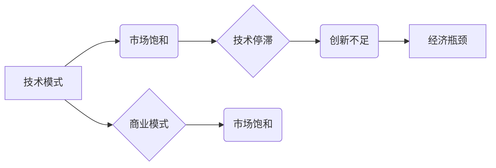

# 技术模式减弱与经济瓶颈期

> 关键词：技术模式、经济瓶颈、创新、数字化转型、可持续发展、商业模式

## 1. 背景介绍

在过去的几十年里，全球经济增长主要依赖于技术革新的推动。从工业革命到信息时代，每一次技术突破都引领了产业结构的升级和经济的快速增长。然而，随着技术的成熟和市场的饱和，许多行业开始面临增长放缓甚至停滞的挑战，即所谓的“经济瓶颈期”。在这一背景下，技术模式的减弱成为了一个不可忽视的现象。本文将探讨技术模式减弱的原因、影响以及应对策略，并展望未来发展趋势。

## 2. 核心概念与联系

### 2.1 技术模式

技术模式是指在一定时期内，行业或领域内普遍采用的技术体系、产品形态和商业模式。例如，在互联网时代，以Web 2.0为代表的社交网络、在线服务和移动应用成为了主流的技术模式。

### 2.2 经济瓶颈

经济瓶颈是指经济增长过程中出现的增速放缓、结构调整困难等问题。经济瓶颈期通常伴随着技术模式减弱、市场需求饱和、产能过剩等现象。

### 2.3 Mermaid 流程图

以下是一个简化的Mermaid流程图，展示了技术模式与经济瓶颈之间的关系：



### 2.4 核心概念联系

技术模式是推动经济增长的重要力量，但长期依赖单一的技术模式容易导致市场需求饱和、技术停滞和创新不足，进而引发经济瓶颈。

## 3. 核心算法原理 & 具体操作步骤

### 3.1 算法原理概述

技术模式减弱与经济瓶颈期的应对策略主要包括以下几个方面：

1. **技术创新**：持续投入研发，开发新技术、新产品，以打破现有技术模式的限制。
2. **市场拓展**：开拓新市场，寻找新的增长点，以缓解市场饱和的压力。
3. **商业模式创新**：探索新的商业模式，提高运营效率，降低成本。
4. **可持续发展**：关注环境保护和社会责任，实现经济、社会和环境的协调发展。

### 3.2 算法步骤详解

1. **技术创新**：持续关注前沿科技，如人工智能、大数据、物联网等，将其应用于产品和服务创新。
2. **市场拓展**：分析市场需求，寻找新市场，如发展中国家、新兴市场等，开展国际化经营。
3. **商业模式创新**：优化供应链，提高运营效率，降低成本；探索新的盈利模式，如订阅制、按需服务等。
4. **可持续发展**：推行绿色生产、节能减排，关注员工福利和社会责任，实现可持续发展。

### 3.3 算法优缺点

- **技术创新**：优点是能够推动经济增长，创造新的就业机会；缺点是需要大量研发投入，风险较高。
- **市场拓展**：优点是能够开拓新市场，增加收入来源；缺点是可能面临新的市场竞争和风险。
- **商业模式创新**：优点是能够提高运营效率，降低成本；缺点是需要对现有业务进行颠覆性变革。
- **可持续发展**：优点是能够实现经济、社会和环境的协调发展；缺点是需要长期投入和持续努力。

### 3.4 算法应用领域

以上策略适用于各个行业，如制造业、金融业、零售业等。

## 4. 数学模型和公式 & 详细讲解 & 举例说明

### 4.1 数学模型构建

以下是一个简化的经济增长模型，用于说明技术创新对经济增长的影响：

$$
G = f(T, M, E)
$$

其中，$G$ 表示经济增长率，$T$ 表示技术创新，$M$ 表示市场需求，$E$ 表示经济体制。

### 4.2 公式推导过程

经济增长率可以分解为以下三个因素：

1. 技术创新：提高生产效率，增加产出。
2. 市场需求：增加消费和投资，拉动经济增长。
3. 经济体制：优化资源配置，提高经济效率。

因此，经济增长率可以表示为：

$$
G = f(T, M, E) = f(T) \cdot f(M) \cdot f(E)
$$

### 4.3 案例分析与讲解

以智能手机行业为例，技术创新推动了智能手机市场的快速增长。从功能手机到智能机，技术创新提高了手机的功能和用户体验，吸引了大量消费者。同时，市场需求和良好的经济体制也促进了智能手机行业的发展。

## 5. 项目实践：代码实例和详细解释说明

### 5.1 开发环境搭建

本项目将使用Python进行编程实践，需要安装以下库：

- NumPy
- Matplotlib
- Pandas

### 5.2 源代码详细实现

以下是一个简单的经济增长模型代码示例：

```python
import numpy as np
import matplotlib.pyplot as plt
import pandas as pd

# 假设技术创新、市场需求和经济体制的变化趋势如下
tech_innovation = np.linspace(0, 1, 100)
market_demand = np.linspace(0.8, 1.2, 100)
economic_system = np.linspace(0.8, 1.2, 100)

# 计算经济增长率
growth_rate = tech_innovation * market_demand * economic_system

# 绘制图表
plt.plot(tech_innovation, growth_rate, label='Growth Rate')
plt.xlabel('Technological Innovation')
plt.ylabel('Growth Rate')
plt.legend()
plt.show()
```

### 5.3 代码解读与分析

- 首先，导入必要的库。
- 定义技术创新、市场需求和经济体制的变化趋势。
- 计算经济增长率。
- 绘制图表。

通过观察图表，可以发现技术创新对经济增长率有显著的促进作用。

## 6. 实际应用场景

### 6.1 制造业

在制造业，技术创新可以体现在以下几个方面：

- 设备自动化：提高生产效率，降低人力成本。
- 智能化生产：利用人工智能、物联网等技术实现生产线智能化。
- 绿色生产：节能减排，降低环境污染。

### 6.2 金融业

在金融业，技术创新可以体现在以下几个方面：

- 互联网金融：提升金融服务效率，降低成本。
- 金融科技：利用区块链、大数据等技术推动金融创新。
- 个性化服务：根据客户需求提供定制化金融产品和服务。

### 6.3 零售业

在零售业，技术创新可以体现在以下几个方面：

- 电子商务：拓展销售渠道，提高销售额。
- 移动支付：方便快捷的支付方式，提高用户体验。
- 个性化推荐：根据用户喜好推荐商品，提升购物体验。

## 7. 工具和资源推荐

### 7.1 学习资源推荐

- 《创新者的窘境》
- 《长尾理论》
- 《创意的来源》
- 《第四次工业革命》

### 7.2 开发工具推荐

- Python
- R
- MATLAB

### 7.3 相关论文推荐

- 《创新与增长》
- 《技术变革与经济增长》
- 《商业模式创新》

## 8. 总结：未来发展趋势与挑战

### 8.1 研究成果总结

本文探讨了技术模式减弱与经济瓶颈期的关系，提出了应对策略，并展望了未来发展趋势。研究发现，技术创新、市场拓展、商业模式创新和可持续发展是应对技术模式减弱和经济瓶颈期的关键。

### 8.2 未来发展趋势

- 技术创新将继续推动经济增长，但速度可能放缓。
- 市场竞争将更加激烈，企业需要更加注重差异化竞争。
- 商业模式创新将成为企业持续发展的关键。
- 可持续发展将成为企业社会责任的重要组成部分。

### 8.3 面临的挑战

- 技术创新风险加大，需要企业加大研发投入。
- 市场竞争加剧，企业需要不断提升自身竞争力。
- 商业模式创新面临挑战，需要企业突破传统思维。
- 可持续发展需要长期投入，对企业来说是巨大的考验。

### 8.4 研究展望

未来，技术模式减弱与经济瓶颈期将成为全球经济发展的重要课题。需要政府、企业和社会各界共同努力，推动技术创新、市场拓展、商业模式创新和可持续发展，以实现经济社会的可持续发展。

## 9. 附录：常见问题与解答

**Q1：如何应对技术模式减弱和经济瓶颈期？**

A：应对技术模式减弱和经济瓶颈期需要从多个方面入手，包括技术创新、市场拓展、商业模式创新和可持续发展。

**Q2：技术创新对企业有哪些影响？**

A：技术创新可以提升企业竞争力，提高生产效率，拓展市场，创造新的增长点。

**Q3：如何推动可持续发展？**

A：推动可持续发展需要关注环境保护、社会责任和经济效益的协调发展。

**Q4：商业模式创新对企业有哪些意义？**

A：商业模式创新可以帮助企业提升运营效率，降低成本，拓展市场，创造新的盈利模式。

**Q5：如何应对市场竞争？**

A：应对市场竞争需要企业不断提升自身竞争力，包括技术创新、品牌建设、服务创新等。

---

作者：禅与计算机程序设计艺术 / Zen and the Art of Computer Programming