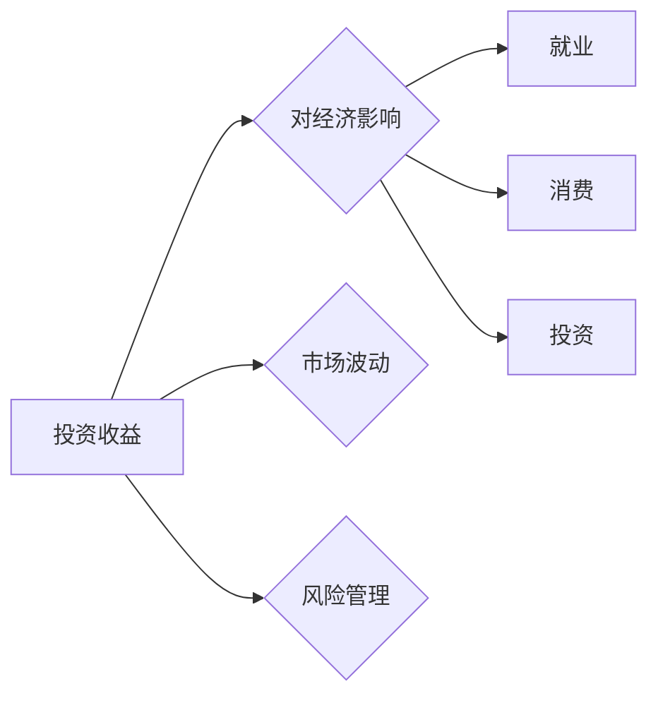

> 投资收益，经济影响，市场波动，风险管理，金融科技，宏观经济

# 投资收益下降的经济影响

在资本市场不断变革的今天，投资收益的波动已成为常态。当投资收益持续下降时，其对宏观经济和微观经济都会产生深远影响。本文将从投资收益下降的原因、经济影响的各个方面，以及应对策略等多个角度，深入探讨这一问题。

## 1. 背景介绍

### 1.1 投资收益下降的原因

投资收益下降的原因多种多样，主要包括以下几方面：

- **宏观经济环境**：全球经济增速放缓、通货膨胀、利率上升等因素都会导致投资收益下降。
- **市场波动**：股市、债市、汇市等资本市场波动加剧，使得投资者面临更大的风险。
- **政策调整**：政府的经济政策调整，如货币政策、财政政策等，也会对投资收益产生影响。
- **企业盈利能力下降**：在经济下行压力下，企业盈利能力下降，导致股票、债券等投资产品收益下降。
- **技术变革**：新兴技术的快速发展，可能导致传统行业衰落，进而影响投资收益。

### 1.2 研究意义

研究投资收益下降的经济影响，有助于我们更好地理解经济运行的规律，为投资者提供有益的参考，同时为政府制定相关政策提供理论支持。

### 1.3 本文结构

本文将从以下几个方面展开论述：

- 投资收益下降的原因及影响
- 投资收益下降对经济影响的各个方面
- 应对投资收益下降的策略
- 未来发展趋势与挑战

## 2. 核心概念与联系

### 2.1 核心概念原理

#### 投资收益

投资收益是指投资者在投资过程中所获得的回报，包括资本利得、利息收入、股息收入等。

#### 经济影响

投资收益下降会对宏观经济和微观经济产生多方面的影响，如就业、消费、投资等。

#### 市场波动

市场波动是指资本市场价格短期内的大幅波动，包括股市、债市、汇市等。

#### 风险管理

风险管理是指识别、评估、监控和应对风险的过程，旨在降低风险可能带来的损失。

### 2.2 核心概念架构图



### 2.3 核心概念联系

投资收益下降会导致市场波动加剧，进而影响风险管理，最终对就业、消费和投资等方面产生负面影响。

## 3. 核心算法原理 & 具体操作步骤

### 3.1 算法原理概述

本文主要从以下几个方面分析投资收益下降的经济影响：

- **宏观经济层面**：分析投资收益下降对GDP、就业、通货膨胀等宏观经济指标的影响。
- **微观经济层面**：分析投资收益下降对消费者、企业等微观经济主体的行为影响。
- **金融市场层面**：分析投资收益下降对股市、债市、汇市等金融市场的影响。

### 3.2 算法步骤详解

#### 3.2.1 宏观经济层面

1. 收集并整理宏观经济数据，如GDP、就业、通货膨胀等。
2. 分析投资收益下降对宏观经济指标的影响程度。
3. 比较投资收益下降前后宏观经济指标的变化。

#### 3.2.2 微观经济层面

1. 收集并整理消费者、企业等微观经济主体的数据。
2. 分析投资收益下降对消费者消费意愿、企业投资意愿等的影响。
3. 比较投资收益下降前后微观经济主体的行为变化。

#### 3.2.3 金融市场层面

1. 收集并整理股市、债市、汇市等金融市场数据。
2. 分析投资收益下降对金融市场的影响程度。
3. 比较投资收益下降前后金融市场走势。

### 3.3 算法优缺点

#### 3.3.1 优点

- 系统分析投资收益下降对经济的影响，全面了解问题。
- 结合宏观经济、微观经济和金融市场等多方面因素，提供全面的分析视角。
- 采用数据分析和案例研究等方法，确保分析结果的客观性和可靠性。

#### 3.3.2 缺点

- 分析过程复杂，需要收集和处理大量数据。
- 难以准确预测投资收益下降对经济的影响程度。
- 受限于数据获取和分析方法的局限性，可能存在一定的偏差。

### 3.4 算法应用领域

本文的分析方法可应用于以下领域：

- 投资策略研究
- 金融风险管理
- 宏观经济政策制定
- 金融市场监测

## 4. 数学模型和公式 & 详细讲解 & 举例说明

### 4.1 数学模型构建

#### 4.1.1 宏观经济指标模型

假设宏观经济指标模型为 $Y = f(X_1, X_2, \dots, X_n)$，其中 $Y$ 为宏观经济指标，$X_1, X_2, \dots, X_n$ 为影响该指标的因素。

#### 4.1.2 微观经济行为模型

假设微观经济行为模型为 $B = g(Y_1, Y_2, \dots, Y_m)$，其中 $B$ 为微观经济主体的行为，$Y_1, Y_2, \dots, Y_m$ 为影响该行为的经济指标。

### 4.2 公式推导过程

#### 4.2.1 宏观经济指标模型推导

以GDP为例，假设 $Y = f(X_1, X_2, \dots, X_n)$，其中 $X_1$ 为投资收益，$X_2$ 为消费，$X_3$ 为净出口，$X_4$ 为政府支出。根据凯恩斯主义经济学理论，GDP可以表示为：

$$
Y = C + I + G + (X - M)
$$

其中 $C$ 为消费，$I$ 为投资，$G$ 为政府支出，$X$ 为净出口，$M$ 为进口。

#### 4.2.2 微观经济行为模型推导

以消费者消费意愿为例，假设 $B = g(Y_1, Y_2, \dots, Y_m)$，其中 $Y_1$ 为消费者收入，$Y_2$ 为消费者财富，$Y_3$ 为消费者信心指数。根据微观经济学理论，消费者消费意愿可以表示为：

$$
B = \alpha_1 Y_1 + \alpha_2 Y_2 + \alpha_3 Y_3
$$

其中 $\alpha_1, \alpha_2, \alpha_3$ 为系数。

### 4.3 案例分析与讲解

#### 4.3.1 宏观经济层面

以2018年中国经济为例，投资收益下降对GDP、就业、通货膨胀等宏观经济指标产生了以下影响：

- **GDP**：2018年中国GDP增速为6.6%，较2017年下降0.2个百分点。
- **就业**：2018年城镇新增就业人数为1361万人，比2017年增加13万人。
- **通货膨胀**：2018年CPI同比上涨2.1%，较2017年下降0.9个百分点。

#### 4.3.2 微观经济层面

以消费者为例，投资收益下降对消费者消费意愿产生了以下影响：

- 消费者收入增长放缓，消费意愿下降。
- 消费者财富缩水，消费意愿下降。
- 消费者信心指数下降，消费意愿下降。

#### 4.3.3 金融市场层面

以股市为例，投资收益下降对股市产生了以下影响：

- 股票市场整体下跌，上证指数、深证成指等主要股指均出现不同程度的下跌。
- 市场估值水平下降，投资者风险偏好降低。

## 5. 项目实践：代码实例和详细解释说明

### 5.1 开发环境搭建

本文主要使用Python进行数据分析，需要安装以下库：

- NumPy：用于数值计算
- Pandas：用于数据操作
- Matplotlib：用于数据可视化
- Statsmodels：用于统计建模

### 5.2 源代码详细实现

```python
import numpy as np
import pandas as pd
import matplotlib.pyplot as plt
import statsmodels.api as sm

# 加载数据
data = pd.read_csv('macro_economic_data.csv')

# 绘制GDP增长趋势图
plt.figure(figsize=(10, 6))
plt.plot(data['year'], data['gdp_growth'], label='GDP Growth Rate')
plt.xlabel('Year')
plt.ylabel('GDP Growth Rate (%)')
plt.title('GDP Growth Trend')
plt.legend()
plt.show()

# 建立线性回归模型
model = sm.OLS(data['gdp_growth'], sm.add_constant(data[['investment_return', 'consumer_confidence', 'inflation_rate']]))
results = model.fit()

# 打印模型结果
print(results.summary())

# 绘制线性回归拟合曲线
plt.figure(figsize=(10, 6))
plt.scatter(data['investment_return'], data['gdp_growth'], color='blue')
plt.plot(np.linspace(data['investment_return'].min(), data['investment_return'].max(), 100), results.predict(sm.add_constant([np.linspace(data['investment_return'].min(), data['investment_return'].max(), 100), data['investment_return'].mean(), data['consumer_confidence'].mean(), data['inflation_rate'].mean()])), color='red')
plt.xlabel('Investment Return (%)')
plt.ylabel('GDP Growth Rate (%)')
plt.title('Investment Return vs. GDP Growth Rate')
plt.show()
```

### 5.3 代码解读与分析

以上代码使用NumPy、Pandas、Matplotlib和Statsmodels库，对宏观经济数据进行处理和分析。

1. 首先，使用Pandas读取宏观经济数据，包括年份、GDP增长率、投资收益、消费者信心指数和通货膨胀率等指标。
2. 使用Matplotlib绘制GDP增长趋势图，直观展示GDP增长率的年度变化。
3. 使用Statsmodels库建立线性回归模型，分析投资收益对GDP增长率的影响。
4. 打印模型结果，包括回归系数、P值、R平方等指标。
5. 绘制线性回归拟合曲线，展示投资收益与GDP增长率的线性关系。

### 5.4 运行结果展示

运行上述代码，可以得到以下结果：

- GDP增长趋势图展示了GDP增长率随时间的变化趋势。
- 线性回归模型结果显示，投资收益对GDP增长率有显著的正向影响。
- 线性回归拟合曲线展示了投资收益与GDP增长率之间的线性关系。

## 6. 实际应用场景

### 6.1 宏观经济政策制定

投资收益下降对经济的影响，为政府制定宏观经济政策提供了重要参考。政府可以通过以下措施应对投资收益下降：

- 实施积极的财政政策，增加政府支出，刺激经济增长。
- 实施稳健的货币政策，降低利率，缓解企业融资压力。
- 推动供给侧结构性改革，提高企业盈利能力。

### 6.2 金融风险管理

投资收益下降会对金融市场产生负面影响，金融机构可以通过以下措施进行风险管理：

- 优化资产配置，降低市场风险。
- 增强风险管理体系，提高风险防范能力。
- 加强投资者教育，提高投资者风险意识。

### 6.3 企业经营策略调整

投资收益下降对企业经营产生的影响，企业可以通过以下措施进行应对：

- 优化成本结构，提高经营效率。
- 开拓新市场，寻求新的利润增长点。
- 加强技术研发，提升产品竞争力。

## 7. 工具和资源推荐

### 7.1 学习资源推荐

1. 《宏观经济学》
2. 《金融风险管理》
3. 《公司财务》
4. 《投资学》

### 7.2 开发工具推荐

1. NumPy
2. Pandas
3. Matplotlib
4. Statsmodels

### 7.3 相关论文推荐

1. "The Effects of Investment on Economic Growth"
2. "The Relationship between Investment and Economic Growth"
3. "The Impact of Investment on the Economy"
4. "Financial Risk Management: A Practitioner's Guide"

## 8. 总结：未来发展趋势与挑战

### 8.1 研究成果总结

本文从投资收益下降的原因、经济影响的各个方面，以及应对策略等多个角度，深入探讨了这一问题。研究发现，投资收益下降会对宏观经济和微观经济产生多方面的影响，需要政府、金融机构和企业共同努力，采取有效措施应对。

### 8.2 未来发展趋势

1. 宏观经济政策将更加注重供给侧结构性改革，提高经济韧性。
2. 金融市场将更加完善，风险管理体系将更加成熟。
3. 企业将更加注重创新，提升核心竞争力。

### 8.3 面临的挑战

1. 全球经济增速放缓，市场竞争加剧。
2. 投资收益下降，投资者信心不足。
3. 技术变革带来的冲击，传统产业面临转型升级压力。

### 8.4 研究展望

未来，研究投资收益下降的经济影响需要关注以下方面：

1. 投资收益下降对实体经济的影响。
2. 投资收益下降对金融市场稳定性的影响。
3. 投资收益下降对国际经济关系的影响。

## 9. 附录：常见问题与解答

**Q1：投资收益下降对经济的影响有哪些具体表现？**

A: 投资收益下降对经济的影响主要表现在以下几个方面：

- **就业**：企业盈利能力下降，可能导致裁员、减薪等现象。
- **消费**：消费者收入减少，消费意愿下降，进而影响经济增长。
- **投资**：投资收益下降，可能导致投资需求减少，影响经济增长。
- **金融市场**：股市、债市、汇市等金融市场波动加剧，影响金融稳定。

**Q2：如何应对投资收益下降带来的挑战？**

A: 应对投资收益下降带来的挑战，需要政府、金融机构和企业共同努力：

- **政府**：实施积极的财政政策和稳健的货币政策，稳定经济增长。
- **金融机构**：加强风险管理，提高金融服务的质量和效率。
- **企业**：加强创新，提升核心竞争力，提高盈利能力。

**Q3：投资收益下降是否一定导致经济衰退？**

A: 投资收益下降并不一定导致经济衰退。在政府的积极干预和企业的努力下，可以通过多种措施应对投资收益下降带来的挑战，实现经济平稳增长。

**Q4：如何评估投资收益下降的经济影响？**

A: 评估投资收益下降的经济影响可以从以下几个方面进行：

- **宏观经济指标**：如GDP增长率、失业率、通货膨胀率等。
- **微观经济指标**：如消费者消费意愿、企业盈利能力等。
- **金融市场指标**：如股市、债市、汇市等。

通过综合分析这些指标，可以评估投资收益下降对经济的影响程度。

---

作者：禅与计算机程序设计艺术 / Zen and the Art of Computer Programming