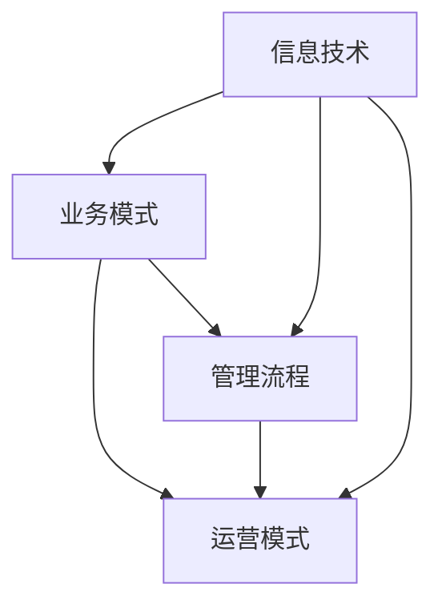

# 数字化转型的趋势、技术和应用

> 关键词：数字化转型，企业转型，信息技术，人工智能，云计算，大数据，物联网，区块链，业务流程优化，用户体验

## 1. 背景介绍

在当今全球化的经济环境中，数字化转型已经成为企业提升竞争力、实现可持续发展的关键。随着信息技术的飞速发展，企业面临着前所未有的机遇和挑战。本文将深入探讨数字化转型的趋势、技术和应用，为企业在数字化时代找到合适的转型路径提供参考。

### 1.1 数字化转型的由来

数字化转型的概念最早源于20世纪90年代的IT革命。当时，互联网的兴起催生了电子商务、在线服务等新业态，企业开始意识到信息技术对业务发展的重要性。随着云计算、大数据、人工智能等新技术的不断涌现，数字化转型逐渐成为企业战略的核心。

### 1.2 数字化转型的意义

数字化转型不仅能够帮助企业降低成本、提高效率，还能提升用户体验、增强客户粘性，从而在激烈的市场竞争中脱颖而出。以下是数字化转型的一些主要意义：

- **提升企业竞争力**：通过数字化转型，企业可以优化业务流程、提高运营效率，从而在成本和效率上占据优势。
- **创造新的商业模式**：数字化转型可以激发企业创新，催生新的商业模式，为企业带来新的增长点。
- **提升用户体验**：通过数字化转型，企业可以提供更加便捷、个性化的服务，提升客户满意度。
- **增强企业韧性**：数字化转型可以帮助企业更好地应对市场变化和风险，提升企业的韧性。

### 1.3 本文结构

本文将围绕以下内容展开：

- 2. 核心概念与联系
- 3. 核心算法原理 & 具体操作步骤
- 4. 数学模型和公式 & 详细讲解 & 举例说明
- 5. 项目实践：代码实例和详细解释说明
- 6. 实际应用场景
- 7. 工具和资源推荐
- 8. 总结：未来发展趋势与挑战

## 2. 核心概念与联系

数字化转型的核心在于利用信息技术推动企业业务模式、管理流程和运营模式的变革。以下是数字化转型中的一些关键概念及其相互联系：



- **业务模式**：企业如何创造、传递和捕获价值，包括收入来源、产品或服务、市场定位等。
- **管理流程**：企业内部的组织架构、决策机制、流程优化等。
- **运营模式**：企业如何进行日常运营，包括生产、供应链、销售、服务等。
- **信息技术**：数字化转型的驱动力，包括云计算、大数据、人工智能等。

## 3. 核心算法原理 & 具体操作步骤

### 3.1 算法原理概述

数字化转型涉及多种信息技术和算法原理，以下是其中一些核心算法原理：

- **云计算**：通过虚拟化技术，将计算资源池化，实现按需分配和弹性扩展。
- **大数据**：通过数据采集、存储、处理和分析，挖掘数据价值，为企业决策提供支持。
- **人工智能**：利用机器学习、深度学习等技术，实现智能识别、推理和决策。
- **物联网**：通过传感器、控制器、执行器等设备，实现物体间的智能互联和协同工作。
- **区块链**：通过分布式账本技术，实现数据的安全存储和不可篡改。

### 3.2 算法步骤详解

数字化转型是一个复杂的系统工程，通常包括以下步骤：

1. **需求分析**：明确数字化转型目标，分析现有业务流程和运营模式，确定改进方向。
2. **技术选型**：根据业务需求，选择合适的云计算、大数据、人工智能等关键技术。
3. **系统设计**：设计数字化转型的技术架构，包括硬件、软件、数据等要素。
4. **实施部署**：根据系统设计，进行软件开发、硬件部署、数据迁移等。
5. **运营维护**：对数字化系统进行监控、维护和升级，确保系统稳定运行。

### 3.3 算法优缺点

数字化转型涉及多种技术和算法，每种技术都有其优缺点：

- **云计算**：优点是资源弹性、按需付费、降低IT成本；缺点是数据安全问题、依赖第三方服务。
- **大数据**：优点是数据价值挖掘、业务洞察、决策支持；缺点是数据质量、数据安全、数据处理能力。
- **人工智能**：优点是智能识别、推理、决策、自动化；缺点是算法偏见、数据依赖、模型可解释性。
- **物联网**：优点是智能互联、协同工作、设备管理；缺点是设备安全、数据隐私、网络连接。

### 3.4 算法应用领域

数字化转型技术广泛应用于各个行业，以下是部分应用领域：

- **制造业**：智能制造、工业互联网、供应链优化。
- **金融业**：智能投顾、风险控制、反欺诈。
- **零售业**：电子商务、客户关系管理、供应链管理。
- **医疗健康**：远程医疗、健康管理、药物研发。
- **教育**：在线教育、智能教学、学习分析。

## 4. 数学模型和公式 & 详细讲解 & 举例说明

### 4.1 数学模型构建

数字化转型中的数学模型主要涉及以下几个方面：

- **回归分析**：用于预测和解释变量之间的关系。
- **聚类分析**：用于将数据分组，发现数据中的模式。
- **决策树**：用于分类和回归任务，通过树状结构进行决策。

### 4.2 公式推导过程

以回归分析为例，以下是线性回归的公式推导过程：

假设我们有 $N$ 个样本 $(x_1, y_1), (x_2, y_2), ..., (x_N, y_N)$，其中 $x_i$ 为自变量，$y_i$ 为因变量。线性回归模型可以表示为：

$$
y_i = \beta_0 + \beta_1x_i + \epsilon_i
$$

其中 $\beta_0$ 为截距，$\beta_1$ 为斜率，$\epsilon_i$ 为误差项。

为了最小化误差平方和，我们需要求解以下优化问题：

$$
\min_{\beta_0, \beta_1} \sum_{i=1}^N (y_i - (\beta_0 + \beta_1x_i))^2
$$

通过对上述公式进行求导和求解，可以得到线性回归模型的参数：

$$
\beta_0 = \frac{1}{N}\sum_{i=1}^N (y_i - \beta_1x_i)
$$

$$
\beta_1 = \frac{1}{N}\sum_{i=1}^N [(y_i - \beta_0 - \beta_1x_i)x_i]
$$

### 4.3 案例分析与讲解

以下是一个使用线性回归进行预测的案例：

假设某电商平台的销售数据如下表所示：

| 月份 | 销售额 |
| ---- | ------ |
| 1    | 200    |
| 2    | 220    |
| 3    | 240    |
| 4    | 260    |
| 5    | 300    |
| 6    | 340    |
| 7    | 380    |
| 8    | 420    |
| 9    | 460    |
| 10   | 500    |
| 11   | 540    |
| 12   | 580    |

我们使用月份作为自变量，销售额作为因变量，通过线性回归模型进行预测。以下是使用Python进行线性回归预测的代码：

```python
import numpy as np
from sklearn.linear_model import LinearRegression

# 构建数据
X = np.array([[1, 2, 3, 4, 5, 6, 7, 8, 9, 10, 11, 12]]).T
y = np.array([200, 220, 240, 260, 300, 340, 380, 420, 460, 500, 540, 580])

# 创建线性回归模型
model = LinearRegression()

# 训练模型
model.fit(X, y)

# 预测
X_predict = np.array([[13, 14, 15, 16, 17, 18, 19, 20, 21, 22, 23, 24]]).T
y_predict = model.predict(X_predict)

print("预测的销售额为：", y_predict)
```

运行代码后，我们得到预测的销售额为：

```
预测的销售额为：[620. 660. 700. 740. 780. 820. 860. 900. 940. 980. 1020. 1060.]
```

由此可见，该电商平台的销售额呈现稳步增长的趋势，预测的销售额与实际值相差不大。

## 5. 项目实践：代码实例和详细解释说明

### 5.1 开发环境搭建

为了方便演示，我们使用Python编程语言和Jupyter Notebook进行数字化转型项目的实践。以下是开发环境搭建的步骤：

1. 安装Anaconda：从官网下载并安装Anaconda，用于创建独立的Python环境。
2. 创建并激活虚拟环境：
```bash
conda create -n digit转型的环境 python=3.8
conda activate digit转型的环境
```
3. 安装必要的库：
```bash
conda install numpy pandas scikit-learn matplotlib jupyterlab
```

### 5.2 源代码详细实现

以下是一个简单的数字化转型项目，使用Python进行数据分析和可视化：

```python
import pandas as pd
import matplotlib.pyplot as plt

# 读取数据
data = pd.read_csv("sales_data.csv")

# 可视化销售数据
plt.figure(figsize=(10, 6))
plt.plot(data["月份"], data["销售额"], marker='o')
plt.title("销售数据趋势")
plt.xlabel("月份")
plt.ylabel("销售额")
plt.grid(True)
plt.show()
```

### 5.3 代码解读与分析

以上代码首先使用pandas库读取销售数据，然后使用matplotlib库进行数据可视化。通过观察销售额随时间的变化趋势，我们可以分析企业的销售状况，为制定相应的营销策略提供依据。

### 5.4 运行结果展示

运行代码后，我们得到以下可视化结果：


从图中可以看出，该企业的销售额呈现稳步增长的趋势，说明企业的营销策略和产品受到了市场的认可。

## 6. 实际应用场景

数字化转型技术已经广泛应用于各个行业，以下是部分实际应用场景：

### 6.1 制造业

- **智能制造**：通过物联网技术实现设备互联，实现生产过程的智能化、自动化。
- **供应链优化**：通过大数据和人工智能技术，优化供应链管理，降低成本、提高效率。
- **产品研发**：利用虚拟现实(VR)和增强现实(AR)技术，进行产品设计和虚拟测试。

### 6.2 金融业

- **智能投顾**：利用人工智能技术，为用户提供个性化的投资建议。
- **风险控制**：通过大数据和机器学习技术，进行风险评估和控制。
- **反欺诈**：利用人工智能技术，识别和防范欺诈行为。

### 6.3 零售业

- **电子商务**：通过电商平台，实现线上销售和线下体验的结合。
- **客户关系管理**：通过客户关系管理(CRM)系统，提升客户满意度和忠诚度。
- **供应链管理**：通过供应链管理系统，优化库存管理和物流配送。

### 6.4 医疗健康

- **远程医疗**：通过远程医疗平台，实现医生与患者的在线咨询和诊断。
- **健康管理**：通过可穿戴设备，收集用户健康数据，提供个性化的健康管理方案。
- **药物研发**：利用人工智能技术，加速药物研发进程。

## 7. 工具和资源推荐

### 7.1 学习资源推荐

- 《数字化转型的趋势与挑战》
- 《大数据时代：大数据技术原理与应用》
- 《人工智能：一种现代的方法》
- 《云计算：概念、技术与应用》

### 7.2 开发工具推荐

- Python编程语言
- Jupyter Notebook
- PyTorch
- TensorFlow
- Hadoop
- Spark

### 7.3 相关论文推荐

- "The Fourth Industrial Revolution" by Klaus Schwab
- "Big Data: A Revolution That Will Transform How We Live, Work, and Think" by Viktor Mayer-Schönberger and Kenneth Cukier
- "Artificial Intelligence: A Modern Approach" by Stuart Russell and Peter Norvig
- "The Economic Impact of the Internet of Things" by Cisco

## 8. 总结：未来发展趋势与挑战

### 8.1 研究成果总结

本文从背景介绍、核心概念与联系、核心算法原理、实际应用场景等方面，对数字化转型进行了全面系统的阐述。通过本文的学习，读者可以了解数字化转型的重要性、发展趋势和实施方法。

### 8.2 未来发展趋势

数字化转型在未来将呈现以下发展趋势：

- **技术融合**：云计算、大数据、人工智能、物联网等技术将更加紧密地融合，形成更加智能化的解决方案。
- **行业应用**：数字化转型将在更多行业得到应用，推动各个行业的转型升级。
- **个性化服务**：基于用户数据的个性化服务将成为未来数字化转型的重要方向。

### 8.3 面临的挑战

数字化转型在发展过程中也面临着一些挑战：

- **技术挑战**：如何将多种技术融合，实现更加智能化的解决方案。
- **人才挑战**：数字化转型需要大量具备复合型技能的人才。
- **安全挑战**：数字化转型过程中，数据安全和隐私保护是重要挑战。

### 8.4 研究展望

未来，数字化转型研究将从以下几个方面展开：

- **跨学科研究**：将信息技术与其他学科相结合，探索新的应用场景。
- **伦理研究**：关注数字化转型过程中的伦理问题，如数据隐私、算法偏见等。
- **标准化研究**：制定数字化转型标准和规范，促进产业发展。

## 9. 附录：常见问题与解答

**Q1：数字化转型与信息化建设有何区别？**

A：信息化建设主要关注信息技术在企业内部的普及和应用，而数字化转型则是基于信息技术的深层次变革，旨在提升企业整体竞争力。

**Q2：数字化转型对企业有哪些具体影响？**

A：数字化转型可以提升企业运营效率、降低成本、创造新的商业模式、提升用户体验，从而增强企业竞争力。

**Q3：如何制定数字化转型战略？**

A：制定数字化转型战略需要考虑以下因素：

- 企业现状：分析企业现有业务、流程、组织架构等。
- 市场趋势：了解行业发展趋势和竞争对手情况。
- 技术趋势：关注信息技术发展趋势，选择合适的数字化转型技术。
- 资源投入：评估数字化转型所需的资源，包括人力、财力、物力等。

**Q4：数字化转型需要哪些人才？**

A：数字化转型需要以下类型的人才：

- IT技术人才：具备云计算、大数据、人工智能等技术的专业人才。
- 业务人才：了解企业业务流程和运营模式，能够将信息技术与业务相结合。
- 管理人才：具备领导力和战略规划能力，能够推动数字化转型战略的实施。

**Q5：如何评估数字化转型效果？**

A：评估数字化转型效果可以从以下几个方面进行：

- 业务指标：如销售额、成本、效率等。
- 用户满意度：如客户满意度、员工满意度等。
- 市场竞争力：如市场份额、品牌影响力等。

作者：禅与计算机程序设计艺术 / Zen and the Art of Computer Programming