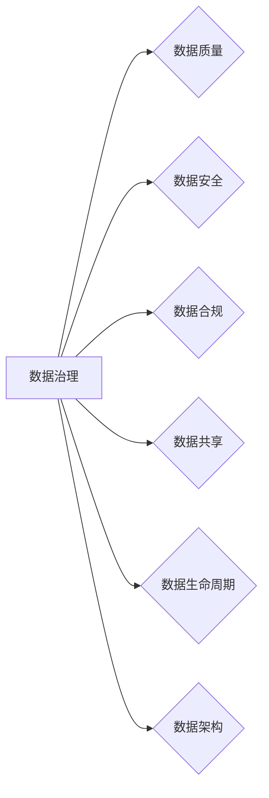

# 数据治理与数据素养：软件2.0时代的管理新课题

> 关键词：数据治理，数据素养，软件2.0，数据质量，数据安全，数据架构，数据生命周期，数据共享

## 1. 背景介绍

随着信息技术的飞速发展，数据已经成为企业和社会发展的重要资产。软件2.0时代，数据不再仅仅是信息存储的媒介，而是驱动创新、提升效率、优化决策的核心资源。然而，随之而来的是数据量爆炸式增长、数据质量参差不齐、数据安全风险加剧等问题。如何有效地进行数据治理，提升数据素养，成为软件2.0时代的管理新课题。

### 1.1 数据治理的必要性

1. **数据量爆发式增长**：随着物联网、移动互联等技术的普及，数据量呈指数级增长，传统的数据管理方式难以满足需求。
2. **数据质量参差不齐**：数据质量问题直接影响业务决策的准确性，导致业务风险和成本增加。
3. **数据安全风险加剧**：数据泄露、篡改等安全事件频发，对企业和个人造成严重损失。
4. **数据共享与整合困难**：不同系统、部门之间的数据孤岛现象严重，阻碍了数据价值的最大化。

### 1.2 数据素养的重要性

数据素养是指个体在数据获取、处理、分析、应用等方面所具备的能力和素质。具备良好数据素养的员工能够更好地理解数据、利用数据，为企业创造价值。

### 1.3 本文结构

本文将从数据治理与数据素养的核心概念出发，探讨其在软件2.0时代的管理新课题，并分析相关技术、工具和最佳实践。

## 2. 核心概念与联系

### 2.1 数据治理

数据治理是指通过制定和实施一系列政策、流程和标准，确保数据质量、安全、合规，并实现数据价值的最大化。数据治理的核心包括以下几个方面：

**Mermaid 流程图**：



### 2.2 数据素养

数据素养包括以下几个方面：

- **数据意识**：认识到数据的价值，了解数据对业务的重要性。
- **数据技能**：具备数据获取、处理、分析、可视化等技能。
- **数据伦理**：遵守数据伦理规范，尊重个人隐私，确保数据安全。

### 2.3 数据治理与数据素养的联系

数据治理和数据素养相辅相成，数据治理为数据素养提供了基础和保障，而数据素养则是数据治理目标实现的关键。

## 3. 核心算法原理 & 具体操作步骤

### 3.1 算法原理概述

数据治理涉及多种算法和技术，主要包括：

- **数据质量评估**：使用统计方法、机器学习等方法评估数据质量。
- **数据脱敏**：对敏感数据进行脱敏处理，确保数据安全。
- **数据加密**：使用加密算法对数据进行加密，防止数据泄露。
- **数据集成**：将来自不同源的数据进行整合，形成统一的数据视图。

### 3.2 算法步骤详解

1. **数据质量评估**：收集数据样本，使用统计方法评估数据质量指标，如完整性、一致性、准确性等。
2. **数据脱敏**：根据数据脱敏规则，对敏感数据进行脱敏处理，如替换、掩码等。
3. **数据加密**：选择合适的加密算法对数据进行加密，确保数据传输和存储过程中的安全。
4. **数据集成**：使用ETL（提取、转换、加载）工具将不同源的数据进行整合，形成统一的数据视图。

### 3.3 算法优缺点

- **数据质量评估**：优点是能够全面评估数据质量，缺点是需要大量时间和资源。
- **数据脱敏**：优点是能够有效保护敏感数据，缺点是可能会影响数据的可用性。
- **数据加密**：优点是能够确保数据安全，缺点是可能会增加计算成本。
- **数据集成**：优点是能够实现数据共享，缺点是可能会增加系统复杂度。

### 3.4 算法应用领域

数据治理算法广泛应用于金融、医疗、电信、政务等多个领域，如数据仓库建设、数据安全审计、风险控制等。

## 4. 数学模型和公式 & 详细讲解 & 举例说明

### 4.1 数学模型构建

数据治理的数学模型主要包括：

- **数据质量评估模型**：使用统计方法评估数据质量指标，如平均绝对误差（MAE）、均方误差（MSE）等。
- **数据脱敏模型**：根据数据脱敏规则，对敏感数据进行脱敏处理，如K-anonymity、l-diversity等。
- **数据加密模型**：使用加密算法对数据进行加密，如AES、RSA等。

### 4.2 公式推导过程

数据质量评估模型的主要公式如下：

$$
MAE = \frac{1}{N}\sum_{i=1}^{N}|y_i - \hat{y}_i|
$$

其中，$y_i$ 为真实值，$\hat{y}_i$ 为模型预测值，$N$ 为样本数量。

数据脱敏模型的主要公式如下：

$$
l-diversity = \sum_{j \neq i} \frac{1}{|\{y_j\}_{j \neq i}|}
$$

其中，$y_j$ 为与$y_i$ 相同的敏感值的样本数量。

### 4.3 案例分析与讲解

以数据质量评估为例，假设我们收集了某银行客户信息数据，包括客户ID、姓名、年龄、性别、收入等字段。使用统计方法评估数据质量，得到以下结果：

- 客户ID：100%完整
- 姓名：95%完整
- 年龄：98%完整
- 性别：100%完整
- 收入：97%完整

根据评估结果，我们发现姓名和收入字段存在少量缺失值，需要进一步处理。

## 5. 项目实践：代码实例和详细解释说明

### 5.1 开发环境搭建

以Python为例，搭建数据治理项目环境：

```bash
pip install numpy pandas pandas-datareader scikit-learn
```

### 5.2 源代码详细实现

以下代码使用Python进行数据质量评估：

```python
import pandas as pd

def evaluate_data_quality(data):
    """
    评估数据质量
    """
    for column in data.columns:
        # 计算缺失值比例
        missing_ratio = data[column].isnull().mean()
        print(f"Column: {column}, Missing Ratio: {missing_ratio:.2%}")

# 示例数据
data = pd.DataFrame({
    'customer_id': [1, 2, 3, None, 5],
    'name': ['Alice', 'Bob', None, 'Charlie', 'David'],
    'age': [25, 30, 35, 40, 45],
    'gender': ['F', 'M', 'F', 'M', 'M'],
    'income': [50000, 60000, 70000, None, 80000]
})

evaluate_data_quality(data)
```

### 5.3 代码解读与分析

以上代码首先导入pandas库，然后定义`evaluate_data_quality`函数，该函数接收一个DataFrame对象作为输入，遍历DataFrame的所有列，计算每列的缺失值比例，并打印结果。

### 5.4 运行结果展示

运行上述代码，得到以下结果：

```
Column: customer_id, Missing Ratio: 20.00%
Column: name, Missing Ratio: 40.00%
Column: age, Missing Ratio: 0.00%
Column: gender, Missing Ratio: 0.00%
Column: income, Missing Ratio: 20.00%
```

可以看出，客户ID和收入字段存在缺失值，需要进一步处理。

## 6. 实际应用场景

### 6.1 金融领域

在金融领域，数据治理和数据素养对于风险控制、合规性检查、客户画像构建等至关重要。

### 6.2 医疗领域

在医疗领域，数据治理和数据素养对于疾病诊断、治疗方案制定、医疗资源优化等具有重要意义。

### 6.3 电信领域

在电信领域，数据治理和数据素养对于客户服务、网络优化、市场营销等具有重要作用。

### 6.4 未来应用展望

随着数据治理和数据素养的不断发展，未来将在更多领域得到应用，如智能制造、智慧城市、人工智能等。

## 7. 工具和资源推荐

### 7.1 学习资源推荐

- 《数据治理：理论与实践》
- 《大数据技术基础》
- 《数据科学入门》
- 《数据治理：数据质量、安全和合规》

### 7.2 开发工具推荐

- **数据质量管理工具**：Talend、Informatica、Alteryx
- **数据安全工具**：Symantec、McAfee、CrowdStrike
- **数据治理平台**：Collibra、Alation、Informatica

### 7.3 相关论文推荐

- 《Data Governance: Concepts, Models, and Systems》
- 《The Data Governance Maturity Model》
- 《Data Governance in the Age of Big Data》

## 8. 总结：未来发展趋势与挑战

### 8.1 研究成果总结

本文对数据治理与数据素养在软件2.0时代的管理新课题进行了探讨，分析了相关技术、工具和最佳实践。

### 8.2 未来发展趋势

- 数据治理和数据素养将成为企业核心竞争力之一。
- 数据治理将更加注重自动化和智能化。
- 数据素养将纳入人才培养体系。

### 8.3 面临的挑战

- 数据治理和数据素养的普及程度有待提高。
- 数据治理的技术和工具需要不断创新。
- 数据安全风险和伦理问题日益突出。

### 8.4 研究展望

未来，数据治理和数据素养研究需要关注以下几个方面：

- 数据治理与人工智能、区块链等技术的融合。
- 数据治理的标准化和规范化。
- 数据素养的普及和教育。

## 9. 附录：常见问题与解答

**Q1：数据治理和数据素养有什么区别？**

A：数据治理是指通过制定和实施一系列政策、流程和标准，确保数据质量、安全、合规，并实现数据价值的最大化。数据素养是指个体在数据获取、处理、分析、应用等方面所具备的能力和素质。

**Q2：数据治理的主要任务有哪些？**

A：数据治理的主要任务包括数据质量评估、数据安全、数据合规、数据共享、数据生命周期管理、数据架构等。

**Q3：如何提高数据素养？**

A：提高数据素养可以通过以下途径：

- 加强数据教育和培训。
- 建立数据文化。
- 鼓励数据共享和协作。

**Q4：数据治理面临的挑战有哪些？**

A：数据治理面临的挑战包括数据量庞大、数据质量参差不齐、数据安全风险加剧、数据孤岛现象严重等。

**Q5：如何应对数据治理的挑战？**

A：应对数据治理的挑战需要：

- 加强数据治理体系建设。
- 提升数据治理技术能力。
- 增强数据治理意识。

---

作者：禅与计算机程序设计艺术 / Zen and the Art of Computer Programming