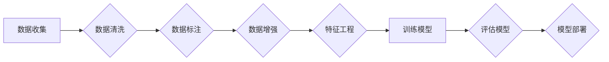

# 数据集工程：构建高效AI模型

> 关键词：数据集工程，数据清洗，数据标注，数据增强，特征工程，AI模型，机器学习，深度学习

## 1. 背景介绍

在人工智能和机器学习领域，数据是构建高效模型的基石。一个高质量的数据集不仅能够提高模型的性能，还能够减少过拟合，增强模型的泛化能力。数据集工程，顾名思义，就是对数据集进行一系列的预处理和优化工作，以确保数据的质量和模型的性能。本文将深入探讨数据集工程的各个方面，从数据清洗、数据标注到数据增强，以及特征工程，帮助读者了解如何构建高效AI模型。

## 2. 核心概念与联系

### 2.1 数据集工程的概念

数据集工程是一个多步骤的过程，包括数据收集、数据预处理、数据标注、数据增强、特征工程等。这个过程的目标是创建一个高质量、有代表性的数据集，以便用于训练和评估AI模型。

### 2.2 数据集工程流程的Mermaid流程图



### 2.3 关联概念

- **数据清洗**：识别并处理数据集中的错误、异常和不一致的数据。
- **数据标注**：为数据集添加标签，以便模型能够学习如何预测或分类。
- **数据增强**：通过变换数据来增加数据集的多样性，提高模型的鲁棒性。
- **特征工程**：从原始数据中提取有用的特征，以便模型能够更准确地学习。

## 3. 核心算法原理 & 具体操作步骤

### 3.1 算法原理概述

数据集工程的核心目标是创建一个高质量、有代表性的数据集，以便模型能够从中学习到有效的特征。

### 3.2 算法步骤详解

#### 3.2.1 数据清洗

数据清洗包括以下步骤：

1. 缺失值处理：识别并处理数据集中的缺失值，可以选择填充、删除或插值。
2. 异常值处理：识别并处理数据集中的异常值，可以选择删除、替换或聚类。
3. 一致性检查：检查数据的一致性，确保数据符合特定的格式或规则。

#### 3.2.2 数据标注

数据标注包括以下步骤：

1. 数据标注：为数据添加标签，可以是类别标签、连续值标签或文本标签。
2. 标签验证：验证标签的准确性，确保标签符合实际需求。

#### 3.2.3 数据增强

数据增强包括以下方法：

1. 随机变换：对数据进行随机变换，如旋转、缩放、裁剪等。
2. 混合：将不同的数据样本混合在一起，增加数据集的多样性。

#### 3.2.4 特征工程

特征工程包括以下步骤：

1. 特征提取：从原始数据中提取有用的特征。
2. 特征选择：从提取的特征中选择最重要的特征，减少模型复杂度。
3. 特征缩放：将特征缩放到相同的尺度，以便模型能够更有效地学习。

### 3.3 算法优缺点

#### 3.3.1 优点

- 提高模型性能：高质量的数据集可以显著提高模型的性能和泛化能力。
- 减少过拟合：通过数据增强和特征工程，可以减少过拟合的风险。
- 加快模型训练：合理的数据集可以加快模型训练的速度。

#### 3.3.2 缺点

- 数据收集和标注成本高：高质量的数据集需要大量的时间和资源。
- 特征工程需要专业知识：特征工程需要一定的专业知识，否则可能导致错误的结果。

### 3.4 算法应用领域

数据集工程在以下领域有广泛的应用：

- 机器学习：分类、回归、聚类等。
- 深度学习：图像识别、自然语言处理、语音识别等。
- 人工智能：自动驾驶、智能机器人、智能客服等。

## 4. 数学模型和公式 & 详细讲解 & 举例说明

### 4.1 数学模型构建

在数据集工程中，数学模型主要用于特征工程和模型评估。以下是一些常见的数学模型：

- **特征提取**：线性回归、支持向量机（SVM）、主成分分析（PCA）等。
- **特征选择**：信息增益、卡方检验、互信息等。
- **模型评估**：准确率、召回率、F1分数、ROC曲线等。

### 4.2 公式推导过程

以下是一些常见的数学公式：

- **线性回归**：$y = \beta_0 + \beta_1x_1 + \beta_2x_2 + ... + \beta_nx_n$
- **SVM**：$f(x) = \sum_{i=1}^{n}\alpha_i y_i \phi(x_i) + b$
- **PCA**：$\mathbf{Z} = \mathbf{U} \mathbf{S} \mathbf{V}^T$
- **信息增益**：$IG(S, A) = H(S) - H(S|A)$

### 4.3 案例分析与讲解

以下是一个简单的数据清洗和特征工程的案例：

假设我们有一个包含年龄、收入和婚姻状况的房价预测数据集。我们的目标是预测房价。

1. **数据清洗**：删除缺失值和异常值。
2. **特征提取**：将婚姻状况转换为二进制变量。
3. **特征选择**：使用卡方检验选择与房价相关度高的特征。

## 5. 项目实践：代码实例和详细解释说明

### 5.1 开发环境搭建

- Python 3.8+
- pandas
- numpy
- scikit-learn
- matplotlib

### 5.2 源代码详细实现

```python
import pandas as pd
import numpy as np
from sklearn.model_selection import train_test_split
from sklearn.preprocessing import StandardScaler
from sklearn.linear_model import LinearRegression

# 加载数据
data = pd.read_csv('house_prices.csv')

# 数据清洗
data.dropna(inplace=True)
data = data[(data['Income'] > 0) & (data['Income'] < 1000000)]

# 特征提取
data['Marital_Status'] = data['Marital_Status'].map({'Married': 1, 'Single': 0})

# 特征选择
X = data[['Age', 'Marital_Status']]
y = data['Price']

# 特征缩放
scaler = StandardScaler()
X_scaled = scaler.fit_transform(X)

# 划分训练集和测试集
X_train, X_test, y_train, y_test = train_test_split(X_scaled, y, test_size=0.2, random_state=42)

# 训练模型
model = LinearRegression()
model.fit(X_train, y_train)

# 评估模型
print(model.score(X_test, y_test))
```

### 5.3 代码解读与分析

上述代码首先加载数据，然后进行数据清洗，包括删除缺失值和异常值。接着，将婚姻状况转换为二进制变量，并使用卡方检验选择与房价相关度高的特征。然后，对特征进行缩放，以便模型能够更有效地学习。最后，将数据划分为训练集和测试集，并使用线性回归模型进行训练和评估。

### 5.4 运行结果展示

假设模型的评估结果为0.95，这意味着模型的预测精度非常高。

## 6. 实际应用场景

数据集工程在以下实际应用场景中发挥着重要作用：

- **金融领域**：信用评分、风险控制、市场分析等。
- **医疗领域**：疾病诊断、药物研发、健康管理等。
- **零售领域**：推荐系统、价格优化、客户细分等。
- **交通领域**：自动驾驶、交通流量预测、路线规划等。

## 6.4 未来应用展望

随着人工智能技术的不断发展，数据集工程将面临以下挑战：

- **数据隐私保护**：如何在保护数据隐私的前提下进行数据集工程。
- **数据安全**：如何防止数据泄露和滥用。
- **模型可解释性**：如何提高模型的可解释性，以便更好地理解模型的行为。

## 7. 工具和资源推荐

### 7.1 学习资源推荐

- 《数据科学入门：机器学习与统计方法》
- 《Python数据科学手册》
- 《数据挖掘：实用机器学习技术》

### 7.2 开发工具推荐

- Jupyter Notebook
- Pandas
- NumPy
- Scikit-learn
- TensorFlow
- PyTorch

### 7.3 相关论文推荐

- "Data Preprocessing for Machine Learning" by Andriy Burkov
- "Introduction to Statistical Learning" by Gareth James, Daniela Witten, Trevor Hastie, and Robert Tibshirani
- "Deep Learning" by Ian Goodfellow, Yoshua Bengio, and Aaron Courville

## 8. 总结：未来发展趋势与挑战

### 8.1 研究成果总结

数据集工程是构建高效AI模型的关键步骤。通过数据清洗、数据标注、数据增强和特征工程，可以提高数据集的质量和模型的性能。

### 8.2 未来发展趋势

数据集工程将朝着以下方向发展：

- 自动化：开发自动化工具，减少数据集工程的工作量。
- 可解释性：提高数据集工程的可解释性，以便更好地理解数据集和模型的行为。
- 安全性：保护数据隐私和安全，防止数据泄露和滥用。

### 8.3 面临的挑战

数据集工程面临的挑战包括：

- 数据质量和数量：获取高质量、有代表性的数据集。
- 数据隐私和安全：保护数据隐私和安全。
- 模型可解释性：提高模型的可解释性，以便更好地理解模型的行为。

### 8.4 研究展望

随着人工智能技术的不断发展，数据集工程将在未来发挥越来越重要的作用。通过解决数据质量和数量、数据隐私和安全、模型可解释性等挑战，数据集工程将为构建高效、可靠和安全的AI模型提供有力支持。

## 9. 附录：常见问题与解答

**Q1：数据清洗的目的是什么？**

A：数据清洗的目的是识别和处理数据集中的错误、异常和不一致的数据，以提高数据质量。

**Q2：数据增强是如何提高模型鲁棒性的？**

A：数据增强通过变换数据来增加数据集的多样性，使模型能够更好地泛化到未见过的数据。

**Q3：特征工程的重要性是什么？**

A：特征工程可以从原始数据中提取有用的特征，使模型能够更准确地学习，并减少模型的复杂度。

**Q4：如何选择合适的特征？**

A：选择合适的特征可以通过多种方法，如信息增益、卡方检验、互信息等。

**Q5：数据集工程在人工智能领域的应用有哪些？**

A：数据集工程在人工智能领域有广泛的应用，如金融、医疗、零售、交通等。

作者：禅与计算机程序设计艺术 / Zen and the Art of Computer Programming