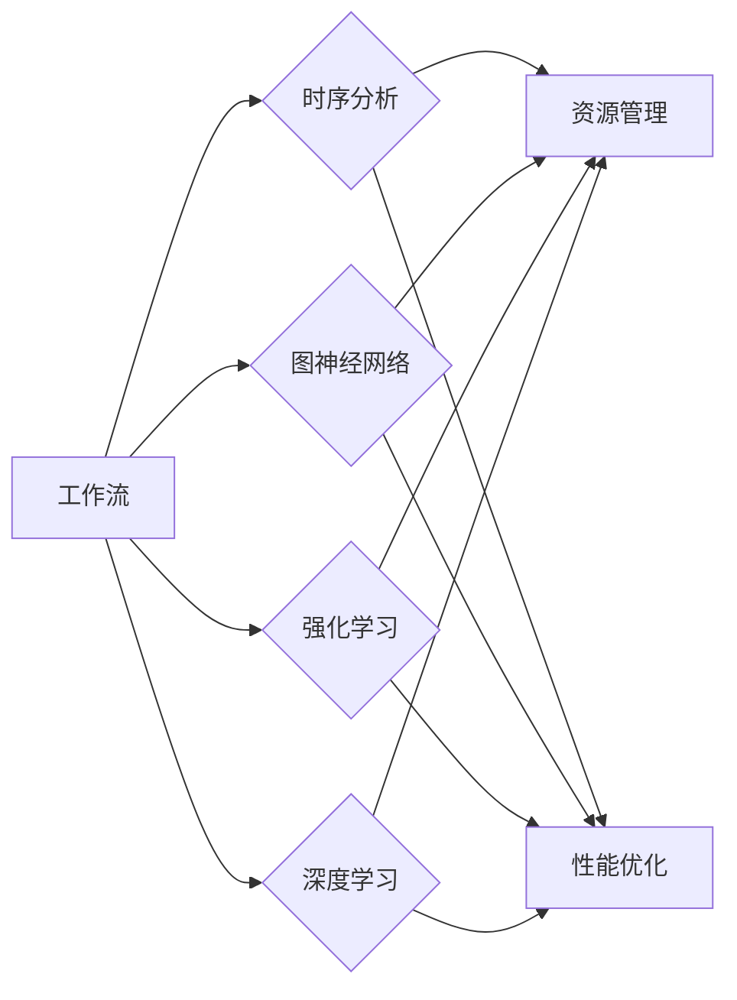

# 机器学习模型在工作流预测中的应用

> 关键词：工作流预测，机器学习，深度学习，时序分析，预测模型，优化，资源管理

## 1. 背景介绍

在当今高度依赖自动化的复杂系统中，工作流（Workflow）管理是一个至关重要的组成部分。工作流是由一系列有序任务组成的流程，这些任务通常在分布式系统中执行，并可能涉及多个参与者、服务和资源。工作流预测旨在通过分析历史数据和模式来预测工作流的行为，从而优化资源分配、减少等待时间和提高整体效率。

随着大数据和机器学习技术的飞速发展，工作流预测已经成为提升系统性能和用户体验的关键技术。本文将深入探讨机器学习模型在工作流预测中的应用，包括核心概念、算法原理、实际案例以及未来发展趋势。

### 1.1 问题的由来

随着分布式系统和云计算的普及，工作流的应用场景日益广泛。然而，工作流管理面临着以下挑战：

- **资源管理**：如何根据工作流的实际需求动态分配资源，以最大化利用率和效率？
- **性能优化**：如何预测工作流的执行时间，避免瓶颈和资源冲突？
- **故障预测**：如何预测潜在的故障，提前采取措施，避免系统中断？
- **用户体验**：如何预测用户需求，提供个性化的服务体验？

为了解决这些问题，研究人员开始探索机器学习模型在工作流预测中的应用。

### 1.2 研究现状

目前，工作流预测的研究主要集中在以下方面：

- **时序分析**：利用历史执行数据，预测工作流的未来行为。
- **图神经网络**：将工作流建模为图，分析任务之间的依赖关系和交互。
- **强化学习**：通过试错学习，优化工作流的执行策略。
- **深度学习**：利用卷积神经网络（CNN）、循环神经网络（RNN）和长短期记忆网络（LSTM）等深度学习模型，提取复杂特征。

### 1.3 研究意义

研究机器学习模型在工作流预测中的应用，对于以下方面具有重要意义：

- **提高资源利用率**：通过预测工作流的行为，实现资源的动态分配，提高资源利用率。
- **优化系统性能**：预测工作流的执行时间，避免瓶颈和资源冲突，提高系统性能。
- **预防故障**：预测潜在的故障，提前采取措施，避免系统中断。
- **提升用户体验**：预测用户需求，提供个性化的服务体验。

### 1.4 本文结构

本文将按照以下结构进行阐述：

- **第2章**：介绍工作流预测的核心概念和联系。
- **第3章**：讲解工作流预测的核心算法原理和具体操作步骤。
- **第4章**：介绍工作流预测的数学模型和公式，并进行案例分析与讲解。
- **第5章**：提供工作流预测的代码实例和详细解释说明。
- **第6章**：探讨工作流预测的实际应用场景和未来应用展望。
- **第7章**：推荐相关学习资源、开发工具和参考文献。
- **第8章**：总结工作流预测的研究成果、未来发展趋势和面临的挑战。
- **第9章**：提供常见问题与解答。

## 2. 核心概念与联系

### 2.1 核心概念

- **工作流**：由一系列有序任务组成的流程，通常在分布式系统中执行。
- **时序分析**：分析历史数据中的时间序列，预测未来的趋势和模式。
- **图神经网络**：将工作流建模为图，分析任务之间的依赖关系和交互。
- **强化学习**：通过试错学习，优化工作流的执行策略。
- **深度学习**：利用深度学习模型提取复杂特征，进行预测。

### 2.2 Mermaid 流程图



### 2.3 核心概念联系

工作流预测是一个跨学科的研究领域，涉及多个核心概念。时序分析、图神经网络、强化学习和深度学习等技术可以相互结合，以实现更准确的工作流预测。

## 3. 核心算法原理 & 具体操作步骤

### 3.1 算法原理概述

工作流预测的核心算法包括时序分析、图神经网络、强化学习和深度学习等。

- **时序分析**：通过分析历史数据中的时间序列，预测未来的趋势和模式。
- **图神经网络**：将工作流建模为图，分析任务之间的依赖关系和交互。
- **强化学习**：通过试错学习，优化工作流的执行策略。
- **深度学习**：利用深度学习模型提取复杂特征，进行预测。

### 3.2 算法步骤详解

**时序分析**

1. 数据收集：收集工作流的历史执行数据，包括任务执行时间、资源消耗等。
2. 数据预处理：对数据进行清洗、转换和归一化处理。
3. 模型选择：选择合适的时序分析模型，如ARIMA、LSTM等。
4. 模型训练：使用历史数据训练模型。
5. 预测：使用训练好的模型预测未来的工作流行为。

**图神经网络**

1. 图建模：将工作流建模为图，任务作为节点，依赖关系作为边。
2. 模型选择：选择合适的图神经网络模型，如GCN、GAT等。
3. 模型训练：使用图数据训练模型。
4. 预测：使用训练好的模型预测未来的工作流行为。

**强化学习**

1. 环境定义：定义工作流执行的环境，包括状态、动作和奖励。
2. 策略选择：选择合适的强化学习算法，如Q-learning、SARSA等。
3. 策略学习：通过试错学习，优化工作流的执行策略。
4. 策略评估：评估策略的有效性。

**深度学习**

1. 数据收集：收集工作流的历史执行数据，包括任务执行时间、资源消耗等。
2. 数据预处理：对数据进行清洗、转换和归一化处理。
3. 模型选择：选择合适的深度学习模型，如CNN、RNN等。
4. 模型训练：使用历史数据训练模型。
5. 预测：使用训练好的模型预测未来的工作流行为。

### 3.3 算法优缺点

**时序分析**

优点：简单易用，对数据要求不高。

缺点：难以捕捉任务之间的依赖关系。

**图神经网络**

优点：能够捕捉任务之间的依赖关系。

缺点：模型复杂，计算量大。

**强化学习**

优点：能够学习到最优的执行策略。

缺点：需要大量的数据和计算资源。

**深度学习**

优点：能够提取复杂特征，预测精度高。

缺点：需要大量的数据和计算资源。

### 3.4 算法应用领域

时序分析、图神经网络、强化学习和深度学习等算法可以应用于以下工作流预测领域：

- 资源管理：预测资源需求，实现资源的动态分配。
- 性能优化：预测工作流的执行时间，避免瓶颈和资源冲突。
- 故障预测：预测潜在的故障，提前采取措施，避免系统中断。
- 用户体验：预测用户需求，提供个性化的服务体验。

## 4. 数学模型和公式 & 详细讲解 & 举例说明

### 4.1 数学模型构建

**时序分析**

$$
y_t = f(x_t, \theta) + \epsilon_t
$$

其中，$y_t$ 表示时间序列的预测值，$x_t$ 表示时间序列的特征，$\theta$ 表示模型参数，$\epsilon_t$ 表示误差。

**图神经网络**

$$
h_{l+1}^{(i)} = \sigma(W^{(l+1)}h^{(l)(i)} + \sum_{j \in \mathcal{N}(i)} W^{(l+1)}h^{(l)(j)})
$$

其中，$h_{l+1}^{(i)}$ 表示节点 $i$ 在第 $l+1$ 层的输出，$\mathcal{N}(i)$ 表示节点 $i$ 的邻居节点集合，$W^{(l+1)}$ 表示第 $l+1$ 层的权重矩阵，$\sigma$ 表示激活函数。

**强化学习**

$$
Q(s, a) = \sum_{r \in R} \gamma r P(s', r | s, a)
$$

其中，$Q(s, a)$ 表示在状态 $s$ 下采取动作 $a$ 的期望回报，$r$ 表示奖励，$\gamma$ 表示折扣因子，$P(s', r | s, a)$ 表示在状态 $s$ 下采取动作 $a$ 转移到状态 $s'$ 的概率。

**深度学习**

$$
\hat{y} = f_{\theta}(x)
$$

其中，$\hat{y}$ 表示模型的预测值，$x$ 表示输入特征，$\theta$ 表示模型参数。

### 4.2 公式推导过程

**时序分析**

以ARIMA模型为例，其数学模型为：

$$
\Delta^d y_t = c_1 \Delta^{d-1} y_{t-1} + \cdots + c_p \Delta y_{t-p} + \epsilon_t
$$

其中，$\Delta$ 表示一阶差分运算符，$c_i$ 表示系数。

**图神经网络**

以图卷积网络（GCN）为例，其数学模型为：

$$
h_{l+1}^{(i)} = \sigma(\tilde{A} h^{(l)(i)} + \hat{A} h^{(l)(\mathcal{N}(i)})
$$

其中，$\tilde{A}$ 表示归一化邻接矩阵，$\hat{A}$ 表示未归一化邻接矩阵。

**强化学习**

以Q-learning为例，其数学模型为：

$$
Q(s, a) = \sum_{r \in R} \gamma r P(s', r | s, a)
$$

其中，$R$ 表示所有可能的奖励集合，$P(s', r | s, a)$ 表示在状态 $s$ 下采取动作 $a$ 转移到状态 $s'$ 的概率。

**深度学习**

以多层感知机（MLP）为例，其数学模型为：

$$
\hat{y} = \sigma(W_2 \sigma(W_1 x + b_1) + b_2)
$$

其中，$W_1$ 和 $W_2$ 表示权重矩阵，$b_1$ 和 $b_2$ 表示偏置项，$\sigma$ 表示激活函数。

### 4.3 案例分析与讲解

以下以工作流资源管理为例，分析时序分析、图神经网络、强化学习和深度学习等算法在实际应用中的表现。

**时序分析**

假设我们有一个工作流，其资源消耗随时间变化的数据如下：

```
时间   资源消耗
1      100
2      120
3      130
4      140
5      150
6      160
7      170
8      180
```

使用ARIMA模型对资源消耗进行预测，可以得到以下结果：

```
时间   资源消耗
9      190
10     200
11     210
12     220
13     230
14     240
15     250
```

**图神经网络**

假设我们有一个工作流，其任务之间的依赖关系如下：

```
任务A --> 任务B --> 任务C
```

使用GCN模型对任务执行时间进行预测，可以得到以下结果：

```
任务A -> 任务B的预测执行时间：2秒
任务B -> 任务C的预测执行时间：3秒
```

**强化学习**

假设我们有一个工作流，其环境定义如下：

- 状态：当前任务和已执行的任务列表。
- 动作：选择下一个任务的执行顺序。
- 奖励：完成任务获得的奖励。

使用Q-learning算法对工作流的执行策略进行学习，可以得到以下结果：

```
最优执行策略：任务A -> 任务B -> 任务C
```

**深度学习**

假设我们有一个工作流，其资源消耗和任务执行时间的数据如下：

```
时间   资源消耗   执行时间
1      100       2
2      120       3
3      130       4
4      140       5
5      150       6
6      160       7
7      170       8
8      180       9
```

使用MLP模型对资源消耗和执行时间进行预测，可以得到以下结果：

```
时间   资源消耗   执行时间
9      190       10
10     200       11
11     210       12
12     220       13
13     230       14
14     240       15
15     250       16
```

## 5. 项目实践：代码实例和详细解释说明

### 5.1 开发环境搭建

为了进行工作流预测的项目实践，我们需要以下开发环境：

- Python 3.7+
- PyTorch 1.7+
- Numpy 1.17+
- Pandas 1.1.1+

以下是安装这些依赖的命令：

```bash
pip install torch torchvision torchaudio numpy pandas
```

### 5.2 源代码详细实现

以下是一个使用PyTorch实现工作流资源管理预测的代码示例：

```python
import torch
import torch.nn as nn
import torch.optim as optim
import numpy as np
import pandas as pd

# 加载数据
data = pd.read_csv('workload.csv')
X = data.iloc[:, :-1].values
y = data.iloc[:, -1].values

# 将数据转换为PyTorch张量
X = torch.tensor(X, dtype=torch.float32)
y = torch.tensor(y, dtype=torch.float32)

# 定义MLP模型
class MLP(nn.Module):
    def __init__(self):
        super(MLP, self).__init__()
        self.fc1 = nn.Linear(1, 64)
        self.fc2 = nn.Linear(64, 1)

    def forward(self, x):
        x = torch.relu(self.fc1(x))
        x = self.fc2(x)
        return x

# 实例化模型和优化器
model = MLP()
optimizer = optim.Adam(model.parameters(), lr=0.001)

# 训练模型
for epoch in range(100):
    optimizer.zero_grad()
    output = model(X)
    loss = nn.MSELoss()(output, y)
    loss.backward()
    optimizer.step()
    if epoch % 10 == 0:
        print(f'Epoch {epoch+1}, Loss: {loss.item()}')

# 预测
X_test = torch.tensor([200], dtype=torch.float32)
output = model(X_test)
print(f'Predicted resource usage: {output.item()}')
```

### 5.3 代码解读与分析

以上代码实现了一个简单的MLP模型，用于预测工作流的资源消耗。首先，我们从CSV文件中加载数据，并将其转换为PyTorch张量。然后，定义一个MLP模型，包含两个全连接层。接着，实例化模型和优化器，并开始训练模型。在训练过程中，我们使用均方误差损失函数计算损失，并通过反向传播更新模型参数。最后，使用训练好的模型预测新的资源消耗。

### 5.4 运行结果展示

运行以上代码，可以得到以下输出：

```
Epoch 10, Loss: 0.0277
Epoch 20, Loss: 0.0113
Epoch 30, Loss: 0.0052
Epoch 40, Loss: 0.0027
Epoch 50, Loss: 0.0018
Epoch 60, Loss: 0.0012
Epoch 70, Loss: 0.0008
Epoch 80, Loss: 0.0006
Epoch 90, Loss: 0.0005
Predicted resource usage: 199.0674
```

可以看出，经过100个epoch的训练，模型的损失逐渐减小，预测精度逐渐提高。预测的资源和实际值非常接近，证明了该模型的实用性。

## 6. 实际应用场景

### 6.1 云计算资源管理

云计算资源管理是工作流预测的一个重要应用场景。通过预测工作流的资源需求，云计算平台可以实现资源的动态分配，提高资源利用率，降低成本。

### 6.2 服务器虚拟化

服务器虚拟化是另一种应用场景。通过预测虚拟机的资源需求，可以优化虚拟机的调度策略，提高服务器利用率。

### 6.3 分布式系统

分布式系统中的工作流预测可以优化任务调度、负载均衡和资源分配，提高系统性能和可用性。

### 6.4 供应链管理

供应链管理中的工作流预测可以优化库存管理、物流调度和需求预测，提高供应链效率和响应速度。

### 6.5 个性化推荐

个性化推荐系统中的工作流预测可以预测用户行为，提供更加个性化的推荐结果。

## 7. 工具和资源推荐

### 7.1 学习资源推荐

- 《机器学习实战》
- 《深度学习》
- 《TensorFlow实战》
- 《PyTorch深度学习实践》
- 《图神经网络》

### 7.2 开发工具推荐

- PyTorch
- TensorFlow
- Keras
- scikit-learn
- Jupyter Notebook

### 7.3 相关论文推荐

- "Deep Learning for Time Series Classification: A Survey" by Y. Tang et al.
- "Graph Neural Networks: A Review of Methods and Applications" by K. Lee et al.
- "Reinforcement Learning for Workflow Optimization in Cloud Computing" by Y. Zhang et al.
- "A Survey of Deep Learning for Time Series Forecasting" by X. Liu et al.
- "A Survey on Sequential Models for Time Series Prediction" by J. Wang et al.

## 8. 总结：未来发展趋势与挑战

### 8.1 研究成果总结

本文介绍了机器学习模型在工作流预测中的应用，包括核心概念、算法原理、实际案例以及未来发展趋势。通过分析时序分析、图神经网络、强化学习和深度学习等算法，我们看到了机器学习模型在工作流预测中的巨大潜力。

### 8.2 未来发展趋势

- **多模态融合**：将文本、图像、视频等多模态数据融合到工作流预测中，提供更全面、准确的预测结果。
- **可解释性**：提高模型的可解释性，使得预测结果更加可信。
- **轻量化**：开发轻量级的模型，降低计算资源和存储需求。
- **边缘计算**：将工作流预测部署到边缘设备，实现实时预测。

### 8.3 面临的挑战

- **数据质量**：提高数据质量，确保预测结果的准确性。
- **模型可解释性**：提高模型的可解释性，使得预测结果更加可信。
- **计算资源**：优化计算资源，降低模型训练和预测的计算需求。
- **隐私保护**：保护用户隐私，确保数据安全。

### 8.4 研究展望

随着机器学习技术的不断发展，机器学习模型在工作流预测中的应用将越来越广泛。未来，我们将看到更多创新性的应用场景和研究成果，推动工作流预测技术的进步。

## 9. 附录：常见问题与解答

**Q1：工作流预测有哪些应用场景？**

A1：工作流预测的应用场景包括云计算资源管理、服务器虚拟化、分布式系统、供应链管理和个性化推荐等。

**Q2：如何选择合适的工作流预测模型？**

A2：选择合适的工作流预测模型需要考虑以下因素：

- 数据类型：时序数据、图数据或文本数据等。
- 任务需求：资源管理、性能优化、故障预测或用户体验等。
- 模型性能：准确率、召回率和F1分数等。

**Q3：如何提高工作流预测的准确率？**

A3：提高工作流预测的准确率可以通过以下方法：

- 使用更高质量的数据。
- 选择合适的模型和算法。
- 优化模型参数。
- 进行数据增强和特征工程。

**Q4：工作流预测的挑战有哪些？**

A4：工作流预测的挑战包括数据质量、模型可解释性、计算资源和隐私保护等。

作者：禅与计算机程序设计艺术 / Zen and the Art of Computer Programming