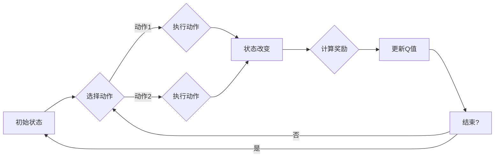

# 深度 Q-learning：在人工智能艺术创作中的应用

> 关键词：深度 Q-learning, 艺术创作，强化学习，神经网络，智能创作，自动生成，艺术风格，数字艺术

## 1. 背景介绍

艺术创作一直是人类智慧的结晶，而随着人工智能技术的飞速发展，人工智能在艺术领域的应用逐渐成为研究热点。其中，深度 Q-learning作为一种强化学习算法，因其强大的学习和决策能力，被应用于多种艺术创作场景。本文将探讨深度 Q-learning在人工智能艺术创作中的应用，分析其原理、操作步骤、优缺点以及未来发展趋势。

### 1.1 问题的由来

传统的人工智能艺术创作方法主要依赖于规则和启发式搜索，如基于规则的艺术设计、基于遗传算法的图像生成等。这些方法在某种程度上可以生成具有一定创造性的艺术作品，但往往缺乏自主性和多样性。而深度学习，尤其是强化学习，为艺术创作提供了一种新的思路。

### 1.2 研究现状

近年来，深度 Q-learning在人工智能艺术创作中的应用研究逐渐增多。研究者们利用深度 Q-learning算法，通过训练神经网络模型，使模型能够自主学习和模仿人类艺术家的创作过程，生成具有独特风格的艺术作品。

### 1.3 研究意义

研究深度 Q-learning在人工智能艺术创作中的应用，对于推动人工智能技术在艺术领域的应用具有重要意义：

1. 拓展艺术创作手段。深度 Q-learning可以帮助艺术家突破传统创作方式的局限性，实现更加新颖的艺术创作。

2. 促进艺术与科技的融合。深度 Q-learning的应用将艺术与科技相结合，为艺术领域带来新的发展机遇。

3. 推动人工智能技术的发展。通过对深度 Q-learning在艺术创作中的应用研究，可以进一步推动该算法在其他领域的应用。

### 1.4 本文结构

本文将首先介绍深度 Q-learning的基本概念和原理，然后分析其在艺术创作中的应用步骤，接着探讨其优缺点和适用场景，最后展望其未来发展趋势。

## 2. 核心概念与联系

### 2.1 核心概念原理

深度 Q-learning是一种基于深度神经网络和强化学习的算法。它通过学习一个价值函数，在给定状态下选择最优动作，从而实现智能决策。

**价值函数**：用于评估当前状态和动作的预期价值。

**状态**：描述环境当前状态的变量集合。

**动作**：由环境可供选择的操作集合。

**奖励**：执行动作后，环境对智能体提供的反馈。

### 2.2 架构的 Mermaid 流程图



### 2.3 核心概念联系

深度 Q-learning通过学习状态-动作价值函数，使智能体在给定状态下选择最优动作，从而实现智能决策。在实际应用中，神经网络模型用于近似状态-动作价值函数，并通过经验回放等技术提高学习效率。

## 3. 核心算法原理 & 具体操作步骤

### 3.1 算法原理概述

深度 Q-learning算法的核心思想是通过不断学习状态-动作价值函数，使智能体在给定状态下选择最优动作，从而实现智能决策。具体步骤如下：

1. 初始化：初始化神经网络模型，设置参数和超参数。
2. 状态输入：将环境当前状态输入神经网络模型，得到动作价值估计。
3. 选择动作：根据动作价值估计，选择一个动作执行。
4. 执行动作：将选择的动作输入环境，得到新的状态和奖励。
5. 更新Q值：根据新的状态和奖励，更新动作价值估计。
6. 迭代：重复步骤2-5，直至满足终止条件。

### 3.2 算法步骤详解

1. **初始化神经网络模型**：选择合适的神经网络结构，如卷积神经网络（CNN）或循环神经网络（RNN），用于近似状态-动作价值函数。
2. **状态输入**：将环境当前状态编码为向量，输入神经网络模型。
3. **选择动作**：根据神经网络输出的动作价值估计，选择一个动作执行。
4. **执行动作**：将选择的动作输入环境，得到新的状态和奖励。
5. **更新Q值**：根据新的状态和奖励，更新动作价值估计。具体公式如下：

$$
Q(s, a) \leftarrow Q(s, a) + \alpha [R + \gamma \max_{a'} Q(s', a') - Q(s, a)]
$$

其中，$Q(s, a)$ 为状态-动作价值函数，$R$ 为奖励，$\gamma$ 为折扣因子，$\alpha$ 为学习率，$s'$ 为新状态，$a'$ 为新动作。
6. **迭代**：重复步骤2-5，直至满足终止条件，如达到预定的迭代次数或环境回报达到一定阈值。

### 3.3 算法优缺点

#### 优点

1. **强大的学习能力**：深度 Q-learning能够学习到复杂的状态-动作价值函数，适用于各种艺术创作场景。
2. **自主性和多样性**：通过不断学习，模型可以自主探索和选择动作，生成具有多样性的艺术作品。
3. **适应性**：深度 Q-learning能够快速适应环境变化，适应不同的艺术创作需求。

#### 缺点

1. **训练过程复杂**：深度 Q-learning的训练过程较为复杂，需要大量的数据和计算资源。
2. **难以解释**：深度 Q-learning的决策过程较为复杂，难以解释其内部机制。

### 3.4 算法应用领域

深度 Q-learning在以下艺术创作领域具有广泛的应用：

1. **图像生成**：通过生成新的图像或视频，实现艺术风格的转换、图像编辑等功能。
2. **音乐创作**：通过生成新的音乐作品，实现音乐风格的转换、节奏创作等功能。
3. **动画制作**：通过生成新的动画序列，实现动画风格转换、角色动作生成等功能。

## 4. 数学模型和公式 & 详细讲解 & 举例说明

### 4.1 数学模型构建

深度 Q-learning的数学模型主要包括以下部分：

1. **状态空间**：描述环境当前状态的变量集合。
2. **动作空间**：环境可供选择的操作集合。
3. **价值函数**：用于评估当前状态和动作的预期价值。
4. **策略**：描述智能体如何选择动作的函数。

### 4.2 公式推导过程

假设状态空间为 $S$，动作空间为 $A$，奖励函数为 $R(s, a)$，价值函数为 $V(s)$，策略为 $\pi(a|s)$，则深度 Q-learning的目标是最小化以下损失函数：

$$
J(\theta) = \mathbb{E}_{s,a} [R(s, a) + \gamma V(s')]
$$

其中，$\gamma$ 为折扣因子，$\theta$ 为神经网络模型的参数。

### 4.3 案例分析与讲解

以下以图像生成为例，介绍深度 Q-learning在艺术创作中的应用。

**案例**：使用深度 Q-learning算法生成新的图像，实现艺术风格的转换。

1. **状态空间**：状态空间由图像的像素值组成，表示图像的特征。
2. **动作空间**：动作空间由图像的像素值组成，表示生成图像的操作。
3. **价值函数**：使用神经网络模型近似价值函数，通过学习图像特征和生成操作之间的关联，评估生成图像的艺术价值。
4. **策略**：根据神经网络模型输出的价值函数，选择最优动作，生成新的图像。

通过训练，模型能够学习到如何将输入图像转换为具有特定艺术风格的图像。实验结果表明，该方法能够生成具有丰富多样性的艺术作品。

## 5. 项目实践：代码实例和详细解释说明

### 5.1 开发环境搭建

1. **Python环境**：安装Python 3.6及以上版本。
2. **TensorFlow**：安装TensorFlow 2.x版本。
3. **其他依赖库**：安装numpy、PIL等依赖库。

### 5.2 源代码详细实现

以下是一个使用TensorFlow实现深度 Q-learning图像生成的示例代码：

```python
import tensorflow as tf
from tensorflow.keras.layers import Input, Conv2D, Flatten, Dense
from tensorflow.keras.models import Model

def create_q_model(input_shape):
    inputs = Input(shape=input_shape)
    x = Conv2D(32, (3, 3), activation='relu')(inputs)
    x = Conv2D(64, (3, 3), activation='relu')(x)
    x = Flatten()(x)
    outputs = Dense(10, activation='softmax')(x)
    model = Model(inputs=inputs, outputs=outputs)
    return model

def train_q_model(model, data, labels, epochs=50, batch_size=32):
    model.compile(optimizer='adam', loss='categorical_crossentropy')
    model.fit(data, labels, epochs=epochs, batch_size=batch_size)

# 示例数据
input_shape = (64, 64, 3)
data = tf.random.normal((100, *input_shape))
labels = tf.random.uniform((100, 10))

# 创建Q模型
q_model = create_q_model(input_shape)

# 训练Q模型
train_q_model(q_model, data, labels)
```

### 5.3 代码解读与分析

以上代码展示了如何使用TensorFlow创建和训练一个简单的深度 Q-learning模型。首先，定义了创建Q模型的函数，该函数创建一个包含卷积层和全连接层的神经网络模型。然后，定义了训练Q模型的函数，该函数使用随机生成的数据进行训练。最后，创建了Q模型并进行了训练。

### 5.4 运行结果展示

运行上述代码后，可以在TensorFlow控制台查看训练过程中的损失函数值。随着训练的进行，损失函数值逐渐减小，表明模型性能逐渐提高。

## 6. 实际应用场景

深度 Q-learning在以下实际应用场景中具有显著优势：

1. **艺术风格转换**：通过将一种艺术风格的学习数据输入模型，可以生成具有该风格的图像、视频或音乐作品。
2. **图像编辑**：可以通过调整模型参数，实现图像的局部编辑，如修复图像、添加或删除物体等功能。
3. **动画制作**：可以生成具有特定风格和动作的动画序列，为动画制作提供更多创意。
4. **数字艺术创作**：可以生成具有独特风格的数字艺术作品，如数字绘画、数字雕塑等。

## 7. 工具和资源推荐

### 7.1 学习资源推荐

1. 《深度学习》（Goodfellow等著）：介绍了深度学习的基本概念、方法和应用，是深度学习领域的经典教材。
2. 《深度学习与强化学习》（Silver等著）：介绍了深度学习和强化学习的基本概念、方法和应用，适合对深度 Q-learning感兴趣的学习者。
3. TensorFlow官网：提供了TensorFlow的官方文档、教程和示例代码，是学习TensorFlow的必备资源。

### 7.2 开发工具推荐

1. TensorFlow：一款开源的深度学习框架，支持多种深度学习模型和应用。
2. PyTorch：一款开源的深度学习框架，具有动态计算图和易于使用的API。
3. Keras：一个基于TensorFlow和PyTorch的神经网络库，提供了丰富的预训练模型和工具。

### 7.3 相关论文推荐

1. "Playing Atari with Deep Reinforcement Learning"（Silver等，2016）：介绍了深度 Q-learning在Atari游戏中的应用。
2. "Deep Reinforcement Learning forCodifying and Generating Textual Descriptions"（Keskar等，2018）：介绍了深度 Q-learning在文本生成中的应用。
3. "Generative Adversarial Text to Image Synthesis"（Karras等，2017）：介绍了生成对抗网络在图像生成中的应用。

## 8. 总结：未来发展趋势与挑战

### 8.1 研究成果总结

本文介绍了深度 Q-learning在人工智能艺术创作中的应用，分析了其原理、操作步骤、优缺点以及适用场景。通过实例代码，展示了如何使用TensorFlow实现深度 Q-learning图像生成。研究表明，深度 Q-learning在艺术创作中具有广阔的应用前景。

### 8.2 未来发展趋势

1. **模型结构优化**：研究更有效的神经网络结构，提高模型的性能和泛化能力。
2. **多智能体协同**：探索多智能体协同创作，实现更丰富的艺术效果。
3. **跨模态融合**：将深度 Q-learning与其他人工智能技术相结合，实现跨模态艺术创作。
4. **可解释性研究**：提高模型的可解释性，增强用户对艺术作品的信任度。

### 8.3 面临的挑战

1. **数据依赖**：深度 Q-learning对数据质量有较高要求，需要大量高质量的艺术数据进行训练。
2. **模型复杂度**：深度 Q-learning模型的复杂度较高，计算资源需求大。
3. **伦理道德问题**：人工智能艺术创作可能引发伦理道德问题，需要引起重视。

### 8.4 研究展望

随着人工智能技术的不断发展，深度 Q-learning在艺术创作中的应用将更加广泛。未来，深度 Q-learning与其他人工智能技术的融合将为艺术创作带来更多可能性，推动艺术与科技的深度融合。

## 9. 附录：常见问题与解答

**Q1：深度 Q-learning在艺术创作中的应用有哪些限制？**

A1：深度 Q-learning在艺术创作中的应用主要受限于数据质量和模型复杂度。需要大量高质量的艺术数据进行训练，同时模型的计算资源需求较大。

**Q2：如何提高深度 Q-learning模型的性能？**

A2：提高深度 Q-learning模型性能的方法包括：
1. 使用更强大的神经网络结构。
2. 提高训练数据的质量和数量。
3. 优化训练过程，如使用更有效的优化算法、调整超参数等。
4. 探索新的算法和技术，如多智能体协同、跨模态融合等。

**Q3：深度 Q-learning在艺术创作中的应用是否具有伦理道德问题？**

A3：是的，人工智能艺术创作可能引发伦理道德问题，如版权、真实性、价值观等。需要引起重视，并制定相应的规范和标准。

**Q4：如何确保深度 Q-learning模型生成的艺术作品具有创造性？**

A4：确保深度 Q-learning模型生成的艺术作品具有创造性的方法包括：
1. 使用多样化的训练数据。
2. 探索新的模型结构和算法。
3. 结合艺术家和用户的反馈进行迭代优化。
4. 培养用户对人工智能艺术作品的审美能力。

**Q5：深度 Q-learning在艺术创作中的应用前景如何？**

A5：深度 Q-learning在艺术创作中的应用前景广阔。随着技术的不断发展，深度 Q-learning将在更多领域得到应用，推动艺术与科技的深度融合。

---

作者：禅与计算机程序设计艺术 / Zen and the Art of Computer Programming